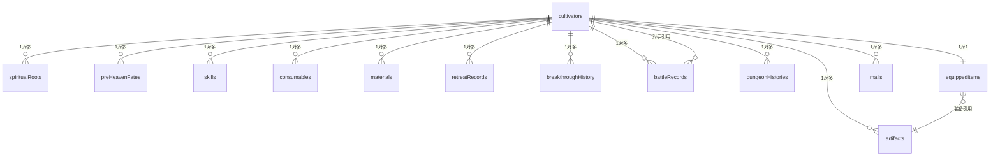

# 数据库表结构详解

<cite>
**本文档引用的文件**   
- [schema.ts](file://lib/drizzle/schema.ts)
- [db.ts](file://lib/drizzle/db.ts)
- [drizzle.config.ts](file://drizzle.config.ts)
- [0017_snapshot.json](file://drizzle/meta/0017_snapshot.json)
- [0000_snapshot.json](file://drizzle/meta/0000_snapshot.json)
- [0016_snapshot.json](file://drizzle/meta/0016_snapshot.json)
- [cultivatorRepository.ts](file://lib/repositories/cultivatorRepository.ts)
- [MailService.ts](file://lib/services/MailService.ts)
- [generate-character/route.ts](file://app/api/generate-character/route.ts)
- [mail/route.ts](file://app/api/mail/route.ts)
- [yield/route.ts](file://app/api/cultivators/yield/route.ts)
</cite>

## 目录
1. [引言](#引言)
2. [核心表结构详解](#核心表结构详解)
3. [表结构演进与版本控制](#表结构演进与版本控制)
4. [业务逻辑与表设计关联分析](#业务逻辑与表设计关联分析)
5. [结论](#结论)

## 引言

本文档旨在全面解析修仙游戏“万界道友”的数据库表结构，重点聚焦于`lib/drizzle/schema.ts`中定义的核心数据表。文档将详细阐述`cultivators`、`spiritualRoots`、`preHeavenFates`、`skills`、`artifacts`、`battleRecords`、`mails`等表的字段含义、数据类型、约束条件及其在业务逻辑中的作用。同时，通过分析`drizzle/meta`目录下的快照和SQL迁移文件，揭示表结构的演进过程和版本控制策略，为开发者提供清晰的数据库设计蓝图。

## 核心表结构详解

本节将逐一分析核心数据表的设计意图、字段定义和约束关系。

### cultivators 表：角色核心数据载体

`cultivators`表是整个游戏系统的核心，作为角色（修仙者）的主数据表，承载了角色的所有基础信息和状态。

**表设计意图**：该表作为所有角色相关数据的中心枢纽，通过`id`字段与`spiritualRoots`、`skills`、`artifacts`等子表建立外键关联，形成“1对多”的数据结构。`userId`字段将角色与系统用户绑定，确保数据归属。`status`字段（如'active', 'dead'）用于管理角色生命周期。

**字段详解**：
- **id**: `uuid`类型，主键，使用`gen_random_uuid()`生成，唯一标识一个角色。
- **userId**: `uuid`类型，非空，关联到系统用户，是权限控制的基础。
- **name**: `varchar(100)`类型，非空，存储角色名称。
- **realm** 和 **realm_stage**: 分别存储角色的境界（如“炼气”、“筑基”）和阶段（如“初期”、“圆满”），是游戏核心数值体系的一部分。
- **vitality, spirit, wisdom, speed, willpower**: 五个`integer`类型的属性字段，代表角色的基础能力值。
- **spirit_stones**: `integer`类型，非空，默认0，存储角色拥有的灵石数量。
- **last_yield_at**: `timestamp`类型，默认`now()`，记录角色上次灵石产出的时间，用于定时收益计算。
- **createdAt** 和 **updatedAt**: `timestamp`类型，记录数据的创建和更新时间，`updatedAt`使用`$onUpdate(() => new Date())`实现自动更新。

**Section sources**
- [schema.ts](file://lib/drizzle/schema.ts#L17-L54)

### spiritualRoots 表：灵根属性

`spiritualRoots`表用于存储角色的灵根信息，支持一个角色拥有多个灵根。

**表设计意图**：采用“1对多”设计，一个`cultivator`可以拥有多个`spiritualRoot`。`cultivatorId`字段作为外键，引用`cultivators.id`，并设置`onDelete: 'cascade'`，确保当角色被删除时，其所有灵根数据也随之清除。

**字段详解**：
- **cultivatorId**: `uuid`类型，非空，外键，指向`cultivators`表的`id`。
- **element**: `varchar(10)`类型，非空，存储灵根元素（如“金”、“木”、“水”、“火”、“土”）。
- **strength**: `integer`类型，非空，表示灵根强度（0-100）。
- **grade**: `varchar(20)`类型，可为空，表示灵根品级（如“天灵根”、“真灵根”）。

**Section sources**
- [schema.ts](file://lib/drizzle/schema.ts#L57-L66)

### preHeavenFates 表：先天命格

`preHeavenFates`表用于存储角色的先天命格，同样采用“1对多”设计。

**表设计意图**：与`spiritualRoots`表类似，一个角色可以拥有多个命格。`attribute_mod`字段使用`jsonb`类型，可以灵活存储对各项基础属性的增益或减益，例如`{"vitality": 10, "spirit": -5}`。

**字段详解**：
- **name**: `varchar(100)`类型，非空，命格名称。
- **type**: `varchar(10)`类型，非空，命格类型（“吉”或“凶”）。
- **quality**: `varchar(10)`类型，可为空，命格品质（“凡品”、“灵品”等）。
- **attribute_mod**: `jsonb`类型，非空，存储属性修改的JSON对象。

**Section sources**
- [schema.ts](file://lib/drizzle/schema.ts#L69-L80)

### skills 表：技能系统

`skills`表存储角色所掌握的技能。

**表设计意图**：支持角色学习多个技能。`type`字段定义技能类型（攻击、治疗、控制等），`element`字段定义技能元素，`power`和`cooldown`字段定义技能强度和冷却时间。

**字段详解**：
- **type**: `varchar(20)`类型，非空，技能类型。
- **element**: `varchar(10)`类型，非空，技能元素。
- **power**: `integer`类型，非空，技能威力。
- **cooldown**: `integer`类型，非空，默认0，技能冷却回合数。
- **effect**: `varchar(50)`类型，可为空，技能附加效果（如“burn”、“stun”）。
- **target_self**: `integer`类型，默认0，用0/1表示布尔值，指示技能是否作用于自身。

**Section sources**
- [schema.ts](file://lib/drizzle/schema.ts#L99-L118)

### artifacts 表：法宝系统

`artifacts`表存储角色拥有的法宝。

**表设计意图**：法宝是可由用户后续添加的装备，因此不在角色创建时生成。`slot`字段定义法宝的装备槽位（武器、防具、饰品）。

**字段详解**：
- **slot**: `varchar(20)`类型，非空，装备槽位。
- **bonus**: `jsonb`类型，非空，存储法宝提供的属性加成。
- **special_effects** 和 **curses**: `jsonb`类型，默认`'[]'::jsonb`，存储法宝的特殊效果和诅咒。
- **score**: `integer`类型，非空，默认0，用于法宝的评分或稀有度计算。

**Section sources**
- [schema.ts](file://lib/drizzle/schema.ts#L137-L156)

### battleRecords 表：战斗记录

`battleRecords`表存储每场战斗的完整结果快照。

**表设计意图**：为了保证战斗结果的不可变性，将整个战斗引擎的输出结果（`battleResult`）以`jsonb`格式完整存储。`battleReport`字段存储AI生成的战斗播报文本。

**字段详解**：
- **battleResult**: `jsonb`类型，非空，存储完整的战斗结果对象。
- **battleReport**: `text`类型，可为空，存储AIGC生成的战斗报告。
- **challengeType**: `varchar(20)`类型，可为空，区分挑战类型（‘challenge’, ‘challenged’）。
- **opponentCultivatorId**: `uuid`类型，可为空，外键，引用对手角色ID，`onDelete: 'set null'`确保对手角色删除后记录仍可保留。

**Section sources**
- [schema.ts](file://lib/drizzle/schema.ts#L241-L264)

### mails 表：邮件系统

`mails`表用于实现游戏内的邮件或传音玉简功能。

**表设计意图**：支持系统通知和奖励发放。`attachments`字段使用`jsonb`类型，可以灵活存储附件信息，如物品、灵石等。

**字段详解**：
- **type**: `varchar(20)`类型，非空，默认'system'，区分系统邮件和奖励邮件。
- **attachments**: `jsonb`类型，可为空，存储附件数组，例如`[{"type": "spirit_stones", "quantity": 100}, {"type": "artifact", "id": "xxx", "name": "青锋剑"}]`。
- **isRead** 和 **isClaimed**: `boolean`类型，非空，默认`false`，分别表示邮件是否已读和奖励是否已领取。

**Section sources**
- [schema.ts](file://lib/drizzle/schema.ts#L267-L279)

### equippedItems 表：1对1装备关系

`equippedItems`表实现角色与装备的1对1关系。

**表设计意图**：此表是`cultivators`表的扩展，通过`cultivatorId`字段建立唯一关联（`.unique()`）。表中的`weapon_id`、`armor_id`、`accessory_id`字段分别引用`artifacts`表的`id`，实现装备的绑定。当角色装备更换时，只需更新此表，而不会影响`artifacts`主表。

**字段详解**：
- **cultivatorId**: `uuid`类型，非空，唯一，外键，引用`cultivators.id`。
- **weapon_id**, **armor_id**, **accessory_id**: `uuid`类型，可为空，外键，引用`artifacts.id`，`onDelete: 'set null'`确保法宝删除后装备槽位清空。

**Section sources**
- [schema.ts](file://lib/drizzle/schema.ts#L209-L228)

### tempCultivators 表：AI生成角色流程

`tempCultivators`表支持AI生成角色的临时存储流程。

**表设计意图**：在用户确认创建角色前，将AI生成的完整角色数据（`cultivatorData`）和可选的先天气运（`availableFates`）存储在此表中。`expiresAt`字段设置过期时间，防止临时数据无限堆积。

**字段详解**：
- **cultivatorData**: `jsonb`类型，非空，存储完整的`Cultivator`对象。
- **availableFates**: `jsonb`类型，可为空，存储10个可选的先天气运列表。
- **expiresAt**: `timestamp`类型，可为空，程序中设置，用于自动清理过期数据。

**Section sources**
- [schema.ts](file://lib/drizzle/schema.ts#L231-L238)

## 表结构演进与版本控制

通过分析`drizzle/meta`目录下的快照和迁移文件，可以清晰地看到数据库的演进过程。

### 演进过程分析

`_journal.json`文件记录了所有18次迁移，从`0000_equal_the_fury`到最新的`0017_good_jimmy_woo`。每次迁移都对应一个`.sql`文件和一个`.json`快照。

- **初始状态 (0000_snapshot.json)**：最早的快照显示，`artifacts`表缺少`quality`、`description`、`score`等字段，`consumables`表也缺少`quality`和`score`字段。这表明初期设计较为简单。
- **中期演进 (0016_snapshot.json)**：在`0016`快照中，`artifacts`、`consumables`、`skills`等表已添加了`quality`、`score`、`description`等字段，功能趋于完善。
- **最终状态 (0017_snapshot.json)**：最新的`0017`快照与`0016`相比，主要变化是新增了`wanjiedaoyou_dungeon_histories`表，用于记录单人副本的历史。对应的`0017_good_jimmy_woo.sql`文件内容证实了这一点，它只包含创建`dungeon_histories`表的SQL语句。

**Diagram sources **
- [schema.ts](file://lib/drizzle/schema.ts)
- [0017_snapshot.json](file://drizzle/meta/0017_snapshot.json)

**Section sources**
- [0000_snapshot.json](file://drizzle/meta/0000_snapshot.json)
- [0016_snapshot.json](file://drizzle/meta/0016_snapshot.json)
- [0017_snapshot.json](file://drizzle/meta/0017_snapshot.json)
- [0017_good_jimmy_woo.sql](file://drizzle/0017_good_jimmy_woo.sql)
- [_journal.json](file://drizzle/meta/_journal.json)

## 业务逻辑与表设计关联分析

数据库表的设计与业务逻辑紧密相连，以下通过代码示例说明其关联性。

### 角色创建流程

在`lib/repositories/cultivatorRepository.ts`中，`createCultivator`函数展示了如何将一个完整的`Cultivator`对象持久化到数据库。它在一个事务中依次插入`cultivators`主表、`spiritualRoots`、`preHeavenFates`、`skills`等子表数据，并初始化`equippedItems`表。这完美体现了“主-从”表结构的设计。

**Section sources**
- [cultivatorRepository.ts](file://lib/repositories/cultivatorRepository.ts#L182-L286)

### AI生成角色流程

`app/api/generate-character/route.ts`是AI生成角色的入口。它调用`characterEngine`生成角色后，将数据通过`redisCultivatorRepository`保存到Redis（临时存储），并返回一个`tempCultivatorId`。用户确认后，会调用另一个API将`tempCultivatorId`对应的数据从Redis取出，再通过`createCultivator`保存到正式的数据库表中。这解释了`tempCultivators`表（或其Redis替代方案）在整个流程中的关键作用。

**Section sources**
- [generate-character/route.ts](file://app/api/generate-character/route.ts)
- [redisCultivatorRepository.ts](file://lib/repositories/redisCultivatorRepository.ts)

### 邮件系统实现

`lib/services/MailService.ts`中的`sendMail`方法直接向`mails`表插入数据。`app/api/mail/route.ts`中的`GET`方法则根据`cultivatorId`查询该角色的所有邮件。`attachments`字段的`jsonb`设计使得发送包含多种奖励的邮件变得非常灵活。

**Section sources**
- [MailService.ts](file://lib/services/MailService.ts)
- [mail/route.ts](file://app/api/mail/route.ts)

### 灵石产出逻辑

在`app/api/cultivators/yield/route.ts`中，`yield`接口会计算自`last_yield_at`以来的时长，按比例发放灵石，并更新`cultivators`表的`spirit_stones`和`last_yield_at`字段。同时，它还会调用`generateRandomMaterials`生成材料，并插入到`materials`表中。这直接关联了`cultivators`表的`spirit_stones`和`last_yield_at`字段与`materials`表。

**Section sources**
- [yield/route.ts](file://app/api/cultivators/yield/route.ts)

## 结论

本文档详细解析了“万界道友”游戏的数据库核心表结构。`cultivators`表作为核心，通过外键与多个“1对多”子表（如`spiritualRoots`, `skills`, `artifacts`）关联，构建了角色的完整数据模型。`equippedItems`表通过“1对1”设计实现了装备状态的管理。`tempCultivators`表（或Redis）巧妙地支持了AI生成角色的临时流程。`mails`表利用`jsonb`字段实现了灵活的邮件和奖励系统。通过分析迁移历史，可以看出数据库从简单到复杂、功能逐步完善的演进过程。整体设计合理，充分考虑了业务需求和数据一致性，为游戏的稳定运行提供了坚实的数据基础。