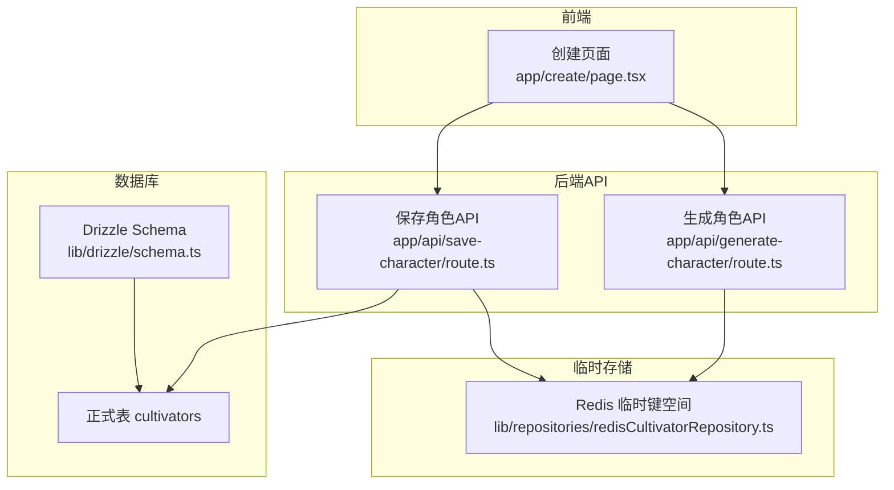
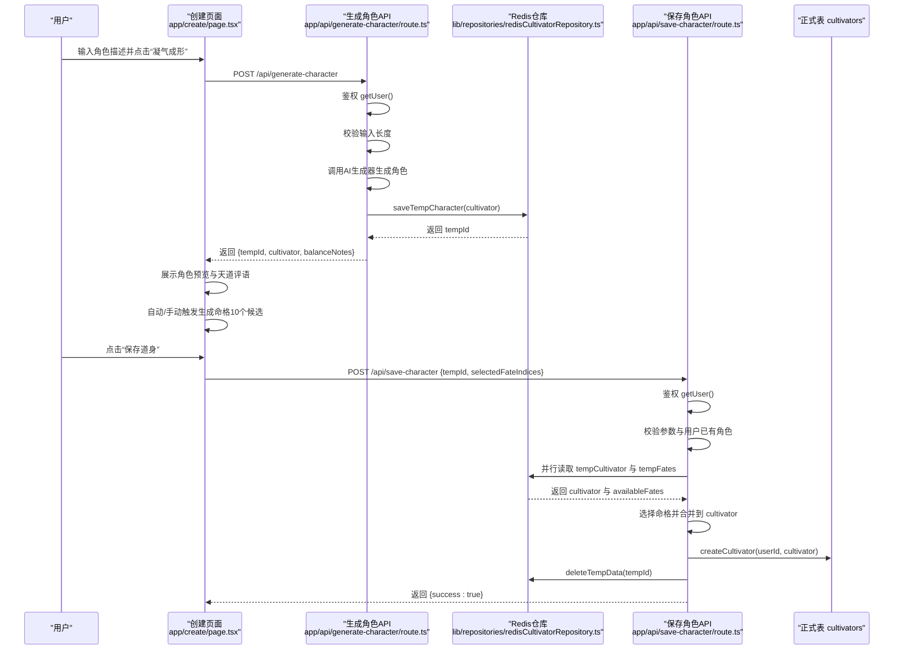
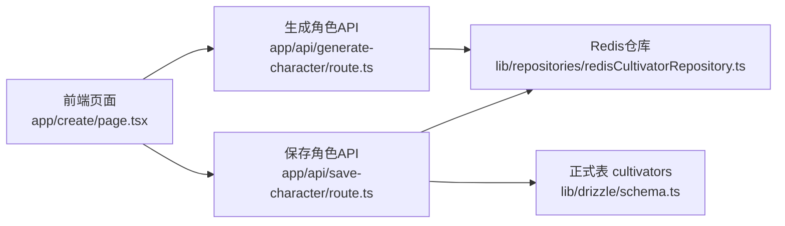
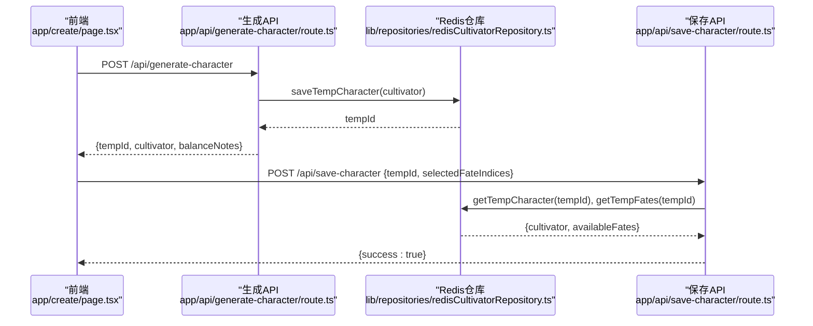

# 临时角色表 (tempCultivators)

<cite>
**本文引用的文件**
- [app/api/generate-character/route.ts](file://app/api/generate-character/route.ts)
- [app/create/page.tsx](file://app/create/page.tsx)
- [lib/repositories/redisCultivatorRepository.ts](file://lib/repositories/redisCultivatorRepository.ts)
- [app/api/save-character/route.ts](file://app/api/save-character/route.ts)
- [lib/drizzle/schema.ts](file://lib/drizzle/schema.ts)
- [types/cultivator.ts](file://types/cultivator.ts)
- [utils/characterEngine.ts](file://utils/characterEngine.ts)
</cite>

## 目录
1. [简介](#简介)
2. [项目结构](#项目结构)
3. [核心组件](#核心组件)
4. [架构总览](#架构总览)
5. [详细组件分析](#详细组件分析)
6. [依赖关系分析](#依赖关系分析)
7. [性能考量](#性能考量)
8. [故障排查指南](#故障排查指南)
9. [结论](#结论)
10. [附录](#附录)

## 简介
本文件围绕临时角色表（tempCultivators）展开，聚焦其在“AI生成角色”流程中的关键作用。文档将详细说明：
- id 与 userId 的关联机制，确保临时数据绑定到正确用户；
- cultivatorData 字段作为 JSONB 类型如何存储完整的角色对象（含境界、属性、命格、功法等），支持灵活的结构化存储；
- availableFates 字段如何保存10个可选的先天气运供用户挑选，其 JSONB 结构设计如何支持动态选项展示；
- expiresAt 过期时间的设计目的——防止临时数据无限堆积，通常设置为10-15分钟，超时后前端需重新生成；
- generate-character API 路由说明该表的写入流程：用户提交提示词 → AI生成角色 → 数据存入 tempCultivators → 返回临时ID；
- create 页面如何读取该表数据并展示给用户确认，以及确认后如何将数据迁移至正式 cultivators 表并清除临时记录；
- 该表的索引优化建议，确保按 userId 和 expiresAt 的高效查询与清理任务执行。

## 项目结构
临时角色表涉及前后端协作的关键路径如下：
- 前端页面：负责引导用户输入、展示AI生成的角色与命格、确认保存；
- API 层：负责鉴权、调用AI生成器、写入临时数据、读取临时数据并迁移至正式表；
- 临时存储：使用 Redis 作为临时载体，配合 expiresAt 控制生命周期；
- 正式表：最终持久化到 Postgres 的 cultivators 表。

图表来源
- [app/create/page.tsx](file://app/create/page.tsx#L105-L155)
- [app/api/generate-character/route.ts](file://app/api/generate-character/route.ts#L13-L79)
- [lib/repositories/redisCultivatorRepository.ts](file://lib/repositories/redisCultivatorRepository.ts#L12-L21)
- [app/api/save-character/route.ts](file://app/api/save-character/route.ts#L62-L110)
- [lib/drizzle/schema.ts](file://lib/drizzle/schema.ts#L230-L238)

章节来源
- [app/create/page.tsx](file://app/create/page.tsx#L105-L155)
- [app/api/generate-character/route.ts](file://app/api/generate-character/route.ts#L13-L79)
- [lib/repositories/redisCultivatorRepository.ts](file://lib/repositories/redisCultivatorRepository.ts#L12-L21)
- [app/api/save-character/route.ts](file://app/api/save-character/route.ts#L62-L110)
- [lib/drizzle/schema.ts](file://lib/drizzle/schema.ts#L230-L238)

## 核心组件
- 临时角色表（tempCultivators）
  - 字段：id、userId、cultivatorData（JSONB）、availableFates（JSONB）、createdAt、expiresAt
  - 设计要点：通过 userId 绑定用户；cultivatorData 以 JSONB 存储完整角色对象；availableFates 存储命格候选；expiresAt 控制生命周期
- 临时数据仓库（Redis）
  - 临时角色键：temp_cultivator:{tempId}
  - 临时命格键：temp_fates:{tempId}
  - 重投计数键：reroll_count:{tempId}
  - TTL：统一设置为1小时（3600秒）
- 生成角色 API
  - 鉴权、校验输入、调用 AI 生成器、写入 Redis、返回临时ID
- 保存角色 API
  - 鉴权、校验参数、从 Redis 读取临时数据、合并命格、写入正式表、清理临时数据

章节来源
- [lib/drizzle/schema.ts](file://lib/drizzle/schema.ts#L230-L238)
- [lib/repositories/redisCultivatorRepository.ts](file://lib/repositories/redisCultivatorRepository.ts#L12-L21)
- [app/api/generate-character/route.ts](file://app/api/generate-character/route.ts#L13-L79)
- [app/api/save-character/route.ts](file://app/api/save-character/route.ts#L18-L127)

## 架构总览
下面的序列图展示了从用户提交提示词到最终保存为正式角色的完整流程，以及临时数据在 Redis 中的生命周期管理。

图表来源
- [app/create/page.tsx](file://app/create/page.tsx#L105-L155)
- [app/api/generate-character/route.ts](file://app/api/generate-character/route.ts#L13-L79)
- [lib/repositories/redisCultivatorRepository.ts](file://lib/repositories/redisCultivatorRepository.ts#L12-L21)
- [app/api/save-character/route.ts](file://app/api/save-character/route.ts#L18-L127)

## 详细组件分析

### 临时角色表（tempCultivators）字段与约束
- id：UUID 主键，自动生成
- userId：非空，绑定当前登录用户
- cultivatorData：JSONB，存储完整角色对象（含境界、属性、命格、功法、技能、背景等）
- availableFates：JSONB，存储命格候选（如10个先天气运）
- createdAt：默认当前时间
- expiresAt：过期时间，用于生命周期控制

章节来源
- [lib/drizzle/schema.ts](file://lib/drizzle/schema.ts#L230-L238)

### AI生成角色流程（generate-character）
- 鉴权：通过 Supabase 获取当前用户
- 输入校验：提示词长度限制
- 调用 AI 生成器：返回结构化角色对象，并经平衡性调整
- 写入临时存储：将角色对象序列化后存入 Redis，返回 tempId
- 返回响应：包含 tempId、角色对象、平衡性说明

章节来源
- [app/api/generate-character/route.ts](file://app/api/generate-character/route.ts#L13-L79)
- [utils/characterEngine.ts](file://utils/characterEngine.ts#L134-L181)
- [lib/repositories/redisCultivatorRepository.ts](file://lib/repositories/redisCultivatorRepository.ts#L12-L21)

### 命格候选与重投机制（availableFates 与 reroll）
- 命格候选：前端调用 /api/generate-fates 获取10个候选命格，存入 Redis 的 temp_fates:{tempId}，并设置 TTL
- 重投计数：每次调用会递增 reroll_count:{tempId}，首次递增时设置 TTL；超过最大次数（如5次）则不允许继续重投
- 前端展示：根据 availableFates 渲染命格列表，用户可选择3个命格

章节来源
- [app/create/page.tsx](file://app/create/page.tsx#L73-L103)
- [lib/repositories/redisCultivatorRepository.ts](file://lib/repositories/redisCultivatorRepository.ts#L34-L54)
- [lib/repositories/redisCultivatorRepository.ts](file://lib/repositories/redisCultivatorRepository.ts#L56-L90)

### 保存角色到正式表（save-character）
- 鉴权与参数校验：确认 tempId 有效、selectedFateIndices 为3个合法索引
- 读取临时数据：并行读取 tempCultivator 与 tempFates
- 合并命格：将用户选择的3个命格写入 cultivator.pre_heaven_fates
- 写入正式表：createCultivator(userId, cultivator)
- 清理临时数据：删除 temp_cultivator:{tempId}、temp_fates:{tempId}、reroll_count:{tempId}

章节来源
- [app/api/save-character/route.ts](file://app/api/save-character/route.ts#L18-L127)
- [lib/repositories/redisCultivatorRepository.ts](file://lib/repositories/redisCultivatorRepository.ts#L92-L103)

### 前端创建页面（create/page.tsx）的数据流转
- 生成角色：调用 /api/generate-character，接收 tempId 与角色对象，展示预览与天道评语
- 生成命格：调用 /api/generate-fates，接收可用命格与剩余重投次数
- 保存确认：弹窗确认后调用 /api/save-character，成功后刷新并跳转首页

章节来源
- [app/create/page.tsx](file://app/create/page.tsx#L105-L155)
- [app/create/page.tsx](file://app/create/page.tsx#L170-L212)
- [app/create/page.tsx](file://app/create/page.tsx#L214-L252)

### 数据模型与 JSONB 结构
- 角色对象（Cultivator）：包含 name、gender、origin、personality、realm、realm_stage、age、lifespan、attributes、spiritual_roots、pre_heaven_fates、cultivations、skills、inventory、equipped、max_skills、spirit_stones、background、prompt、balance_notes 等字段
- 命格（PreHeavenFate）：包含 name、type（吉/凶）、quality（品质）、attribute_mod（属性加成映射）、description
- 功法（CultivationTechnique）：包含 name、grade、bonus（属性加成）、required_realm
- 技能（Skill）：包含 name、type、element、grade、power、cost、cooldown、effect、duration、target_self、description

章节来源
- [types/cultivator.ts](file://types/cultivator.ts#L218-L252)
- [types/cultivator.ts](file://types/cultivator.ts#L63-L79)
- [types/cultivator.ts](file://types/cultivator.ts#L80-L103)
- [types/cultivator.ts](file://types/cultivator.ts#L104-L171)

### 临时数据的生命周期与过期控制
- Redis TTL：临时角色与命格键统一设置为1小时（3600秒）
- 重投计数键：首次递增时设置 TTL，避免长期占用键空间
- expiresAt 字段：在 Postgres 的 tempCultivators 表中存在 expiresAt 字段，用于未来可能的数据库级清理策略（当前流程主要依赖 Redis TTL）

章节来源
- [lib/repositories/redisCultivatorRepository.ts](file://lib/repositories/redisCultivatorRepository.ts#L4-L8)
- [lib/repositories/redisCultivatorRepository.ts](file://lib/repositories/redisCultivatorRepository.ts#L12-L21)
- [lib/drizzle/schema.ts](file://lib/drizzle/schema.ts#L230-L238)

## 依赖关系分析
- 前端依赖后端 API 提供的临时ID与命格候选
- 后端 API 依赖 Supabase 进行用户鉴权
- 临时数据依赖 Redis 提供高吞吐、低延迟的临时存储
- 正式数据最终落库到 Postgres 的 cultivators 表

图表来源
- [app/create/page.tsx](file://app/create/page.tsx#L105-L155)
- [app/api/generate-character/route.ts](file://app/api/generate-character/route.ts#L13-L79)
- [lib/repositories/redisCultivatorRepository.ts](file://lib/repositories/redisCultivatorRepository.ts#L12-L21)
- [app/api/save-character/route.ts](file://app/api/save-character/route.ts#L62-L110)
- [lib/drizzle/schema.ts](file://lib/drizzle/schema.ts#L17-L54)

## 性能考量
- Redis 临时存储的优势：高并发、低延迟、TTL 自动回收，适合短生命周期的临时数据
- JSONB 存储优势：无需严格的模式约束，便于快速迭代角色结构；但需注意查询与索引策略
- 命格候选数量：10个候选在前端渲染与选择上应保持流畅，避免一次性加载过多数据
- 重投次数限制：通过计数键限制重投次数，避免滥用与资源浪费

[本节为通用性能讨论，不直接分析具体文件]

## 故障排查指南
- 生成角色失败
  - 检查 /api/generate-character 的鉴权与输入校验逻辑
  - 查看 AI 生成器返回是否为空或格式异常
- 命格生成失败
  - 检查 /api/generate-fates 是否正确读取 tempId
  - 确认 Redis 中 temp_fates:{tempId} 是否存在且未过期
- 保存角色失败
  - 检查 /api/save-character 的参数校验与用户已有角色限制
  - 确认 Redis 中 temp_cultivator:{tempId} 与 temp_fates:{tempId} 是否存在
  - 若出现“数据已过期”，提示用户重新生成
- 临时数据未清理
  - 检查 Redis TTL 设置与计数键递增逻辑
  - 确认保存成功后调用了 deleteTempData

章节来源
- [app/api/generate-character/route.ts](file://app/api/generate-character/route.ts#L13-L79)
- [app/create/page.tsx](file://app/create/page.tsx#L73-L103)
- [app/api/save-character/route.ts](file://app/api/save-character/route.ts#L62-L110)
- [lib/repositories/redisCultivatorRepository.ts](file://lib/repositories/redisCultivatorRepository.ts#L92-L103)

## 结论
临时角色表（tempCultivators）在本项目的“AI生成角色”流程中承担了关键的桥梁作用：它通过 userId 将临时数据与用户绑定，通过 JSONB 字段存储完整的角色对象与命格候选，并通过 expiresAt/Redis TTL 实现生命周期控制。前端在创建页面中基于临时ID展示角色与命格，用户确认后通过保存API将数据迁移至正式表并清理临时记录。该方案兼顾了灵活性与性能，适合短生命周期的临时数据管理。

[本节为总结性内容，不直接分析具体文件]

## 附录

### 临时角色表（tempCultivators）字段定义
- id：UUID 主键
- userId：非空，绑定用户
- cultivatorData：JSONB，完整角色对象
- availableFates：JSONB，命格候选
- createdAt：默认当前时间
- expiresAt：过期时间

章节来源
- [lib/drizzle/schema.ts](file://lib/drizzle/schema.ts#L230-L238)

### 临时数据仓库（Redis）键空间与 TTL
- temp_cultivator:{tempId}：存储角色对象
- temp_fates:{tempId}：存储命格候选
- reroll_count:{tempId}：重投计数，首次递增时设置 TTL
- TTL：统一为1小时（3600秒）

章节来源
- [lib/repositories/redisCultivatorRepository.ts](file://lib/repositories/redisCultivatorRepository.ts#L4-L8)
- [lib/repositories/redisCultivatorRepository.ts](file://lib/repositories/redisCultivatorRepository.ts#L12-L21)
- [lib/repositories/redisCultivatorRepository.ts](file://lib/repositories/redisCultivatorRepository.ts#L34-L54)
- [lib/repositories/redisCultivatorRepository.ts](file://lib/repositories/redisCultivatorRepository.ts#L56-L90)

### 生成与保存流程的时序图（代码级映射）

图表来源
- [app/create/page.tsx](file://app/create/page.tsx#L105-L155)
- [app/api/generate-character/route.ts](file://app/api/generate-character/route.ts#L13-L79)
- [lib/repositories/redisCultivatorRepository.ts](file://lib/repositories/redisCultivatorRepository.ts#L12-L21)
- [app/api/save-character/route.ts](file://app/api/save-character/route.ts#L62-L110)