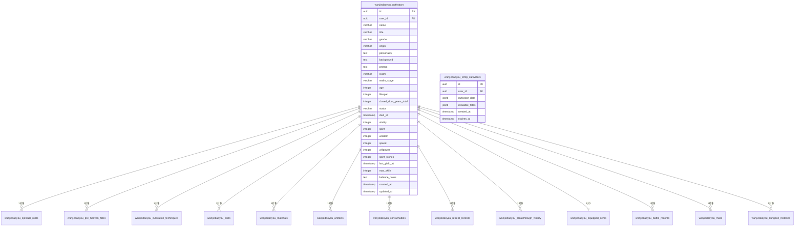
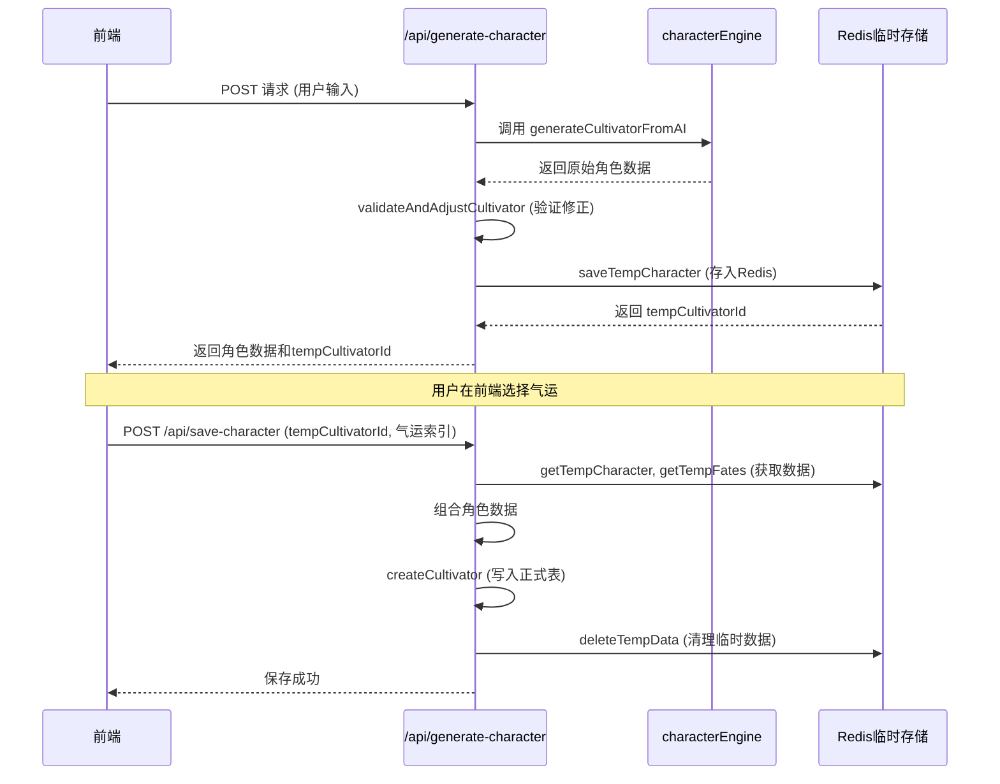

# 核心主表

<cite>
**本文档引用的文件**
- [schema.ts](file://lib/drizzle/schema.ts)
- [cultivatorRepository.ts](file://lib/repositories/cultivatorRepository.ts)
- [redisCultivatorRepository.ts](file://lib/repositories/redisCultivatorRepository.ts)
- [generate-character/route.ts](file://app/api/generate-character/route.ts)
- [save-character/route.ts](file://app/api/save-character/route.ts)
- [characterEngine.ts](file://utils/characterEngine.ts)
- [cultivator.ts](file://types/cultivator.ts)
</cite>

## 目录
1. [引言](#引言)
2. [主表结构分析](#主表结构分析)
3. [cultivators表字段详解](#cultivators表字段详解)
4. [tempCultivators表与AI生成流程](#tempcultivators表与ai生成流程)
5. [角色生命周期管理](#角色生命周期管理)
6. [数据持久化与代码示例](#数据持久化与代码示例)
7. [主外键关系与级联删除](#主外键关系与级联删除)
8. [索引设计与查询优化](#索引设计与查询优化)
9. [结论](#结论)

## 引言
本项目为修仙题材游戏，核心数据模型围绕“修仙者”（cultivator）展开。系统设计了`cultivators`主表用于存储正式角色数据，以及`tempCultivators`临时表（实际通过Redis实现）用于支持AI生成角色的流程。本文档将深入分析这两张核心表的结构设计、业务含义及其在系统中的作用。

**Section sources**
- [schema.ts](file://lib/drizzle/schema.ts)

## 主表结构分析
系统采用PostgreSQL作为主数据库，通过Drizzle ORM进行模式定义。`cultivators`表是整个游戏数据模型的核心，所有与角色相关的数据（如灵根、功法、技能等）均通过外键关联到此表。`tempCultivators`表的设计则体现了临时数据与持久化数据分离的思想，确保了AI生成流程的原子性和用户体验的流畅性。

**Diagram sources**
- [schema.ts](file://lib/drizzle/schema.ts)

**Section sources**
- [schema.ts](file://lib/drizzle/schema.ts)

## cultivators表字段详解
`cultivators`表存储了修仙者的所有核心属性和状态，是角色生命周期管理的基础。

### 境界与状态字段
- **realm（境界）**: 修仙者的核心等级，如“炼气”、“筑基”、“金丹”等。该字段决定了角色可学习的功法和技能等级。
- **realm_stage（阶段）**: 境界的细分阶段，包括“初期”、“中期”、“后期”和“圆满”。它影响角色的属性成长和突破成功率。
- **status（状态）**: 角色当前状态，主要为“active”（活跃）或“dead”（死亡）。系统通过此字段过滤有效角色。
- **age（年龄）与lifespan（寿命）**: 记录角色的当前年龄和总寿命，用于模拟修仙者的生命周期和寿元限制。
- **closedDoorYearsTotal（闭关总年数）**: 累计闭关修炼的年数，是角色修为积累的重要指标。

### 基础属性字段
- **vitality（体魄）**: 影响气血上限和伤害减免。
- **spirit（灵力）**: 影响法术伤害和灵力上限。
- **wisdom（悟性）**: 影响暴击率和突破几率。
- **speed（速度）**: 决定出手顺序和闪避率。
- **willpower（神识）**: 影响状态抗性和暴击伤害。

### 资源与经济字段
- **spirit_stones（灵石）**: 角色拥有的灵石数量，是游戏内的主要货币，用于购买物品、学习技能等。

### 其他核心字段
- **name（姓名）与title（称号）**: 角色的名称和称号，用于玩家识别。
- **prompt（提示词）**: 用户输入的原始描述，用于AI生成角色时的上下文。
- **max_skills（最大技能数）**: 角色可拥有的最大技能数量，随境界提升而增加。

**Section sources**
- [schema.ts](file://lib/drizzle/schema.ts)
- [cultivator.ts](file://types/cultivator.ts)

## tempCultivators表与AI生成流程
`tempCultivators`表（在代码中通过Redis实现）是AI生成角色流程的关键组件。它并非传统意义上的数据库表，而是通过Redis的键值存储和TTL（Time To Live）机制实现的临时数据存储。

### cultivatorData JSONB字段
该字段存储了完整的角色数据对象（`Cultivator`类型），其结构与`cultivators`表完全一致。这使得在AI生成角色后，可以将整个对象序列化后存入Redis，等待用户确认。

### expiresAt过期机制
系统为临时角色设置了1小时的过期时间（`TEMP_CHAR_TTL = 3600`秒）。一旦过期，相关数据将被自动清理，避免了数据库的垃圾数据积累。这一机制通过Redis的`EXPIRE`命令实现，确保了临时数据的自动回收。

### AI生成流程
1.  **生成请求**: 用户在前端输入角色描述，调用`/api/generate-character`接口。
2.  **AI处理**: 后端调用`generateCultivatorFromAI`函数，通过大模型生成角色数据。
3.  **数据验证**: 使用`validateAndAdjustCultivator`函数对AI生成的数据进行平衡性校验和修正。
4.  **临时存储**: 将验证后的角色数据通过`saveTempCharacter`函数存入Redis，并返回一个`tempCultivatorId`。
5.  **用户确认**: 用户在前端预览角色并选择气运后，调用`/api/save-character`接口。
6.  **持久化**: 后端通过`createCultivator`函数将角色数据从Redis取出并写入`cultivators`正式表。
7.  **清理**: 成功保存后，调用`deleteTempData`函数清理Redis中的临时数据。

**Diagram sources**
- [generate-character/route.ts](file://app/api/generate-character/route.ts)
- [save-character/route.ts](file://app/api/save-character/route.ts)
- [redisCultivatorRepository.ts](file://lib/repositories/redisCultivatorRepository.ts)

**Section sources**
- [redisCultivatorRepository.ts](file://lib/repositories/redisCultivatorRepository.ts)
- [generate-character/route.ts](file://app/api/generate-character/route.ts)
- [save-character/route.ts](file://app/api/save-character/route.ts)

## 角色生命周期管理
角色的生命周期从AI生成开始，到最终死亡结束。`cultivators`表的`status`字段是管理这一生命周期的核心。

- **创建**: 通过`createCultivator`函数创建新角色，初始`status`为“active”。
- **更新**: 通过`updateCultivator`函数更新角色属性，如境界提升、属性增长等。
- **死亡**: 当角色寿元耗尽或遭遇不测时，将其`status`更新为“dead”，并记录`diedAt`时间。
- **查询**: 系统通过`getCultivatorById`等函数查询角色时，会自动过滤`status`为“active”的记录，确保只返回有效角色。

**Section sources**
- [cultivatorRepository.ts](file://lib/repositories/cultivatorRepository.ts)

## 数据持久化与代码示例
角色的持久化过程是一个典型的数据库事务操作，确保了数据的一致性。

### 创建过程
`createCultivator`函数在一个数据库事务中执行以下步骤：
1.  插入`cultivators`主表记录。
2.  插入`spiritualRoots`（灵根）记录。
3.  插入`preHeavenFates`（先天气运）记录。
4.  插入`cultivationTechniques`（功法）记录。
5.  插入`skills`（技能）记录。
6.  插入`equippedItems`（装备状态）记录。

### 代码示例
虽然不展示具体代码内容，但关键路径如下：
- **角色创建**: `lib/repositories/cultivatorRepository.ts`中的`createCultivator`函数。
- **角色获取**: `lib/repositories/cultivatorRepository.ts`中的`getCultivatorById`函数，该函数会调用`assembleCultivator`来组合所有关联数据。
- **临时数据存储**: `lib/repositories/redisCultivatorRepository.ts`中的`saveTempCharacter`和`getTempCharacter`函数。

**Section sources**
- [cultivatorRepository.ts](file://lib/repositories/cultivatorRepository.ts)
- [redisCultivatorRepository.ts](file://lib/repositories/redisCultivatorRepository.ts)

## 主外键关系与级联删除
数据库设计中广泛使用了主外键约束和级联删除策略，以维护数据的完整性和简化操作。

- **主键**: `cultivators.id`是所有相关表的主键。
- **外键**: 所有子表（如`spiritual_roots`, `skills`等）都包含一个`cultivatorId`外键，指向`cultivators.id`。
- **级联删除**: 在定义外键时，设置了`onDelete: 'cascade'`。这意味着当删除一个`cultivators`记录时，所有关联的子记录（如该角色的所有技能、灵根等）将被数据库自动删除，无需在应用层编写额外的清理逻辑。这极大地简化了`deleteCultivator`函数的实现。

**Section sources**
- [schema.ts](file://lib/drizzle/schema.ts)
- [cultivatorRepository.ts](file://lib/repositories/cultivatorRepository.ts)

## 索引设计与查询优化
虽然项目中未显式定义索引，但根据查询模式，可以推断出以下优化建议：

### 常见查询模式
1.  **按用户ID查询角色**: `WHERE user_id = ? AND status = 'active'`。建议在`(user_id, status)`上创建复合索引。
2.  **按角色ID查询**: `WHERE id = ?`。主键`id`已自动创建索引。
3.  **按境界查询排行榜**: `ORDER BY realm DESC, realm_stage DESC, age ASC`。建议在`(realm, realm_stage, age)`上创建复合索引。

### 优化建议
- **添加复合索引**: 为高频查询的字段组合创建索引，如`(user_id, status)`和`(realm, realm_stage)`。
- **利用JSONB索引**: 对于`cultivator_data`等JSONB字段，如果需要基于其内部字段查询，可以考虑创建GIN索引。
- **定期分析**: 使用`ANALYZE`命令更新表的统计信息，帮助PostgreSQL优化器选择最佳执行计划。

**Section sources**
- [schema.ts](file://lib/drizzle/schema.ts)
- [cultivatorRepository.ts](file://lib/repositories/cultivatorRepository.ts)

## 结论
`cultivators`和`tempCultivators`表的设计体现了清晰的分层思想：前者是稳定、持久的主数据源，后者是短暂、易失的临时工作区。通过主外键和级联删除，系统保证了数据的一致性；通过Redis的TTL机制，实现了临时数据的自动管理。这种设计模式不仅高效，而且易于维护，为游戏的核心玩法提供了坚实的数据基础。