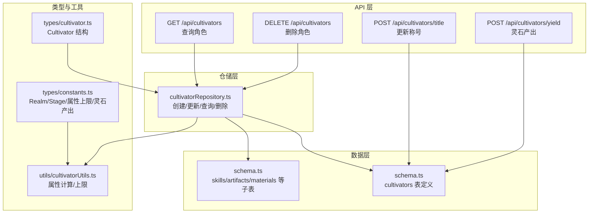
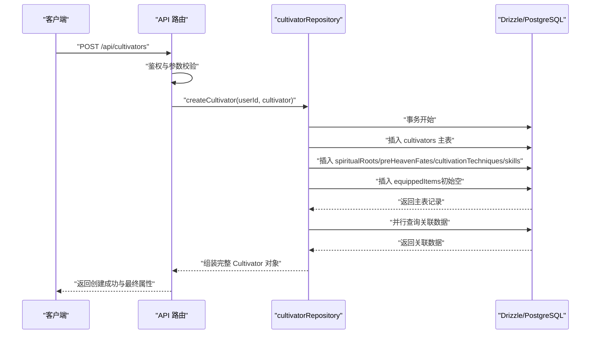
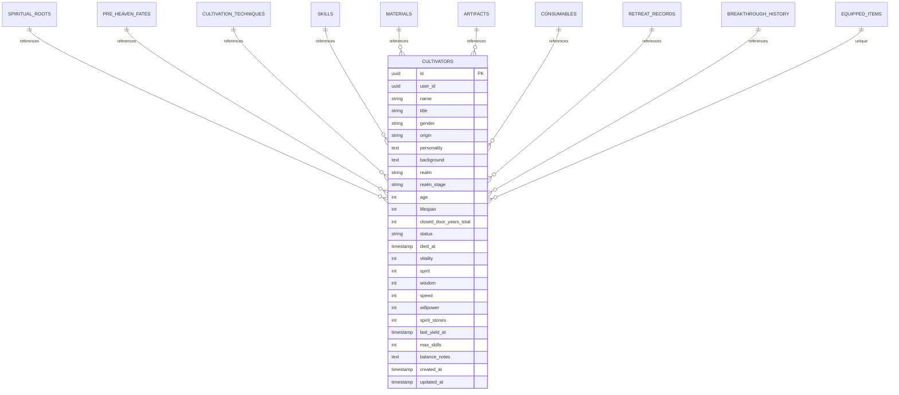
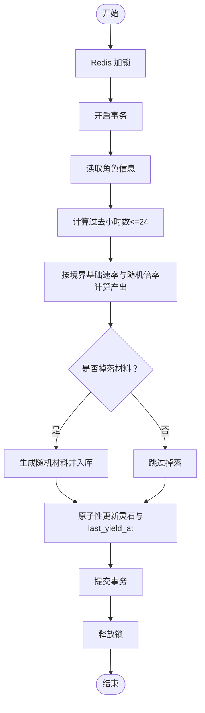
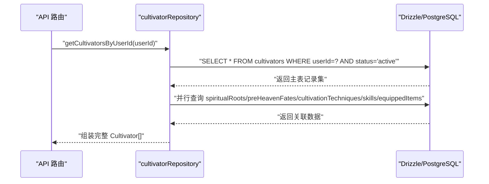
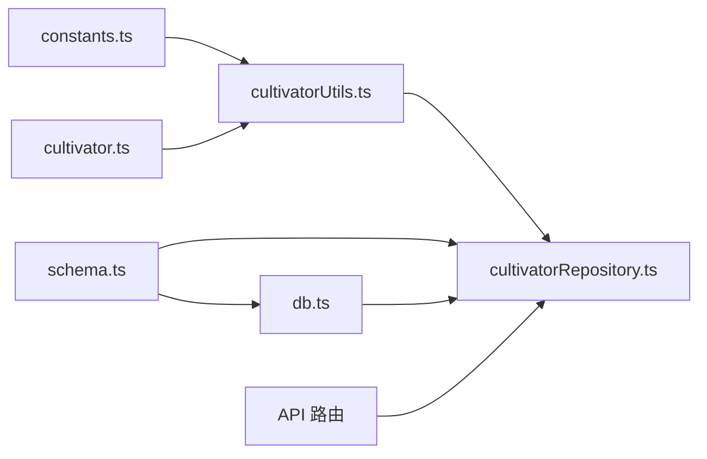

# 角色主表（cultivators）

<cite>
**本文引用的文件**
- [schema.ts](file://lib/drizzle/schema.ts)
- [constants.ts](file://types/constants.ts)
- [cultivator.ts](file://types/cultivator.ts)
- [cultivatorRepository.ts](file://lib/repositories/cultivatorRepository.ts)
- [db.ts](file://lib/drizzle/db.ts)
- [cultivatorUtils.ts](file://utils/cultivatorUtils.ts)
- [route.ts（角色列表/删除）](file://app/api/cultivators/route.ts)
- [route.ts（称号更新）](file://app/api/cultivators/title/route.ts)
- [route.ts（灵石产出）](file://app/api/cultivators/yield/route.ts)
- [0017_snapshot.json](file://drizzle/meta/0017_snapshot.json)
</cite>

## 目录
1. [简介](#简介)
2. [项目结构与定位](#项目结构与定位)
3. [核心组件总览](#核心组件总览)
4. [架构概览](#架构概览)
5. [字段详解与业务语义](#字段详解与业务语义)
6. [详细组件分析](#详细组件分析)
7. [依赖关系与外键约束](#依赖关系与外键约束)
8. [性能与索引优化建议](#性能与索引优化建议)
9. [故障排查指南](#故障排查指南)
10. [结论](#结论)

## 简介
本文件围绕“角色主表（cultivators）”展开，系统化梳理其在修仙游戏中的核心地位与数据契约，覆盖角色身份标识、境界体系、基础属性、货币与产出、生命周期管理、时间戳机制，以及与子表（如技能、法宝等）的外键级联关系。同时，结合仓库层封装与API路由，给出通过 cultivatorRepository 进行角色创建、更新、查询与删除的流程说明，并提供索引优化与外键级联策略建议。

## 项目结构与定位
- 数据层：基于 Drizzle ORM 的 PostgreSQL 表定义位于 schema.ts，统一暴露为数据库模式。
- 类型层：types/cultivator.ts 定义运行时对象结构；types/constants.ts 定义元素、境界、阶段、属性上限、灵石产出等常量。
- 仓储层：lib/repositories/cultivatorRepository.ts 提供角色主表及核心关联数据的组装与事务化写入。
- 工具层：utils/cultivatorUtils.ts 提供属性计算、境界上限、最终属性汇总等逻辑。
- API 层：app/api/cultivators/* 提供角色查询、删除、称号更新、灵石产出等接口，内部调用仓库层或直接使用 Drizzle 查询。

图表来源
- [schema.ts](file://lib/drizzle/schema.ts#L16-L120)
- [cultivatorRepository.ts](file://lib/repositories/cultivatorRepository.ts#L180-L294)
- [route.ts（角色列表/删除）](file://app/api/cultivators/route.ts#L1-L147)
- [route.ts（称号更新）](file://app/api/cultivators/title/route.ts#L1-L67)
- [route.ts（灵石产出）](file://app/api/cultivators/yield/route.ts#L1-L207)
- [cultivatorUtils.ts](file://utils/cultivatorUtils.ts#L1-L198)
- [constants.ts](file://types/constants.ts#L54-L83)

章节来源
- [schema.ts](file://lib/drizzle/schema.ts#L16-L120)
- [cultivatorRepository.ts](file://lib/repositories/cultivatorRepository.ts#L180-L294)
- [route.ts（角色列表/删除）](file://app/api/cultivators/route.ts#L1-L147)
- [route.ts（称号更新）](file://app/api/cultivators/title/route.ts#L1-L67)
- [route.ts（灵石产出）](file://app/api/cultivators/yield/route.ts#L1-L207)
- [cultivatorUtils.ts](file://utils/cultivatorUtils.ts#L1-L198)
- [constants.ts](file://types/constants.ts#L54-L83)

## 核心组件总览
- 角色主表（cultivators）：承载角色身份、境界、属性、货币、状态与时间戳等核心数据。
- 仓储层（cultivatorRepository）：提供事务化创建、权限校验、并行组装关联数据、批量查询等能力。
- 工具层（cultivatorUtils）：计算最终属性、获取境界上限、汇总加成来源。
- API 层：封装鉴权、参数校验、调用仓储层或直接查询，返回最终属性与结构化数据。

章节来源
- [cultivatorRepository.ts](file://lib/repositories/cultivatorRepository.ts#L180-L294)
- [cultivatorUtils.ts](file://utils/cultivatorUtils.ts#L1-L198)

## 架构概览
以下序列图展示“创建角色”的端到端流程，体现仓库层事务、权限校验与关联数据插入。

图表来源
- [route.ts（角色列表/删除）](file://app/api/cultivators/route.ts#L1-L147)
- [cultivatorRepository.ts](file://lib/repositories/cultivatorRepository.ts#L180-L294)
- [schema.ts](file://lib/drizzle/schema.ts#L16-L120)

## 字段详解与业务语义
以下按业务维度梳理字段含义与用途，并标注与常量/工具的对应关系。

- 唯一标识与归属
  - id：UUID 主键，唯一标识角色。
  - userId：UUID，关联用户账户，用于权限校验与索引优化。
  - createdAt/updatedAt：时间戳，默认值与更新钩子，用于审计与排序。

- 角色身份标识
  - name：角色名，必填。
  - title：称号，可空。
  - gender：性别，取值范围见常量。
  - origin/personality/background：背景设定字段，用于叙事与展示。
  - prompt：用户原始输入，保留给兼容与AI入口。

- 境界与年龄寿命
  - realm：境界，取值范围见常量。
  - realm_stage：阶段（初期/中期/后期/圆满），取值范围见常量。
  - age/lifespan：年龄与寿命，用于突破、闭关与寿命管理。
  - closedDoorYearsTotal：闭关累计年数，影响突破与产出。
  - status：角色状态（默认 active），配合 diedAt 实现生命周期管理。

- 基础属性
  - vitality/spirit/wisdom/speed/willpower：体魄、灵力、悟性、身法、神识，直接影响战斗与修炼。
  - 属性上限：受 realm + realm_stage 影响，详见工具函数与常量。

- 货币与产出
  - spirit_stones：灵石，核心货币。
  - last_yield_at：上次灵石自动产出时间，用于计时与产出计算。

- 其他
  - max_skills：最大技能数上限。
  - balance_notes：平衡性备注，便于运营与调试。

章节来源
- [schema.ts](file://lib/drizzle/schema.ts#L16-L54)
- [constants.ts](file://types/constants.ts#L54-L83)
- [cultivator.ts](file://types/cultivator.ts#L21-L27)
- [cultivatorUtils.ts](file://utils/cultivatorUtils.ts#L12-L32)

## 详细组件分析

### 1) 角色主表结构与外键约束
- 主表字段与约束：参见 schema.ts 中 cultivators 定义，含主键、非空、默认值与时间戳钩子。
- 子表外键与级联：
  - spiritualRoots、preHeavenFates、cultivationTechniques、skills、materials、artifacts、consumables、retreatRecords、breakthroughHistory、equippedItems 等均通过 cultivatorId 引用主表 id，并设置 onDelete: 'cascade'，确保删除主表即删除全部关联数据。
  - equippedItems 的 weapon_id/armor_id/accessory_id 引用 artifacts 表，其中部分删除策略为 set null，避免强制级联导致装备丢失。

图表来源
- [schema.ts](file://lib/drizzle/schema.ts#L16-L228)
- [0017_snapshot.json](file://drizzle/meta/0017_snapshot.json#L475-L659)

章节来源
- [schema.ts](file://lib/drizzle/schema.ts#L16-L228)
- [0017_snapshot.json](file://drizzle/meta/0017_snapshot.json#L475-L659)

### 2) 境界与阶段对修为体系的意义
- realm 与 realm_stage 共同决定属性上限与突破条件。工具函数根据 realm + stage 计算上限，API 在返回角色时计算最终属性，体现阶段对瓶颈的限制。
- 常量定义了各境界阶段的上限映射，贯穿属性计算与突破判定。

章节来源
- [constants.ts](file://types/constants.ts#L54-L83)
- [cultivatorUtils.ts](file://utils/cultivatorUtils.ts#L12-L32)

### 3) 基础属性对战斗与修炼的影响
- 体魄（vitality）：影响气血上限与伤害减免。
- 灵力（spirit）：影响法术伤害与蓝量上限。
- 悟性（wisdom）：影响暴击率与突破成功率。
- 身法（speed）：影响出手顺序与闪避率。
- 神识（willpower）：影响抗状态与暴击伤害。
- 最终属性由基础属性 + 先天气运 + 功法 + 装备加成组成，并受阶段上限约束。

章节来源
- [cultivator.ts](file://types/cultivator.ts#L21-L27)
- [cultivatorUtils.ts](file://utils/cultivatorUtils.ts#L34-L194)

### 4) 灵石（spirit_stones）与自动产出（last_yield_at）
- 灵石是核心货币，用于购买材料、装备、丹药与参与活动。
- 自动产出逻辑：
  - 以 last_yield_at 为基准，计算过去小时数（最多24小时），按 realm 对应的基础产出率与随机倍率计算收益。
  - 产出后原子性更新 spirit_stones 与 last_yield_at。
  - 产出期间通过 Redis 分布式锁防止并发重复结算。
  - 可能掉落材料，掉落数量与类型按小时比例生成。

图表来源
- [route.ts（灵石产出）](file://app/api/cultivators/yield/route.ts#L1-L207)
- [constants.ts](file://types/constants.ts#L166-L179)

章节来源
- [route.ts（灵石产出）](file://app/api/cultivators/yield/route.ts#L1-L207)
- [constants.ts](file://types/constants.ts#L166-L179)

### 5) 生命周期管理（status 与 diedAt）
- status 默认 active，支持查询时按状态过滤。
- diedAt 记录死亡时刻，配合 status 实现角色生命周期管理。
- API 层提供“获取最后死亡角色摘要”等能力，便于轮回与重生流程。

章节来源
- [schema.ts](file://lib/drizzle/schema.ts#L33-L36)
- [cultivatorRepository.ts](file://lib/repositories/cultivatorRepository.ts#L540-L578)

### 6) 时间戳机制（createdAt/updatedAt）
- createdAt 默认当前时间，用于审计与排序。
- updatedAt 设置默认值并在更新时自动更新，便于追踪最近变更。

章节来源
- [schema.ts](file://lib/drizzle/schema.ts#L47-L54)
- [db.ts](file://lib/drizzle/db.ts#L1-L13)

### 7) 通过 cultivatorRepository 进行角色 CRUD 流程
- 创建角色（createCultivator）：
  - 事务内插入主表与关联表（灵根、先天气运、功法、技能、装备状态初始化）。
  - 返回主表记录后并行组装关联数据，返回完整 Cultivator 对象。
- 查询角色：
  - 按 userId + status 过滤，支持单个与批量查询。
  - 组装逻辑包括：灵根、先天气运、功法、技能、装备状态、延迟加载的消耗品/材料。
- 更新角色（updateCultivator）：
  - 权限校验后按需更新 name/gender/origin/personality/background/realm/realm_stage/age/lifespan/attributes/max_skills/closed_door_years_total/status 等字段。
- 删除角色（deleteCultivator）：
  - 由于主表 onDelete: 'cascade'，删除主表会级联删除所有子表数据。

图表来源
- [cultivatorRepository.ts](file://lib/repositories/cultivatorRepository.ts#L345-L366)
- [cultivatorRepository.ts](file://lib/repositories/cultivatorRepository.ts#L320-L344)

章节来源
- [cultivatorRepository.ts](file://lib/repositories/cultivatorRepository.ts#L180-L294)
- [cultivatorRepository.ts](file://lib/repositories/cultivatorRepository.ts#L320-L366)
- [cultivatorRepository.ts](file://lib/repositories/cultivatorRepository.ts#L580-L652)
- [cultivatorRepository.ts](file://lib/repositories/cultivatorRepository.ts#L711-L744)

### 8) 基于 userId 的索引查询优化建议
- 当前 schema 未显式声明索引，但 API 查询与仓库层使用 userId 与 status 进行过滤。
- 建议在数据库层面为以下列组合建立复合索引，以提升查询性能：
  - (userId, status)
  - (userId, status, createdAt)
  - (userId, status, updatedAt)
- 若存在高频按 id 查询的场景，可考虑为 id 建立索引（通常主键已隐含索引）。

章节来源
- [route.ts（角色列表/删除）](file://app/api/cultivators/route.ts#L1-L147)
- [cultivatorRepository.ts](file://lib/repositories/cultivatorRepository.ts#L296-L317)
- [cultivatorRepository.ts](file://lib/repositories/cultivatorRepository.ts#L345-L366)

### 9) 与其他子表的外键级联策略
- 子表均通过 cultivatorId 引用主表 id，且多数设置 onDelete: 'cascade'，保证删除主表时清理所有关联数据。
- equippedItems 的武器/防具/饰品引用 artifacts，删除策略为 set null，避免强制级联导致装备丢失。

章节来源
- [schema.ts](file://lib/drizzle/schema.ts#L56-L228)
- [0017_snapshot.json](file://drizzle/meta/0017_snapshot.json#L126-L215)
- [0017_snapshot.json](file://drizzle/meta/0017_snapshot.json#L725-L800)

## 依赖关系与外键约束
- 数据层依赖：schema.ts 定义表结构与外键，drizzle/meta/* 记录迁移快照。
- 类型层依赖：constants.ts 提供 realm/stage/属性上限/灵石产出等常量；cultivator.ts 定义运行时结构。
- 仓储层依赖：db.ts 提供 Drizzle 实例；cultivatorRepository.ts 使用 Drizzle ORM 进行查询与事务。
- 工具层依赖：cultivatorUtils.ts 依赖 constants.ts 的上限与产出常量。

图表来源
- [schema.ts](file://lib/drizzle/schema.ts#L16-L228)
- [db.ts](file://lib/drizzle/db.ts#L1-L13)
- [constants.ts](file://types/constants.ts#L54-L83)
- [cultivator.ts](file://types/cultivator.ts#L218-L253)
- [cultivatorUtils.ts](file://utils/cultivatorUtils.ts#L1-L198)
- [cultivatorRepository.ts](file://lib/repositories/cultivatorRepository.ts#L180-L294)

## 性能与索引优化建议
- 为高频过滤字段建立复合索引：(userId, status)、(userId, status, createdAt/updatedAt)。
- 对于大量读取的场景，优先使用仓库层提供的批量查询接口，减少 N+1 查询。
- 灵石产出接口已采用 Redis 分布式锁与事务，避免并发重复结算；建议监控锁超时与事务回滚情况。

[本节为通用建议，无需特定文件来源]

## 故障排查指南
- 未授权访问：API 层通过 Supabase 鉴权，若返回 401/403，请检查用户登录态与角色归属。
- 角色不存在：查询时需同时校验 userId 与 status，确保只返回 active 角色。
- 并发产出冲突：灵石产出接口使用 Redis 锁，若频繁触发 429，请检查锁释放逻辑与网络延迟。
- 属性异常：最终属性由基础属性 + 先天气运 + 功法 + 装备加成组成，且受阶段上限约束，建议核对 realm 与 realm_stage 是否正确。

章节来源
- [route.ts（角色列表/删除）](file://app/api/cultivators/route.ts#L1-L147)
- [route.ts（灵石产出）](file://app/api/cultivators/yield/route.ts#L1-L207)
- [cultivatorRepository.ts](file://lib/repositories/cultivatorRepository.ts#L320-L366)

## 结论
角色主表（cultivators）是修仙游戏的核心数据载体，承载身份、境界、属性、货币与生命周期等关键要素。通过仓库层的事务化写入与并行组装，结合 API 层的鉴权与最终属性计算，系统实现了高一致性与高性能的角色管理。配合合理的索引策略与外键级联设计，可进一步提升查询效率与数据完整性。灵石产出机制体现了时间驱动的经济循环，为玩家提供持续收益与叙事体验。