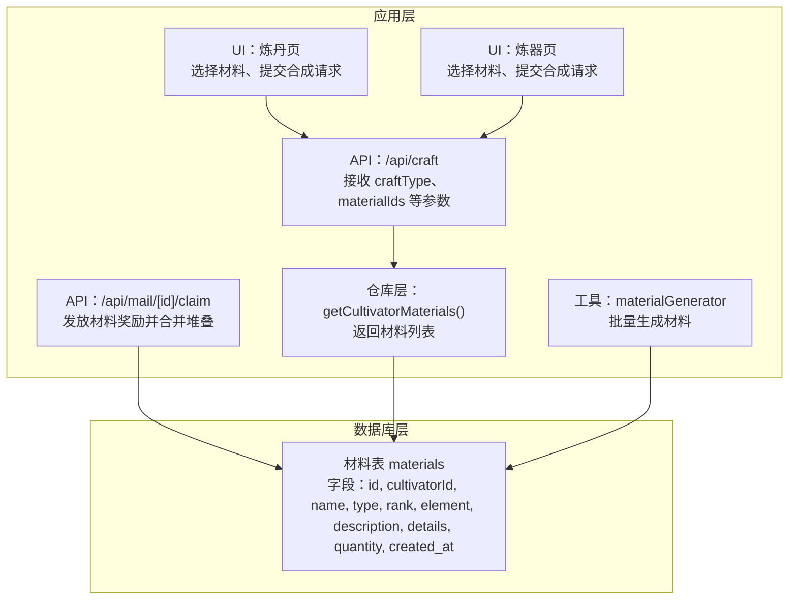
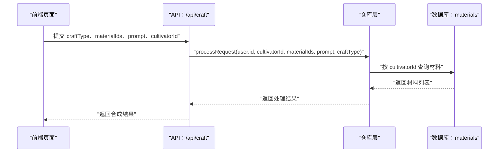
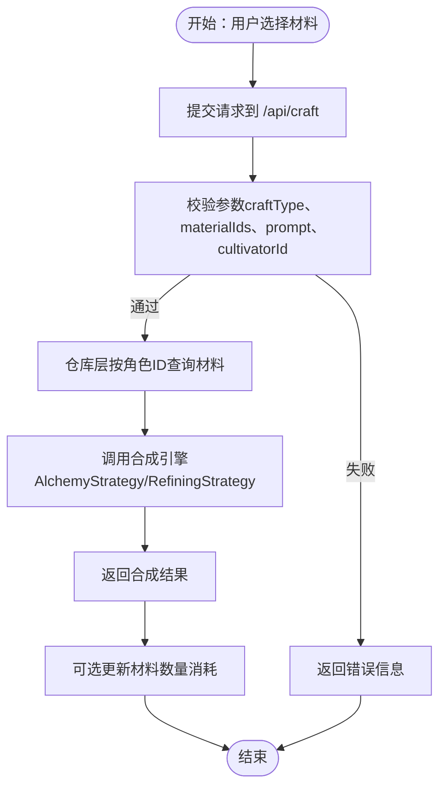
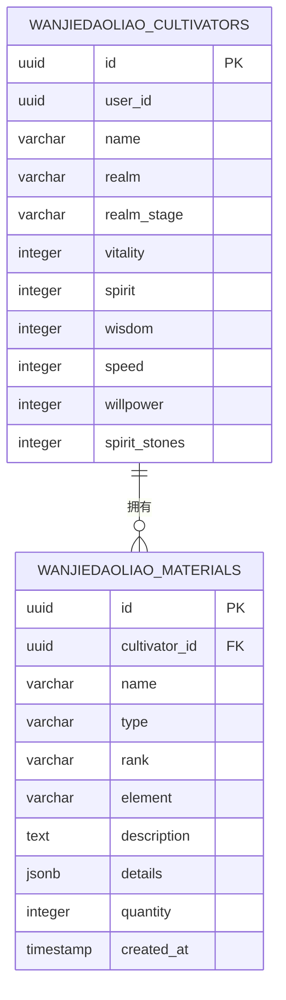
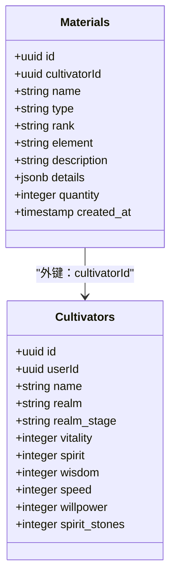

# 材料表

<cite>
**本文引用的文件**
- [schema.ts](file://lib/drizzle/schema.ts)
- [constants.ts](file://types/constants.ts)
- [dictionaries.ts](file://types/dictionaries.ts)
- [cultivatorRepository.ts](file://lib/repositories/cultivatorRepository.ts)
- [route.ts](file://app/api/mail/[id]/claim/route.ts)
- [page.tsx（炼丹）](file://app/craft/alchemy/page.tsx)
- [page.tsx（炼器）](file://app/craft/refine/page.tsx)
- [route.ts（craft）](file://app/api/craft/route.ts)
- [materialGenerator.ts](file://utils/materialGenerator.ts)
- [0012_snapshot.json](file://drizzle/meta/0012_snapshot.json)
- [0013_snapshot.json](file://drizzle/meta/0013_snapshot.json)
- [0014_snapshot.json](file://drizzle/meta/0014_snapshot.json)
</cite>

## 目录
1. [简介](#简介)
2. [项目结构](#项目结构)
3. [核心组件](#核心组件)
4. [架构总览](#架构总览)
5. [详细组件分析](#详细组件分析)
6. [依赖关系分析](#依赖关系分析)
7. [性能考量](#性能考量)
8. [故障排查指南](#故障排查指南)
9. [结论](#结论)
10. [附录](#附录)

## 简介
本文件面向“材料表（wanjiedaoyou_materials）”的数据模型进行系统化文档化，覆盖字段设计、业务语义、枚举规则、扩展属性存储、堆叠管理以及与炼丹、炼器等游戏流程在数据库层面的数据流转。同时提供典型查询示例，帮助开发者快速理解并正确使用该表。

## 项目结构
材料表位于数据库模式定义文件中，并通过仓库层暴露给应用层使用；前端页面在炼丹与炼器界面中展示材料库存并参与合成流程；邮件系统在领取奖励时会写入或更新材料库存；AI生成工具用于批量生成材料。

图表来源
- [schema.ts](file://lib/drizzle/schema.ts#L120-L134)
- [cultivatorRepository.ts](file://lib/repositories/cultivatorRepository.ts#L768-L787)
- [page.tsx（炼丹）](file://app/craft/alchemy/page.tsx#L32-L84)
- [page.tsx（炼器）](file://app/craft/refine/page.tsx#L32-L84)
- [route.ts（craft）](file://app/api/craft/route.ts#L1-L62)
- [route.ts（mail claim）](file://app/api/mail/[id]/claim/route.ts#L80-L111)
- [materialGenerator.ts](file://utils/materialGenerator.ts#L1-L101)

章节来源
- [schema.ts](file://lib/drizzle/schema.ts#L120-L134)
- [cultivatorRepository.ts](file://lib/repositories/cultivatorRepository.ts#L768-L787)

## 核心组件
- 表名：wanjiedaoyou_materials
- 主键：id（uuid，默认随机）
- 外键：cultivatorId 引用 wanjiedaoyou_cultivators(id)，级联删除
- 关键字段：
  - name：材料名称（varchar，最大长度100）
  - type：材料类型（varchar，最大长度20），枚举值见“类型枚举”
  - rank：材料品阶（varchar，最大长度20），枚举值见“品阶枚举”
  - element：元素属性（varchar，最大长度10），可为空
  - description：描述（text）
  - details：扩展属性（jsonb，默认空对象）
  - quantity：数量（integer，默认1）
  - created_at：创建时间（timestamp，默认当前时间）

章节来源
- [schema.ts](file://lib/drizzle/schema.ts#L120-L134)
- [0012_snapshot.json](file://drizzle/meta/0012_snapshot.json#L783-L836)
- [0013_snapshot.json](file://drizzle/meta/0013_snapshot.json#L783-L836)
- [0014_snapshot.json](file://drizzle/meta/0014_snapshot.json#L783-L836)

## 架构总览
材料表在系统中的位置如下：
- 数据库层：定义字段、约束、默认值
- 仓库层：提供按角色ID查询材料的接口
- 应用层：UI 展示材料库存；API 接收合成请求；邮件系统发放奖励并合并堆叠
- 工具层：AI 生成器批量生成材料

图表来源
- [route.ts（craft）](file://app/api/craft/route.ts#L1-L62)
- [cultivatorRepository.ts](file://lib/repositories/cultivatorRepository.ts#L768-L787)
- [schema.ts](file://lib/drizzle/schema.ts#L120-L134)

## 详细组件分析

### 字段设计与业务意义
- name
  - 用途：唯一标识材料的名称，便于UI展示与识别
  - 约束：非空
- type（herb | ore | monster | other）
  - 用途：区分材料来源与用途类别
  - 取值枚举：herb（灵药）、ore（矿石）、monster（妖兽材料）、other（其他）
  - UI 显示：通过字典映射显示图标与标签
- rank（凡品至神品）
  - 用途：决定材料在炼制过程中的权重与影响
  - 取值枚举：凡品、下品、中品、上品、极品、仙品、神品
  - 与消耗品品阶共享同一枚举集合
- element（元素属性）
  - 用途：与功法/法宝的元素匹配度相关，影响合成成功率或效果
  - 取值：可为空，表示无特定元素
- description
  - 用途：材料描述，供UI展示
- details（扩展属性，jsonb）
  - 用途：存储动态扩展属性，如额外属性、合成条件、掉落概率等
  - 默认值：空对象，便于后续扩展
- quantity（堆叠数量）
  - 用途：表示同名材料的累计数量
  - 默认值：1
- created_at
  - 用途：记录创建时间，用于排序与统计

章节来源
- [schema.ts](file://lib/drizzle/schema.ts#L120-L134)
- [dictionaries.ts](file://types/dictionaries.ts#L319-L366)
- [constants.ts](file://types/constants.ts#L128-L137)

### 类型与枚举规则
- 材料类型（MaterialType）
  - 枚举值：herb、ore、monster、tcdb、aux
  - UI 展示：通过字典映射显示中文标签与图标
- 品阶（Quality）
  - 枚举值：凡品、灵品、玄品、真品、地品、天品、仙品、神品
  - 材料与消耗品共享该枚举体系
- 元素（Element）
  - 枚举值：金、木、水、火、土、风、雷、冰、无
  - 与功法、法宝元素体系一致

章节来源
- [dictionaries.ts](file://types/dictionaries.ts#L319-L366)
- [constants.ts](file://types/constants.ts#L128-L137)

### 扩展属性 details（JSONB）使用场景
- 存储格式：键值对形式，值可为标量、数组或对象
- 典型用途：
  - 属性加成：如额外的属性点数、触发概率
  - 合成条件：如必须与其他材料组合、限定品阶
  - 掉落概率：用于副本或战斗掉落的权重
- 读取策略：仓库层直接返回 details 字段，UI 根据需要解析展示

章节来源
- [schema.ts](file://lib/drizzle/schema.ts#L120-L134)
- [cultivatorRepository.ts](file://lib/repositories/cultivatorRepository.ts#L768-L787)

### 堆叠管理 quantity
- 合并逻辑：当同一角色同名材料再次获得时，数据库通过 SQL 更新 quantity 实现堆叠
- 典型场景：
  - 邮件奖励发放：若存在同名材料则累加数量，否则插入新记录
  - UI 展示：统一显示“x数量”，便于玩家管理

章节来源
- [route.ts（mail claim）](file://app/api/mail/[id]/claim/route.ts#L80-L111)

### 数据库层面的获取、消耗与合成逻辑
- 获取
  - 仓库层按角色ID查询材料列表，返回 name、type、rank、element、description、details、quantity 等字段
- 消耗
  - 合成流程中，前端选择材料后提交到 /api/craft，后端根据 craftType 与 materialIds 调用引擎处理
  - 引擎处理完成后，仓库层可再次查询材料，以验证剩余数量
- 合成
  - 炼丹：基于材料类型、品阶、元素与提示词生成丹药
  - 炼器：基于材料类型、品阶、元素与提示词生成法宝

图表来源
- [route.ts（craft）](file://app/api/craft/route.ts#L1-L62)
- [cultivatorRepository.ts](file://lib/repositories/cultivatorRepository.ts#L768-L787)
- [page.tsx（炼丹）](file://app/craft/alchemy/page.tsx#L32-L84)
- [page.tsx（炼器）](file://app/craft/refine/page.tsx#L32-L84)

## 依赖关系分析
- 与角色表的关系
  - materials.cultivatorId 外键引用 cultivators.id，删除角色时自动级联删除材料
- 与 UI 的关系
  - 炼丹/炼器页面展示材料库存并选择材料
  - 邮件领取奖励时合并堆叠
- 与仓库层的关系
  - 仓库层提供按角色ID查询材料的方法，返回结构化的材料列表

图表来源
- [schema.ts](file://lib/drizzle/schema.ts#L120-L134)

章节来源
- [schema.ts](file://lib/drizzle/schema.ts#L120-L134)

## 性能考量
- 查询性能
  - 建议在 cultivatorId 上建立索引，以加速按角色ID查询材料列表
- 写入性能
  - 合并堆叠采用单条 UPDATE，避免频繁 INSERT
- 扩展属性
  - details 使用 JSONB，便于灵活扩展，但应避免过度嵌套，以免影响查询与序列化性能

## 故障排查指南
- 参数校验失败
  - 当 craftType 为 create_skill 时，需满足提示词长度要求；否则返回错误
- 材料数量不足
  - 合成前应检查材料库存，确保所选材料数量足够
- 堆叠异常
  - 若发现同名材料未合并，检查邮件奖励发放逻辑是否正确执行累加

章节来源
- [route.ts（craft）](file://app/api/craft/route.ts#L1-L62)
- [route.ts（mail claim）](file://app/api/mail/[id]/claim/route.ts#L80-L111)

## 结论
材料表通过清晰的字段设计与枚举体系，支撑了炼丹、炼器等核心玩法。details 的 JSONB 设计提供了强大的扩展能力，quantity 的堆叠机制简化了库存管理。配合仓库层与前端 UI，实现了从获取、展示到消耗与合成的完整闭环。

## 附录

### 典型查询示例（按角色ID与材料类型检索库存）
- 按角色ID查询所有材料
  - 仓库层方法：getCultivatorMaterials(userId, cultivatorId)
  - 返回字段：id、name、type、rank、element、description、details、quantity
- 按角色ID与材料类型筛选
  - 在应用层对返回列表进行过滤，例如仅保留 type 为 herb 的材料
- 按角色ID与材料名称精确匹配
  - 在应用层对返回列表进行过滤，例如仅保留 name 等于某材料名称的项

章节来源
- [cultivatorRepository.ts](file://lib/repositories/cultivatorRepository.ts#L768-L787)
- [page.tsx（炼丹）](file://app/craft/alchemy/page.tsx#L149-L179)
- [page.tsx（炼器）](file://app/craft/refine/page.tsx#L149-L179)

### 材料类型与品阶枚举对照
- 材料类型（MaterialType）
  - herb、ore、monster、tcdb、aux
- 品阶（Quality）
  - 凡品、灵品、玄品、真品、地品、天品、仙品、神品

章节来源
- [dictionaries.ts](file://types/dictionaries.ts#L319-L366)
- [constants.ts](file://types/constants.ts#L128-L137)

### 数据模型类图（代码级）

图表来源
- [schema.ts](file://lib/drizzle/schema.ts#L120-L134)