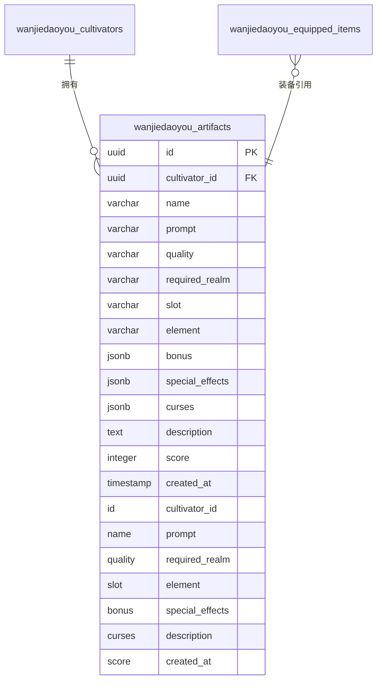
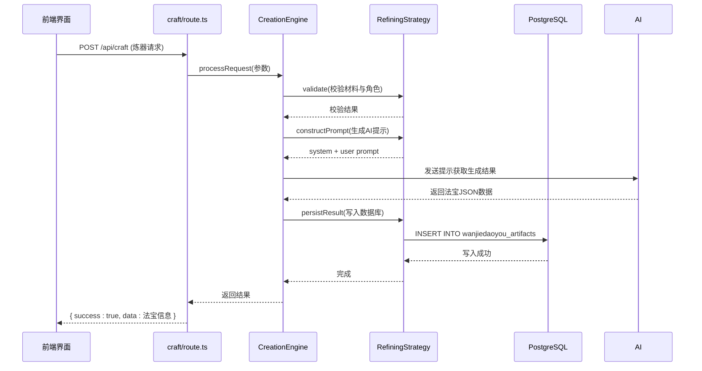

# 法宝表

<cite>
**本文档引用的文件**
- [schema.ts](file://lib/drizzle/schema.ts#L136-L156)
- [0000_equal_the_fury.sql](file://drizzle/0000_equal_the_fury.sql#L1-L11)
- [RefiningStrategy.ts](file://engine/creation/strategies/RefiningStrategy.ts#L155-L174)
- [craft/route.ts](file://app/api/craft/route.ts#L7-L61)
- [cultivatorRepository.ts](file://lib/repositories/cultivatorRepository.ts#L1108-L1149)
</cite>

## 目录
1. [简介](#简介)
2. [数据模型结构](#数据模型结构)
3. [核心字段设计原理](#核心字段设计原理)
4. [炼器系统与数据写入流程](#炼器系统与数据写入流程)
5. [装备系统集成](#装备系统集成)
6. [查询示例](#查询示例)

## 简介
法宝表（wanjiedaoyou_artifacts）是修仙游戏中用于存储角色所拥有的法宝类装备的核心数据表。该表采用灵活的JSONB字段设计，支持动态属性加成、多重特效与诅咒效果的管理，并通过slot字段实现装备分类，required_realm字段实现境界限制。本文档全面解析其存储结构与系统集成机制。

## 数据模型结构



**图表来源**
- [schema.ts](file://lib/drizzle/schema.ts#L136-L156)
- [0000_equal_the_fury.sql](file://drizzle/0000_equal_the_fury.sql#L1-L11)

**本节来源**
- [schema.ts](file://lib/drizzle/schema.ts#L136-L156)

## 核心字段设计原理

### bonus字段：JSONB格式的基础属性加成
`bonus`字段使用`jsonb`类型存储法宝对角色基础属性的加成，其结构为`{ vitality?: number, spirit?: number, wisdom?: number, speed?: number, willpower?: number }`。这种设计允许每个法宝拥有任意组合的属性加成，无需为每个属性创建单独的列，极大提升了数据模型的灵活性和扩展性。

### special_effects与curses字段：动态特效与负面效果管理
`special_effects`和`curses`字段均使用`jsonb`类型并默认为空数组`[]`，用于存储法宝的特殊效果和诅咒效果。每个效果对象包含`type`、`element`、`effect`、`chance`等属性，支持在战斗中触发各种状态变化。数组结构使得一个法宝可以同时拥有多个不同的特效或诅咒，实现了复杂效果的动态管理。

### slot字段：装备分类
`slot`字段定义法宝的装备位置，取值为`weapon`（武器）、`armor`（防具）或`accessory`（饰品）。该字段将法宝划分为三大类，确保角色在同一部位只能装备一件法宝，是实现装备系统逻辑的基础。

### required_realm字段：角色境界限制
`required_realm`字段存储角色使用该法宝所需的最低境界（如"练气"、"筑基"等）。当角色境界未达到要求时，无法装备或使用该法宝。此字段实现了游戏内装备的等级限制机制，引导玩家逐步提升角色实力。

**本节来源**
- [schema.ts](file://lib/drizzle/schema.ts#L136-L156)

## 炼器系统与数据写入流程



**图表来源**
- [craft/route.ts](file://app/api/craft/route.ts#L7-L61)
- [RefiningStrategy.ts](file://engine/creation/strategies/RefiningStrategy.ts#L155-L174)

**本节来源**
- [craft/route.ts](file://app/api/craft/route.ts#L7-L61)
- [RefiningStrategy.ts](file://engine/creation/strategies/RefiningStrategy.ts#L155-L174)

## 装备系统集成

```mermaid
flowchart TD
A[用户点击装备] --> B{当前是否已装备}
B --> |是| C[卸下当前法宝]
B --> |否| D[装备新法宝]
C --> E[更新equippedItems表对应slot字段为NULL]
D --> F[更新equippedItems表对应slot字段为新法宝ID]
E --> G[完成操作]
F --> G
G --> H[刷新UI显示]
subgraph 数据库表
I[wanjiedaoyou_artifacts]
J[wanjiedaoyou_equipped_items]
end
J --> I: 外键关联
```

**图表来源**
- [cultivatorRepository.ts](file://lib/repositories/cultivatorRepository.ts#L1108-L1149)

**本节来源**
- [cultivatorRepository.ts](file://lib/repositories/cultivatorRepository.ts#L1108-L1149)

## 查询示例

### 按角色ID查询所有法宝
```sql
SELECT * FROM wanjiedaoyou_artifacts 
WHERE cultivator_id = '指定角色ID' 
ORDER BY created_at DESC;
```

### 按特效类型筛选法宝
```sql
SELECT * FROM wanjiedaoyou_artifacts 
WHERE special_effects @> '[{"type": "attack", "element": "fire"}]'::jsonb;
```

### 查询特定境界可使用的法宝
```sql
SELECT * FROM wanjiedaoyou_artifacts 
WHERE required_realm <= '筑基' 
AND cultivator_id = '指定角色ID';
```

**本节来源**
- [schema.ts](file://lib/drizzle/schema.ts#L136-L156)