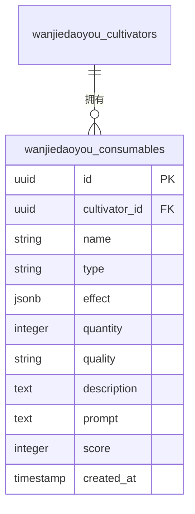
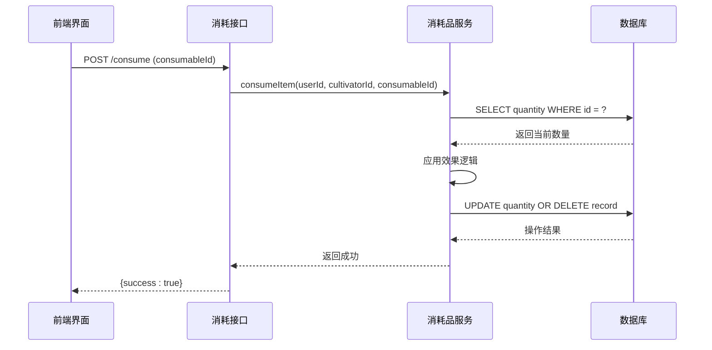

# 消耗品表

<cite>
**本文档引用的文件**
- [0000_equal_the_fury.sql](file://drizzle/0000_equal_the_fury.sql)
- [0009_zippy_sharon_ventura.sql](file://drizzle/0009_zippy_sharon_ventura.sql)
- [0013_brown_nico_minoru.sql](file://drizzle/0013_brown_nico_minoru.sql)
- [0015_freezing_marvex.sql](file://drizzle/0015_freezing_marvex.sql)
- [cultivatorRepository.ts](file://lib/repositories/cultivatorRepository.ts)
- [route.ts](file://app/api/cultivators/[id]/consume/route.ts)
- [discard/route.ts](file://app/api/cultivators/[id]/inventory/discard/route.ts)
- [page.tsx](file://app/inventory/page.tsx)
</cite>

## 目录
1. [简介](#简介)
2. [数据模型结构](#数据模型结构)
3. [核心字段详解](#核心字段详解)
4. [使用流程与数据操作](#使用流程与数据操作)
5. [相关更新语句示例](#相关更新语句示例)

## 简介
消耗品表（wanjiedaoyou_consumables）是修仙游戏系统中用于存储角色可使用道具的核心数据表。该表设计支持多种类型的消耗品，包括丹药、符箓等，通过灵活的JSONB字段存储复杂的效果配置，并结合数量堆叠、品质分级等机制实现丰富的道具系统功能。本文档将深入解析其数据结构设计及在角色使用丹药等场景下的数据操作模式。

## 数据模型结构



**图表来源**
- [0000_equal_the_fury.sql](file://drizzle/0000_equal_the_fury.sql#L13-L20)
- [0009_zippy_sharon_ventura.sql](file://drizzle/0009_zippy_sharon_ventura.sql#L2-L4)
- [0013_brown_nico_minoru.sql](file://drizzle/0013_brown_nico_minoru.sql#L1)
- [0015_freezing_marvex.sql](file://drizzle/0015_freezing_marvex.sql#L2)

**本节来源**
- [0000_equal_the_fury.sql](file://drizzle/0000_equal_the_fury.sql#L13-L20)
- [0009_zippy_sharon_ventura.sql](file://drizzle/0009_zippy_sharon_ventura.sql#L2-L4)
- [0013_brown_nico_minoru.sql](file://drizzle/0013_brown_nico_minoru.sql#L1)
- [0015_freezing_marvex.sql](file://drizzle/0015_freezing_marvex.sql#L2)

## 核心字段详解

### effect 字段：JSONB 效果配置
`effect` 字段采用 JSONB 格式存储消耗品的复杂效果配置，支持嵌套结构以描述多种效果组合。典型结构包括属性加成和状态施加：

- **属性加成**：如 `"effect": [{"type": "attribute", "target": "vitality", "value": 50}]`
- **状态施加**：如 `"effect": [{"type": "status", "name": "regeneration", "duration": 300}]`

此设计允许同一字段表达多种游戏机制，提升了数据灵活性和扩展性。

**本节来源**
- [0000_equal_the_fury.sql](file://drizzle/0000_equal_the_fury.sql#L18)

### quality 字段：品质等级体系
`quality` 字段定义了消耗品的品质等级，默认值为“凡品”。品质直接影响道具的价值与效果强度，可能的等级包括：
- 凡品
- 良品
- 上品
- 极品
- 完美

高品质道具通常具有更强的效果或附加特殊属性，形成明确的价值梯度。

**本节来源**
- [0009_zippy_sharon_ventura.sql](file://drizzle/0009_zippy_sharon_ventura.sql#L3)

### quantity 字段：堆叠逻辑
`quantity` 字段支持消耗品的堆叠功能，默认值为1。相同名称、品质和效果的消耗品可堆叠存储，减少数据库记录数量，优化库存管理效率。堆叠上限由业务逻辑控制，通常在前端界面体现。

**本节来源**
- [0013_brown_nico_minoru.sql](file://drizzle/0013_brown_nico_minoru.sql#L1)

### prompt 字段：AIGC生成描述
`prompt` 字段用于存储生成式AI创建消耗品描述文本的提示词。系统可通过该字段调用AI服务，动态生成符合修仙世界观的文学化描述，增强游戏沉浸感和内容多样性。

**本节来源**
- [0009_zippy_sharon_ventura.sql](file://drizzle/0009_zippy_sharon_ventura.sql#L2)

## 使用流程与数据操作

当角色使用丹药时，系统执行以下流程：

1. 用户触发使用操作，前端调用 `/api/cultivators/:id/consume` 接口
2. 后端验证权限并调用 `consumeItem` 服务
3. 系统检查消耗品是否存在且数量充足
4. 执行效果逻辑（如属性变更）
5. 更新或删除数据库记录

若使用后数量大于0，则更新 `quantity` 字段；若数量减至0，则从数据库中删除该记录，实现自动清理。



**图表来源**
- [route.ts](file://app/api/cultivators/[id]/consume/route.ts#L1-L47)
- [cultivatorRepository.ts](file://lib/repositories/cultivatorRepository.ts#L748-L766)

**本节来源**
- [route.ts](file://app/api/cultivators/[id]/consume/route.ts#L1-L47)
- [cultivatorRepository.ts](file://lib/repositories/cultivatorRepository.ts#L748-L766)

## 相关更新语句示例

以下是消耗品使用后的典型数据操作语句：

```sql
-- 使用一个消耗品：数量递减
UPDATE wanjiedaoyou_consumables 
SET quantity = quantity - 1 
WHERE id = 'consumable_id' AND cultivator_id = 'cultivator_id';

-- 当数量为1时直接删除记录
DELETE FROM wanjiedaoyou_consumables 
WHERE id = 'consumable_id' AND cultivator_id = 'cultivator_id' AND quantity = 1;

-- 邮件领取时合并相同消耗品
UPDATE wanjiedaoyou_consumables 
SET quantity = quantity + 3 
WHERE cultivator_id = 'cultivator_id' 
  AND name = '回春丹' 
  AND quality = '上品';
```

**本节来源**
- [discard/route.ts](file://app/api/cultivators/[id]/inventory/discard/route.ts#L71-L80)
- [page.tsx](file://app/inventory/page.tsx#L54-L98)
- [mail/claim/route.ts](file://app/api/mail/[id]/claim/route.ts#L101-L111)