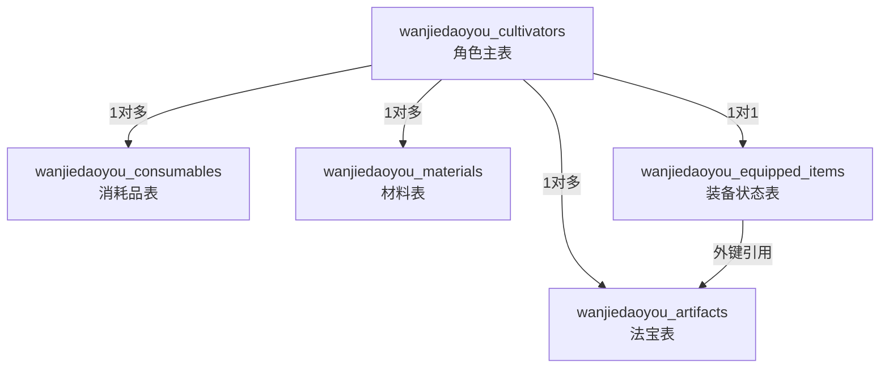
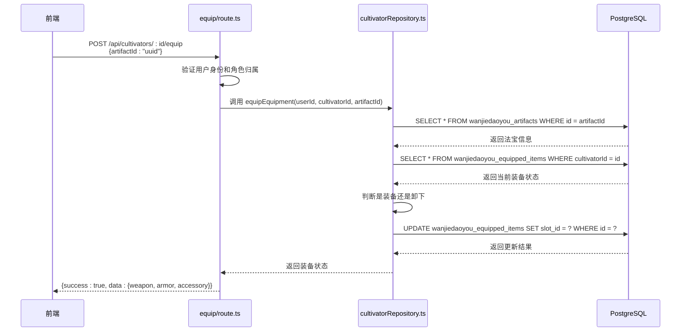
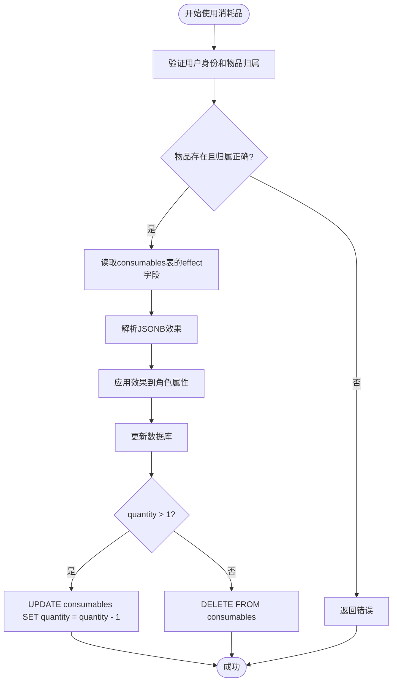

# 物品与装备表

<cite>
**本文档引用的文件**
- [schema.ts](file://lib/drizzle/schema.ts)
- [0000_equal_the_fury.sql](file://drizzle/0000_equal_the_fury.sql)
- [equip/route.ts](file://app/api/cultivators/[id]/equip/route.ts)
- [consume/route.ts](file://app/api/cultivators/[id]/consume/route.ts)
- [discard/route.ts](file://app/api/cultivators/[id]/inventory/discard/route.ts)
- [cultivatorRepository.ts](file://lib/repositories/cultivatorRepository.ts)
</cite>

## 目录
1. [简介](#简介)
2. [数据模型概览](#数据模型概览)
3. [核心表结构详解](#核心表结构详解)
4. [装备状态管理机制](#装备状态管理机制)
5. [物品全链路数据流转](#物品全链路数据流转)
6. [典型查询SQL示例](#典型查询sql示例)

## 简介
本文档详细阐述了修仙游戏《万界道友》中物品与装备系统的数据模型设计。该系统围绕角色（cultivator）构建，通过多个关联表实现对法宝（artifacts）、消耗品（consumables）、材料（materials）的管理，并通过专门的装备状态表（equippedItems）实现角色当前装备的精确追踪。文档将深入解析各表的字段设计意图、JSONB数据结构的使用、1对1关联表的实现原理，并结合游戏流程说明物品获取、使用、装备的完整数据流转过程。

## 数据模型概览
物品与装备系统由多个与角色主表（cultivators）关联的子表构成，采用1对多和1对1的关联模式。系统核心包括：
- **artifacts表**：存储角色拥有的法宝，支持属性增益、特殊效果和诅咒。
- **consumables表**：存储可消耗的丹药等物品，支持批量堆叠。
- **materials表**：存储炼丹、炼器等用途的材料。
- **equippedItems表**：作为1对1关联表，记录角色当前装备的武器、防具和饰品。



**图表来源**
- [schema.ts](file://lib/drizzle/schema.ts#L137-L228)

## 核心表结构详解

### 法宝表 (artifacts)
`wanjiedaoyou_artifacts` 表用于存储角色拥有的所有法宝，其设计充分考虑了法宝的多样性和复杂性。

**字段设计意图：**
- `id`：主键，使用UUID确保全局唯一性。
- `cultivatorId`：外键，关联到角色主表，实现1对多关系，`onDelete: 'cascade'` 确保角色删除时其法宝自动清除。
- `name`：法宝名称，varchar类型，限制长度为100。
- `slot`：装备槽位，枚举值（weapon, armor, accessory），决定该法宝可被装备的位置。
- `element`：元素属性，如金、木、水、火等，用于战斗中的属性相克。
- `bonus`：核心属性增益，以JSONB格式存储，允许灵活定义不同属性的加成。
- `special_effects` 和 `curses`：分别存储法宝的特殊效果和诅咒，使用JSONB数组结构，支持一个法宝拥有多个效果。
- `quality` 和 `required_realm`：法宝品质和装备所需的最低境界，用于游戏内的装备限制。

**JSONB结构设计：**
`bonus` 字段的JSONB结构设计为一个对象，键为属性名，值为数值。例如：
```json
{"vitality": 10, "spirit": 5}
```
这表示该法宝提供10点体魄和5点灵力的加成。这种设计避免了为每个属性创建单独的列，极大地提高了灵活性。

`special_effects` 和 `curses` 字段的JSONB数组结构设计为包含多个效果对象的数组。例如：
```json
[
  {"effect_type": "吸血", "value": 15},
  {"effect_type": "暴击", "value": 10}
]
```
这种数组结构允许一个法宝拥有多个不同的特殊效果或诅咒，且易于扩展新的效果类型。

**表来源**
- [schema.ts](file://lib/drizzle/schema.ts#L137-L156)
- [0000_equal_the_fury.sql](file://drizzle/0000_equal_the_fury.sql#L1-L11)

### 消耗品表 (consumables)
`wanjiedaoyou_consumables` 表用于存储可消耗的物品，如丹药。

**字段设计意图：**
- `id`：主键，UUID。
- `cultivatorId`：外键，关联角色，实现1对多关系。
- `name`：消耗品名称。
- `type`：消耗品类型，如“丹药”。
- `effect`：消耗品效果，以JSONB格式存储，支持复杂的增益效果描述。
- `quantity`：数量，支持堆叠，避免为同一物品创建多条记录。
- `quality`：品质，影响效果强度。

**JSONB结构设计：**
`effect` 字段的JSONB结构设计为一个对象数组，每个对象代表一种效果。例如：
```json
[
  {"effect_type": "永久提升体魄", "bonus": 5},
  {"effect_type": "临时提升灵力", "bonus": 20, "duration": 3}
]
```
这种设计使得一个丹药可以同时提供多种效果，且易于在业务逻辑中解析和应用。

**表来源**
- [schema.ts](file://lib/drizzle/schema.ts#L159-L173)
- [0000_equal_the_fury.sql](file://drizzle/0000_equal_the_fury.sql#L13-L20)

### 材料表 (materials)
`wanjiedaoyou_materials` 表用于存储炼丹、炼器等用途的材料。

**字段设计意图：**
- `id`：主键，UUID。
- `cultivatorId`：外键，关联角色。
- `name`：材料名称。
- `type`：材料类型，如“灵草”、“矿石”。
- `rank`：品级，从凡品到神品。
- `element`：元素属性。
- `quantity`：数量，支持堆叠。
- `details`：额外属性，以JSONB格式存储，可用于存储材料的特殊属性或炼制配方。

**表来源**
- [schema.ts](file://lib/drizzle/schema.ts#L121-L134)

## 装备状态管理机制
`wanjiedaoyou_equipped_items` 表是实现角色当前装备状态的核心，它是一个典型的1对1关联表。

### 1对1关联表设计
该表与角色主表（cultivators）通过 `cultivatorId` 字段建立1对1关系。关键设计点包括：
- **唯一性约束**：`cultivatorId` 字段被设置为唯一（`.unique()`），确保每个角色只能有一条装备状态记录。
- **外键引用**：`weapon_id`、`armor_id`、`accessory_id` 三个字段均外键引用 `artifacts` 表的 `id` 字段，确保装备的法宝必须是角色拥有的。
- **级联删除与置空**：`cultivatorId` 的 `onDelete: 'cascade'` 确保角色删除时其装备状态自动清除。而 `weapon_id`、`armor_id`、`accessory_id` 的 `onDelete: 'set null'` 确保当一个法宝被销毁时，角色的装备槽位会自动置空，而不是导致装备状态记录被删除，保证了数据的完整性。

### 装备/卸下流程
当玩家执行装备或卸下操作时，后端API (`/api/cultivators/:id/equip`) 会调用 `equipEquipment` 函数。该函数的执行流程如下：
1.  **权限验证**：确认请求用户与角色的归属关系。
2.  **查找装备**：根据 `artifactId` 在 `artifacts` 表中查找该法宝，确保其存在且属于该角色。
3.  **获取当前状态**：查询 `equippedItems` 表获取角色当前的装备状态。如果不存在记录，则创建一条初始为空的记录。
4.  **执行操作**：比较当前装备槽位的ID与传入的 `artifactId`。如果相同，则执行卸下操作（将槽位ID置为null）；如果不同，则执行装备操作（将槽位ID更新为 `artifactId`）。
5.  **更新数据库**：通过 `UPDATE` 语句更新 `equippedItems` 表中的对应记录。

此设计确保了装备状态的实时性和准确性，且通过数据库约束保证了数据的一致性。



**图表来源**
- [equip/route.ts](file://app/api/cultivators/[id]/equip/route.ts#L93-L153)
- [cultivatorRepository.ts](file://lib/repositories/cultivatorRepository.ts#L1064-L1150)

## 物品全链路数据流转
本节结合游戏流程，说明物品从获取到使用、装备的完整数据流转。

### 物品获取
当角色通过副本、任务或购买获得新物品时，系统会在对应的表中插入一条新记录。
- **获取法宝**：在 `artifacts` 表中插入一条新记录，`cultivatorId` 指向角色ID。
- **获取消耗品**：在 `consumables` 表中插入或更新记录。如果已有同名消耗品，则增加其 `quantity` 数量；否则插入新记录。

### 物品使用
当玩家使用消耗品（如服用丹药）时，流程如下：
1.  前端调用 `/api/cultivators/:id/consume` 接口。
2.  后端验证身份和物品归属。
3.  从 `consumables` 表中读取该消耗品的 `effect` JSONB数据。
4.  解析效果，并应用到角色属性上（可能涉及更新 `cultivators` 表）。
5.  执行事务：如果 `quantity` 大于1，则 `UPDATE` 数量减1；否则 `DELETE` 该记录。
6.  返回更新后的角色状态。



**图表来源**
- [consume/route.ts](file://app/api/cultivators/[id]/consume/route.ts#L9-L48)
- [cultivatorRepository.ts](file://lib/repositories/cultivatorRepository.ts#L1203-L1366)

### 物品丢弃
当玩家丢弃物品时，调用 `/api/cultivators/:id/inventory/discard` 接口。后端根据 `itemType` 参数，直接在对应的表（artifacts, consumables, materials）中执行 `DELETE` 操作。由于 `equippedItems` 表设置了 `onDelete: 'set null'`，即使丢弃的是已装备的法宝，其装备槽位也会自动置空，不会导致错误。

**表来源**
- [discard/route.ts](file://app/api/cultivators/[id]/inventory/discard/route.ts#L7-L115)

## 典型查询SQL示例
以下是一些在业务中常用的SQL查询示例。

### 查询角色的完整背包信息
此查询通过 `JOIN` 获取角色的所有物品，是前端 `/api/cultivators/:id/inventory` 接口的基础。
```sql
SELECT 
    c.name as cultivator_name,
    a.id as artifact_id, a.name as artifact_name, a.slot, a.bonus,
    con.id as consumable_id, con.name as consumable_name, con.type, con.quantity,
    m.id as material_id, m.name as material_name, m.type, m.quantity
FROM wanjiedaoyou_cultivators c
LEFT JOIN wanjiedaoyou_artifacts a ON c.id = a.cultivator_id
LEFT JOIN wanjiedaoyou_consumables con ON c.id = con.cultivator_id
LEFT JOIN wanjiedaoyou_materials m ON c.id = m.cultivator_id
WHERE c.id = '角色UUID';
```

### 查询角色当前装备的法宝详情
此查询结合 `equippedItems` 和 `artifacts` 表，获取角色当前装备的三件法宝的完整信息。
```sql
SELECT 
    ei.weapon_id, ei.armor_id, ei.accessory_id,
    aw.name as weapon_name, aw.bonus as weapon_bonus,
    aa.name as armor_name, aa.bonus as armor_bonus,
    aac.name as accessory_name, aac.bonus as accessory_bonus
FROM wanjiedaoyou_equipped_items ei
LEFT JOIN wanjiedaoyou_artifacts aw ON ei.weapon_id = aw.id
LEFT JOIN wanjiedaoyou_artifacts aa ON ei.armor_id = aa.id
LEFT JOIN wanjiedaoyou_artifacts aac ON ei.accessory_id = aac.id
WHERE ei.cultivatorId = '角色UUID';
```

### 统计特定类型材料的总数量
此查询用于快速统计角色拥有的某种材料的总数。
```sql
SELECT SUM(quantity) as total_quantity
FROM wanjiedaoyou_materials
WHERE cultivatorId = '角色UUID' AND type = 'herb';
```