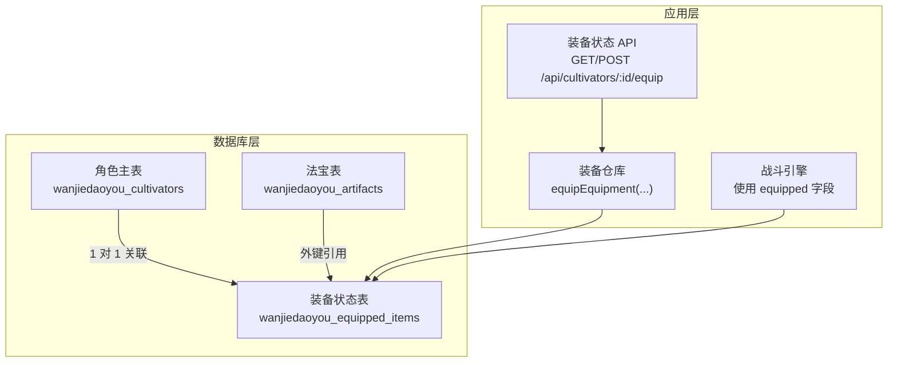
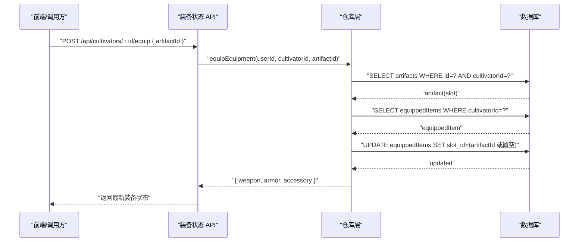
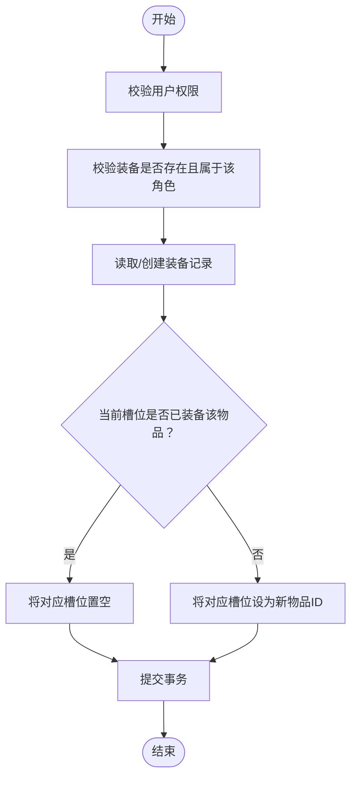
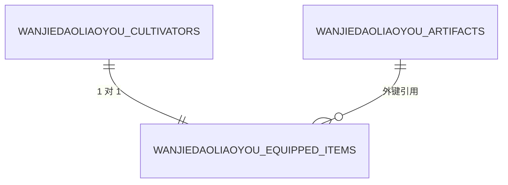
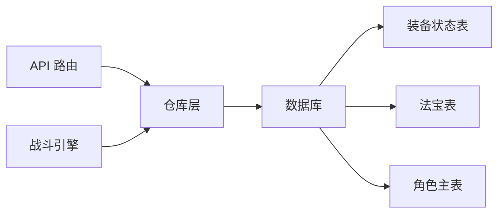

# 装备状态表

<cite>
**本文引用的文件**
- [schema.ts](file://lib/drizzle/schema.ts)
- [0000_equal_the_fury.sql](file://drizzle/0000_equal_the_fury.sql)
- [route.ts](file://app/api/cultivators/[id]/equip/route.ts)
- [cultivatorRepository.ts](file://lib/repositories/cultivatorRepository.ts)
- [battleEngine.ts](file://engine/battleEngine.ts)
- [cultivator.ts](file://types/cultivator.ts)
</cite>

## 目录
1. [简介](#简介)
2. [项目结构](#项目结构)
3. [核心组件](#核心组件)
4. [架构总览](#架构总览)
5. [详细组件分析](#详细组件分析)
6. [依赖关系分析](#依赖关系分析)
7. [性能考量](#性能考量)
8. [故障排查指南](#故障排查指南)
9. [结论](#结论)
10. [附录](#附录)

## 简介
本文件聚焦“装备状态表（wanjiedaoyou_equipped_items）”的数据模型与业务行为，阐明其作为角色与法宝之间1对1关联表的设计初衷与实现要点。重点包括：
- 通过唯一约束确保每个角色仅有一条装备记录；
- weapon_id、armor_id、accessory_id 外键引用 artifacts 表，并设置 ON DELETE SET NULL 的级联策略；
- 如何实现角色当前装备状态的快速读取与更新，避免在角色主表中冗余存储装备ID；
- 结合装备更换流程，说明事务性更新操作的必要性；
- 提供“获取角色当前全套装备”的 JOIN 查询语句示例。

## 项目结构
围绕装备状态表的关键文件分布如下：
- 数据库模式定义：lib/drizzle/schema.ts
- 初始迁移脚本：drizzle/0000_equal_the_fury.sql
- API 接口：app/api/cultivators/[id]/equip/route.ts
- 业务仓库：lib/repositories/cultivatorRepository.ts
- 引擎使用：engine/battleEngine.ts
- 类型定义：types/cultivator.ts

图表来源
- [schema.ts](file://lib/drizzle/schema.ts#L208-L228)
- [0000_equal_the_fury.sql](file://drizzle/0000_equal_the_fury.sql#L54-L63)
- [route.ts](file://app/api/cultivators/[id]/equip/route.ts#L52-L73)
- [cultivatorRepository.ts](file://lib/repositories/cultivatorRepository.ts#L1064-L1151)
- [battleEngine.ts](file://engine/battleEngine.ts#L155-L162)

章节来源
- [schema.ts](file://lib/drizzle/schema.ts#L208-L228)
- [0000_equal_the_fury.sql](file://drizzle/0000_equal_the_fury.sql#L54-L63)

## 核心组件
- 装备状态表（wanjiedaoyou_equipped_items）
  - 主键：id
  - 唯一约束：cultivator_id
  - 外键：
    - weapon_id → artifacts.id（ON DELETE SET NULL）
    - armor_id → artifacts.id（ON DELETE SET NULL）
    - accessory_id → artifacts.id（ON DELETE SET NULL）
  - 时间戳：createdAt、updatedAt
- API 层
  - GET：读取当前角色的 weapon、armor、accessory 的 UUID
  - POST：执行装备/卸下操作，内部调用仓库方法
- 仓库层
  - 权限校验、装备合法性校验、原子更新
- 引擎层
  - 战斗时直接读取 equipped 字段进行属性与技能加成计算

章节来源
- [schema.ts](file://lib/drizzle/schema.ts#L208-L228)
- [0000_equal_the_fury.sql](file://drizzle/0000_equal_the_fury.sql#L106-L112)
- [route.ts](file://app/api/cultivators/[id]/equip/route.ts#L52-L73)
- [cultivatorRepository.ts](file://lib/repositories/cultivatorRepository.ts#L1064-L1151)
- [battleEngine.ts](file://engine/battleEngine.ts#L155-L162)

## 架构总览
装备状态表通过唯一约束与外键策略，将“角色当前装备”这一事实以独立表形式稳定存储，既避免了在角色主表中重复维护装备ID，又保证了查询与更新的高效与一致。

图表来源
- [route.ts](file://app/api/cultivators/[id]/equip/route.ts#L93-L151)
- [cultivatorRepository.ts](file://lib/repositories/cultivatorRepository.ts#L1064-L1151)

## 详细组件分析

### 数据模型与约束
- 唯一约束确保每个角色仅有一条装备记录，天然防止重复或遗漏。
- 外键引用 artifacts 并设置 ON DELETE SET NULL，意味着：
  - 若某件法宝被删除，对应角色的该槽位会自动清空；
  - 若角色被删除，因外键级联删除，装备记录也会随之清理。
- 三个槽位字段均为可空，便于表示“未装备”。

章节来源
- [schema.ts](file://lib/drizzle/schema.ts#L208-L228)
- [0000_equal_the_fury.sql](file://drizzle/0000_equal_the_fury.sql#L106-L112)

### 读取当前装备状态
- API GET 路由按角色ID查询装备状态表，返回 weapon、armor、accessory 的 UUID；若无记录则返回空状态。
- 仓库层在组装完整角色对象时，同样从装备状态表读取并转换为字符串ID。

章节来源
- [route.ts](file://app/api/cultivators/[id]/equip/route.ts#L52-L73)
- [cultivatorRepository.ts](file://lib/repositories/cultivatorRepository.ts#L120-L133)

### 装备更换流程与事务性更新
- 权限校验：确认请求用户拥有目标角色。
- 装备合法性：确认该装备确属该角色且存在。
- 读取/初始化：若无装备记录则创建一条初始空记录。
- 原子更新：根据当前槽位是否已装备同一物品决定“卸下”还是“替换”，通过单次 UPDATE 完成。
- 事务性：仓库层采用数据库事务包裹，确保权限校验、读取、写入的一致性与原子性。

图表来源
- [cultivatorRepository.ts](file://lib/repositories/cultivatorRepository.ts#L1064-L1151)

章节来源
- [cultivatorRepository.ts](file://lib/repositories/cultivatorRepository.ts#L1064-L1151)

### 与战斗引擎的集成
- 战斗引擎直接读取角色 equipped 字段（weapon、armor、accessory），用于计算属性加成与技能冷却等逻辑。
- 该字段来源于装备状态表，保证战斗时的装备信息与库存管理保持一致。

章节来源
- [battleEngine.ts](file://engine/battleEngine.ts#L155-L162)

### “获取角色当前全套装备”的 JOIN 查询示例
以下为获取角色当前全套装备（武器、防具、饰品）的 JOIN 查询思路，便于一次性读取角色与其当前装备及对应法宝的完整信息。该查询可作为批量展示或统计用途的基础。

图表来源
- [schema.ts](file://lib/drizzle/schema.ts#L208-L228)

说明
- 通过 JOIN 三张表（角色主表、装备状态表、法宝表）分别连接 weapon_id、armor_id、accessory_id，即可一次性获得角色当前全套装备的详细信息。
- 该查询适合用于“角色详情页”或“背包/出战预览”等场景，减少多次往返数据库的开销。

## 依赖关系分析
- 装备状态表依赖于角色主表与法宝表：
  - 与角色主表：1对1关联，唯一约束保证一对一；
  - 与法宝表：三处外键，均设置 ON DELETE SET NULL。
- API 层依赖仓库层，仓库层依赖数据库层（Drizzle ORM）。
- 引擎层依赖仓库层提供的角色数据，其中 equipped 字段来自装备状态表。

图表来源
- [route.ts](file://app/api/cultivators/[id]/equip/route.ts#L52-L73)
- [cultivatorRepository.ts](file://lib/repositories/cultivatorRepository.ts#L1064-L1151)
- [schema.ts](file://lib/drizzle/schema.ts#L208-L228)

章节来源
- [route.ts](file://app/api/cultivators/[id]/equip/route.ts#L52-L73)
- [cultivatorRepository.ts](file://lib/repositories/cultivatorRepository.ts#L1064-L1151)
- [schema.ts](file://lib/drizzle/schema.ts#L208-L228)

## 性能考量
- 读取路径
  - GET 装备状态：按唯一索引 cultivator_id 查询，复杂度 O(log N)，N 为角色数量。
  - JOIN 全套装备：三表 JOIN，建议在 weapon_id、armor_id、accessory_id 上建立索引以优化查询。
- 写入路径
  - 装备更换：单表 UPDATE，复杂度 O(1)；事务内完成权限校验与更新，保证一致性。
- 缓存建议
  - 对频繁访问的角色装备状态可考虑短期缓存（如 Redis），降低数据库压力。
- 外键策略
  - ON DELETE SET NULL 使删除法宝不会破坏角色状态一致性，但需注意前端显示与业务逻辑对空值的处理。

## 故障排查指南
- 问题：装备更换后未生效
  - 检查 API 返回与仓库层返回值是否正确；
  - 确认事务是否成功提交；
  - 核对前端是否使用了正确的 artifactId。
- 问题：删除法宝后角色仍显示装备
  - 检查外键策略是否为 SET NULL；
  - 确认删除操作是否成功触发级联更新。
- 问题：角色不存在或无权限
  - API 层与仓库层均有权限校验，检查用户认证与角色归属。
- 问题：查询不到全套装备
  - 确认 JOIN 条件是否正确连接三张表；
  - 检查是否存在未初始化的装备记录（首次使用时会自动创建）。

章节来源
- [route.ts](file://app/api/cultivators/[id]/equip/route.ts#L52-L73)
- [cultivatorRepository.ts](file://lib/repositories/cultivatorRepository.ts#L1064-L1151)
- [0000_equal_the_fury.sql](file://drizzle/0000_equal_the_fury.sql#L106-L112)

## 结论
装备状态表通过唯一约束与外键策略，实现了角色与法宝之间的清晰、稳定、可扩展的1对1关联。它避免了在角色主表中冗余存储装备ID，使得读取与更新更高效、更安全。配合事务性更新与明确的级联策略，系统在功能正确性与性能之间取得了良好平衡。同时，通过 JOIN 查询可轻松实现“获取角色当前全套装备”的需求，满足前端展示与后台统计场景。

## 附录
- 类型定义：EquippedItems 字段结构（weapon、armor、accessory）用于前后端数据契约一致。
- 战斗引擎：直接使用 equipped 字段进行属性与技能加成计算，体现装备状态表在运行时的重要性。

章节来源
- [cultivator.ts](file://types/cultivator.ts#L211-L215)
- [battleEngine.ts](file://engine/battleEngine.ts#L155-L162)