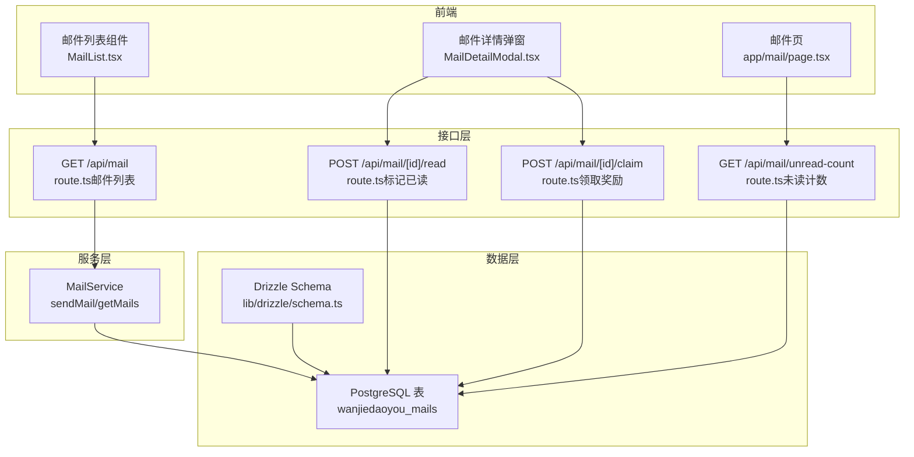
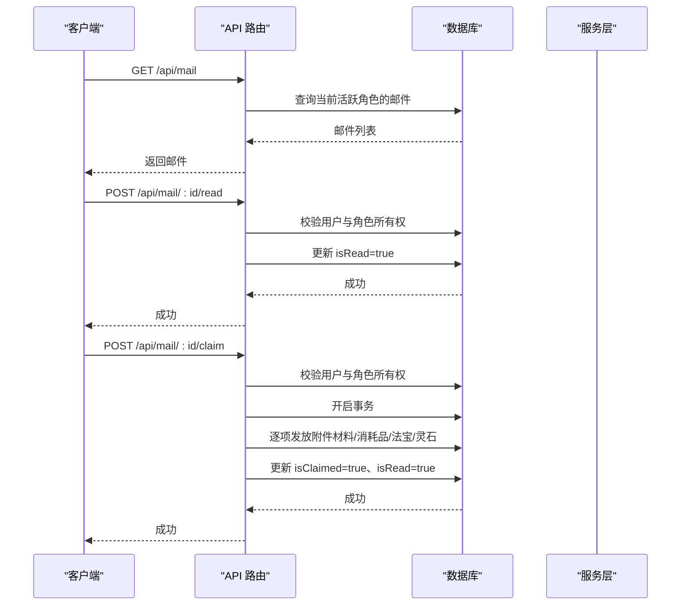
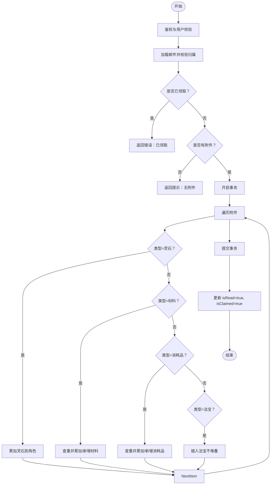

# 通信与社交表

<cite>
**本文引用的文件**
- [schema.ts](file://lib/drizzle/schema.ts)
- [MailService.ts](file://lib/services/MailService.ts)
- [route.ts（邮件列表）](file://app/api/mail/route.ts)
- [route.ts（标记已读）](file://app/api/mail/[id]/read/route.ts)
- [route.ts（领取奖励）](file://app/api/mail/[id]/claim/route.ts)
- [route.ts（未读计数）](file://app/api/mail/unread-count/route.ts)
- [MailList.tsx](file://components/mail/MailList.tsx)
- [MailDetailModal.tsx](file://components/mail/MailDetailModal.tsx)
- [page.tsx（邮件页）](file://app/mail/page.tsx)
- [0016_keen_valeria_richards.sql](file://drizzle/0016_keen_valeria_richards.sql)
- [0017_snapshot.json](file://drizzle/meta/0017_snapshot.json)
</cite>

## 目录
1. [简介](#简介)
2. [项目结构](#项目结构)
3. [核心组件](#核心组件)
4. [架构总览](#架构总览)
5. [详细组件分析](#详细组件分析)
6. [依赖关系分析](#依赖关系分析)
7. [性能考量](#性能考量)
8. [故障排查指南](#故障排查指南)
9. [结论](#结论)
10. [附录](#附录)

## 简介
本文件聚焦于“通信与社交”功能中的邮件数据模型，围绕 mails 表展开，系统性说明：
- 字段设计与业务语义：type 区分系统邮件与奖励邮件；attachments 以 JSONB 数组存储附件物品信息；isRead 与 isClaimed 的状态含义与流转。
- 如何支撑游戏内消息通知、奖励发放与社交互动。
- 结合 API 路由分析邮件创建、读取、领取的全流程数据操作。
- 提供未读邮件计数等高频查询的性能优化建议。

## 项目结构
邮件相关能力由三层组成：
- 数据层：Drizzle ORM 定义 mails 表结构与约束。
- 服务层：MailService 封装发件、查询等业务逻辑。
- 接口层：Next.js API 路由处理鉴权、权限校验与数据访问。

图表来源
- [schema.ts](file://lib/drizzle/schema.ts#L266-L279)
- [MailService.ts](file://lib/services/MailService.ts#L19-L64)
- [route.ts（邮件列表）](file://app/api/mail/route.ts#L1-L36)
- [route.ts（标记已读）](file://app/api/mail/[id]/read/route.ts#L1-L56)
- [route.ts（领取奖励）](file://app/api/mail/[id]/claim/route.ts#L1-L165)
- [route.ts（未读计数）](file://app/api/mail/unread-count/route.ts#L1-L34)

章节来源
- [schema.ts](file://lib/drizzle/schema.ts#L266-L279)
- [MailService.ts](file://lib/services/MailService.ts#L19-L64)
- [route.ts（邮件列表）](file://app/api/mail/route.ts#L1-L36)
- [route.ts（标记已读）](file://app/api/mail/[id]/read/route.ts#L1-L56)
- [route.ts（领取奖励）](file://app/api/mail/[id]/claim/route.ts#L1-L165)
- [route.ts（未读计数）](file://app/api/mail/unread-count/route.ts#L1-L34)

## 核心组件
- mails 表字段与约束
  - 主键 id、外键 cultivator_id 引用角色表、标题 title、内容 content、类型 type、附件 attachments（JSONB）、布尔状态 isRead、isClaimed、创建时间 created_at。
  - 外键 onDelete: cascade，确保角色删除时邮件级联清理。
- MailService
  - 发送邮件 sendMail：根据是否携带附件自动将 type 设为 reward；默认 isRead=false、isClaimed=false。
  - 查询邮件 getMails：按创建时间倒序返回某角色的全部邮件。
- API 路由
  - GET /api/mail：鉴权后获取当前活跃角色的邮件列表。
  - POST /api/mail/[id]/read：打开详情时标记已读。
  - POST /api/mail/[id]/claim：事务内发放附件，完成后标记已读+已领取。
  - GET /api/mail/unread-count：统计未读数量。

章节来源
- [schema.ts](file://lib/drizzle/schema.ts#L266-L279)
- [0016_keen_valeria_richards.sql](file://drizzle/0016_keen_valeria_richards.sql#L1-L13)
- [0017_snapshot.json](file://drizzle/meta/0017_snapshot.json#L844-L929)
- [MailService.ts](file://lib/services/MailService.ts#L19-L64)
- [route.ts（邮件列表）](file://app/api/mail/route.ts#L1-L36)
- [route.ts（标记已读）](file://app/api/mail/[id]/read/route.ts#L1-L56)
- [route.ts（领取奖励）](file://app/api/mail/[id]/claim/route.ts#L1-L165)
- [route.ts（未读计数）](file://app/api/mail/unread-count/route.ts#L1-L34)

## 架构总览
邮件系统围绕“角色—邮件—附件”三者协作：
- 角色（cultivators）通过外键关联邮件（mails），实现按角色维度隔离。
- 邮件（mails）通过 JSONB 字段 attachments 存储奖励物品清单，支持材料、消耗品、法宝、灵石等类型。
- 奖励领取（claim）在单事务中批量写入对应库存表，并更新邮件状态，保证一致性。

图表来源
- [route.ts（邮件列表）](file://app/api/mail/route.ts#L1-L36)
- [route.ts（标记已读）](file://app/api/mail/[id]/read/route.ts#L1-L56)
- [route.ts（领取奖励）](file://app/api/mail/[id]/claim/route.ts#L1-L165)

## 详细组件分析

### 数据模型：mails 表
- 字段语义
  - id：唯一标识。
  - cultivator_id：外键，指向角色表，onDelete: cascade。
  - title/content：标题与正文，用于消息通知与社交展示。
  - type：枚举 system/reward。若存在附件则强制为 reward。
  - attachments：JSONB 数组，元素包含 type/name/quantity/data。data 可承载具体物品细节（如材料/消耗品/法宝）。
  - isRead：布尔，表示是否已读；前端通常以视觉差异提示未读。
  - isClaimed：布尔，表示奖励是否已领取；领取后同时置为已读。
  - created_at：排序与审计依据。
- 约束与索引现状
  - 当前迁移脚本与快照未定义额外索引；外键约束已存在。
- 业务要点
  - type 与 attachments 的联动：有附件即为奖励邮件，便于 UI 与流程分流。
  - isRead/isClaimed 双状态避免重复领取与重复计数问题。

章节来源
- [schema.ts](file://lib/drizzle/schema.ts#L266-L279)
- [0016_keen_valeria_richards.sql](file://drizzle/0016_keen_valeria_richards.sql#L1-L13)
- [0017_snapshot.json](file://drizzle/meta/0017_snapshot.json#L844-L929)

### 服务层：MailService
- sendMail
  - 参数：目标角色、标题、内容、附件数组、类型。
  - 逻辑：若附件非空，则强制 type=reward；插入时默认 isRead=false、isClaimed=false。
- sendSystemMail
  - 快捷方法：发送系统通知类邮件（type=system）。
- getMails
  - 按角色查询并按创建时间倒序返回。

章节来源
- [MailService.ts](file://lib/services/MailService.ts#L19-L64)

### 接口层：API 路由

#### 邮件列表：GET /api/mail
- 流程
  - 鉴权：获取当前用户。
  - 获取当前活跃角色（status='active'）。
  - 查询该角色的邮件列表，按创建时间倒序。
- 性能注意
  - 当前未见专用索引；若邮件量大，建议在 cultivator_id 与 created_at 上建立复合索引。

章节来源
- [route.ts（邮件列表）](file://app/api/mail/route.ts#L1-L36)

#### 标记已读：POST /api/mail/[id]/read
- 流程
  - 鉴权：获取当前用户。
  - 校验邮件存在且属于当前用户的活跃角色。
  - 更新 isRead=true。
- UI 协作
  - 前端在打开详情时调用该接口，实现“打开即读”。

章节来源
- [route.ts（标记已读）](file://app/api/mail/[id]/read/route.ts#L1-L56)
- [page.tsx（邮件页）](file://app/mail/page.tsx#L1-L47)

#### 领取奖励：POST /api/mail/[id]/claim
- 流程
  - 鉴权：获取当前用户。
  - 校验邮件存在且属于当前用户的活跃角色。
  - 若已领取则拒绝重复领取。
  - 逐项发放附件：
    - 灵石：直接累加到角色灵石字段。
    - 材料：若同名同品质存在则累加数量，否则新增记录。
    - 消耗品：同材料策略。
    - 法宝：逐一插入（不堆叠）。
  - 事务提交后，同时将 isRead=true、isClaimed=true。
- 错误处理
  - 未找到邮件、无附件、已领取、内部异常均返回相应错误码与消息。

图表来源
- [route.ts（领取奖励）](file://app/api/mail/[id]/claim/route.ts#L1-L165)

章节来源
- [route.ts（领取奖励）](file://app/api/mail/[id]/claim/route.ts#L1-L165)

#### 未读计数：GET /api/mail/unread-count
- 流程
  - 鉴权：获取当前用户。
  - 获取当前活跃角色。
  - 统计该角色未读邮件数量（isRead=false）。
- 性能注意
  - 当前未见专用索引；建议在 cultivator_id + isRead 上建立复合索引以加速未读统计。

章节来源
- [route.ts（未读计数）](file://app/api/mail/unread-count/route.ts#L1-L34)

### 前端组件：邮件列表与详情
- MailList
  - 展示邮件标题、摘要、创建日期、未读小红点、奖励图标与已领取状态。
- MailDetailModal
  - 展示正文与附件预览；当存在附件且未领取时提供“收下心意”按钮，调用 /api/mail/[id]/claim。
  - 打开时可选择调用 /api/mail/[id]/read 实现“打开即读”。
- app/mail/page.tsx
  - 首次进入页面拉取邮件列表；点击条目时尝试标记已读并打开详情。

章节来源
- [MailList.tsx](file://components/mail/MailList.tsx#L1-L81)
- [MailDetailModal.tsx](file://components/mail/MailDetailModal.tsx#L1-L113)
- [page.tsx（邮件页）](file://app/mail/page.tsx#L1-L47)

## 依赖关系分析
- 组件耦合
  - 前端组件依赖服务层返回的 Mail 接口与 API 路由。
  - API 路由依赖 Drizzle Schema 与 Supabase 认证。
- 数据依赖
  - mails 表依赖 cultivators 表（外键）。
  - 领取奖励时依赖 materials/consumables/artifacts/cultivators 等库存与角色表。
- 循环依赖
  - 未发现循环依赖迹象；各层职责清晰。

图表来源
- [schema.ts](file://lib/drizzle/schema.ts#L266-L279)
- [MailService.ts](file://lib/services/MailService.ts#L19-L64)
- [route.ts（邮件列表）](file://app/api/mail/route.ts#L1-L36)
- [route.ts（标记已读）](file://app/api/mail/[id]/read/route.ts#L1-L56)
- [route.ts（领取奖励）](file://app/api/mail/[id]/claim/route.ts#L1-L165)
- [route.ts（未读计数）](file://app/api/mail/unread-count/route.ts#L1-L34)

## 性能考量
- 现状
  - mails 表未见专用索引；查询与统计依赖全表扫描。
- 建议
  - 在 cultivator_id 上建立索引，加速按角色查询。
  - 在 cultivator_id + created_at 上建立复合索引，加速列表排序与分页。
  - 在 cultivator_id + isRead 上建立复合索引，加速未读计数统计。
  - 对频繁查询的字段（如 isRead）考虑物化视图或缓存（如 Redis）以降低数据库压力。
  - 领取奖励时的附件发放采用单事务批量写入，避免多次往返；可进一步评估批量插入策略。

章节来源
- [route.ts（邮件列表）](file://app/api/mail/route.ts#L1-L36)
- [route.ts（未读计数）](file://app/api/mail/unread-count/route.ts#L1-L34)
- [route.ts（领取奖励）](file://app/api/mail/[id]/claim/route.ts#L1-L165)

## 故障排查指南
- 401 未授权
  - 症状：请求被拒绝。
  - 排查：确认 Supabase 用户会话有效；检查前端是否正确携带认证头。
- 403 无权限
  - 症状：邮件归属校验失败。
  - 排查：确认邮件属于当前用户的活跃角色；检查角色状态与用户绑定。
- 404 邮件不存在
  - 症状：读取/领取接口返回未找到。
  - 排查：确认邮件 ID 正确；检查是否已被级联删除。
- 400 已领取
  - 症状：重复领取被拒绝。
  - 排查：前端应避免重复点击；后端已做幂等保护。
- 500 内部错误
  - 症状：领取过程中异常。
  - 排查：查看后端日志；确认事务内各表写入顺序与条件；检查附件数据结构完整性。

章节来源
- [route.ts（标记已读）](file://app/api/mail/[id]/read/route.ts#L1-L56)
- [route.ts（领取奖励）](file://app/api/mail/[id]/claim/route.ts#L1-L165)
- [route.ts（未读计数）](file://app/api/mail/unread-count/route.ts#L1-L34)

## 结论
mails 表通过简洁的字段设计与 JSONB 附件机制，有效支撑了系统通知与奖励发放两大核心场景。配合 API 路由的鉴权与状态管理，实现了从“创建—读取—领取”的闭环。建议尽快补充针对 cultivator_id 的索引与复合索引，以满足高并发下的高频查询需求。

## 附录

### 字段与类型对照
- type：枚举值 system/reward
- attachments：JSONB 数组，元素包含 type/name/quantity/data
- isRead/isClaimed：布尔状态
- created_at：时间戳

章节来源
- [schema.ts](file://lib/drizzle/schema.ts#L266-L279)
- [MailService.ts](file://lib/services/MailService.ts#L6-L18)