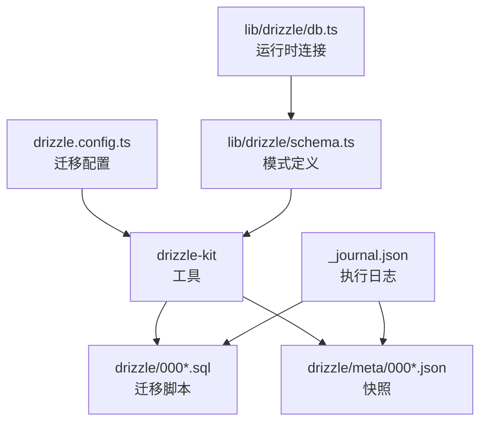
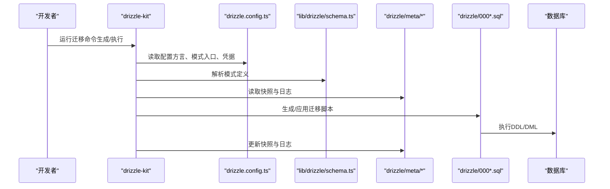
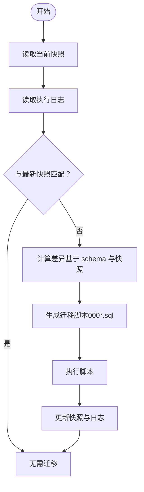
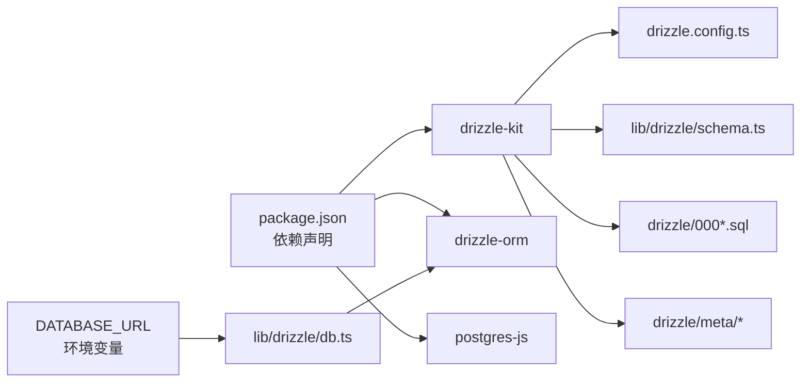

# 数据库迁移与版本控制

<cite>
**本文引用的文件列表**
- [drizzle.config.ts](file://drizzle.config.ts)
- [schema.ts](file://lib/drizzle/schema.ts)
- [db.ts](file://lib/drizzle/db.ts)
- [_journal.json](file://drizzle/meta/_journal.json)
- [0000_snapshot.json](file://drizzle/meta/0000_snapshot.json)
- [0017_snapshot.json](file://drizzle/meta/0017_snapshot.json)
- [0000_equal_the_fury.sql](file://drizzle/0000_equal_the_fury.sql)
- [0001_cynical_moonstone.sql](file://drizzle/0001_cynical_moonstone.sql)
- [package.json](file://package.json)
- [ENV_SETUP.md](file://ENV_SETUP.md)
</cite>

## 目录
1. [简介](#简介)
2. [项目结构](#项目结构)
3. [核心组件](#核心组件)
4. [架构总览](#架构总览)
5. [详细组件分析](#详细组件分析)
6. [依赖关系分析](#依赖关系分析)
7. [性能考量](#性能考量)
8. [故障排查指南](#故障排查指南)
9. [结论](#结论)
10. [附录](#附录)

## 简介
本文件系统化阐述基于 Drizzle ORM 的数据库迁移工作流，覆盖以下关键点：
- drizzle/meta 目录下的快照文件与 _journal.json 的作用与演进机制
- 000*.sql 迁移脚本的生成与执行路径
- 通过 drizzle.config.ts 配置迁移策略，确保开发、测试、生产环境一致性
- 标准操作流程：新增字段、修改表结构、回滚迁移等
- 迁移过程中的数据安全与向后兼容性保障

## 项目结构
围绕数据库迁移与版本控制的相关文件组织如下：
- 配置层：drizzle.config.ts
- 模式定义：lib/drizzle/schema.ts
- 运行时连接：lib/drizzle/db.ts
- 迁移产物：drizzle/000*.sql
- 快照与执行日志：drizzle/meta/000*.json 与 _journal.json
- 工具依赖：package.json 中的 drizzle-kit
- 环境变量：ENV_SETUP.md

图表来源
- [drizzle.config.ts](file://drizzle.config.ts#L1-L11)
- [schema.ts](file://lib/drizzle/schema.ts#L1-L292)
- [db.ts](file://lib/drizzle/db.ts#L1-L13)
- [_journal.json](file://drizzle/meta/_journal.json#L1-L132)

章节来源
- [drizzle.config.ts](file://drizzle.config.ts#L1-L11)
- [schema.ts](file://lib/drizzle/schema.ts#L1-L292)
- [db.ts](file://lib/drizzle/db.ts#L1-L13)
- [package.json](file://package.json#L1-L54)

## 核心组件
- 迁移配置（drizzle.config.ts）
  - 指定方言为 PostgreSQL
  - 指定模式入口文件为 lib/drizzle/schema.ts
  - 使用表名过滤器 wanjiedaoyou_*，仅对特定命名空间的表进行迁移
  - 从环境变量 DATABASE_URL 获取数据库连接凭据
- 模式定义（lib/drizzle/schema.ts）
  - 以 Drizzle ORM 的 pgTable 等 API 定义表结构、列类型、约束、索引等
  - 作为迁移生成的唯一真相来源
- 运行时连接（lib/drizzle/db.ts）
  - 通过 drizzle-orm/postgres-js 建立连接，并绑定 schema
  - 在应用启动或迁移执行时使用
- 迁移脚本（drizzle/000*.sql）
  - 由 drizzle-kit 基于 schema 与快照差异生成
  - 以顺序编号命名，按序执行
- 快照与日志（drizzle/meta/000*.json 与 _journal.json）
  - 快照记录某次迁移后的数据库结构快照
  - _journal.json 记录已执行的迁移条目及时间戳，用于追踪当前数据库状态

章节来源
- [drizzle.config.ts](file://drizzle.config.ts#L1-L11)
- [schema.ts](file://lib/drizzle/schema.ts#L1-L292)
- [db.ts](file://lib/drizzle/db.ts#L1-L13)
- [_journal.json](file://drizzle/meta/_journal.json#L1-L132)
- [0000_snapshot.json](file://drizzle/meta/0000_snapshot.json#L1-L730)
- [0017_snapshot.json](file://drizzle/meta/0017_snapshot.json#L1-L200)

## 架构总览
Drizzle 迁移工作流由“配置 -> 模式 -> 工具 -> 脚本/快照 -> 执行日志”构成闭环，确保每次变更都可追溯、可回滚、可复现。

图表来源
- [drizzle.config.ts](file://drizzle.config.ts#L1-L11)
- [schema.ts](file://lib/drizzle/schema.ts#L1-L292)
- [_journal.json](file://drizzle/meta/_journal.json#L1-L132)
- [0000_equal_the_fury.sql](file://drizzle/0000_equal_the_fury.sql#L1-L115)

## 详细组件分析

### 组件一：迁移配置（drizzle.config.ts）
- 方言与模式入口
  - 方言固定为 PostgreSQL，保证生成脚本与目标数据库一致
  - 模式入口指向 lib/drizzle/schema.ts，确保迁移工具读取到最新结构
- 表过滤器
  - 通过 tablesFilter: ['wanjiedaoyou_*'] 限定迁移范围，避免无关表被纳入
- 凭据来源
  - 从环境变量 DATABASE_URL 注入连接字符串，支持不同环境差异化配置

章节来源
- [drizzle.config.ts](file://drizzle.config.ts#L1-L11)

### 组件二：模式定义（lib/drizzle/schema.ts）
- 设计原则
  - 以强类型 API 描述表结构、列类型、默认值、约束、外键关系等
  - 通过统一的 schema.ts 作为“唯一真相”，避免手写 SQL 与代码不一致
- 关键点
  - 表名前缀统一为 wanjiedaoyou_，与迁移配置的过滤器保持一致
  - 外键删除策略（如 cascade）与更新策略（如 no action）明确，便于迁移工具推导差异
  - JSONB 字段用于存储动态结构，利于扩展但需注意向后兼容

章节来源
- [schema.ts](file://lib/drizzle/schema.ts#L1-L292)

### 组件三：运行时连接（lib/drizzle/db.ts）
- 连接建立
  - 使用 postgres-js 并禁用预取（prepare: false），适配事务池模式
  - 将 schema 绑定到 drizzle 实例，确保查询与迁移共享同一模式
- 使用场景
  - 应用启动时初始化连接
  - 迁移执行前后进行一致性校验（建议）

章节来源
- [db.ts](file://lib/drizzle/db.ts#L1-L13)

### 组件四：快照与执行日志（drizzle/meta/* 与 _journal.json）
- 快照文件（000*.json）
  - 记录某次迁移后数据库的完整结构快照（含表、列、约束、索引等）
  - 通过 prevId 串联历史，形成线性演进链
- 执行日志（_journal.json）
  - 记录已执行迁移的索引、标签、时间戳与断点标记
  - 用于判断当前数据库处于哪一次快照状态，决定是否需要执行后续迁移

图表来源
- [_journal.json](file://drizzle/meta/_journal.json#L1-L132)
- [0000_snapshot.json](file://drizzle/meta/0000_snapshot.json#L1-L730)
- [0017_snapshot.json](file://drizzle/meta/0017_snapshot.json#L1-L200)

章节来源
- [_journal.json](file://drizzle/meta/_journal.json#L1-L132)
- [0000_snapshot.json](file://drizzle/meta/0000_snapshot.json#L1-L730)
- [0017_snapshot.json](file://drizzle/meta/0017_snapshot.json#L1-L200)

### 组件五：迁移脚本（drizzle/000*.sql）
- 生成机制
  - drizzle-kit 基于 schema 与快照差异生成 DDL 脚本
  - 以 “--> statement-breakpoint” 分隔语句块，便于工具解析与执行
- 执行机制
  - 由工具按顺序执行，确保依赖关系正确
  - 与 _journal.json 和快照共同维护数据库状态一致性

章节来源
- [0000_equal_the_fury.sql](file://drizzle/0000_equal_the_fury.sql#L1-L115)
- [0001_cynical_moonstone.sql](file://drizzle/0001_cynical_moonstone.sql#L1-L10)

## 依赖关系分析
- 工具依赖
  - package.json 中包含 drizzle-kit，用于生成与管理迁移
- 运行时依赖
  - drizzle-orm 与 postgres-js 用于运行时连接与查询
- 环境依赖
  - DATABASE_URL 由环境变量提供，不同环境应独立配置

图表来源
- [package.json](file://package.json#L1-L54)
- [db.ts](file://lib/drizzle/db.ts#L1-L13)
- [drizzle.config.ts](file://drizzle.config.ts#L1-L11)
- [schema.ts](file://lib/drizzle/schema.ts#L1-L292)

章节来源
- [package.json](file://package.json#L1-L54)
- [ENV_SETUP.md](file://ENV_SETUP.md#L34-L39)

## 性能考量
- 迁移执行窗口
  - 在低峰时段执行大体量迁移，避免影响线上服务
- 事务与锁
  - 大型 DDL 可能导致表级锁，建议拆分执行或分批处理
- 快照与日志
  - 保持快照与日志的完整性，减少重复计算与误判
- 连接池
  - 迁移期间避免并发写入，必要时临时降级写入能力

## 故障排查指南
- 环境变量未配置
  - 症状：迁移工具无法连接数据库
  - 排查：确认 DATABASE_URL 是否在对应环境正确设置
- 表名不匹配
  - 症状：迁移未对目标表生效
  - 排查：检查 drizzle.config.ts 的 tablesFilter 与实际表名前缀是否一致
- 快照与日志不一致
  - 症状：工具无法判断当前状态，反复生成或跳过迁移
  - 排查：核对 _journal.json 与最新快照的 idx/tag 是否连续且递增
- 外键与约束冲突
  - 症状：迁移执行失败或数据不一致
  - 排查：检查 schema.ts 中外键删除/更新策略与业务需求是否一致

章节来源
- [ENV_SETUP.md](file://ENV_SETUP.md#L34-L39)
- [drizzle.config.ts](file://drizzle.config.ts#L1-L11)
- [_journal.json](file://drizzle/meta/_journal.json#L1-L132)
- [schema.ts](file://lib/drizzle/schema.ts#L1-L292)

## 结论
本项目采用 Drizzle ORM 的迁移工作流，通过配置、模式、工具、脚本与快照日志的协同，实现了可追溯、可回滚、可复现的数据库版本控制。遵循本文档的配置与操作规范，可在开发、测试、生产环境中保持一致的数据库状态，降低迁移风险并提升团队协作效率。

## 附录

### 标准操作流程（基于仓库现状）
- 添加新字段
  - 在 lib/drizzle/schema.ts 中新增列定义
  - 生成迁移：使用 drizzle-kit 生成脚本
  - 执行迁移：在目标环境执行生成的 000*.sql
  - 校验：核对 _journal.json 与最新快照
- 修改表结构（如重命名列、调整类型）
  - 在 lib/drizzle/schema.ts 中更新对应表定义
  - 生成迁移：drizzle-kit 基于差异生成脚本
  - 执行迁移：按顺序执行 000*.sql
  - 校验：确认快照 prevId 与 _journal.json 的连续性
- 回滚迁移
  - 若迁移尚未合并至主分支，可直接删除对应 000*.sql 与快照
  - 若已合并，建议新增反向迁移（逆向 DDL）以恢复结构
  - 更新 _journal.json 与快照，确保状态一致
- 环境一致性
  - 开发环境：本地 DATABASE_URL
  - 测试环境：CI/CD 中设置 DATABASE_URL
  - 生产环境：平台（如 Vercel）配置 DATABASE_URL
  - 严格区分凭据，避免误连

章节来源
- [schema.ts](file://lib/drizzle/schema.ts#L1-L292)
- [drizzle.config.ts](file://drizzle.config.ts#L1-L11)
- [_journal.json](file://drizzle/meta/_journal.json#L1-L132)
- [0000_equal_the_fury.sql](file://drizzle/0000_equal_the_fury.sql#L1-L115)
- [0001_cynical_moonstone.sql](file://drizzle/0001_cynical_moonstone.sql#L1-L10)
- [package.json](file://package.json#L1-L54)
- [ENV_SETUP.md](file://ENV_SETUP.md#L34-L39)