# 数据模型与数据库设计

<cite>
**本文档引用的文件**   
- [schema.ts](file://lib/drizzle/schema.ts)
- [cultivator.ts](file://types/cultivator.ts)
- [map.json](file://data/map.json)
- [rankings.ts](file://types/rankings.ts)
- [0017_snapshot.json](file://drizzle/meta/0017_snapshot.json)
- [0000_equal_the_fury.sql](file://drizzle/0000_equal_the_fury.sql)
- [db.ts](file://lib/drizzle/db.ts)
- [cultivatorRepository.ts](file://lib/repositories/cultivatorRepository.ts)
- [rankings.ts](file://lib/redis/rankings.ts)
- [constants.ts](file://types/constants.ts)
- [cultivatorUtils.ts](file://utils/cultivatorUtils.ts)
</cite>

## 目录
1. [引言](#引言)
2. [核心数据表结构](#核心数据表结构)
3. [JSONB数据结构与角色状态](#jsonb数据结构与角色状态)
4. [数据库演进与迁移](#数据库演进与迁移)
5. [地图与排行榜数据结构](#地图与排行榜数据结构)
6. [实体关系图（ERD）](#实体关系图（erd）)
7. [数据访问与性能优化](#数据访问与性能优化)
8. [结论](#结论)

## 引言

本文档旨在全面解析“万界道友”游戏的后端数据模型与数据库设计。该系统采用Drizzle ORM与PostgreSQL构建，核心围绕“cultivator”（修仙者）这一复杂实体展开。文档将详细阐述数据库的实体关系、JSONB字段的使用、数据库的演进过程，并重点分析`cultivators`表如何利用JSONB存储复杂的角色状态，以及`map.json`和`rankings`表在游戏逻辑中的作用。

## 核心数据表结构

系统的核心数据模型由多个表构成，以`wanjiedaoyou_cultivators`（修仙者主表）为中心，通过外键关联其他实体，形成一个完整的修仙者数据体系。

### 修仙者主表 (cultivators)

`cultivators`表是整个数据模型的核心，存储了修仙者的基本信息、境界、属性和状态。

**字段说明：**
- **id**: UUID，主键，唯一标识符。
- **userId**: UUID，外键，关联到用户系统。
- **name, title, gender, origin**: 基础信息字段，描述修仙者的姓名、称号、性别和出身。
- **realm, realm_stage**: 境界字段，标识修仙者的当前境界（如“炼气”、“筑基”）和阶段（如“初期”、“圆满”）。
- **age, lifespan**: 年龄与寿命，用于模拟修仙者的生命周期。
- **status**: 状态字段，如“active”（活跃）、“dead”（死亡）。
- **vitality, spirit, wisdom, speed, willpower**: 五大基础属性，是角色战斗力的核心。
- **spirit_stones**: 灵石数量，游戏内的主要货币。
- **max_skills**: 可学习技能的最大数量。
- **createdAt, updatedAt**: 时间戳，记录创建和更新时间。

**Section sources**
- [schema.ts](file://lib/drizzle/schema.ts#L17-L54)

### 关联实体表

修仙者的完整状态由多个1对多（1:N）和1对1（1:1）的关联表共同构成。

- **灵根表 (spiritualRoots)**: 存储修仙者的灵根信息，包括元素（金、木、水等）、强度（0-100）和品阶（天灵根、真灵根等）。
- **先天命格表 (preHeavenFates)**: 存储修仙者的先天命格，包含命格名称、类型（吉/凶）、品质和对基础属性的加成（`attribute_mod`）。
- **功法表 (cultivationTechniques)**: 存储修仙者修炼的功法，包含功法名称、品阶、对属性的加成（`bonus`）和修炼所需的最低境界。
- **技能表 (skills)**: 存储修仙者掌握的技能，包含技能名称、类型（攻击、治疗等）、元素、威力、冷却时间等战斗相关属性。
- **材料表 (materials)**: 存储修仙者拥有的炼丹、炼器材料。
- **法宝表 (artifacts)**: 存储修仙者拥有的法宝（装备），包含法宝的属性加成（`bonus`）、特殊效果（`special_effects`）和诅咒（`curses`）。
- **消耗品表 (consumables)**: 存储修仙者拥有的丹药等消耗品。
- **闭关记录表 (retreatRecords)**: 记录修仙者每次闭关的详细信息，如闭关境界、持续年数、成功与否等。
- **突破历史表 (breakthroughHistory)**: 记录修仙者每次境界突破的详细信息，包括突破前后的境界、花费年数和突破故事。
- **已装备物品表 (equippedItems)**: 1对1表，记录修仙者当前装备的法宝ID，通过外键与`artifacts`表关联。

**Section sources**
- [schema.ts](file://lib/drizzle/schema.ts#L57-L228)

## JSONB数据结构与角色状态

PostgreSQL的JSONB数据类型是本系统实现复杂数据结构的关键，它允许在关系型数据库中高效地存储和查询半结构化数据。

### cultivators表中的JSONB字段

`cultivators`表本身并未直接使用JSONB字段，但其关联的多个表（如`preHeavenFates`, `cultivationTechniques`, `artifacts`）都使用了JSONB来存储动态属性。

- **attribute_mod (preHeavenFates)**: 此JSONB字段用于存储命格对五大基础属性的加成。其结构为 `{ vitality?: number, spirit?: number, ... }`，允许一个命格同时影响多个属性，且加成值可为0或负数（凶命格）。
- **bonus (cultivationTechniques, artifacts)**: 功法和法宝均使用`bonus`字段来存储它们提供的属性加成。结构与`attribute_mod`类似，是一个可选属性的映射。
- **special_effects, curses (artifacts)**: 法宝的特殊效果和诅咒是典型的多态数据。系统使用JSONB数组来存储这些效果，每个效果对象都有一个`type`字段（如`damage_bonus`, `on_hit_add_effect`）来区分不同的效果类型，实现了灵活的扩展性。

### TypeScript接口与JSONB的映射

`types/cultivator.ts`文件中的`Cultivator`接口定义了运行时的完整数据结构，它与数据库的物理结构是分离的。当从数据库查询数据时，应用层（如`cultivatorRepository.ts`中的`assembleCultivator`函数）会将分散在多个表中的数据组装成一个完整的`Cultivator`对象。

例如，数据库中`preHeavenFates`表的`attribute_mod` JSONB字段，在TypeScript中被解析为`PreHeavenFate`接口的`attribute_mod`属性，其类型为`PreHeavenFateAttributeMod`。这种设计实现了数据存储的灵活性与应用层类型安全的完美结合。

**Section sources**
- [schema.ts](file://lib/drizzle/schema.ts#L77-L78)
- [schema.ts](file://lib/drizzle/schema.ts#L92-L93)
- [schema.ts](file://lib/drizzle/schema.ts#L150-L152)
- [cultivator.ts](file://types/cultivator.ts#L64-L70)
- [cultivator.ts](file://types/cultivator.ts#L105-L111)
- [cultivatorRepository.ts](file://lib/repositories/cultivatorRepository.ts#L25-L177)

## 数据库演进与迁移

系统的数据库结构通过Drizzle ORM的迁移系统进行版本控制和演进。`drizzle/meta`目录下的快照文件和`drizzle`目录下的SQL迁移文件共同记录了数据库的完整历史。

### 迁移文件分析

通过分析`0000_equal_the_fury.sql`和`0017_good_jimmy_woo.sql`两个迁移文件，我们可以看到数据库的演进过程：

- **初始版本 (0000)**: 创建了核心表，如`wanjiedaoyou_cultivators`, `wanjiedaoyou_skills`, `wanjiedaoyou_artifacts`等，并建立了基本的外键约束。
- **最终版本 (0017)**: 在初始版本的基础上，增加了`wanjiedaoyou_dungeon_histories`（副本历史记录）表。这表明游戏功能从基础的修仙养成，扩展到了包含副本挑战的玩法。

这种基于文件的迁移方式确保了数据库变更的可追溯性和团队协作的顺畅。

### 快照文件的作用

`drizzle/meta/0017_snapshot.json`文件是数据库的最终状态快照。它以JSON格式完整描述了所有表、列、索引、外键和约束。这个文件是Drizzle ORM生成TypeScript类型定义和进行数据库同步的基础。

**Section sources**
- [0000_equal_the_fury.sql](file://drizzle/0000_equal_the_fury.sql)
- [0017_good_jimmy_woo.sql](file://drizzle/0017_good_jimmy_woo.sql)
- [0017_snapshot.json](file://drizzle/meta/0017_snapshot.json)

## 地图与排行榜数据结构

### 游戏地图 (map.json)

`data/map.json`文件定义了游戏的世界地图，是一个静态的JSON配置文件。

**结构说明：**
- **world_name**: 世界名称。
- **map_nodes**: 主要地图节点数组，每个节点包含ID、名称、区域、标签、描述和连接的其他节点ID。
- **satellite_nodes**: 卫星节点（如隐秘地点、遗迹）数组，每个节点有父节点ID，表示其依附于哪个主节点。

此文件被`lib/game/mapSystem.ts`加载，用于在游戏内渲染地图和处理区域间的移动逻辑。

### 排行榜系统

排行榜系统由两部分构成：持久化的关系型数据和高性能的Redis缓存。

- **关系型数据**: `battleRecords`表存储了每场战斗的完整结果快照（`battleResult` JSONB字段），这是排行榜排名的原始依据。
- **Redis缓存**: `lib/redis/rankings.ts`使用Redis的有序集合（ZSET）来维护实时排行榜。`RANKING_LIST_KEY`作为ZSET的键，成员是修仙者ID，分数是其排名。此外，还使用了多个哈希键来存储挑战次数、保护状态等元数据，确保了高并发下的性能。

**Section sources**
- [map.json](file://data/map.json)
- [rankings.ts](file://types/rankings.ts)
- [rankings.ts](file://lib/redis/rankings.ts)

## 实体关系图（ERD）

```mermaid
erDiagram
wanjiedaoyou_cultivators {
uuid id PK
uuid user_id FK
string name
string realm
string realm_stage
integer age
integer vitality
integer spirit
integer wisdom
integer speed
integer willpower
integer spirit_stones
timestamp created_at
timestamp updated_at
}
wanjiedaoyou_spiritual_roots {
uuid id PK
uuid cultivator_id FK
string element
integer strength
string grade
}
wanjiedaoyou_pre_heaven_fates {
uuid id PK
uuid cultivator_id FK
string name
string type
jsonb attribute_mod
}
wanjiedaoyou_cultivation_techniques {
uuid id PK
uuid cultivator_id FK
string name
string grade
jsonb bonus
string required_realm
}
wanjiedaoyou_skills {
uuid id PK
uuid cultivator_id FK
string name
string type
string element
integer power
integer cooldown
}
wanjiedaoyou_artifacts {
uuid id PK
uuid cultivator_id FK
string name
string slot
string element
jsonb bonus
jsonb special_effects
jsonb curses
}
wanjiedaoyou_equipped_items {
uuid id PK
uuid cultivator_id FK
uuid weapon_id FK
uuid armor_id FK
uuid accessory_id FK
}
wanjiedaoyou_materials {
uuid id PK
uuid cultivator_id FK
string name
string type
string rank
integer quantity
}
wanjiedaoyou_consumables {
uuid id PK
uuid cultivator_id FK
string name
string type
jsonb effect
integer quantity
}
wanjiedaoyou_retreat_records {
uuid id PK
uuid cultivator_id FK
string realm
string realm_stage
integer years
boolean success
double precision chance
double precision roll
jsonb modifiers
}
wanjiedaoyou_breakthrough_history {
uuid id PK
uuid cultivator_id FK
string from_realm
string from_stage
string to_realm
string to_stage
integer age
integer years_spent
text story
}
wanjiedaoyou_battle_records {
uuid id PK
uuid user_id FK
uuid cultivator_id FK
uuid opponent_cultivator_id FK
jsonb battle_result
text battle_report
}
wanjiedaoyou_mails {
uuid id PK
uuid cultivator_id FK
string title
text content
boolean isRead
boolean isClaimed
jsonb attachments
}
wanjiedaoyou_dungeon_histories {
uuid id PK
uuid cultivator_id FK
string theme
jsonb result
text log
}
wanjiedaoyou_temp_cultivators {
uuid id PK
uuid user_id FK
jsonb cultivator_data
}
wanjiedaoyou_cultivators ||--o{ wanjiedaoyou_spiritual_roots : "has many"
wanjiedaoyou_cultivators ||--o{ wanjiedaoyou_pre_heaven_fates : "has many"
wanjiedaoyou_cultivators ||--o{ wanjiedaoyou_cultivation_techniques : "has many"
wanjiedaoyou_cultivators ||--o{ wanjiedaoyou_skills : "has many"
wanjiedaoyou_cultivators ||--o{ wanjiedaoyou_artifacts : "has many"
wanjiedaoyou_cultivators ||--o{ wanjiedaoyou_materials : "has many"
wanjiedaoyou_cultivators ||--o{ wanjiedaoyou_consumables : "has many"
wanjiedaoyou_cultivators ||--o{ wanjiedaoyou_retreat_records : "has many"
wanjiedaoyou_cultivators ||--o{ wanjiedaoyou_breakthrough_history : "has many"
wanjiedaoyou_cultivators ||--o{ wanjiedaoyou_battle_records : "has many"
wanjiedaoyou_cultivators ||--o{ wanjiedaoyou_mails : "has many"
wanjiedaoyou_cultivators ||--o{ wanjiedaoyou_dungeon_histories : "has many"
wanjiedaoyou_cultivators ||--|| wanjiedaoyou_equipped_items : "has one"
wanjiedaoyou_cultivators ||--o{ wanjiedaoyou_temp_cultivators : "has many"
wanjiedaoyou_equipped_items }o--|| wanjiedaoyou_artifacts : "weapon"
wanjiedaoyou_equipped_items }o--|| wanjiedaoyou_artifacts : "armor"
wanjiedaoyou_equipped_items }o--|| wanjiedaoyou_artifacts : "accessory"
wanjiedaoyou_battle_records }o--|| wanjiedaoyou_cultivators : "opponent"
```

**Diagram sources **
- [schema.ts](file://lib/drizzle/schema.ts)
- [0017_snapshot.json](file://drizzle/meta/0017_snapshot.json)

## 数据访问与性能优化

### 数据访问模式

系统通过`lib/drizzle/db.ts`创建Drizzle ORM实例，并在`lib/repositories`目录下封装了数据访问逻辑。`cultivatorRepository.ts`是核心，它提供了`createCultivator`, `getCultivatorById`等方法。`getCultivatorById`方法会并行查询多个关联表，然后在应用层组装成完整的`Cultivator`对象。

### 性能优化建议

1.  **索引优化**: 当前schema中未显式定义索引。建议为高频查询的字段添加索引，例如：
    *   `cultivators.userId` (按用户查询角色)
    *   `cultivators.realm` (按境界筛选)
    *   `skills.cultivatorId` (查询角色技能)
    *   `battleRecords.cultivatorId` (查询角色战斗记录)
2.  **JSONB查询优化**: 对于`attribute_mod`等JSONB字段的查询，可以创建GIN索引以加速`@>` (包含) 或 `?` (存在) 等操作符的查询。
3.  **Redis缓存**: 排行榜系统已经使用Redis，这是一个极佳的实践。可以考虑将`getCultivatorById`的查询结果也进行缓存，特别是对于频繁访问的活跃角色。
4.  **分页与懒加载**: 对于`inventory`（背包）这种可能包含大量物品的字段，应实现分页查询，避免一次性加载所有数据。
5.  **数据库连接池**: 确保`postgres`客户端配置了合理的连接池大小，以应对高并发。

**Section sources**
- [db.ts](file://lib/drizzle/db.ts)
- [cultivatorRepository.ts](file://lib/repositories/cultivatorRepository.ts)

## 结论

“万界道友”项目的数据模型设计精巧，充分利用了PostgreSQL的JSONB特性来处理修仙游戏中复杂的、动态的角色状态，同时保持了核心数据的关系型结构。通过Drizzle ORM，实现了类型安全的数据库操作。`map.json`提供了灵活的地图配置，而结合PostgreSQL与Redis的排行榜系统则兼顾了数据的持久化和实时性。未来可通过添加索引、优化查询和扩展缓存策略来进一步提升系统性能。