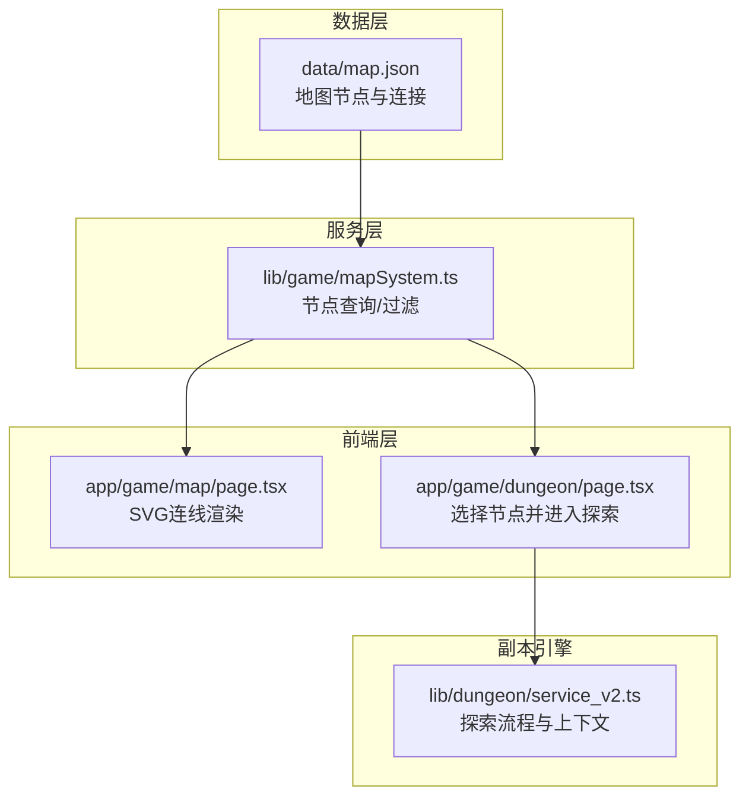
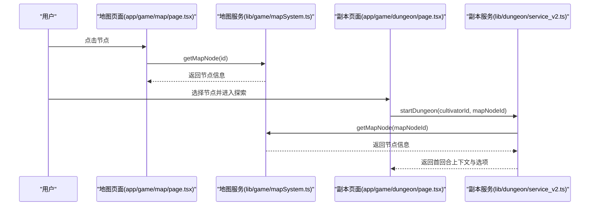
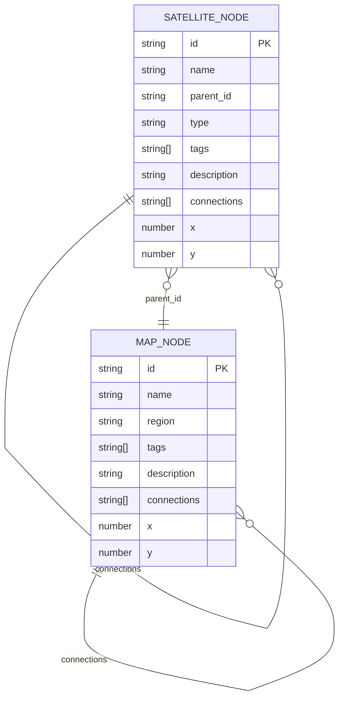
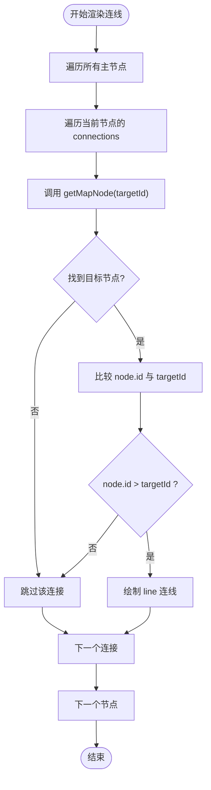
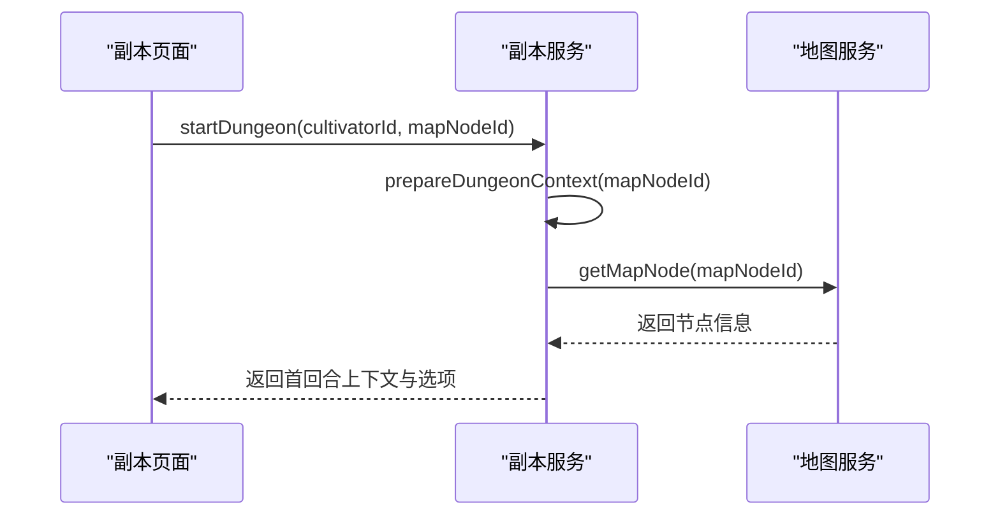
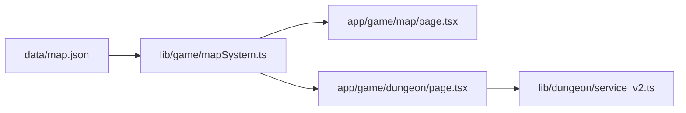

# 地图拓扑结构

<cite>
**本文引用的文件**
- [data/map.json](file://data/map.json)
- [lib/game/mapSystem.ts](file://lib/game/mapSystem.ts)
- [app/game/map/page.tsx](file://app/game/map/page.tsx)
- [app/game/dungeon/page.tsx](file://app/game/dungeon/page.tsx)
- [lib/dungeon/service_v2.ts](file://lib/dungeon/service_v2.ts)
- [map.md](file://map.md)
</cite>

## 目录
1. [引言](#引言)
2. [项目结构](#项目结构)
3. [核心组件](#核心组件)
4. [架构总览](#架构总览)
5. [详细组件分析](#详细组件分析)
6. [依赖关系分析](#依赖关系分析)
7. [性能考量](#性能考量)
8. [故障排查指南](#故障排查指南)
9. [结论](#结论)
10. [附录](#附录)

## 引言
本文件聚焦于游戏地图的拓扑连接机制，基于 data/map.json 中各节点的 connections 数组，解析其作为有向图边集的技术实现；说明 connections 如何通过目标节点 ID 构建可导航路径，并结合 lib/game/mapSystem.ts 中的 getMapNode 逻辑验证连接有效性；结合 app/game/map/page.tsx 中的 SVG 渲染代码，解释前端如何遍历 connections 生成虚线连接线以可视化地理关联；阐述该图结构在探索系统中的实际应用，如玩家移动合法性校验、区域连通性判定等，并讨论潜在的循环引用与断网检测策略。

## 项目结构
- 数据层：data/map.json 定义世界地图节点与连接关系，包含主节点与卫星节点两类。
- 服务层：lib/game/mapSystem.ts 提供地图节点查询、区域筛选、卫星节点查询等能力。
- 前端层：app/game/map/page.tsx 使用 SVG 渲染地图连线与节点；app/game/dungeon/page.tsx 将地图节点作为探索起点。
- 副本引擎：lib/dungeon/service_v2.ts 基于地图节点上下文驱动动态探索流程。

图表来源
- [data/map.json](file://data/map.json#L1-L246)
- [lib/game/mapSystem.ts](file://lib/game/mapSystem.ts#L1-L58)
- [app/game/map/page.tsx](file://app/game/map/page.tsx#L1-L250)
- [app/game/dungeon/page.tsx](file://app/game/dungeon/page.tsx#L1-L629)
- [lib/dungeon/service_v2.ts](file://lib/dungeon/service_v2.ts#L1-L200)

章节来源
- [data/map.json](file://data/map.json#L1-L246)
- [lib/game/mapSystem.ts](file://lib/game/mapSystem.ts#L1-L58)
- [app/game/map/page.tsx](file://app/game/map/page.tsx#L1-L250)
- [app/game/dungeon/page.tsx](file://app/game/dungeon/page.tsx#L1-L629)
- [lib/dungeon/service_v2.ts](file://lib/dungeon/service_v2.ts#L1-L200)

## 核心组件
- 地图数据模型
  - 主节点 MapNode：包含 id、name、region、tags、description、connections、x、y。
  - 卫星节点 SatelliteNode：包含 id、name、parent_id、type、tags、description、connections、x、y。
  - MapData：world_name + map_nodes + satellite_nodes。
- 地图查询接口
  - getAllMapNodes/getAllSatelliteNodes：获取全部节点集合。
  - getMapNode(id)：按 id 查找主节点或卫星节点。
  - getNodesByRegion(region)：按区域筛选主节点。
  - getSatellitesForNode(parentId)：按父节点筛选卫星节点。
- 前端渲染
  - app/game/map/page.tsx 使用 SVG 的 line 元素绘制连接线，遍历所有主节点的 connections 并过滤无效目标。
- 副本上下文
  - lib/dungeon/service_v2.ts 通过 getMapNode(mapNodeId) 获取节点标签与描述，作为探索上下文的一部分。

章节来源
- [lib/game/mapSystem.ts](file://lib/game/mapSystem.ts#L1-L58)
- [app/game/map/page.tsx](file://app/game/map/page.tsx#L111-L134)
- [lib/dungeon/service_v2.ts](file://lib/dungeon/service_v2.ts#L421-L438)

## 架构总览
地图拓扑由 data/map.json 的节点与连接构成，前端通过 lib/game/mapSystem.ts 的查询接口读取并渲染；探索系统通过 app/game/dungeon/page.tsx 选择节点，再由 lib/dungeon/service_v2.ts 以节点上下文驱动动态探索。

图表来源
- [app/game/map/page.tsx](file://app/game/map/page.tsx#L1-L250)
- [lib/game/mapSystem.ts](file://lib/game/mapSystem.ts#L45-L49)
- [app/game/dungeon/page.tsx](file://app/game/dungeon/page.tsx#L101-L127)
- [lib/dungeon/service_v2.ts](file://lib/dungeon/service_v2.ts#L102-L134)

## 详细组件分析

### 数据模型与拓扑表示
- data/map.json 定义了两类节点：
  - 主节点：具有 connections 数组，表示从该节点出发可达的目标节点 ID。
  - 卫星节点：具有 parent_id 字段，表示其归属的主节点；同样具有 connections 数组，通常指向自身。
- 该结构天然形成有向图：每个节点的 connections 是从该节点出发的边集合，目标节点 ID 指向邻接节点。

图表来源
- [data/map.json](file://data/map.json#L1-L246)
- [lib/game/mapSystem.ts](file://lib/game/mapSystem.ts#L3-L24)

章节来源
- [data/map.json](file://data/map.json#L1-L246)
- [lib/game/mapSystem.ts](file://lib/game/mapSystem.ts#L3-L24)

### 前端连线渲染与连接有效性校验
- app/game/map/page.tsx 的 SVG 渲染逻辑：
  - 遍历所有主节点 allNodes。
  - 对每个节点的 connections，逐个读取目标节点 targetId。
  - 通过 getMapNode(targetId) 查询目标节点，若不存在则跳过。
  - 为避免重复连线，仅在 node.id > targetId 时绘制，确保每条边只绘制一次。
  - 使用 line 元素以虚线样式 strokeDasharray="5,5" 可视化连接。
- 连接有效性校验：
  - getMapNode(id) 会在主节点与卫星节点中查找，若找不到则返回 undefined，前端据此跳过无效连线。
  - 该策略保证了前端渲染时不会出现悬空边或非法目标。

图表来源
- [app/game/map/page.tsx](file://app/game/map/page.tsx#L111-L134)
- [lib/game/mapSystem.ts](file://lib/game/mapSystem.ts#L45-L49)

章节来源
- [app/game/map/page.tsx](file://app/game/map/page.tsx#L111-L134)
- [lib/game/mapSystem.ts](file://lib/game/mapSystem.ts#L45-L49)

### 副本系统中的地图上下文与探索流程
- app/game/dungeon/page.tsx：
  - 通过 URL 参数 nodeId 获取选中的地图节点。
  - 调用 getMapNode 获取节点信息用于展示。
- lib/dungeon/service_v2.ts：
  - startDungeon 接收 mapNodeId，调用 prepareDungeonContext，内部再次调用 getMapNode(mapNodeId) 获取节点的 name/tags/description。
  - 将节点上下文注入到系统提示词与后续轮次的场景生成中，驱动动态探索。

图表来源
- [app/game/dungeon/page.tsx](file://app/game/dungeon/page.tsx#L101-L127)
- [lib/dungeon/service_v2.ts](file://lib/dungeon/service_v2.ts#L421-L438)
- [lib/game/mapSystem.ts](file://lib/game/mapSystem.ts#L45-L49)

章节来源
- [app/game/dungeon/page.tsx](file://app/game/dungeon/page.tsx#L101-L127)
- [lib/dungeon/service_v2.ts](file://lib/dungeon/service_v2.ts#L102-L134)
- [lib/dungeon/service_v2.ts](file://lib/dungeon/service_v2.ts#L421-L438)

### 探索系统中的实际应用
- 玩家移动合法性校验
  - 当玩家在地图上选择节点时，前端通过 getMapNode(id) 校验节点存在性；若不存在则无法进入探索。
  - 在探索过程中，副本服务以节点上下文驱动选项生成，避免玩家做出与地图逻辑不符的选择。
- 区域连通性判定
  - connections 数组定义了主节点之间的可达关系；通过遍历 connections 可以判断两个节点之间是否存在直接路径。
  - 若需要更复杂的连通性分析（如是否存在路径），可在服务端构建邻接表并执行 DFS/BFS。
- 动态探索与上下文
  - 副本引擎将节点 tags/description 等信息作为上下文注入，使探索内容与地图环境高度契合，增强沉浸感。

章节来源
- [lib/game/mapSystem.ts](file://lib/game/mapSystem.ts#L45-L49)
- [lib/dungeon/service_v2.ts](file://lib/dungeon/service_v2.ts#L421-L438)
- [map.md](file://map.md#L1-L98)

### 循环引用与断网检测策略
- 循环引用检测
  - 前端渲染阶段通过 node.id > targetId 的条件避免重复连线，从而规避双向边导致的重复绘制问题。
  - 服务端可对 connections 进行去重与合法性检查：确保目标 ID 存在于节点集合中，且不指向自身（可选）。
- 断网检测与容错
  - 前端渲染时若 getMapNode 返回 undefined，则跳过该连接，避免异常渲染。
  - 副本启动阶段若节点不存在，应抛出明确错误并提示用户选择有效节点。
  - 建议在服务端对 mapNodeId 做白名单校验，防止恶意或错误 ID 导致的无效查询。

章节来源
- [app/game/map/page.tsx](file://app/game/map/page.tsx#L111-L134)
- [lib/game/mapSystem.ts](file://lib/game/mapSystem.ts#L45-L49)
- [lib/dungeon/service_v2.ts](file://lib/dungeon/service_v2.ts#L102-L134)

## 依赖关系分析
- 数据依赖：data/map.json 为唯一数据源，提供节点与连接信息。
- 服务依赖：lib/game/mapSystem.ts 为前端与后端共同依赖的地图查询服务。
- 前端依赖：app/game/map/page.tsx 依赖地图查询服务进行渲染；app/game/dungeon/page.tsx 依赖地图查询服务进行节点选择。
- 后端依赖：lib/dungeon/service_v2.ts 依赖地图查询服务获取节点上下文。

图表来源
- [data/map.json](file://data/map.json#L1-L246)
- [lib/game/mapSystem.ts](file://lib/game/mapSystem.ts#L1-L58)
- [app/game/map/page.tsx](file://app/game/map/page.tsx#L1-L250)
- [app/game/dungeon/page.tsx](file://app/game/dungeon/page.tsx#L1-L629)
- [lib/dungeon/service_v2.ts](file://lib/dungeon/service_v2.ts#L1-L200)

章节来源
- [data/map.json](file://data/map.json#L1-L246)
- [lib/game/mapSystem.ts](file://lib/game/mapSystem.ts#L1-L58)
- [app/game/map/page.tsx](file://app/game/map/page.tsx#L1-L250)
- [app/game/dungeon/page.tsx](file://app/game/dungeon/page.tsx#L1-L629)
- [lib/dungeon/service_v2.ts](file://lib/dungeon/service_v2.ts#L1-L200)

## 性能考量
- 前端渲染
  - SVG 连线数量与节点数呈 O(n) 级别，但每条边可能被重复计算两次（正向与反向）。通过 node.id > targetId 条件可将绘制次数减半，避免重复连线。
  - 对于大规模地图，建议在服务端预先生成边集或进行分页渲染。
- 查询性能
  - getMapNode 使用线性查找，复杂度 O(n)。若节点规模增长，可考虑在服务端维护索引（如 Map 或 Set）以优化查找。
- 副本上下文
  - prepareDungeonContext 会二次调用 getMapNode，建议缓存节点信息以减少重复查询。

章节来源
- [app/game/map/page.tsx](file://app/game/map/page.tsx#L111-L134)
- [lib/game/mapSystem.ts](file://lib/game/mapSystem.ts#L45-L49)
- [lib/dungeon/service_v2.ts](file://lib/dungeon/service_v2.ts#L421-L438)

## 故障排查指南
- 连线缺失
  - 检查目标节点是否存在：若 getMapNode 返回 undefined，连线会被跳过。
  - 检查 connections 是否正确：确保目标 ID 与现有节点 id 匹配。
- 重复连线
  - 确认 node.id > targetId 条件是否生效，避免双向边导致的重复绘制。
- 节点选择无效
  - 在副本启动时，若 mapNodeId 不存在，应提示用户重新选择有效节点。
- 上下文为空
  - 确保 data/map.json 中节点的 name/tags/description 填写完整，以便副本上下文生成。

章节来源
- [app/game/map/page.tsx](file://app/game/map/page.tsx#L111-L134)
- [lib/game/mapSystem.ts](file://lib/game/mapSystem.ts#L45-L49)
- [lib/dungeon/service_v2.ts](file://lib/dungeon/service_v2.ts#L102-L134)

## 结论
本项目以 data/map.json 为核心，通过 lib/game/mapSystem.ts 提供统一的节点查询接口，实现了地图拓扑的可视化与探索系统的上下文驱动。前端以 SVG 渲染连接线，服务端以节点上下文驱动动态探索，整体结构清晰、职责分离。为进一步提升稳定性与性能，建议在服务端进行连接合法性校验与索引优化，并完善错误提示与断网容错机制。

## 附录
- 地图系统设计文档要点
  - 静态骨架 + 动态血肉：节点坐标与标签预设，内容由 LLM 实时生成。
  - 环境标签驱动：将节点 tags 作为 LLM 的输入权重，确保场景与环境契合。
  - 动态演化：引入天时、事件联动与探索度系统，增强地图“活”起来的效果。

章节来源
- [map.md](file://map.md#L1-L98)