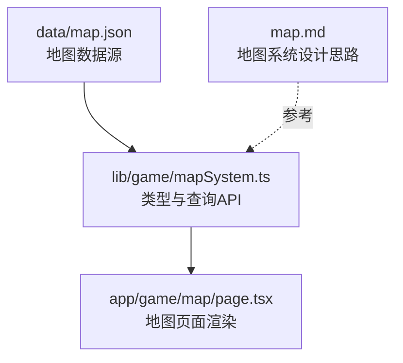
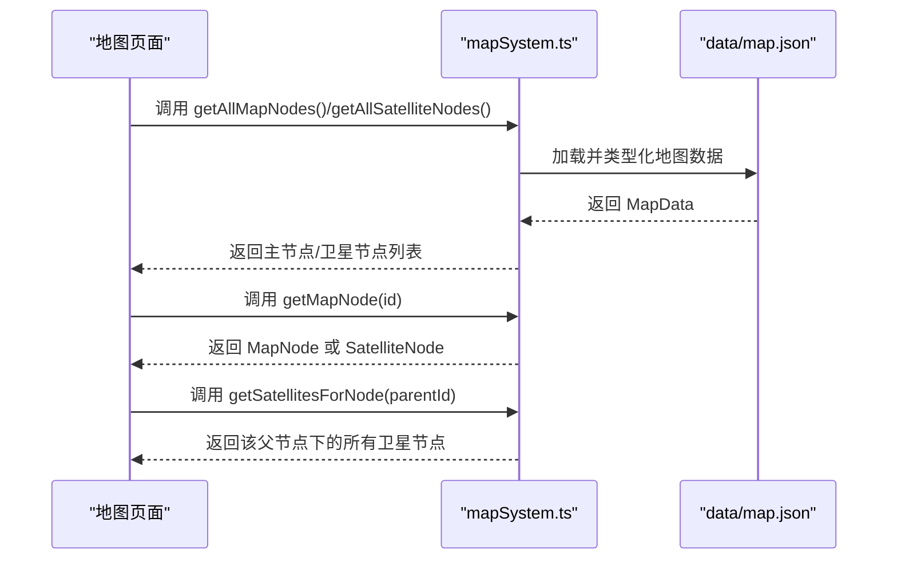
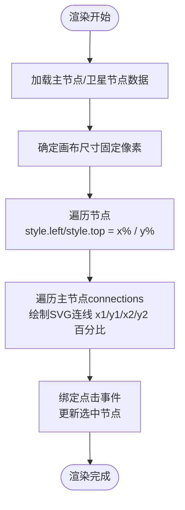
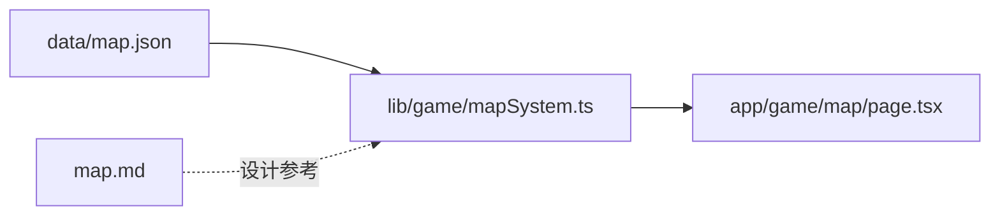

# 地图节点模型

<cite>
**本文引用的文件**
- [data/map.json](file://data/map.json)
- [lib/game/mapSystem.ts](file://lib/game/mapSystem.ts)
- [app/game/map/page.tsx](file://app/game/map/page.tsx)
- [map.md](file://map.md)
</cite>

## 目录
1. [引言](#引言)
2. [项目结构](#项目结构)
3. [核心组件](#核心组件)
4. [架构总览](#架构总览)
5. [详细组件分析](#详细组件分析)
6. [依赖关系分析](#依赖关系分析)
7. [性能考量](#性能考量)
8. [故障排查指南](#故障排查指南)
9. [结论](#结论)

## 引言
本文件聚焦于游戏地图中的“节点（Node）”数据模型，基于 data/map.json 的 map_nodes 与 satellite_nodes 数组，结合 lib/game/mapSystem.ts 中的 MapNode 与 SatelliteNode 接口定义，系统性解释各字段的语义与用途。文档特别强调：
- 主节点与卫星节点在结构与职责上的差异
- 卫星节点中 parent_id 的层级归属作用
- type 字段对地点类型的分类意义
- 前端渲染中节点坐标（x/y）如何映射为百分比位置以实现响应式布局
- 如何使用 getMapNode 与 getSatellitesForNode 等 API 查询节点信息

## 项目结构
围绕地图节点模型的相关文件组织如下：
- 数据源：data/map.json 提供世界名称、主节点与卫星节点的完整数据
- 类型与服务：lib/game/mapSystem.ts 定义 MapNode/SatelliteNode 接口与查询函数
- 前端渲染：app/game/map/page.tsx 使用上述数据与接口进行地图绘制与交互

图表来源
- [data/map.json](file://data/map.json#L1-L246)
- [lib/game/mapSystem.ts](file://lib/game/mapSystem.ts#L1-L58)
- [app/game/map/page.tsx](file://app/game/map/page.tsx#L1-L250)

章节来源
- [data/map.json](file://data/map.json#L1-L246)
- [lib/game/mapSystem.ts](file://lib/game/mapSystem.ts#L1-L58)
- [app/game/map/page.tsx](file://app/game/map/page.tsx#L1-L250)
- [map.md](file://map.md#L1-L98)

## 核心组件
- MapNode（主节点）
  - 字段：id、name、region、tags、description、connections、x、y
  - 语义要点：主节点代表地图上的主要区域或枢纽，具备区域归属（region）、标签集合（tags）、描述（description）、邻接关系（connections）以及二维坐标（x/y）
- SatelliteNode（卫星节点）
  - 字段：id、name、parent_id、type、tags、description、connections、x、y
  - 语义要点：卫星节点是依附于某个主节点的附属地点，通过 parent_id 指向其父节点；type 表示地点类型（如“遗迹”“荒野”等），其余与主节点一致

章节来源
- [lib/game/mapSystem.ts](file://lib/game/mapSystem.ts#L3-L24)

## 架构总览
地图节点模型的运行链路如下：
- 数据层：data/map.json 提供世界名称、主节点与卫星节点
- 服务层：lib/game/mapSystem.ts 将 JSON 数据类型化，并提供查询 API
- 视图层：app/game/map/page.tsx 读取节点数据，将 x/y 映射为百分比位置，渲染连线与节点图标，并支持交互选择

图表来源
- [lib/game/mapSystem.ts](file://lib/game/mapSystem.ts#L37-L58)
- [data/map.json](file://data/map.json#L1-L246)
- [app/game/map/page.tsx](file://app/game/map/page.tsx#L27-L31)

## 详细组件分析

### 主节点 MapNode 字段详解
- id：唯一标识符，用于与其他节点建立连接（connections）与外部导航
- name：节点名称，渲染时可截取“·”后的部分作为标签文本
- region：所属大区（如“天南”“乱星海”），用于筛选与分组
- tags：标签数组，用于描述节点特性（如副本、资源、危险等级等）
- description：节点描述，用于详情面板展示
- connections：邻接节点 ID 列表，用于绘制连接线
- x/y：节点坐标，单位为百分比，用于在固定尺寸画布上定位

章节来源
- [lib/game/mapSystem.ts](file://lib/game/mapSystem.ts#L3-L12)
- [data/map.json](file://data/map.json#L1-L153)
- [app/game/map/page.tsx](file://app/game/map/page.tsx#L112-L134)

### 卫星节点 SatelliteNode 字段详解
- id：唯一标识符
- name：节点名称
- parent_id：父节点 ID，用于建立层级归属关系
- type：地点类型（如“遗迹”“荒野”“水下遗迹”等），用于分类与样式区分
- tags：标签数组
- description：描述
- connections：邻接节点 ID 列表
- x/y：坐标（百分比）

章节来源
- [lib/game/mapSystem.ts](file://lib/game/mapSystem.ts#L14-L24)
- [data/map.json](file://data/map.json#L155-L245)
- [app/game/map/page.tsx](file://app/game/map/page.tsx#L171-L199)

### 坐标系统与响应式布局
- 固定画布尺寸：地图容器设置为固定宽高（像素级），确保坐标映射稳定
- 百分比定位：节点的 x/y 以百分比形式直接应用到元素的 left/top，实现随容器缩放的自适应
- 连线绘制：SVG 的 line 元素同样使用 x1/y1/x2/y2 的百分比值，保证连线与节点同步缩放
- 缩放与平移：通过第三方库实现缩放和平移，百分比坐标在变换后仍保持相对位置不变

图表来源
- [app/game/map/page.tsx](file://app/game/map/page.tsx#L86-L134)
- [app/game/map/page.tsx](file://app/game/map/page.tsx#L137-L169)
- [app/game/map/page.tsx](file://app/game/map/page.tsx#L171-L199)

章节来源
- [app/game/map/page.tsx](file://app/game/map/page.tsx#L86-L134)
- [app/game/map/page.tsx](file://app/game/map/page.tsx#L137-L169)
- [app/game/map/page.tsx](file://app/game/map/page.tsx#L171-L199)

### API 使用示例（路径指引）
- 获取全部主节点
  - 路径：lib/game/mapSystem.ts
  - 方法：getAllMapNodes()
  - 用途：渲染主节点列表与连线
- 获取全部卫星节点
  - 路径：lib/game/mapSystem.ts
  - 方法：getAllSatelliteNodes()
  - 用途：渲染卫星节点图标与标签
- 根据 ID 获取节点
  - 路径：lib/game/mapSystem.ts
  - 方法：getMapNode(id)
  - 用途：详情面板展示与跳转
- 获取某主节点下的所有卫星节点
  - 路径：lib/game/mapSystem.ts
  - 方法：getSatellitesForNode(parentId)
  - 用途：按父节点聚合显示卫星节点

章节来源
- [lib/game/mapSystem.ts](file://lib/game/mapSystem.ts#L37-L58)
- [app/game/map/page.tsx](file://app/game/map/page.tsx#L27-L31)

### 区域筛选与类型分类
- 区域筛选：getNodesByRegion(region) 可按 region 过滤主节点，便于按大区展示
- 类型分类：卫星节点的 type 字段用于区分地点类型，前端可据此设置不同样式或交互行为

章节来源
- [lib/game/mapSystem.ts](file://lib/game/mapSystem.ts#L51-L54)
- [data/map.json](file://data/map.json#L155-L245)

## 依赖关系分析
- 数据依赖：lib/game/mapSystem.ts 直接导入 data/map.json，形成“类型化数据层”
- 视图依赖：app/game/map/page.tsx 依赖 mapSystem.ts 的查询函数与类型定义
- 设计参考：map.md 对地图系统的整体设计提供了背景说明，强调“静态骨架 + 动态血肉”的理念

图表来源
- [data/map.json](file://data/map.json#L1-L246)
- [lib/game/mapSystem.ts](file://lib/game/mapSystem.ts#L1-L36)
- [app/game/map/page.tsx](file://app/game/map/page.tsx#L1-L25)
- [map.md](file://map.md#L1-L98)

章节来源
- [data/map.json](file://data/map.json#L1-L246)
- [lib/game/mapSystem.ts](file://lib/game/mapSystem.ts#L1-L36)
- [app/game/map/page.tsx](file://app/game/map/page.tsx#L1-L25)
- [map.md](file://map.md#L1-L98)

## 性能考量
- 数据加载：mapSystem.ts 将 JSON 数据一次性类型化并缓存在模块作用域，避免重复解析
- 查询复杂度：主节点与卫星节点的查找为线性扫描，节点规模较小，性能开销可忽略
- 渲染优化：SVG 连线仅在主节点上绘制，且对重复边进行过滤，减少不必要的 DOM 元素
- 响应式布局：百分比定位与固定画布尺寸相结合，避免频繁重排

章节来源
- [lib/game/mapSystem.ts](file://lib/game/mapSystem.ts#L33-L36)
- [app/game/map/page.tsx](file://app/game/map/page.tsx#L112-L134)

## 故障排查指南
- 节点未显示
  - 检查 x/y 是否在 0-100 范围内，超出范围可能导致元素被裁剪
  - 检查父容器尺寸是否正确设置（固定像素宽高）
- 连线缺失
  - 确认 connections 中的目标节点 ID 存在于数据中
  - 确认过滤条件（如 node.id > targetId）不会误删边
- 选中节点为空
  - 确认 getMapNode(id) 返回值是否为 undefined（ID 不匹配或数据未加载）
- 卫星节点未聚合
  - 确认 parent_id 与主节点 id 一致
  - 确认 getSatellitesForNode(parentId) 的调用参数正确

章节来源
- [app/game/map/page.tsx](file://app/game/map/page.tsx#L112-L134)
- [app/game/map/page.tsx](file://app/game/map/page.tsx#L27-L31)
- [lib/game/mapSystem.ts](file://lib/game/mapSystem.ts#L45-L58)

## 结论
本文件系统梳理了地图节点模型的数据结构、字段语义与前后端协作方式。主节点与卫星节点在结构上高度一致，差异主要体现在层级归属（parent_id）与类型分类（type）。前端通过百分比坐标与固定画布实现了响应式布局，配合 SVG 连线与交互事件，构建了直观的地图浏览体验。借助 mapSystem.ts 的查询 API，开发者可以便捷地实现节点检索、区域筛选与父子聚合等常见功能。