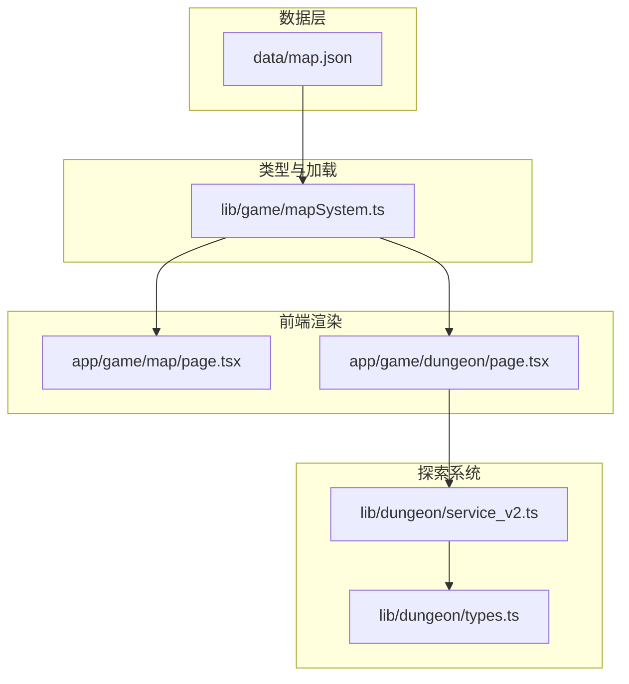
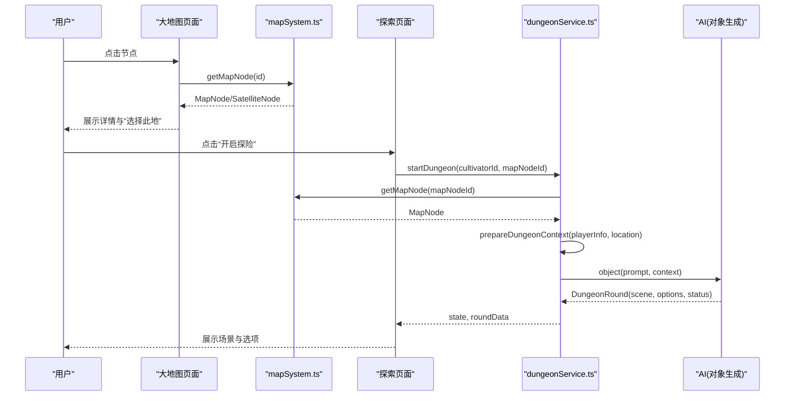
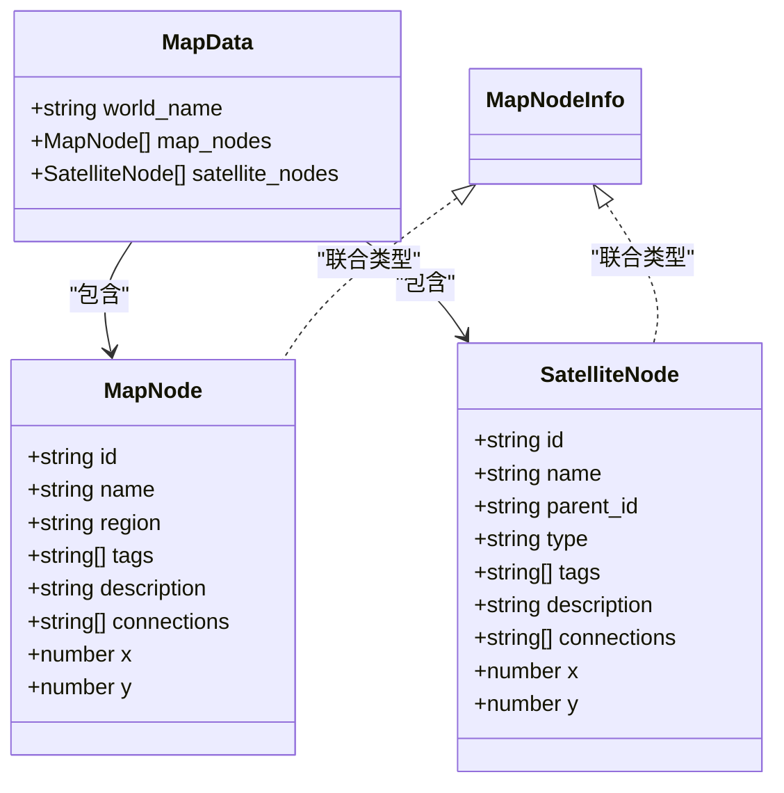
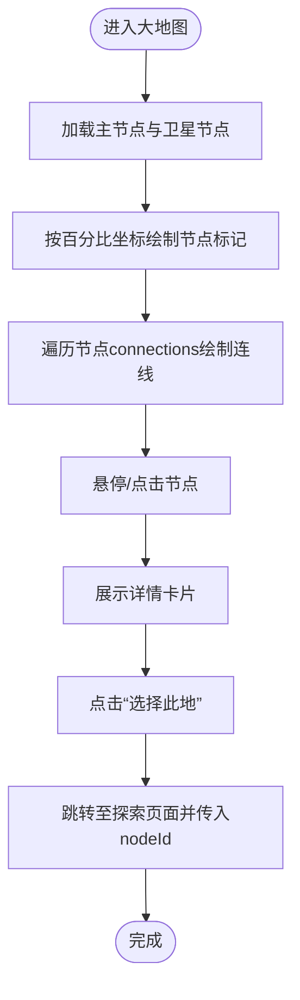
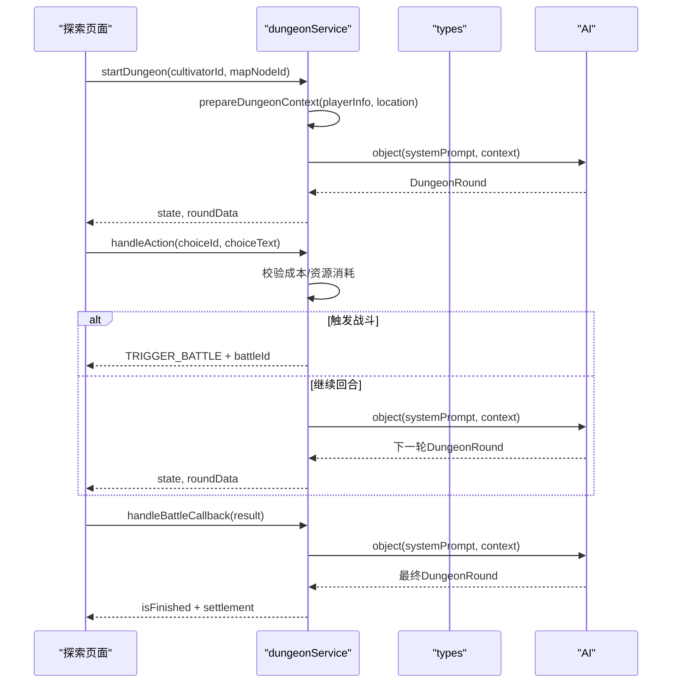
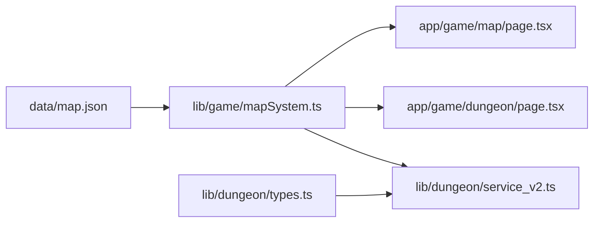

# 游戏地图数据结构

<cite>
**本文引用的文件**
- [data/map.json](file://data/map.json)
- [lib/game/mapSystem.ts](file://lib/game/mapSystem.ts)
- [app/game/map/page.tsx](file://app/game/map/page.tsx)
- [app/game/dungeon/page.tsx](file://app/game/dungeon/page.tsx)
- [lib/dungeon/service_v2.ts](file://lib/dungeon/service_v2.ts)
- [lib/dungeon/types.ts](file://lib/dungeon/types.ts)
- [map.md](file://map.md)
</cite>

## 目录
1. [引言](#引言)
2. [项目结构](#项目结构)
3. [核心组件](#核心组件)
4. [架构总览](#架构总览)
5. [详细组件分析](#详细组件分析)
6. [依赖分析](#依赖分析)
7. [性能考虑](#性能考虑)
8. [故障排查指南](#故障排查指南)
9. [结论](#结论)

## 引言
本文件面向希望理解“修仙世界地图”的开发者与策划，系统性解析 data/map.json 的顶层结构与节点语义，并结合 lib/game/mapSystem.ts 的类型与查询接口，说明地图数据如何驱动前端可视化渲染与玩家移动判定。同时，我们将阐明主节点与卫星节点的层级关系、connections 数组如何构建可导航的图结构，并展示地图数据如何作为上下文输入，驱动后端副本探索系统（dungeon）的动态叙事与资源消耗。

## 项目结构
- 数据层：data/map.json 定义世界名称、主节点集合与卫星节点集合，提供节点坐标与连接关系。
- 类型与加载：lib/game/mapSystem.ts 提供 MapNode/SatelliteNode/MapData 类型与查询函数。
- 前端渲染：app/game/map/page.tsx 使用 SVG 连线与节点标记绘制地图，支持缩放平移与选中详情。
- 探索系统：lib/dungeon/service_v2.ts 将地图节点作为 location 上下文注入 AI，驱动每轮场景与选项生成；app/game/dungeon/page.tsx 展示探索界面与战斗流。

图表来源
- [data/map.json](file://data/map.json#L1-L246)
- [lib/game/mapSystem.ts](file://lib/game/mapSystem.ts#L1-L58)
- [app/game/map/page.tsx](file://app/game/map/page.tsx#L1-L250)
- [app/game/dungeon/page.tsx](file://app/game/dungeon/page.tsx#L1-L629)
- [lib/dungeon/service_v2.ts](file://lib/dungeon/service_v2.ts#L1-L545)
- [lib/dungeon/types.ts](file://lib/dungeon/types.ts#L1-L201)

章节来源
- [data/map.json](file://data/map.json#L1-L246)
- [lib/game/mapSystem.ts](file://lib/game/mapSystem.ts#L1-L58)

## 核心组件
- 顶层结构
  - world_name：世界名称，用于 UI 展示与上下文描述。
  - map_nodes：主节点数组，每个节点包含 id、name、region、tags、description、connections、x、y。
  - satellite_nodes：卫星节点数组，每个节点包含 id、name、parent_id、type、tags、description、connections、x、y。
- 节点字段语义
  - id：唯一标识，用于连接与查询。
  - name：节点名称，UI 显示与上下文描述。
  - region：所属大区，用于筛选与分组。
  - tags：环境/主题标签，驱动探索系统动态生成与资源消耗。
  - description：节点描述，用于详情面板。
  - connections：邻接节点 id 列表，构成图结构。
  - x/y：节点在画布上的百分比坐标，用于前端 SVG 渲染。
- 主节点与卫星节点的关系
  - 卫星节点通过 parent_id 关联到主节点，形成“主节点-卫星节点”的层级。
  - 卫星节点同样具备 connections，可与其他主/卫星节点相连，形成更复杂的网络。
- 图结构与导航
  - connections 构建无向图（或半定向图），前端通过连线渲染，后端通过 getMapNode/getNodesByRegion/getSatellitesForNode 查询辅助导航。

章节来源
- [data/map.json](file://data/map.json#L1-L246)
- [lib/game/mapSystem.ts](file://lib/game/mapSystem.ts#L1-L58)

## 架构总览
地图数据从 data/map.json 加载到内存，经由 mapSystem.ts 的类型与查询函数暴露给前端与后端。前端在大地图页面渲染节点与连线，并允许用户选择目标节点；后端在探索页面将所选节点作为 location 上下文注入 AI，生成每轮场景与选项，并根据选项中的成本类型执行资源消耗与战斗拦截。

图表来源
- [app/game/map/page.tsx](file://app/game/map/page.tsx#L1-L250)
- [lib/game/mapSystem.ts](file://lib/game/mapSystem.ts#L1-L58)
- [app/game/dungeon/page.tsx](file://app/game/dungeon/page.tsx#L1-L629)
- [lib/dungeon/service_v2.ts](file://lib/dungeon/service_v2.ts#L1-L545)

## 详细组件分析

### 数据模型与类型定义
- MapData：包含 world_name、map_nodes、satellite_nodes。
- MapNode：主节点字段集合。
- SatelliteNode：卫星节点字段集合，新增 parent_id、type。
- MapNodeInfo：联合类型，用于统一查询返回。

图表来源
- [lib/game/mapSystem.ts](file://lib/game/mapSystem.ts#L1-L58)

章节来源
- [lib/game/mapSystem.ts](file://lib/game/mapSystem.ts#L1-L58)

### 前端可视化渲染流程
- 节点与连线
  - 读取所有主节点，按 x/y 百分比定位，绘制圆形标记与标签。
  - 读取所有卫星节点，绘制菱形标记与悬停标签。
  - 使用 SVG 绘制连线：遍历每个节点的 connections，查找目标节点并绘制线段。
- 交互
  - 点击节点高亮并显示详情卡片，包含名称、描述、标签与“选择此地”按钮。
  - 点击“选择此地”跳转至探索页面并携带 nodeId 参数。

图表来源
- [app/game/map/page.tsx](file://app/game/map/page.tsx#L1-L250)

章节来源
- [app/game/map/page.tsx](file://app/game/map/page.tsx#L1-L250)

### 探索系统中的地图数据使用
- 选择节点
  - 探索页面从 URL 获取 nodeId，调用 getMapNode 获取节点信息。
- 上下文注入
  - dungeonService.prepareDungeonContext 将节点的 name/tags/description 作为 location 上下文注入 AI。
- 回合推进
  - 每轮由 AI 生成场景描述与交互选项，后端根据选项中的成本类型执行资源消耗或触发战斗拦截。
- 结算与归档
  - 副本结束后，根据 summary_of_sacrifice 与危险分生成最终评价，并归档到数据库。

图表来源
- [app/game/dungeon/page.tsx](file://app/game/dungeon/page.tsx#L1-L629)
- [lib/dungeon/service_v2.ts](file://lib/dungeon/service_v2.ts#L1-L545)
- [lib/dungeon/types.ts](file://lib/dungeon/types.ts#L1-L201)

章节来源
- [app/game/dungeon/page.tsx](file://app/game/dungeon/page.tsx#L1-L629)
- [lib/dungeon/service_v2.ts](file://lib/dungeon/service_v2.ts#L1-L545)
- [lib/dungeon/types.ts](file://lib/dungeon/types.ts#L1-L201)

### 地图数据驱动的探索系统要点
- 节点标签（tags）作为 AI 的“环境权重”，决定场景生成与选项倾向。
- connections 决定可移动的邻接关系，前端用于连线渲染，后端用于验证移动合法性与生成可选路径。
- region 字段可用于筛选与分组，便于 UI 展示与功能扩展。
- 卫星节点提供“隐藏/遗迹/危险区”等差异化内容，增强探索多样性。

章节来源
- [map.md](file://map.md#L1-L98)
- [data/map.json](file://data/map.json#L1-L246)
- [lib/game/mapSystem.ts](file://lib/game/mapSystem.ts#L1-L58)

## 依赖分析
- 数据依赖
  - data/map.json 是唯一数据源，被 mapSystem.ts 以模块导入方式加载。
- 类型依赖
  - mapSystem.ts 定义 MapData/MapNode/SatelliteNode，供前端与后端共享。
- 前端依赖
  - app/game/map/page.tsx 依赖 mapSystem.ts 的查询函数与类型。
  - app/game/dungeon/page.tsx 依赖 mapSystem.ts 的 getMapNode 与类型。
- 后端依赖
  - lib/dungeon/service_v2.ts 依赖 mapSystem.ts 的 getMapNode 与类型。
  - lib/dungeon/types.ts 定义探索系统的核心数据结构与约束。

图表来源
- [data/map.json](file://data/map.json#L1-L246)
- [lib/game/mapSystem.ts](file://lib/game/mapSystem.ts#L1-L58)
- [app/game/map/page.tsx](file://app/game/map/page.tsx#L1-L250)
- [app/game/dungeon/page.tsx](file://app/game/dungeon/page.tsx#L1-L629)
- [lib/dungeon/service_v2.ts](file://lib/dungeon/service_v2.ts#L1-L545)
- [lib/dungeon/types.ts](file://lib/dungeon/types.ts#L1-L201)

章节来源
- [lib/game/mapSystem.ts](file://lib/game/mapSystem.ts#L1-L58)
- [lib/dungeon/service_v2.ts](file://lib/dungeon/service_v2.ts#L1-L545)

## 性能考虑
- 前端渲染
  - SVG 连线数量与节点数量呈 O(n) 级别，建议在大规模地图时限制渲染范围或启用虚拟化。
  - 百分比坐标计算简单，渲染开销低；注意移动端缩放与容器尺寸适配。
- 后端探索
  - AI 对话与资源处理为 IO 密集型，Redis 缓存状态可减少重复计算。
  - 历史压缩仅保留关键摘要，有助于控制 Token 消耗与稳定性。
- 数据访问
  - mapSystem.ts 将 JSON 作为内存对象，查询为 O(n) 线性扫描；若节点规模增长，可考虑建立索引（如 Map）以优化 getMapNode/getNodesByRegion/getSatellitesForNode。

[本节为通用指导，无需列出具体文件来源]

## 故障排查指南
- 节点未显示或连线缺失
  - 检查 data/map.json 中节点的 x/y 是否合理，以及 connections 中的 id 是否存在于 map_nodes/satellite_nodes。
  - 确认前端渲染逻辑仅绘制 node.id < targetId 的连线，避免重复绘制。
- 选择节点后无法进入探索
  - 检查 URL 中 nodeId 是否正确，确保 getMapNode 返回有效节点。
  - 确认后端 dungeonService.prepareDungeonContext 能从 mapSystem.ts 正确获取节点。
- 探索异常中断
  - 若触发战斗拦截，需检查选项中的 costs 是否包含 battle 类型，后端是否正确创建 BattleSession 并保存状态。
  - 若结算阶段无奖励，检查 generateRealRewards 的实现与 reward_tier 的匹配逻辑。

章节来源
- [app/game/map/page.tsx](file://app/game/map/page.tsx#L1-L250)
- [lib/game/mapSystem.ts](file://lib/game/mapSystem.ts#L1-L58)
- [lib/dungeon/service_v2.ts](file://lib/dungeon/service_v2.ts#L1-L545)

## 结论
data/map.json 以简洁的 JSON 描述了“主节点-卫星节点”的二维世界骨架，配合 mapSystem.ts 的类型与查询接口，实现了从前端可视化到后端探索系统的完整闭环。通过 tags 与 connections，地图不仅是导航工具，更是驱动动态叙事与资源消耗的核心上下文。未来可在保持现有结构稳定性的前提下，扩展节点类型、引入区域聚合与动态事件，进一步提升沉浸感与可玩性。