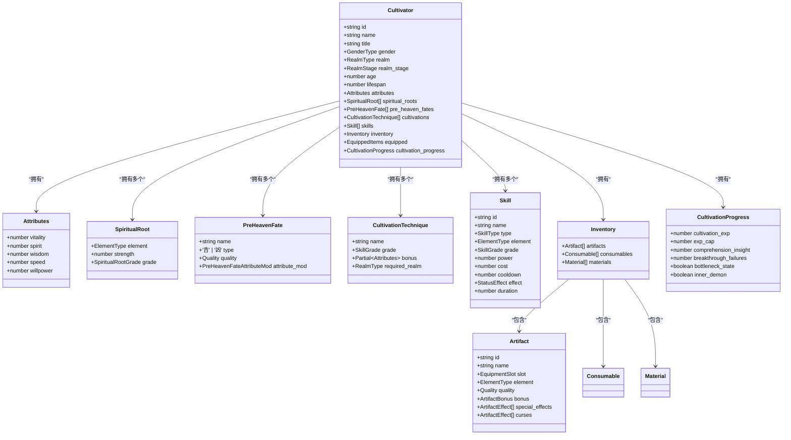
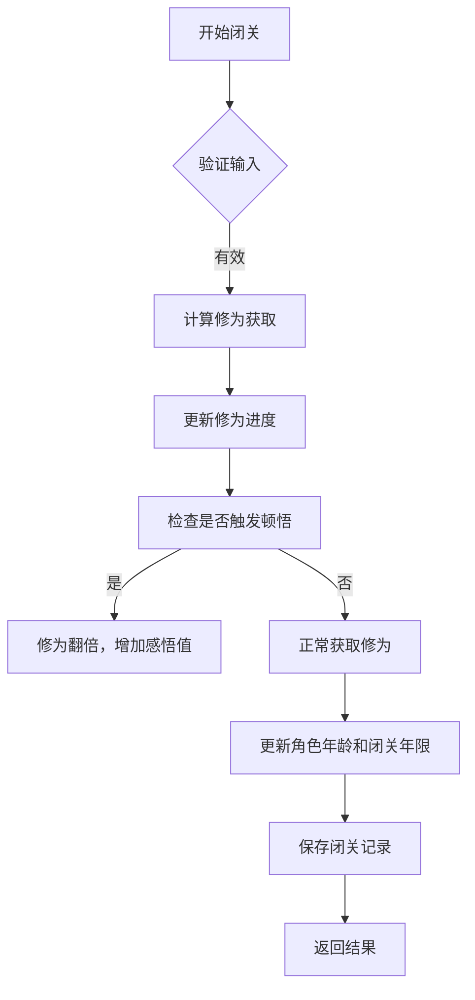
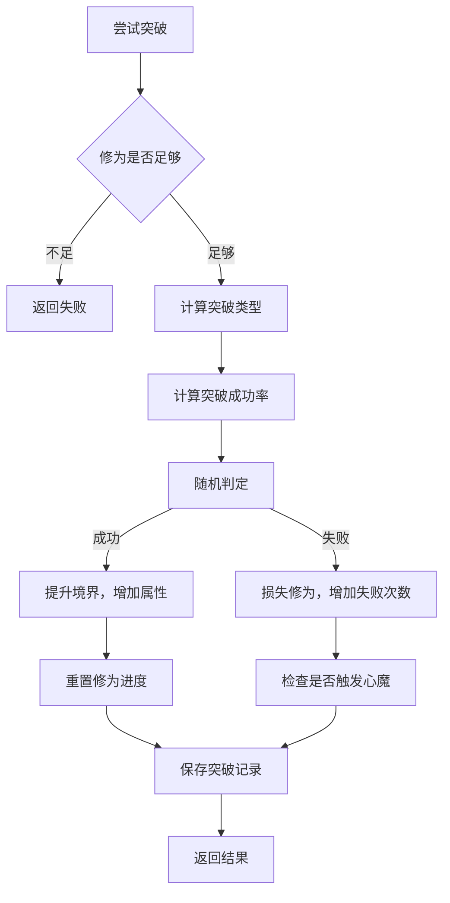
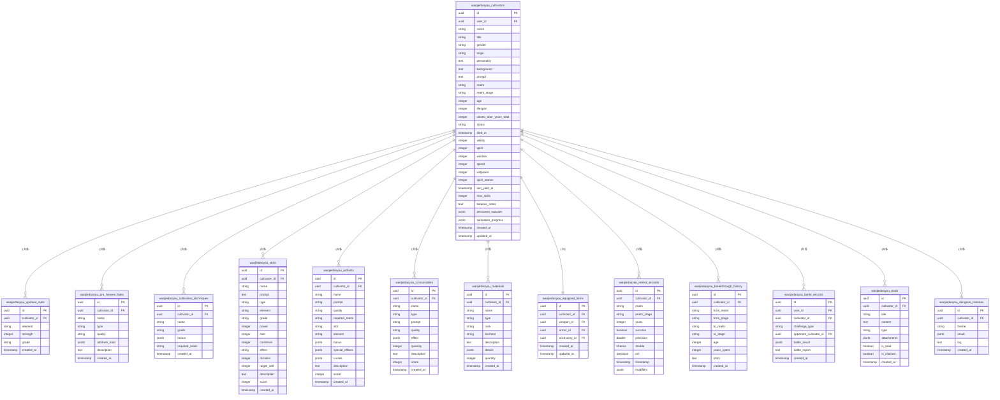
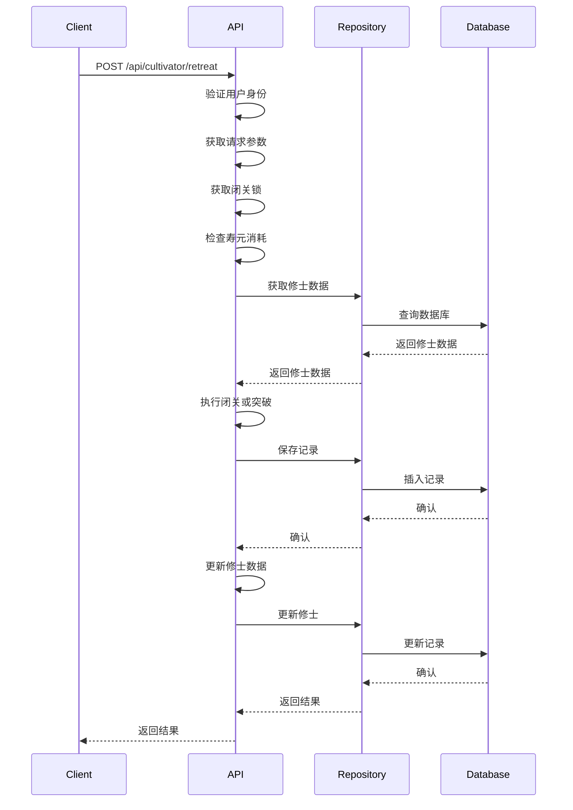
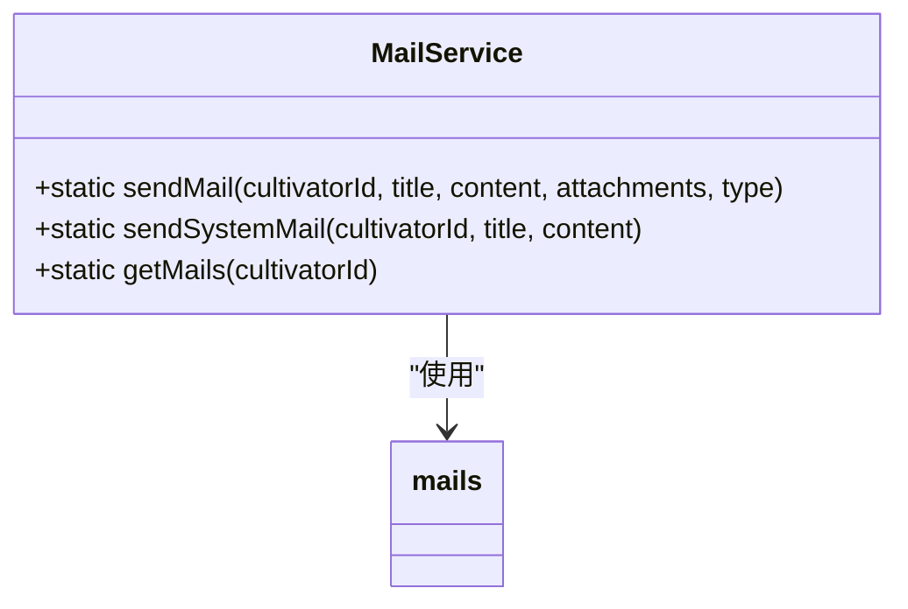

# 修炼系统

<cite>
**本文档引用文件**  
- [README.md](file://README.md)
- [package.json](file://package.json)
- [engine/cultivation/CultivationEngine.ts](file://engine/cultivation/CultivationEngine.ts)
- [types/cultivator.ts](file://types/cultivator.ts)
- [types/constants.ts](file://types/constants.ts)
- [utils/cultivationUtils.ts](file://utils/cultivationUtils.ts)
- [utils/breakthroughCalculator.ts](file://utils/breakthroughCalculator.ts)
- [lib/drizzle/schema.ts](file://lib/drizzle/schema.ts)
- [app/api/cultivators/route.ts](file://app/api/cultivators/route.ts)
- [lib/repositories/cultivatorRepository.ts](file://lib/repositories/cultivatorRepository.ts)
- [utils/cultivatorUtils.ts](file://utils/cultivatorUtils.ts)
- [app/api/cultivator/retreat/route.ts](file://app/api/cultivator/retreat/route.ts)
- [lib/services/MailService.ts](file://lib/services/MailService.ts)
- [types/dictionaries.ts](file://types/dictionaries.ts)
</cite>

## 目录
1. [简介](#简介)
2. [项目结构](#项目结构)
3. [核心数据模型](#核心数据模型)
4. [修炼与突破系统](#修炼与突破系统)
5. [境界与属性体系](#境界与属性体系)
6. [数据库设计](#数据库设计)
7. [API 接口](#api-接口)
8. [服务与工具](#服务与工具)
9. [前端展示与字典](#前端展示与字典)
10. [总结](#总结)

## 简介

《万界道友》是一款以AIGC驱动、高自由度文字体验和修仙世界观为核心的开源游戏项目。玩家将扮演一名普通修士，通过功法、灵根、神通、法宝和奇遇等要素，逐步推演属于自己的修行之路。项目采用Next.js作为前端框架，结合Supabase和Drizzle ORM进行数据管理，并通过TypeScript实现核心游戏逻辑。

本项目旨在构建一个“修仙宇宙的开源骨架”，既可作为可直接游玩的文字修仙游戏，也可作为高度结构化、AIGC友好的底层架构，方便创作者快速搭建自己的门派流派、世界观和玩法。

**Section sources**
- [README.md](file://README.md)

## 项目结构

项目采用模块化设计，主要目录包括：
- `app/`：Next.js应用的路由与页面实现。
- `components/`：前端UI组件，包括水墨风UI框架和功能组件。
- `engine/`：核心游戏引擎，包含战斗、创建和修炼系统。
- `lib/`：库文件，包括数据库连接、认证和Redis服务。
- `types/`：类型定义，包括常量和数据模型。
- `utils/`：工具函数，包括突破计算、角色生成和故事服务。

**Section sources**
- [README.md](file://README.md)

## 核心数据模型

核心数据模型定义了修士（Cultivator）的完整结构，包括基础属性、灵根、先天命格、功法、技能、装备和修为进度等。

**Diagram sources**
- [types/cultivator.ts](file://types/cultivator.ts)

## 修炼与突破系统

修炼与突破系统是游戏的核心机制之一，包括闭关修炼和境界突破两个主要功能。

### 闭关修炼

闭关修炼允许修士积累修为，提升境界。系统根据修士的灵根、功法和悟性等因素计算修为获取量。

**Diagram sources**
- [engine/cultivation/CultivationEngine.ts](file://engine/cultivation/CultivationEngine.ts)
- [utils/cultivationUtils.ts](file://utils/cultivationUtils.ts)

### 境界突破

境界突破是修士提升境界的关键步骤。系统根据修为进度、感悟值和悟性等因素计算突破成功率。

**Diagram sources**
- [engine/cultivation/CultivationEngine.ts](file://engine/cultivation/CultivationEngine.ts)
- [utils/breakthroughCalculator.ts](file://utils/breakthroughCalculator.ts)

## 境界与属性体系

### 境界体系

境界从“炼气”到“渡劫”共九个大境界，每个大境界分为初期、中期、后期和圆满四个阶段。

**Diagram sources**
- [types/constants.ts](file://types/constants.ts)

### 属性体系

基础属性包括体魄、灵力、悟性、身法和神识，每个属性影响不同的战斗和修炼效果。

| 属性 | 影响 |
|------|------|
| 体魄 | 血量上限与伤害减免 |
| 灵力 | 法术伤害与资源上限 |
| 悟性 | 暴击率、突破成功率 |
| 身法 | 出手顺序、闪避率 |
| 神识 | 控制抗性、状态抵抗 |

**Section sources**
- [types/constants.ts](file://types/constants.ts)

## 数据库设计

数据库采用PostgreSQL，通过Drizzle ORM进行管理。主要表包括修士主表、灵根表、先天命格表、功法表、技能表、装备表等。

**Diagram sources**
- [lib/drizzle/schema.ts](file://lib/drizzle/schema.ts)

## API 接口

API接口主要处理修士的创建、获取、更新和删除操作，以及闭关和突破等核心功能。

### 获取修士

`GET /api/cultivators` 获取用户的所有修士。

### 闭关与突破

`POST /api/cultivator/retreat` 处理闭关和突破请求。

**Diagram sources**
- [app/api/cultivator/retreat/route.ts](file://app/api/cultivator/retreat/route.ts)
- [lib/repositories/cultivatorRepository.ts](file://lib/repositories/cultivatorRepository.ts)

## 服务与工具

### MailService

`MailService` 用于发送邮件和系统通知。

**Diagram sources**
- [lib/services/MailService.ts](file://lib/services/MailService.ts)
- [lib/drizzle/schema.ts](file://lib/drizzle/schema.ts)

## 前端展示与字典

`dictionaries.ts` 提供了前端展示所需的标签、图标和描述信息，包括元素、属性、技能类型、状态效果等。

```mermaid
classDiagram
class ELEMENT_DISPLAY_MAP {
+金 : ElementDisplayInfo
+木 : ElementDisplayInfo
+水 : ElementDisplayInfo
+火 : ElementDisplayInfo
+土 : ElementDisplayInfo
+风 : ElementDisplayInfo
+雷 : ElementDisplayInfo
+冰 : ElementDisplayInfo
}
class ATTRIBUTE_DISPLAY_MAP {
+vitality : AttributeDisplayInfo
+spirit : AttributeDisplayInfo
+wisdom : AttributeDisplayInfo
+speed : AttributeDisplayInfo
+willpower : AttributeDisplayInfo
}
class SKILL_TYPE_DISPLAY_MAP {
+attack : SkillTypeDisplayInfo
+heal : SkillTypeDisplayInfo
+control : SkillTypeDisplayInfo
+debuff : SkillTypeDisplayInfo
+buff : SkillTypeDisplayInfo
}
class STATUS_EFFECT_DISPLAY_MAP {
+burn : StatusEffectDisplayInfo
+bleed : StatusEffectDisplayInfo
+poison : StatusEffectDisplayInfo
+stun : StatusEffectDisplayInfo
+silence : StatusEffectDisplayInfo
+root : StatusEffectDisplayInfo
+armor_up : StatusEffectDisplayInfo
+speed_up : StatusEffectDisplayInfo
+crit_rate_up : StatusEffectDisplayInfo
+armor_down : StatusEffectDisplayInfo
+crit_rate_down : StatusEffectDisplayInfo
}
class EQUIPMENT_SLOT_DISPLAY_MAP {
+weapon : EquipmentSlotDisplayInfo
+armor : EquipmentSlotDisplayInfo
+accessory : EquipmentSlotDisplayInfo
}
class CONSUMABLE_TYPE_DISPLAY_MAP {
+丹药 : ConsumableTypeDisplayInfo
}
class MATERIAL_TYPE_DISPLAY_MAP {
+herb : MaterialTypeDisplayInfo
+ore : MaterialTypeDisplayInfo
+monster : MaterialTypeDisplayInfo
+tcdb : MaterialTypeDisplayInfo
+aux : MaterialTypeDisplayInfo
}
```

**Diagram sources**
- [types/dictionaries.ts](file://types/dictionaries.ts)

## 总结

《万界道友》项目通过模块化设计和清晰的架构，实现了完整的修仙游戏核心系统。项目采用现代前端技术栈，结合AIGC驱动，为玩家提供了高自由度的文字修仙体验。未来可进一步扩展更多玩法，如宗门战、秘境探索等，打造一个丰富的修仙宇宙。