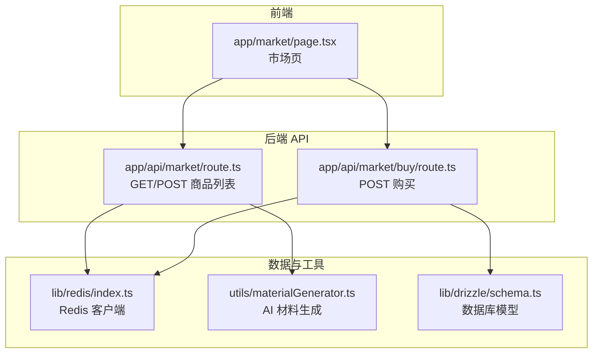
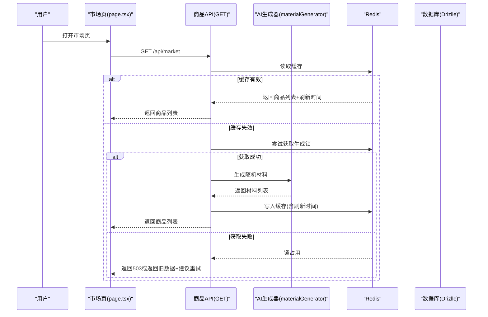
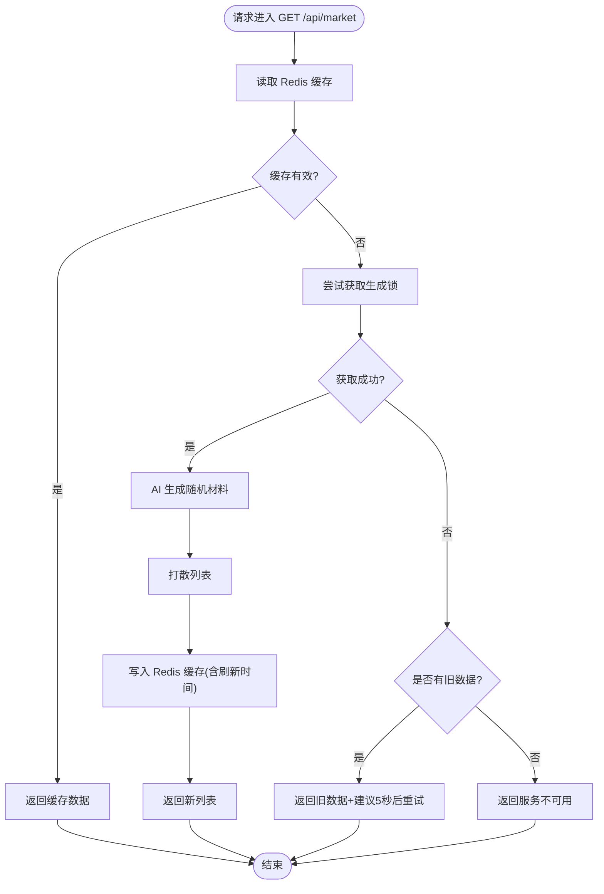
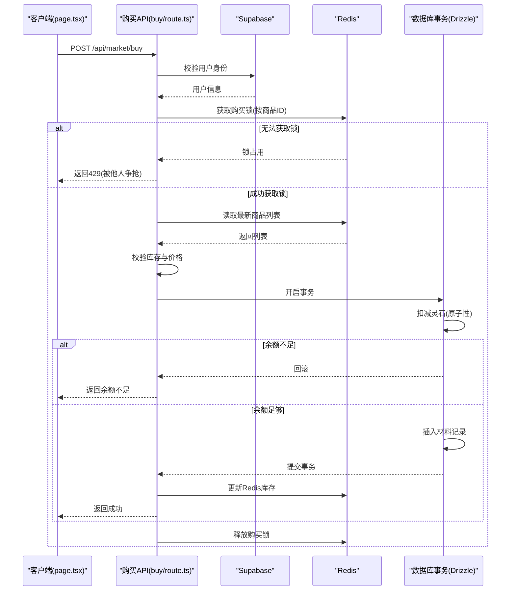
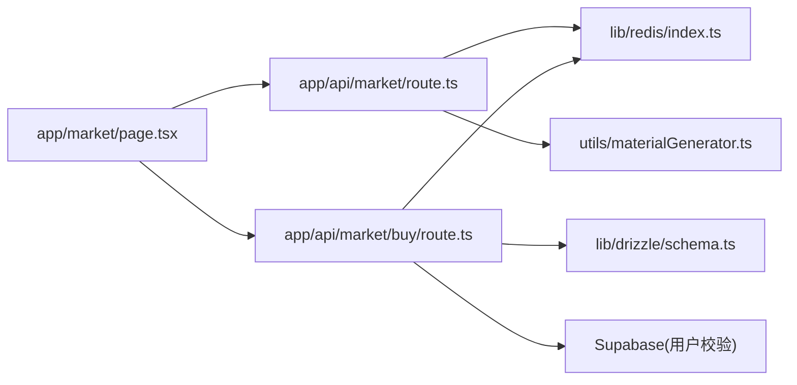

# 坊市系统

<cite>
**本文引用的文件**
- [app/api/market/route.ts](file://app/api/market/route.ts)
- [app/api/market/buy/route.ts](file://app/api/market/buy/route.ts)
- [app/market/page.tsx](file://app/market/page.tsx)
- [lib/redis/index.ts](file://lib/redis/index.ts)
- [utils/materialGenerator.ts](file://utils/materialGenerator.ts)
- [lib/drizzle/schema.ts](file://lib/drizzle/schema.ts)
- [vercel.json](file://vercel.json)
- [types/cultivator.ts](file://types/cultivator.ts)
</cite>

## 目录
1. [简介](#简介)
2. [项目结构](#项目结构)
3. [核心组件](#核心组件)
4. [架构总览](#架构总览)
5. [详细组件分析](#详细组件分析)
6. [依赖关系分析](#依赖关系分析)
7. [性能考量](#性能考量)
8. [故障排查指南](#故障排查指南)
9. [结论](#结论)
10. [附录](#附录)

## 简介
本文件面向“坊市系统”的开发者与运营人员，系统性梳理商品浏览、购买流程与库存管理的实现细节。基于后端 API 与前端页面的协作，阐述商品列表生成逻辑（含 Redis 缓存与锁控制）、价格计算与交易执行流程、前端展示与交互、商品刷新机制（定时任务与手动触发）、库存一致性保障、交易幂等性与余额校验、物品发放与异常处理策略（如超卖预防）。文档同时提供关键调用链路图与可视化流程，帮助快速定位问题与优化性能。

## 项目结构
坊市系统主要由三层构成：
- 前端页面层：负责展示商品列表、倒计时与购买交互。
- 后端 API 层：提供商品列表查询与购买下单接口，协调缓存与数据库事务。
- 数据与工具层：Redis 缓存、Drizzle ORM 数据模型、AI 材料生成器。

图表来源
- [app/market/page.tsx](file://app/market/page.tsx#L1-L186)
- [app/api/market/route.ts](file://app/api/market/route.ts#L1-L99)
- [app/api/market/buy/route.ts](file://app/api/market/buy/route.ts#L1-L182)
- [lib/redis/index.ts](file://lib/redis/index.ts#L1-L6)
- [utils/materialGenerator.ts](file://utils/materialGenerator.ts#L1-L193)
- [lib/drizzle/schema.ts](file://lib/drizzle/schema.ts#L1-L292)

章节来源
- [app/market/page.tsx](file://app/market/page.tsx#L1-L186)
- [app/api/market/route.ts](file://app/api/market/route.ts#L1-L99)
- [app/api/market/buy/route.ts](file://app/api/market/buy/route.ts#L1-L182)
- [lib/redis/index.ts](file://lib/redis/index.ts#L1-L6)
- [utils/materialGenerator.ts](file://utils/materialGenerator.ts#L1-L193)
- [lib/drizzle/schema.ts](file://lib/drizzle/schema.ts#L1-L292)

## 核心组件
- 商品列表 API（GET /api/market）
  - 通过 Redis 缓存存储商品清单与下次刷新时间戳。
  - 使用分布式锁避免并发重复生成。
  - 通过 AI 生成器生成随机材料，打散后返回给客户端。
- 购买 API（POST /api/market/buy）
  - 并发购买锁，防止同一商品超卖。
  - 读取最新商品列表，二次校验库存与价格。
  - 数据库事务内完成余额扣减与物品入库，保证原子性。
  - 更新 Redis 商品库存，保持缓存一致性。
- 前端市场页（app/market/page.tsx）
  - 拉取商品列表与刷新倒计时，展示商品详情与购买按钮。
  - 购买前本地余额校验，购买后刷新角色与市场数据。
- 定时任务（vercel.json）
  - 每日固定时间触发商品刷新，确保商品池新鲜度。

章节来源
- [app/api/market/route.ts](file://app/api/market/route.ts#L1-L99)
- [app/api/market/buy/route.ts](file://app/api/market/buy/route.ts#L1-L182)
- [app/market/page.tsx](file://app/market/page.tsx#L1-L186)
- [vercel.json](file://vercel.json#L1-L14)

## 架构总览
坊市系统采用“缓存优先 + 分布式锁 + 数据库事务”的架构模式：
- 缓存层：Redis 存储商品列表与刷新时间，支持热数据快速读取与回退。
- 业务层：商品生成与购买逻辑在 API 层实现，严格控制并发与一致性。
- 数据层：PostgreSQL 通过 Drizzle ORM 记录角色灵石与材料库存。
- 前端层：React 客户端负责展示与交互，配合倒计时与本地余额校验。

图表来源
- [app/api/market/route.ts](file://app/api/market/route.ts#L1-L99)
- [utils/materialGenerator.ts](file://utils/materialGenerator.ts#L1-L193)
- [lib/redis/index.ts](file://lib/redis/index.ts#L1-L6)

## 详细组件分析

### 商品列表生成与缓存策略
- 缓存键与过期策略
  - 缓存键：统一键名存储商品列表与下次刷新时间戳。
  - 过期时间：列表缓存有效期为两小时；生成锁有效期为一分钟。
- 生成流程
  - 读取缓存，若有效则直接返回。
  - 若无效，尝试获取生成锁，避免并发重复生成。
  - 成功获取锁后，调用 AI 生成器生成一批随机材料，打散后写入缓存。
  - 释放生成锁。
- 回退策略
  - 若生成锁被占用但已有旧数据，则返回旧数据并提示客户端五秒后重试。
  - 若生成锁被占用且无任何数据，返回服务不可用状态码。
- 兼容旧缓存格式
  - 当缓存为数组时进行兼容包装，避免冷启动竞争导致的异常。

图表来源
- [app/api/market/route.ts](file://app/api/market/route.ts#L1-L99)

章节来源
- [app/api/market/route.ts](file://app/api/market/route.ts#L1-L99)

### 购买流程与交易执行
- 输入校验与权限校验
  - 校验请求体包含角色 ID 与商品 ID。
  - 通过 Supabase 获取当前用户，校验用户有效性。
- 并发购买锁
  - 以商品 ID 为粒度获取购买锁，避免同一商品超卖。
- 商品与库存二次校验
  - 从 Redis 读取最新商品列表，查找目标商品并再次检查库存是否充足。
- 价格计算与余额校验
  - 价格 = 商品单价 × 数量。
  - 使用数据库事务原子性扣减灵石余额，WHERE 条件确保余额足够才更新。
  - 若余额不足，回滚事务并返回明确错误信息。
- 物品发放与库存更新
  - 事务内插入材料记录，完成物品发放。
  - 更新 Redis 商品库存，若库存清零则移除该商品。
- 结果返回与异常处理
  - 成功返回成功标志与剩余灵石提示占位。
  - 异常捕获并返回统一错误信息，释放购买锁。

图表来源
- [app/api/market/buy/route.ts](file://app/api/market/buy/route.ts#L1-L182)
- [lib/redis/index.ts](file://lib/redis/index.ts#L1-L6)
- [lib/drizzle/schema.ts](file://lib/drizzle/schema.ts#L1-L292)

章节来源
- [app/api/market/buy/route.ts](file://app/api/market/buy/route.ts#L1-L182)
- [lib/drizzle/schema.ts](file://lib/drizzle/schema.ts#L1-L292)

### 前端展示与交互
- 商品列表渲染
  - 拉取商品列表与刷新时间，展示名称、品质徽章、属性、单价与库存。
- 倒计时与刷新
  - 基于 nextRefresh 计算剩余时间，接近刷新点时自动拉取最新列表。
- 购买交互
  - 购买前本地校验灵石余额，避免不必要的网络请求。
  - 购买成功后刷新角色信息与市场列表，确保 UI 与数据一致。
- 错误提示
  - 统一通过 Toast 展示错误信息，便于用户理解。

章节来源
- [app/market/page.tsx](file://app/market/page.tsx#L1-L186)
- [types/cultivator.ts](file://types/cultivator.ts#L193-L203)

### 商品刷新机制与库存一致性
- 定时任务
  - Vercel 定时任务每日固定时间触发 GET /api/market，强制刷新商品池。
- 手动触发
  - POST /api/market 可手动删除缓存并立即刷新。
- 库存一致性
  - 购买成功后立即更新 Redis 商品库存，并保持与数据库事务结果一致。
  - 前端购买成功后主动刷新市场列表，避免 UI 与实际库存不一致。

章节来源
- [vercel.json](file://vercel.json#L1-L14)
- [app/api/market/route.ts](file://app/api/market/route.ts#L95-L99)
- [app/api/market/buy/route.ts](file://app/api/market/buy/route.ts#L151-L163)
- [app/market/page.tsx](file://app/market/page.tsx#L70-L86)

## 依赖关系分析
- 组件耦合
  - 市场页依赖商品 API 与倒计时逻辑，耦合度低，职责清晰。
  - 购买 API 依赖 Redis、Supabase、Drizzle ORM 与 AI 生成器，集中处理一致性与并发。
- 外部依赖
  - Redis：缓存与分布式锁。
  - Supabase：用户认证与会话校验。
  - Drizzle ORM：数据库访问与事务。
  - AI 生成器：随机材料生成，受外部模型影响。
- 循环依赖
  - 未发现循环依赖迹象，模块边界清晰。

图表来源
- [app/market/page.tsx](file://app/market/page.tsx#L1-L186)
- [app/api/market/route.ts](file://app/api/market/route.ts#L1-L99)
- [app/api/market/buy/route.ts](file://app/api/market/buy/route.ts#L1-L182)
- [lib/redis/index.ts](file://lib/redis/index.ts#L1-L6)
- [utils/materialGenerator.ts](file://utils/materialGenerator.ts#L1-L193)
- [lib/drizzle/schema.ts](file://lib/drizzle/schema.ts#L1-L292)

章节来源
- [app/market/page.tsx](file://app/market/page.tsx#L1-L186)
- [app/api/market/route.ts](file://app/api/market/route.ts#L1-L99)
- [app/api/market/buy/route.ts](file://app/api/market/buy/route.ts#L1-L182)
- [lib/redis/index.ts](file://lib/redis/index.ts#L1-L6)
- [utils/materialGenerator.ts](file://utils/materialGenerator.ts#L1-L193)
- [lib/drizzle/schema.ts](file://lib/drizzle/schema.ts#L1-L292)

## 性能考量
- 缓存命中率
  - 商品列表缓存有效期两小时，结合回退策略可显著降低生成压力。
- 并发控制
  - 生成锁与购买锁双重保护，避免热点商品的重复生成与超卖。
- 数据库写入
  - 余额扣减与物品入库在同一事务内完成，减少跨次提交的风险。
- 前端体验
  - 倒计时与本地余额校验减少无效请求，提升响应速度。
- 建议优化
  - 在高并发场景下，可考虑将购买锁的过期时间与业务峰值相匹配，避免锁过短导致频繁冲突。
  - 对商品列表的生成过程进行异步化，避免阻塞请求路径。

[本节为通用性能讨论，无需特定文件引用]

## 故障排查指南
- 商品列表无法加载
  - 检查 Redis 是否可用与键是否存在。
  - 查看生成锁是否长时间占用，必要时清理锁。
  - 参考：[app/api/market/route.ts](file://app/api/market/route.ts#L1-L99)
- 购买失败
  - 检查用户是否已登录与角色归属是否正确。
  - 检查商品是否仍存在于当前列表，库存是否充足。
  - 查看数据库事务是否因余额不足而回滚。
  - 参考：[app/api/market/buy/route.ts](file://app/api/market/buy/route.ts#L1-L182)
- 超卖或库存不一致
  - 确认购买锁是否正常释放。
  - 检查 Redis 缓存是否及时更新。
  - 参考：[app/api/market/buy/route.ts](file://app/api/market/buy/route.ts#L151-L163)
- 前端显示异常
  - 检查倒计时逻辑与刷新策略是否生效。
  - 参考：[app/market/page.tsx](file://app/market/page.tsx#L95-L108)

章节来源
- [app/api/market/route.ts](file://app/api/market/route.ts#L1-L99)
- [app/api/market/buy/route.ts](file://app/api/market/buy/route.ts#L1-L182)
- [app/market/page.tsx](file://app/market/page.tsx#L95-L108)

## 结论
坊市系统通过“缓存优先 + 分布式锁 + 数据库事务”的组合，实现了高并发下的稳定商品浏览与购买体验。商品列表由 AI 生成并缓存，购买流程在事务内完成余额与库存的一致性校验，前端通过倒计时与本地校验优化用户体验。定时任务确保商品池定期刷新，进一步提升新鲜度与公平性。建议持续监控 Redis 与数据库性能，结合业务峰值调整锁策略与缓存策略，以获得更佳的稳定性与吞吐量。

[本节为总结性内容，无需特定文件引用]

## 附录
- 关键调用链路（从用户点击购买到库存更新）
  - 前端发起购买请求 → 后端获取购买锁 → 读取最新商品列表 → 余额与库存校验 → 事务扣减灵石与入库 → 更新 Redis 库存 → 返回成功。
- 交易幂等性
  - 通过购买锁与事务原子性，确保同一订单不会重复扣款与重复入库。
- 余额校验
  - 采用 WHERE 条件的原子性扣减，避免“先读后写”的竞态。
- 物品发放
  - 通过数据库事务插入材料记录，保证物品发放与资金变动一致。

[本节为概念性说明，无需特定文件引用]