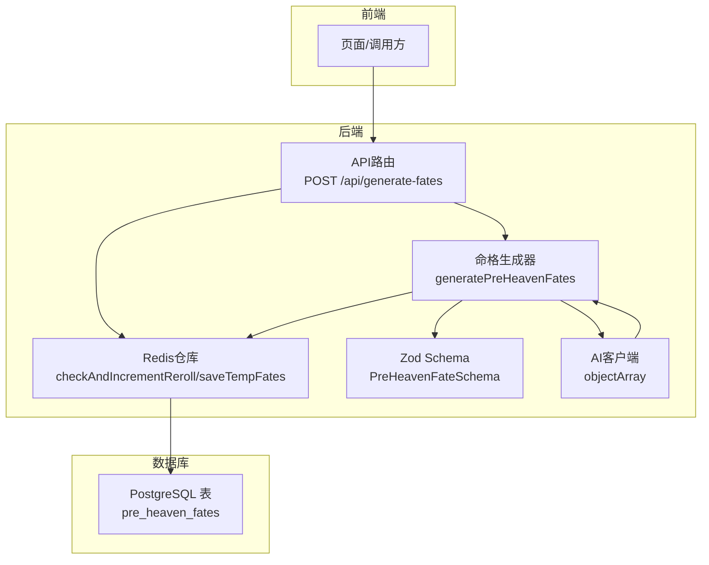
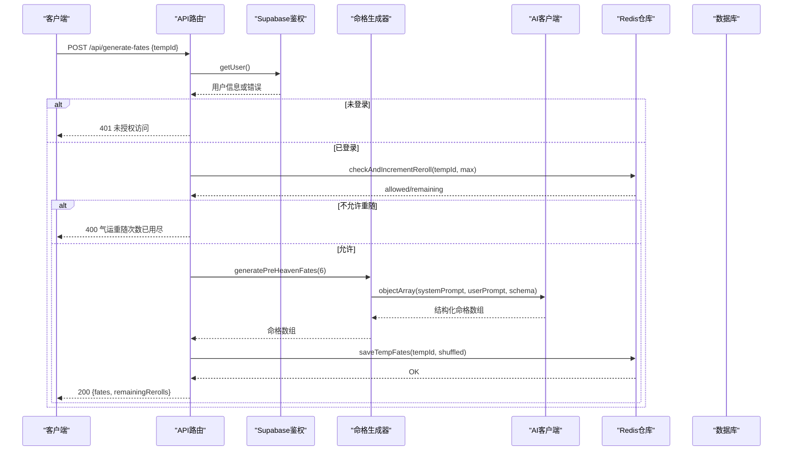
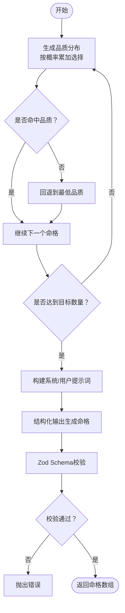
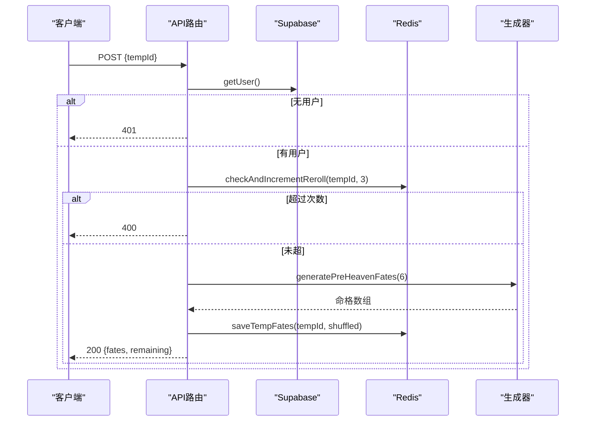
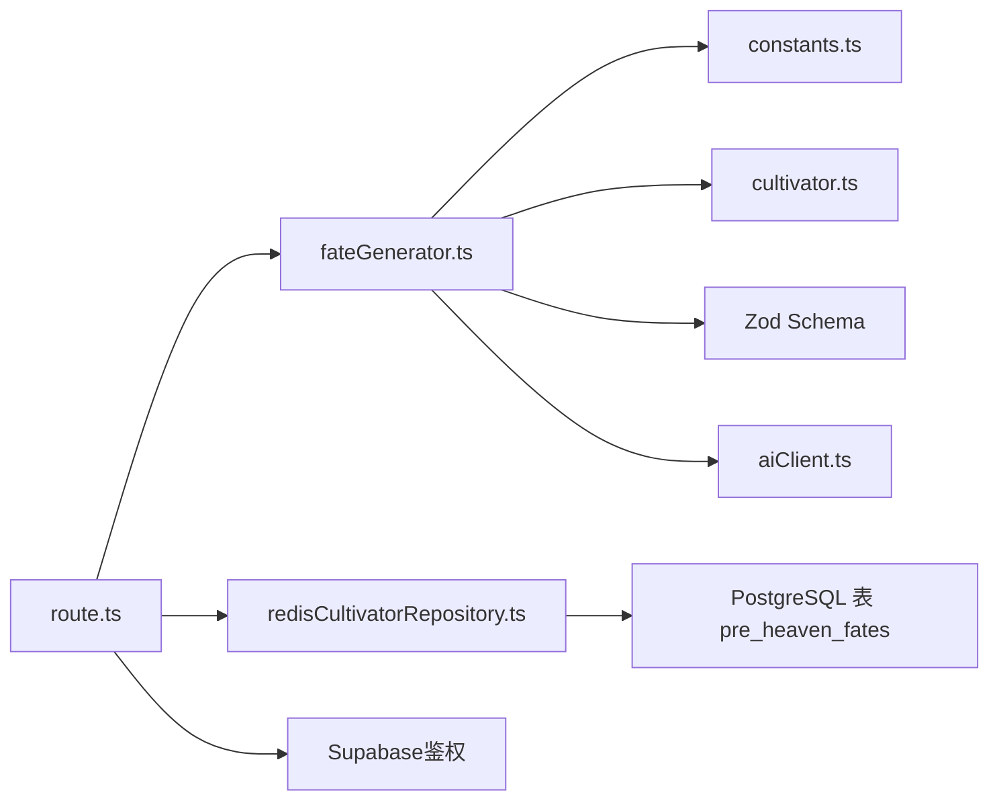

# 命格生成

<cite>
**本文引用的文件列表**
- [fateGenerator.ts](file://utils/fateGenerator.ts)
- [route.ts](file://app/api/generate-fates/route.ts)
- [fateGenerator.test.ts](file://utils/fateGenerator.test.ts)
- [cultivator.ts](file://types/cultivator.ts)
- [constants.ts](file://types/constants.ts)
- [redisCultivatorRepository.ts](file://lib/repositories/redisCultivatorRepository.ts)
- [aiClient.ts](file://utils/aiClient.ts)
- [0000_snapshot.json](file://drizzle/meta/0000_snapshot.json)
</cite>

## 目录
1. [简介](#简介)
2. [项目结构](#项目结构)
3. [核心组件](#核心组件)
4. [架构总览](#架构总览)
5. [详细组件分析](#详细组件分析)
6. [依赖关系分析](#依赖关系分析)
7. [性能考量](#性能考量)
8. [故障排查指南](#故障排查指南)
9. [结论](#结论)
10. [附录](#附录)

## 简介
本文件面向命格生成子系统，聚焦于先天气运（“先天命格”）的生成算法与API调用流程。内容涵盖：
- 命格事件池的结构设计与稀有度权重分配机制
- 基于角色属性的适配度计算思路与实现要点
- API接口调用流程、请求参数校验与响应数据格式
- 基于概率分布控制常见与稀有命格出现频率的方法
- 事件配置的JSON Schema示例与字段约束
- 个性化命格筛选策略（按境界、功法倾向等维度）
- 防止短时间内重复获取相同命格的去重机制
- 单元测试用例设计建议，确保生成结果的多样性与平衡性

## 项目结构
命格生成涉及以下关键模块：
- 生成器：负责根据概率分布生成命格集合，并通过结构化输出约束命格Schema
- API层：接收前端请求，鉴权与参数校验，调用生成器并返回候选命格
- 存储层：使用Redis缓存临时命格与重随计数
- 数据模型：定义命格结构、品质枚举、属性加成等类型
- AI客户端：封装结构化输出能力，保证返回符合Schema的数据

图表来源
- [route.ts](file://app/api/generate-fates/route.ts#L1-L69)
- [fateGenerator.ts](file://utils/fateGenerator.ts#L94-L166)
- [redisCultivatorRepository.ts](file://lib/repositories/redisCultivatorRepository.ts#L34-L103)
- [aiClient.ts](file://utils/aiClient.ts#L92-L159)
- [0000_snapshot.json](file://drizzle/meta/0000_snapshot.json#L450-L516)

章节来源
- [route.ts](file://app/api/generate-fates/route.ts#L1-L69)
- [fateGenerator.ts](file://utils/fateGenerator.ts#L1-L166)
- [redisCultivatorRepository.ts](file://lib/repositories/redisCultivatorRepository.ts#L1-L103)
- [aiClient.ts](file://utils/aiClient.ts#L1-L211)
- [0000_snapshot.json](file://drizzle/meta/0000_snapshot.json#L450-L516)

## 核心组件
- 命格生成器：根据目标数量与品质概率分布，构造系统提示词与用户提示词，通过结构化输出生成符合Schema的命格数组
- API路由：鉴权、参数校验、重随次数检查、调用生成器、打乱并截取候选、保存至Redis
- Redis仓库：保存临时命格、记录重随次数并设置TTL
- 数据模型与Schema：定义命格字段、品质枚举、属性加成范围与描述长度约束
- AI客户端：提供结构化输出能力，支持数组输出与Schema约束

章节来源
- [fateGenerator.ts](file://utils/fateGenerator.ts#L94-L166)
- [route.ts](file://app/api/generate-fates/route.ts#L1-L69)
- [redisCultivatorRepository.ts](file://lib/repositories/redisCultivatorRepository.ts#L34-L103)
- [cultivator.ts](file://types/cultivator.ts#L63-L79)
- [constants.ts](file://types/constants.ts#L115-L126)
- [aiClient.ts](file://utils/aiClient.ts#L92-L159)

## 架构总览
从API入口到最终落库的完整链路如下：

图表来源
- [route.ts](file://app/api/generate-fates/route.ts#L16-L68)
- [fateGenerator.ts](file://utils/fateGenerator.ts#L94-L166)
- [redisCultivatorRepository.ts](file://lib/repositories/redisCultivatorRepository.ts#L56-L103)
- [aiClient.ts](file://utils/aiClient.ts#L92-L159)

## 详细组件分析

### 命格生成器（fateGenerator.ts）
- 稀有度权重与品质范围
  - 品质概率映射：不同品质出现的概率不同，用于控制常见与稀有命格的比例
  - 品质范围映射：每个品质允许的属性加成总和范围不同，用于限制命格强度
- 分布生成与回退
  - 通过累加概率选择品质，若因浮点误差未命中则回退到最低品质
- 结构化输出与Schema约束
  - 使用Zod Schema定义命格字段、类型、长度与可选属性
  - 通过AI客户端的结构化输出能力，确保返回符合Schema的对象数组
- 提示词工程
  - 系统提示词明确世界观、生成规则、属性加成数量与范围、描述长度
  - 用户提示词给出目标数量与期望的品质分布，引导AI按分布生成

图表来源
- [fateGenerator.ts](file://utils/fateGenerator.ts#L54-L166)

章节来源
- [fateGenerator.ts](file://utils/fateGenerator.ts#L1-L166)
- [constants.ts](file://types/constants.ts#L115-L126)
- [cultivator.ts](file://types/cultivator.ts#L63-L79)
- [aiClient.ts](file://utils/aiClient.ts#L92-L159)

### API接口（app/api/generate-fates/route.ts）
- 请求参数
  - 需要携带临时角色ID（tempId），用于后续绑定命格与重随计数
- 鉴权与错误处理
  - 通过Supabase获取当前用户，未登录返回401
- 重随次数控制
  - 使用Redis自增计数并设置TTL，超过最大次数返回400
- 生成与返回
  - 调用生成器生成命格，随机打乱后取前6个作为候选
  - 保存到Redis并返回剩余重随次数

图表来源
- [route.ts](file://app/api/generate-fates/route.ts#L16-L68)
- [redisCultivatorRepository.ts](file://lib/repositories/redisCultivatorRepository.ts#L56-L103)

章节来源
- [route.ts](file://app/api/generate-fates/route.ts#L1-L69)

### Redis仓库（lib/repositories/redisCultivatorRepository.ts）
- 临时命格存储：以tempId为键，保存命格数组，设置TTL
- 重随计数：以tempId为键，自增计数并设置TTL，防止短时间内重复获取相同命格
- 数据清理：删除临时角色、命格与计数键

章节来源
- [redisCultivatorRepository.ts](file://lib/repositories/redisCultivatorRepository.ts#L1-L103)

### 数据模型与Schema（types/cultivator.ts、types/constants.ts）
- 命格结构：名称、类型（吉/凶）、品质、属性加成、描述
- 品质枚举：凡品、灵品、玄品、真品、地品、天品、仙品、神品
- 属性加成：体魄、灵力、悟性、速度、神识，支持正负值
- 描述长度：最小20字符，最大150字符

章节来源
- [cultivator.ts](file://types/cultivator.ts#L63-L79)
- [constants.ts](file://types/constants.ts#L115-L126)

### AI客户端（utils/aiClient.ts）
- 结构化输出：提供object与objectArray方法，支持Schema约束与数组输出
- 模型选择：根据环境变量选择不同模型与推理模式
- 错误处理：重试与异常捕获，保证稳定性

章节来源
- [aiClient.ts](file://utils/aiClient.ts#L92-L159)

## 依赖关系分析
- 生成器依赖
  - 类型与常量：品质枚举、属性名
  - Zod Schema：约束命格字段与范围
  - AI客户端：结构化输出
- API依赖
  - Supabase鉴权：用户身份校验
  - Redis仓库：临时命格与重随计数
- 数据库
  - 命格表：持久化命格数据（生成器与API主要使用临时缓存）

图表来源
- [fateGenerator.ts](file://utils/fateGenerator.ts#L1-L166)
- [route.ts](file://app/api/generate-fates/route.ts#L1-L69)
- [redisCultivatorRepository.ts](file://lib/repositories/redisCultivatorRepository.ts#L1-L103)
- [constants.ts](file://types/constants.ts#L115-L126)
- [cultivator.ts](file://types/cultivator.ts#L63-L79)
- [aiClient.ts](file://utils/aiClient.ts#L92-L159)
- [0000_snapshot.json](file://drizzle/meta/0000_snapshot.json#L450-L516)

章节来源
- [fateGenerator.ts](file://utils/fateGenerator.ts#L1-L166)
- [route.ts](file://app/api/generate-fates/route.ts#L1-L69)
- [redisCultivatorRepository.ts](file://lib/repositories/redisCultivatorRepository.ts#L1-L103)
- [constants.ts](file://types/constants.ts#L115-L126)
- [cultivator.ts](file://types/cultivator.ts#L63-L79)
- [aiClient.ts](file://utils/aiClient.ts#L92-L159)
- [0000_snapshot.json](file://drizzle/meta/0000_snapshot.json#L450-L516)

## 性能考量
- 生成器复杂度
  - 分布生成：O(n)，n为目标命格数量
  - AI结构化输出：受模型与Schema复杂度影响，建议控制单次生成数量
- 缓存策略
  - Redis TTL统一管理，避免长期占用内存
  - 重随计数TTL与角色临时数据一致，减少脏数据
- I/O优化
  - 命格候选在内存中打乱与截取，避免多次数据库读写
  - 仅在需要时持久化命格

[本节为通用性能讨论，不直接分析具体文件]

## 故障排查指南
- 常见错误
  - 未授权访问：确认Supabase鉴权成功
  - 缺少参数：确认请求体包含tempId
  - 重随次数用尽：检查Redis计数与TTL
  - AI生成失败：查看日志与重试机制
- 定位步骤
  - 查看API路由返回码与错误信息
  - 检查Redis键是否存在与TTL
  - 校验Zod Schema是否满足
  - 回放AI提示词与返回内容

章节来源
- [route.ts](file://app/api/generate-fates/route.ts#L16-L68)
- [redisCultivatorRepository.ts](file://lib/repositories/redisCultivatorRepository.ts#L56-L103)
- [fateGenerator.ts](file://utils/fateGenerator.ts#L148-L166)

## 结论
命格生成子系统通过“概率分布 + 结构化输出 + 缓存控制”的方式，实现了可控的多样性与平衡性。API层负责鉴权与重随控制，生成器负责品质分布与Schema约束，Redis提供临时缓存与去重保障。整体架构清晰、扩展性强，便于后续加入个性化筛选与更复杂的适配度计算。

[本节为总结性内容，不直接分析具体文件]

## 附录

### 命格事件池与稀有度权重
- 品质概率映射：用于控制常见与稀有命格的出现频率
- 品质范围映射：用于限制命格强度，避免极端数值
- 分布生成：按概率累加选择品质，回退到最低品质以防浮点误差

章节来源
- [fateGenerator.ts](file://utils/fateGenerator.ts#L17-L30)
- [fateGenerator.ts](file://utils/fateGenerator.ts#L54-L89)

### 命格属性适配度计算逻辑（设计建议）
- 境界适配：根据角色境界与品质范围映射，优先生成与当前阶段匹配的命格
- 功法倾向：根据功法类型与元素偏好，调整属性加成方向（如攻击型功法偏向速度/悟性）
- 多样性控制：在候选集中按品质分布抽样，避免连续出现相同品质
- 去重策略：短期内禁止重复命格名称，或按品质与类型进行去重

[本小节为设计建议，不直接分析具体文件]

### API接口调用流程与参数
- 端点：POST /api/generate-fates
- 请求体：{ tempId }
- 成功响应：{ success: true, data: { fates, remainingRerolls } }
- 错误响应：{ error }，状态码400/401/500

章节来源
- [route.ts](file://app/api/generate-fates/route.ts#L16-L68)

### JSON Schema示例（字段与约束）
- 字段与类型
  - name: string，长度2-6
  - type: '吉' | '凶'
  - quality: 品质枚举
  - attribute_mod: 可选属性加成，支持体魄、灵力、悟性、速度、神识，范围[-100, 100]
  - description: string，长度20-150
- 校验要点
  - 属性加成数量与品质对应关系
  - 加成总和不超过品质范围
  - 描述风格与长度约束

章节来源
- [fateGenerator.ts](file://utils/fateGenerator.ts#L31-L49)
- [cultivator.ts](file://types/cultivator.ts#L63-L79)
- [constants.ts](file://types/constants.ts#L115-L126)

### 去重机制与个性化筛选
- 去重
  - Redis计数与TTL控制重随频率
  - 候选命格去重（名称或品质+类型）
- 个性化
  - 按境界阶段与功法倾向调整属性加成方向
  - 品质分布微调以适配玩家偏好

章节来源
- [redisCultivatorRepository.ts](file://lib/repositories/redisCultivatorRepository.ts#L56-L103)
- [fateGenerator.ts](file://utils/fateGenerator.ts#L109-L147)

### 单元测试用例设计建议
- 测试目标
  - 生成器返回数量正确
  - 品质分布符合概率映射
  - Schema校验通过
  - 异常分支（AI失败、鉴权失败）处理
- 建议用例
  - generatePreHeavenFates(3)：断言返回3条命格且字段完整
  - 分布一致性：多次运行统计品质分布，与概率映射对比
  - Schema边界：name长度、description长度、属性加成范围
  - API鉴权：未登录返回401
  - 重随限制：超过最大次数返回400

章节来源
- [fateGenerator.test.ts](file://utils/fateGenerator.test.ts#L1-L8)
- [fateGenerator.ts](file://utils/fateGenerator.ts#L94-L166)
- [route.ts](file://app/api/generate-fates/route.ts#L16-L68)