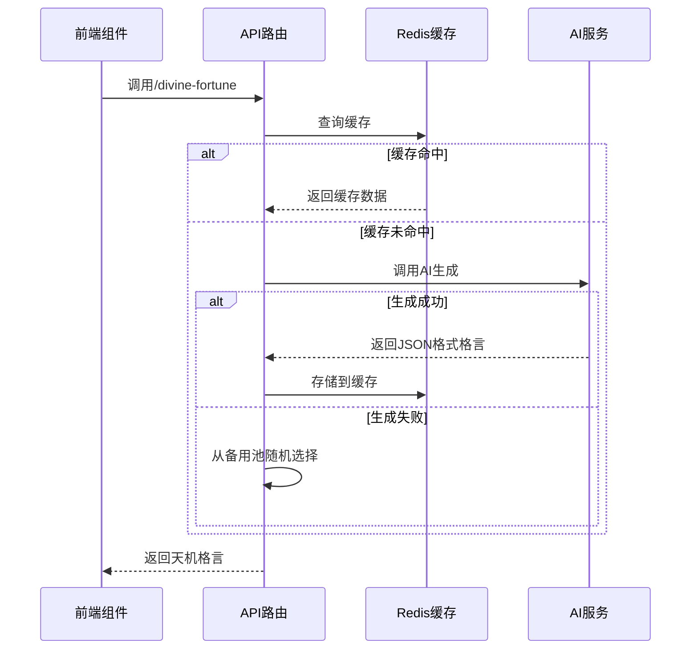
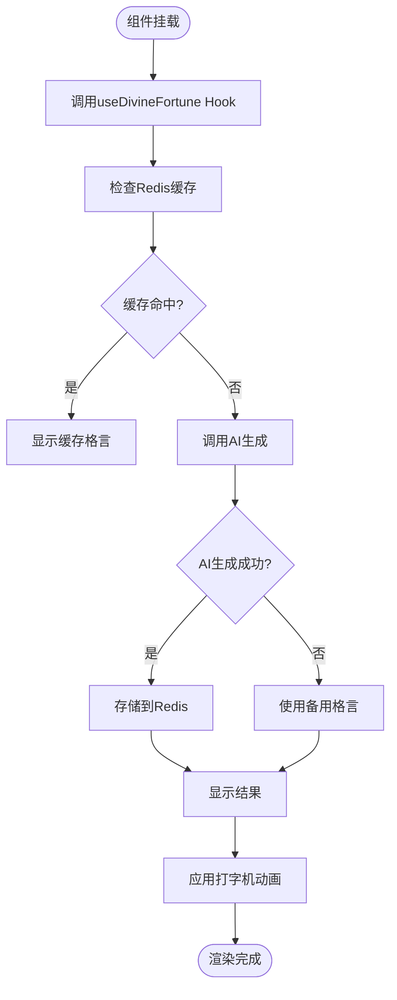
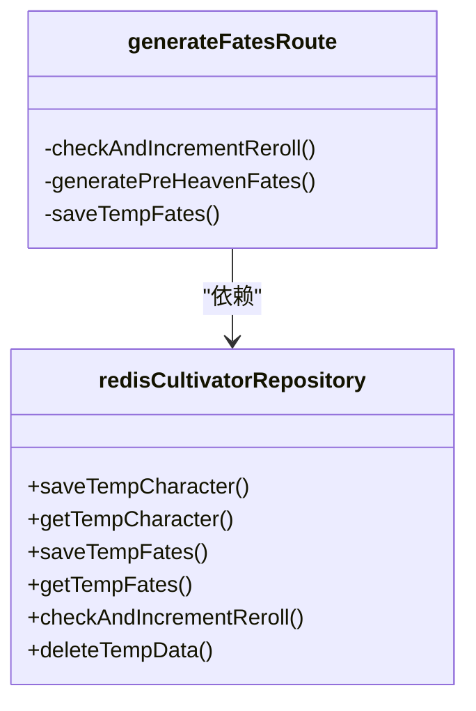

# 奇遇系统

<cite>
**本文档引用文件**  
- [fateGenerator.ts](file://utils/fateGenerator.ts)
- [divineFortune.ts](file://utils/divineFortune.ts)
- [route.ts](file://app/api/divine-fortune/route.ts)
- [generate-fates/route.ts](file://app/api/generate-fates/route.ts)
- [DivineFortune.tsx](file://components/welcome/DivineFortune.tsx)
- [useDivineFortune.ts](file://lib/hooks/useDivineFortune.ts)
- [redisCultivatorRepository.ts](file://lib/repositories/redisCultivatorRepository.ts)
- [constants.ts](file://types/constants.ts)
- [cultivator.ts](file://types/cultivator.ts)
- [aiClient.ts](file://utils/aiClient.ts)
- [TypewriterText.tsx](file://components/welcome/TypewriterText.tsx)
- [useTypewriter.ts](file://lib/hooks/useTypewriter.ts)
</cite>

## 目录
1. [系统概述](#系统概述)
2. [命格生成机制](#命格生成机制)
3. [神签抽取逻辑](#神签抽取逻辑)
4. [天降机缘API调用流程](#天降机缘api调用流程)
5. [前端交互与动画效果](#前端交互与动画效果)
6. [奇遇结果多样性控制](#奇遇结果多样性控制)
7. [事件配置与概率测试](#事件配置与概率测试)
8. [AI辅助生成集成](#ai辅助生成集成)
9. [防重复抽取与限流措施](#防重复抽取与限流措施)
10. [用户体验优化建议](#用户体验优化建议)

## 系统概述
本系统实现了修仙世界观下的奇遇机制，包含命格生成、神签抽取与天降机缘等随机事件。系统通过AI生成与本地备用方案结合的方式，确保奇遇内容的丰富性与稳定性。核心功能由`fateGenerator.ts`和`divineFortune.ts`实现，通过API路由暴露给前端组件调用，并采用Redis缓存和限流机制保障系统性能。

## 命格生成机制

### 随机算法设计
命格生成采用分层随机算法，首先根据预设概率分布确定各品质命格的数量，再通过AI生成具体内容。算法流程如下：
1. 根据`QUALITY_CHANCE_MAP`定义的品质概率，使用累积概率法生成指定数量的命格品质分布
2. 构建包含品质分布要求的系统提示词（system prompt）
3. 调用AI模型生成符合Schema的命格数据

### 事件池配置
命格事件池由AI动态生成，无固定预设池。系统通过以下方式控制生成范围：
- 品质等级：凡品、灵品、玄品、真品、地品、天品、仙品、神品
- 类型区分：吉、凶
- 属性加成：体魄、灵力、悟性、速度、神识

### 权重分配机制
权重分配通过`QUALITY_CHANCE_MAP`常量定义，各品质出现概率如下：
- 凡品：30%
- 灵品：30%
- 玄品：20%
- 真品：10%
- 地品：4%
- 天品：3%
- 仙品：2%
- 神品：1%

属性加成的绝对值之和受品质限制，通过`QUALITY_RANGES`定义各品质的加成范围。

**Section sources**
- [fateGenerator.ts](file://utils/fateGenerator.ts#L6-L29)
- [constants.ts](file://types/constants.ts#L115-L125)

## 神签抽取逻辑

### 抽取流程
神签抽取采用双层降级策略：
1. 优先从Redis缓存获取最近生成的天机格言
2. 缓存未命中时调用AI生成新的格言
3. AI生成失败时返回预定义的备用格言池中的随机条目

### 备用方案设计
系统预定义了20条备用天机格言，存储在`FALLBACK_FORTUNES`常量中，涵盖道家经典语录和修仙哲理，确保在AI服务不可用时仍能提供符合世界观的体验。

### 缓存策略
采用Redis缓存机制，设置30分钟的TTL（Time To Live），平衡内容新鲜度与系统性能。同一格言在缓存有效期内被所有用户共享，减少AI调用次数。

**Section sources**
- [divineFortune.ts](file://utils/divineFortune.ts#L42-L123)
- [route.ts](file://app/api/divine-fortune/route.ts#L11-L12)

## 天降机缘API调用流程

### API接口设计
系统提供两个核心API接口：
- `GET /api/divine-fortune`：获取今日天机格言
- `POST /api/generate-fates`：生成先天气运

### 调用逻辑


**Diagram sources**
- [route.ts](file://app/api/divine-fortune/route.ts#L18-L81)
- [divineFortune.ts](file://utils/divineFortune.ts#L13-L37)

### 错误处理
系统实现多层错误处理与降级策略：
- 网络异常：捕获fetch错误，降级到备用方案
- AI响应解析失败：尝试提取JSON片段，失败后使用备用格言
- 认证失败：返回401未授权状态码
- 业务逻辑错误：返回400错误状态码及描述

**Section sources**
- [route.ts](file://app/api/divine-fortune/route.ts#L68-L79)
- [generate-fates/route.ts](file://app/api/generate-fates/route.ts#L61-L67)

## 前端交互与动画效果

### 组件结构
`DivineFortune`组件采用React函数组件实现，通过自定义Hook`useDivineFortune`管理状态，主要包含：
- 加载状态显示
- 天机格言展示
- 道家提示展示
- 装饰性分隔线

### 动画实现
采用打字机效果动画，通过`TypewriterText`组件实现逐字显示：
- 格言部分先显示，速度100ms/字
- 提示部分延迟显示，延迟时间为格言长度×100+300ms
- 支持光标闪烁效果，增强打字机体验感

### 交互流程


**Diagram sources**
- [DivineFortune.tsx](file://components/welcome/DivineFortune.tsx#L18-L76)
- [TypewriterText.tsx](file://components/welcome/TypewriterText.tsx#L16-L50)

**Section sources**
- [DivineFortune.tsx](file://components/welcome/DivineFortune.tsx#L1-L77)
- [useDivineFortune.ts](file://lib/hooks/useDivineFortune.ts#L9-L45)

## 奇遇结果多样性控制

### 稀有度分级
系统采用八级稀有度分级体系，从低到高为：
1. 凡品
2. 灵品
3. 玄品
4. 真品
5. 地品
6. 天品
7. 仙品
8. 神品

各级别通过`QUALITY_VALUES`常量定义，确保类型安全。

### 角色适配度计算
命格生成时考虑角色适配度，通过以下规则实现：
- 属性加成数量随品质提升：凡品/灵品1项，玄品及以上2-3项
- 鼓励单一属性极度突出，避免均衡加成
- 所有加成绝对值之和严格落在品质允许范围内
- 描述需体现"天道无常"、"福祸相依"的哲学

### 多样性保障
通过AI生成确保内容多样性：
- 每次生成使用不同的随机种子
- 系统提示词要求避免重复常见格言
- 品质分布随机化，避免固定模式

**Section sources**
- [fateGenerator.ts](file://utils/fateGenerator.ts#L6-L15)
- [constants.ts](file://types/constants.ts#L115-L125)

## 事件配置与概率测试

### 配置格式
命格配置采用Zod Schema定义，确保数据结构合法性：
```typescript
const PreHeavenFateSchema = z.object({
  name: z.string().min(2).max(6),
  type: z.enum(['吉', '凶']),
  quality: z.enum(QUALITY_VALUES),
  attribute_mod: z.object({
    vitality: z.number().gte(-100).lte(100).optional(),
    spirit: z.number().gte(-100).lte(100).optional(),
    // ...其他属性
  }),
  description: z.string().min(20).max(150)
});
```

### 概率测试方法
系统提供测试用例验证生成算法：
- 验证品质分布符合预期概率
- 检查属性加成数量与品质匹配
- 确保加成绝对值之和在允许范围内
- 验证名称长度、描述长度等约束

测试用例位于`fateGenerator.test.ts`，通过生成大量样本进行统计验证。

**Section sources**
- [fateGenerator.ts](file://utils/fateGenerator.ts#L31-L49)
- [fateGenerator.test.ts](file://utils/fateGenerator.test.ts#L1-L8)

## AI辅助生成集成

### 集成架构
系统采用AI客户端抽象层，通过`aiClient.ts`统一管理AI服务调用：
- 支持多种AI提供商（DeepSeek等）
- 提供文本生成、结构化数据生成等通用接口
- 实现错误重试与降级机制

### Prompt设计
精心设计的Prompt确保生成内容质量：
- 明确世界观背景与风格要求
- 详细定义生成规则与格式要求
- 提供示例引导AI输出
- 要求纯JSON输出，便于解析

### 降级策略
实现三级降级策略保障可用性：
1. 主AI服务调用
2. 备用AI模型调用
3. 本地预定义内容池

**Section sources**
- [aiClient.ts](file://utils/aiClient.ts#L1-L211)
- [fateGenerator.ts](file://utils/fateGenerator.ts#L109-L137)

## 防重复抽取与限流措施

### 限流机制
系统采用基于Redis的计数器限流：
- 每个临时角色ID限制3次重随机会
- 计数器与临时角色数据同生命周期（1小时）
- 使用原子操作`INCR`确保线程安全

### 技术实现


**Diagram sources**
- [redisCultivatorRepository.ts](file://lib/repositories/redisCultivatorRepository.ts#L56-L90)
- [generate-fates/route.ts](file://app/api/generate-fates/route.ts#L36-L46)

### 安全考虑
- 临时ID使用`crypto.randomUUID()`生成，确保唯一性
- 所有操作基于临时ID验证权限
- 计数器设置TTL，避免永久锁定
- 错误处理返回通用提示，避免信息泄露

**Section sources**
- [redisCultivatorRepository.ts](file://lib/repositories/redisCultivatorRepository.ts#L60-L90)
- [generate-fates/route.ts](file://app/api/generate-fates/route.ts#L16-L69)

## 用户体验优化建议

### 性能优化
- 合理设置Redis缓存TTL，平衡新鲜度与性能
- 前端组件懒加载，减少初始加载时间
- API响应压缩，减少网络传输

### 交互优化
- 提供加载动画，改善等待体验
- 实现打字机效果，增强沉浸感
- 添加视觉反馈，明确操作结果
- 优化移动端布局，提升触控体验

### 内容优化
- 定期更新备用格言池，保持内容新鲜
- 收集用户反馈，优化AI生成质量
- 增加个性化元素，提升代入感
- 实现多语言支持，扩大用户群体

### 可访问性
- 确保色彩对比度符合无障碍标准
- 提供文本替代方案，支持屏幕阅读器
- 实现键盘导航，方便不同用户操作
- 考虑不同文化背景，避免敏感内容