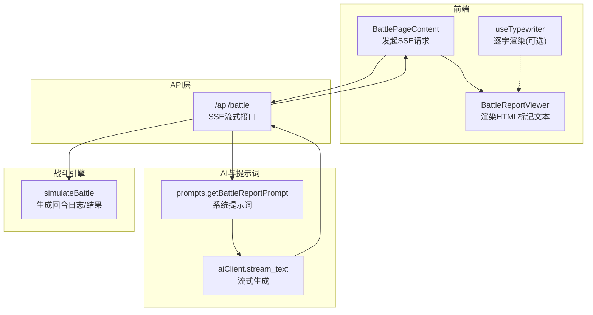
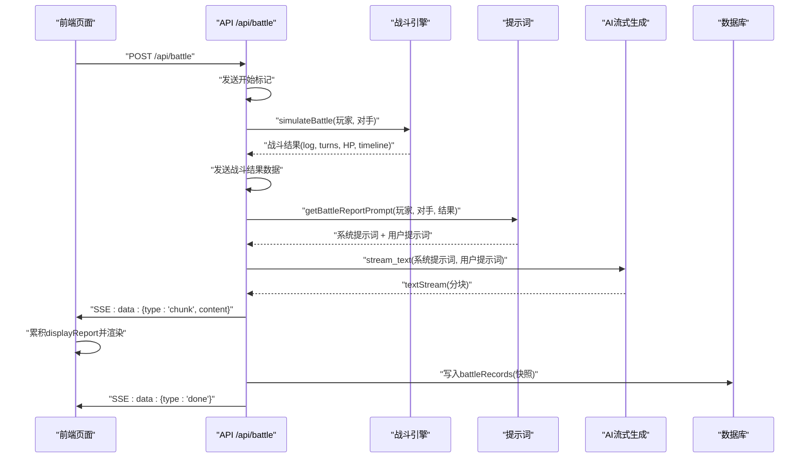
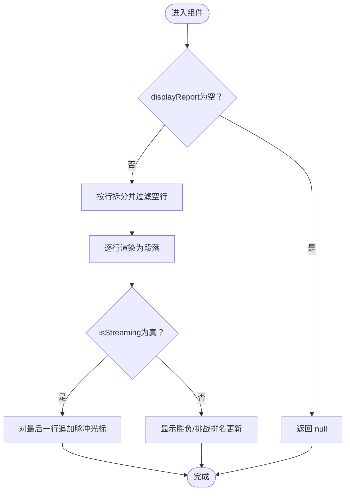
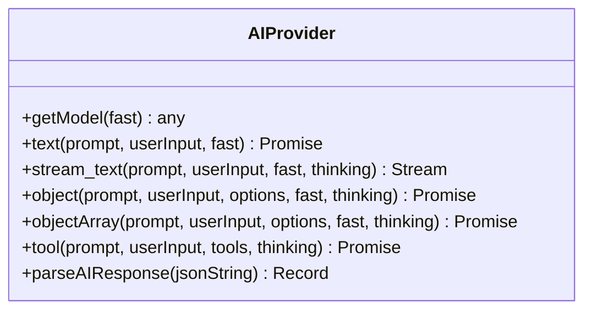
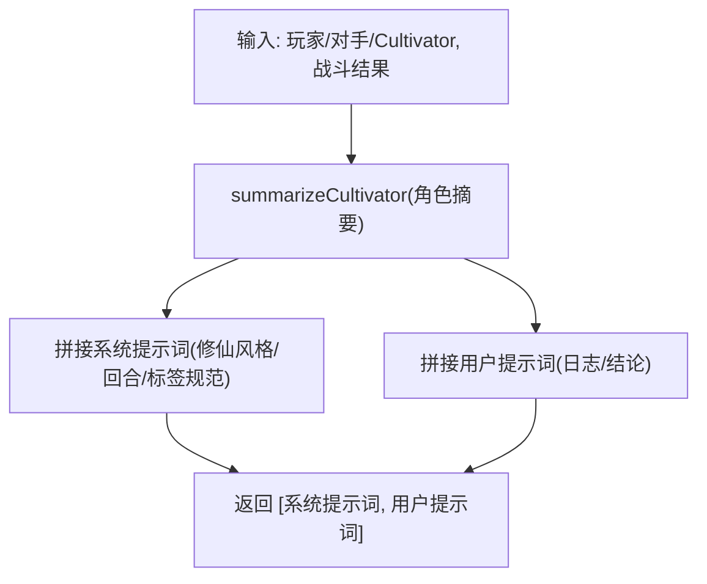
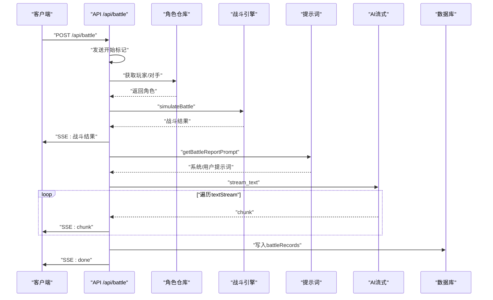
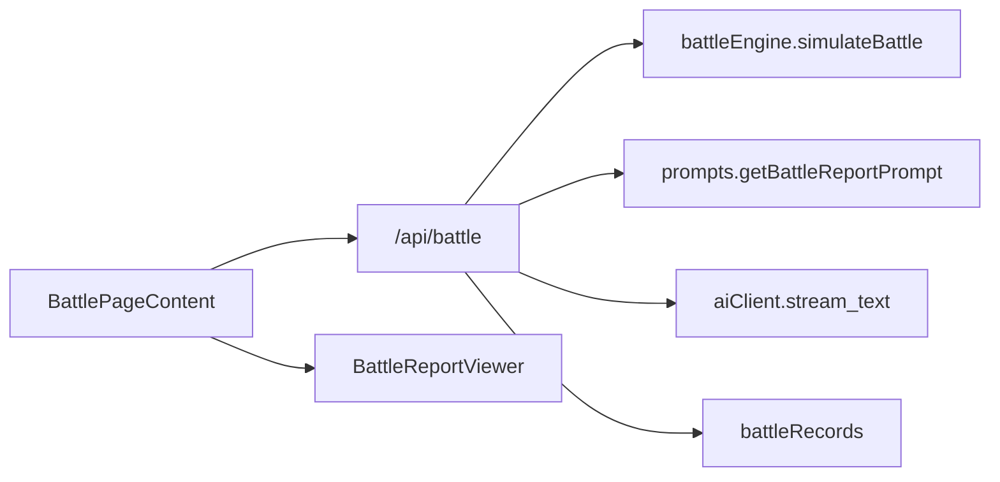

# AI战报生成系统

<cite>
**本文引用的文件**
- [BattleReportViewer.tsx](file://components/BattleReportViewer.tsx)
- [aiClient.ts](file://utils/aiClient.ts)
- [prompts.ts](file://utils/prompts.ts)
- [route.ts](file://app/api/battle/route.ts)
- [battleEngine.ts](file://engine/battleEngine.ts)
- [page.tsx](file://app/battle/page.tsx)
- [useTypewriter.ts](file://lib/hooks/useTypewriter.ts)
- [route.ts](file://app/api/dungeon/battle/execute/route.ts)
- [route.ts](file://app/api/rankings/challenge-battle/route.ts)
</cite>

## 目录
1. [简介](#简介)
2. [项目结构](#项目结构)
3. [核心组件](#核心组件)
4. [架构总览](#架构总览)
5. [详细组件分析](#详细组件分析)
6. [依赖关系分析](#依赖关系分析)
7. [性能考量](#性能考量)
8. [故障排查指南](#故障排查指南)
9. [结论](#结论)
10. [附录](#附录)

## 简介
本技术文档围绕“AI战报生成系统”展开，聚焦于BattleReportViewer组件如何接收来自后端的流式（SSE）AI响应，并实时渲染带有HTML语义标签的叙事性战报文本。文档将结合aiClient.ts中的stream_text函数，阐述与DeepSeek/OpenAI模型的流式通信机制与错误处理策略；分析prompts.ts中getBattleReportPrompt的系统提示词设计，如何引导AI生成符合修仙风格、分回合结构且与角色技能匹配的战斗描写；说明API层（app/api/battle/route.ts）如何整合AI生成流程，并通过数据库缓存结果以提升性能；同时涵盖提示词安全过滤（sanitizePrompt）与流式前端渲染的最佳实践。

## 项目结构
系统采用前后端分离的Next.js架构，核心路径如下：
- 前端页面：app/battle/page.tsx负责发起SSE流请求，解析并驱动BattleReportViewer渲染
- 展示组件：components/BattleReportViewer.tsx负责将带HTML标记的文本逐行渲染，并在流式阶段显示“打字机”光标
- API层：app/api/battle/route.ts执行战斗模拟、生成提示词并调用AI流式接口，通过SSE向前端推送分块内容
- AI客户端：utils/aiClient.ts封装模型选择、流式生成与错误统计
- 提示词工程：utils/prompts.ts提供getBattleReportPrompt，定义修仙风格、回合结构与语义标签规范
- 战斗引擎：engine/battleEngine.ts生成回合日志、胜负与血量等数据，供提示词与渲染使用
- 其他SSE接口：app/api/dungeon/battle/execute/route.ts与app/api/rankings/challenge-battle/route.ts展示了相似的SSE模式，便于对比与复用
- 打字机Hook：lib/hooks/useTypewriter.ts提供可选的逐字渲染能力，适合静态展示场景



图表来源
- [page.tsx](file://app/battle/page.tsx#L110-L206)
- [route.ts](file://app/api/battle/route.ts#L15-L171)
- [aiClient.ts](file://utils/aiClient.ts#L67-L90)
- [prompts.ts](file://utils/prompts.ts#L72-L145)
- [battleEngine.ts](file://engine/battleEngine.ts#L674-L830)

章节来源
- [page.tsx](file://app/battle/page.tsx#L1-L206)
- [route.ts](file://app/api/battle/route.ts#L15-L171)
- [aiClient.ts](file://utils/aiClient.ts#L1-L211)
- [prompts.ts](file://utils/prompts.ts#L1-L356)
- [battleEngine.ts](file://engine/battleEngine.ts#L1-L830)

## 核心组件
- BattleReportViewer：接收displayReport（逐字拼接的流式文本）与isStreaming标志，将文本按行渲染为HTML片段，末行显示脉冲光标；在非流式阶段显示胜负与挑战排名更新信息
- aiClient.stream_text：封装模型选择与流式生成，支持onFinish回调输出用量统计，支持thinking开关
- prompts.getBattleReportPrompt：构造系统提示词与用户提示词，要求AI输出分回合、带语义标签的战斗文本
- app/api/battle/route.ts：执行战斗模拟、生成提示词、流式调用AI、SSE推送分块、写入数据库快照
- engine/battleEngine.simulateBattle：生成回合日志、胜负、回合数、血量与时间线，作为提示词与渲染输入

章节来源
- [BattleReportViewer.tsx](file://components/BattleReportViewer.tsx#L1-L108)
- [aiClient.ts](file://utils/aiClient.ts#L67-L90)
- [prompts.ts](file://utils/prompts.ts#L72-L145)
- [route.ts](file://app/api/battle/route.ts#L15-L171)
- [battleEngine.ts](file://engine/battleEngine.ts#L674-L830)

## 架构总览
系统通过SSE实现“边打边看”的体验：前端发起POST请求到/api/battle，后端启动ReadableStream，依次发送“开始”“战斗结果”“AI内容块”“结束”等事件；前端逐条解析并累积文本，实时渲染到BattleReportViewer。AI侧由aiClient.stream_text驱动，提示词由prompts.getBattleReportPrompt生成，战斗数据由battleEngine提供。



图表来源
- [page.tsx](file://app/battle/page.tsx#L110-L206)
- [route.ts](file://app/api/battle/route.ts#L52-L129)
- [battleEngine.ts](file://engine/battleEngine.ts#L674-L830)
- [prompts.ts](file://utils/prompts.ts#L72-L145)
- [aiClient.ts](file://utils/aiClient.ts#L67-L90)

## 详细组件分析

### BattleReportViewer 组件
- 输入：displayReport（累积的流式文本）、isStreaming（是否仍在流式）、battleResult、player、isWin、rankingUpdate
- 行为：
  - 将displayReport按行拆分，过滤空行，逐行渲染为段落
  - 在isStreaming为true时，对最后一行追加脉冲光标，营造“打字机”效果
  - 非流式阶段显示胜负与挑战排名更新信息（含剩余挑战次数）
- 关键点：使用dangerouslySetInnerHTML将AI返回的HTML标记直接渲染，确保<turn>、<name>、<skill>、<damage>、<heal>、<effect>、<result>等语义标签生效



图表来源
- [BattleReportViewer.tsx](file://components/BattleReportViewer.tsx#L1-L108)

章节来源
- [BattleReportViewer.tsx](file://components/BattleReportViewer.tsx#L1-L108)

### AI客户端与流式通信（aiClient.ts）
- 模型选择：根据环境变量选择DeepSeek Provider与模型，支持Ark与OpenAI两种部署形态
- 流式生成：stream_text函数返回textStream，前端逐块消费；onFinish回调输出用量统计
- 思维模式：providerOptions.deepseek.thinking可切换开启/关闭
- JSON解析：parseAIResponse提供鲁棒的JSON提取与错误处理，应对AI返回的非标准格式



图表来源
- [aiClient.ts](file://utils/aiClient.ts#L1-L211)

章节来源
- [aiClient.ts](file://utils/aiClient.ts#L1-L211)

### 提示词工程（prompts.ts）
- getBattleReportPrompt：
  - 系统提示词要求AI输出分回合、带HTML语义标签的战斗文本，明确标签语义与禁止输出JSON/列表
  - 用户提示词包含双方角色设定、战斗日志、结论（胜者、回合数、剩余气血）
  - 通过summarizeCultivator汇总灵根、属性、技能、功法、先天气运，使AI生成与角色特性契合
- sanitizePrompt：高安全级别净化，移除XML/HTML标签、数字、危险符号、空白字符，过滤作弊关键词，保障提示词安全



图表来源
- [prompts.ts](file://utils/prompts.ts#L63-L145)

章节来源
- [prompts.ts](file://utils/prompts.ts#L1-L356)

### API层整合（app/api/battle/route.ts）
- 身份校验：使用Supabase获取当前用户，未授权返回401
- 输入校验：校验cultivatorId与opponentId
- SSE流：start发送“开始”标记；随后获取玩家/对手、执行simulateBattle、发送“战斗结果”；再生成提示词并流式调用AI，逐块推送“chunk”；完成后发送“done”
- 数据库缓存：将battleResult与完整battleReport写入battleRecords，失败仅记录日志不影响前端体验
- 错误处理：捕获异常，按环境输出安全错误信息并通过SSE发送“error”



图表来源
- [route.ts](file://app/api/battle/route.ts#L15-L171)
- [battleEngine.ts](file://engine/battleEngine.ts#L674-L830)
- [prompts.ts](file://utils/prompts.ts#L72-L145)
- [aiClient.ts](file://utils/aiClient.ts#L67-L90)

章节来源
- [route.ts](file://app/api/battle/route.ts#L15-L171)

### 前端流式渲染（app/battle/page.tsx）
- 发起POST到/api/battle，获取ReadableStream
- 逐行解析SSE数据：type为battle_result时更新battleResult；type为chunk时累积displayReport；type为done时停止流式
- 将isStreaming、battleResult、player、isWin传递给BattleReportViewer
- 可选：结合useTypewriter实现逐字渲染（静态展示）

```mermaid
flowchart TD
S["发起POST /api/battle"] --> R["获取ReadableStream"]
R --> Loop{"循环读取"}
Loop --> |line.startWith('data:')| Parse["解析JSON"]
Parse --> Type{"type类型？"}
Type --> |battle_result| UpdateRes["更新battleResult"]
Type --> |chunk| Append["累积displayReport"]
Type --> |done| Stop["停止流式"]
Type --> |error| HandleErr["弹窗/记录错误"]
UpdateRes --> Loop
Append --> Loop
Stop --> End(["完成"])
HandleErr --> End
```

图表来源
- [page.tsx](file://app/battle/page.tsx#L110-L206)

章节来源
- [page.tsx](file://app/battle/page.tsx#L1-L206)

### 其他SSE接口对比（dungeon与challenge）
- dungeon/battle/execute/route.ts与rankings/challenge-battle/route.ts均采用相同的SSE模式：发送“开始”→执行战斗/挑战→推送“done”或“error”，便于在不同场景复用

章节来源
- [route.ts](file://app/api/dungeon/battle/execute/route.ts#L124-L180)
- [route.ts](file://app/api/rankings/challenge-battle/route.ts#L234-L284)

## 依赖关系分析
- 组件耦合
  - BattleReportViewer依赖displayReport与isStreaming，渲染逻辑与数据来源解耦
  - 前端页面通过SSE与API层松耦合交互
- 外部依赖
  - aiClient依赖@ai-sdk/deepseek与ai库，提供流式生成与用量统计
  - API层依赖Supabase鉴权、Drizzle ORM与数据库schema
- 提示词与战斗引擎
  - prompts.getBattleReportPrompt依赖battleEngine的BattleEngineResult结构
  - sanitizePrompt用于净化用户输入，降低风险



图表来源
- [page.tsx](file://app/battle/page.tsx#L110-L206)
- [route.ts](file://app/api/battle/route.ts#L15-L171)
- [battleEngine.ts](file://engine/battleEngine.ts#L674-L830)
- [prompts.ts](file://utils/prompts.ts#L72-L145)
- [aiClient.ts](file://utils/aiClient.ts#L67-L90)

章节来源
- [page.tsx](file://app/battle/page.tsx#L1-L206)
- [route.ts](file://app/api/battle/route.ts#L15-L171)
- [battleEngine.ts](file://engine/battleEngine.ts#L1-L830)
- [prompts.ts](file://utils/prompts.ts#L1-L356)
- [aiClient.ts](file://utils/aiClient.ts#L1-L211)

## 性能考量
- 流式渲染：前端逐块累积displayReport，避免一次性渲染大文本导致卡顿
- SSE连接：保持长连接，减少HTTP开销；done后及时关闭，释放资源
- 数据库缓存：写入battleRecords作为快照，便于后续回放与审计；失败仅记录日志
- 模型选择：fast模式可降低延迟；thinking开关按需开启，减少推理冗余
- 文本处理：BattleReportViewer按行渲染，末行追加光标，避免DOM过大

[本节为通用性能建议，无需特定文件引用]

## 故障排查指南
- 未授权访问
  - 现象：返回401
  - 排查：确认Supabase鉴权成功；检查用户是否存在
- 输入非法
  - 现象：返回400
  - 排查：确认cultivatorId与opponentId为非空字符串
- SSE解析错误
  - 现象：前端解析SSE失败或显示空白
  - 排查：检查SSE行格式；确认API正确发送“start”“battle_result”“chunk”“done”“error”
- AI生成异常
  - 现象：出现“error”事件或用量统计缺失
  - 排查：查看onFinish回调与环境变量；必要时关闭thinking
- 数据库写入失败
  - 现象：战斗记录未入库
  - 排查：检查数据库连接与schema；失败不影响前端体验

章节来源
- [route.ts](file://app/api/battle/route.ts#L15-L171)
- [page.tsx](file://app/battle/page.tsx#L110-L206)
- [aiClient.ts](file://utils/aiClient.ts#L67-L90)

## 结论
本系统通过SSE实现了“边打边看”的流畅体验，BattleReportViewer负责将AI生成的带HTML语义标签的文本实时渲染；aiClient.ts提供稳定的流式通信与用量统计；prompts.ts确保提示词质量与风格一致性；API层整合战斗引擎与AI生成，通过数据库快照提升可复用性。整体架构清晰、模块职责明确，具备良好的扩展性与可维护性。

[本节为总结性内容，无需特定文件引用]

## 附录
- HTML语义标签规范
  - 回合数：<turn>【第X回合】</turn>
  - 人名：<name>人名</name>
  - 技能名称：<skill>技能名</skill>
  - 伤害数值：<damage>数字</damage>
  - 治疗数值：<heal>数字</heal>
  - 效果描述：<effect>效果描述</effect>
  - 胜负结果：<result>胜负描述</result>
- 提示词安全过滤
  - sanitizePrompt移除XML/HTML标签、数字、危险符号、空白字符，过滤作弊关键词，保障输入安全

章节来源
- [prompts.ts](file://utils/prompts.ts#L262-L356)