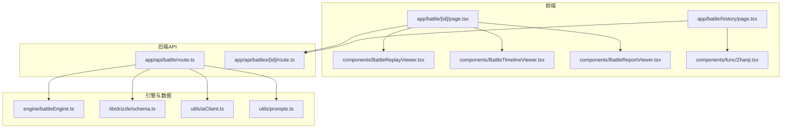
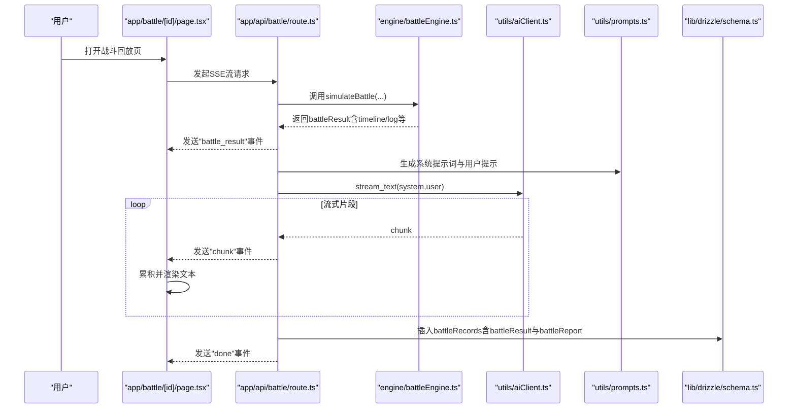
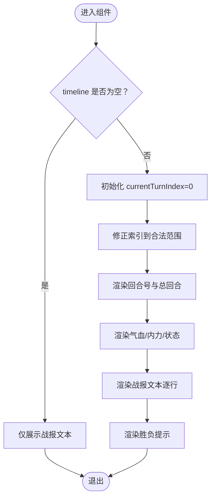
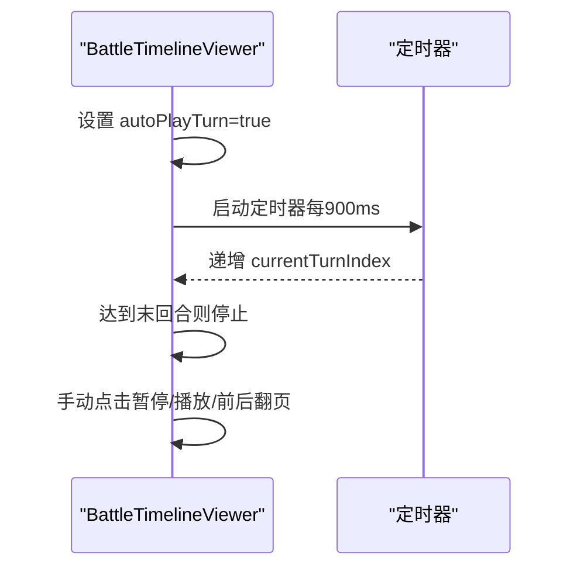
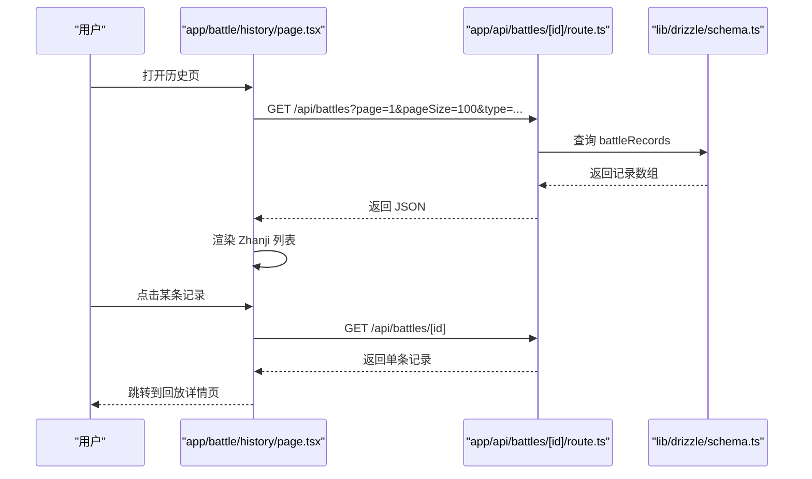
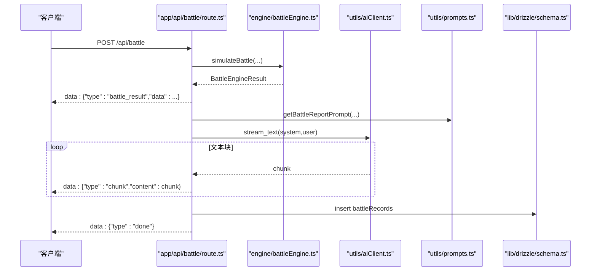
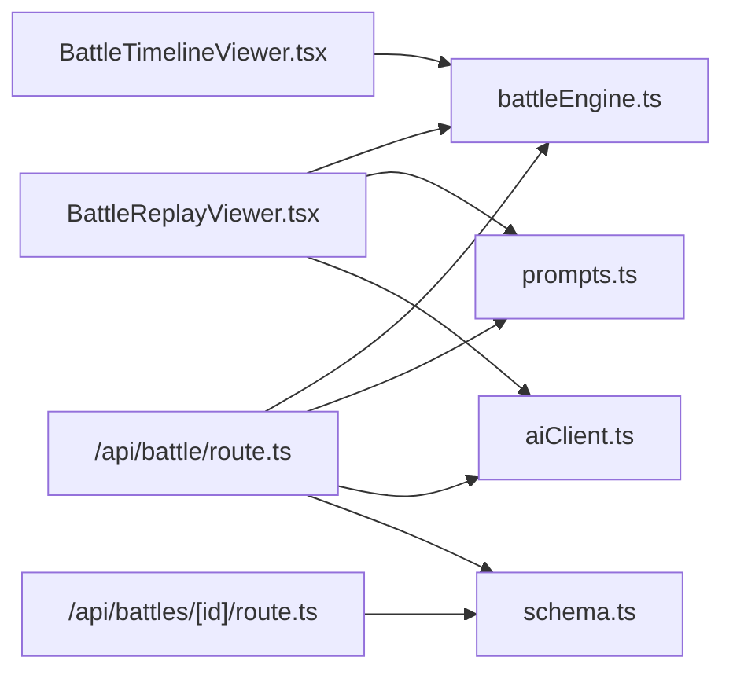

# 战报系统

<cite>
**本文档引用的文件**
- [components/BattleReplayViewer.tsx](file://components/BattleReplayViewer.tsx)
- [components/BattleReportViewer.tsx](file://components/BattleReportViewer.tsx)
- [components/BattleTimelineViewer.tsx](file://components/BattleTimelineViewer.tsx)
- [app/battle/[id]/page.tsx](file://app/battle/[id]/page.tsx)
- [app/battle/history/page.tsx](file://app/battle/history/page.tsx)
- [app/api/battle/route.ts](file://app/api/battle/route.ts)
- [app/api/battles/[id]/route.ts](file://app/api/battles/[id]/route.ts)
- [engine/battleEngine.ts](file://engine/battleEngine.ts)
- [utils/aiClient.ts](file://utils/aiClient.ts)
- [utils/prompts.ts](file://utils/prompts.ts)
- [lib/drizzle/schema.ts](file://lib/drizzle/schema.ts)
- [components/func/Zhanji.tsx](file://components/func/Zhanji.tsx)
</cite>

## 目录
1. [简介](#简介)
2. [项目结构](#项目结构)
3. [核心组件](#核心组件)
4. [架构总览](#架构总览)
5. [详细组件分析](#详细组件分析)
6. [依赖关系分析](#依赖关系分析)
7. [性能考虑](#性能考虑)
8. [故障排查指南](#故障排查指南)
9. [结论](#结论)
10. [附录](#附录)

## 简介
本系统围绕“战斗回放、数值时间线与AI生成战报”三大能力构建，目标是：
- 通过回合时间线实现“回放/快进/暂停/逐回合浏览”，直观展示角色气血、内力与状态变化。
- 通过AI提示词与流式SSE技术，实时生成叙事性战报文本，并在页面上逐步呈现。
- 通过历史页面与数据库持久化，让用户可检索过往战斗记录并回看战报。

## 项目结构
- 前端页面与组件
  - 战斗回放详情页：app/battle/[id]/page.tsx
  - 战斗历史页：app/battle/history/page.tsx
  - 回放组件：components/BattleReplayViewer.tsx、components/BattleTimelineViewer.tsx
  - 战报渲染组件：components/BattleReportViewer.tsx
  - 历史条目卡片：components/func/Zhanji.tsx
- 后端API
  - 实时战斗与战报流：app/api/battle/route.ts
  - 单条记录查询：app/api/battles/[id]/route.ts
- 引擎与数据模型
  - 战斗引擎：engine/battleEngine.ts
  - 数据库Schema：lib/drizzle/schema.ts
- AI工具与提示词
  - AI客户端：utils/aiClient.ts
  - 提示词模板：utils/prompts.ts

图表来源
- [app/battle/[id]/page.tsx](file://app/battle/[id]/page.tsx#L1-L103)
- [app/battle/history/page.tsx](file://app/battle/history/page.tsx#L1-L106)
- [components/BattleReplayViewer.tsx](file://components/BattleReplayViewer.tsx#L1-L140)
- [components/BattleTimelineViewer.tsx](file://components/BattleTimelineViewer.tsx#L1-L141)
- [components/BattleReportViewer.tsx](file://components/BattleReportViewer.tsx#L1-L108)
- [components/func/Zhanji.tsx](file://components/func/Zhanji.tsx#L1-L80)
- [app/api/battle/route.ts](file://app/api/battle/route.ts#L1-L172)
- [app/api/battles/[id]/route.ts](file://app/api/battles/[id]/route.ts#L1-L47)
- [engine/battleEngine.ts](file://engine/battleEngine.ts#L1-L830)
- [lib/drizzle/schema.ts](file://lib/drizzle/schema.ts#L240-L265)
- [utils/aiClient.ts](file://utils/aiClient.ts#L1-L211)
- [utils/prompts.ts](file://utils/prompts.ts#L63-L145)

章节来源
- [app/battle/[id]/page.tsx](file://app/battle/[id]/page.tsx#L1-L103)
- [app/battle/history/page.tsx](file://app/battle/history/page.tsx#L1-L106)
- [engine/battleEngine.ts](file://engine/battleEngine.ts#L1-L830)
- [lib/drizzle/schema.ts](file://lib/drizzle/schema.ts#L240-L265)

## 核心组件
- 回放组件 BattleReplayViewer：接收 timeline、玩家/对手名、回合总数、胜负标志与战报文本，提供上下回合切换与数值/状态展示。
- 时间线组件 BattleTimelineViewer：基于 battleResult.timeline 自动播放，支持手动暂停/播放与逐回合切换。
- 战报渲染组件 BattleReportViewer：负责渲染AI生成的战报文本，支持流式末尾指示与挑战/排名更新提示。
- 历史页面 app/battle/history/page.tsx：拉取历史记录，按标签页筛选，渲染 Zhanji 卡片链接到回放详情。
- 单条记录查询 app/api/battles/[id]/route.ts：鉴权后读取数据库中的 battleRecords 并返回。
- 实时战斗与SSE app/api/battle/route.ts：执行战斗引擎，生成 battle_result，随后流式生成战报文本并通过SSE推送。

章节来源
- [components/BattleReplayViewer.tsx](file://components/BattleReplayViewer.tsx#L1-L140)
- [components/BattleTimelineViewer.tsx](file://components/BattleTimelineViewer.tsx#L1-L141)
- [components/BattleReportViewer.tsx](file://components/BattleReportViewer.tsx#L1-L108)
- [app/battle/history/page.tsx](file://app/battle/history/page.tsx#L1-L106)
- [app/api/battles/[id]/route.ts](file://app/api/battles/[id]/route.ts#L1-L47)
- [app/api/battle/route.ts](file://app/api/battle/route.ts#L1-L172)

## 架构总览
系统采用“前端页面 + 组件渲染 + 后端API + 引擎/数据库 + AI提示词”的分层架构。战斗回放与数值时间线由前端组件消费 battleEngine 的 timeline 数据；AI战报通过SSE从后端流式推送，前端逐步拼接并渲染。

图表来源
- [app/battle/[id]/page.tsx](file://app/battle/[id]/page.tsx#L1-L103)
- [app/api/battle/route.ts](file://app/api/battle/route.ts#L1-L172)
- [engine/battleEngine.ts](file://engine/battleEngine.ts#L674-L830)
- [utils/aiClient.ts](file://utils/aiClient.ts#L67-L90)
- [utils/prompts.ts](file://utils/prompts.ts#L63-L145)
- [lib/drizzle/schema.ts](file://lib/drizzle/schema.ts#L240-L265)

## 详细组件分析

### 回放组件 BattleReplayViewer
- 输入：玩家名、对手名、timeline、回合总数、胜负标志、可选战报文本。
- 行为：
  - 当 timeline 为空时，仅展示可选的战报文本。
  - 通过 useState 维护 currentTurnIndex，提供“上一回合/下一回合”按钮。
  - 渲染当前回合的气血、内力与状态列表（状态标签来自字典映射）。
  - 战报文本按行渲染，末行可带流式指示（由父组件传递 isStreaming）。
- 性能要点：
  - 仅渲染当前回合快照，避免重复计算。
  - 使用 Math.min/Math.max 保证索引边界安全。
- 适用场景：
  - 从单条记录详情页传入 timeline 与战报，实现“回放+文本”一体化展示。

图表来源
- [components/BattleReplayViewer.tsx](file://components/BattleReplayViewer.tsx#L1-L140)

章节来源
- [components/BattleReplayViewer.tsx](file://components/BattleReplayViewer.tsx#L1-L140)

### 时间线组件 BattleTimelineViewer
- 输入：battleResult、玩家名、对手名。
- 行为：
  - 基于 battleResult.timeline 自动播放，间隔固定（毫秒级定时器）。
  - 支持手动暂停/播放与逐回合前进/后退。
  - 在 timeline 更新时重置播放状态。
- 性能要点：
  - 使用 useEffect 清理定时器，避免内存泄漏。
  - 仅在 timeline 长度变化时重置播放，减少副作用触发。

图表来源
- [components/BattleTimelineViewer.tsx](file://components/BattleTimelineViewer.tsx#L1-L141)

章节来源
- [components/BattleTimelineViewer.tsx](file://components/BattleTimelineViewer.tsx#L1-L141)

### 战报渲染组件 BattleReportViewer
- 输入：displayReport（累积的战报文本）、isStreaming（是否仍在流式）、battleResult、玩家信息、胜负标志、可选挑战/排名更新。
- 行为：
  - 将文本按行渲染，末行显示脉冲指示（流式进行中）。
  - 非流式时根据胜负与挑战场景渲染不同结果提示。
- 适用场景：
  - 与SSE配合，实时展示AI生成的战报文本。

章节来源
- [components/BattleReportViewer.tsx](file://components/BattleReportViewer.tsx#L1-L108)

### 历史页面与单条记录查询
- 历史页面 app/battle/history/page.tsx：
  - 通过标签页筛选（全部/我的挑战/我被挑战）调用 /api/battles，分页加载记录。
  - 渲染 Zhanji 卡片，点击跳转到回放详情。
- 单条记录查询 app/api/battles/[id]/route.ts：
  - 鉴权后查询 battleRecords，返回完整记录（含 battleResult 与 battleReport）。

图表来源
- [app/battle/history/page.tsx](file://app/battle/history/page.tsx#L1-L106)
- [app/api/battles/[id]/route.ts](file://app/api/battles/[id]/route.ts#L1-L47)
- [lib/drizzle/schema.ts](file://lib/drizzle/schema.ts#L240-L265)

章节来源
- [app/battle/history/page.tsx](file://app/battle/history/page.tsx#L1-L106)
- [app/api/battles/[id]/route.ts](file://app/api/battles/[id]/route.ts#L1-L47)
- [components/func/Zhanji.tsx](file://components/func/Zhanji.tsx#L1-L80)

### 回放详情页与数据流
- 回放详情页 app/battle/[id]/page.tsx：
  - 通过 /api/battles/[id] 获取单条记录，解构出 battleResult 与 battleReport。
  - 传给 BattleReplayViewer 展示 timeline 与战报文本。
- 数据来源：
  - 战斗结果 timeline 由 battleEngine 生成，包含每回合的玩家/对手气血、内力与状态集合。

章节来源
- [app/battle/[id]/page.tsx](file://app/battle/[id]/page.tsx#L1-L103)
- [engine/battleEngine.ts](file://engine/battleEngine.ts#L434-L450)

### AI生成战报与SSE流
- 后端接口 app/api/battle/route.ts：
  - 验证用户身份，获取玩家与对手角色，执行 simulateBattle。
  - 先发送 battle_result 事件，再流式生成战报文本，逐块推送 chunk，最后 done。
  - 将 battleResult 与完整 battleReport 写入 battleRecords。
- AI客户端 utils/aiClient.ts：
  - 统一封装 getModel、text、stream_text、object 等方法，支持思考模式开关与用量统计。
- 提示词 utils/prompts.ts：
  - getBattleReportPrompt：构造系统提示词与用户提示，包含双方角色设定、战斗日志与结论，要求HTML标记规范。

图表来源
- [app/api/battle/route.ts](file://app/api/battle/route.ts#L1-L172)
- [engine/battleEngine.ts](file://engine/battleEngine.ts#L674-L830)
- [utils/aiClient.ts](file://utils/aiClient.ts#L67-L90)
- [utils/prompts.ts](file://utils/prompts.ts#L63-L145)
- [lib/drizzle/schema.ts](file://lib/drizzle/schema.ts#L240-L265)

章节来源
- [app/api/battle/route.ts](file://app/api/battle/route.ts#L1-L172)
- [utils/aiClient.ts](file://utils/aiClient.ts#L1-L211)
- [utils/prompts.ts](file://utils/prompts.ts#L63-L145)
- [lib/drizzle/schema.ts](file://lib/drizzle/schema.ts#L240-L265)

## 依赖关系分析
- 组件依赖
  - BattleReplayViewer 依赖 battleEngine 的 TurnSnapshot 与 BattleEngineResult 类型。
  - BattleTimelineViewer 依赖 battleEngine 的 BattleEngineResult。
  - BattleReportViewer 依赖 battleEngine 的 BattleEngineResult 与 Cultivator 类型。
- API 依赖
  - /api/battle 依赖 battleEngine、aiClient、prompts、schema。
  - /api/battles/[id] 依赖 schema 与鉴权。
- 数据模型
  - battleRecords 存储 battleResult 与 battleReport，支持历史检索与回放。

图表来源
- [components/BattleReplayViewer.tsx](file://components/BattleReplayViewer.tsx#L1-L140)
- [components/BattleTimelineViewer.tsx](file://components/BattleTimelineViewer.tsx#L1-L141)
- [engine/battleEngine.ts](file://engine/battleEngine.ts#L1-L830)
- [utils/prompts.ts](file://utils/prompts.ts#L63-L145)
- [utils/aiClient.ts](file://utils/aiClient.ts#L1-L211)
- [app/api/battle/route.ts](file://app/api/battle/route.ts#L1-L172)
- [app/api/battles/[id]/route.ts](file://app/api/battles/[id]/route.ts#L1-L47)
- [lib/drizzle/schema.ts](file://lib/drizzle/schema.ts#L240-L265)

章节来源
- [engine/battleEngine.ts](file://engine/battleEngine.ts#L1-L830)
- [lib/drizzle/schema.ts](file://lib/drizzle/schema.ts#L240-L265)

## 性能考虑
- 回放渲染
  - 仅渲染当前回合快照，避免对整个 timeline 的重复计算与DOM操作。
  - BattleTimelineViewer 使用定时器自动播放，注意在组件卸载时清理定时器。
- SSE流式传输
  - 服务端逐块推送，前端累积并在末行显示脉冲指示，避免一次性渲染大量文本导致卡顿。
- 数据库写入
  - 战报写入 battleRecords 时捕获异常并记录日志，不影响前端体验。
- 提示词与模型选择
  - aiClient 支持 fast 模型与思考模式开关，可根据场景权衡速度与质量。

[本节为通用性能建议，无需特定文件引用]

## 故障排查指南
- 未授权访问
  - /api/battle 与 /api/battles/[id] 均需鉴权，若返回未授权，检查登录状态与用户ID。
- 战斗记录不存在
  - /api/battles/[id] 返回记录不存在时，确认ID正确且属于当前用户。
- SSE流中断
  - 检查后端错误处理分支，确保在异常时发送 error 事件并关闭流。
- 战报文本异常
  - 若AI返回非JSON或格式异常，aiClient 提供解析辅助函数，必要时启用更严格的 schema 校验。

章节来源
- [app/api/battle/route.ts](file://app/api/battle/route.ts#L1-L172)
- [app/api/battles/[id]/route.ts](file://app/api/battles/[id]/route.ts#L1-L47)
- [utils/aiClient.ts](file://utils/aiClient.ts#L193-L211)

## 结论
本系统通过“数值时间线 + AI战报SSE”的组合，实现了沉浸式的战斗回放体验。前端组件聚焦渲染与交互，后端API负责战斗执行与流式生成，数据库持久化保障历史可追溯。建议在生产环境中进一步完善错误监控、缓存策略与提示词校验，以提升稳定性与用户体验。

[本节为总结性内容，无需特定文件引用]

## 附录

### 战报数据存储结构
- 表：battleRecords
  - 字段：userId、cultivatorId、challengeType、opponentCultivatorId、battleResult（JSONB）、battleReport（TEXT）、createdAt
  - 用途：存储每场战斗的完整结果快照与AI生成的战报全文，支持历史检索与回放。

章节来源
- [lib/drizzle/schema.ts](file://lib/drizzle/schema.ts#L240-L265)

### timeline 数据结构说明
- TurnSnapshot
  - 字段：turn、player、opponent
  - player/opponent：包含 hp、mp、statuses（状态枚举数组）
- BattleEngineResult
  - 字段：winner、loser、log、turns、playerHp、opponentHp、timeline（TurnSnapshot[]）

章节来源
- [engine/battleEngine.ts](file://engine/battleEngine.ts#L23-L44)
- [engine/battleEngine.ts](file://engine/battleEngine.ts#L434-L450)

### 回放与数值时间线的实现要点
- 回放组件
  - 通过 currentTurnIndex 与 safeIndex 限制索引范围，渲染当前回合的气血/内力/状态。
  - 提供“上一回合/下一回合”按钮，支持手动回溯。
- 数值时间线
  - 自动播放定时器，支持暂停/播放与手动翻页。
  - 在 timeline 更新时重置播放状态，确保一致性。

章节来源
- [components/BattleReplayViewer.tsx](file://components/BattleReplayViewer.tsx#L1-L140)
- [components/BattleTimelineViewer.tsx](file://components/BattleTimelineViewer.tsx#L1-L141)

### AI提示词与流式生成
- 提示词模板
  - getBattleReportPrompt：构造系统提示词与用户提示，要求HTML标记规范，便于前端渲染。
- 流式生成
  - stream_text 返回 textStream，后端逐块推送 chunk，前端累积并渲染。
  - 完成后发送 done，前端停止流式指示并展示最终结果。

章节来源
- [utils/prompts.ts](file://utils/prompts.ts#L63-L145)
- [utils/aiClient.ts](file://utils/aiClient.ts#L67-L90)
- [app/api/battle/route.ts](file://app/api/battle/route.ts#L103-L127)