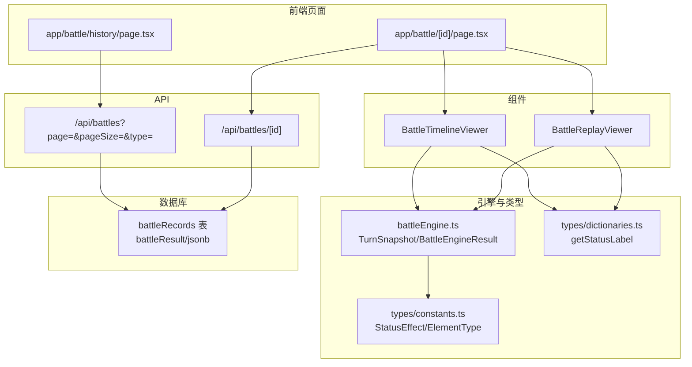
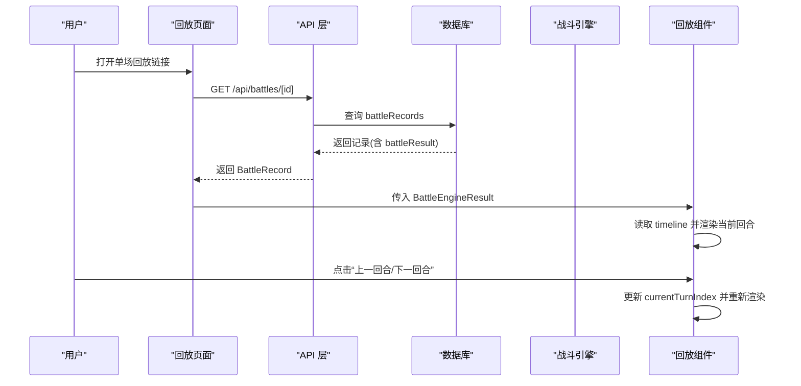
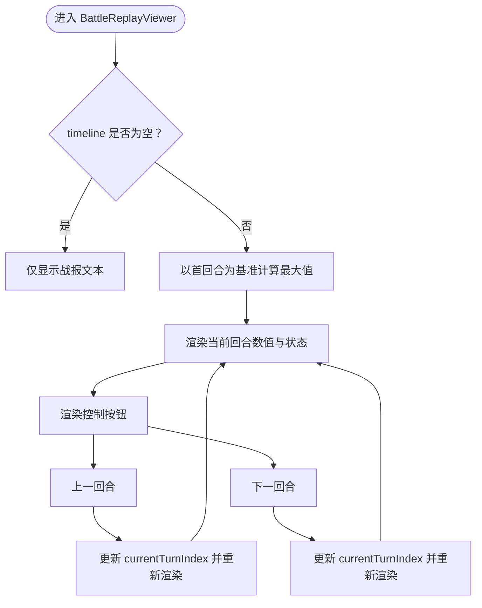
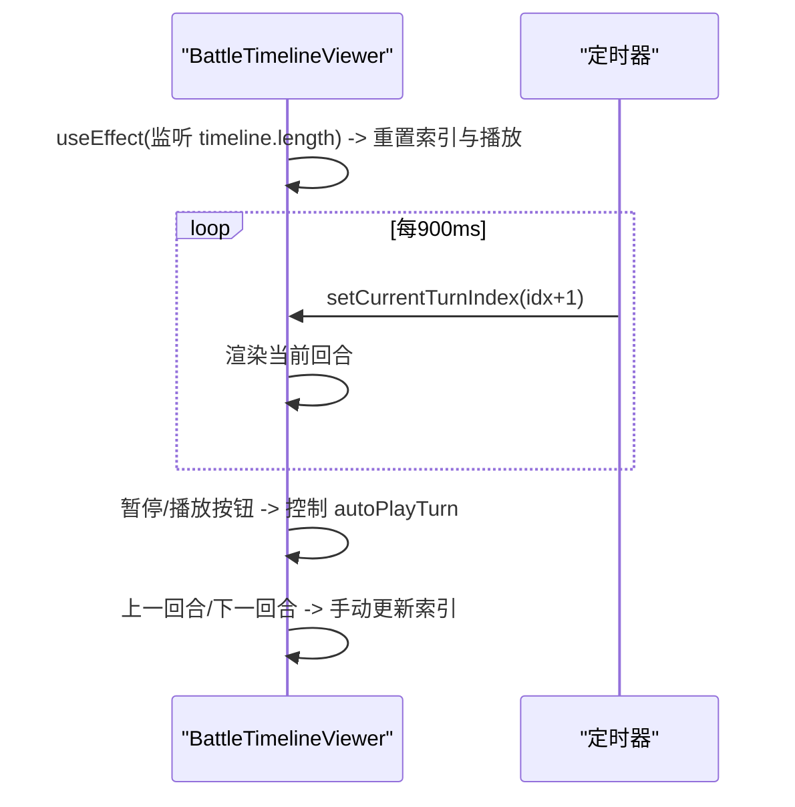
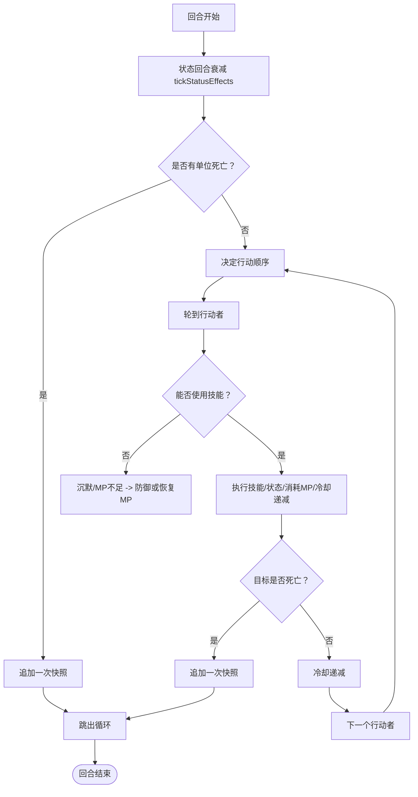
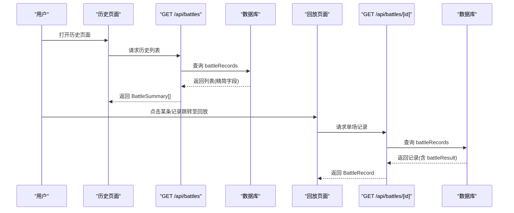
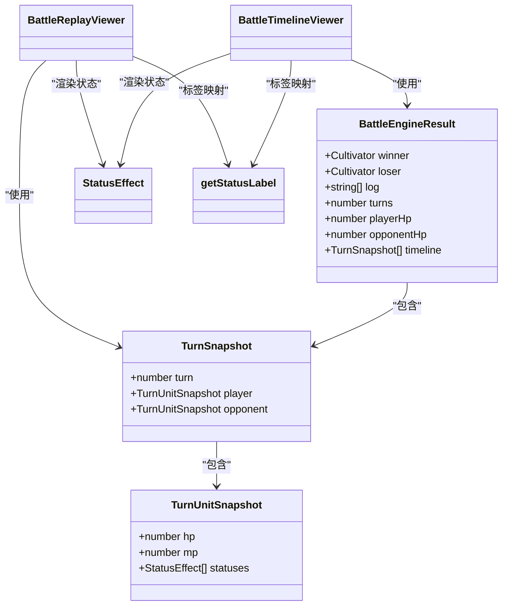
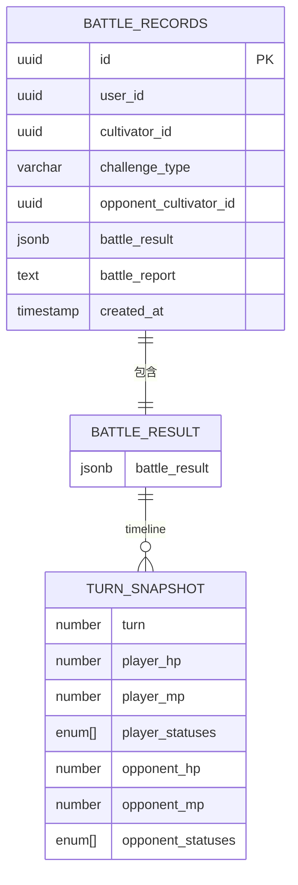

# 数值回放系统

<cite>
**本文引用的文件**
- [components/BattleReplayViewer.tsx](file://components/BattleReplayViewer.tsx)
- [components/BattleTimelineViewer.tsx](file://components/BattleTimelineViewer.tsx)
- [engine/battleEngine.ts](file://engine/battleEngine.ts)
- [app/battle/[id]/page.tsx](file://app/battle/[id]/page.tsx)
- [app/battle/history/page.tsx](file://app/battle/history/page.tsx)
- [app/api/battles/[id]/route.ts](file://app/api/battles/[id]/route.ts)
- [app/api/battles/route.ts](file://app/api/battles/route.ts)
- [lib/drizzle/schema.ts](file://lib/drizzle/schema.ts)
- [types/constants.ts](file://types/constants.ts)
- [types/dictionaries.ts](file://types/dictionaries.ts)
</cite>

## 目录
1. [引言](#引言)
2. [项目结构](#项目结构)
3. [核心组件](#核心组件)
4. [架构总览](#架构总览)
5. [详细组件分析](#详细组件分析)
6. [依赖关系分析](#依赖关系分析)
7. [性能考量](#性能考量)
8. [故障排查指南](#故障排查指南)
9. [结论](#结论)
10. [附录](#附录)

## 引言
本文件围绕“数值回放系统”展开，聚焦于 BattleReplayViewer 组件的实现机制，解释 TurnSnapshot 数据结构如何记录每回合角色状态（气血、灵力、状态效果等），并通过“上一回合/下一回合”按钮实现时间线回溯；同时说明 BattleTimelineViewer 如何可视化战斗流程，并阐述 app/battle/[id]/page.tsx 如何加载单场战斗的详细时间线数据，app/battle/history/page.tsx 如何从数据库获取历史战斗记录用于回放。结合 battleEngine.ts 的战斗逻辑，阐明数值快照的生成时机与存储策略，并给出性能优化建议（如分页加载与压缩存储）。

## 项目结构
- 前端页面层：
  - 单场回放页面：app/battle/[id]/page.tsx
  - 历史列表页面：app/battle/history/page.tsx
- API 层：
  - 获取单条战斗记录：app/api/battles/[id]/route.ts
  - 获取历史列表（含分页）：app/api/battles/route.ts
- 组件层：
  - 数值回放组件：components/BattleReplayViewer.tsx
  - 自动播放时间线组件：components/BattleTimelineViewer.tsx
- 引擎与类型：
  - 战斗引擎与数据模型：engine/battleEngine.ts
  - 类型与字典：types/constants.ts、types/dictionaries.ts
- 数据库模式：
  - 战斗记录表：lib/drizzle/schema.ts

图表来源
- [app/battle/[id]/page.tsx](file://app/battle/[id]/page.tsx#L1-L103)
- [app/battle/history/page.tsx](file://app/battle/history/page.tsx#L1-L106)
- [app/api/battles/[id]/route.ts](file://app/api/battles/[id]/route.ts#L1-L47)
- [app/api/battles/route.ts](file://app/api/battles/route.ts#L1-L100)
- [components/BattleReplayViewer.tsx](file://components/BattleReplayViewer.tsx#L1-L140)
- [components/BattleTimelineViewer.tsx](file://components/BattleTimelineViewer.tsx#L1-L141)
- [engine/battleEngine.ts](file://engine/battleEngine.ts#L1-L120)
- [lib/drizzle/schema.ts](file://lib/drizzle/schema.ts#L240-L265)
- [types/constants.ts](file://types/constants.ts#L26-L41)
- [types/dictionaries.ts](file://types/dictionaries.ts#L172-L244)

章节来源
- [app/battle/[id]/page.tsx](file://app/battle/[id]/page.tsx#L1-L103)
- [app/battle/history/page.tsx](file://app/battle/history/page.tsx#L1-L106)
- [app/api/battles/[id]/route.ts](file://app/api/battles/[id]/route.ts#L1-L47)
- [app/api/battles/route.ts](file://app/api/battles/route.ts#L1-L100)
- [components/BattleReplayViewer.tsx](file://components/BattleReplayViewer.tsx#L1-L140)
- [components/BattleTimelineViewer.tsx](file://components/BattleTimelineViewer.tsx#L1-L141)
- [engine/battleEngine.ts](file://engine/battleEngine.ts#L1-L120)
- [lib/drizzle/schema.ts](file://lib/drizzle/schema.ts#L240-L265)
- [types/constants.ts](file://types/constants.ts#L26-L41)
- [types/dictionaries.ts](file://types/dictionaries.ts#L172-L244)

## 核心组件
- TurnSnapshot：每回合的数值快照，包含回合号与双方单位的 HP/MP/状态列表。
- BattleEngineResult：战斗结果容器，包含赢家/输家、回合数、最终双方状态、以及完整的时间线数组。
- BattleReplayViewer：基于 TurnSnapshot 时间线进行回放，支持手动切换回合。
- BattleTimelineViewer：自动播放时间线，支持暂停/播放与手动切换。

章节来源
- [engine/battleEngine.ts](file://engine/battleEngine.ts#L23-L43)
- [components/BattleReplayViewer.tsx](file://components/BattleReplayViewer.tsx#L1-L140)
- [components/BattleTimelineViewer.tsx](file://components/BattleTimelineViewer.tsx#L1-L141)

## 架构总览
数值回放系统的关键流程如下：
- 战斗引擎在模拟过程中，按回合生成 TurnSnapshot 并写入 BattleEngineResult.timeline。
- 前端页面通过 API 获取单场战斗记录或历史列表，将 BattleEngineResult 传递给回放组件。
- BattleReplayViewer/BattleTimelineViewer 读取 timeline，渲染回合、气血、灵力与状态效果，并支持用户交互。

图表来源
- [app/battle/[id]/page.tsx](file://app/battle/[id]/page.tsx#L1-L103)
- [app/api/battles/[id]/route.ts](file://app/api/battles/[id]/route.ts#L1-L47)
- [lib/drizzle/schema.ts](file://lib/drizzle/schema.ts#L240-L265)
- [components/BattleReplayViewer.tsx](file://components/BattleReplayViewer.tsx#L1-L140)
- [components/BattleTimelineViewer.tsx](file://components/BattleTimelineViewer.tsx#L1-L141)
- [engine/battleEngine.ts](file://engine/battleEngine.ts#L434-L450)

## 详细组件分析

### BattleReplayViewer 组件
- 输入参数：玩家名、对手名、timeline、战报文本、回合总数、胜负标志。
- 回放机制：
  - 维护 currentTurnIndex，确保索引合法（0..timeline.length-1）。
  - 以 timeline[0] 的初始状态作为最大值基准，避免 UI 缩放异常。
  - 渲染当前回合的气血、灵力与状态列表（状态标签来自字典）。
  - 提供“上一回合/下一回合”按钮，更新 currentTurnIndex。
- 特殊处理：
  - 若 timeline 为空，仅显示战报文本。
  - 若存在 battleReport，按行渲染 HTML 内容。

图表来源
- [components/BattleReplayViewer.tsx](file://components/BattleReplayViewer.tsx#L1-L140)
- [types/dictionaries.ts](file://types/dictionaries.ts#L172-L244)

章节来源
- [components/BattleReplayViewer.tsx](file://components/BattleReplayViewer.tsx#L1-L140)
- [types/dictionaries.ts](file://types/dictionaries.ts#L172-L244)

### BattleTimelineViewer 组件
- 输入参数：battleResult、玩家名、对手名。
- 自动播放：
  - 每次 battleResult 到达时，重置 currentTurnIndex 为 0，并开启自动播放。
  - 使用定时器每 900ms 前进一个回合，直到末尾。
  - 支持暂停/播放按钮，手动前进/后退。
- 渲染内容：
  - 显示回合号、双方气血/灵力与状态列表。
  - 状态列表通过 getStatusLabel 转换为中文标签。

图表来源
- [components/BattleTimelineViewer.tsx](file://components/BattleTimelineViewer.tsx#L1-L141)

章节来源
- [components/BattleTimelineViewer.tsx](file://components/BattleTimelineViewer.tsx#L1-L141)

### TurnSnapshot 数据结构与生成时机
- 数据结构：
  - TurnSnapshot：包含 turn、player、opponent。
  - TurnUnitSnapshot：包含 hp、mp、statuses。
- 生成时机：
  - 初始回合（turn=0）：在战斗开始前记录一次快照。
  - 每回合结束时：若未在该回合内生成过快照，则调用 snapshotTurn 生成一次。
  - 战斗结束时：若某一方 HP<=0，会在结算前追加一次快照，确保回放能展示最终状态。

图表来源
- [engine/battleEngine.ts](file://engine/battleEngine.ts#L712-L800)
- [engine/battleEngine.ts](file://engine/battleEngine.ts#L434-L450)

章节来源
- [engine/battleEngine.ts](file://engine/battleEngine.ts#L23-L43)
- [engine/battleEngine.ts](file://engine/battleEngine.ts#L434-L450)
- [engine/battleEngine.ts](file://engine/battleEngine.ts#L712-L800)

### 单场回放页面与历史列表页面
- 单场回放页面（app/battle/[id]/page.tsx）：
  - 通过 fetch /api/battles/[id] 获取 BattleRecord。
  - 将 battleResult 传递给 BattleReplayViewer/BattleTimelineViewer。
- 历史列表页面（app/battle/history/page.tsx）：
  - 通过 fetch /api/battles?page=1&pageSize=100&type=... 获取 BattleSummary 列表。
  - 支持按 tab 切换“全部/我的挑战/我被挑战”。

图表来源
- [app/battle/history/page.tsx](file://app/battle/history/page.tsx#L1-L106)
- [app/api/battles/route.ts](file://app/api/battles/route.ts#L1-L100)
- [lib/drizzle/schema.ts](file://lib/drizzle/schema.ts#L240-L265)
- [app/battle/[id]/page.tsx](file://app/battle/[id]/page.tsx#L1-L103)
- [app/api/battles/[id]/route.ts](file://app/api/battles/[id]/route.ts#L1-L47)

章节来源
- [app/battle/history/page.tsx](file://app/battle/history/page.tsx#L1-L106)
- [app/api/battles/route.ts](file://app/api/battles/route.ts#L1-L100)
- [app/battle/[id]/page.tsx](file://app/battle/[id]/page.tsx#L1-L103)
- [app/api/battles/[id]/route.ts](file://app/api/battles/[id]/route.ts#L1-L47)
- [lib/drizzle/schema.ts](file://lib/drizzle/schema.ts#L240-L265)

## 依赖关系分析
- 组件依赖：
  - BattleReplayViewer/BattleTimelineViewer 依赖 TurnSnapshot 与 StatusEffect 类型。
  - 两者均依赖 getStatusLabel 将状态效果转换为中文标签。
- 引擎与类型：
  - battleEngine.ts 定义 TurnSnapshot/BattleEngineResult，并提供 snapshotTurn 生成快照。
  - types/constants.ts 定义 StatusEffect/ElementType 等枚举。
  - types/dictionaries.ts 提供状态标签映射。
- 数据持久化：
  - lib/drizzle/schema.ts 定义 battleRecords 表，battleResult 字段为 JSONB，存储完整 BattleEngineResult。

图表来源
- [engine/battleEngine.ts](file://engine/battleEngine.ts#L23-L43)
- [components/BattleReplayViewer.tsx](file://components/BattleReplayViewer.tsx#L1-L140)
- [components/BattleTimelineViewer.tsx](file://components/BattleTimelineViewer.tsx#L1-L141)
- [types/constants.ts](file://types/constants.ts#L26-L41)
- [types/dictionaries.ts](file://types/dictionaries.ts#L172-L244)

章节来源
- [engine/battleEngine.ts](file://engine/battleEngine.ts#L23-L43)
- [types/constants.ts](file://types/constants.ts#L26-L41)
- [types/dictionaries.ts](file://types/dictionaries.ts#L172-L244)
- [components/BattleReplayViewer.tsx](file://components/BattleReplayViewer.tsx#L1-L140)
- [components/BattleTimelineViewer.tsx](file://components/BattleTimelineViewer.tsx#L1-L141)

## 性能考量
- 时间线数据体量控制：
  - 当前实现中，battleEngine.ts 在每回合结束时生成快照，且在某些分支（如死亡、MP耗尽）也会生成快照。对于较长的战斗，timeline 可能较大。
  - 建议策略：
    - 分页加载：在历史列表页面使用分页（已实现），并在回放页面按需请求片段（例如按回合区间）。
    - 压缩存储：将 battleResult 存储为压缩后的 JSON（如 gzip），在前端解压后再渲染。
    - 采样策略：对非关键回合进行降采样（例如每 N 回合记录一次），在 UI 中补充插值。
- 渲染性能：
  - BattleTimelineViewer 的自动播放使用定时器，建议在组件卸载时清理定时器（已实现）。
  - BattleReplayViewer 的状态更新为 O(1)，渲染成本低；若 timeline 过长，可考虑虚拟滚动或分段渲染。
- 网络与缓存：
  - 单场回放页面使用 no-store 禁止缓存，保证数据实时性；历史列表默认允许缓存，可根据需要调整。
  - 建议：对历史列表增加 ETag/Last-Modified 支持，减少重复请求。

[本节为通用性能建议，不直接分析具体文件]

## 故障排查指南
- 未找到战斗记录：
  - 单场回放页面在找不到记录时会提示“未找到该战斗记录”，并提供返回链接。
- 未授权访问：
  - API 层在鉴权失败时返回 401，前端应提示用户登录。
- 历史列表为空：
  - 历史页面在加载完成且无记录时提示“暂无战斗记录”，并提供返回链接。
- 回放无数值时间线：
  - BattleReplayViewer 在 timeline 为空时仅显示战报文本，属于预期行为。

章节来源
- [app/battle/[id]/page.tsx](file://app/battle/[id]/page.tsx#L50-L61)
- [app/api/battles/[id]/route.ts](file://app/api/battles/[id]/route.ts#L1-L47)
- [app/battle/history/page.tsx](file://app/battle/history/page.tsx#L87-L101)

## 结论
数值回放系统通过 TurnSnapshot 与 BattleEngineResult 实现了完整的回合级数值记录，并在前端以 BattleReplayViewer 和 BattleTimelineViewer 提供交互式回放体验。单场回放与历史列表分别由页面与 API 支撑，数据库采用 JSONB 存储完整战斗结果，便于回放与扩展。未来可在时间线分页、压缩存储与渲染优化方面进一步提升性能与用户体验。

[本节为总结性内容，不直接分析具体文件]

## 附录
- 数据模型概览（与回放相关）
  - battleRecords：包含 battleResult（JSONB）、battleReport、挑战类型等字段。
  - TurnSnapshot：回合快照，包含双方 HP/MP/状态。
  - BattleEngineResult：包含 timeline、回合数、赢家/输家等。

图表来源
- [lib/drizzle/schema.ts](file://lib/drizzle/schema.ts#L240-L265)
- [engine/battleEngine.ts](file://engine/battleEngine.ts#L23-L43)