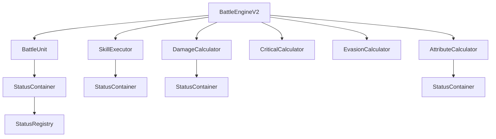
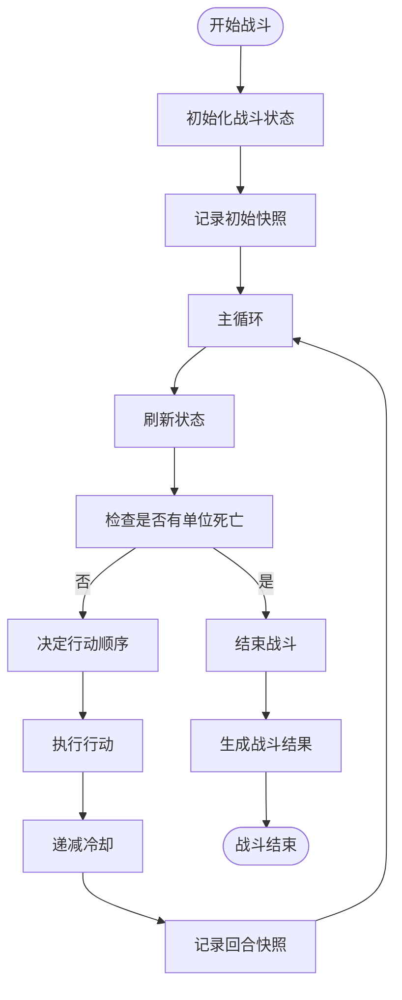
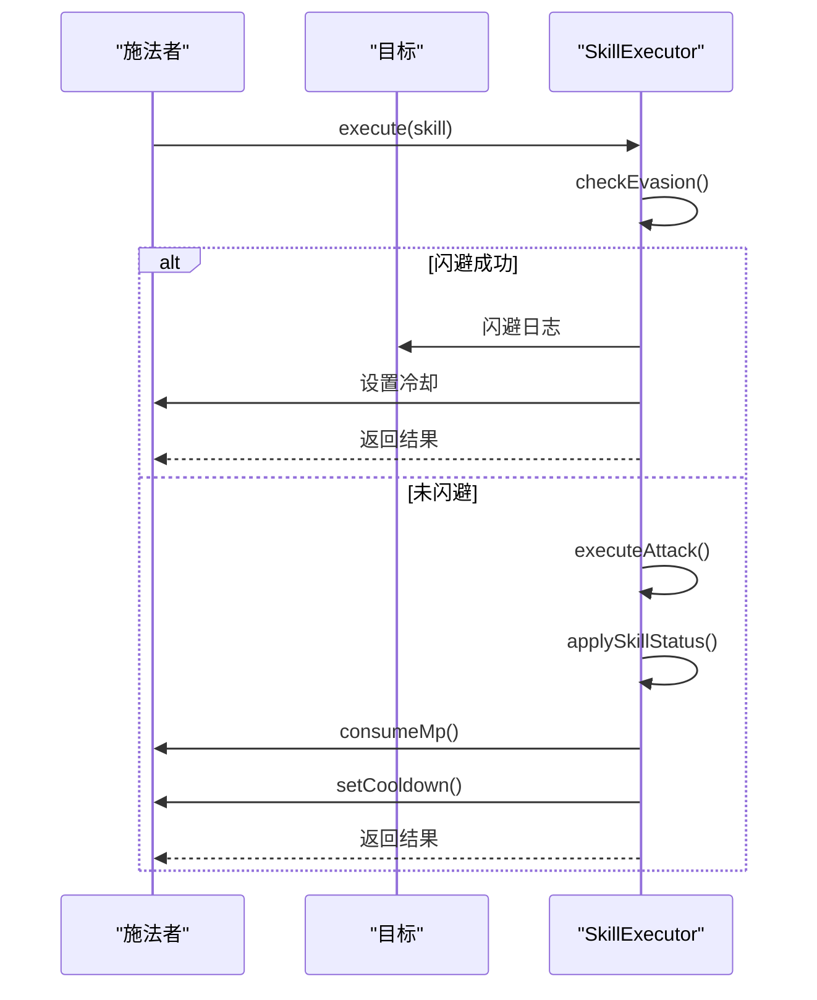
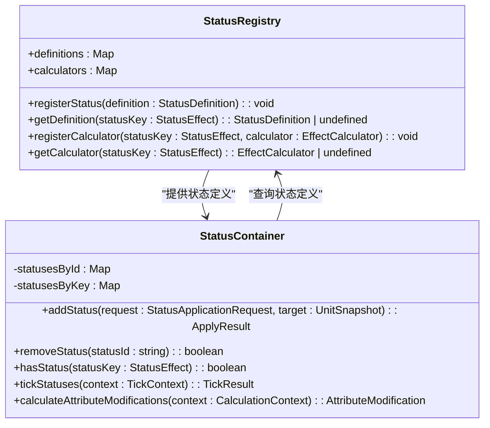

# 战斗引擎V2

<cite>
**本文档引用的文件**
- [BattleEngine.v2.ts](file://engine/battle/BattleEngine.v2.ts)
- [BattleUnit.ts](file://engine/battle/BattleUnit.ts)
- [SkillExecutor.ts](file://engine/battle/SkillExecutor.ts)
- [types.ts](file://engine/battle/types.ts)
- [DamageCalculator.ts](file://engine/battle/calculators/DamageCalculator.ts)
- [AttributeCalculator.ts](file://engine/battle/calculators/AttributeCalculator.ts)
- [CriticalCalculator.ts](file://engine/battle/calculators/CriticalCalculator.ts)
- [EvasionCalculator.ts](file://engine/battle/calculators/EvasionCalculator.ts)
- [StatusContainer.ts](file://engine/status/StatusContainer.ts)
- [StatusRegistry.ts](file://engine/status/StatusRegistry.ts)
- [types.ts](file://engine/status/types.ts)
- [route.ts](file://app/api/battle/route.ts)
- [cultivator.ts](file://types/cultivator.ts)
</cite>

## 目录
1. [简介](#简介)
2. [核心架构](#核心架构)
3. [战斗流程](#战斗流程)
4. [关键组件分析](#关键组件分析)
5. [状态系统](#状态系统)
6. [计算模块](#计算模块)
7. [API接口](#api接口)
8. [数据模型](#数据模型)
9. [结论](#结论)

## 简介

战斗引擎V2是本修仙游戏的核心战斗系统，采用模块化设计，集成了状态管理、属性计算、技能执行等复杂功能。该引擎负责处理玩家与对手之间的战斗模拟，包括回合制战斗、技能释放、状态效果、伤害计算等核心机制。引擎设计注重可扩展性和性能优化，通过状态容器和计算器模块实现了高度解耦的架构。

## 核心架构

战斗引擎V2采用面向对象的设计模式，以`BattleEngineV2`类为核心，协调多个子系统协同工作。整个系统围绕战斗单元（`BattleUnit`）展开，每个战斗单元都拥有独立的状态容器（`StatusContainer`），用于管理其所有临时和持久状态。



**图源**
- [BattleEngine.v2.ts](file://engine/battle/BattleEngine.v2.ts#L30-L487)
- [BattleUnit.ts](file://engine/battle/BattleUnit.ts#L17-L324)
- [StatusContainer.ts](file://engine/status/StatusContainer.ts#L26-L446)

## 战斗流程

战斗引擎V2的战斗流程遵循严格的回合制逻辑，每个回合包含多个阶段，确保战斗的公平性和可预测性。



**图源**
- [BattleEngine.v2.ts](file://engine/battle/BattleEngine.v2.ts#L45-L51)
- [BattleEngine.v2.ts](file://engine/battle/BattleEngine.v2.ts#L87-L149)

## 关键组件分析

### BattleEngineV2

`BattleEngineV2`是战斗引擎的主控制器，负责协调整个战斗流程。它通过`simulateBattle`方法启动战斗，该方法接受玩家和对手的修仙者数据作为输入，并返回完整的战斗结果。

**战斗状态接口**
```typescript
interface BattleState {
  player: BattleUnit;
  opponent: BattleUnit;
  turn: number;
  log: string[];
  timeline: TurnSnapshot[];
  maxTurns: number;
}
```

**战斗结果接口**
```typescript
interface BattleEngineResult {
  winner: Cultivator;
  loser: Cultivator;
  log: string[];
  turns: number;
  playerHp: number;
  opponentHp: number;
  timeline: TurnSnapshot[];
  playerPersistentStatuses?: Array<{
    statusKey: string;
    potency: number;
    createdAt: number;
    metadata: Record<string, unknown>;
  }>;
  opponentPersistentStatuses?: Array<{
    statusKey: string;
    potency: number;
    createdAt: number;
    metadata: Record<string, unknown>;
  }>;
}
```

**节源**
- [BattleEngine.v2.ts](file://engine/battle/BattleEngine.v2.ts#L17-L24)
- [types.ts](file://engine/battle/types.ts#L57-L81)

### BattleUnit

`BattleUnit`类封装了战斗中的单位状态，是战斗系统的核心数据结构。每个战斗单元都包含基础属性、动态属性、状态容器和技能冷却等信息。

**节源**
- [BattleUnit.ts](file://engine/battle/BattleUnit.ts#L17-L324)

### SkillExecutor

`SkillExecutor`负责执行技能逻辑，包括伤害、治疗、状态施加等。它通过`execute`方法处理不同类型的技能，并根据技能类型调用相应的执行方法。



**图源**
- [SkillExecutor.ts](file://engine/battle/SkillExecutor.ts#L34-L97)
- [SkillExecutor.ts](file://engine/battle/SkillExecutor.ts#L102-L142)

## 状态系统

战斗引擎V2的状态系统是其最复杂的部分之一，采用`StatusContainer`和`StatusRegistry`两个核心组件来管理所有状态。

### StatusContainer

`StatusContainer`负责管理单个角色的所有临时状态，包括状态的添加、移除、刷新和计算。它维护两个映射：`statusesById`和`statusesByKey`，分别按ID和Key索引状态。

**节源**
- [StatusContainer.ts](file://engine/status/StatusContainer.ts#L26-L446)

### StatusRegistry

`StatusRegistry`是状态注册表，维护所有状态的元信息，作为状态引擎的配置中心。它通过`registerStatus`方法注册状态定义，并通过`getDefinition`方法获取状态定义。



**图源**
- [StatusRegistry.ts](file://engine/status/StatusRegistry.ts#L13-L80)
- [StatusContainer.ts](file://engine/status/StatusContainer.ts#L26-L446)

## 计算模块

战斗引擎V2包含多个专门的计算器模块，用于处理不同的计算任务。

### DamageCalculator

`DamageCalculator`负责统一处理所有伤害计算，包括技能伤害、法宝伤害、元素加成等。其计算流程包括基础伤害、灵根加成、法宝加成、暴击判定和防御减伤。

**伤害计算流程**
1. 基础伤害 = 技能威力 × (1 + 灵力/150)
2. 灵根加成 = 基础伤害 × 灵根倍率
3. 法宝加成 = 伤害 × (1 + 法宝元素加成)
4. 暴击判定与倍率
5. 防御减伤

**节源**
- [DamageCalculator.ts](file://engine/battle/calculators/DamageCalculator.ts#L15-L72)

### CriticalCalculator

`CriticalCalculator`负责计算暴击概率和暴击伤害。暴击率的计算公式为：(悟性 - 40) / 200，状态修正包括锋锐状态(+0.15)和暴击压制(-0.15)。

**节源**
- [CriticalCalculator.ts](file://engine/battle/calculators/CriticalCalculator.ts#L13-L99)

### EvasionCalculator

`EvasionCalculator`负责计算闪避概率。基础闪避率为min(0.3, (速度 + 速度增益) / 350)，特殊情况下如眩晕或定身状态则无法闪避。

**节源**
- [EvasionCalculator.ts](file://engine/battle/calculators/EvasionCalculator.ts#L9-L110)

### AttributeCalculator

`AttributeCalculator`负责计算战斗单元的最终属性，包括基础属性、装备加成和状态修正。

**节源**
- [AttributeCalculator.ts](file://engine/battle/calculators/AttributeCalculator.ts#L9-L71)

## API接口

战斗引擎通过API接口与前端交互，主要接口位于`app/api/battle/route.ts`。

### POST /api/battle

该接口用于执行战斗并生成战斗播报，采用SSE流式输出。接口接收角色ID和敌人ID，返回战斗结果和播报。

**请求参数**
- cultivatorId: 玩家角色ID
- opponentId: 对手角色ID

**响应格式**
- type: 消息类型(start, battle_result, chunk, done, error)
- data: 战斗结果数据
- content: 战斗播报内容块

**节源**
- [route.ts](file://app/api/battle/route.ts#L15-L172)

## 数据模型

战斗引擎依赖于`Cultivator`数据模型，该模型定义了修仙者的完整数据结构。

### Cultivator接口

`Cultivator`接口包含修仙者的所有属性，包括基础信息、修为境界、属性、灵根、命格、功法、技能、装备等。

**核心属性**
- id: 角色ID
- name: 名称
- realm: 修为境界
- attributes: 基础属性(体魄、灵力、悟性、速度、神识)
- spiritual_roots: 灵根
- skills: 技能列表
- inventory: 背包
- equipped: 已装备物品

**节源**
- [cultivator.ts](file://types/cultivator.ts#L242-L282)

## 结论

战斗引擎V2是一个功能完整、架构清晰的回合制战斗系统。它通过模块化设计将复杂的战斗逻辑分解为多个独立的组件，提高了代码的可维护性和可扩展性。状态系统的引入使得战斗效果更加丰富多样，而专门的计算器模块确保了各种战斗机制的准确性和一致性。整体设计充分考虑了性能优化和错误处理，为游戏的稳定运行提供了坚实的基础。