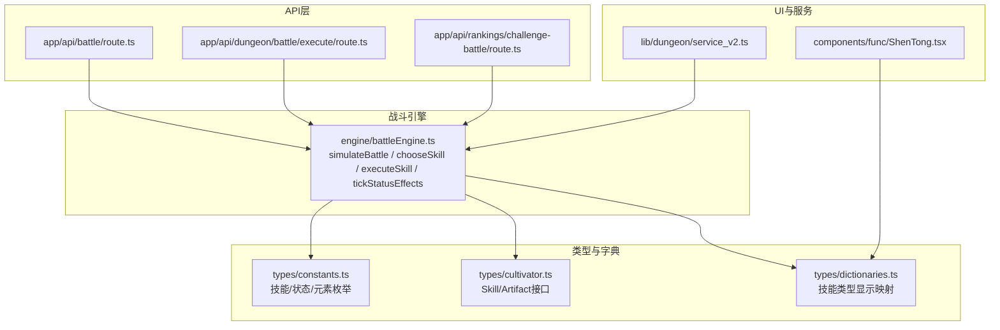
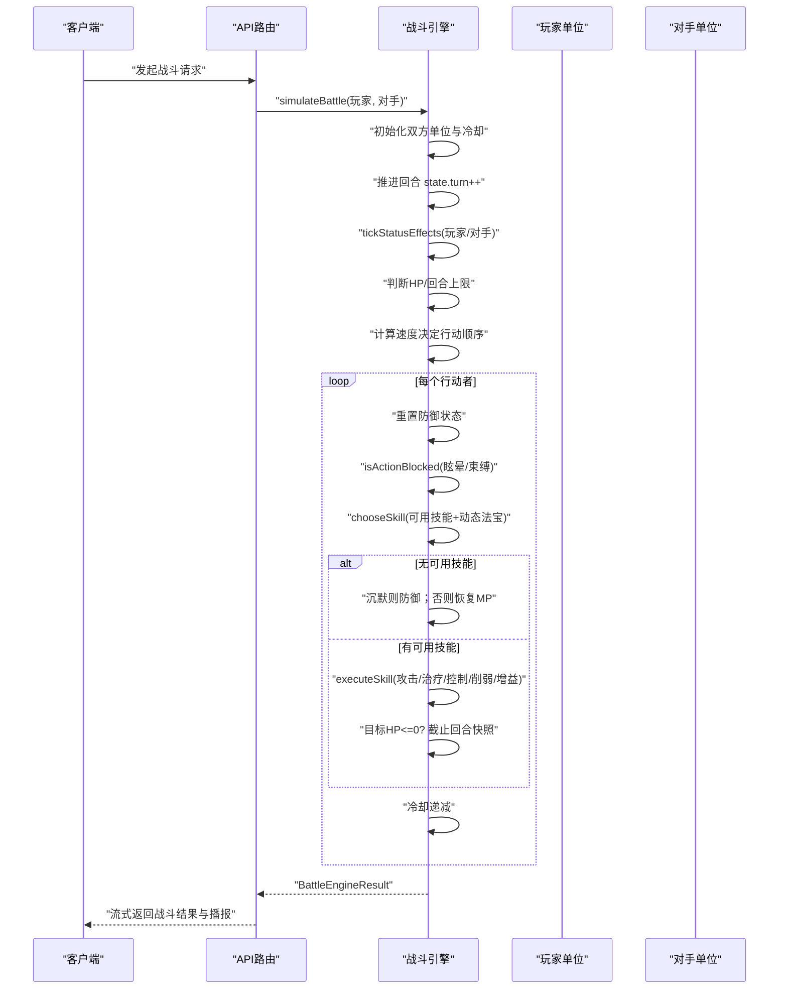
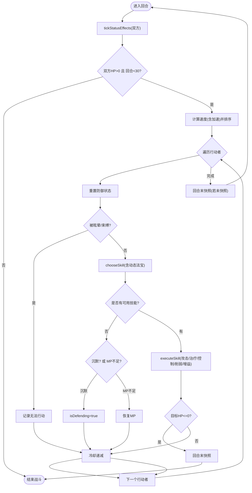
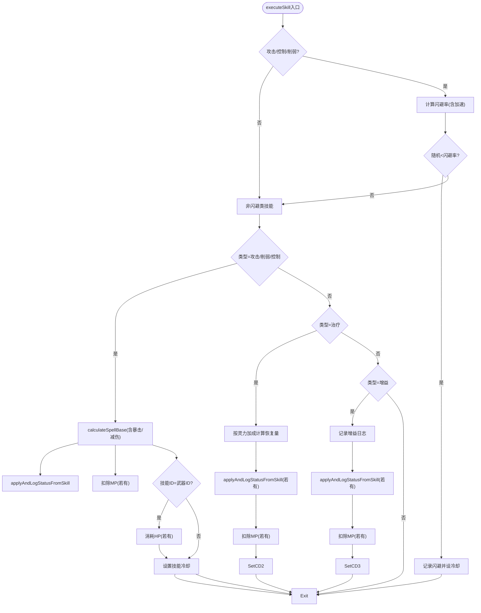
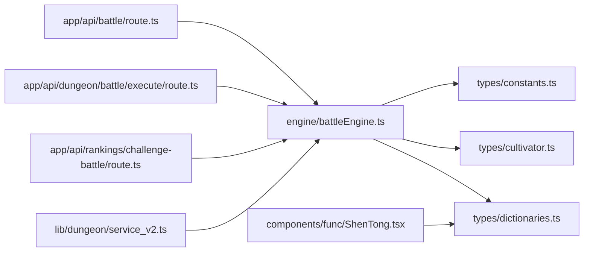

# 回合执行

<cite>
**本文引用的文件**
- [battleEngine.ts](file://engine/battleEngine.ts)
- [route.ts](file://app/api/battle/route.ts)
- [route.ts](file://app/api/dungeon/battle/execute/route.ts)
- [route.ts](file://app/api/rankings/challenge-battle/route.ts)
- [constants.ts](file://types/constants.ts)
- [cultivator.ts](file://types/cultivator.ts)
- [dictionaries.ts](file://types/dictionaries.ts)
- [ShenTong.tsx](file://components/func/ShenTong.tsx)
- [service_v2.ts](file://lib/dungeon/service_v2.ts)
</cite>

## 目录
1. [引言](#引言)
2. [项目结构](#项目结构)
3. [核心组件](#核心组件)
4. [架构总览](#架构总览)
5. [详细组件分析](#详细组件分析)
6. [依赖关系分析](#依赖关系分析)
7. [性能考量](#性能考量)
8. [故障排查指南](#故障排查指南)
9. [结论](#结论)
10. [附录](#附录)

## 引言
本文件聚焦于回合制战斗的“主循环”执行机制，围绕 simulateBattle 函数展开，系统解析以下关键流程与规则：
- 主循环的执行顺序：状态效果处理（tickStatusEffects）、行动顺序判定（基于速度属性）、技能选择（chooseSkill）与技能执行（executeSkill）。
- 攻击、防御、治疗、控制等不同类型技能的处理逻辑。
- 暴击、闪避、状态命中率的计算公式与来源。
- 法宝技能（Artifact Skill）的动态生成与使用。
- 战斗循环的终止条件（任一方HP归零或达到30回合上限）。
- 性能优化建议（例如避免不必要的状态检查）。

## 项目结构
与回合执行直接相关的代码主要集中在战斗引擎模块与API路由层：
- 战斗引擎：engine/battleEngine.ts 提供 simulateBattle、技能选择与执行、状态管理、伤害与治疗计算等核心逻辑。
- API路由：app/api/battle/route.ts、app/api/dungeon/battle/execute/route.ts、app/api/rankings/challenge-battle/route.ts 调用 simulateBattle 并将结果流式返回给前端。
- 类型与字典：types/constants.ts、types/cultivator.ts、types/dictionaries.ts 定义技能类型、状态效果、法宝效果等基础数据结构。
- UI展示：components/func/ShenTong.tsx 展示技能信息；lib/dungeon/service_v2.ts 在副本战斗结束后更新状态。

图表来源
- [battleEngine.ts](file://engine/battleEngine.ts#L674-L830)
- [route.ts](file://app/api/battle/route.ts#L72-L124)
- [route.ts](file://app/api/dungeon/battle/execute/route.ts#L43-L125)
- [route.ts](file://app/api/rankings/challenge-battle/route.ts#L150-L179)
- [constants.ts](file://types/constants.ts#L1-L212)
- [cultivator.ts](file://types/cultivator.ts#L89-L170)
- [dictionaries.ts](file://types/dictionaries.ts#L122-L178)
- [ShenTong.tsx](file://components/func/ShenTong.tsx#L55-L100)
- [service_v2.ts](file://lib/dungeon/service_v2.ts#L275-L311)

章节来源
- [battleEngine.ts](file://engine/battleEngine.ts#L674-L830)
- [route.ts](file://app/api/battle/route.ts#L72-L124)
- [route.ts](file://app/api/dungeon/battle/execute/route.ts#L43-L125)
- [route.ts](file://app/api/rankings/challenge-battle/route.ts#L150-L179)

## 核心组件
- simulateBattle：主循环入口，负责回合推进、状态处理、行动顺序、技能选择与执行、冷却递减、胜负判定与结果封装。
- tickStatusEffects：对双方单位的状态进行逐回合衰减与DOT伤害结算。
- chooseSkill：根据可用技能与当前状态，选择合适的技能（含动态生成的法宝主动技能）。
- executeSkill：按技能类型执行攻击/治疗/控制/削弱/增益，并处理闪避、状态命中、灵力消耗、法宝使用代价等。
- calculateSpellBase：基础法术伤害计算，包含暴击判定与减伤。
- calculateStatusHitChance：状态命中率计算。
- createArtifactSkill：动态生成法宝主动技能并附加可能的状态效果。

章节来源
- [battleEngine.ts](file://engine/battleEngine.ts#L207-L214)
- [battleEngine.ts](file://engine/battleEngine.ts#L233-L247)
- [battleEngine.ts](file://engine/battleEngine.ts#L249-L280)
- [battleEngine.ts](file://engine/battleEngine.ts#L286-L297)
- [battleEngine.ts](file://engine/battleEngine.ts#L316-L339)
- [battleEngine.ts](file://engine/battleEngine.ts#L518-L624)
- [battleEngine.ts](file://engine/battleEngine.ts#L626-L667)
- [battleEngine.ts](file://engine/battleEngine.ts#L674-L830)

## 架构总览
下面的序列图展示了从API调用到战斗结果返回的关键流程，以及主循环内的状态处理与行动顺序。

图表来源
- [route.ts](file://app/api/battle/route.ts#L72-L124)
- [route.ts](file://app/api/dungeon/battle/execute/route.ts#L43-L125)
- [battleEngine.ts](file://engine/battleEngine.ts#L674-L830)

## 详细组件分析

### 主循环与回合推进（simulateBattle）
- 初始化：为双方创建 BattleUnit，设置初始HP/MP、空状态集合、技能冷却（含武器冷却），并记录初始快照。
- 主循环条件：当双方HP均大于0且回合数小于30时继续。
- 每回合开始：
  - 状态处理：对双方调用 tickStatusEffects，DOT伤害结算与状态剩余回合递减。
  - 快照：若HP变化或回合结束，记录快照。
  - 行动顺序：基于最终速度（含加速状态）比较，决定先攻与后攻单位。
  - 行动阶段：对每个行动者执行以下步骤：
    - 重置 isDefending。
    - 若处于眩晕/束缚，则记录无法行动。
    - chooseSkill：从可用技能中挑选，优先考虑攻击/治疗/增益；若无可用技能，按沉默或MP耗尽分支处理。
    - executeSkill：执行技能，记录日志，必要时进行目标HP判定与快照。
    - 冷却递减：对所有技能冷却值减1。
- 结束条件：
  - 任一方HP<=0：立即终止并记录最终快照。
  - 回合数达到30：强制结束。
- 胜负判定：依据HP剩余与最终状态确定赢家与输家，并返回 BattleEngineResult。

图表来源
- [battleEngine.ts](file://engine/battleEngine.ts#L674-L830)

章节来源
- [battleEngine.ts](file://engine/battleEngine.ts#L674-L830)

### 状态效果处理（tickStatusEffects）
- 遍历单位状态，对剩余回合<=0的状态进行移除。
- 对 burn/bleed/poison 进行DOT伤害结算：基于基础生命参数、状态强度、施放者灵力与元素倍率计算伤害，应用防御减伤后扣血。
- 每个状态剩余回合-1，到期则删除。

章节来源
- [battleEngine.ts](file://engine/battleEngine.ts#L249-L280)
- [battleEngine.ts](file://engine/battleEngine.ts#L365-L392)

### 行动顺序判定（速度与先攻）
- 分别计算玩家与对手的最终速度（含 speed_up 加成）。
- 以速度高低决定行动顺序（先攻者先行动）。
- 先攻者行动结束后，后攻者行动。

章节来源
- [battleEngine.ts](file://engine/battleEngine.ts#L733-L743)

### 技能选择（chooseSkill）
- 可用技能来源：
  - 角色自带技能（需满足冷却与MP条件）。
  - 动态生成的法宝主动技能（仅当武器ID存在且可使用）。
- 选择策略：
  - 低血量优先治疗。
  - 当对手血量低于自身时优先攻击。
  - 否则优先攻击，最后考虑增益。
  - 若无可用技能，按沉默或MP耗尽分支处理。

章节来源
- [battleEngine.ts](file://engine/battleEngine.ts#L626-L667)
- [battleEngine.ts](file://engine/battleEngine.ts#L316-L339)

### 技能执行（executeSkill）
- 闪避判定（仅对攻击/控制/削弱类）：
  - 若目标处于眩晕/束缚，则无法闪避。
  - 闪避率上限0.3，与目标速度与加速状态有关。
  - 成功闪避则记录日志并设置技能冷却。
- 攻击/削弱/控制：
  - 使用 calculateSpellBase 计算基础伤害，包含灵力加成、根骨加成、元素倍率、法宝伤害加成、暴击判定与防御减伤。
  - 控制/削弱类若 power>0，按一定比例折算伤害。
- 治疗：
  - 目标由 target_self 决定（自身或敌方），按灵力加成计算恢复量，不超过最大HP。
- 增益：
  - 记录引导法力强化自身的日志。
- 状态判定：
  - 调用 applyAndLogStatusFromSkill，按技能效果与命中率施加状态。
- 灵力消耗：
  - 若技能有 cost，扣除相应MP。
- 法宝使用代价：
  - 当技能ID等于装备武器ID时，检查该法宝的 on_use_cost_hp 效果，消耗HP并记录日志。
- 冷却：
  - 设置技能冷却。

图表来源
- [battleEngine.ts](file://engine/battleEngine.ts#L518-L624)
- [battleEngine.ts](file://engine/battleEngine.ts#L179-L205)

章节来源
- [battleEngine.ts](file://engine/battleEngine.ts#L518-L624)
- [battleEngine.ts](file://engine/battleEngine.ts#L179-L205)

### 暴击、闪避、状态命中率
- 暴击率（calculateSpellBase 内部）：
  - 基于悟性计算基础暴击率，受 crit_rate_up/crit_rate_down 影响，限制在合理区间。
  - 暴击倍率固定，伤害按倍率计算。
- 闪避率（executeSkill 内部）：
  - 上限0.3，与目标速度及加速状态有关；眩晕/束缚状态下无法闪避。
- 状态命中率（calculateStatusHitChance）：
  - 基于技能power与目标willpower计算基础命中，再受目标willpower抗性影响，保证最小命中与最大命中。

章节来源
- [battleEngine.ts](file://engine/battleEngine.ts#L143-L149)
- [battleEngine.ts](file://engine/battleEngine.ts#L528-L549)
- [battleEngine.ts](file://engine/battleEngine.ts#L207-L214)

### 法宝技能（Artifact Skill）的动态生成与使用
- 动态生成：
  - createArtifactSkill 根据法宝品质与施放者willpower计算power与cost，固定冷却3回合。
  - 若法宝配置了 on_hit_add_effect，则附加状态效果，固定持续2回合，目标自体或敌方取决于效果类型。
- 使用：
  - chooseSkill 将动态生成的法宝技能加入可用技能池。
  - executeSkill 中，若技能ID等于装备武器ID，则检查法宝的 on_use_cost_hp 效果，消耗HP并记录日志。
- 属性加成：
  - getArtifactDamageBonus 会根据装备的武器/防具/饰品上的 damage_bonus 效果累加元素伤害加成。

章节来源
- [battleEngine.ts](file://engine/battleEngine.ts#L299-L306)
- [battleEngine.ts](file://engine/battleEngine.ts#L308-L315)
- [battleEngine.ts](file://engine/battleEngine.ts#L316-L339)
- [battleEngine.ts](file://engine/battleEngine.ts#L151-L177)
- [battleEngine.ts](file://engine/battleEngine.ts#L599-L620)

### 技能类型与状态效果
- 技能类型：attack/heal/control/debuff/buff，分别对应不同行为与日志描述。
- 状态效果：包括防御增减、速度增减、暴击率增减、控制（眩晕/沉默/束缚）、DOT（burn/bleed/poison）等。
- UI展示：ShenTong.tsx 展示技能类型图标、元素、威力、冷却、消耗、目标与状态效果。

章节来源
- [constants.ts](file://types/constants.ts#L17-L62)
- [dictionaries.ts](file://types/dictionaries.ts#L122-L178)
- [ShenTong.tsx](file://components/func/ShenTong.tsx#L55-L100)

## 依赖关系分析
- API路由依赖战斗引擎的 simulateBattle，将结果通过SSE流式返回。
- 战斗引擎依赖类型定义（技能、状态、元素、法宝效果）与工具函数（最终属性计算）。
- UI组件依赖字典映射以展示技能与状态效果。

图表来源
- [route.ts](file://app/api/battle/route.ts#L72-L124)
- [route.ts](file://app/api/dungeon/battle/execute/route.ts#L43-L125)
- [route.ts](file://app/api/rankings/challenge-battle/route.ts#L150-L179)
- [battleEngine.ts](file://engine/battleEngine.ts#L674-L830)
- [constants.ts](file://types/constants.ts#L1-L212)
- [cultivator.ts](file://types/cultivator.ts#L89-L170)
- [dictionaries.ts](file://types/dictionaries.ts#L122-L178)
- [ShenTong.tsx](file://components/func/ShenTong.tsx#L55-L100)
- [service_v2.ts](file://lib/dungeon/service_v2.ts#L275-L311)

章节来源
- [route.ts](file://app/api/battle/route.ts#L72-L124)
- [route.ts](file://app/api/dungeon/battle/execute/route.ts#L43-L125)
- [route.ts](file://app/api/rankings/challenge-battle/route.ts#L150-L179)
- [battleEngine.ts](file://engine/battleEngine.ts#L674-L830)
- [constants.ts](file://types/constants.ts#L1-L212)
- [cultivator.ts](file://types/cultivator.ts#L89-L170)
- [dictionaries.ts](file://types/dictionaries.ts#L122-L178)
- [ShenTong.tsx](file://components/func/ShenTong.tsx#L55-L100)
- [service_v2.ts](file://lib/dungeon/service_v2.ts#L275-L311)

## 性能考量
- 避免不必要的状态检查：
  - 在 executeSkill 中，仅对攻击/控制/削弱类进行闪避判定；对治疗/增益类直接跳过闪避。
  - applyAndLogStatusFromSkill 仅在技能配置了 effect 时进行状态判定，未配置时快速跳过。
- 冷却与可用性：
  - canUseSkill 在选择前过滤不可用技能，减少无效执行。
- DOT结算：
  - tickStatusEffects 仅对 burn/bleed/poison 进行DOT伤害结算，其他状态不参与DOT计算。
- 早停与快照：
  - 目标HP<=0时立即记录快照并提前退出，避免多余回合。
  - 回合结束时若未记录快照则统一记录一次，保证时间线完整性。

章节来源
- [battleEngine.ts](file://engine/battleEngine.ts#L518-L624)
- [battleEngine.ts](file://engine/battleEngine.ts#L286-L297)
- [battleEngine.ts](file://engine/battleEngine.ts#L249-L280)
- [battleEngine.ts](file://engine/battleEngine.ts#L791-L803)

## 故障排查指南
- 技能未生效：
  - 检查技能是否满足冷却与MP条件（canUseSkill）。
  - 检查状态命中率是否过低导致被抵抗。
- 无法行动：
  - 确认单位是否处于 stunsilence/root 状态。
- 闪避异常：
  - 检查目标速度与加速状态，确认未被眩晕/束缚。
- 法宝使用代价未触发：
  - 确认技能ID与装备武器ID一致，且法宝配置了 on_use_cost_hp 效果。
- 回合上限：
  - 模拟器在达到30回合时强制结束，检查是否存在异常的高回复/高防御状态导致拖回合。

章节来源
- [battleEngine.ts](file://engine/battleEngine.ts#L286-L297)
- [battleEngine.ts](file://engine/battleEngine.ts#L518-L624)
- [battleEngine.ts](file://engine/battleEngine.ts#L674-L830)

## 结论
simulateBattle 的主循环清晰地实现了回合制战斗的核心流程：状态逐回合衰减、基于速度的先攻判定、智能技能选择与执行、以及严格的胜负与回合上限判定。通过 calculateSpellBase、calculateStatusHitChance 等函数，系统提供了稳定的数值平衡；通过 createArtifactSkill 与 applyAndLogStatusFromSkill，实现了法宝技能的动态生成与状态效果的可配置化。配合API层的流式返回与UI展示，形成了完整的战斗体验闭环。

## 附录
- API调用与结果封装：
  - API路由调用 simulateBattle 并将 BattleEngineResult 通过SSE流式返回，同时生成战斗播报。
- 副本战斗回调：
  - 副本服务在战斗结束后更新状态并记录叙事文本。

章节来源
- [route.ts](file://app/api/battle/route.ts#L72-L124)
- [route.ts](file://app/api/dungeon/battle/execute/route.ts#L43-L125)
- [route.ts](file://app/api/rankings/challenge-battle/route.ts#L150-L179)
- [service_v2.ts](file://lib/dungeon/service_v2.ts#L275-L311)