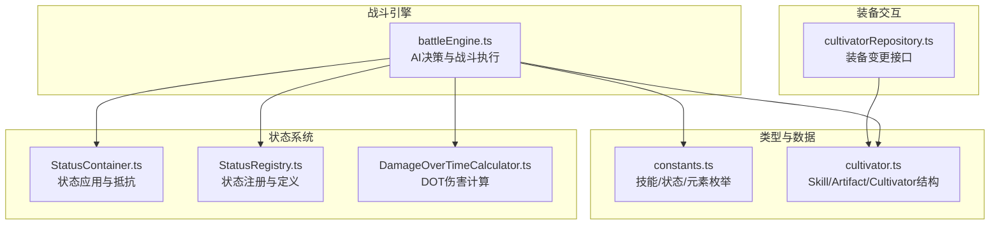
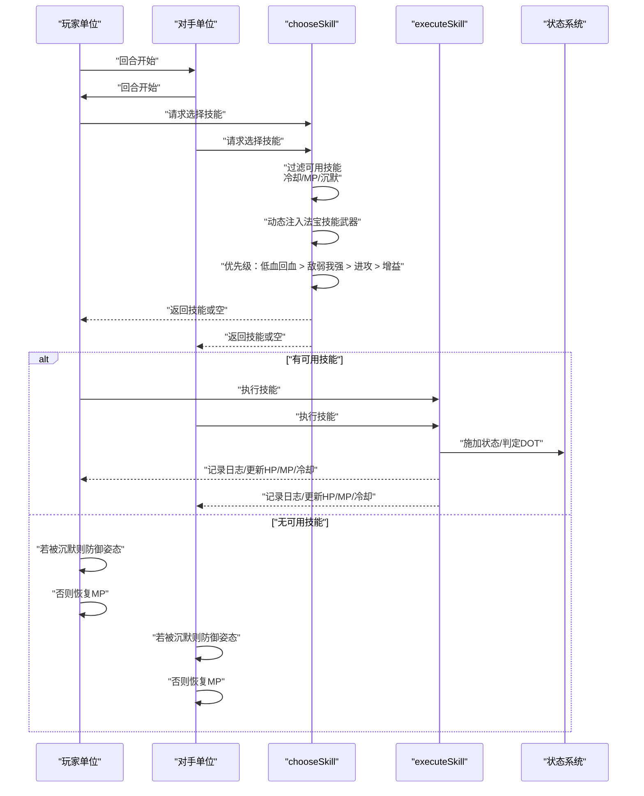
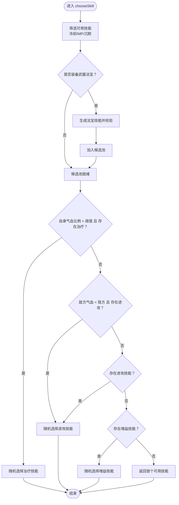
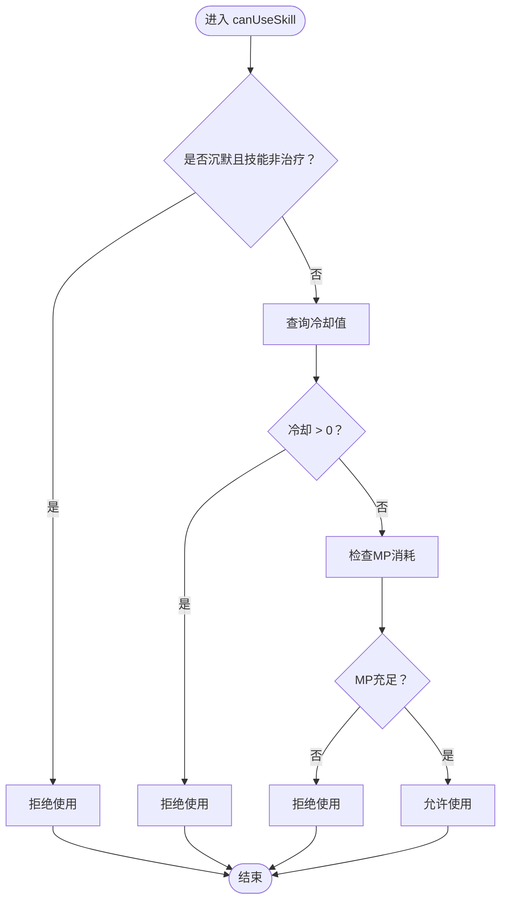
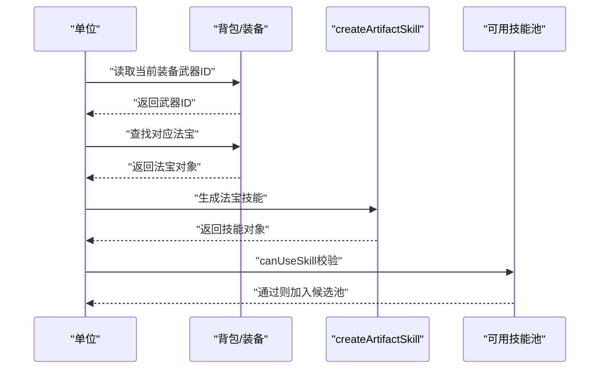
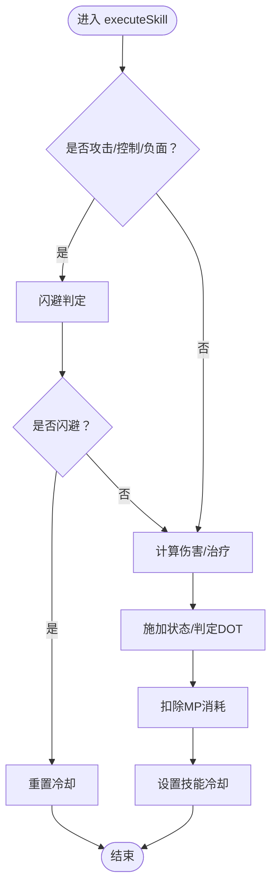
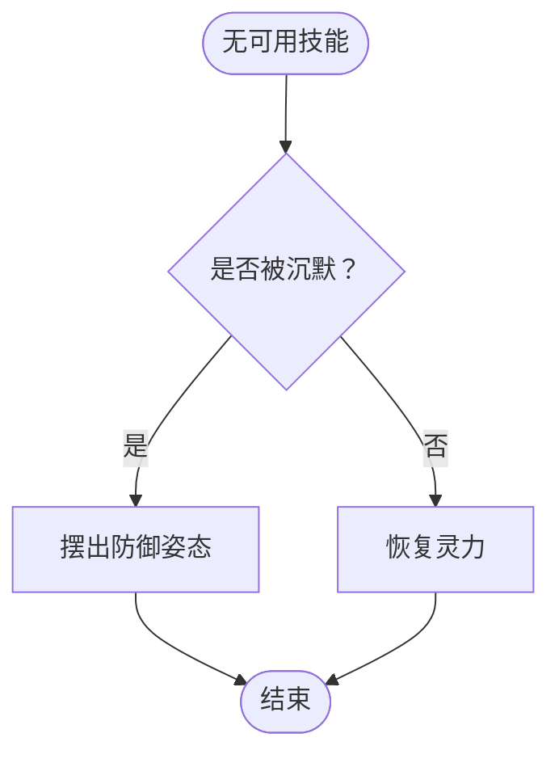
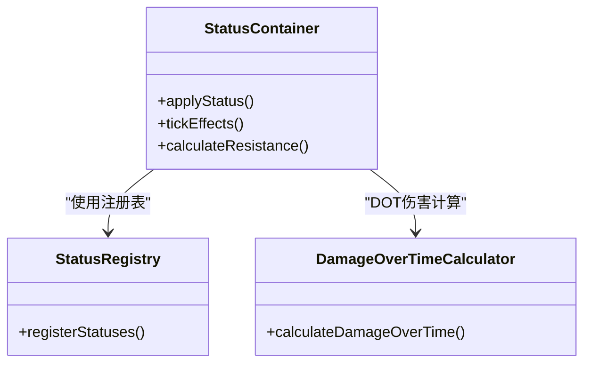
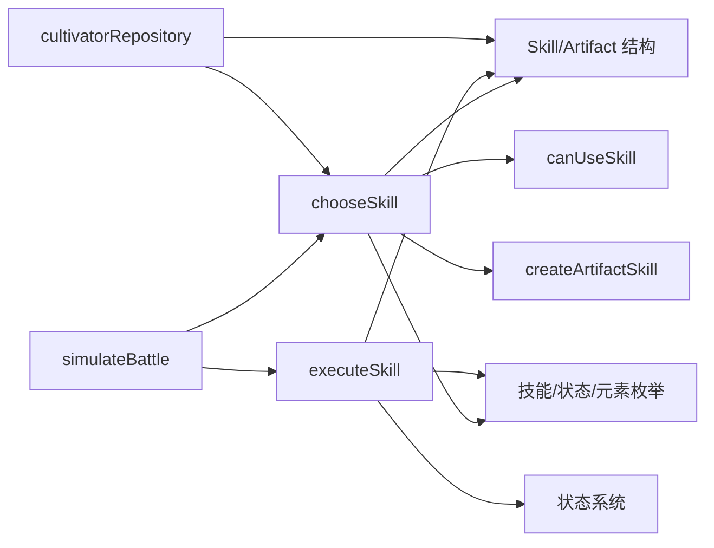

# 战斗策略决策

<cite>
**本文引用的文件**
- [engine/battleEngine.ts](file://engine/battleEngine.ts)
- [types/constants.ts](file://types/constants.ts)
- [types/cultivator.ts](file://types/cultivator.ts)
- [engine/status/StatusContainer.ts](file://engine/status/StatusContainer.ts)
- [engine/status/StatusRegistry.ts](file://engine/status/StatusRegistry.ts)
- [engine/status/calculators/DamageOverTimeCalculator.ts](file://engine/status/calculators/DamageOverTimeCalculator.ts)
- [lib/repositories/cultivatorRepository.ts](file://lib/repositories/cultivatorRepository.ts)
</cite>

## 目录
1. [引言](#引言)
2. [项目结构](#项目结构)
3. [核心组件](#核心组件)
4. [架构总览](#架构总览)
5. [详细组件分析](#详细组件分析)
6. [依赖关系分析](#依赖关系分析)
7. [性能考量](#性能考量)
8. [故障排查指南](#故障排查指南)
9. [结论](#结论)

## 引言
本文件围绕战斗AI的“技能选择”核心逻辑展开，重点解析 chooseSkill 函数的决策流程，并结合战斗引擎的可用性判断、状态系统、法宝动态注入机制以及沉默/灵力耗尽的应对策略，帮助读者全面理解AI在不同条件下的行为依据与执行路径。

## 项目结构
与战斗AI决策直接相关的代码主要集中在战斗引擎模块，同时涉及状态系统、类型定义与仓库层的装备交互。

图表来源
- [engine/battleEngine.ts](file://engine/battleEngine.ts#L1-L120)
- [engine/status/StatusContainer.ts](file://engine/status/StatusContainer.ts#L48-L78)
- [engine/status/StatusRegistry.ts](file://engine/status/StatusRegistry.ts#L179-L247)
- [engine/status/calculators/DamageOverTimeCalculator.ts](file://engine/status/calculators/DamageOverTimeCalculator.ts#L1-L54)
- [types/constants.ts](file://types/constants.ts#L1-L62)
- [types/cultivator.ts](file://types/cultivator.ts#L88-L171)
- [lib/repositories/cultivatorRepository.ts](file://lib/repositories/cultivatorRepository.ts#L1108-L1152)

章节来源
- [engine/battleEngine.ts](file://engine/battleEngine.ts#L1-L120)
- [types/constants.ts](file://types/constants.ts#L1-L62)
- [types/cultivator.ts](file://types/cultivator.ts#L88-L171)
- [engine/status/StatusContainer.ts](file://engine/status/StatusContainer.ts#L48-L78)
- [engine/status/StatusRegistry.ts](file://engine/status/StatusRegistry.ts#L179-L247)
- [engine/status/calculators/DamageOverTimeCalculator.ts](file://engine/status/calculators/DamageOverTimeCalculator.ts#L1-L54)
- [lib/repositories/cultivatorRepository.ts](file://lib/repositories/cultivatorRepository.ts#L1108-L1152)

## 核心组件
- chooseSkill：AI技能选择主函数，负责在可用技能池中按优先级挑选技能。
- canUseSkill：技能可用性判断，综合冷却、MP消耗、沉默限制。
- createArtifactSkill：将装备的武器类法宝动态转换为可选技能。
- executeSkill：技能执行流水线，包含命中/闪避、伤害/治疗、状态施加、MP消耗与冷却更新。
- simulateBattle：回合驱动与AI调度，包含沉默/MP耗尽的应对分支。

章节来源
- [engine/battleEngine.ts](file://engine/battleEngine.ts#L286-L340)
- [engine/battleEngine.ts](file://engine/battleEngine.ts#L518-L624)
- [engine/battleEngine.ts](file://engine/battleEngine.ts#L626-L667)
- [engine/battleEngine.ts](file://engine/battleEngine.ts#L754-L778)

## 架构总览
以下序列图展示AI在每回合的决策与执行流程，从技能可用性筛选到最终执行与冷却更新。

图表来源
- [engine/battleEngine.ts](file://engine/battleEngine.ts#L518-L624)
- [engine/battleEngine.ts](file://engine/battleEngine.ts#L626-L667)
- [engine/battleEngine.ts](file://engine/battleEngine.ts#L754-L778)

## 详细组件分析

### chooseSkill 决策流程
- 可用性筛选：基于 canUseSkill 过滤角色基础技能。
- 动态注入：若角色装备武器类法宝，则通过 createArtifactSkill 生成对应主动技能并再次校验可用性后加入候选池。
- 优先级策略：
  - 当自身气血比例低于阈值且存在治疗技能时，优先使用治疗。
  - 若敌方气血小于我方且存在进攻型技能，优先进攻。
  - 否则优先从进攻型技能中随机选择。
  - 若无进攻型技能，尝试从增益型技能中随机选择。
  - 若仍无可选，则返回第一个可用技能（通常为基础技能或动态注入的法宝技能）。

图表来源
- [engine/battleEngine.ts](file://engine/battleEngine.ts#L626-L667)

章节来源
- [engine/battleEngine.ts](file://engine/battleEngine.ts#L626-L667)

### 技能可用性判断 canUseSkill
- 沉默限制：若单位处于沉默且技能非治疗，则不可使用。
- 冷却状态：以技能ID为键查询冷却值，大于0则不可使用。
- MP消耗：若技能需要消耗灵力且当前灵力不足，则不可使用。
- 返回true表示技能可用。

图表来源
- [engine/battleEngine.ts](file://engine/battleEngine.ts#L286-L297)

章节来源
- [engine/battleEngine.ts](file://engine/battleEngine.ts#L286-L297)

### 法宝主动技能的动态注入机制
- 注入条件：仅当角色装备武器类法宝时生效。
- 生成规则：createArtifactSkill 将法宝的品质与属性转化为技能的威力、消耗与冷却，并可附加状态效果（如命中后附加状态或使用时消耗气血）。
- 加入策略：生成后再次通过 canUseSkill 校验，满足条件则加入候选池参与chooseSkill优先级选择。

图表来源
- [engine/battleEngine.ts](file://engine/battleEngine.ts#L316-L340)
- [engine/battleEngine.ts](file://engine/battleEngine.ts#L629-L641)

章节来源
- [engine/battleEngine.ts](file://engine/battleEngine.ts#L316-L340)
- [engine/battleEngine.ts](file://engine/battleEngine.ts#L629-L641)
- [types/cultivator.ts](file://types/cultivator.ts#L105-L171)

### 技能执行 executeSkill
- 命中/闪避：对攻击/控制/负面技能进行闪避判定，成功则重置冷却并结束。
- 伤害/治疗：根据技能类型计算伤害或治疗量，受属性、根系加成、减伤等影响。
- 状态施加：根据技能效果类型与目标，计算命中概率并施加状态，支持自身体质与敌方抗性。
- MP消耗与冷却：扣除技能消耗的灵力，并设置技能冷却回合数。
- 主动法宝特殊效果：若使用的是当前装备武器的法宝技能，将触发其“使用时消耗气血”等效果。

图表来源
- [engine/battleEngine.ts](file://engine/battleEngine.ts#L518-L624)

章节来源
- [engine/battleEngine.ts](file://engine/battleEngine.ts#L518-L624)

### 沉默与灵力耗尽的应对行为
- 沉默：若无法使用任何技能且单位处于沉默状态，则进入防御姿态。
- 灵力耗尽：若无法使用任何技能且未被沉默，则恢复一定比例的灵力（按最大灵力上限的比例计算）。

图表来源
- [engine/battleEngine.ts](file://engine/battleEngine.ts#L758-L777)

章节来源
- [engine/battleEngine.ts](file://engine/battleEngine.ts#L758-L777)

### 状态系统与DOT伤害
- 状态注册：状态类型、冲突与持续时间由注册表定义，战斗中按回合推进。
- DOT伤害：基于目标基础气血、状态强度与施放者灵力等参数计算，支持元素倍率与减伤修正。
- 抵抗判定：对负面与控制类状态，依据施放者神识与目标抗性计算抵抗概率。

图表来源
- [engine/status/StatusContainer.ts](file://engine/status/StatusContainer.ts#L48-L78)
- [engine/status/StatusRegistry.ts](file://engine/status/StatusRegistry.ts#L179-L247)
- [engine/status/calculators/DamageOverTimeCalculator.ts](file://engine/status/calculators/DamageOverTimeCalculator.ts#L1-L54)

章节来源
- [engine/status/StatusContainer.ts](file://engine/status/StatusContainer.ts#L48-L78)
- [engine/status/StatusRegistry.ts](file://engine/status/StatusRegistry.ts#L179-L247)
- [engine/status/calculators/DamageOverTimeCalculator.ts](file://engine/status/calculators/DamageOverTimeCalculator.ts#L1-L54)

### 类型与数据模型
- 技能类型与状态枚举：定义了技能类型（攻击/治疗/控制/负面/增益）、状态效果（如沉默、燃烧、流血、中毒等）与元素类型。
- 技能与法宝结构：技能包含ID、名称、类型、元素、威力、消耗、冷却、效果、持续时间与目标等字段；法宝包含槽位、元素、品质、特效与诅咒等。

章节来源
- [types/constants.ts](file://types/constants.ts#L1-L62)
- [types/cultivator.ts](file://types/cultivator.ts#L88-L171)

## 依赖关系分析
- chooseSkill 依赖 canUseSkill 与 createArtifactSkill，同时依赖技能类型与状态枚举。
- executeSkill 依赖状态系统（applyStatus、DOT伤害计算），并使用技能类型与状态枚举。
- simulateBattle 驱动回合流程，调用 chooseSkill 与 executeSkill，并处理冷却递减与胜负判定。
- 装备变更通过仓库层影响 chooseSkill 的候选池（动态注入法宝技能）。

图表来源
- [engine/battleEngine.ts](file://engine/battleEngine.ts#L286-L340)
- [engine/battleEngine.ts](file://engine/battleEngine.ts#L518-L624)
- [engine/battleEngine.ts](file://engine/battleEngine.ts#L626-L667)
- [lib/repositories/cultivatorRepository.ts](file://lib/repositories/cultivatorRepository.ts#L1108-L1152)

章节来源
- [engine/battleEngine.ts](file://engine/battleEngine.ts#L286-L340)
- [engine/battleEngine.ts](file://engine/battleEngine.ts#L518-L624)
- [engine/battleEngine.ts](file://engine/battleEngine.ts#L626-L667)
- [lib/repositories/cultivatorRepository.ts](file://lib/repositories/cultivatorRepository.ts#L1108-L1152)

## 性能考量
- chooseSkill 的过滤与分组操作为线性扫描，复杂度与技能数量线性相关；动态注入法宝技能在每回合进行一次，整体开销可控。
- executeSkill 的状态施加与DOT计算在每次技能命中后发生，建议避免在同一回合内产生过多状态叠加。
- simulateBattle 的冷却递减遍历所有技能冷却键值，回合数固定上限，总体复杂度稳定。

## 故障排查指南
- 无可用技能：
  - 检查是否被沉默：若被沉默，AI将进入防御姿态；若非沉默，AI将恢复灵力。
  - 检查MP消耗：确保技能的cost字段与单位当前MP匹配。
  - 检查冷却：确认技能ID与冷却映射正确，冷却递减逻辑正常。
- 法宝技能未出现：
  - 确认角色已装备武器类法宝，且该法宝具备主动技能效果。
  - 确认 canUseSkill 对生成的法宝技能进行了二次校验并通过。
- 状态未生效：
  - 检查 applyStatus 的冲突与重复叠加规则。
  - 检查 applyAndLogStatusFromSkill 的命中概率与目标选择。
- DOT伤害异常：
  - 检查 DamageOverTimeCalculator 的参数与元素倍率。
  - 检查状态注册表中的默认持续时间与最大堆叠。

章节来源
- [engine/battleEngine.ts](file://engine/battleEngine.ts#L758-L777)
- [engine/battleEngine.ts](file://engine/battleEngine.ts#L286-L297)
- [engine/battleEngine.ts](file://engine/battleEngine.ts#L518-L624)
- [engine/status/StatusContainer.ts](file://engine/status/StatusContainer.ts#L48-L78)
- [engine/status/StatusRegistry.ts](file://engine/status/StatusRegistry.ts#L179-L247)
- [engine/status/calculators/DamageOverTimeCalculator.ts](file://engine/status/calculators/DamageOverTimeCalculator.ts#L1-L54)

## 结论
本AI决策围绕“低血优先回血、敌弱我强优先进攻、无进攻时优先增益”的优先级策略，并通过 canUseSkill 严格约束技能可用性，结合 createArtifactSkill 实现武器类法宝的动态注入。在沉默或灵力耗尽时，AI分别采取防御姿态与恢复灵力的稳健策略，确保战斗流程的稳定性与可预测性。状态系统的注册与DOT伤害计算进一步完善了战斗的战术深度。