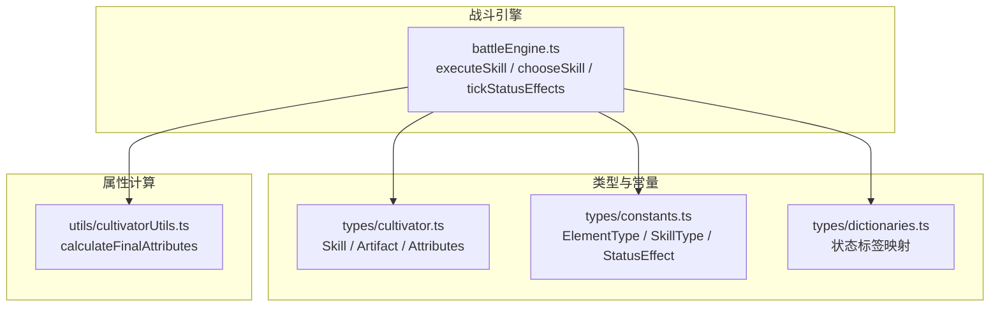
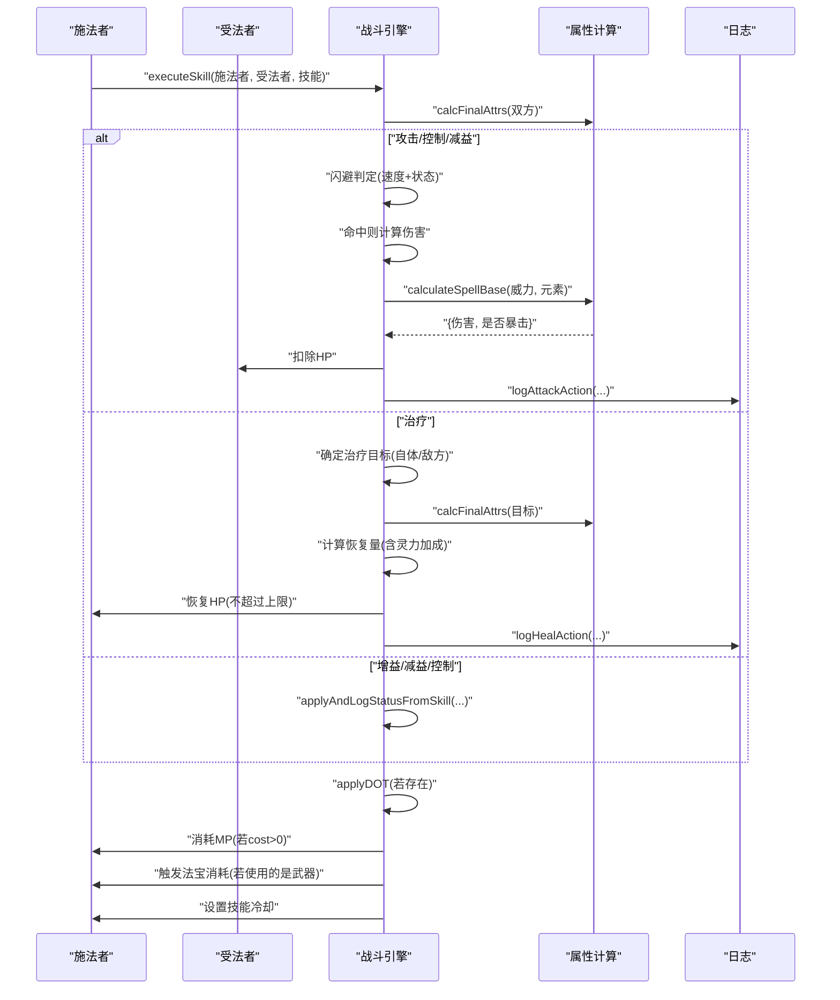
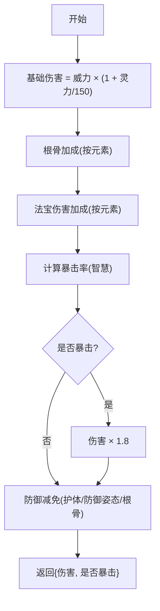
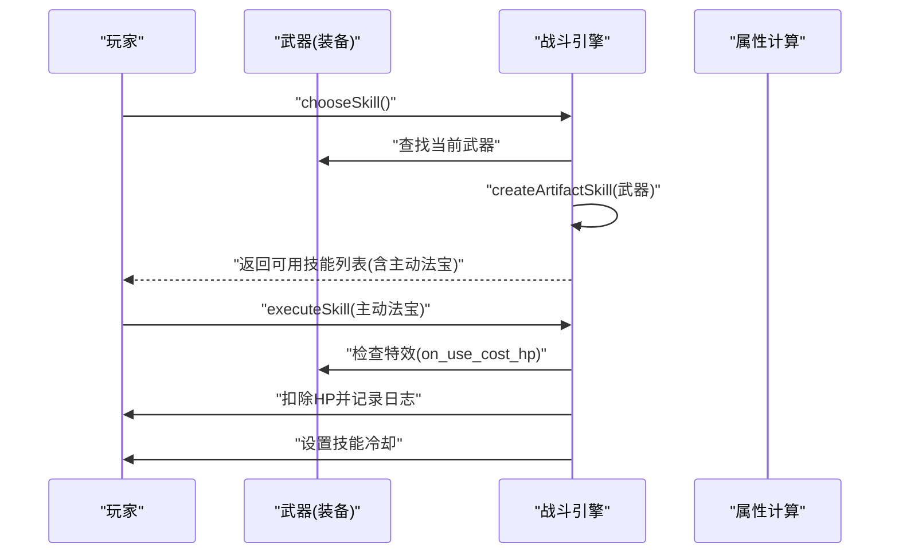
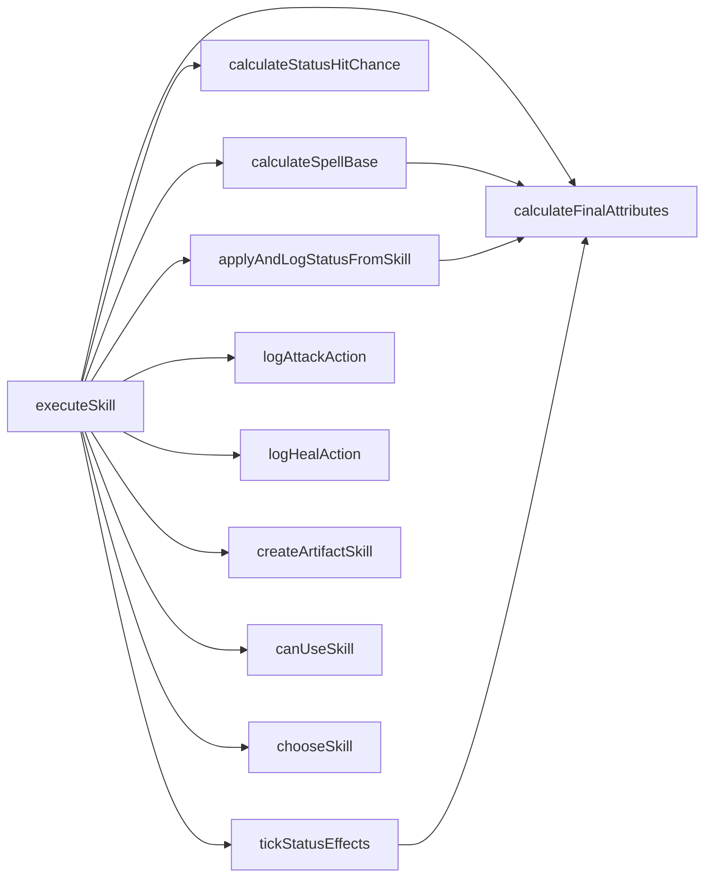

# 技能执行逻辑

<cite>
**本文引用的文件**
- [engine/battleEngine.ts](file://engine/battleEngine.ts)
- [types/cultivator.ts](file://types/cultivator.ts)
- [types/constants.ts](file://types/constants.ts)
- [types/dictionaries.ts](file://types/dictionaries.ts)
- [utils/cultivatorUtils.ts](file://utils/cultivatorUtils.ts)
</cite>

## 目录
1. [引言](#引言)
2. [项目结构](#项目结构)
3. [核心组件](#核心组件)
4. [架构总览](#架构总览)
5. [详细组件分析](#详细组件分析)
6. [依赖关系分析](#依赖关系分析)
7. [性能考量](#性能考量)
8. [故障排查指南](#故障排查指南)
9. [结论](#结论)
10. [附录](#附录)

## 引言
本文件围绕战斗引擎中的“技能执行机制”展开，重点解析 executeSkill 函数的实现逻辑，并系统阐述以下内容：
- 攻击、防御、治疗、控制、增益/减益等不同类型的技能处理流程
- 伤害计算公式：基础伤害、灵力加成、根骨加成、法宝加成、暴击判定（基于智慧属性）、最终伤害减免（基于防御力与状态效果）
- 治疗技能的恢复量计算方式
- 控制类技能的命中率算法（基于技能威力与目标意志力）
- 法宝主动技能（Artifact Skill）的动态生成与使用过程：冷却设置、灵力消耗、特殊效果触发（如使用法宝时消耗精血）
- 技能执行后的状态更新与日志记录机制

## 项目结构
战斗系统的核心位于 engine/battleEngine.ts，围绕该文件构建了完整的技能执行流水线，包括：
- 技能选择与可用性判断
- 伤害/治疗/控制/增益/减益的分支处理
- 状态效果的施加与持续伤害（DOT）处理
- 法宝主动技能的动态生成与触发
- 日志记录与回放快照

图表来源
- [engine/battleEngine.ts](file://engine/battleEngine.ts#L1-L120)
- [types/cultivator.ts](file://types/cultivator.ts#L88-L171)
- [types/constants.ts](file://types/constants.ts#L1-L62)
- [types/dictionaries.ts](file://types/dictionaries.ts#L172-L244)
- [utils/cultivatorUtils.ts](file://utils/cultivatorUtils.ts#L51-L194)

章节来源
- [engine/battleEngine.ts](file://engine/battleEngine.ts#L1-L120)
- [types/cultivator.ts](file://types/cultivator.ts#L88-L171)
- [types/constants.ts](file://types/constants.ts#L1-L62)
- [types/dictionaries.ts](file://types/dictionaries.ts#L172-L244)
- [utils/cultivatorUtils.ts](file://utils/cultivatorUtils.ts#L51-L194)

## 核心组件
- executeSkill：技能执行主入口，负责闪避判定、伤害/治疗/控制/增益/减益分支、状态施加、灵力消耗、法宝消耗、冷却计算
- calculateSpellBase：法术基础伤害计算，含灵力加成、根骨加成、法宝加成、暴击判定、防御减免
- calculateStatusHitChance：控制/减益命中率计算，基于技能威力与目标意志力
- applyAndLogStatusFromSkill：根据技能配置施加状态，含自体/敌方目标判定、持续回合、命中判定
- tickStatusEffects：持续状态（DOT）每回合处理与移除
- createArtifactSkill：将装备的武器动态转换为“主动法宝技能”，并附带可能的状态效果
- canUseSkill/chooseSkill：技能可用性与AI选择逻辑
- logAttackAction/logHealAction：攻击/治疗日志格式化

章节来源
- [engine/battleEngine.ts](file://engine/battleEngine.ts#L179-L205)
- [engine/battleEngine.ts](file://engine/battleEngine.ts#L207-L214)
- [engine/battleEngine.ts](file://engine/battleEngine.ts#L233-L247)
- [engine/battleEngine.ts](file://engine/battleEngine.ts#L249-L280)
- [engine/battleEngine.ts](file://engine/battleEngine.ts#L316-L340)
- [engine/battleEngine.ts](file://engine/battleEngine.ts#L286-L297)
- [engine/battleEngine.ts](file://engine/battleEngine.ts#L394-L432)
- [engine/battleEngine.ts](file://engine/battleEngine.ts#L518-L624)

## 架构总览
下面的序列图展示了 executeSkill 的关键调用链与状态流转：

图表来源
- [engine/battleEngine.ts](file://engine/battleEngine.ts#L518-L624)
- [engine/battleEngine.ts](file://engine/battleEngine.ts#L179-L205)
- [engine/battleEngine.ts](file://engine/battleEngine.ts#L394-L432)
- [engine/battleEngine.ts](file://engine/battleEngine.ts#L452-L516)
- [engine/battleEngine.ts](file://engine/battleEngine.ts#L249-L280)
- [utils/cultivatorUtils.ts](file://utils/cultivatorUtils.ts#L51-L194)

## 详细组件分析

### executeSkill：技能执行主流程
- 输入：施法者、受法者、技能、战斗状态
- 关键步骤：
  - 闪避判定：仅对攻击/控制/减益生效；眩晕/定身状态下不可闪避；速度越高闪避率越高，上限30%；若闪避成功，施法者获得冷却
  - 分支处理：
    - 攻击：调用 calculateSpellBase 计算伤害，整数向下取整，扣减对方HP，记录攻击日志
    - 控制/减益：若威力>0，则按70%威力计算伤害；否则仅记录尝试扭转战局的日志
    - 治疗：确定目标（自体或敌方），按技能威力×(1+施法者灵力/160)计算恢复量，不超过目标最大HP
    - 增益：记录引导强化自身日志
  - 状态施加：调用 applyAndLogStatusFromSkill，按技能 effect 配置施加状态，含自体/敌方目标、持续回合、命中判定
  - 灵力消耗：若技能 cost>0，从施法者MP中扣除
  - 法宝消耗：若技能ID等于施法者当前武器ID，则遍历该法宝的特效，若存在“使用时消耗气血”效果，则从施法者HP中扣除对应数值
  - 冷却计算：将技能冷却设置到施法者的技能冷却表

章节来源
- [engine/battleEngine.ts](file://engine/battleEngine.ts#L518-L624)

### calculateSpellBase：法术伤害计算
- 基础伤害：技能威力 × (1 + 施法者灵力/150)
- 根骨加成：按施法者对应元素的根骨强度提供额外倍率
- 法宝加成：遍历已装备的武器/护具/饰品，汇总同元素 damage_bonus 的加成倍率
- 暴击判定：基于施法者智慧属性，计算暴击率上下限，随机判定是否暴击，暴击倍率1.8
- 最终减免：按受法者防御倍率计算，含护体增益/减益、防御姿态、根骨抗性等

图表来源
- [engine/battleEngine.ts](file://engine/battleEngine.ts#L179-L205)
- [engine/battleEngine.ts](file://engine/battleEngine.ts#L124-L141)
- [engine/battleEngine.ts](file://engine/battleEngine.ts#L151-L177)
- [engine/battleEngine.ts](file://engine/battleEngine.ts#L143-L149)

章节来源
- [engine/battleEngine.ts](file://engine/battleEngine.ts#L179-L205)
- [engine/battleEngine.ts](file://engine/battleEngine.ts#L124-L141)
- [engine/battleEngine.ts](file://engine/battleEngine.ts#L151-L177)
- [engine/battleEngine.ts](file://engine/battleEngine.ts#L143-L149)

### calculateStatusHitChance：控制/减益命中率
- 基础命中：min(0.8, max(0.2, 技能威力/2.5/100))
- 抗性修正：受法者意志力带来的抵抗系数 min(0.7, 意志力/3000)
- 最终命中：max(0.2, 基础命中 × (1 - 抵抗))

章节来源
- [engine/battleEngine.ts](file://engine/battleEngine.ts#L207-L214)

### applyAndLogStatusFromSkill：状态施加与日志
- 若技能未配置 effect 或为未知 effect，记录警告并跳过
- 自体/敌方目标判定：buff 类或 target_self=true 时施加于施法者；否则施加于受法者
- 命中判定：若命中则施加状态，记录“陷入状态”日志；若已存在同类异常状态则无法叠加
- 持续回合：buff 默认2回合，control 默认1回合，其他类型由技能 duration 指定

章节来源
- [engine/battleEngine.ts](file://engine/battleEngine.ts#L452-L516)

### 持续状态（DOT）处理：tickStatusEffects
- 遍历单位状态，对 burn/bleed/poison 进行每回合伤害计算
- DOT 伤害构成：基础HP相关项、状态强度、施法者灵力、元素倍率、防御减免
- 每回合减少剩余回合，<=0 删除状态

章节来源
- [engine/battleEngine.ts](file://engine/battleEngine.ts#L249-L280)
- [engine/battleEngine.ts](file://engine/battleEngine.ts#L365-L392)

### 法宝主动技能（Artifact Skill）：动态生成与使用
- 动态生成：createArtifactSkill 将武器转换为“主动法宝技能”，属性由武器品质与施法者意志力决定，固定冷却3回合
- 特殊效果：若武器附带 on_hit_add_effect，可将该效果作为技能 effect，自动设置持续回合与目标自体/敌方
- 使用触发：executeSkill 在施法者使用武器ID对应的技能时，遍历该武器的特效列表，若存在“on_use_cost_hp”，则从施法者HP中扣除相应数值，并记录日志
- 技能选择：chooseSkill 会在可用技能中加入该主动法宝技能（若可用）

图表来源
- [engine/battleEngine.ts](file://engine/battleEngine.ts#L316-L340)
- [engine/battleEngine.ts](file://engine/battleEngine.ts#L599-L620)
- [engine/battleEngine.ts](file://engine/battleEngine.ts#L626-L667)

章节来源
- [engine/battleEngine.ts](file://engine/battleEngine.ts#L316-L340)
- [engine/battleEngine.ts](file://engine/battleEngine.ts#L599-L620)
- [engine/battleEngine.ts](file://engine/battleEngine.ts#L626-L667)

### 治疗技能：恢复量计算
- 目标：若 target_self=false 则治疗受法者，否则治疗施法者
- 恢复量：技能威力 × (1 + 施法者灵力/160)，向下取整
- 上限：不超过目标最大HP

章节来源
- [engine/battleEngine.ts](file://engine/battleEngine.ts#L577-L585)

### 技能可用性与AI选择：canUseSkill / chooseSkill
- 可用性：不能在沉默状态下使用非治疗技能；技能冷却必须为0；MP需满足 cost
- AI选择：优先考虑低血量时的治疗、对己方优势时的进攻、无进攻时的增益；若无可选技能，沉默则防御，否则恢复MP

章节来源
- [engine/battleEngine.ts](file://engine/battleEngine.ts#L286-L297)
- [engine/battleEngine.ts](file://engine/battleEngine.ts#L626-L667)

## 依赖关系分析
- executeSkill 依赖：
  - calculateFinalAttributes：获取双方最终属性
  - calculateSpellBase：计算伤害
  - calculateStatusHitChance：控制/减益命中
  - applyAndLogStatusFromSkill：施加状态
  - tickStatusEffects：DOT处理
  - logAttackAction/logHealAction：日志
  - createArtifactSkill：动态生成法宝技能
  - canUseSkill/chooseSkill：技能选择
- 数据模型依赖：
  - Skill、Artifact、Attributes 定义来自 types/cultivator.ts
  - 元素、技能类型、状态效果来自 types/constants.ts
  - 状态标签映射来自 types/dictionaries.ts

图表来源
- [engine/battleEngine.ts](file://engine/battleEngine.ts#L179-L205)
- [engine/battleEngine.ts](file://engine/battleEngine.ts#L207-L214)
- [engine/battleEngine.ts](file://engine/battleEngine.ts#L233-L247)
- [engine/battleEngine.ts](file://engine/battleEngine.ts#L249-L280)
- [engine/battleEngine.ts](file://engine/battleEngine.ts#L394-L432)
- [engine/battleEngine.ts](file://engine/battleEngine.ts#L316-L340)
- [engine/battleEngine.ts](file://engine/battleEngine.ts#L286-L297)
- [engine/battleEngine.ts](file://engine/battleEngine.ts#L626-L667)
- [utils/cultivatorUtils.ts](file://utils/cultivatorUtils.ts#L51-L194)

章节来源
- [engine/battleEngine.ts](file://engine/battleEngine.ts#L179-L205)
- [engine/battleEngine.ts](file://engine/battleEngine.ts#L207-L214)
- [engine/battleEngine.ts](file://engine/battleEngine.ts#L233-L247)
- [engine/battleEngine.ts](file://engine/battleEngine.ts#L249-L280)
- [engine/battleEngine.ts](file://engine/battleEngine.ts#L394-L432)
- [engine/battleEngine.ts](file://engine/battleEngine.ts#L316-L340)
- [engine/battleEngine.ts](file://engine/battleEngine.ts#L286-L297)
- [engine/battleEngine.ts](file://engine/battleEngine.ts#L626-L667)
- [utils/cultivatorUtils.ts](file://utils/cultivatorUtils.ts#L51-L194)

## 性能考量
- 计算复杂度：executeSkill 主要为 O(1) 操作，状态处理按单位状态数量线性增长
- 随机性：闪避、暴击、命中均使用随机数，建议在模拟战斗时可注入种子以保证可重复性
- 冷却与状态：冷却表与状态表为 Map 结构，操作均为 O(1)，整体开销可控
- DOT 计算：每回合对每个单位的状态进行一次遍历，建议在状态较多时关注 tickStatusEffects 的调用频率

[本节为通用性能讨论，无需列出具体文件来源]

## 故障排查指南
- 技能未生效：
  - 检查技能是否被沉默阻止（非治疗技能）
  - 检查冷却是否大于0
  - 检查 MP 是否不足
- 控制/减益未命中：
  - 受法者意志力过高导致命中率偏低
  - 技能威力过低
- 治疗无效：
  - 治疗量为0或受法者HP已达上限
- 法宝消耗未触发：
  - 技能ID必须与当前武器ID一致才会触发“使用时消耗气血”
- DOT 未造成伤害：
  - DOT 伤害需满足最小阈值，且受防御减免影响

章节来源
- [engine/battleEngine.ts](file://engine/battleEngine.ts#L286-L297)
- [engine/battleEngine.ts](file://engine/battleEngine.ts#L207-L214)
- [engine/battleEngine.ts](file://engine/battleEngine.ts#L577-L585)
- [engine/battleEngine.ts](file://engine/battleEngine.ts#L599-L620)
- [engine/battleEngine.ts](file://engine/battleEngine.ts#L365-L392)

## 结论
executeSkill 将“攻击/治疗/控制/增益/减益”五类技能统一在一个清晰的执行框架内，通过 calculateSpellBase、calculateStatusHitChance、applyAndLogStatusFromSkill、tickStatusEffects 等模块化函数，实现了完整的伤害计算、状态施加与DOT处理。同时，通过 createArtifactSkill 与 canUseSkill/chooseSkill 的配合，实现了法宝主动技能的动态生成与智能使用。日志系统贯穿全流程，便于调试与回放。

[本节为总结性内容，无需列出具体文件来源]

## 附录

### 数据模型与类型要点
- 技能 Skill：包含 id、name、type、element、grade、power、cost、cooldown、effect、duration、target_self 等字段
- 法宝 Artifact：包含 id、name、slot、element、quality、required_realm、bonus、special_effects、curses 等字段
- 属性 Attributes：vitality、spirit、wisdom、speed、willpower
- 状态效果 StatusEffect：包含 buff/debuff/control/DOT 等

章节来源
- [types/cultivator.ts](file://types/cultivator.ts#L88-L171)
- [types/cultivator.ts](file://types/cultivator.ts#L205-L252)
- [types/constants.ts](file://types/constants.ts#L1-L62)
- [types/dictionaries.ts](file://types/dictionaries.ts#L172-L244)