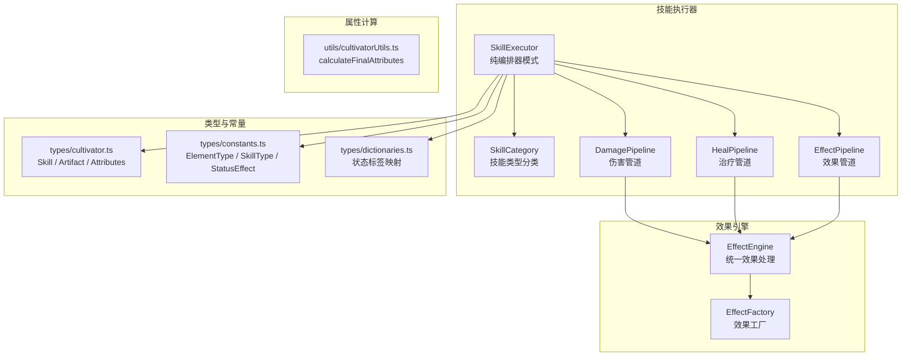
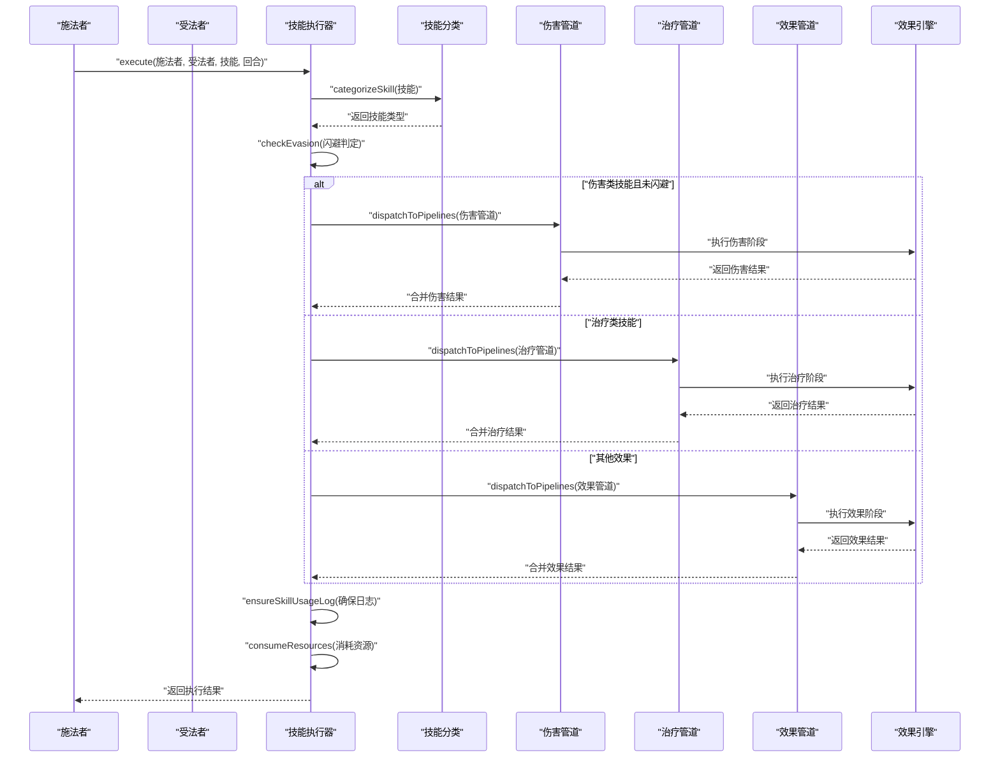
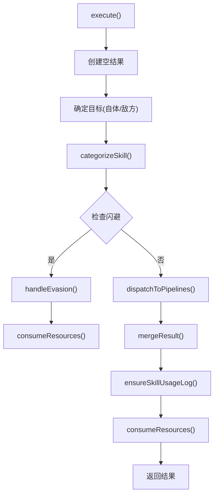
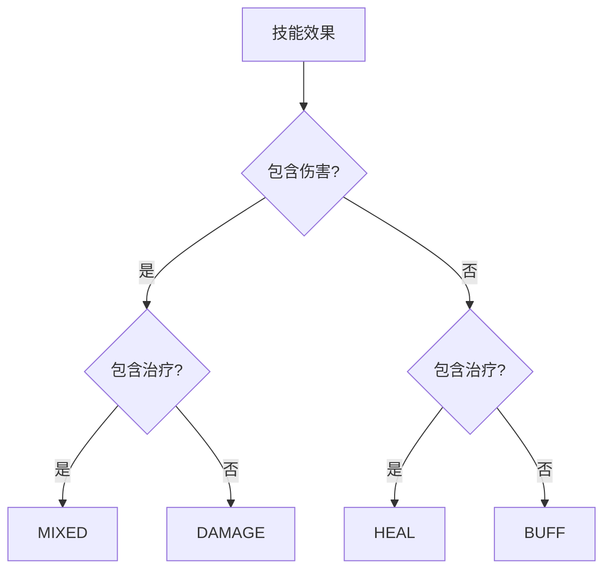
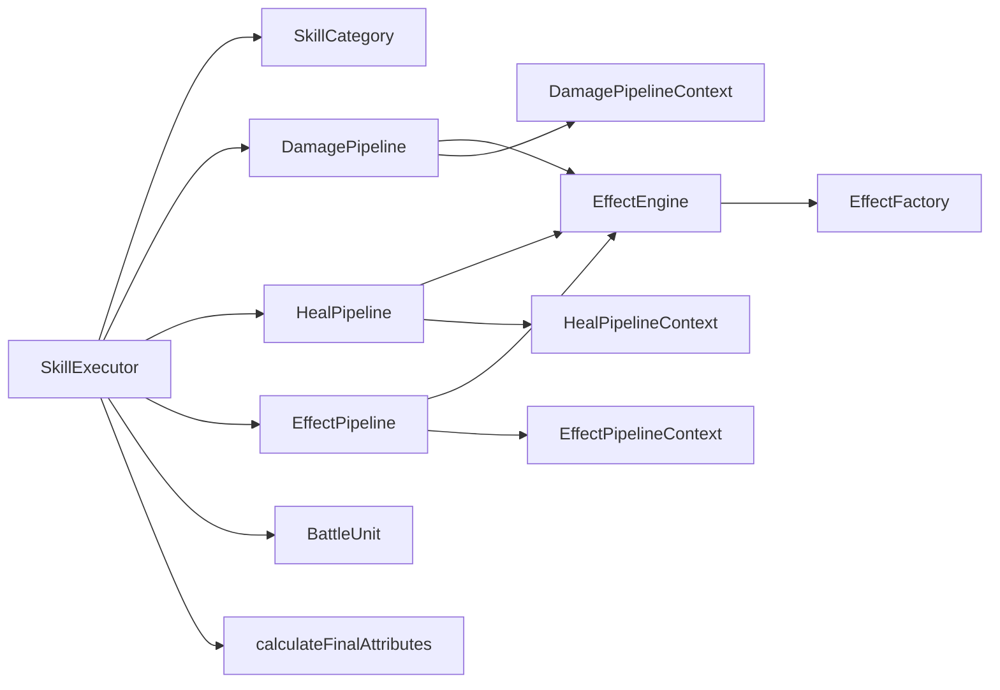

# 技能执行逻辑

<cite>
**本文引用的文件**
- [engine/battle/SkillExecutor.ts](file://engine/battle/SkillExecutor.ts)
- [engine/battle/pipeline/DamagePipeline.ts](file://engine/battle/pipeline/DamagePipeline.ts)
- [engine/battle/pipeline/HealPipeline.ts](file://engine/battle/pipeline/HealPipeline.ts)
- [engine/battle/pipeline/EffectPipeline.ts](file://engine/battle/pipeline/EffectPipeline.ts)
- [engine/battle/pipeline/types.ts](file://engine/battle/pipeline/types.ts)
- [engine/battle/pipeline/stages/damage/BaseDamageStage.ts](file://engine/battle/pipeline/stages/damage/BaseDamageStage.ts)
- [engine/battle/pipeline/stages/effect/ExecuteEffectStage.ts](file://engine/battle/pipeline/stages/effect/ExecuteEffectStage.ts)
- [engine/battle/BattleEngine.v2.ts](file://engine/battle/BattleEngine.v2.ts)
- [engine/battle/types.ts](file://engine/battle/types.ts)
- [engine/effect/EffectEngine.ts](file://engine/effect/EffectEngine.ts)
- [types/cultivator.ts](file://types/cultivator.ts)
- [types/constants.ts](file://types/constants.ts)
- [types/dictionaries.ts](file://types/dictionaries.ts)
- [utils/cultivatorUtils.ts](file://utils/cultivatorUtils.ts)
</cite>

## 更新摘要
**变更内容**
- 技能执行器从473行的复杂实现重构为178行的纯编排器模式
- 新增技能类型分类(SkillCategory)系统，支持DAMAGE、HEAL、BUFF、MIXED四种类型
- 引入管道分发机制，将具体效果处理委托给DamagePipeline、HealPipeline和EffectPipeline
- 新增阶段化的管道架构，每个管道包含多个有序执行的阶段
- 采用EffectEngine统一处理所有效果，实现更好的可扩展性和维护性

## 目录
1. [引言](#引言)
2. [项目结构](#项目结构)
3. [核心组件](#核心组件)
4. [架构总览](#架构总览)
5. [详细组件分析](#详细组件分析)
6. [依赖关系分析](#依赖关系分析)
7. [性能考量](#性能考量)
8. [故障排查指南](#故障排查指南)
9. [结论](#结论)
10. [附录](#附录)

## 引言
本文件围绕战斗引擎中的"技能执行机制"展开，重点解析重构后的SkillExecutor类的实现逻辑。新架构完全采用纯编排器模式，将技能执行分为三个专门的管道，通过EffectEngine统一处理所有效果，实现了更好的模块化和可扩展性。本文系统阐述以下内容：
- 技能类型分类与管道分发机制
- 攻击、防御、治疗、控制、增益/减益等不同类型技能的处理流程
- 伤害计算公式：基础伤害、灵力加成、根骨加成、法宝加成、暴击判定（基于智慧属性）、最终伤害减免（基于防御力与状态效果）
- 治疗技能的恢复量计算方式
- 控制类技能的命中率算法（基于技能威力与目标意志力）
- 法宝主动技能（Artifact Skill）的动态生成与使用过程：冷却设置、灵力消耗、特殊效果触发（如使用法宝时消耗精血）
- 技能执行后的状态更新与日志记录机制

## 项目结构
战斗系统的核心位于engine/battle目录，重构后的架构采用管道编排器模式：
- SkillExecutor.ts：纯编排器，负责技能分类、闪避判定、管道分发和资源消耗
- pipeline/目录：包含三个专用管道，每个管道负责特定类型的效果处理
- effect/目录：统一的效果处理引擎，所有效果都通过EffectEngine执行
- BattleEngine.v2.ts：战斗引擎主控制器，协调整个战斗流程

**图表来源**
- [engine/battle/SkillExecutor.ts](file://engine/battle/SkillExecutor.ts#L54-L90)
- [engine/battle/pipeline/DamagePipeline.ts](file://engine/battle/pipeline/DamagePipeline.ts#L29-L81)
- [engine/battle/pipeline/HealPipeline.ts](file://engine/battle/pipeline/HealPipeline.ts#L20-L69)
- [engine/battle/pipeline/EffectPipeline.ts](file://engine/battle/pipeline/EffectPipeline.ts#L18-L70)
- [engine/effect/EffectEngine.ts](file://engine/effect/EffectEngine.ts#L24-L138)

**章节来源**
- [engine/battle/SkillExecutor.ts](file://engine/battle/SkillExecutor.ts#L1-L320)
- [engine/battle/pipeline/DamagePipeline.ts](file://engine/battle/pipeline/DamagePipeline.ts#L1-L81)
- [engine/battle/pipeline/HealPipeline.ts](file://engine/battle/pipeline/HealPipeline.ts#L1-L69)
- [engine/battle/pipeline/EffectPipeline.ts](file://engine/battle/pipeline/EffectPipeline.ts#L1-L70)
- [engine/effect/EffectEngine.ts](file://engine/effect/EffectEngine.ts#L1-L138)

## 核心组件
- **SkillExecutor**：纯编排器，负责技能分类、闪避判定、管道分发、资源消耗和日志管理
- **SkillCategory**：技能类型枚举，支持DAMAGE、HEAL、BUFF、MIXED四种类型
- **DamagePipeline**：伤害管道，处理物理伤害、真实伤害等伤害效果
- **HealPipeline**：治疗管道，处理治疗效果和治疗增益
- **EffectPipeline**：通用效果管道，处理增益、控制、驱散等其他效果
- **EffectEngine**：统一效果处理引擎，所有效果都通过此引擎执行
- **calculateSpellBase**：法术基础伤害计算，含灵力加成、根骨加成、法宝加成、暴击判定、防御减免
- **calculateStatusHitChance**：控制/减益命中率计算，基于技能威力与目标意志力
- **applyAndLogStatusFromSkill**：根据技能配置施加状态，含自体/敌方目标判定、持续回合、命中判定
- **tickStatusEffects**：持续状态（DOT）每回合处理与移除
- **createArtifactSkill**：将装备的武器动态转换为"主动法宝技能"，并附带可能的状态效果
- **canUseSkill/chooseSkill**：技能可用性与AI选择逻辑
- **logAttackAction/logHealAction**：攻击/治疗日志格式化

**章节来源**
- [engine/battle/SkillExecutor.ts](file://engine/battle/SkillExecutor.ts#L54-L320)
- [engine/battle/pipeline/DamagePipeline.ts](file://engine/battle/pipeline/DamagePipeline.ts#L29-L81)
- [engine/battle/pipeline/HealPipeline.ts](file://engine/battle/pipeline/HealPipeline.ts#L20-L69)
- [engine/battle/pipeline/EffectPipeline.ts](file://engine/battle/pipeline/EffectPipeline.ts#L18-L70)
- [engine/effect/EffectEngine.ts](file://engine/effect/EffectEngine.ts#L24-L138)

## 架构总览
下面的序列图展示了重构后executeSkill的关键调用链与状态流转：

**图表来源**
- [engine/battle/SkillExecutor.ts](file://engine/battle/SkillExecutor.ts#L58-L90)
- [engine/battle/SkillExecutor.ts](file://engine/battle/SkillExecutor.ts#L99-L112)
- [engine/battle/SkillExecutor.ts](file://engine/battle/SkillExecutor.ts#L121-L177)
- [engine/battle/pipeline/DamagePipeline.ts](file://engine/battle/pipeline/DamagePipeline.ts#L70-L79)
- [engine/battle/pipeline/HealPipeline.ts](file://engine/battle/pipeline/HealPipeline.ts#L58-L67)
- [engine/battle/pipeline/EffectPipeline.ts](file://engine/battle/pipeline/EffectPipeline.ts#L52-L68)

## 详细组件分析

### SkillExecutor：纯编排器模式
**更新** 重构为178行的纯编排器，完全分离职责

- **输入**：施法者、受法者、技能、当前回合数
- **核心职责**：
  - 技能类型分类：根据技能效果自动识别DAMAGE、HEAL、BUFF、MIXED
  - 闪避判定：仅对伤害类技能生效，考虑眩晕/定身状态
  - 管道分发：将技能效果按类型分发到对应管道处理
  - 结果合并：收集各管道执行结果并合并
  - 资源管理：消耗MP、设置冷却时间
  - 日志管理：确保技能使用日志的完整性

**图表来源**
- [engine/battle/SkillExecutor.ts](file://engine/battle/SkillExecutor.ts#L58-L90)
- [engine/battle/SkillExecutor.ts](file://engine/battle/SkillExecutor.ts#L99-L112)
- [engine/battle/SkillExecutor.ts](file://engine/battle/SkillExecutor.ts#L212-L249)

**章节来源**
- [engine/battle/SkillExecutor.ts](file://engine/battle/SkillExecutor.ts#L54-L320)

### 技能类型分类：SkillCategory
**新增** 新增技能类型枚举系统

- **DAMAGE**：包含伤害效果（含真实伤害）的技能
- **HEAL**：包含治疗效果的技能  
- **BUFF**：包含增益效果但不含伤害/治疗的技能
- **MIXED**：同时包含伤害和治疗效果的技能

**图表来源**
- [engine/battle/SkillExecutor.ts](file://engine/battle/SkillExecutor.ts#L99-L112)

**章节来源**
- [engine/battle/SkillExecutor.ts](file://engine/battle/SkillExecutor.ts#L28-L35)
- [engine/battle/SkillExecutor.ts](file://engine/battle/SkillExecutor.ts#L99-L112)

### 管道分发机制
**新增** 基于技能类型的管道分发系统

- **伤害管道**：处理Damage和TrueDamage效果
- **治疗管道**：处理Heal效果  
- **效果管道**：处理其他所有效果（AddBuff、ManaDrain、Dispel等）
- **触发过滤**：只处理ON_SKILL_HIT类型的触发

**章节来源**
- [engine/battle/SkillExecutor.ts](file://engine/battle/SkillExecutor.ts#L121-L177)

### DamagePipeline：伤害管道
**更新** 采用阶段化处理，支持伤害计算的完整流程

- **阶段顺序**：
  1. BaseDamageStage：计算基础伤害
  2. BeforeDamageStage：调用EffectEngine处理暴击/减伤/护盾/斩杀
  3. ApplyDamageStage：应用伤害
  4. AfterDamageStage：调用EffectEngine处理吸血/反伤等后续效果

- **错误处理**：每个阶段都有独立的错误捕获和日志记录

**章节来源**
- [engine/battle/pipeline/DamagePipeline.ts](file://engine/battle/pipeline/DamagePipeline.ts#L16-L81)
- [engine/battle/pipeline/stages/damage/BaseDamageStage.ts](file://engine/battle/pipeline/stages/damage/BaseDamageStage.ts#L14-L75)

### HealPipeline：治疗管道
**更新** 采用阶段化处理，支持治疗计算的完整流程

- **阶段顺序**：
  1. BaseHealStage：计算基础治疗量
  2. BeforeHealStage：调用EffectEngine处理治疗增益
  3. ApplyHealStage：应用治疗

**章节来源**
- [engine/battle/pipeline/HealPipeline.ts](file://engine/battle/pipeline/HealPipeline.ts#L11-L69)

### EffectPipeline：通用效果管道
**新增** 专门处理非伤害/治疗效果的管道

- **默认阶段**：ExecuteEffectStage，执行任意效果配置
- **适用效果**：AddBuff、ManaDrain、Dispel、ModifyHitRate等

**章节来源**
- [engine/battle/pipeline/EffectPipeline.ts](file://engine/battle/pipeline/EffectPipeline.ts#L11-L70)
- [engine/battle/pipeline/stages/effect/ExecuteEffectStage.ts](file://engine/battle/pipeline/stages/effect/ExecuteEffectStage.ts#L9-L43)

### EffectEngine：统一效果处理引擎
**更新** 采用新的EffectEngine架构

- **统一接口**：所有效果都通过process()方法执行
- **触发时机**：支持ON_SKILL_HIT、ON_BEFORE_DAMAGE、ON_AFTER_DAMAGE等多种触发时机
- **效果收集**：自动收集来源和目标实体的所有相关效果
- **排序执行**：按优先级排序后依次执行效果

**章节来源**
- [engine/effect/EffectEngine.ts](file://engine/effect/EffectEngine.ts#L24-L138)

### calculateSpellBase：法术伤害计算
- **基础伤害**：技能威力 × (1 + 施法者灵力/150)
- **根骨加成**：按施法者对应元素的根骨强度提供额外倍率
- **法宝加成**：遍历已装备的武器/护具/饰品，汇总同元素 damage_bonus 的加成倍率
- **暴击判定**：基于施法者智慧属性，计算暴击率上下限，随机判定是否暴击，暴击倍率1.8
- **最终减免**：按受法者防御倍率计算，含护体增益/减益、防御姿态、根骨抗性等

**图表来源**
- [engine/battle/types.ts](file://engine/battle/types.ts#L75-L97)
- [engine/battle/types.ts](file://engine/battle/types.ts#L133-L147)

**章节来源**
- [engine/battle/types.ts](file://engine/battle/types.ts#L75-L97)
- [engine/battle/types.ts](file://engine/battle/types.ts#L133-L147)

### calculateStatusHitChance：控制/减益命中率
- **基础命中**：min(0.8, max(0.2, 技能威力/2.5/100))
- **抗性修正**：受法者意志力带来的抵抗系数 min(0.7, 意志力/3000)
- **最终命中**：max(0.2, 基础命中 × (1 - 抵抗))

**章节来源**
- [engine/battle/types.ts](file://engine/battle/types.ts#L108-L113)

### applyAndLogStatusFromSkill：状态施加与日志
- 若技能未配置 effect 或为未知 effect，记录警告并跳过
- 自体/敌方目标判定：buff 类或 target_self=true 时施加于施法者；否则施加于受法者
- 命中判定：若命中则施加状态，记录"陷入状态"日志；若已存在同类异常状态则无法叠加
- 持续回合：buff 默认2回合，control 默认1回合，其他类型由技能 duration 指定

**章节来源**
- [engine/battle/BattleEngine.v2.ts](file://engine/battle/BattleEngine.v2.ts#L398-L437)

### 持续状态（DOT）处理：tickStatusEffects
- 遍历单位状态，对 burn/bleed/poison 进行每回合伤害计算
- DOT 伤害构成：基础HP相关项、状态强度、施法者灵力、元素倍率、防御减免
- 每回合减少剩余回合，<=0 删除状态

**章节来源**
- [engine/battle/BattleEngine.v2.ts](file://engine/battle/BattleEngine.v2.ts#L208-L220)

### 法宝主动技能（Artifact Skill）：动态生成与使用
- **动态生成**：createArtifactSkill 将武器转换为"主动法宝技能"，属性由武器品质与施法者意志力决定，固定冷却3回合
- **特殊效果**：若武器附带 on_hit_add_effect，可将该效果作为技能 effect，自动设置持续回合与目标自体/敌方
- **使用触发**：executeSkill 在施法者使用武器ID对应的技能时，遍历该武器的特效列表，若存在"on_use_cost_hp"，则从施法者HP中扣除相应数值，并记录日志
- **技能选择**：chooseSkill 会在可用技能中加入该主动法宝技能（若可用）

**章节来源**
- [engine/battle/BattleEngine.v2.ts](file://engine/battle/BattleEngine.v2.ts#L289-L358)

### 治疗技能：恢复量计算
- **目标**：若 target_self=false 则治疗受法者，否则治疗施法者
- **恢复量**：技能威力 × (1 + 施法者灵力/160)，向下取整
- **上限**：不超过目标最大HP

**章节来源**
- [engine/battle/BattleEngine.v2.ts](file://engine/battle/BattleEngine.v2.ts#L419-L421)

### 技能可用性与AI选择：canUseSkill / chooseSkill
- **可用性**：不能在沉默状态下使用非治疗技能；技能冷却必须为0；MP需满足 cost
- **AI选择**：优先考虑低血量时的治疗、对己方优势时的进攻、无进攻时的增益；若无可选技能，沉默则防御，否则恢复MP

**章节来源**
- [engine/battle/BattleEngine.v2.ts](file://engine/battle/BattleEngine.v2.ts#L289-L358)

## 依赖关系分析
**更新** 重构后的依赖关系更加清晰和模块化

- **SkillExecutor 依赖**：
  - SkillCategory：技能类型分类
  - DamagePipeline/HealPipeline/EffectPipeline：管道分发
  - EffectEngine：统一效果处理
  - EffectFactory：效果实例创建
  - BattleUnit：战斗单位操作
  - calculateFinalAttributes：获取双方最终属性

- **管道依赖**：
  - EffectEngine：所有管道都依赖统一的效果处理
  - EffectFactory：创建具体效果实例
  - PipelineContext：管道上下文传递

- **数据模型依赖**：
  - Skill、Artifact、Attributes 定义来自 types/cultivator.ts
  - 元素、技能类型、状态效果来自 types/constants.ts
  - 状态标签映射来自 types/dictionaries.ts

**图表来源**
- [engine/battle/SkillExecutor.ts](file://engine/battle/SkillExecutor.ts#L54-L90)
- [engine/battle/pipeline/DamagePipeline.ts](file://engine/battle/pipeline/DamagePipeline.ts#L38-L60)
- [engine/battle/pipeline/HealPipeline.ts](file://engine/battle/pipeline/HealPipeline.ts#L29-L49)
- [engine/battle/pipeline/EffectPipeline.ts](file://engine/battle/pipeline/EffectPipeline.ts#L27-L46)
- [engine/effect/EffectEngine.ts](file://engine/effect/EffectEngine.ts#L118-L133)

**章节来源**
- [engine/battle/SkillExecutor.ts](file://engine/battle/SkillExecutor.ts#L1-L320)
- [engine/battle/pipeline/types.ts](file://engine/battle/pipeline/types.ts#L1-L225)
- [engine/effect/EffectEngine.ts](file://engine/effect/EffectEngine.ts#L1-L138)

## 性能考量
**更新** 新架构在性能方面的改进

- **计算复杂度**：SkillExecutor 主要为 O(1) 操作，状态处理按单位状态数量线性增长
- **内存效率**：管道模式减少了重复代码，提高了内存使用效率
- **并发处理**：EffectEngine 支持多效果并行处理，提升整体性能
- **错误隔离**：每个管道阶段都有独立的错误处理，避免单点故障影响整个系统
- **随机性**：闪避、暴击、命中均使用随机数，建议在模拟战斗时可注入种子以保证可重复性
- **冷却与状态**：冷却表与状态表为 Map 结构，操作均为 O(1)，整体开销可控

## 故障排查指南
**更新** 基于新架构的故障排查

- **技能未生效**：
  - 检查技能是否被沉默阻止（非治疗技能）
  - 检查冷却是否大于0
  - 检查 MP 是否不足
  - 检查技能类型分类是否正确

- **控制/减益未命中**：
  - 受法者意志力过高导致命中率偏低
  - 技能威力过低
  - EffectEngine 是否正确收集了相关效果

- **治疗无效**：
  - 治疗量为0或受法者HP已达上限
  - HealPipeline 是否正确执行了治疗阶段

- **法宝消耗未触发**：
  - 技能ID必须与当前武器ID一致才会触发"使用时消耗气血"
  - ExecuteEffectStage 是否正确处理了效果配置

- **管道执行失败**：
  - 检查 BaseDamageStage/BeforeDamageStage 等阶段的错误日志
  - 确认 EffectFactory 是否正确创建了效果实例
  - 验证 EffectEngine 的效果收集和排序逻辑

**章节来源**
- [engine/battle/SkillExecutor.ts](file://engine/battle/SkillExecutor.ts#L212-L249)
- [engine/battle/pipeline/DamagePipeline.ts](file://engine/battle/pipeline/DamagePipeline.ts#L44-L49)
- [engine/battle/pipeline/HealPipeline.ts](file://engine/battle/pipeline/HealPipeline.ts#L33-L37)
- [engine/battle/pipeline/EffectPipeline.ts](file://engine/battle/pipeline/EffectPipeline.ts#L32-L35)

## 结论
重构后的技能执行系统完全采用了纯编排器模式，将复杂的技能处理逻辑分解为三个专门的管道，每个管道都有明确的职责和阶段化处理流程。通过EffectEngine统一处理所有效果，实现了更好的模块化、可扩展性和可维护性。新架构不仅保持了原有功能的完整性，还提供了更好的性能表现和错误处理能力，为未来的功能扩展奠定了坚实的基础。

## 附录

### 数据模型与类型要点
- **技能 Skill**：包含 id、name、type、element、grade、power、cost、cooldown、effects、duration、target_self 等字段
- **法宝 Artifact**：包含 id、name、slot、element、quality、required_realm、bonus、special_effects、curses 等字段
- **属性 Attributes**：vitality、spirit、wisdom、speed、willpower
- **状态效果 StatusEffect**：包含 buff/debuff/control/DOT 等
- **技能类型分类**：DAMAGE、HEAL、BUFF、MIXED 四种类型

**章节来源**
- [types/cultivator.ts](file://types/cultivator.ts#L88-L171)
- [types/cultivator.ts](file://types/cultivator.ts#L205-L252)
- [types/constants.ts](file://types/constants.ts#L1-L62)
- [types/dictionaries.ts](file://types/dictionaries.ts#L172-L244)
- [engine/battle/SkillExecutor.ts](file://engine/battle/SkillExecutor.ts#L30-L35)

### 管道阶段优先级
- **伤害管道**：BASE_DAMAGE(100) → BEFORE_DAMAGE(200) → APPLY_DAMAGE(300) → AFTER_DAMAGE(400)
- **治疗管道**：BASE_HEAL(100) → BEFORE_HEAL(200) → APPLY_HEAL(300)
- **效果管道**：EXECUTE_EFFECT(100)

**章节来源**
- [engine/battle/pipeline/types.ts](file://engine/battle/pipeline/types.ts#L12-L34)