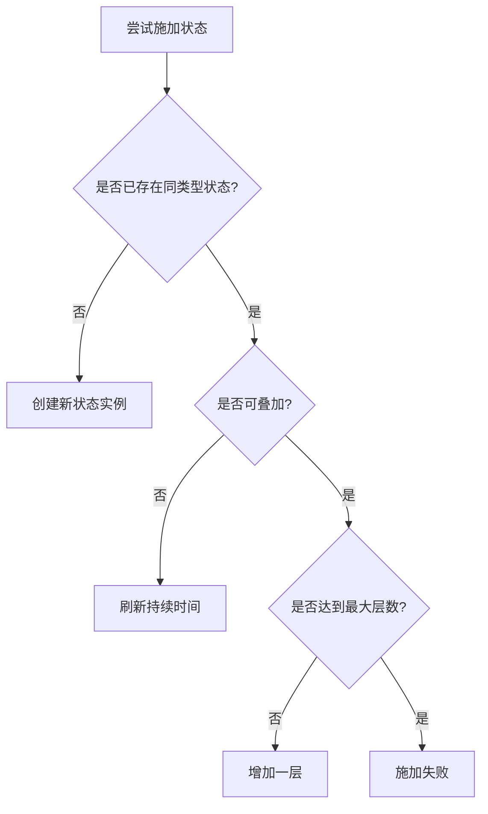
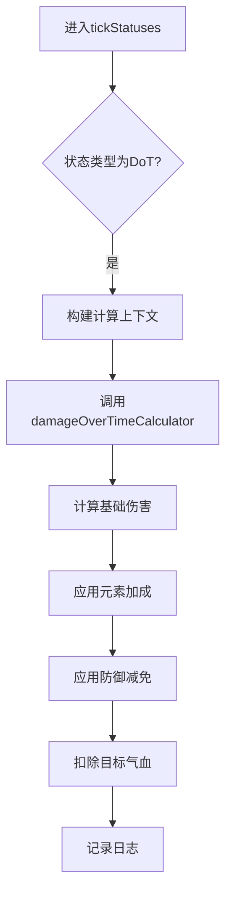
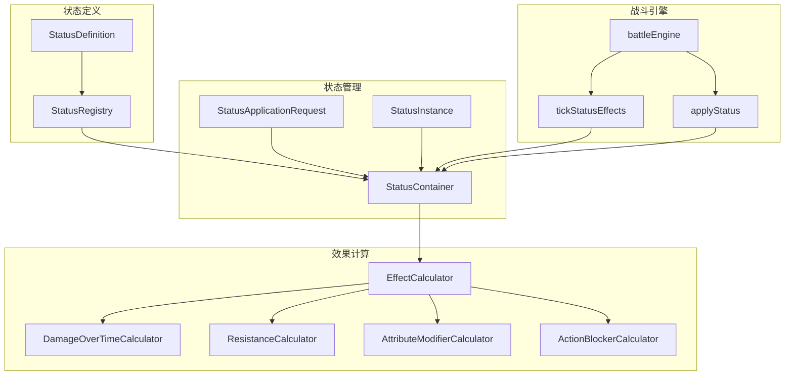

# 状态效果系统

<cite>
**本文档引用的文件**  
- [StatusContainer.ts](file://engine/status/StatusContainer.ts)
- [StatusRegistry.ts](file://engine/status/StatusRegistry.ts)
- [types.ts](file://engine/status/types.ts)
- [battleEngine.ts](file://engine/battleEngine.ts)
- [constants.ts](file://types/constants.ts)
- [dictionaries.ts](file://types/dictionaries.ts)
</cite>

## 目录
1. [简介](#简介)
2. [核心组件](#核心组件)
3. [状态效果类型定义](#状态效果类型定义)
4. [状态叠加与互斥规则](#状态叠加与互斥规则)
5. [状态命中判定机制](#状态命中判定机制)
6. [持续伤害（DoT）计算逻辑](#持续伤害（dot）计算逻辑)
7. [回合状态处理流程](#回合状态处理流程)
8. [战斗时间线记录](#战斗时间线记录)
9. [架构概览](#架构概览)

## 简介
状态效果系统是本游戏战斗机制的核心组成部分，负责管理角色在战斗中受到的各种临时增益（buff）与减益（debuff）效果。该系统通过 `StatusContainer` 类实现状态的添加、刷新与移除，并结合 `StatusRegistry` 进行统一配置管理。系统支持多种状态类型，包括灼烧、流血、中毒等持续伤害效果，以及护体、疾行、眩晕、沉默等控制与属性修正效果。

状态效果在每回合开始时统一处理，执行持续伤害结算、回合数递减与状态过期判断。系统还实现了精细的命中判定、元素加成、状态叠加与互斥逻辑，确保战斗体验的策略性与平衡性。

## 核心组件

状态效果系统由多个核心组件构成，主要包括：

- **StatusContainer**：状态容器，管理单个单位的所有活动状态，提供添加、刷新、移除等操作接口。
- **StatusRegistry**：状态注册表，集中管理所有状态的元数据定义与效果计算器。
- **StatusDefinition**：状态定义，描述每种状态的基础属性，如名称、类型、默认持续时间、是否可叠加等。
- **StatusInstance**：状态实例，表示一个具体生效中的状态，包含当前剩余回合、强度、来源等运行时信息。
- **StatusApplicationRequest**：状态施加请求，用于向容器请求添加新状态。
- **TickContext** 与 **TickResult**：状态刷新上下文与结果，用于在每回合执行状态效果。

系统通过 `tickStatusEffects` 函数在每回合开始时对所有单位的状态进行刷新处理，执行持续伤害、属性修正与状态消退等逻辑。

**本节来源**  
- [StatusContainer.ts](file://engine/status/StatusContainer.ts#L1-L370)
- [types.ts](file://engine/status/types.ts#L1-L270)
- [StatusRegistry.ts](file://engine/status/StatusRegistry.ts#L1-L248)

## 状态效果类型定义

系统定义了多种状态效果类型，按功能可分为以下几类：

### 战斗增益状态（Buff）
| 状态键 | 显示名称 | 描述 | 持续时间（回合） |
|--------|--------|------|----------------|
| armor_up | 护体 | 减伤提升15% | 2 |
| speed_up | 疾行 | 速度提升20点 | 2 |
| crit_rate_up | 锋锐 | 暴击率提升15% | 2 |

### 战斗减益状态（Debuff）
| 状态键 | 显示名称 | 描述 | 持续时间（回合） |
|--------|--------|------|----------------|
| armor_down | 破防 | 减伤降低15% | 2 |
| crit_rate_down | 暴击压制 | 暴击率降低15% | 2 |

### 控制状态（Control）
| 状态键 | 显示名称 | 描述 | 持续时间（回合） |
|--------|--------|------|----------------|
| stun | 眩晕 | 无法行动 | 1 |
| silence | 沉默 | 无法使用技能 | 2 |
| root | 定身 | 无法闪避 | 2 |

### 持续伤害状态（DoT）
| 状态键 | 显示名称 | 元素 | 最大叠加层数 | 持续时间（回合） |
|--------|--------|------|--------------|----------------|
| burn | 灼烧 | 火 | 3 | 3 |
| bleed | 流血 | 金 | 3 | 3 |
| poison | 中毒 | 木 | 5 | 3 |

所有状态效果均在 `StatusRegistry` 中注册，确保类型安全与配置统一。

**本节来源**  
- [StatusRegistry.ts](file://engine/status/StatusRegistry.ts#L87-L216)
- [constants.ts](file://types/constants.ts#L27-L60)
- [dictionaries.ts](file://types/dictionaries.ts#L184-L239)

## 状态叠加与互斥规则

### 叠加规则
- **正面状态（Buff）**：不可叠加，施加时会刷新持续时间。
- **负面状态（Debuff）**：部分可叠加，如 `burn`、`bleed`、`poison` 支持叠加，但有最大层数限制。
  - `burn` 与 `bleed` 最多叠加3层
  - `poison` 最多叠加5层
- 超过最大叠加层数时，状态施加失败。

### 互斥规则
某些状态之间存在互斥关系，施加新状态时会自动移除旧状态：
- `armor_up` 与 `armor_down` 互斥
- `crit_rate_up` 与 `crit_rate_down` 互斥

此机制通过 `conflictsWith` 字段在状态定义中声明，并在 `addStatus` 时自动处理。



**本节来源**  
- [StatusContainer.ts](file://engine/status/StatusContainer.ts#L73-L105)
- [StatusRegistry.ts](file://engine/status/StatusRegistry.ts#L99-L100)
- [StatusContainer.test.ts](file://engine/status/StatusContainer.test.ts#L84-L110)

## 状态命中判定机制

状态效果的命中基于技能威力与目标意志力计算命中概率，公式如下：

```
基础命中率 = min(0.8, max(0.2, 技能威力 / 2.5 / 100))
抵抗率 = min(0.7, 目标意志力 / 3000)
最终命中率 = max(0.2, 基础命中率 × (1 - 抵抗率))
```

对于 `debuff` 和 `control` 类型状态，目标可通过意志力进行抵抗。系统在 `addStatus` 时调用 `resistanceCalculator.calculateResistance` 计算抵抗概率，并以随机数判定是否成功命中。


**本节来源**  
- [StatusContainer.ts](file://engine/status/StatusContainer.ts#L48-L71)
- [battleEngine.ts](file://engine/battleEngine.ts#L207-L213)
- [calculators/ResistanceCalculator.ts](file://engine/status/calculators/ResistanceCalculator.ts)

## 持续伤害（DoT）计算逻辑

持续伤害（Damage over Time, DoT）的计算综合考虑基础比例、威力系数、施法者灵力与元素加成：

### 基础伤害公式
```
基础伤害 = (目标基础气血 × 基础比例) + (威力 × 系数) + (施法者灵力 × 0.15)
```

### 各状态参数
| 状态 | 基础比例 | 威力系数 | 元素 |
|------|--------|--------|------|
| burn | 7% | 0.2 | 火 |
| bleed | 6% | 0.2 | 金 |
| poison | 5% | 0.25 | 木 |

### 伤害修正
- **元素加成**：若施法者拥有对应元素灵根，伤害乘以元素倍率（如火灵根1.5倍）
- **防御减免**：最终伤害乘以目标减伤系数

系统通过 `damageOverTimeCalculator.calculateDamageOverTime` 执行计算，并在 `tickStatuses` 中应用伤害。



**本节来源**  
- [StatusContainer.ts](file://engine/status/StatusContainer.ts#L230-L248)
- [battleEngine.ts](file://engine/battleEngine.ts#L365-L392)
- [calculators/DamageOverTimeCalculator.ts](file://engine/status/calculators/DamageOverTimeCalculator.ts)

## 回合状态处理流程

每回合开始时，系统调用 `tickStatusEffects` 函数处理所有单位的状态：

1. **递减持续时间**：对 `turn` 类型状态，`remaining` 减1
2. **执行持续效果**：对 `dot` 类型状态，计算并施加持续伤害
3. **检查状态过期**：若 `remaining <= 0`，标记为过期
4. **移除过期状态**：从容器中移除所有过期状态
5. **记录日志**：生成状态效果与消退的日志信息

该流程在 `battleEngine.ts` 的主循环中执行，确保所有单位的状态同步刷新。

```mermaid
flowchart TD
A[回合开始] --> B[tickStatusEffects(玩家)]
B --> C[tickStatusEffects(对手)]
C --> D{状态剩余回合 <= 0?}
D --> |是| E[标记为过期]
D --> |否| F[继续]
E --> G[执行持续伤害]
G --> H[移除状态]
H --> I[记录日志]
```

**本节来源**  
- [battleEngine.ts](file://engine/battleEngine.ts#L721-L723)
- [StatusContainer.ts](file://engine/status/StatusContainer.ts#L210-L265)
- [StatusContainer.test.ts](file://engine/status/StatusContainer.test.ts#L138-L158)

## 战斗时间线记录

系统通过 `timeline` 数组记录每回合的状态快照，用于战斗回放与分析：

- **快照内容**：包含回合号、双方单位的气血、灵力与当前状态列表
- **记录时机**：
  - 第0回合：战斗开始前的初始状态
  - 每个完整回合结束后
  - 战斗结束时（可能在回合中途）
- **数据结构**：`TurnSnapshot` 包含 `player` 与 `opponent` 的 `TurnUnitSnapshot`

快照通过 `snapshotTurn` 函数生成，确保战斗过程可追溯。

**本节来源**  
- [battleEngine.ts](file://engine/battleEngine.ts#L713-L800)
- [battleEngine.ts](file://engine/battleEngine.ts#L434-L450)
- [types.ts](file://types/constants.ts#L23-L33)

## 架构概览



**本节来源**  
- [StatusContainer.ts](file://engine/status/StatusContainer.ts)
- [StatusRegistry.ts](file://engine/status/StatusRegistry.ts)
- [battleEngine.ts](file://engine/battleEngine.ts)