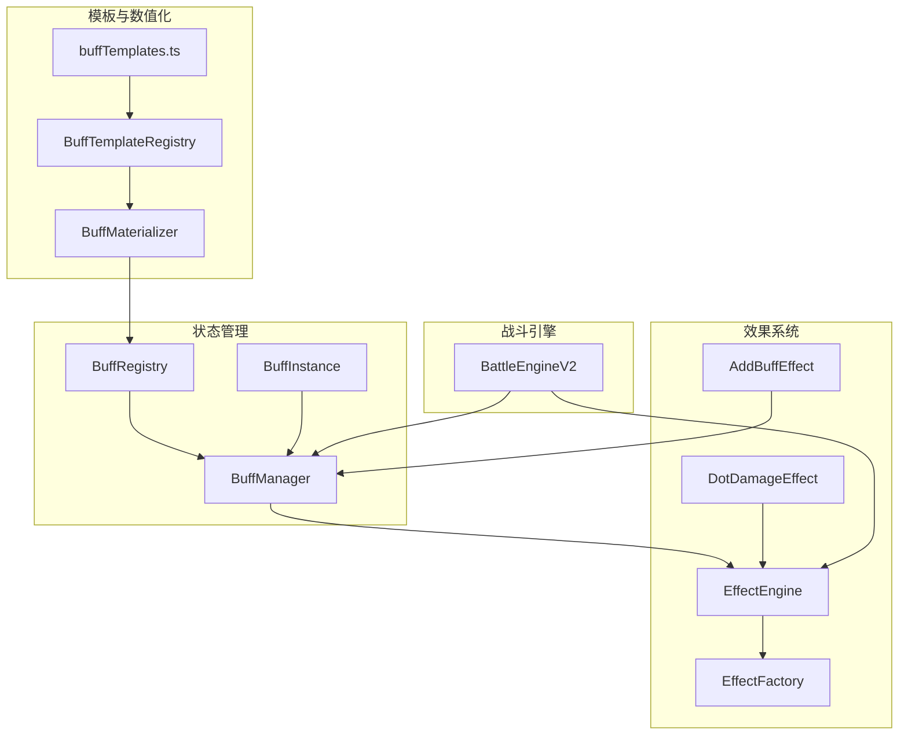

# 状态效果系统

<cite>
**本文档引用的文件**
- [BuffManager.ts](file://engine/buff/BuffManager.ts)
- [BuffInstance.ts](file://engine/buff/BuffInstance.ts)
- [BuffRegistry.ts](file://engine/buff/BuffRegistry.ts)
- [BuffTemplateRegistry.ts](file://engine/buff/BuffTemplateRegistry.ts)
- [BuffMaterializer.ts](file://engine/buff/BuffMaterializer.ts)
- [types.ts](file://engine/buff/types.ts)
- [EffectEngine.ts](file://engine/effect/EffectEngine.ts)
- [EffectFactory.ts](file://engine/effect/EffectFactory.ts)
- [AddBuffEffect.ts](file://engine/effect/effects/AddBuffEffect.ts)
- [DotDamageEffect.ts](file://engine/effect/effects/DotDamageEffect.ts)
- [BattleEngine.v2.ts](file://engine/battle/BattleEngine.v2.ts)
- [buffTemplates.ts](file://config/buffTemplates.ts)
</cite>

## 更新摘要
本次更新围绕缓冲模板系统的重大重构展开，将原有静态配置体系替换为动态缓冲模板系统。核心变更包括：
- 引入 BuffTemplateRegistry 与 BuffMaterializer，实现基于施法者属性、物品品质、技能品阶与层数的动态数值缩放
- 新增 BuffTemplate 与 BuffEffectTemplate，支持描述模板占位符自动替换与参数覆盖
- 保留并优化 BuffManager 的 tick 与叠加/刷新逻辑，新增按结算时机（ON_ACTION_START/ON_ACTION_END）的差异化处理
- 持续伤害（DoT）系统增强，支持基于施法者属性与元素亲和的动态加成，以及按层数乘算的伤害缩放
- 保持与 EffectEngine 的深度集成，统一通过 EffectFactory 创建效果实例

## 目录
1. [简介](#简介)
2. [核心组件](#核心组件)
3. [状态效果类型定义](#状态效果类型定义)
4. [状态叠加与互斥规则](#状态叠加与互斥规则)
5. [状态命中判定机制](#状态命中判定机制)
6. [持续伤害（DoT）计算逻辑](#持续伤害（dot）计算逻辑)
7. [回合状态处理流程](#回合状态处理流程)
8. [战斗时间线记录](#战斗时间线记录)
9. [架构概览](#架构概览)

## 简介
状态效果系统是本游戏战斗机制的核心组成部分，负责管理角色在战斗中受到的各种临时增益（buff）与减益（debuff）效果。新系统以动态缓冲模板为核心，通过 BuffTemplate 与 BuffMaterializer 将“模板 + 上下文”的模式应用于 Buff 的数值生成，从而实现基于施法者属性、物品品质、技能品阶与层数的弹性缩放。系统同时保留了对控制类、持续伤害（DoT）、持续治疗（HoT）等效果的完善支持，并通过 EffectEngine 与 EffectFactory 统一调度各类效果。

## 核心组件
- BuffTemplateRegistry：集中注册与检索 Buff 模板，提供默认与参数化数值化配置的获取能力
- BuffMaterializer：将 BuffTemplate 的可缩放参数（如 caster_spirit、quality、stacks 等）按上下文计算为具体数值，生成可直接使用的 BuffConfig
- BuffManager：管理单个实体身上的所有 Buff 实例，提供添加、刷新、移除、按结算时机 tick 等能力
- BuffInstance：运行时对象，维护当前层数、剩余回合、施法者快照等状态，并缓存效果实例以维持状态一致性
- BuffRegistry：兼容旧有静态配置的注册表（当前由模板注册表初始化）
- EffectEngine/EffectFactory：统一创建与执行效果，AddBuffEffect/DotDamageEffect 等具体效果与 Buff 系统深度集成
- BattleEngine.v2：驱动战斗主循环，按行动开始/结束两个时机分别结算控制/增益/减益类 Buff

**章节来源**
- [BuffTemplateRegistry.ts](file://engine/buff/BuffTemplateRegistry.ts#L1-L94)
- [BuffMaterializer.ts](file://engine/buff/BuffMaterializer.ts#L1-L347)
- [BuffManager.ts](file://engine/buff/BuffManager.ts#L1-L336)
- [BuffInstance.ts](file://engine/buff/BuffInstance.ts#L1-L140)
- [BuffRegistry.ts](file://engine/buff/BuffRegistry.ts#L1-L72)
- [EffectEngine.ts](file://engine/effect/EffectEngine.ts#L1-L200)
- [EffectFactory.ts](file://engine/effect/EffectFactory.ts#L1-L182)
- [AddBuffEffect.ts](file://engine/effect/effects/AddBuffEffect.ts#L1-L211)
- [DotDamageEffect.ts](file://engine/effect/effects/DotDamageEffect.ts#L1-L82)
- [BattleEngine.v2.ts](file://engine/battle/BattleEngine.v2.ts#L1-L200)

## 状态效果类型定义
新系统以 BuffTemplate 为中心，定义了丰富的状态类型，涵盖战斗增益、战斗减益、控制、持续伤害（DoT）、持久状态与高级 Buff 等。以下为典型类型与特征（数值来源于模板，实际数值随上下文动态计算）：
- 增益（Buff）：如护体、疾行、锋锐、灵力激增、暴击增幅、龟息、顿悟、再生、万法归一、铁壁、迅影等
- 减益（Debuff）：如破防、暴击压制、迟缓、虚弱、轻伤、重伤、濒死等
- 控制（Control）：如眩晕、沉默、定身、冰冻等
- 持续伤害（DoT）：如灼烧（火）、流血（金）、中毒（木），支持叠加层数与按层数乘算
- 持久状态（Persistent）：如虚弱、轻伤、重伤、濒死，通常不可净化
- 高级 Buff：如狂暴（攻升防降）、反击态势、治疗削减、治疗增幅等

上述类型均通过 BuffTemplate 的 tags 字段进行分类标注，便于按类型筛选与处理。

**章节来源**
- [buffTemplates.ts](file://config/buffTemplates.ts#L1-L787)
- [types.ts](file://engine/buff/types.ts#L42-L64)

## 状态叠加与互斥规则
- 叠加策略（BuffStackType）
  - REFRESH：不可叠加，施加时刷新持续时间
  - STACK：可叠加，达到最大层数后仅刷新持续时间
  - INDEPENDENT：每次施加创建独立实例
- 最大叠加层数（maxStacks）：不同状态有不同的上限，超过上限不再叠加
- 互斥（conflictsWith）：当施加新状态时，系统会自动移除与之互斥的同类状态，确保同一时间不会存在冲突的 Buff

以上规则在 BuffManager.addBuff 与 BuffInstance.addStack 中得到体现，并通过 BuffConfig 的 stackType 与 conflictsWith 字段进行控制。

**章节来源**
- [BuffManager.ts](file://engine/buff/BuffManager.ts#L28-L109)
- [BuffInstance.ts](file://engine/buff/BuffInstance.ts#L52-L90)
- [types.ts](file://engine/buff/types.ts#L30-L41)

## 状态命中判定机制
- 基础概率：AddBuffEffect.apply 中先按配置 chance 进行基础命中判定
- 控制类 Buff 抵抗：若目标非自身且 Buff 标签包含 CONTROL，则按施法者灵力与目标神识差值计算抵抗率，最高 40%
- 抵抗判定：当目标具备足够神识优势时，有一定概率完全抵抗该控制效果

该机制确保控制类状态在面对高意志力目标时具备合理抵抗能力，同时保留施法者的命中期望。

**章节来源**
- [AddBuffEffect.ts](file://engine/effect/effects/AddBuffEffect.ts#L56-L171)

## 持续伤害（DoT）计算逻辑
- 基础伤害来源：DotDamageEffect 在 ON_TURN_START 触发时，从 BuffConfig 的 DotDamageParams 读取 baseDamage
- 施法者属性加成：若 usesCasterStats 为真，将追加施法者灵力的一定比例（例如 10%）作为加成
- 元素亲和：若 Buff 模板中定义了元素类型，将乘以施法者对该元素的亲和倍率
- 层数乘算：DoT 伤害将按当前 Buff 层数进行乘算，层数越高伤害越高
- 层数来源：DotDamageEffect 通过 EffectContext.metadata 读取 buffStacks，由 BuffInstance 维护

该机制使 DoT 的伤害随施法者强度、元素亲和与叠加层数动态变化，增强策略深度。

**章节来源**
- [DotDamageEffect.ts](file://engine/effect/effects/DotDamageEffect.ts#L1-L82)
- [BuffInstance.ts](file://engine/buff/BuffInstance.ts#L1-L140)
- [types.ts](file://engine/buff/types.ts#L99-L110)

## 回合状态处理流程
- 行动开始（ON_ACTION_START）：结算控制类 Buff（生效即消耗），移除过期控制类 Buff
- 行动结束（ON_ACTION_END）：结算增益/减益类 Buff，移除过期的增益/减益类 Buff
- 特殊规则：若 Buff 是“本回合行动期间”刚添加或刷新的，将跳过当回合的 tick，确保持续时间从“下回合”开始计算
- DOT/HOT：在回合开始/结束等时机由 EffectEngine 统一调度，DotDamageEffect 与相关效果按触发时机执行

该流程由 BattleEngine.v2 在每回合的开始/结束阶段调用 BuffManager.tick 并按结算时机分发，保证控制与增益/减益类状态的公平性与时序正确性。

**章节来源**
- [BattleEngine.v2.ts](file://engine/battle/BattleEngine.v2.ts#L151-L200)
- [BuffManager.ts](file://engine/buff/BuffManager.ts#L143-L209)

## 战斗时间线记录
- 快照内容：包含回合号、双方单位的气血、法力与当前状态列表
- 记录时机：战斗开始前（回合 0）、每个完整回合结束后、以及战斗结束时（可能在回合中途）
- 数据结构：TurnSnapshot 与 TurnUnitSnapshot，用于回放与分析
- 生成方式：BattleEngine.v2 在回合开始、行动结束与战斗结束时调用 snapshotTurn 生成快照

该机制确保战斗过程可追溯，便于复盘与调试。

**章节来源**
- [BattleEngine.v2.ts](file://engine/battle/BattleEngine.v2.ts#L43-L49)
- [BattleEngine.v2.ts](file://engine/battle/BattleEngine.v2.ts#L138-L148)

## 架构概览

**图表来源**
- [BuffTemplateRegistry.ts](file://engine/buff/BuffTemplateRegistry.ts#L1-L94)
- [BuffMaterializer.ts](file://engine/buff/BuffMaterializer.ts#L1-L347)
- [buffTemplates.ts](file://config/buffTemplates.ts#L1-L787)
- [BuffRegistry.ts](file://engine/buff/BuffRegistry.ts#L1-L72)
- [BuffManager.ts](file://engine/buff/BuffManager.ts#L1-L336)
- [BuffInstance.ts](file://engine/buff/BuffInstance.ts#L1-L140)
- [EffectEngine.ts](file://engine/effect/EffectEngine.ts#L1-L200)
- [EffectFactory.ts](file://engine/effect/EffectFactory.ts#L1-L182)
- [AddBuffEffect.ts](file://engine/effect/effects/AddBuffEffect.ts#L1-L211)
- [DotDamageEffect.ts](file://engine/effect/effects/DotDamageEffect.ts#L1-L82)
- [BattleEngine.v2.ts](file://engine/battle/BattleEngine.v2.ts#L1-L200)