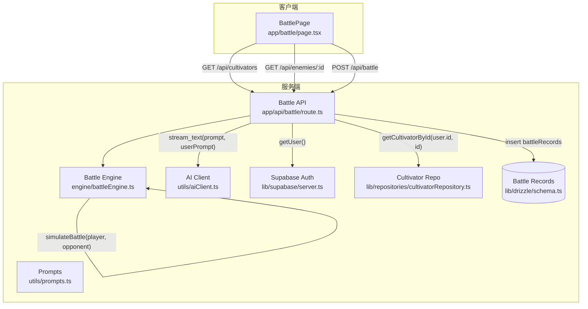
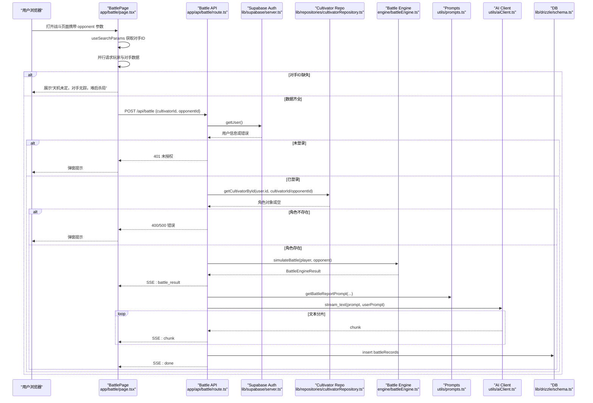
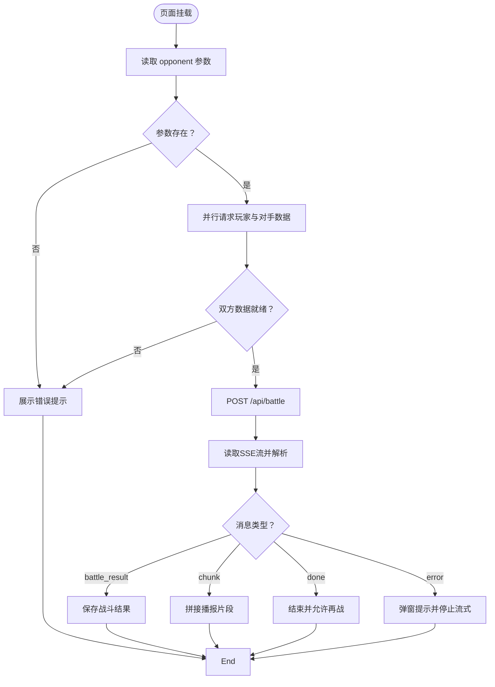
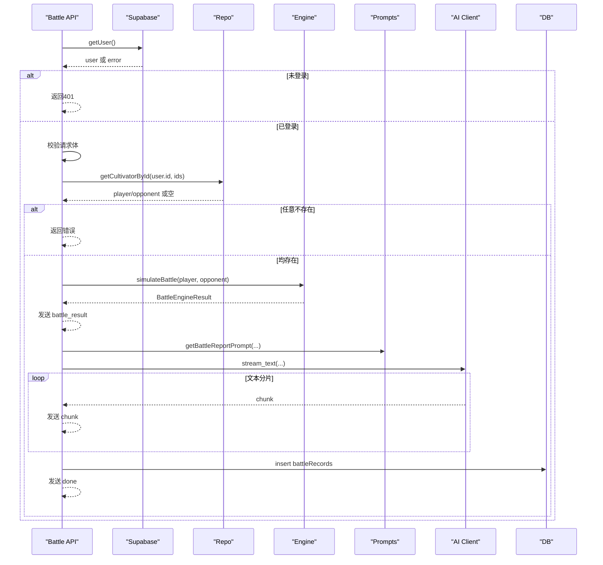
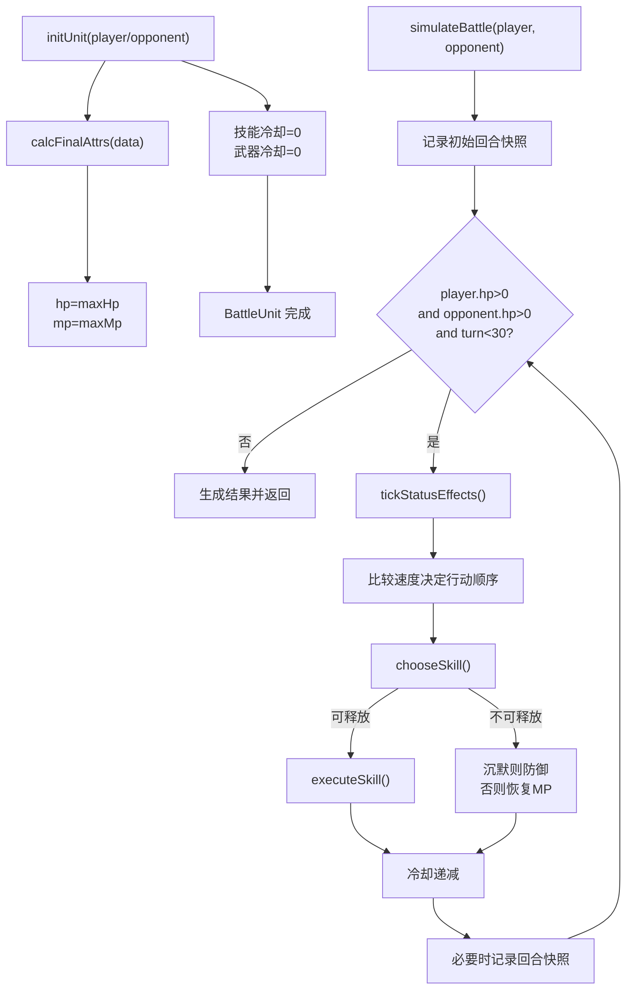
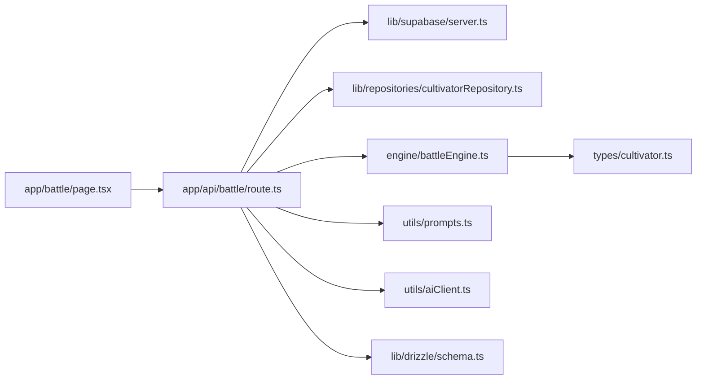

# 战斗初始化

<cite>
**本文引用的文件**
- [app/battle/page.tsx](file://app/battle/page.tsx)
- [app/api/battle/route.ts](file://app/api/battle/route.ts)
- [engine/battleEngine.ts](file://engine/battleEngine.ts)
- [types/cultivator.ts](file://types/cultivator.ts)
- [lib/drizzle/schema.ts](file://lib/drizzle/schema.ts)
- [lib/supabase/server.ts](file://lib/supabase/server.ts)
- [lib/repositories/cultivatorRepository.ts](file://lib/repositories/cultivatorRepository.ts)
- [utils/prompts.ts](file://utils/prompts.ts)
- [utils/aiClient.ts](file://utils/aiClient.ts)
</cite>

## 目录
1. [简介](#简介)
2. [项目结构](#项目结构)
3. [核心组件](#核心组件)
4. [架构总览](#架构总览)
5. [详细组件分析](#详细组件分析)
6. [依赖关系分析](#依赖关系分析)
7. [性能考量](#性能考量)
8. [故障排查指南](#故障排查指南)
9. [结论](#结论)

## 简介
本文件聚焦“战斗初始化”流程，从用户访问战斗页面到战斗执行前的准备阶段。文档围绕以下目标展开：
- 解释页面如何通过搜索参数获取对手ID并自动触发战斗
- 说明API如何验证用户身份、获取角色数据并初始化SSE流
- 阐述战斗引擎中单位初始化逻辑（HP、MP、技能冷却等）
- 提供初始化阶段的时序图，展示客户端、API与引擎之间的数据交互
- 总结错误处理策略（角色不存在、对手ID缺失等）

## 项目结构
战斗初始化涉及的关键文件与职责如下：
- 页面层：app/battle/page.tsx 负责获取参数、并行拉取玩家与对手数据、自动触发战斗并消费SSE
- API层：app/api/battle/route.ts 负责鉴权、校验输入、调用引擎、流式输出播报
- 引擎层：engine/battleEngine.ts 负责模拟战斗、初始化战斗单位状态
- 类型与数据：types/cultivator.ts 定义角色数据结构；lib/drizzle/schema.ts 定义战斗记录存储结构
- 认证与仓库：lib/supabase/server.ts 提供用户认证；lib/repositories/cultivatorRepository.ts 提供角色查询
- 文本生成：utils/prompts.ts 生成播报提示词；utils/aiClient.ts 提供流式文本生成

图表来源
- [app/battle/page.tsx](file://app/battle/page.tsx#L41-L107)
- [app/api/battle/route.ts](file://app/api/battle/route.ts#L15-L171)
- [engine/battleEngine.ts](file://engine/battleEngine.ts#L674-L829)
- [lib/supabase/server.ts](file://lib/supabase/server.ts)
- [lib/repositories/cultivatorRepository.ts](file://lib/repositories/cultivatorRepository.ts)
- [utils/prompts.ts](file://utils/prompts.ts#L62-L120)
- [utils/aiClient.ts](file://utils/aiClient.ts)
- [lib/drizzle/schema.ts](file://lib/drizzle/schema.ts#L240-L264)

章节来源
- [app/battle/page.tsx](file://app/battle/page.tsx#L1-L313)
- [app/api/battle/route.ts](file://app/api/battle/route.ts#L1-L172)
- [engine/battleEngine.ts](file://engine/battleEngine.ts#L629-L829)
- [types/cultivator.ts](file://types/cultivator.ts#L218-L253)
- [lib/drizzle/schema.ts](file://lib/drizzle/schema.ts#L240-L264)

## 核心组件
- 战斗页面（BattlePage）
  - 使用搜索参数获取对手ID，若缺失则提示“天机未定，对手无踪，难启杀局”
  - 并行获取玩家与对手数据，任一失败都会触发错误提示
  - 数据齐全时自动调用战斗接口，消费SSE流，实时更新播报与结果
- 战斗API（POST /api/battle）
  - 使用Supabase getUser进行鉴权，未登录返回401
  - 校验请求体包含有效的角色ID与对手ID
  - 通过仓库层按当前用户ID与ID查询角色，不存在则抛错
  - 调用引擎执行战斗，将结果以SSE发送给客户端
  - 生成播报提示词并流式生成文本，同时将战斗快照写入数据库
- 战斗引擎（simulateBattle）
  - 初始化双方单位：HP、MP、技能冷却、状态、防御标志
  - 按回合推进，处理持续状态、行动选择、技能释放、冷却递减
  - 生成回合快照与最终结果

章节来源
- [app/battle/page.tsx](file://app/battle/page.tsx#L41-L206)
- [app/api/battle/route.ts](file://app/api/battle/route.ts#L15-L171)
- [engine/battleEngine.ts](file://engine/battleEngine.ts#L674-L829)

## 架构总览
下面的时序图展示了从页面到API再到引擎与数据库的整体交互过程，以及SSE流式播报的生成路径。

图表来源
- [app/battle/page.tsx](file://app/battle/page.tsx#L41-L206)
- [app/api/battle/route.ts](file://app/api/battle/route.ts#L15-L171)
- [engine/battleEngine.ts](file://engine/battleEngine.ts#L674-L829)
- [utils/prompts.ts](file://utils/prompts.ts#L62-L120)
- [utils/aiClient.ts](file://utils/aiClient.ts)
- [lib/supabase/server.ts](file://lib/supabase/server.ts)
- [lib/repositories/cultivatorRepository.ts](file://lib/repositories/cultivatorRepository.ts)
- [lib/drizzle/schema.ts](file://lib/drizzle/schema.ts#L240-L264)

## 详细组件分析

### 页面初始化与自动战斗（useEffect + handleBattle）
- 参数获取与自动触发
  - 页面通过搜索参数读取对手ID，若缺失则设置错误提示并终止
  - 并行请求玩家与对手数据，任一失败均会捕获异常并提示
  - 当双方数据就绪且无旧结果时，自动调用战斗接口
- SSE消费与状态管理
  - 以流式方式读取响应，逐条解析SSE数据帧
  - 支持三种消息类型：battle_result（战斗结果）、chunk（播报片段）、done（结束）、error（错误）
  - 结束后将结果写入状态，停止流式渲染，允许用户再战

图表来源
- [app/battle/page.tsx](file://app/battle/page.tsx#L41-L206)

章节来源
- [app/battle/page.tsx](file://app/battle/page.tsx#L41-L206)

### API：鉴权、校验与SSE初始化
- 鉴权
  - 使用Supabase getUser获取当前用户，未登录返回401
- 输入校验
  - 校验请求体包含有效的字符串ID（角色ID与对手ID）
- 数据获取与错误处理
  - 通过仓库层按当前用户ID与ID查询角色，不存在则抛错
- 引擎与流式播报
  - 调用引擎执行战斗，立即发送battle_result
  - 生成播报提示词并流式生成文本，期间累积完整文本
  - 将战斗结果与完整播报写入数据库（失败不影响前端体验）
  - 最终发送done标记，关闭流

图表来源
- [app/api/battle/route.ts](file://app/api/battle/route.ts#L15-L171)
- [lib/supabase/server.ts](file://lib/supabase/server.ts)
- [lib/repositories/cultivatorRepository.ts](file://lib/repositories/cultivatorRepository.ts)
- [engine/battleEngine.ts](file://engine/battleEngine.ts#L674-L829)
- [utils/prompts.ts](file://utils/prompts.ts#L62-L120)
- [utils/aiClient.ts](file://utils/aiClient.ts)
- [lib/drizzle/schema.ts](file://lib/drizzle/schema.ts#L240-L264)

章节来源
- [app/api/battle/route.ts](file://app/api/battle/route.ts#L15-L171)

### 引擎：单位初始化与回合推进
- 单位初始化（initUnit）
  - 技能冷却：基于角色技能列表建立冷却映射，初始均为0
  - 武器冷却：若角色装备武器，额外加入武器ID的冷却映射
  - 属性：通过最终属性计算函数得到最大HP与最大MP
  - 状态：初始为空Map
  - 防御：初始false
- 模拟战斗（simulateBattle）
  - 初始化双方单位、回合计数、日志与时间线
  - 初始回合快照记录
  - 循环条件：双方HP>0且回合数小于阈值
  - 每回合先处理持续状态，再按速度排序决定行动顺序
  - 行动选择：根据状态与血量比例选择治疗、攻击、控制或增益
  - 技能执行：计算伤害/治疗/状态，消耗MP，处理主动法宝的特殊效果
  - 冷却递减：每回合对所有冷却项减1
  - 生成最终赢家、日志、回合数与最终HP

图表来源
- [engine/battleEngine.ts](file://engine/battleEngine.ts#L674-L829)

章节来源
- [engine/battleEngine.ts](file://engine/battleEngine.ts#L629-L829)
- [types/cultivator.ts](file://types/cultivator.ts#L218-L253)

### 数据模型与持久化
- 战斗记录表（battleRecords）
  - 字段包括用户ID、角色ID、对手ID（可选）、战斗结果快照、完整播报文本、创建时间
  - 作为JSONB存储完整战斗结果，便于后续回放与分析

章节来源
- [lib/drizzle/schema.ts](file://lib/drizzle/schema.ts#L240-L264)

## 依赖关系分析
- 页面依赖
  - 使用Next.js的useSearchParams与Suspense
  - 依赖客户端fetch与ReadableStream Reader消费SSE
- API依赖
  - Supabase getUser进行鉴权
  - 仓库层按当前用户ID与ID查询角色
  - 引擎层执行战斗
  - Prompts与AI Client生成播报
  - Drizzle ORM写入战斗记录
- 引擎依赖
  - 统一的属性计算函数（来自工具模块）
  - 常量与类型定义（元素、技能类型、状态效果等）

图表来源
- [app/battle/page.tsx](file://app/battle/page.tsx#L1-L313)
- [app/api/battle/route.ts](file://app/api/battle/route.ts#L1-L172)
- [engine/battleEngine.ts](file://engine/battleEngine.ts#L629-L829)
- [types/cultivator.ts](file://types/cultivator.ts#L218-L253)
- [lib/drizzle/schema.ts](file://lib/drizzle/schema.ts#L240-L264)

章节来源
- [app/battle/page.tsx](file://app/battle/page.tsx#L1-L313)
- [app/api/battle/route.ts](file://app/api/battle/route.ts#L1-L172)
- [engine/battleEngine.ts](file://engine/battleEngine.ts#L629-L829)
- [types/cultivator.ts](file://types/cultivator.ts#L218-L253)
- [lib/drizzle/schema.ts](file://lib/drizzle/schema.ts#L240-L264)

## 性能考量
- 并行请求：页面在初始化阶段并行获取玩家与对手数据，减少首屏等待
- 流式渲染：API采用SSE边打边播，避免一次性传输大量文本
- 冷却与回合限制：引擎设置回合上限与冷却机制，防止无限循环
- 数据库写入：战斗记录写入采用异步方式，不影响前端体验

## 故障排查指南
- 对手ID缺失
  - 页面检测到opponent参数为空时，直接提示“天机未定，对手无踪，难启杀局”，并阻止自动发起战斗
- 未登录
  - API在getUser失败时返回401，页面收到错误后弹窗提示
- 角色不存在
  - API在getCultivatorById返回空时抛错，向客户端发送error消息并关闭流
- 请求体无效
  - API对cultivatorId与opponentId进行严格校验，缺失或类型不符返回400
- 数据库写入失败
  - 写入battleRecords失败不会中断SSE，仅记录日志，确保前端体验不受影响
- SSE解析异常
  - 页面在解析SSE数据帧时捕获异常并记录，避免崩溃

章节来源
- [app/battle/page.tsx](file://app/battle/page.tsx#L64-L91)
- [app/api/battle/route.ts](file://app/api/battle/route.ts#L21-L49)
- [app/api/battle/route.ts](file://app/api/battle/route.ts#L60-L71)
- [app/api/battle/route.ts](file://app/api/battle/route.ts#L129-L144)
- [app/api/battle/route.ts](file://app/api/battle/route.ts#L156-L171)

## 结论
战斗初始化流程通过“页面参数解析 + 并行数据获取 + 自动触发战斗 + SSE流式播报”的组合，实现了从用户访问到战斗执行前的顺畅衔接。API在鉴权、输入校验与错误处理方面提供了稳健保障，引擎在单位初始化与回合推进中体现了清晰的状态管理与可扩展的技能系统。整体设计兼顾了用户体验与系统健壮性。