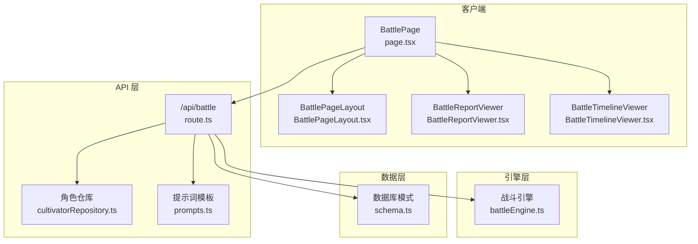
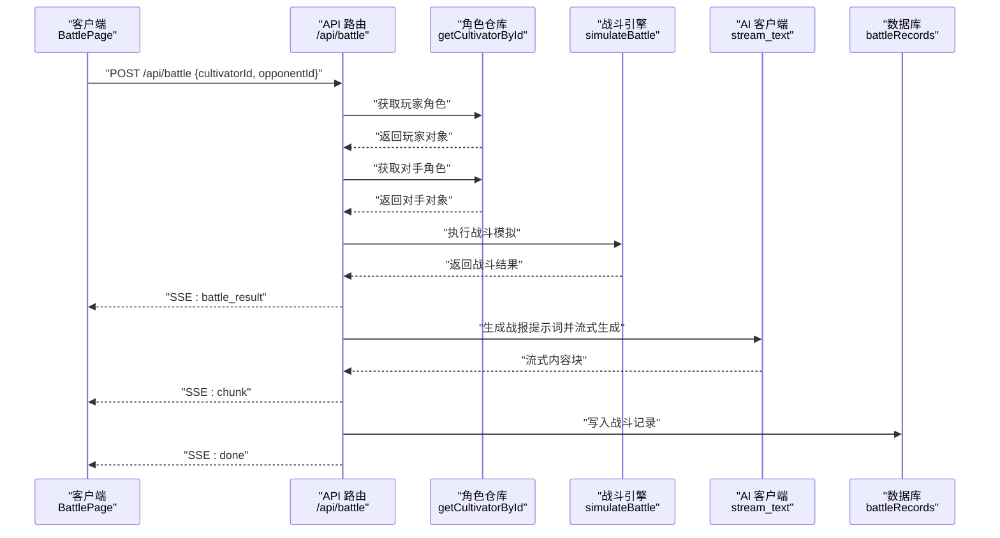
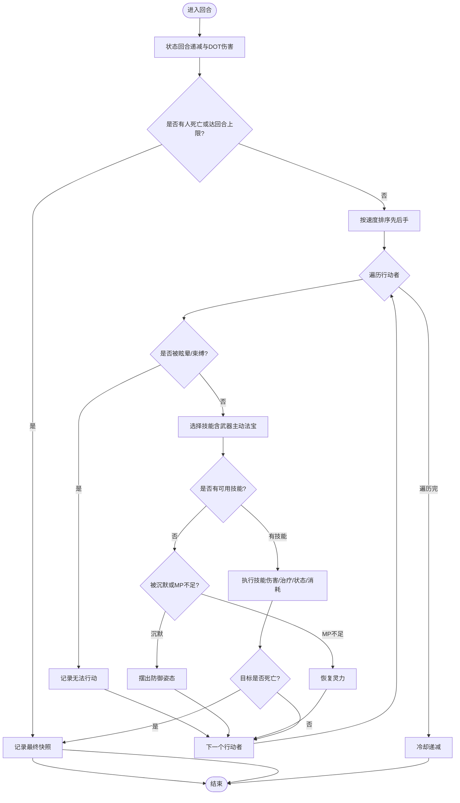
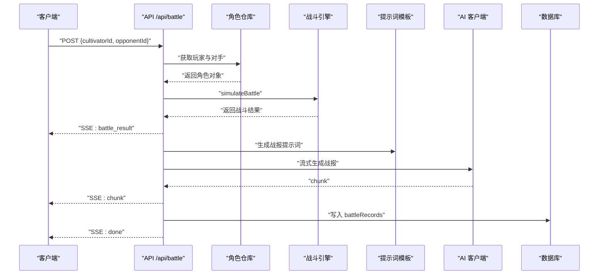
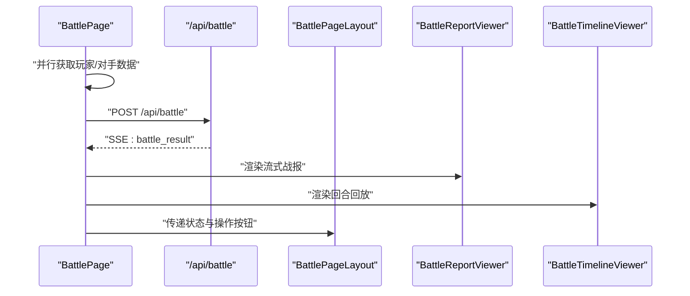
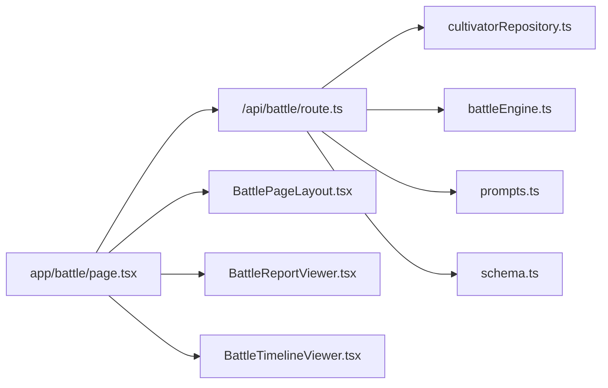

# 战斗流程

<cite>
**本文引用的文件**
- [battleEngine.ts](file://engine/battleEngine.ts)
- [route.ts](file://app/api/battle/route.ts)
- [page.tsx](file://app/battle/page.tsx)
- [BattlePageLayout.tsx](file://components/BattlePageLayout.tsx)
- [BattleReportViewer.tsx](file://components/BattleReportViewer.tsx)
- [BattleTimelineViewer.tsx](file://components/BattleTimelineViewer.tsx)
- [prompts.ts](file://utils/prompts.ts)
- [schema.ts](file://lib/drizzle/schema.ts)
- [cultivatorRepository.ts](file://lib/repositories/cultivatorRepository.ts)
- [challenge-battle/route.ts](file://app/api/rankings/challenge-battle/route.ts)
- [execute/route.ts](file://app/api/dungeon/battle/execute/route.ts)
</cite>

## 目录
1. [简介](#简介)
2. [项目结构](#项目结构)
3. [核心组件](#核心组件)
4. [架构总览](#架构总览)
5. [详细组件分析](#详细组件分析)
6. [依赖关系分析](#依赖关系分析)
7. [性能考量](#性能考量)
8. [故障排查指南](#故障排查指南)
9. [结论](#结论)

## 简介
本文件围绕“战斗流程”的完整生命周期展开，重点解释从用户发起战斗请求到战斗结果返回的全过程。基于引擎模块中的战斗模拟函数，梳理回合制逻辑、属性计算、技能执行、状态效果处理与胜负判定；结合 API 路由说明角色数据获取、战斗执行、AI 战报生成与结果持久化；阐述页面组件如何管理状态与交互；并提供战斗流程的时序图与错误处理策略、性能优化建议。

## 项目结构
与战斗流程直接相关的模块分布如下：
- 引擎层：战斗引擎负责回合推进、技能与状态计算、胜负判定与回放快照。
- API 层：统一的战斗接口，负责鉴权、角色数据拉取、战斗执行、AI 战报流式生成与结果持久化。
- 页面层：客户端页面负责数据初始化、SSE 流式接收、回放与播报展示、页面状态管理。
- 工具与仓库：提示词模板、角色数据装配与查询、数据库模式定义。

图表来源
- [page.tsx](file://app/battle/page.tsx#L1-L313)
- [BattlePageLayout.tsx](file://components/BattlePageLayout.tsx#L1-L104)
- [BattleReportViewer.tsx](file://components/BattleReportViewer.tsx#L1-L108)
- [BattleTimelineViewer.tsx](file://components/BattleTimelineViewer.tsx#L1-L141)
- [route.ts](file://app/api/battle/route.ts#L1-L172)
- [cultivatorRepository.ts](file://lib/repositories/cultivatorRepository.ts#L322-L343)
- [prompts.ts](file://utils/prompts.ts#L63-L145)
- [battleEngine.ts](file://engine/battleEngine.ts#L674-L830)
- [schema.ts](file://lib/drizzle/schema.ts#L1-L200)

章节来源
- [page.tsx](file://app/battle/page.tsx#L1-L313)
- [route.ts](file://app/api/battle/route.ts#L1-L172)

## 核心组件
- 战斗引擎（battleEngine.ts）
  - 提供 simulateBattle 主函数，封装回合推进、技能选择与执行、状态效果、冷却与闪避、胜负判定与回放快照。
  - 关键接口：simulateBattle、executeSkill、chooseSkill、tickStatusEffects、calculateSpellBase、applyAndLogStatusFromSkill、snapshotTurn 等。
- API 路由（/api/battle/route.ts）
  - 负责鉴权、角色数据获取、调用引擎执行战斗、流式发送战斗结果、生成 AI 战报、持久化战斗记录。
- 页面组件（page.tsx 与 BattlePageLayout.tsx）
  - 负责并行拉取玩家与对手数据、触发战斗、接收 SSE 流、渲染回放与播报、管理页面状态与交互。
- 播报与回放组件（BattleReportViewer.tsx、BattleTimelineViewer.tsx）
  - 播报组件：展示流式生成的战报文本与结果标记。
  - 回放组件：按回合播放 HP/MP/状态变化，支持自动播放与手动切换。
- 提示词模板（prompts.ts）
  - 生成 AI 战报所需的系统提示词与用户提示词，确保风格与内容规范。
- 角色仓库（cultivatorRepository.ts）
  - 提供 getCultivatorById 等方法，组装角色的属性、技能、装备、法宝等完整对象。
- 数据库模式（schema.ts）
  - 定义角色、技能、法宝、材料、消耗品等表结构，支撑角色数据持久化与查询。

章节来源
- [battleEngine.ts](file://engine/battleEngine.ts#L674-L830)
- [route.ts](file://app/api/battle/route.ts#L1-L172)
- [page.tsx](file://app/battle/page.tsx#L1-L313)
- [BattlePageLayout.tsx](file://components/BattlePageLayout.tsx#L1-L104)
- [BattleReportViewer.tsx](file://components/BattleReportViewer.tsx#L1-L108)
- [BattleTimelineViewer.tsx](file://components/BattleTimelineViewer.tsx#L1-L141)
- [prompts.ts](file://utils/prompts.ts#L63-L145)
- [cultivatorRepository.ts](file://lib/repositories/cultivatorRepository.ts#L322-L343)
- [schema.ts](file://lib/drizzle/schema.ts#L1-L200)

## 架构总览
下面给出从客户端到引擎再到 API 与数据库的整体时序图，展示数据流向与处理阶段。

图表来源
- [page.tsx](file://app/battle/page.tsx#L110-L206)
- [route.ts](file://app/api/battle/route.ts#L1-L172)
- [cultivatorRepository.ts](file://lib/repositories/cultivatorRepository.ts#L322-L343)
- [battleEngine.ts](file://engine/battleEngine.ts#L674-L830)
- [prompts.ts](file://utils/prompts.ts#L63-L145)
- [schema.ts](file://lib/drizzle/schema.ts#L1-L200)

## 详细组件分析

### 战斗引擎：simulateBattle 与回合制机制
- 初始化与回合推进
  - 初始化双方单位：计算最终属性、设置初始 HP/MP、构建技能冷却映射、清空状态。
  - 回合循环：推进回合计数，先结算持续状态，再按速度排序决定先后手，逐个执行行动。
- 行动决策与技能执行
  - chooseSkill：优先考虑可释放的主动技能（含武器主动法宝），在不同情境下倾向治疗、进攻或增益。
  - executeSkill：处理闪避、伤害计算、治疗、状态施加、MP 消耗、主动法宝消耗等。
- 属性与伤害计算
  - calculateSpellBase：基于最终属性、根骨倍率、元素倍率、抗性修正、暴击判定与护甲修正计算伤害。
  - calculateStatusHitChance：基于施法者威力与目标神识计算状态命中率。
- 状态效果系统
  - tickStatusEffects：DOT（燃烧、流血、中毒）伤害、持续回合递减、移除到期状态。
  - applyAndLogStatusFromSkill：按技能类型与目标自我/敌方施加状态，记录命中与抵抗。
- 胜负判定与回放
  - 当任一方 HP 降至 0 或达到回合上限（30）时终止，记录最终快照与日志。
  - snapshotTurn：每回合记录双方 HP/MP/状态，形成 timeline 供回放组件使用。

图表来源
- [battleEngine.ts](file://engine/battleEngine.ts#L715-L830)

章节来源
- [battleEngine.ts](file://engine/battleEngine.ts#L674-L830)

### API 路由：角色数据获取、战斗执行、AI 战报与持久化
- 鉴权与输入校验
  - 使用 Supabase 获取当前用户，校验用户存在性；校验请求体包含有效的角色 ID 与对手 ID。
- 角色数据获取
  - 通过 getCultivatorById 获取玩家与对手角色，组装完整对象（属性、技能、装备、法宝等）。
- 战斗执行与结果流式传输
  - 调用 simulateBattle 得到 BattleEngineResult，立即通过 SSE 发送 battle_result。
  - 生成 AI 战报提示词，流式输出 chunk，最后发送 done。
- 结果持久化
  - 将本次战斗结果与生成的战报写入 battleRecords 表，失败仅记录日志不影响前端体验。

图表来源
- [route.ts](file://app/api/battle/route.ts#L1-L172)
- [prompts.ts](file://utils/prompts.ts#L63-L145)
- [cultivatorRepository.ts](file://lib/repositories/cultivatorRepository.ts#L322-L343)
- [battleEngine.ts](file://engine/battleEngine.ts#L674-L830)
- [schema.ts](file://lib/drizzle/schema.ts#L1-L200)

章节来源
- [route.ts](file://app/api/battle/route.ts#L1-L172)

### 页面组件：状态管理与用户交互
- 数据初始化与并行拉取
  - 并行获取玩家与对手数据，对手缺失时提示“天机未定，对手无踪，难启杀局”等文案。
- 战斗触发与 SSE 接收
  - 调用 /api/battle，读取响应流，解析 battle_result、chunk、done 事件，分别设置战斗结果、播报内容与结束状态。
- 回放与播报展示
  - 播报组件 BattleReportViewer 渲染 HTML 化的战报文本，支持流式末尾光标动画。
  - 回放组件 BattleTimelineViewer 按回合播放 HP/MP/状态，支持自动播放与手动切换。
- 页面布局与交互
  - BattlePageLayout 提供统一布局、返回链接、加载提示、错误提示与操作按钮（再战、返回、分享）。

图表来源
- [page.tsx](file://app/battle/page.tsx#L1-L313)
- [BattlePageLayout.tsx](file://components/BattlePageLayout.tsx#L1-L104)
- [BattleReportViewer.tsx](file://components/BattleReportViewer.tsx#L1-L108)
- [BattleTimelineViewer.tsx](file://components/BattleTimelineViewer.tsx#L1-L141)

章节来源
- [page.tsx](file://app/battle/page.tsx#L1-L313)
- [BattlePageLayout.tsx](file://components/BattlePageLayout.tsx#L1-L104)
- [BattleReportViewer.tsx](file://components/BattleReportViewer.tsx#L1-L108)
- [BattleTimelineViewer.tsx](file://components/BattleTimelineViewer.tsx#L1-L141)

### 其他集成点
- 排位挑战战斗接口（/api/rankings/challenge-battle/route.ts）
  - 复用相同的战斗引擎与提示词模板，实现挑战场景下的战斗与播报。
- 地宫战斗执行接口（/api/dungeon/battle/execute/route.ts）
  - 支持从地宫会话中读取玩家快照状态，传入 simulateBattle，实现更复杂的战斗上下文。

章节来源
- [challenge-battle/route.ts](file://app/api/rankings/challenge-battle/route.ts#L150-L179)
- [execute/route.ts](file://app/api/dungeon/battle/execute/route.ts#L1-L87)

## 依赖关系分析
- 模块耦合
  - API 路由依赖角色仓库、战斗引擎、提示词模板与数据库；页面组件依赖 API 路由与展示组件。
- 外部依赖
  - Supabase 用于鉴权；Drizzle ORM 用于数据库访问；AI 客户端用于流式生成战报。
- 潜在循环依赖
  - 当前结构清晰，API 路由与页面组件均通过接口调用引擎与仓库，未见循环依赖迹象。

图表来源
- [route.ts](file://app/api/battle/route.ts#L1-L172)
- [page.tsx](file://app/battle/page.tsx#L1-L313)
- [cultivatorRepository.ts](file://lib/repositories/cultivatorRepository.ts#L322-L343)
- [battleEngine.ts](file://engine/battleEngine.ts#L674-L830)
- [prompts.ts](file://utils/prompts.ts#L63-L145)
- [schema.ts](file://lib/drizzle/schema.ts#L1-L200)
- [BattlePageLayout.tsx](file://components/BattlePageLayout.tsx#L1-L104)
- [BattleReportViewer.tsx](file://components/BattleReportViewer.tsx#L1-L108)
- [BattleTimelineViewer.tsx](file://components/BattleTimelineViewer.tsx#L1-L141)

## 性能考量
- 引擎侧
  - 采用 Map 存储状态与冷却，便于 O(1) 查询与更新；回合上限限制避免极端长战。
  - DOT 伤害与抗性修正在单次遍历内完成，复杂度与单位数线性相关。
- API 侧
  - 并行获取玩家与对手数据，减少等待时间；SSE 流式输出降低内存占用。
  - 战报生成采用流式拼接，前端逐步渲染，避免一次性渲染大量文本。
- 页面侧
  - 回放组件支持自动播放与手动切换，避免频繁重绘；仅在 timeline 到达时重置播放索引。
- 建议
  - 对于高并发场景，可引入缓存策略（如对手数据缓存）与限流；对 AI 生成增加速率限制与错误重试。
  - 对数据库写入可采用批量或异步队列，避免阻塞主流程。

[本节为通用性能建议，无需列出章节来源]

## 故障排查指南
- 常见错误与定位
  - 未授权访问：确认 Supabase 鉴权成功；检查用户是否存在。
  - 角色不存在：核对角色 ID 与用户绑定关系；检查角色状态为 active。
  - SSE 读取失败：检查响应体可读流是否可用；确认服务端编码器正确发送数据帧。
  - 战报生成失败：检查提示词模板与 AI 客户端配置；查看服务端错误分支的日志输出。
  - 数据库写入失败：确认 battleRecords 表结构与字段；检查写入异常日志。
- 前端交互
  - 对话框弹窗与错误提示：在页面层统一处理并提示用户。
  - 再战与返回：通过页面布局组件的动作配置实现便捷操作。

章节来源
- [route.ts](file://app/api/battle/route.ts#L1-L172)
- [page.tsx](file://app/battle/page.tsx#L110-L206)

## 结论
本项目通过“页面组件 + API 路由 + 战斗引擎 + 提示词模板 + 数据库”的清晰分层，实现了从用户发起战斗请求到结果返回的完整闭环。引擎层提供稳定的回合制战斗模拟，API 层负责数据与流程编排，页面层提供良好的交互与可视化。整体架构具备良好的扩展性与可维护性，适合在排位挑战、地宫副本等场景复用与扩展。