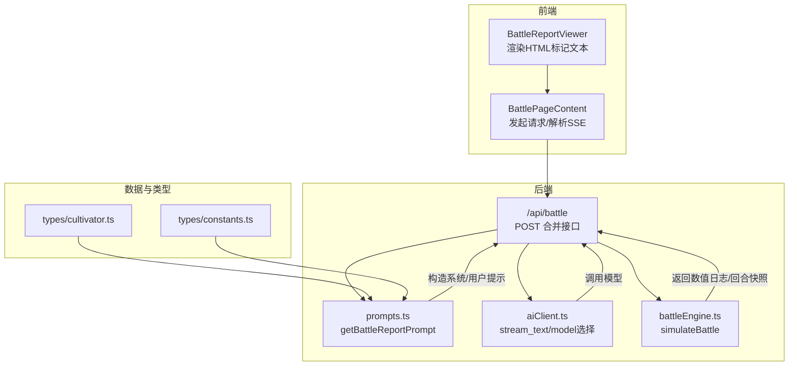
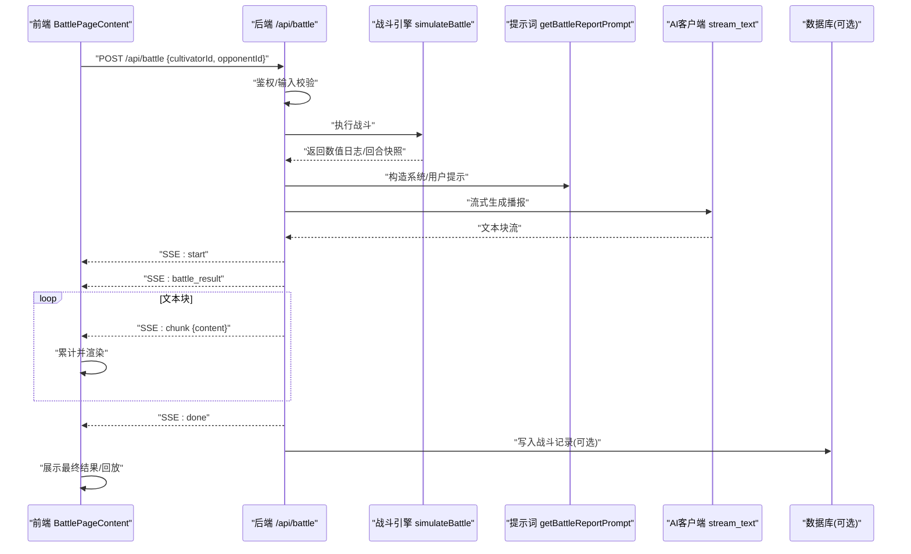
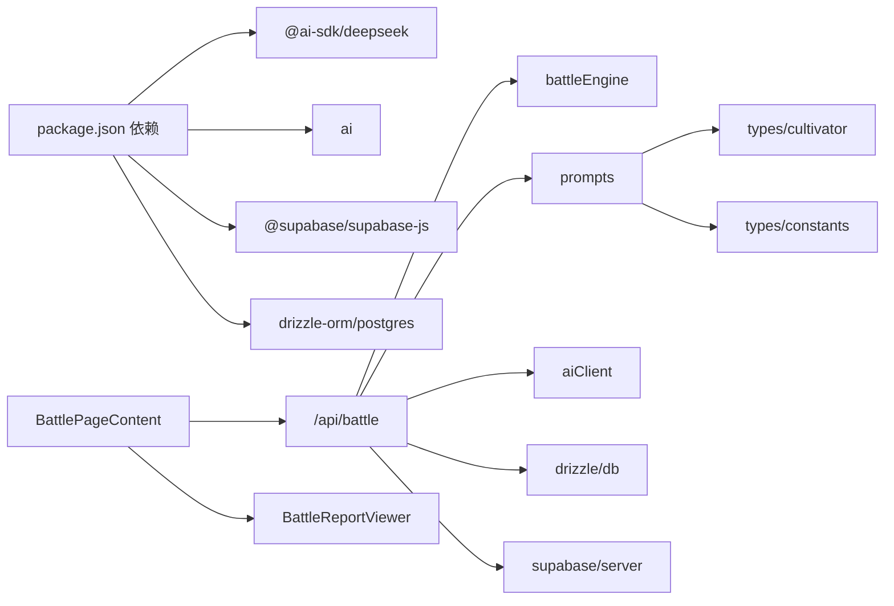

# AI战报生成

<cite>
**本文引用的文件**
- [app/api/battle/route.ts](file://app/api/battle/route.ts)
- [utils/aiClient.ts](file://utils/aiClient.ts)
- [utils/prompts.ts](file://utils/prompts.ts)
- [app/battle/page.tsx](file://app/battle/page.tsx)
- [components/BattleReportViewer.tsx](file://components/BattleReportViewer.tsx)
- [engine/battleEngine.ts](file://engine/battleEngine.ts)
- [types/cultivator.ts](file://types/cultivator.ts)
- [types/constants.ts](file://types/constants.ts)
- [package.json](file://package.json)
</cite>

## 目录
1. [简介](#简介)
2. [项目结构](#项目结构)
3. [核心组件](#核心组件)
4. [架构总览](#架构总览)
5. [详细组件分析](#详细组件分析)
6. [依赖关系分析](#依赖关系分析)
7. [性能考量](#性能考量)
8. [故障排查指南](#故障排查指南)
9. [结论](#结论)

## 简介
本文件面向“AI驱动战斗播报生成系统”的技术文档，聚焦于如何将数值化的战斗日志通过AI模型转化为富有画面感与节奏感的叙事文本。系统围绕以下关键点展开：
- 后端接口合并战斗执行与播报生成，采用SSE流式输出，前端实时接收并渲染。
- 提示词工程由 getBattleReportPrompt 构建，结合玩家、对手与战斗结果，形成上下文丰富的系统提示与用户提示。
- AI客户端 aiClient.ts 封装 DeepSeek 等模型接入，支持多Provider切换与流式/非流式生成。
- 前端 BattlePageContent 通过 fetch + ReadableStream 实现SSE解析，BattleReportViewer 负责渲染HTML标记的文本片段。
- 提示词工程最佳实践涵盖角色设定、风格控制与内容安全过滤；在AI服务失败时提供降级策略（返回原始战斗日志）。

## 项目结构
系统主要由三层构成：
- 后端API层：负责鉴权、战斗执行、提示词构造、AI调用与SSE流式响应。
- AI客户端层：封装模型选择、Provider切换、流式/结构化生成能力。
- 前端展示层：页面发起请求、解析SSE、渲染战斗播报与回放。

图表来源
- [app/api/battle/route.ts](file://app/api/battle/route.ts#L1-L172)
- [utils/prompts.ts](file://utils/prompts.ts#L63-L145)
- [utils/aiClient.ts](file://utils/aiClient.ts#L1-L90)
- [engine/battleEngine.ts](file://engine/battleEngine.ts#L674-L830)
- [app/battle/page.tsx](file://app/battle/page.tsx#L110-L206)
- [components/BattleReportViewer.tsx](file://components/BattleReportViewer.tsx#L1-L108)
- [types/cultivator.ts](file://types/cultivator.ts#L218-L253)
- [types/constants.ts](file://types/constants.ts#L1-L212)

章节来源
- [app/api/battle/route.ts](file://app/api/battle/route.ts#L1-L172)
- [app/battle/page.tsx](file://app/battle/page.tsx#L110-L206)
- [utils/aiClient.ts](file://utils/aiClient.ts#L1-L90)
- [utils/prompts.ts](file://utils/prompts.ts#L63-L145)
- [engine/battleEngine.ts](file://engine/battleEngine.ts#L674-L830)
- [components/BattleReportViewer.tsx](file://components/BattleReportViewer.tsx#L1-L108)
- [types/cultivator.ts](file://types/cultivator.ts#L218-L253)
- [types/constants.ts](file://types/constants.ts#L1-L212)

## 核心组件
- 合并战斗与播报接口：后端统一处理鉴权、战斗执行、提示词构造、AI流式生成与SSE输出。
- AI客户端封装：提供模型选择、Provider切换、流式/结构化生成与JSON解析工具。
- 提示词工程：基于角色与战斗结果生成系统提示与用户提示，规范HTML标记与风格约束。
- 前端SSE解析与渲染：前端发起请求，按行解析SSE事件，实时渲染播报文本与回放。

章节来源
- [app/api/battle/route.ts](file://app/api/battle/route.ts#L1-L172)
- [utils/aiClient.ts](file://utils/aiClient.ts#L1-L90)
- [utils/prompts.ts](file://utils/prompts.ts#L63-L145)
- [app/battle/page.tsx](file://app/battle/page.tsx#L110-L206)
- [components/BattleReportViewer.tsx](file://components/BattleReportViewer.tsx#L1-L108)

## 架构总览
系统采用“后端统一编排 + 前端流式渲染”的模式，核心流程如下：
- 前端调用 /api/battle，携带玩家与对手ID。
- 后端鉴权后，拉取双方角色信息，调用战斗引擎生成数值日志与回合快照。
- 后端构造提示词，调用AI客户端流式生成播报文本。
- 后端以SSE发送“开始”“战斗结果”“文本块”“结束/错误”事件。
- 前端解析SSE，累计文本并渲染，同时展示数值回放。

图表来源
- [app/api/battle/route.ts](file://app/api/battle/route.ts#L1-L172)
- [utils/prompts.ts](file://utils/prompts.ts#L63-L145)
- [utils/aiClient.ts](file://utils/aiClient.ts#L67-L90)
- [engine/battleEngine.ts](file://engine/battleEngine.ts#L674-L830)
- [app/battle/page.tsx](file://app/battle/page.tsx#L110-L206)

## 详细组件分析

### 后端合并接口：/api/battle
- 鉴权与输入校验：使用 Supabase 获取当前用户并校验请求体。
- 战斗执行：通过战斗引擎生成回合日志、回合数、双方剩余气血与回合快照。
- 提示词构造：调用 getBattleReportPrompt，将玩家、对手与战斗结果拼装为系统提示与用户提示。
- 流式生成与SSE：调用 stream_text 获取文本流，逐块发送 data: chunk，结束后发送 done。
- 错误处理：捕获异常，发送 data: error，并关闭流；对外返回JSON错误响应。
- 数据持久化：将战斗结果与完整播报写入数据库（失败不影响前端体验）。

章节来源
- [app/api/battle/route.ts](file://app/api/battle/route.ts#L1-L172)

### AI客户端封装：aiClient.ts
- Provider选择：根据环境变量选择 DeepSeek Provider（OpenAI或Ark）。
- 模型选择：根据 fast 参数选择不同模型（OPENAI_MODEL/FAST_MODEL 或 ARK_*）。
- 流式生成：stream_text 支持开启/关闭 DeepSeek 思维模式，返回可迭代的文本流。
- 结构化生成：generateObject/generateObject(array) 支持Schema约束与重试。
- JSON解析：parseAIResponse 支持提取AI返回中的JSON片段，增强鲁棒性。

章节来源
- [utils/aiClient.ts](file://utils/aiClient.ts#L1-L90)
- [utils/aiClient.ts](file://utils/aiClient.ts#L92-L125)
- [utils/aiClient.ts](file://utils/aiClient.ts#L126-L159)
- [utils/aiClient.ts](file://utils/aiClient.ts#L161-L186)
- [utils/aiClient.ts](file://utils/aiClient.ts#L188-L211)

### 提示词工程：getBattleReportPrompt
- 输入：玩家、对手与战斗结果（包含log、turns、playerHp、opponentHp、winnerId）。
- 系统提示：设定为“修仙题材小说作者”，要求风格热血、古风、有镜头感，限制每回合字数，要求标注HTML标签（回合数、人名、技能、伤害、治疗、效果、胜负）。
- 用户提示：汇总双方角色设定（境界、灵根/属性、技能、功法、先天气运/体质），拼接战斗日志与结论（胜者、回合数、剩余气血），要求输出完整战斗描写。
- 输出：返回二元组 [systemPrompt, userPrompt]，供AI客户端以system/prompt方式注入。

章节来源
- [utils/prompts.ts](file://utils/prompts.ts#L63-L145)

### 前端SSE解析与渲染：BattlePageContent 与 BattleReportViewer
- 请求与解析：前端发起 POST /api/battle，使用 response.body.getReader() 逐块读取，按行切分SSE，解析 data: JSON，分别处理 battle_result、chunk、done、error。
- 实时渲染：累计 fullReport 并传递给 BattleReportViewer；BattleReportViewer 将文本按行渲染，末行显示“流式中”指示；最终结果时渲染胜负与挑战排名信息。
- 回放展示：当存在 timeline 且处于流式或结束态时，展示 BattleTimelineViewer 展示回合快照。

章节来源
- [app/battle/page.tsx](file://app/battle/page.tsx#L110-L206)
- [components/BattleReportViewer.tsx](file://components/BattleReportViewer.tsx#L1-L108)

### 战斗引擎：simulateBattle
- 数据模型：BattleEngineResult 包含 winner、loser、log、turns、playerHp、opponentHp、timeline。
- 行为规则：回合制、状态效果（DOT、控制、增益/减益）、闪避、MP消耗、主动法宝消耗气血等。
- 日志生成：每回合生成结构化日志，包含攻击、治疗、状态施加、闪避、MP恢复等事件，供提示词与回放使用。

章节来源
- [engine/battleEngine.ts](file://engine/battleEngine.ts#L35-L43)
- [engine/battleEngine.ts](file://engine/battleEngine.ts#L674-L830)

### 类型与常量：支撑提示词与渲染
- 角色类型：Cultivator 定义属性、灵根、功法、技能、装备与库存等字段，用于提示词汇总。
- 常量类型：ElementType、SkillType、StatusEffect、RealmType/Stage 等，确保提示词与渲染的一致性。

章节来源
- [types/cultivator.ts](file://types/cultivator.ts#L218-L253)
- [types/constants.ts](file://types/constants.ts#L1-L212)

## 依赖关系分析
- 运行时依赖：@ai-sdk/deepseek、ai、@supabase/supabase-js、drizzle-orm、postgres 等。
- 关键耦合：
  - /api/battle 依赖 battleEngine、prompts、aiClient、supabase、drizzle。
  - 前端 BattlePageContent 依赖 /api/battle 的SSE协议。
  - 提示词依赖角色与常量类型，保证上下文一致性。

图表来源
- [package.json](file://package.json#L1-L54)
- [app/api/battle/route.ts](file://app/api/battle/route.ts#L1-L172)
- [utils/prompts.ts](file://utils/prompts.ts#L63-L145)
- [utils/aiClient.ts](file://utils/aiClient.ts#L1-L90)
- [engine/battleEngine.ts](file://engine/battleEngine.ts#L674-L830)
- [app/battle/page.tsx](file://app/battle/page.tsx#L110-L206)
- [components/BattleReportViewer.tsx](file://components/BattleReportViewer.tsx#L1-L108)
- [types/cultivator.ts](file://types/cultivator.ts#L218-L253)
- [types/constants.ts](file://types/constants.ts#L1-L212)

章节来源
- [package.json](file://package.json#L1-L54)
- [app/api/battle/route.ts](file://app/api/battle/route.ts#L1-L172)

## 性能考量
- 流式传输：SSE逐块推送，前端即时渲染，避免一次性等待完整文本，提升交互流畅度。
- 模型选择：fast 模式可选用更快模型，降低延迟；在需要更高质量时切换到高质量模型。
- 日志规模：战斗日志按回合生成，建议控制回合上限与日志长度，避免提示词过长导致Token溢出。
- 数据库写入：写入战斗记录在后台进行，失败不影响前端体验，但需关注写入失败的可观测性。

## 故障排查指南
- AI服务不可用或超时
  - 现象：SSE未收到 chunk 或 error 事件。
  - 排查：确认 PROVIDER_CHOOSE、OPENAI_* 或 ARK_* 环境变量配置正确；检查网络连通性与速率限制。
  - 降级：当前实现未直接返回原始日志作为备选，可在前端或后端增加兜底逻辑（例如在 error 事件后回退到 battle_result.log 的摘要）。
- SSE解析异常
  - 现象：前端解析 data: 行失败或显示为空。
  - 排查：确认后端编码为 UTF-8，前端按行切分并去除缓冲；检查后端是否正确发送 start/battle_result/chunk/done/error。
- 战斗结果缺失
  - 现象：前端未显示回放或胜负信息。
  - 排查：确认后端已发送 battle_result 事件；检查 timeline 是否存在且非空。
- 提示词过长
  - 现象：AI拒绝或截断。
  - 排查：缩短日志长度、减少角色字段冗余；必要时对日志做摘要。

章节来源
- [app/api/battle/route.ts](file://app/api/battle/route.ts#L120-L171)
- [app/battle/page.tsx](file://app/battle/page.tsx#L160-L197)

## 结论
本系统通过“数值战斗引擎 + AI提示词工程 + SSE流式渲染”的组合，实现了从战斗日志到生动叙事的自动化转换。后端统一编排、AI客户端灵活适配多Provider、前端实时渲染，整体具备良好的扩展性与用户体验。建议后续完善AI服务失败的降级策略（如返回原始日志摘要），并进一步优化提示词长度与结构，以提升稳定性与可维护性。