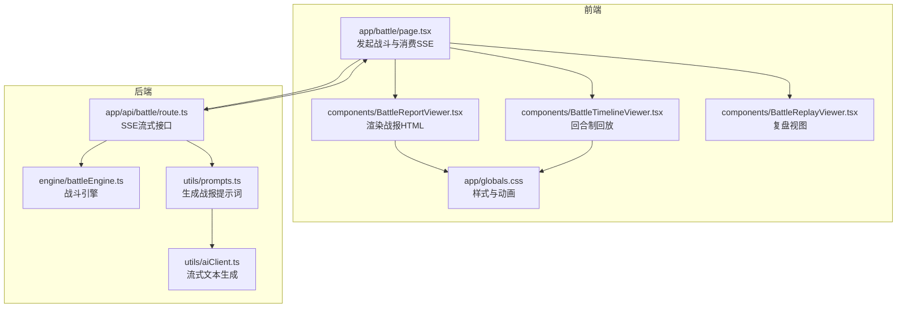
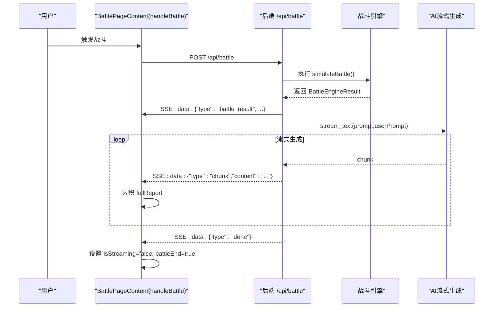
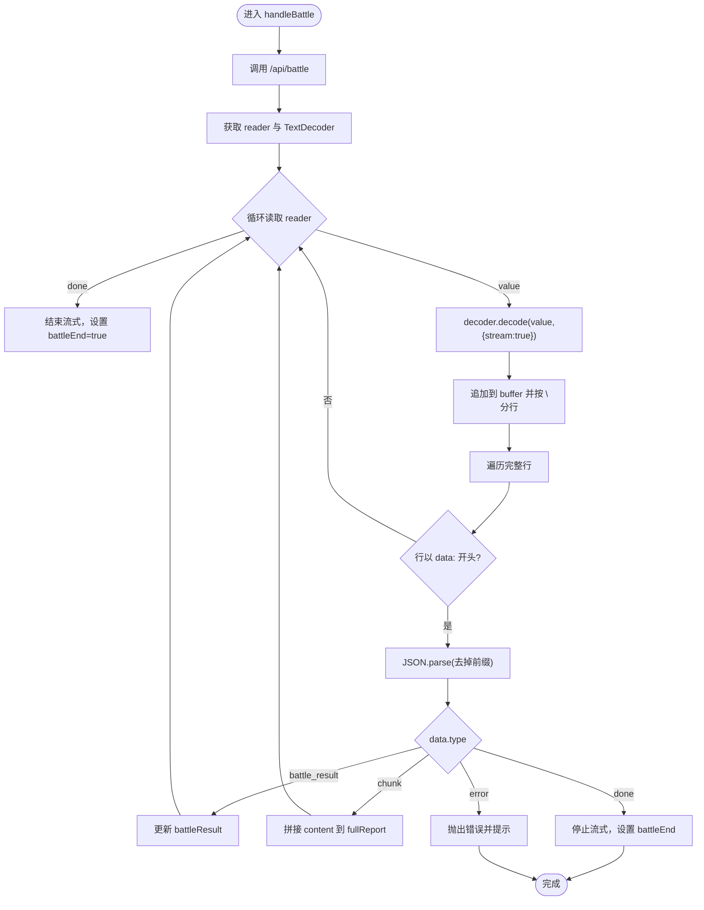
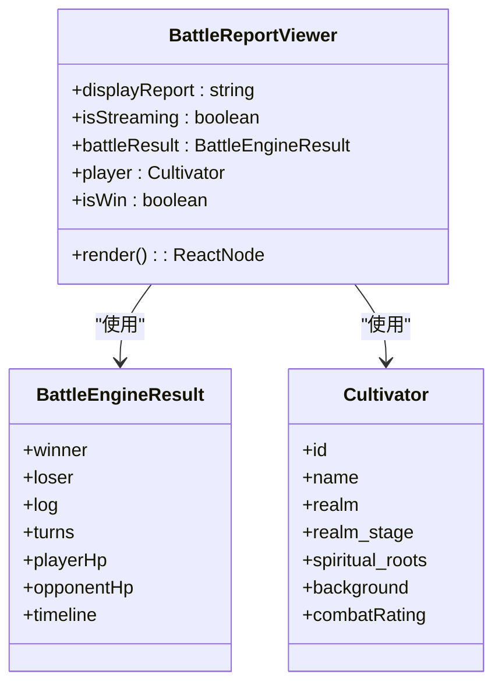
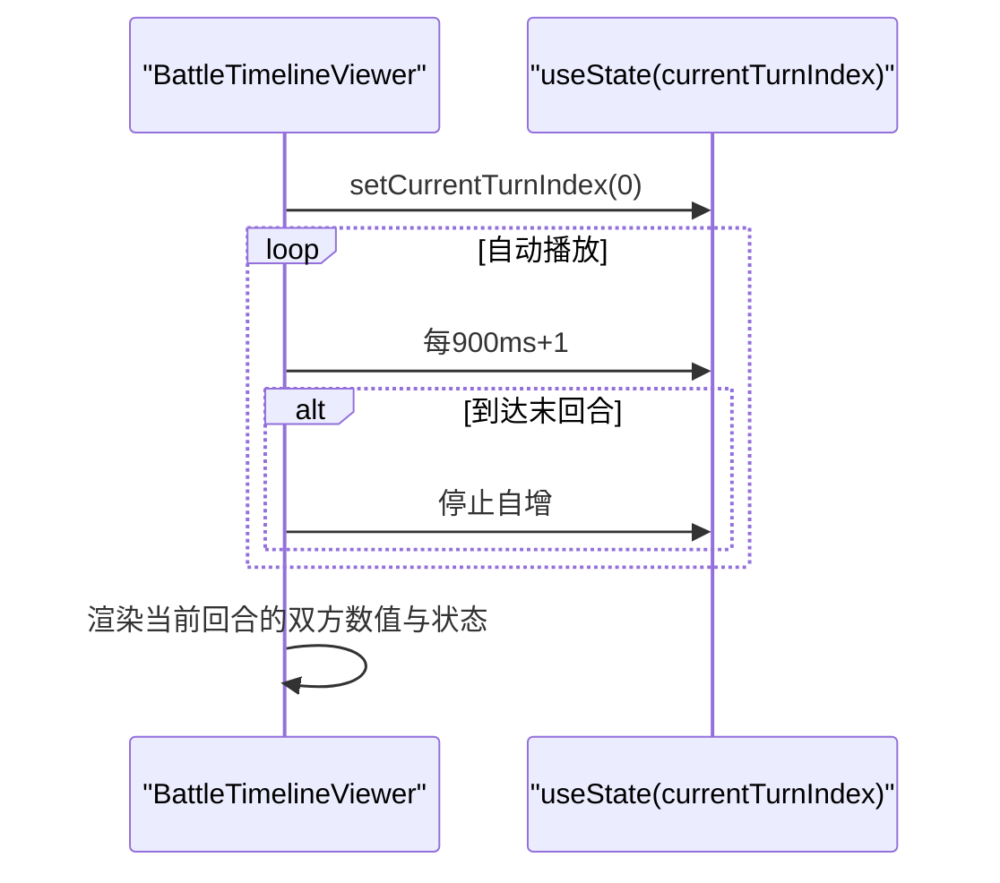
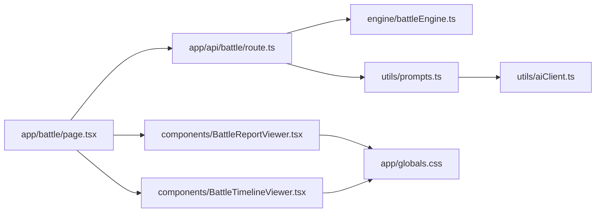

# 前端结果展示

<cite>
**本文引用的文件**
- [app/battle/page.tsx](file://app/battle/page.tsx)
- [components/BattleReportViewer.tsx](file://components/BattleReportViewer.tsx)
- [components/BattleTimelineViewer.tsx](file://components/BattleTimelineViewer.tsx)
- [components/BattleReplayViewer.tsx](file://components/BattleReplayViewer.tsx)
- [app/api/battle/route.ts](file://app/api/battle/route.ts)
- [engine/battleEngine.ts](file://engine/battleEngine.ts)
- [types/cultivator.ts](file://types/cultivator.ts)
- [types/constants.ts](file://types/constants.ts)
- [app/globals.css](file://app/globals.css)
- [utils/aiClient.ts](file://utils/aiClient.ts)
- [utils/prompts.ts](file://utils/prompts.ts)
</cite>

## 目录
1. [简介](#简介)
2. [项目结构](#项目结构)
3. [核心组件](#核心组件)
4. [架构总览](#架构总览)
5. [详细组件分析](#详细组件分析)
6. [依赖关系分析](#依赖关系分析)
7. [性能考量](#性能考量)
8. [故障排查指南](#故障排查指南)
9. [结论](#结论)

## 简介
本文件聚焦于前端战斗结果展示逻辑，围绕页面入口 handleBattle 函数解析与渲染 SSE 流式数据展开，详细说明：
- 如何通过 ReadableStream 读取器逐行解析 SSE 事件，并按 type 分发处理：battle_result 更新战斗数据、chunk 累积战报文本、done 结束流式状态、error 错误提示。
- BattleReportViewer 组件如何使用 dangerouslySetInnerHTML 渲染包含 HTML 标签的 AI 生成内容，并结合 CSS 动画实现打字机效果。
- BattleTimelineViewer 如何将 timeline 数据可视化为回合制战斗回放。
- 前端错误处理策略：网络中断、JSON 解析失败、服务端错误的用户提示。

## 项目结构
本节概述与战斗结果展示直接相关的前后端模块与职责分工：
- 前端页面：app/battle/page.tsx 负责发起战斗、消费 SSE、管理 UI 状态与交互。
- 前端组件：BattleReportViewer.tsx、BattleTimelineViewer.tsx、BattleReplayViewer.tsx 负责渲染战报与回放。
- 后端接口：app/api/battle/route.ts 提供合并的战斗与播报接口，使用 ReadableStream 输出 SSE。
- 引擎与类型：engine/battleEngine.ts 定义战斗引擎与数据结构；types/cultivator.ts、types/constants.ts 定义角色与常量类型。
- 样式与动画：app/globals.css 提供战报样式与淡入、脉冲等动画类。
- AI 与提示词：utils/aiClient.ts、utils/prompts.ts 生成并流式输出战报文本。

图表来源
- [app/battle/page.tsx](file://app/battle/page.tsx#L110-L206)
- [app/api/battle/route.ts](file://app/api/battle/route.ts#L52-L147)
- [engine/battleEngine.ts](file://engine/battleEngine.ts#L674-L830)
- [utils/prompts.ts](file://utils/prompts.ts#L72-L145)
- [utils/aiClient.ts](file://utils/aiClient.ts#L67-L90)
- [components/BattleReportViewer.tsx](file://components/BattleReportViewer.tsx#L1-L108)
- [components/BattleTimelineViewer.tsx](file://components/BattleTimelineViewer.tsx#L1-L141)
- [components/BattleReplayViewer.tsx](file://components/BattleReplayViewer.tsx#L1-L140)
- [app/globals.css](file://app/globals.css#L859-L1037)

章节来源
- [app/battle/page.tsx](file://app/battle/page.tsx#L110-L206)
- [app/api/battle/route.ts](file://app/api/battle/route.ts#L52-L147)

## 核心组件
- 页面入口 handleBattle：负责调用后端合并接口，读取 SSE，按 type 分发处理，维护流式状态与最终结果。
- BattleReportViewer：渲染 AI 生成的带 HTML 标签的战报文本，支持打字机效果与滚动到末尾。
- BattleTimelineViewer：基于 timeline 数据展示回合、气血、灵力与状态，支持自动播放与手动切换。
- BattleReplayViewer：独立的复盘视图，支持手动翻页与结果提示。

章节来源
- [app/battle/page.tsx](file://app/battle/page.tsx#L110-L206)
- [components/BattleReportViewer.tsx](file://components/BattleReportViewer.tsx#L1-L108)
- [components/BattleTimelineViewer.tsx](file://components/BattleTimelineViewer.tsx#L1-L141)
- [components/BattleReplayViewer.tsx](file://components/BattleReplayViewer.tsx#L1-L140)

## 架构总览
SSE 流式数据从后端接口产生，前端 handleBattle 使用 TextDecoder 与 reader 逐块读取，按行切分缓冲区，识别以 data: 开头的事件行，解析 JSON 并根据 type 分发：
- battle_result：写入 battleResult，包含 winner、loser、log、turns、playerHp、opponentHp、timeline。
- chunk：拼接到 fullReport，实时更新 displayReport。
- done：停止流式，标记 battleEnd。
- error：抛出错误并提示。

图表来源
- [app/battle/page.tsx](file://app/battle/page.tsx#L110-L206)
- [app/api/battle/route.ts](file://app/api/battle/route.ts#L52-L147)
- [engine/battleEngine.ts](file://engine/battleEngine.ts#L674-L830)
- [utils/aiClient.ts](file://utils/aiClient.ts#L67-L90)
- [utils/prompts.ts](file://utils/prompts.ts#L72-L145)

## 详细组件分析

### SSE 流式解析与分发（handleBattle）
- 读取器与解码：使用 response.body.getReader() 与 TextDecoder，按流式解码 value。
- 缓冲与分行：buffer 保存未完成行，按 '\n' 切分，最后一个元素作为新 buffer。
- 事件识别：仅处理以 "data: " 开头的行，截取 JSON 部分并解析。
- 分发逻辑：
  - type === 'battle_result'：更新 battleResult，包含 timeline。
  - type === 'chunk'：拼接 content 到 fullReport，并设置 displayReport。
  - type === 'done'：停止流式，标记 battleEnd。
  - type === 'error'：抛错并提示。
- 错误处理：catch 捕获异常，alert 用户提示，重置流式状态。

图表来源
- [app/battle/page.tsx](file://app/battle/page.tsx#L142-L197)

章节来源
- [app/battle/page.tsx](file://app/battle/page.tsx#L110-L206)

### 战报渲染组件 BattleReportViewer
- 渲染策略：displayReport 按行拆分，过滤空行，逐段渲染为段落；最后一段末尾显示脉冲光标，营造打字机效果。
- HTML 安全：使用 dangerouslySetInnerHTML 渲染 AI 生成的带标签文本（如 <turn>、<name>、<skill>、<damage>、<heal>、<effect>、<result>）。
- 结果标记：当非流式且存在 battleResult 时，显示胜负提示；支持挑战模式下的排名更新信息。
- 动画：使用 animate-fade-in 实现淡入；光标使用 animate-pulse 脉冲。

图表来源
- [components/BattleReportViewer.tsx](file://components/BattleReportViewer.tsx#L1-L108)
- [engine/battleEngine.ts](file://engine/battleEngine.ts#L35-L43)
- [types/cultivator.ts](file://types/cultivator.ts#L218-L253)

章节来源
- [components/BattleReportViewer.tsx](file://components/BattleReportViewer.tsx#L1-L108)
- [app/globals.css](file://app/globals.css#L859-L1037)

### 回合制战斗回放 BattleTimelineViewer
- 数据来源：battleResult.timeline，包含每回合的 player/opponent 的 hp/mp/statuses。
- 自动播放：useEffect 每 900ms 前进一回合，支持暂停/播放/上一回合/下一回合。
- 可视化：左右布局展示双方气血、灵力与状态；回合号与总回合数显示；状态列表通过字典映射为中文标签。
- 边界保护：currentTurnIndex 限制在 [0, totalTurns-1]，避免越界。

图表来源
- [components/BattleTimelineViewer.tsx](file://components/BattleTimelineViewer.tsx#L1-L141)
- [engine/battleEngine.ts](file://engine/battleEngine.ts#L23-L33)
- [types/constants.ts](file://types/constants.ts#L26-L61)

章节来源
- [components/BattleTimelineViewer.tsx](file://components/BattleTimelineViewer.tsx#L1-L141)
- [engine/battleEngine.ts](file://engine/battleEngine.ts#L23-L33)
- [types/constants.ts](file://types/constants.ts#L26-L61)

### 复盘视图 BattleReplayViewer（备用）
- 作用：当 timeline 为空时，降级显示纯文本战报；当有 timeline 时，提供手动翻页与结果提示。
- 交互：上一回合/下一回合按钮；回合号与总回合数显示；双方数值与状态展示。
- 适用场景：历史回放或仅文本播报的情况。

章节来源
- [components/BattleReplayViewer.tsx](file://components/BattleReplayViewer.tsx#L1-L140)

## 依赖关系分析
- 前端页面依赖后端接口返回的 SSE 事件结构（type、data、content）。
- 后端接口依赖战斗引擎生成 BattleEngineResult，并通过 AI 流式生成战报文本。
- 组件依赖样式类 animate-fade-in、animate-pulse 与 battle-report 样式体系。
- 类型依赖：Cultivator、BattleEngineResult、StatusEffect 等。

图表来源
- [app/battle/page.tsx](file://app/battle/page.tsx#L110-L206)
- [app/api/battle/route.ts](file://app/api/battle/route.ts#L52-L147)
- [engine/battleEngine.ts](file://engine/battleEngine.ts#L674-L830)
- [utils/prompts.ts](file://utils/prompts.ts#L72-L145)
- [utils/aiClient.ts](file://utils/aiClient.ts#L67-L90)
- [components/BattleReportViewer.tsx](file://components/BattleReportViewer.tsx#L1-L108)
- [components/BattleTimelineViewer.tsx](file://components/BattleTimelineViewer.tsx#L1-L141)
- [app/globals.css](file://app/globals.css#L859-L1037)

章节来源
- [app/battle/page.tsx](file://app/battle/page.tsx#L110-L206)
- [app/api/battle/route.ts](file://app/api/battle/route.ts#L52-L147)
- [engine/battleEngine.ts](file://engine/battleEngine.ts#L674-L830)
- [utils/prompts.ts](file://utils/prompts.ts#L72-L145)
- [utils/aiClient.ts](file://utils/aiClient.ts#L67-L90)
- [components/BattleReportViewer.tsx](file://components/BattleReportViewer.tsx#L1-L108)
- [components/BattleTimelineViewer.tsx](file://components/BattleTimelineViewer.tsx#L1-L141)
- [app/globals.css](file://app/globals.css#L859-L1037)

## 性能考量
- SSE 读取：采用 TextDecoder 流式解码，避免一次性解析大块数据，降低内存峰值。
- 行缓冲：按 '\n' 切分行，减少 JSON 解析次数，提高吞吐。
- 组件渲染：按行渲染，末行显示光标，避免整段重渲染；回放组件使用索引与快照，避免重复计算。
- 自动播放：定时器按固定间隔推进，注意在组件卸载时清理，避免内存泄漏。

[本节为通用建议，无需列出章节来源]

## 故障排查指南
- 网络中断或响应非 OK：handleBattle 在 fetch 失败时会 alert 错误消息并重置状态，确认网络连通与后端路由可达。
- JSON 解析失败：SSE 行解析 try/catch 捕获，若出现异常会记录日志；检查后端发送的 data: 行是否为合法 JSON。
- 服务端错误：后端捕获异常后发送 type:"error" 的事件，前端收到后抛错并提示；检查后端日志定位具体原因。
- 流式未结束：确保后端在写入 fullReport 后发送 type:"done"，否则前端不会停止流式状态。
- 战报 HTML 渲染：dangerouslySetInnerHTML 仅接受字符串，确保后端返回的 content 是合法 HTML 片段；样式通过 battle-report 与 CSS 类名控制。

章节来源
- [app/battle/page.tsx](file://app/battle/page.tsx#L137-L206)
- [app/api/battle/route.ts](file://app/api/battle/route.ts#L129-L144)

## 结论
本文档系统梳理了前端战斗结果展示的完整链路：从前端 handleBattle 的 SSE 读取与分发，到 BattleReportViewer 的 HTML 渲染与打字机动画，再到 BattleTimelineViewer 的回合制回放。通过明确的事件类型与状态管理，实现了流畅的流式体验与清晰的结果呈现。同时，配套的错误处理策略与样式体系保证了用户体验与可维护性。