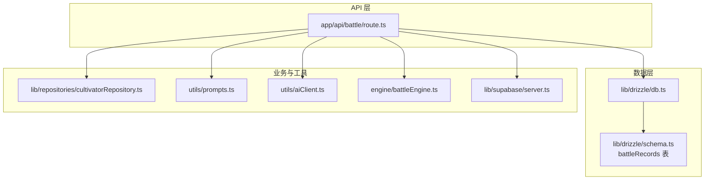
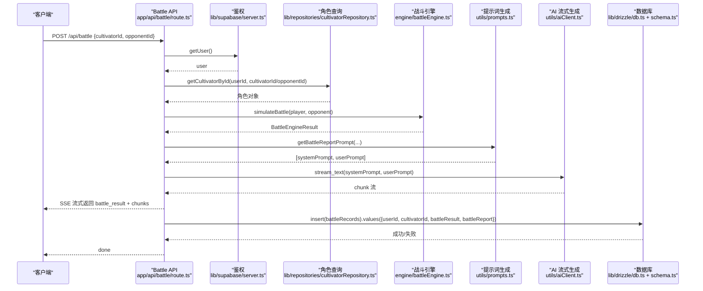
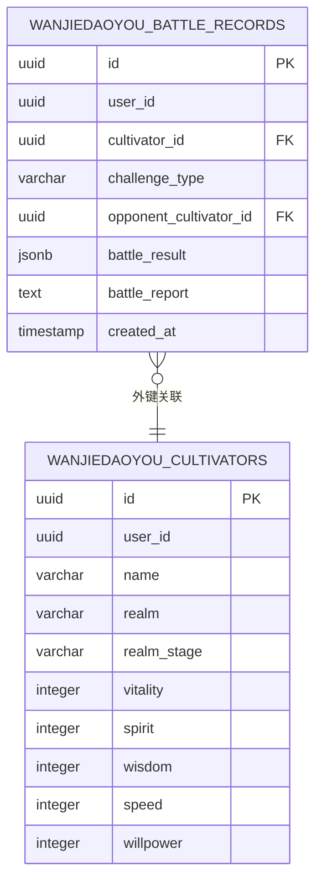
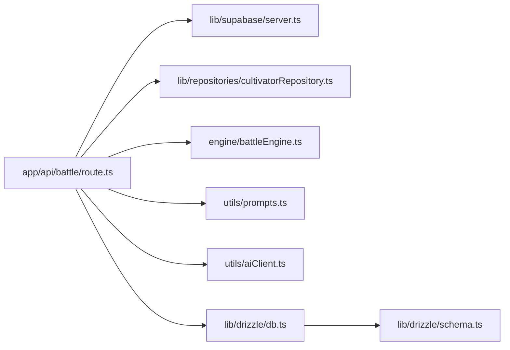

# 战斗结果持久化

<cite>
**本文引用的文件**
- [app/api/battle/route.ts](file://app/api/battle/route.ts)
- [lib/drizzle/schema.ts](file://lib/drizzle/schema.ts)
- [lib/drizzle/db.ts](file://lib/drizzle/db.ts)
- [lib/repositories/cultivatorRepository.ts](file://lib/repositories/cultivatorRepository.ts)
- [utils/prompts.ts](file://utils/prompts.ts)
- [utils/aiClient.ts](file://utils/aiClient.ts)
- [engine/battleEngine.ts](file://engine/battleEngine.ts)
- [lib/supabase/server.ts](file://lib/supabase/server.ts)
</cite>

## 目录
1. [简介](#简介)
2. [项目结构](#项目结构)
3. [核心组件](#核心组件)
4. [架构总览](#架构总览)
5. [详细组件分析](#详细组件分析)
6. [依赖关系分析](#依赖关系分析)
7. [性能考量](#性能考量)
8. [故障排查指南](#故障排查指南)
9. [结论](#结论)

## 简介
本文件围绕“战斗结果持久化”主题，基于后端 API 层的实现，系统性说明战斗结束后如何将战斗数据写入数据库。重点解释以下内容：
- db.insert(battleRecords).values() 的字段来源与作用：userId、cultivatorId、battleResult、battleReport
- battleRecords 表在 schema.ts 中的定义，以及为何 battleResult 使用 JSONB、battleReport 使用 TEXT
- 为什么持久化操作被包裹在 try-catch 中，且写入失败不会中断前端流程（降级处理）
- 数据库写入性能优化建议：批量插入、异步队列、幂等与去重策略

## 项目结构
与战斗结果持久化直接相关的模块分布如下：
- API 层：app/api/battle/route.ts 负责接收请求、执行战斗、生成战报、写入数据库
- 数据层：lib/drizzle/db.ts 提供数据库连接与 drizzle 实例；lib/drizzle/schema.ts 定义 battleRecords 表结构
- 业务辅助：lib/repositories/cultivatorRepository.ts 提供角色查询；utils/prompts.ts 生成战报提示词；utils/aiClient.ts 提供流式文本生成；engine/battleEngine.ts 提供战斗引擎；lib/supabase/server.ts 提供用户鉴权

图表来源
- [app/api/battle/route.ts](file://app/api/battle/route.ts#L1-L172)
- [lib/drizzle/db.ts](file://lib/drizzle/db.ts#L1-L13)
- [lib/drizzle/schema.ts](file://lib/drizzle/schema.ts#L240-L265)
- [lib/repositories/cultivatorRepository.ts](file://lib/repositories/cultivatorRepository.ts#L322-L343)
- [utils/prompts.ts](file://utils/prompts.ts#L63-L145)
- [utils/aiClient.ts](file://utils/aiClient.ts#L67-L90)
- [engine/battleEngine.ts](file://engine/battleEngine.ts#L674-L830)
- [lib/supabase/server.ts](file://lib/supabase/server.ts#L1-L28)

章节来源
- [app/api/battle/route.ts](file://app/api/battle/route.ts#L1-L172)
- [lib/drizzle/schema.ts](file://lib/drizzle/schema.ts#L240-L265)

## 核心组件
- 战斗 API（POST /api/battle）：负责鉴权、参数校验、调用战斗引擎、流式生成战报、最终写入数据库
- 数据库连接与 schema：通过 drizzle 连接 PostgreSQL，battleRecords 表定义了持久化的字段与约束
- 战斗引擎：返回标准化的 BattleEngineResult，包含胜负、日志、回合数、血量、时间线等
- 战报生成：基于提示词模板与战斗结果，流式生成 HTML 化的战报文本
- 角色查询：确保当前用户拥有目标角色，避免越权读取

章节来源
- [app/api/battle/route.ts](file://app/api/battle/route.ts#L1-L172)
- [lib/drizzle/schema.ts](file://lib/drizzle/schema.ts#L240-L265)
- [engine/battleEngine.ts](file://engine/battleEngine.ts#L35-L43)
- [utils/prompts.ts](file://utils/prompts.ts#L63-L145)
- [lib/repositories/cultivatorRepository.ts](file://lib/repositories/cultivatorRepository.ts#L322-L343)

## 架构总览
下面的序列图展示了从请求到数据库写入的关键流程，以及降级处理策略：

图表来源
- [app/api/battle/route.ts](file://app/api/battle/route.ts#L15-L171)
- [lib/supabase/server.ts](file://lib/supabase/server.ts#L1-L28)
- [lib/repositories/cultivatorRepository.ts](file://lib/repositories/cultivatorRepository.ts#L322-L343)
- [engine/battleEngine.ts](file://engine/battleEngine.ts#L674-L830)
- [utils/prompts.ts](file://utils/prompts.ts#L63-L145)
- [utils/aiClient.ts](file://utils/aiClient.ts#L67-L90)
- [lib/drizzle/db.ts](file://lib/drizzle/db.ts#L1-L13)
- [lib/drizzle/schema.ts](file://lib/drizzle/schema.ts#L240-L265)

## 详细组件分析

### 1) db.insert(battleRecords).values() 字段来源与作用
- userId：来自 Supabase 用户会话，保证写入的记录与当前登录用户关联
- cultivatorId：来自请求体，表示本次战斗使用的角色 ID
- battleResult：来自战斗引擎的 BattleEngineResult，包含 winner、loser、log、turns、playerHp、opponentHp、timeline 等字段
- battleReport：来自 AI 流式生成的完整战报文本，逐块拼接而成

这些字段在 API 层被组装并写入 battleRecords 表。写入发生在战斗结果与战报都已生成之后，且处于 try-catch 包裹中，失败不影响前端 SSE 流的返回。

章节来源
- [app/api/battle/route.ts](file://app/api/battle/route.ts#L113-L124)
- [engine/battleEngine.ts](file://engine/battleEngine.ts#L35-L43)
- [utils/aiClient.ts](file://utils/aiClient.ts#L67-L90)

### 2) battleRecords 表定义与字段语义
battleRecords 表的关键字段与约束：
- id：主键
- userId：非空，关联当前登录用户
- cultivatorId：非空，外键指向角色表，用于标识本次战斗使用的角色
- challengeType、opponentCultivatorId：可选字段，支持挑战/被挑战等场景
- battleResult：JSONB，存储 BattleEngineResult 的完整快照，便于后续回放与分析
- battleReport：TEXT，存储完整战报文本，便于前端展示
- createdAt：默认当前时间

字段选择理由：
- battleResult 使用 JSONB：因为 BattleEngineResult 是复杂对象，包含数组、嵌套结构，JSONB 支持高效查询与索引，便于未来做统计与回放
- battleReport 使用 TEXT：战报是长文本，HTML 化后可能较大，TEXT 更适合存储全文内容

章节来源
- [lib/drizzle/schema.ts](file://lib/drizzle/schema.ts#L240-L265)

### 3) 为什么持久化操作被 try-catch 包裹，且失败不中断前端流程
- try-catch 包裹：API 层在写入数据库处显式捕获异常，避免数据库写入失败导致整个请求中断
- 降级处理：即使写入失败，前端仍能收到 battle_result、chunks、done 等事件，用户体验不受影响
- 日志记录：失败时仅记录错误日志，便于后续排查与重试

章节来源
- [app/api/battle/route.ts](file://app/api/battle/route.ts#L113-L124)

### 4) 字段来源与作用的代码路径
- userId：来自 Supabase getUser() 的返回值
- cultivatorId：来自请求体解析
- battleResult：来自 simulateBattle(...) 的返回值
- battleReport：来自 AI 流式生成的 fullReport 累积

章节来源
- [app/api/battle/route.ts](file://app/api/battle/route.ts#L16-L124)
- [lib/supabase/server.ts](file://lib/supabase/server.ts#L1-L28)
- [engine/battleEngine.ts](file://engine/battleEngine.ts#L674-L830)
- [utils/aiClient.ts](file://utils/aiClient.ts#L67-L90)

### 5) 数据模型与关系图

图表来源
- [lib/drizzle/schema.ts](file://lib/drizzle/schema.ts#L240-L265)

## 依赖关系分析
- API 层依赖：
  - Supabase 用户鉴权
  - 角色仓库：确保当前用户拥有目标角色
  - 战斗引擎：生成 BattleEngineResult
  - 提示词生成：构造战报提示词
  - AI 流式生成：逐步累积完整战报
  - 数据库：drizzle + schema 定义
- 数据库层：
  - battleRecords 表字段与类型定义
  - 连接池与事务封装

图表来源
- [app/api/battle/route.ts](file://app/api/battle/route.ts#L1-L172)
- [lib/supabase/server.ts](file://lib/supabase/server.ts#L1-L28)
- [lib/repositories/cultivatorRepository.ts](file://lib/repositories/cultivatorRepository.ts#L322-L343)
- [engine/battleEngine.ts](file://engine/battleEngine.ts#L674-L830)
- [utils/prompts.ts](file://utils/prompts.ts#L63-L145)
- [utils/aiClient.ts](file://utils/aiClient.ts#L67-L90)
- [lib/drizzle/db.ts](file://lib/drizzle/db.ts#L1-L13)
- [lib/drizzle/schema.ts](file://lib/drizzle/schema.ts#L240-L265)

## 性能考量
以下建议基于现有实现与数据库特性，帮助提升写入吞吐与稳定性：
- 批量插入
  - 当前实现按次战斗单条写入。若并发较高，可考虑将多条记录合并为一次 INSERT 语句，减少网络往返与事务开销
  - 适用场景：后台定时聚合、离线批处理
- 异步队列
  - 将写入操作放入消息队列（如 Redis Streams、PostgreSQL LISTEN/NOTIFY 或外部队列），由消费者异步落库
  - 优点：彻底解耦 API 与数据库，避免阻塞请求；缺点：增加系统复杂度与延迟
- 幂等与去重
  - 为 battleRecords 增加唯一键（如 user_id + cultivator_id + created_at 的组合），避免重复写入
  - 在队列消费侧加入幂等校验，防止重复处理
- JSONB 查询与索引
  - 若未来需要按回合数、胜负条件、技能使用等条件检索 battle_result，可在 JSONB 上建立表达式索引，提升查询效率
- 连接池与预处理
  - 当前连接禁用了预处理，适用于事务模式。若改为普通查询，可启用预处理以减少 SQL 解析成本
- 流式写入
  - 战报为长文本，建议在数据库侧使用 TEXT 类型；若需全文检索，可考虑引入向量或全文索引（视业务需求）

[本节为通用性能建议，不直接分析具体文件]

## 故障排查指南
- 常见问题
  - 数据库写入失败：API 层已捕获并记录错误日志，前端不会中断；可通过日志定位具体异常
  - 角色不存在：角色查询失败会抛错并终止流程；检查请求体中的 cultivatorId/opponentId 是否属于当前用户
  - AI 生成异常：流式生成过程中若出现异常，API 层会返回 error 事件并关闭流
- 排查步骤
  - 检查 Supabase 用户会话是否有效
  - 核对请求体字段：cultivatorId、opponentId 是否合法
  - 查看数据库连接字符串与 schema 是否正确加载
  - 检查 AI 服务可用性与响应格式
- 降级策略
  - 即使写入失败，前端仍能正常接收 battle_result 与 chunks，无需重试即可继续使用

章节来源
- [app/api/battle/route.ts](file://app/api/battle/route.ts#L113-L145)
- [lib/repositories/cultivatorRepository.ts](file://lib/repositories/cultivatorRepository.ts#L322-L343)

## 结论
- 战斗结果持久化通过 API 层在战斗完成后进行，字段来源于用户会话、请求体与战斗引擎/AI 生成
- battleRecords 表采用 JSONB 存储 battleResult，TEXT 存储 battleReport，兼顾灵活性与可读性
- try-catch 包裹与降级处理确保写入失败不影响前端体验
- 建议结合批量插入、异步队列、幂等与索引优化，进一步提升性能与可靠性