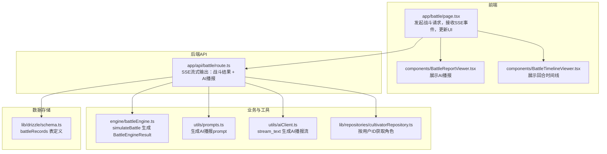
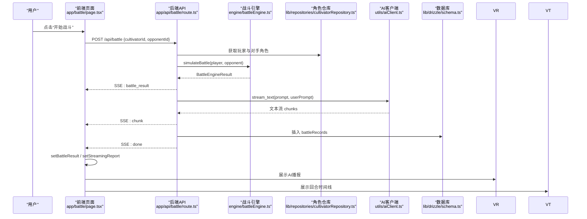
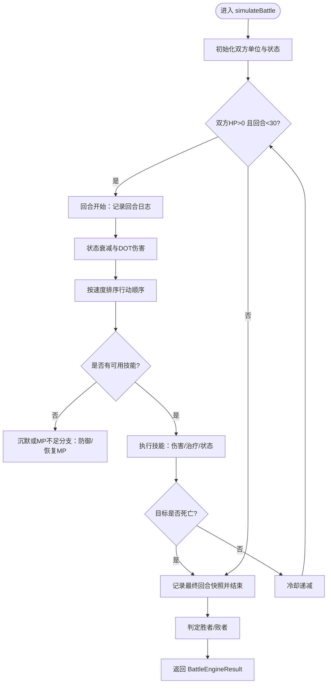
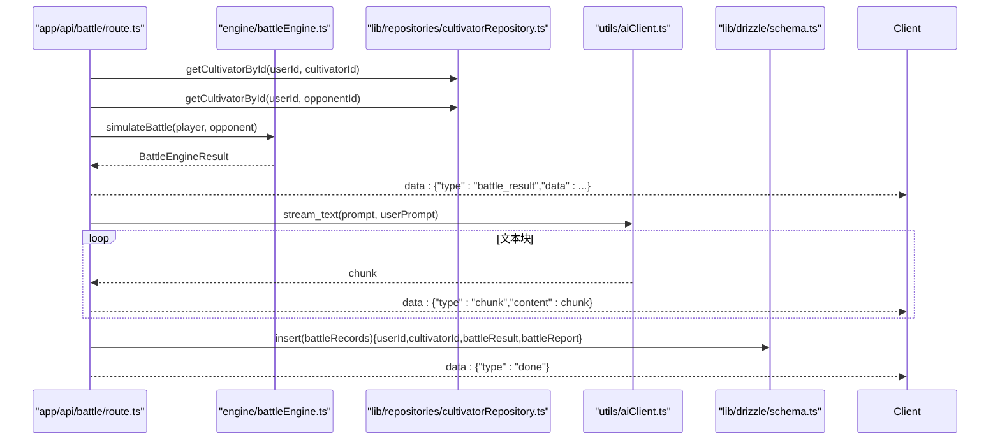
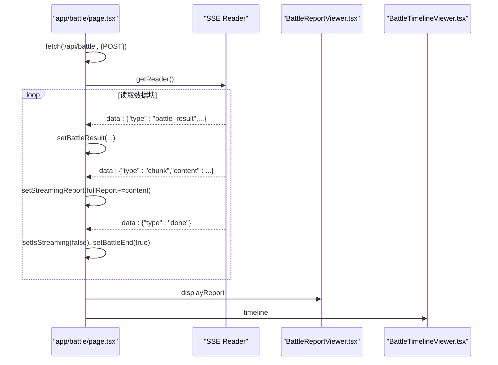
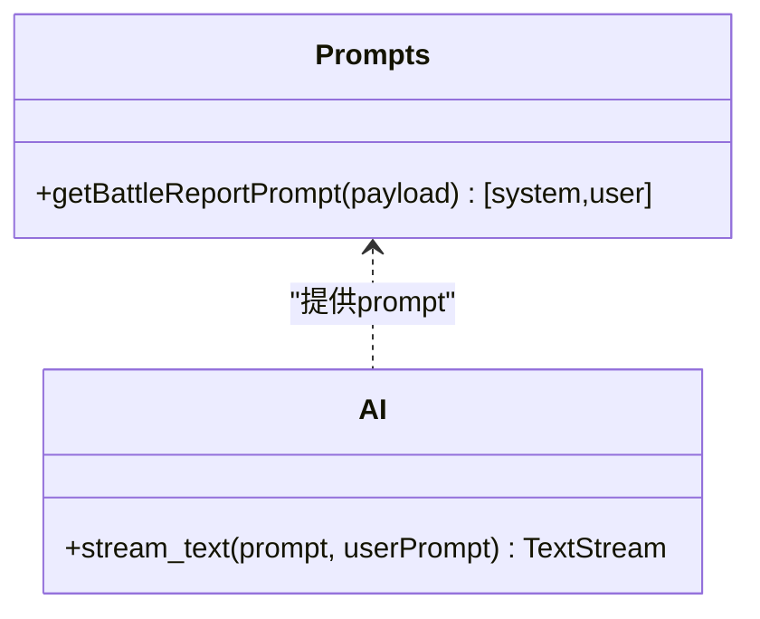
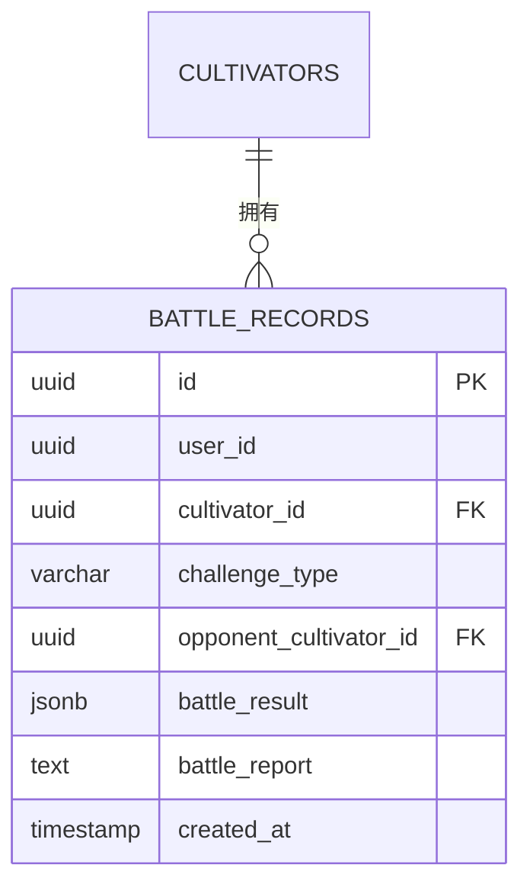
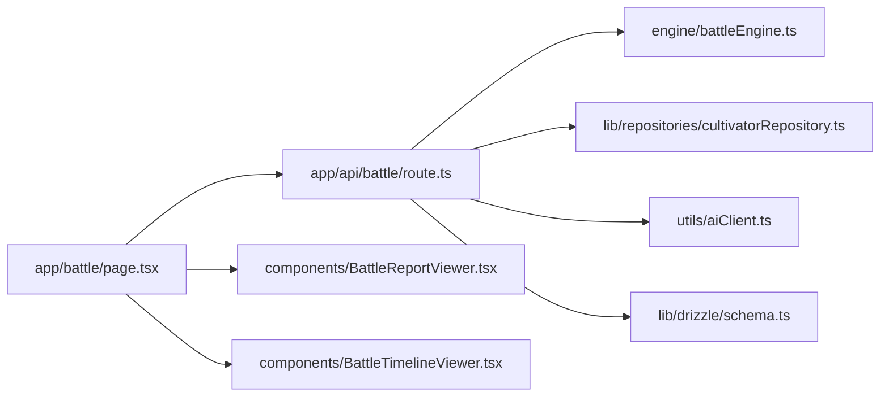

# 结果处理

<cite>
**本文引用的文件**
- [engine/battleEngine.ts](file://engine/battleEngine.ts)
- [app/api/battle/route.ts](file://app/api/battle/route.ts)
- [app/battle/page.tsx](file://app/battle/page.tsx)
- [lib/drizzle/schema.ts](file://lib/drizzle/schema.ts)
- [lib/repositories/cultivatorRepository.ts](file://lib/repositories/cultivatorRepository.ts)
- [utils/aiClient.ts](file://utils/aiClient.ts)
- [utils/prompts.ts](file://utils/prompts.ts)
- [components/BattleReportViewer.tsx](file://components/BattleReportViewer.tsx)
- [components/BattleTimelineViewer.tsx](file://components/BattleTimelineViewer.tsx)
</cite>

## 目录
1. [简介](#简介)
2. [项目结构](#项目结构)
3. [核心组件](#核心组件)
4. [架构总览](#架构总览)
5. [详细组件分析](#详细组件分析)
6. [依赖关系分析](#依赖关系分析)
7. [性能考量](#性能考量)
8. [故障排查指南](#故障排查指南)
9. [结论](#结论)

## 简介
本文件聚焦“战斗结果处理流程”，围绕以下目标展开：
- 基于战斗引擎返回的 BattleEngineResult 对象，解释各字段（胜者、败者、战斗日志、回合数、双方气血、时间线等）的生成逻辑。
- 结合 API 层如何通过 SSE 流式传输战斗结果与 AI 播报（stream_text），以及前端如何接收并更新 UI。
- 说明战斗记录如何持久化到 battleRecords 表。
- 提供结果处理阶段的错误恢复策略（如 AI 服务调用失败时的降级方案）。

## 项目结构
本项目采用前后端分离的 Next.js 应用结构，战斗结果处理贯穿“前端页面 -> API -> 引擎 -> AI -> 数据库”的链路。

图表来源
- [app/battle/page.tsx](file://app/battle/page.tsx#L1-L313)
- [app/api/battle/route.ts](file://app/api/battle/route.ts#L1-L172)
- [engine/battleEngine.ts](file://engine/battleEngine.ts#L673-L828)
- [utils/prompts.ts](file://utils/prompts.ts#L63-L145)
- [utils/aiClient.ts](file://utils/aiClient.ts#L67-L90)
- [lib/repositories/cultivatorRepository.ts](file://lib/repositories/cultivatorRepository.ts#L322-L343)
- [lib/drizzle/schema.ts](file://lib/drizzle/schema.ts#L240-L265)

章节来源
- [app/battle/page.tsx](file://app/battle/page.tsx#L1-L313)
- [app/api/battle/route.ts](file://app/api/battle/route.ts#L1-L172)
- [engine/battleEngine.ts](file://engine/battleEngine.ts#L673-L828)
- [utils/prompts.ts](file://utils/prompts.ts#L63-L145)
- [utils/aiClient.ts](file://utils/aiClient.ts#L67-L90)
- [lib/repositories/cultivatorRepository.ts](file://lib/repositories/cultivatorRepository.ts#L322-L343)
- [lib/drizzle/schema.ts](file://lib/drizzle/schema.ts#L240-L265)

## 核心组件
- 战斗引擎：生成 BattleEngineResult，包含胜者、败者、日志、回合数、双方气血、时间线等。
- API 层：合并战斗与播报，使用 SSE 流式输出，同时持久化战斗记录。
- 前端页面：接收 SSE，更新战斗结果与播报状态，驱动 UI 组件展示。
- 数据库：battleRecords 表存储每次战斗的结果快照与 AI 播报文本。
- AI 客户端与 Prompt：生成 AI 播报的系统提示词与用户提示词，使用 stream_text 生成流式文本。

章节来源
- [engine/battleEngine.ts](file://engine/battleEngine.ts#L35-L43)
- [app/api/battle/route.ts](file://app/api/battle/route.ts#L1-L172)
- [lib/drizzle/schema.ts](file://lib/drizzle/schema.ts#L240-L265)
- [utils/aiClient.ts](file://utils/aiClient.ts#L67-L90)
- [utils/prompts.ts](file://utils/prompts.ts#L63-L145)
- [app/battle/page.tsx](file://app/battle/page.tsx#L1-L313)

## 架构总览
下面的序列图展示了从用户触发战斗到前端展示的完整过程，包括战斗引擎、SSE 输出、AI 播报与数据库持久化。

图表来源
- [app/battle/page.tsx](file://app/battle/page.tsx#L110-L206)
- [app/api/battle/route.ts](file://app/api/battle/route.ts#L52-L129)
- [engine/battleEngine.ts](file://engine/battleEngine.ts#L673-L828)
- [lib/repositories/cultivatorRepository.ts](file://lib/repositories/cultivatorRepository.ts#L322-L343)
- [utils/aiClient.ts](file://utils/aiClient.ts#L67-L90)
- [lib/drizzle/schema.ts](file://lib/drizzle/schema.ts#L240-L265)

## 详细组件分析

### 战斗引擎：BattleEngineResult 字段生成逻辑
- 胜者与败者：根据双方剩余气血与回合数判定，优先考虑一方 HP<=0，否则比较最终气血。
- 日志：每回合推进时记录状态变化、技能释放、伤害/治疗、状态生效等。
- 回合数：从 0 开始推进，每轮双方行动计为 1 回合。
- 双方气血：记录最终剩余气血，便于前端展示与 UI 渲染。
- 时间线：每回合快照包含双方 HP/MP/状态，便于回放与可视化。

图表来源
- [engine/battleEngine.ts](file://engine/battleEngine.ts#L673-L828)

章节来源
- [engine/battleEngine.ts](file://engine/battleEngine.ts#L35-L43)
- [engine/battleEngine.ts](file://engine/battleEngine.ts#L673-L828)

### API 层：SSE 流式传输与持久化
- SSE 开始标记：发送 type=start。
- 获取角色：通过 getCultivatorById 按用户 ID 与角色 ID 获取玩家与对手。
- 执行战斗：调用 simulateBattle 生成 BattleEngineResult。
- 发送战斗结果：封装 battle_result 并通过 SSE 发送。
- 生成播报：使用 getBattleReportPrompt 生成系统提示词与用户提示词。
- 流式生成：调用 stream_text 逐块输出 AI 播报，前端实时展示。
- 持久化：将 battleResult 与 battleReport 写入 battleRecords，失败仅记录日志不影响前端体验。
- 结束标记：发送 type=done。
- 错误处理：捕获异常，发送 type=error，关闭流。

图表来源
- [app/api/battle/route.ts](file://app/api/battle/route.ts#L52-L129)
- [engine/battleEngine.ts](file://engine/battleEngine.ts#L673-L828)
- [lib/repositories/cultivatorRepository.ts](file://lib/repositories/cultivatorRepository.ts#L322-L343)
- [utils/aiClient.ts](file://utils/aiClient.ts#L67-L90)
- [lib/drizzle/schema.ts](file://lib/drizzle/schema.ts#L240-L265)

章节来源
- [app/api/battle/route.ts](file://app/api/battle/route.ts#L1-L172)

### 前端页面：SSE 接收与 UI 更新
- 发起请求：POST /api/battle，携带 cultivatorId 与 opponentId。
- 读取流：使用 Response.body.getReader() 逐块读取，按行解析 data: 行。
- 接收战斗结果：解析 type=battle_result，更新 setBattleResult。
- 接收播报内容：拼接 type=chunk 的 content，更新 setStreamingReport。
- 结束与错误：type=done 结束流；type=error 抛错并提示。
- 展示组件：BattleReportViewer 展示 HTML 化的播报；BattleTimelineViewer 展示回合时间线。

图表来源
- [app/battle/page.tsx](file://app/battle/page.tsx#L110-L206)
- [components/BattleReportViewer.tsx](file://components/BattleReportViewer.tsx#L1-L108)
- [components/BattleTimelineViewer.tsx](file://components/BattleTimelineViewer.tsx#L1-L141)

章节来源
- [app/battle/page.tsx](file://app/battle/page.tsx#L1-L313)
- [components/BattleReportViewer.tsx](file://components/BattleReportViewer.tsx#L1-L108)
- [components/BattleTimelineViewer.tsx](file://components/BattleTimelineViewer.tsx#L1-L141)

### 播报生成：Prompt 与 AI 客户端
- Prompt 生成：getBattleReportPrompt 基于双方角色设定与战斗日志生成系统提示词与用户提示词。
- AI 生成：stream_text 返回可迭代的文本流，API 逐块转发给前端。
- 前端展示：BattleReportViewer 将 HTML 标记渲染为富文本，末行显示打点动画。

图表来源
- [utils/prompts.ts](file://utils/prompts.ts#L63-L145)
- [utils/aiClient.ts](file://utils/aiClient.ts#L67-L90)

章节来源
- [utils/prompts.ts](file://utils/prompts.ts#L63-L145)
- [utils/aiClient.ts](file://utils/aiClient.ts#L67-L90)

### 数据持久化：battleRecords 表
- 字段说明：
  - userId：当前用户 ID。
  - cultivatorId：正式角色 ID（外键到 cultivators）。
  - challengeType/opponentCultivatorId：挑战相关字段（可选）。
  - battleResult：JSONB 存储 BattleEngineResult 的完整快照。
  - battleReport：文本存储 AI 生成的完整播报。
  - createdAt：记录创建时间。
- 写入时机：API 在成功生成播报后插入记录，失败仅记录日志，不影响前端体验。

图表来源
- [lib/drizzle/schema.ts](file://lib/drizzle/schema.ts#L240-L265)

章节来源
- [lib/drizzle/schema.ts](file://lib/drizzle/schema.ts#L240-L265)

## 依赖关系分析
- 模块耦合：
  - app/api/battle/route.ts 依赖 engine/battleEngine.ts、lib/repositories/cultivatorRepository.ts、utils/aiClient.ts、lib/drizzle/schema.ts。
  - app/battle/page.tsx 依赖 utils/aiClient.ts 与 utils/prompts.ts 的调用方（间接）。
  - 组件层（BattleReportViewer、BattleTimelineViewer）依赖 BattleEngineResult 类型。
- 外部依赖：
  - AI 提供商（DeepSeek）通过 utils/aiClient.ts 抽象，支持 Ark 与 OpenAI 两种模式。
  - 数据库使用 drizzle ORM，schema 定义清晰，外键约束明确。

图表来源
- [app/api/battle/route.ts](file://app/api/battle/route.ts#L1-L172)
- [engine/battleEngine.ts](file://engine/battleEngine.ts#L673-L828)
- [lib/repositories/cultivatorRepository.ts](file://lib/repositories/cultivatorRepository.ts#L322-L343)
- [utils/aiClient.ts](file://utils/aiClient.ts#L67-L90)
- [lib/drizzle/schema.ts](file://lib/drizzle/schema.ts#L240-L265)
- [app/battle/page.tsx](file://app/battle/page.tsx#L1-L313)
- [components/BattleReportViewer.tsx](file://components/BattleReportViewer.tsx#L1-L108)
- [components/BattleTimelineViewer.tsx](file://components/BattleTimelineViewer.tsx#L1-L141)

章节来源
- [app/api/battle/route.ts](file://app/api/battle/route.ts#L1-L172)
- [app/battle/page.tsx](file://app/battle/page.tsx#L1-L313)

## 性能考量
- 战斗引擎：
  - 回合上限与状态衰减逻辑避免无限循环，保证性能稳定。
  - 时间线快照按回合生成，空间复杂度与回合数线性相关。
- API 层：
  - SSE 流式输出减少一次性传输压力，前端逐步渲染。
  - AI 文本流逐块推送，避免阻塞。
- 数据库：
  - battleRecords 使用 JSONB 存储完整结果，查询时按需投影，适合离线回放与审计。

[本节为通用建议，无需特定文件引用]

## 故障排查指南
- AI 服务调用失败：
  - 现象：type=error，前端弹窗提示。
  - 处理：API 层捕获异常并发送错误事件；前端停止流并提示用户重试。
  - 降级：即使 AI 失败，战斗结果仍会通过 battle_result 返回，前端可继续展示数值回放与时间线。
- 数据库写入失败：
  - 现象：写入 battleRecords 失败但不影响前端体验。
  - 处理：API 层捕获异常并记录日志，继续发送 done 结束事件。
- SSE 读取异常：
  - 现象：前端解析失败或网络中断。
  - 处理：前端捕获异常并提示用户重试；页面提供“再战”按钮重新发起请求。

章节来源
- [app/api/battle/route.ts](file://app/api/battle/route.ts#L129-L171)
- [app/battle/page.tsx](file://app/battle/page.tsx#L188-L206)

## 结论
本流程通过“战斗引擎 + SSE + AI + 数据库”的组合，实现了从数值战斗到生动播报的完整闭环。BattleEngineResult 作为核心数据载体，承载了胜负、日志、回合与时间线等关键信息；API 层负责将这些信息以流式方式推送到前端，并在后台生成 AI 播报与持久化记录；前端组件负责实时渲染与交互。即便在 AI 服务或数据库出现异常时，系统也具备降级能力，确保用户体验不受影响。