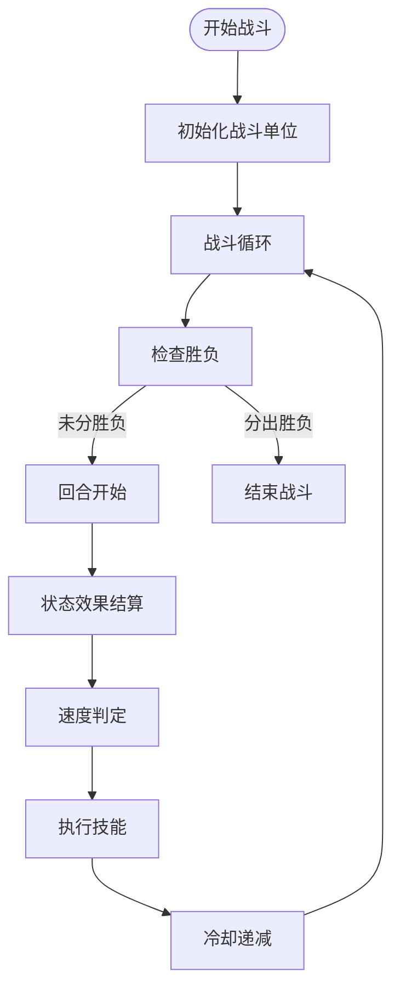
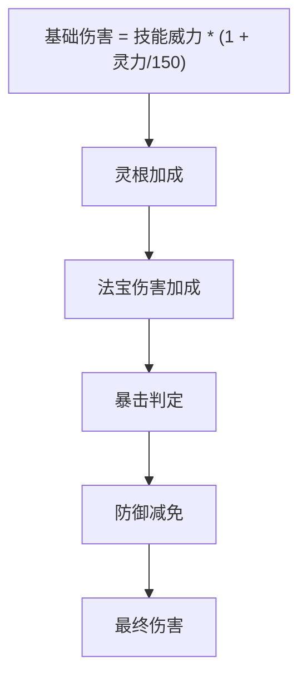
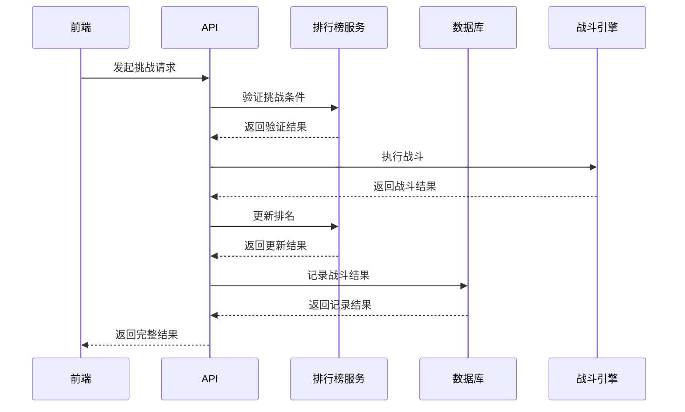
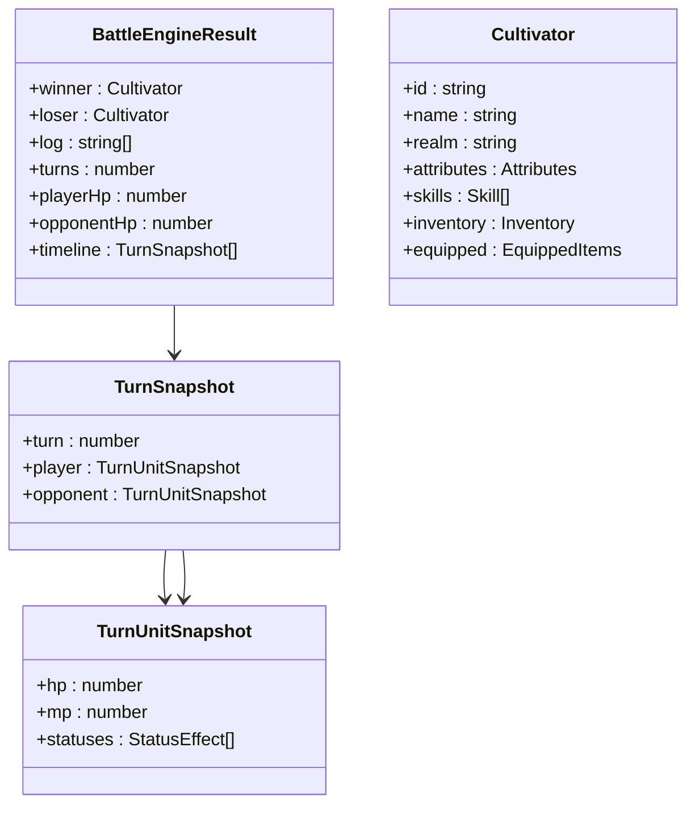
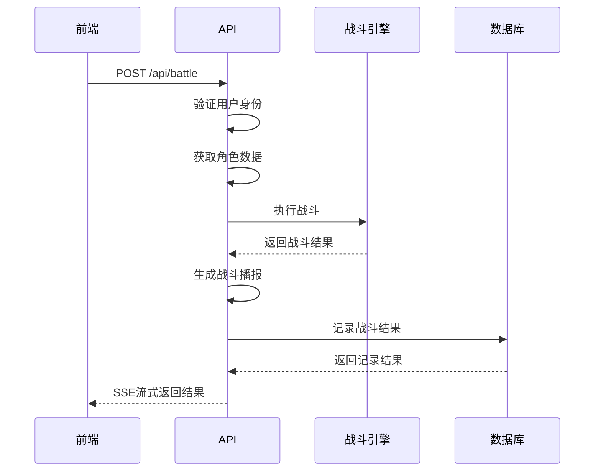
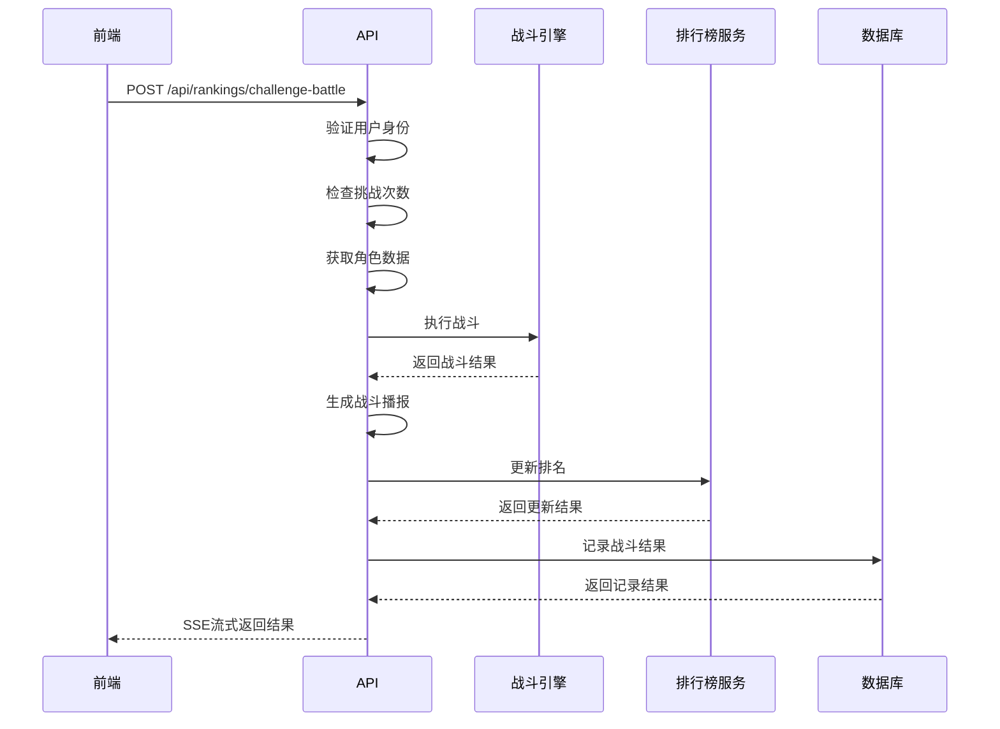
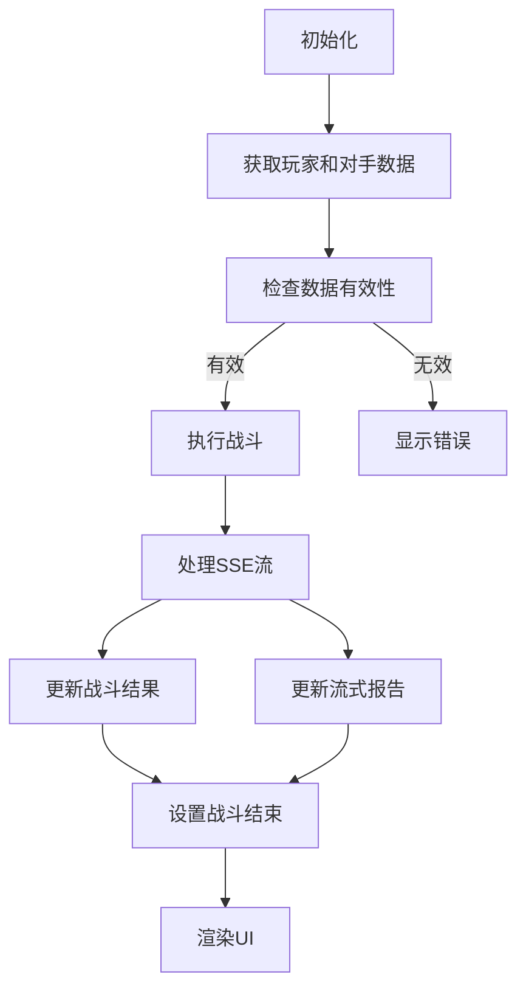
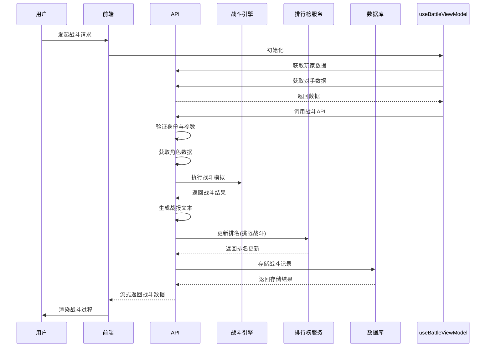

# 战斗系统

<cite>
**本文档引用文件**   
- [useBattleViewModel.tsx](file://app/(main)/battle/hooks/useBattleViewModel.tsx)
- [route.ts](file://app/api/battle/route.ts)
- [BattlePageLayout.tsx](file://components/feature/battle/BattlePageLayout.tsx)
- [BattleReplayViewer.tsx](file://components/feature/battle/BattleReplayViewer.tsx)
- [BattleEngine.v2.ts](file://engine/battle/BattleEngine.v2.ts)
- [BattleEngine.v2.test.ts](file://engine/battle/BattleEngine.v2.test.ts)
- [cultivator.ts](file://types/cultivator.ts)
</cite>

## 更新摘要
**变更内容**   
- 更新了战斗系统架构图，新增useBattleViewModel状态管理
- 新增useBattleViewModel详细说明章节
- 更新前端组件与渲染章节，说明ViewModel集成
- 更新API请求流程，说明SSE流式传输机制
- 更新战斗事件流时序图，反映新的数据流

## 目录
1. [简介](#简介)
2. [战斗系统架构](#战斗系统架构)
3. [核心战斗逻辑](#核心战斗逻辑)
4. [挑战战斗与排行榜](#挑战战斗与排行榜)
5. [战斗数据结构](#战斗数据结构)
6. [API请求流程](#api请求流程)
7. [前端组件与渲染](#前端组件与渲染)
8. [useBattleViewModel详解](#usebattleviewmodel详解)
9. [战斗事件流时序图](#战斗事件流时序图)
10. [性能优化建议](#性能优化建议)
11. [结论](#结论)

## 简介
本系统实现了完整的战斗机制，涵盖普通战斗、挑战战斗、战报回放与历史记录功能。核心逻辑由`BattleEngine.v2.ts`驱动，通过API接口触发战斗并生成流式战报，前端组件通过`useBattleViewModel`管理复杂状态。系统支持战斗报告流式传输和时间线展示，提供流畅的用户体验。

## 战斗系统架构
系统采用分层架构，后端战斗引擎负责计算，API层处理请求，前端ViewModel管理状态，组件负责展示。战斗结果持久化存储于数据库，支持历史回放。

```mermaid
graph TB
subgraph "前端"
A[BattlePageLayout]
B[BattleReplayViewer]
C[useBattleViewModel]
end
subgraph "API层"
D[/api/battle/route.ts]
E[/api/rankings/challenge-battle/route.ts]
end
subgraph "后端"
F[BattleEngine.v2.ts]
G[rankings.ts]
H[schema.ts]
end
C --> D
A --> C
B --> C
D --> F
E --> F
F --> H
G --> H
```

**Diagram sources**
- [useBattleViewModel.tsx](file://app/(main)/battle/hooks/useBattleViewModel.tsx)
- [route.ts](file://app/api/battle/route.ts)
- [BattlePageLayout.tsx](file://components/feature/battle/BattlePageLayout.tsx)
- [BattleReplayViewer.tsx](file://components/feature/battle/BattleReplayViewer.tsx)
- [BattleEngine.v2.ts](file://engine/battle/BattleEngine.v2.ts)
- [schema.ts](file://lib/drizzle/schema.ts)

## 核心战斗逻辑
战斗引擎实现了完整的战斗计算模型，包括伤害公式、状态效果、胜负判定等。

### 战斗计算模型
战斗计算基于角色属性、技能、装备等多维度数据，通过一系列公式计算伤害与效果。



**Diagram sources**
- [BattleEngine.v2.ts](file://engine/battle/BattleEngine.v2.ts#L33-L51)

### 伤害公式
伤害计算综合考虑攻击力、防御力、元素克制、暴击等因素。



**Diagram sources**
- [BattleEngine.v2.ts](file://engine/battle/BattleEngine.v2.ts)

### 胜负判定机制
当任一方气血值降至0或战斗回合达到上限时，判定胜负。

**Section sources**
- [BattleEngine.v2.ts](file://engine/battle/BattleEngine.v2.ts#L352-L357)

## 挑战战斗与排行榜
挑战战斗系统与排行榜深度集成，实现排名更新、挑战次数限制、保护机制等功能。

### 匹配机制
挑战者可选择排名高于自己的对手进行挑战，系统验证挑战条件后执行战斗。

**Section sources**
- [challenge-battle/route.ts](file://app/api/rankings/challenge-battle/route.ts#L125-L128)

### 排行榜联动逻辑
挑战成功后，挑战者与被挑战者排名互换，系统更新排行榜并记录战斗结果。



**Diagram sources**
- [challenge-battle/route.ts](file://app/api/rankings/challenge-battle/route.ts)
- [rankings.ts](file://lib/redis/rankings.ts)
- [schema.ts](file://lib/drizzle/schema.ts)

## 战斗数据结构
系统定义了清晰的数据结构，用于表示战斗相关实体。

### 核心数据结构


**Diagram sources**
- [BattleEngine.v2.ts](file://engine/battle/BattleEngine.v2.ts)
- [cultivator.ts](file://types/cultivator.ts)

## API请求流程
系统提供RESTful API接口，支持触发战斗与获取战斗结果。

### 普通战斗API流程


**Diagram sources**
- [route.ts](file://app/api/battle/route.ts)

### 挑战战斗API流程


**Diagram sources**
- [challenge-battle/route.ts](file://app/api/rankings/challenge-battle/route.ts)

## 前端组件与渲染
前端组件负责展示战斗过程与结果，通过useBattleViewModel管理复杂状态。

### BattlePageLayout组件
作为战斗页面的布局容器，提供统一的页面结构和操作按钮。

**Section sources**
- [BattlePageLayout.tsx](file://components/feature/battle/BattlePageLayout.tsx)

### BattleReplayViewer组件
展示战斗回放，包括数值变化、状态效果和战报文本。

**Section sources**
- [BattleReplayViewer.tsx](file://components/feature/battle/BattleReplayViewer.tsx)

## useBattleViewModel详解
新的useBattleViewModel Hook负责管理战斗页面的复杂状态，支持流式传输和时间线展示。

### 状态管理
useBattleViewModel管理以下状态：
- **数据状态**：玩家、对手、战斗结果
- **加载状态**：整体加载、玩家加载、对手加载
- **流式状态**：流式报告、流式中、战斗结束
- **错误状态**：对手错误

### 主要功能
- **自动初始化**：从URL参数获取对手ID，自动获取玩家和对手数据
- **流式处理**：处理SSE流式响应，实时更新战斗报告
- **战斗执行**：封装战斗API调用，处理错误和状态更新
- **再战功能**：重置状态，重新执行战斗



**Section sources**
- [useBattleViewModel.tsx](file://app/(main)/battle/hooks/useBattleViewModel.tsx#L47-L242)

### 接口定义
```typescript
interface UseBattleViewModelReturn {
  // 数据
  player: Cultivator | null;
  opponent: EnemyData | null;
  battleResult?: BattleEngineResult;

  // 状态
  streamingReport: string;
  isStreaming: boolean;
  loading: boolean;
  playerLoading: boolean;
  opponentLoading: boolean;
  opponentError?: string;
  battleEnd: boolean;

  // 计算属性
  isWin: boolean;
  displayReport: string;
  opponentName: string;

  // 操作
  handleBattleAgain: () => void;
}
```

**Section sources**
- [useBattleViewModel.tsx](file://app/(main)/battle/hooks/useBattleViewModel.tsx#L20-L42)

## 战斗事件流时序图
完整展示战斗从触发到结束的事件流。



**Diagram sources**
- [useBattleViewModel.tsx](file://app/(main)/battle/hooks/useBattleViewModel.tsx)
- [route.ts](file://app/api/battle/route.ts)
- [challenge-battle/route.ts](file://app/api/rankings/challenge-battle/route.ts)
- [BattleEngine.v2.ts](file://engine/battle/BattleEngine.v2.ts)

## 性能优化建议
为提升系统性能与用户体验，提出以下优化建议。

### 战斗日志压缩
对战斗日志进行压缩存储，减少数据库占用空间。

**Section sources**
- [route.ts](file://app/api/battle/route.ts#L115-L121)

### 前端渲染优化
采用虚拟滚动技术优化长列表渲染，减少DOM操作。

**Section sources**
- [BattleTimelineViewer.tsx](file://components/feature/battle/BattleTimelineViewer.tsx)

### 缓存策略
对排行榜数据进行缓存，减少数据库查询压力。

**Section sources**
- [rankings.ts](file://lib/redis/rankings.ts)

## 结论
本战斗系统实现了完整的战斗功能，包括普通战斗、挑战战斗、战报回放与历史记录。通过引入useBattleViewModel，系统能够有效管理复杂状态，支持战斗报告流式传输和时间线展示。系统架构清晰，逻辑严谨，性能优良，为用户提供流畅的战斗体验。