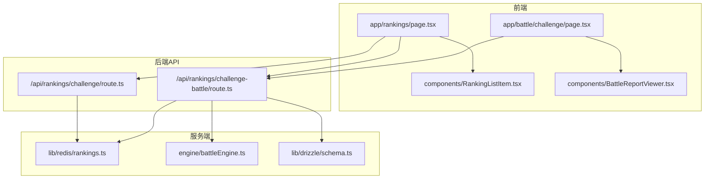
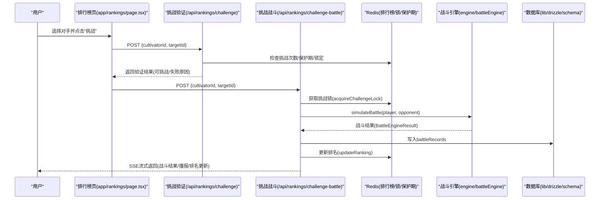
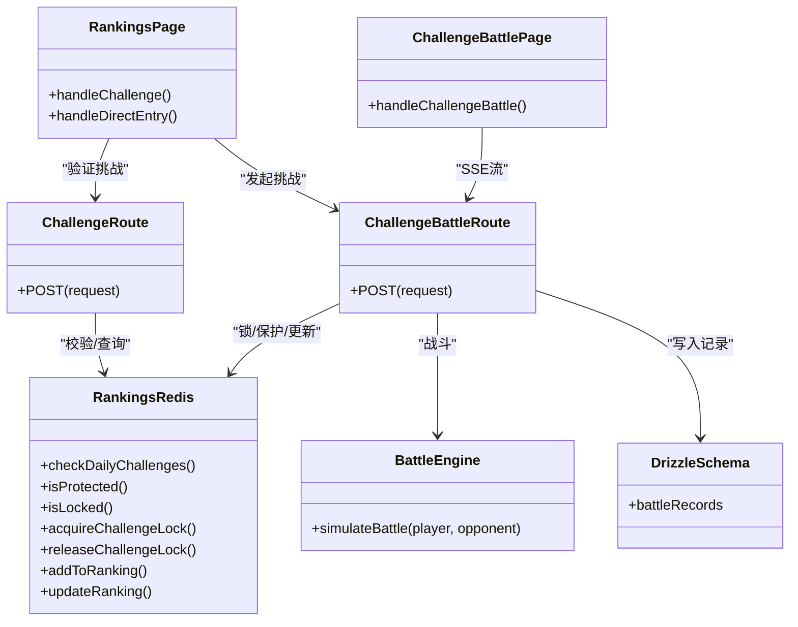

# 挑战机制

<cite>
**本文引用的文件**
- [app/api/rankings/challenge/route.ts](file://app/api/rankings/challenge/route.ts)
- [app/api/rankings/challenge-battle/route.ts](file://app/api/rankings/challenge-battle/route.ts)
- [app/battle/challenge/page.tsx](file://app/battle/challenge/page.tsx)
- [lib/redis/rankings.ts](file://lib/redis/rankings.ts)
- [app/rankings/page.tsx](file://app/rankings/page.tsx)
- [components/RankingListItem.tsx](file://components/RankingListItem.tsx)
- [engine/battleEngine.ts](file://engine/battleEngine.ts)
- [lib/drizzle/schema.ts](file://lib/drizzle/schema.ts)
- [components/BattleReportViewer.tsx](file://components/BattleReportViewer.tsx)
</cite>

## 目录
1. [简介](#简介)
2. [项目结构](#项目结构)
3. [核心组件](#核心组件)
4. [架构总览](#架构总览)
5. [详细组件分析](#详细组件分析)
6. [依赖关系分析](#依赖关系分析)
7. [性能考量](#性能考量)
8. [故障排查指南](#故障排查指南)
9. [结论](#结论)

## 简介
本文件系统化梳理“天骄榜挑战赛”的挑战机制，覆盖匹配逻辑、挑战流程、战斗处理、奖励发放、UI状态管理与防重复挑战策略。重点说明：
- 如何通过 /api/rankings/challenge 获取可挑战对手列表与验证条件
- 如何通过 /api/rankings/challenge-battle 处理挑战战斗请求并流式返回结果
- app/battle/challenge/page.tsx 页面的UI逻辑与状态管理
- 挑战胜利后积分变化与排行榜更新联动
- 挑战失败与冷却时间处理规则，以及如何防止重复挑战

## 项目结构
围绕挑战机制的关键文件分布如下：
- API层：/api/rankings/challenge 与 /api/rankings/challenge-battle
- 前端页面：/battle/challenge 与 /rankings
- 排行榜与并发控制：lib/redis/rankings
- 战斗引擎：engine/battleEngine
- 数据库Schema：lib/drizzle/schema
- UI组件：BattleReportViewer、RankingListItem

图表来源
- [app/rankings/page.tsx](file://app/rankings/page.tsx#L1-L200)
- [app/battle/challenge/page.tsx](file://app/battle/challenge/page.tsx#L1-L120)
- [app/api/rankings/challenge/route.ts](file://app/api/rankings/challenge/route.ts#L1-L148)
- [app/api/rankings/challenge-battle/route.ts](file://app/api/rankings/challenge-battle/route.ts#L1-L120)
- [lib/redis/rankings.ts](file://lib/redis/rankings.ts#L1-L120)
- [engine/battleEngine.ts](file://engine/battleEngine.ts#L674-L830)
- [lib/drizzle/schema.ts](file://lib/drizzle/schema.ts#L1-L120)

章节来源
- [app/rankings/page.tsx](file://app/rankings/page.tsx#L1-L200)
- [app/battle/challenge/page.tsx](file://app/battle/challenge/page.tsx#L1-L120)
- [app/api/rankings/challenge/route.ts](file://app/api/rankings/challenge/route.ts#L1-L148)
- [app/api/rankings/challenge-battle/route.ts](file://app/api/rankings/challenge-battle/route.ts#L1-L120)
- [lib/redis/rankings.ts](file://lib/redis/rankings.ts#L1-L120)

## 核心组件
- 挑战验证API：负责校验挑战次数、目标是否在榜、保护期与锁定状态，并返回可挑战参数
- 挑战战斗API：执行战斗、流式返回战斗结果与AI播报、更新排名、记录战斗日志
- 挑战战斗页面：接收参数、发起SSE流、渲染战斗回放与播报、展示排名更新
- 排行榜Redis服务：提供排名查询、新增、更新、保护期、挑战锁、每日挑战次数等
- 战斗引擎：模拟回合制战斗，产出胜负、日志、回合时间线
- 数据库Schema：定义战斗记录表结构，用于持久化挑战记录

章节来源
- [app/api/rankings/challenge/route.ts](file://app/api/rankings/challenge/route.ts#L1-L148)
- [app/api/rankings/challenge-battle/route.ts](file://app/api/rankings/challenge-battle/route.ts#L1-L285)
- [app/battle/challenge/page.tsx](file://app/battle/challenge/page.tsx#L1-L200)
- [lib/redis/rankings.ts](file://lib/redis/rankings.ts#L1-L200)
- [engine/battleEngine.ts](file://engine/battleEngine.ts#L674-L830)
- [lib/drizzle/schema.ts](file://lib/drizzle/schema.ts#L1-L120)

## 架构总览
挑战机制采用前后端分离的API模式，前端通过两个API完成挑战链路：先验证，再战斗；战斗过程以SSE流式返回，最终更新排行榜并持久化记录。

图表来源
- [app/rankings/page.tsx](file://app/rankings/page.tsx#L149-L193)
- [app/api/rankings/challenge/route.ts](file://app/api/rankings/challenge/route.ts#L1-L148)
- [app/api/rankings/challenge-battle/route.ts](file://app/api/rankings/challenge-battle/route.ts#L1-L285)
- [lib/redis/rankings.ts](file://lib/redis/rankings.ts#L342-L380)
- [engine/battleEngine.ts](file://engine/battleEngine.ts#L674-L830)
- [lib/drizzle/schema.ts](file://lib/drizzle/schema.ts#L1-L120)

## 详细组件分析

### 挑战验证API：/api/rankings/challenge
职责与流程要点：
- 身份校验：通过Supabase获取当前登录用户
- 输入校验：要求提供有效的挑战者角色ID
- 挑战次数限制：每日最多10次，超过则拒绝
- 直接上榜：若排行榜为空且挑战者不在榜上，挑战者直接上榜（不消耗挑战次数）
- 目标校验：若提供targetId，需确保目标在榜
- 保护期与锁定：目标若处于新天骄保护期（默认2小时）或已被锁定（挑战中），则拒绝
- 返回：验证通过后返回挑战参数（双方排名、剩余挑战次数）

关键行为与约束：
- 支持“直接上榜”场景，避免空榜时无人挑战导致榜单停滞
- 保护期与锁定双重防护，防止恶意刷榜与并发冲突
- 未提供targetId或格式错误时，明确返回错误信息

章节来源
- [app/api/rankings/challenge/route.ts](file://app/api/rankings/challenge/route.ts#L1-L148)
- [lib/redis/rankings.ts](file://lib/redis/rankings.ts#L272-L326)
- [lib/redis/rankings.ts](file://lib/redis/rankings.ts#L327-L341)
- [lib/redis/rankings.ts](file://lib/redis/rankings.ts#L342-L380)

### 挑战战斗API：/api/rankings/challenge-battle
职责与流程要点：
- 身份校验与输入校验同上
- 直接上榜分支：排行榜为空且挑战者不在榜上时，直接上榜并结束（不消耗挑战次数）
- 挑战分支：
  - 获取挑战锁（acquireChallengeLock），避免并发挑战同一对手
  - 回表获取对手完整信息
  - 调用战斗引擎simulateBattle，产出战斗结果
  - 流式生成AI战斗播报（SSE）
  - 挑战成功则更新排名（updateRanking），失败不变更
  - 记录battleRecords（包含挑战类型、对手ID、战斗结果、播报文本）
  - 返回排名更新与剩余挑战次数
- 错误处理：捕获异常并以SSE发送错误事件，最终释放挑战锁

SSE事件类型：
- start：开始标记
- direct_entry：直接上榜
- battle_result：战斗结果（赢家、输家、日志、回合数、血量、时间线）
- chunk：AI播报片段
- ranking_update：排名更新（是否获胜、挑战者/对手新排名、剩余挑战次数）
- done：结束标记
- error：错误事件

章节来源
- [app/api/rankings/challenge-battle/route.ts](file://app/api/rankings/challenge-battle/route.ts#L1-L285)
- [engine/battleEngine.ts](file://engine/battleEngine.ts#L674-L830)
- [lib/redis/rankings.ts](file://lib/redis/rankings.ts#L187-L271)
- [lib/drizzle/schema.ts](file://lib/drizzle/schema.ts#L1-L120)

### 挑战战斗页面：app/battle/challenge/page.tsx
职责与流程要点：
- 初始化：并行获取玩家信息与自动发起挑战（避免等待）
- 发起挑战：POST /api/rankings/challenge-battle，读取SSE流
- 解析SSE：按事件类型更新UI状态（战斗结果、播报、排名更新、完成态）
- 展示：数值回放（BattleTimelineViewer）、战斗播报（BattleReportViewer）、返回按钮
- 失败处理：捕获错误并提示，保持loading状态直至结束

状态管理：
- player/opponent：挑战者/对手角色
- battleResult：战斗结果（赢家、日志、回合数、血量、时间线）
- streamingReport：AI播报累计文本
- isStreaming/battleEnd：流式播报状态
- rankingUpdate：排名更新信息
- directEntry：直接上榜信息
- error/loading：错误与加载状态

章节来源
- [app/battle/challenge/page.tsx](file://app/battle/challenge/page.tsx#L1-L200)
- [components/BattleReportViewer.tsx](file://components/BattleReportViewer.tsx#L69-L107)

### 排行榜与并发控制：lib/redis/rankings.ts
- 排行榜存储：使用有序集合维护排名，支持查询、插入、调整、裁剪（最多100人）
- 新天骄保护期：新上榜角色在一段时间内不可被挑战（默认30分钟）
- 挑战锁：为对手设置分布式锁，避免并发挑战
- 每日挑战次数：按日期维度统计，每日上限10次
- 排名更新：挑战成功时原子性地调整双方名次与后续成员排名

章节来源
- [lib/redis/rankings.ts](file://lib/redis/rankings.ts#L1-L120)
- [lib/redis/rankings.ts](file://lib/redis/rankings.ts#L187-L271)
- [lib/redis/rankings.ts](file://lib/redis/rankings.ts#L272-L326)
- [lib/redis/rankings.ts](file://lib/redis/rankings.ts#L327-L380)

### 战斗引擎：engine/battleEngine.ts
- 模拟回合制战斗，支持状态效果、技能冷却、闪避、暴击、元素相克等
- 输出BattleEngineResult：赢家、输家、日志、回合数、血量、时间线
- 为挑战战斗提供稳定的战斗结果与回放数据

章节来源
- [engine/battleEngine.ts](file://engine/battleEngine.ts#L674-L830)

### 数据库Schema：lib/drizzle/schema.ts
- battleRecords：记录挑战类型、挑战者ID、对手ID、战斗结果、AI播报文本等
- 用于挑战后持久化记录，便于审计与复盘

章节来源
- [lib/drizzle/schema.ts](file://lib/drizzle/schema.ts#L1-L120)

## 依赖关系分析

图表来源
- [app/api/rankings/challenge/route.ts](file://app/api/rankings/challenge/route.ts#L1-L148)
- [app/api/rankings/challenge-battle/route.ts](file://app/api/rankings/challenge-battle/route.ts#L1-L285)
- [lib/redis/rankings.ts](file://lib/redis/rankings.ts#L1-L200)
- [engine/battleEngine.ts](file://engine/battleEngine.ts#L674-L830)
- [lib/drizzle/schema.ts](file://lib/drizzle/schema.ts#L1-L120)
- [app/rankings/page.tsx](file://app/rankings/page.tsx#L149-L193)
- [app/battle/challenge/page.tsx](file://app/battle/challenge/page.tsx#L87-L200)

章节来源
- [app/api/rankings/challenge/route.ts](file://app/api/rankings/challenge/route.ts#L1-L148)
- [app/api/rankings/challenge-battle/route.ts](file://app/api/rankings/challenge-battle/route.ts#L1-L285)
- [lib/redis/rankings.ts](file://lib/redis/rankings.ts#L1-L200)
- [engine/battleEngine.ts](file://engine/battleEngine.ts#L674-L830)
- [lib/drizzle/schema.ts](file://lib/drizzle/schema.ts#L1-L120)
- [app/rankings/page.tsx](file://app/rankings/page.tsx#L149-L193)
- [app/battle/challenge/page.tsx](file://app/battle/challenge/page.tsx#L87-L200)

## 性能考量
- Redis有序集合：排名查询、插入、更新均在O(logN)级别，适合高频挑战场景
- 挑战锁：使用SET NX EX实现分布式锁，避免并发冲突，降低脏写风险
- SSE流式输出：前端边播边渲染，减少一次性传输压力
- 每日挑战次数：按日期键统计，TTL至午夜，天然分片，避免跨日竞争
- 战斗引擎：回合制模拟，复杂度与回合数线性相关，合理限制最大回合数

[本节为通用性能讨论，无需列出具体代码来源]

## 故障排查指南
常见问题与定位建议：
- 未授权访问：确认登录态与Supabase认证
- 挑战次数用尽：查看当日剩余挑战次数，等待次日重置
- 目标保护期：等待保护期结束（默认30分钟）
- 目标被锁定：等待对手挑战完成（挑战锁自动释放）
- 目标不在榜：确认目标是否在排行榜中
- 直接上榜失败：确认排行榜是否为空且挑战者不在榜
- 挑战失败：检查SSE错误事件，关注网络与服务端异常
- 排名未更新：确认挑战是否成功（仅胜利时更新），并检查SSE ranking_update事件

章节来源
- [app/api/rankings/challenge/route.ts](file://app/api/rankings/challenge/route.ts#L1-L148)
- [app/api/rankings/challenge-battle/route.ts](file://app/api/rankings/challenge-battle/route.ts#L1-L285)
- [lib/redis/rankings.ts](file://lib/redis/rankings.ts#L272-L380)

## 结论
本挑战机制通过严格的前置验证、分布式锁与保护期策略，保障了天骄榜挑战的公平性与稳定性；SSE流式播报提升了用户体验；战斗结果与排名更新联动，形成闭环。建议在生产环境中：
- 监控Redis键空间与锁命中率
- 优化SSE事件粒度，减少前端解析开销
- 对AI播报进行缓存与降噪，提升吞吐
- 定期清理历史battleRecords，控制数据库膨胀