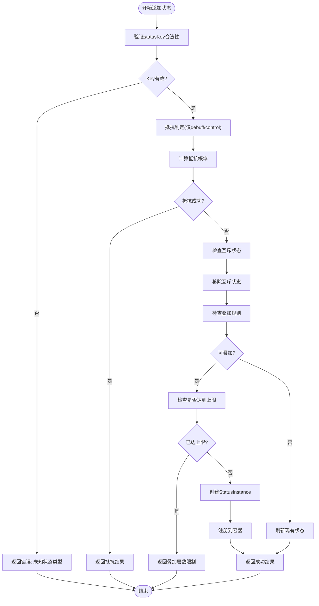
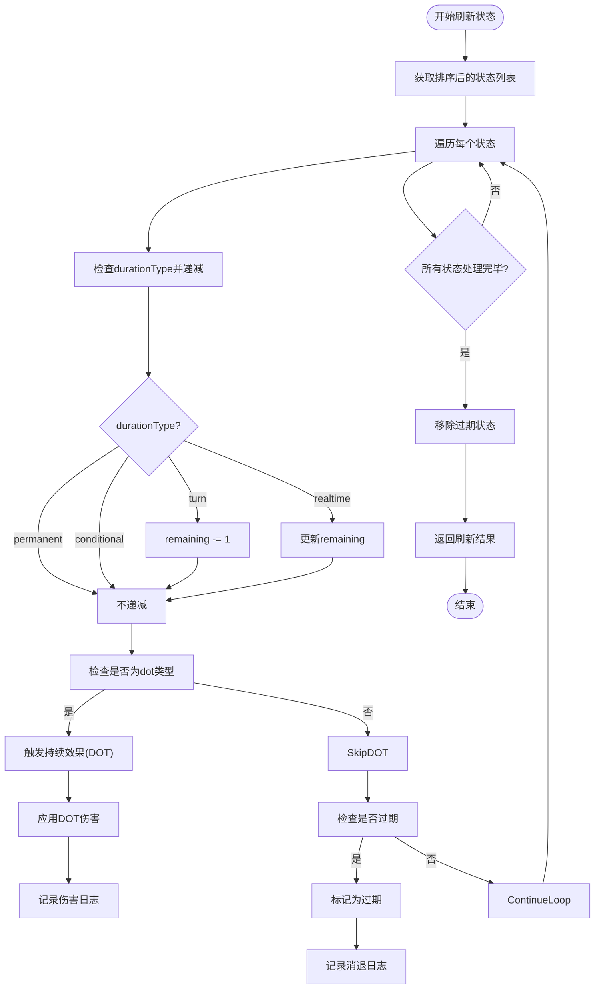
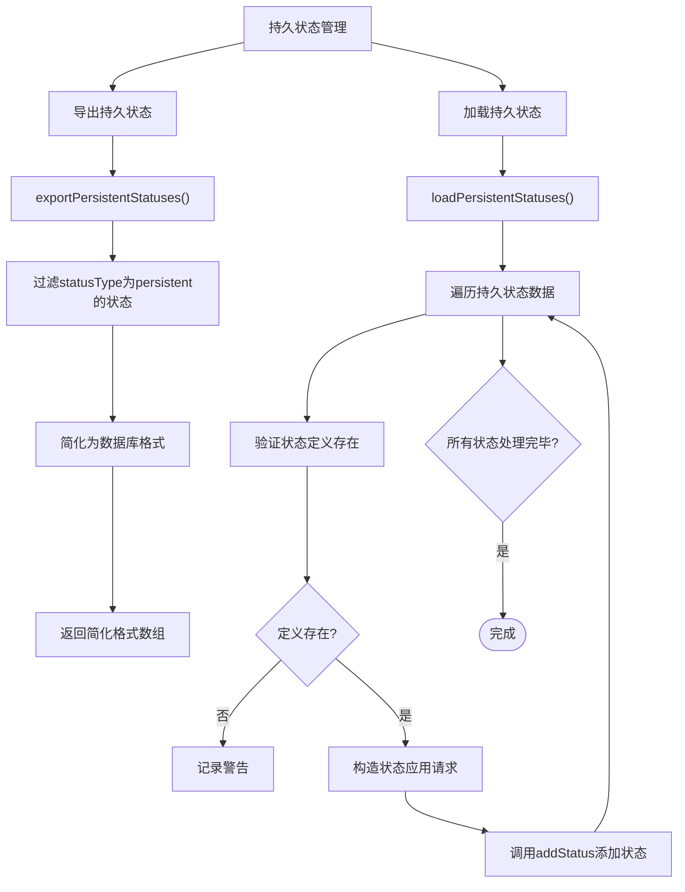
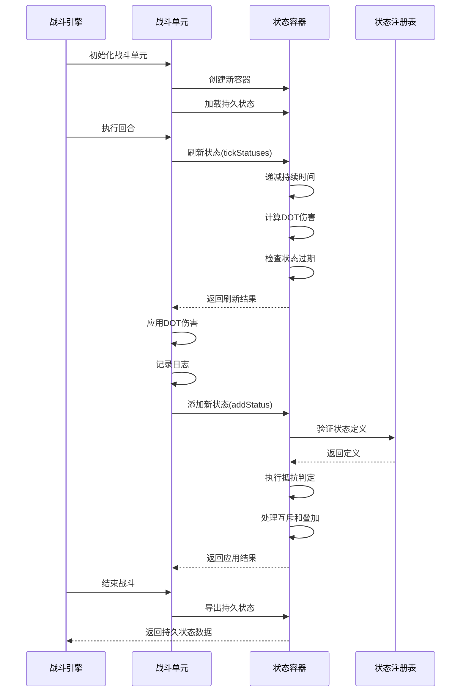
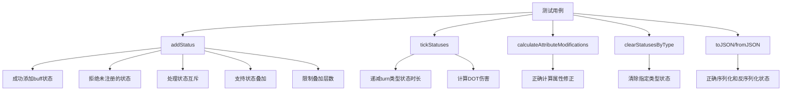

# 状态管理容器

<cite>
**本文档引用文件**   
- [StatusContainer.ts](file://engine/status/StatusContainer.ts)
- [StatusContainer.test.ts](file://engine/status/StatusContainer.test.ts)
- [StatusRegistry.ts](file://engine/status/StatusRegistry.ts)
- [types.ts](file://engine/status/types.ts)
- [AttributeModifierCalculator.ts](file://engine/status/calculators/AttributeModifierCalculator.ts)
- [DamageOverTimeCalculator.ts](file://engine/status/calculators/DamageOverTimeCalculator.ts)
- [ResistanceCalculator.ts](file://engine/status/calculators/ResistanceCalculator.ts)
- [ActionBlockerCalculator.ts](file://engine/status/calculators/ActionBlockerCalculator.ts)
- [BattleEngine.v2.ts](file://engine/battle/BattleEngine.v2.ts)
- [BattleUnit.ts](file://engine/battle/BattleUnit.ts)
- [constants.ts](file://types/constants.ts)
</cite>

## 目录
1. [简介](#简介)
2. [核心组件](#核心组件)
3. [状态容器架构](#状态容器架构)
4. [状态类型与定义](#状态类型与定义)
5. [状态应用流程](#状态应用流程)
6. [状态刷新机制](#状态刷新机制)
7. [持久状态管理](#持久状态管理)
8. [状态效果计算](#状态效果计算)
9. [状态容器交互](#状态容器交互)
10. [测试验证](#测试验证)
11. [结论](#结论)

## 简介
状态管理容器是本项目中负责管理角色临时状态的核心组件。它提供了一套完整的状态管理系统，支持多种状态类型、叠加规则、互斥机制和效果计算。该系统被集成在战斗引擎中，用于处理角色的增益、减益、控制、持续伤害等状态效果。

## 核心组件

状态管理容器系统由多个核心组件构成，包括状态容器、状态注册表、效果计算器和相关类型定义。这些组件协同工作，实现了灵活且可扩展的状态管理系统。

**本节来源**
- [StatusContainer.ts](file://engine/status/StatusContainer.ts#L25-L450)
- [StatusRegistry.ts](file://engine/status/StatusRegistry.ts#L8-L412)
- [types.ts](file://engine/status/types.ts#L1-L275)

## 状态容器架构

```mermaid
classDiagram
class StatusContainer {
-statusesById : Map<string, StatusInstance>
-statusesByKey : Map<StatusEffect, StatusInstance[]>
+addStatus(request : StatusApplicationRequest, target : UnitSnapshot) : ApplyResult
+removeStatus(statusId : string) : boolean
+removeStatusByKey(statusKey : StatusEffect) : number
+hasStatus(statusKey : StatusEffect) : boolean
+getStatus(statusKey : StatusEffect) : StatusInstance | undefined
+getActiveStatuses() : StatusInstance[]
+tickStatuses(context : TickContext) : TickResult
+clearStatusesByType(statusTypes : StatusType | StatusType[]) : number
+clearAllStatuses() : void
+calculateAttributeModifications(context : CalculationContext) : AttributeModification
+toJSON() : StatusInstance[]
+fromJSON(statuses : StatusInstance[]) : void
+exportPersistentStatuses() : Array<{statusKey : string, potency : number, createdAt : number, metadata : Record<string, unknown>}>
+loadPersistentStatuses(persistentStatuses : Array<{statusKey : string, potency : number, createdAt : number, metadata : Record<string, unknown>}>, target : UnitSnapshot) : void
+clearTemporaryStatuses() : void
}
class StatusRegistry {
-definitions : Map<StatusEffect, StatusDefinition>
-calculators : Map<StatusEffect, EffectCalculator>
+registerStatus(definition : StatusDefinition) : void
+registerStatuses(definitions : StatusDefinition[]) : void
+getDefinition(statusKey : StatusEffect) : StatusDefinition | undefined
+registerCalculator(statusKey : StatusEffect, calculator : EffectCalculator) : void
+getCalculator(statusKey : StatusEffect) : EffectCalculator | undefined
+hasStatus(statusKey : StatusEffect) : boolean
+getAllStatusKeys() : StatusEffect[]
+getStatusesByType(statusType : StatusType) : StatusDefinition[]
}
class StatusInstance {
+statusId : string
+statusType : StatusType
+statusKey : StatusEffect
+displayName : string
+description? : string
+source : StatusSource
+duration : StatusDuration
+potency : number
+stackable : boolean
+maxStack : number
+currentStack : number
+element? : ElementType
+metadata : Record<string, unknown>
+createdAt : number
}
class StatusDefinition {
+statusKey : StatusEffect
+statusType : StatusType
+displayName : string
+description? : string
+defaultDuration : StatusDuration
+defaultPotency : number
+stackable : boolean
+maxStack : number
+element? : ElementType
+conflictsWith? : StatusEffect[]
}
class StatusApplicationRequest {
+statusKey : StatusEffect
+source : StatusSource
+durationOverride? : Partial<StatusDuration>
+potency? : number
+stackToAdd? : number
+element? : ElementType
+metadata? : Record<string, unknown>
}
class ApplyResult {
+success : boolean
+statusId? : string
+resistedByWillpower? : boolean
+conflictedWith? : StatusEffect
+message : string
}
class TickContext {
+currentTurn : number
+currentTime : number
+unitSnapshot : UnitSnapshot
+battleContext? : BattleContext
}
class TickResult {
+damageDealt : number
+healingDone : number
+expiredStatuses : string[]
+effectLogs : string[]
}
StatusContainer --> StatusInstance : "包含"
StatusContainer --> StatusRegistry : "依赖"
StatusRegistry --> StatusDefinition : "包含"
StatusContainer --> TickResult : "返回"
StatusContainer --> ApplyResult : "返回"
StatusContainer --> TickContext : "接收"
StatusContainer --> StatusApplicationRequest : "接收"
```

**图表来源**
- [StatusContainer.ts](file://engine/status/StatusContainer.ts#L25-L450)
- [StatusRegistry.ts](file://engine/status/StatusRegistry.ts#L8-L412)
- [types.ts](file://engine/status/types.ts#L1-L275)

**本节来源**
- [StatusContainer.ts](file://engine/status/StatusContainer.ts#L25-L450)
- [StatusRegistry.ts](file://engine/status/StatusRegistry.ts#L8-L412)
- [types.ts](file://engine/status/types.ts#L1-L275)

## 状态类型与定义

状态系统定义了多种状态类型，每种类型具有不同的行为特征和用途。状态注册表中预定义了各种状态的元信息，包括名称、描述、默认持续时间、默认强度等。

```mermaid
graph TD
A[状态类型] --> B[buff]
A --> C[debuff]
A --> D[control]
A --> E[dot]
A --> F[persistent]
A --> G[environmental]
B --> H["护体", "疾行", "锋锐"]
C --> I["破防", "暴击压制"]
D --> J["眩晕", "沉默", "定身"]
E --> K["灼烧", "流血", "中毒"]
F --> L["虚弱", "轻伤", "重伤", "濒死", "灵力枯竭", "气血亏空", "顿悟", "神识增强", "命格加持"]
G --> M["炎热", "冰冻", "瘴气", "阵法压制", "灵气充裕"]
```

**图表来源**
- [StatusRegistry.ts](file://engine/status/StatusRegistry.ts#L78-L412)
- [constants.ts](file://types/constants.ts#L27-L60)

**本节来源**
- [StatusRegistry.ts](file://engine/status/StatusRegistry.ts#L78-L412)
- [constants.ts](file://types/constants.ts#L27-L60)

## 状态应用流程

状态应用流程包括验证状态合法性、抵抗判定、互斥检查、叠加规则处理和状态实例创建等步骤。这个流程确保了状态应用的正确性和一致性。



**图表来源**
- [StatusContainer.ts](file://engine/status/StatusContainer.ts#L34-L140)
- [types.ts](file://engine/status/types.ts#L136-L144)

**本节来源**
- [StatusContainer.ts](file://engine/status/StatusContainer.ts#L34-L140)
- [types.ts](file://engine/status/types.ts#L136-L144)

## 状态刷新机制

状态刷新机制在每个回合执行，负责处理状态的持续效果、持续时间递减和状态过期等操作。这个机制确保了状态效果的正确应用和状态生命周期的管理。



**图表来源**
- [StatusContainer.ts](file://engine/status/StatusContainer.ts#L208-L265)
- [BattleEngine.v2.ts](file://engine/battle/BattleEngine.v2.ts#L155-L184)

**本节来源**
- [StatusContainer.ts](file://engine/status/StatusContainer.ts#L208-L265)
- [BattleEngine.v2.ts](file://engine/battle/BattleEngine.v2.ts#L155-L184)

## 持久状态管理

持久状态管理功能允许将特定类型的状态（如伤势、属性变化等）持久化存储，并在角色重新加载时恢复。这使得状态效果能够跨越战斗和会话持续存在。



**图表来源**
- [StatusContainer.ts](file://engine/status/StatusContainer.ts#L376-L430)
- [BattleUnit.ts](file://engine/battle/BattleUnit.ts#L71-L74)

**本节来源**
- [StatusContainer.ts](file://engine/status/StatusContainer.ts#L376-L430)
- [BattleUnit.ts](file://engine/battle/BattleUnit.ts#L71-L74)

## 状态效果计算

状态效果计算由多个专用计算器实现，每个计算器负责处理特定类型的效果计算，如属性修正、持续伤害、行动限制和抵抗率计算等。这种模块化设计提高了系统的可维护性和可扩展性。

```mermaid
classDiagram
class EffectCalculator {
<<interface>>
+calculateAttributeModification?(status : StatusInstance, context : CalculationContext) : Partial<AttributeModification>
+calculateDamageOverTime?(status : StatusInstance, context : CalculationContext) : number
+checkActionBlock?(status : StatusInstance, context : CalculationContext) : Partial<ActionBlockResult>
+calculateResistance?(attackerWillpower : number, defenderWillpower : number, statusPotency : number) : number
}
class AttributeModifierCalculator {
+calculateAttributeModification(status : StatusInstance, context : CalculationContext) : Partial<AttributeModification>
}
class DamageOverTimeCalculator {
+calculateDamageOverTime(status : StatusInstance, context : CalculationContext) : number
}
class ActionBlockerCalculator {
+checkActionBlock(status : StatusInstance, context : CalculationContext) : Partial<ActionBlockResult>
+checkMultipleStatuses(statuses : StatusInstance[], context : CalculationContext) : ActionBlockResult
}
class ResistanceCalculator {
+calculateResistance(attackerWillpower : number, defenderWillpower : number, statusPotency : number) : number
}
EffectCalculator <|-- AttributeModifierCalculator
EffectCalculator <|-- DamageOverTimeCalculator
EffectCalculator <|-- ActionBlockerCalculator
EffectCalculator <|-- ResistanceCalculator
StatusContainer --> AttributeModifierCalculator : "使用"
StatusContainer --> DamageOverTimeCalculator : "使用"
StatusContainer --> ActionBlockerCalculator : "使用"
StatusContainer --> ResistanceCalculator : "使用"
```



**图表来源**
- [AttributeModifierCalculator.ts](file://engine/status/calculators/AttributeModifierCalculator.ts#L13-L192)
- [DamageOverTimeCalculator.ts](file://engine/status/calculators/DamageOverTimeCalculator.ts#L12-L91)
- [ActionBlockerCalculator.ts](file://engine/status/calculators/ActionBlockerCalculator.ts#L12-L75)
- [ResistanceCalculator.ts](file://engine/status/calculators/ResistanceCalculator.ts#L7-L26)

**本节来源**
- [AttributeModifierCalculator.ts](file://engine/status/calculators/AttributeModifierCalculator.ts#L13-L192)
- [DamageOverTimeCalculator.ts](file://engine/status/calculators/DamageOverTimeCalculator.ts#L12-L91)
- [ActionBlockerCalculator.ts](file://engine/status/calculators/ActionBlockerCalculator.ts#L12-L75)
- [ResistanceCalculator.ts](file://engine/status/calculators/ResistanceCalculator.ts#L7-L26)

## 状态容器交互

状态容器与其他系统组件有紧密的交互关系，特别是在战斗引擎和战斗单元中。这些交互确保了状态系统能够正确地集成到游戏的整体逻辑中。



**图表来源**
- [BattleEngine.v2.ts](file://engine/battle/BattleEngine.v2.ts#L155-L184)
- [BattleUnit.ts](file://engine/battle/BattleUnit.ts#L59-L77)
- [StatusContainer.ts](file://engine/status/StatusContainer.ts#L34-L140)

**本节来源**
- [BattleEngine.v2.ts](file://engine/battle/BattleEngine.v2.ts#L155-L184)
- [BattleUnit.ts](file://engine/battle/BattleUnit.ts#L59-L77)
- [StatusContainer.ts](file://engine/status/StatusContainer.ts#L34-L140)

## 测试验证

状态容器系统包含全面的单元测试，验证了各种状态操作的正确性，包括状态添加、移除、刷新、属性计算和持久化等功能。



**图表来源**
- [StatusContainer.test.ts](file://engine/status/StatusContainer.test.ts#L1-L262)

**本节来源**
- [StatusContainer.test.ts](file://engine/status/StatusContainer.test.ts#L1-L262)

## 结论
状态管理容器是一个功能完整、设计良好的状态管理系统，它提供了灵活的状态管理能力，支持多种状态类型和复杂的交互规则。通过模块化的设计和清晰的接口，该系统能够有效地集成到游戏的各个部分，为角色状态管理提供了可靠的基础。系统的可扩展性设计允许轻松添加新的状态类型和效果计算逻辑，满足了游戏不断发展的需求。