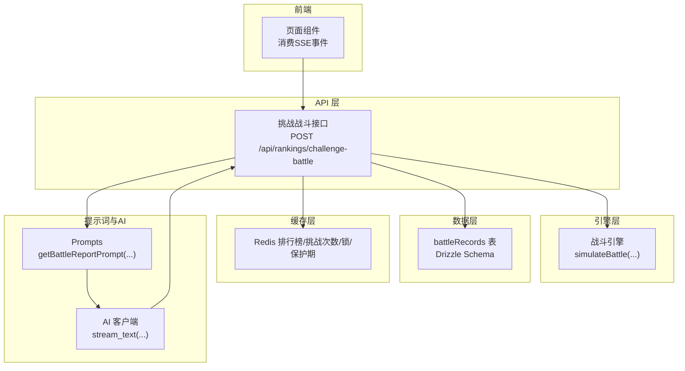
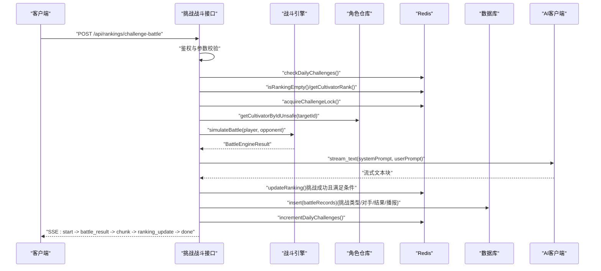
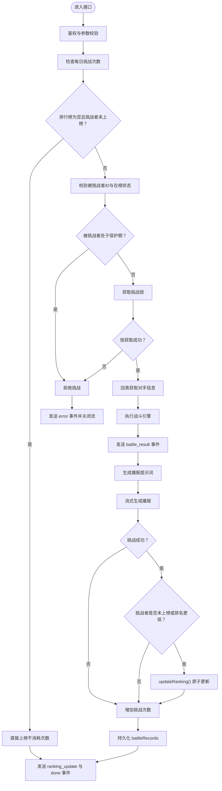
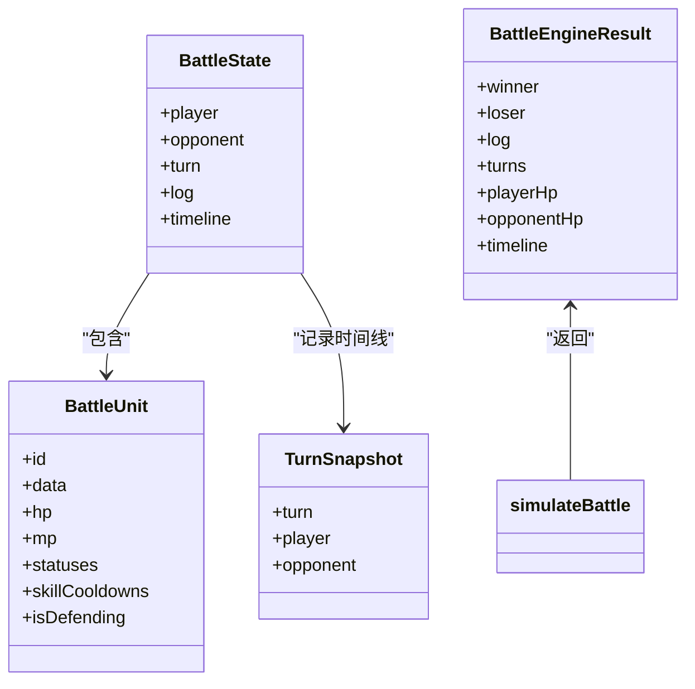
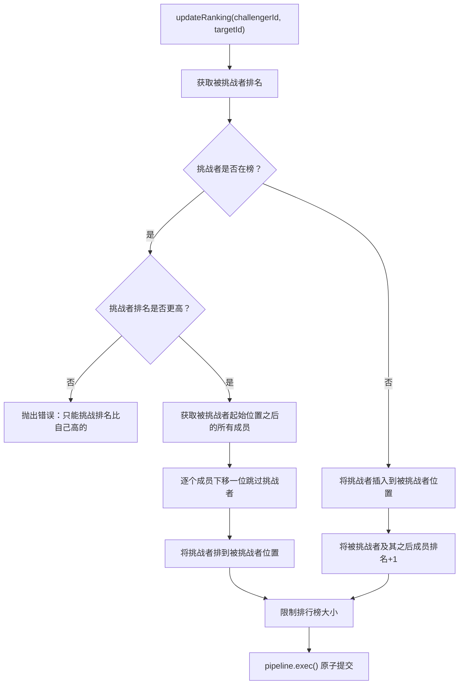
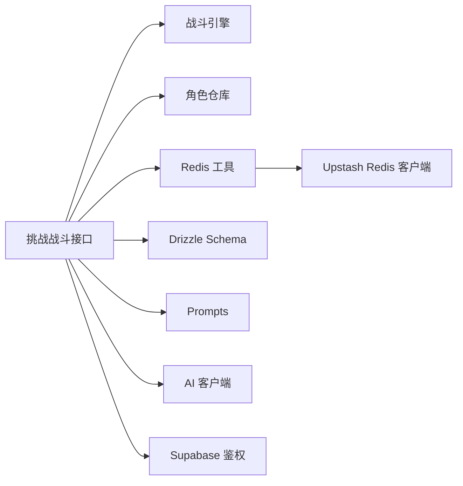

# 战斗生成

<cite>
**本文引用的文件**
- [app/api/rankings/challenge-battle/route.ts](file://app/api/rankings/challenge-battle/route.ts)
- [engine/battleEngine.ts](file://engine/battleEngine.ts)
- [lib/drizzle/schema.ts](file://lib/drizzle/schema.ts)
- [lib/redis/rankings.ts](file://lib/redis/rankings.ts)
- [lib/redis/index.ts](file://lib/redis/index.ts)
- [utils/prompts.ts](file://utils/prompts.ts)
- [utils/aiClient.ts](file://utils/aiClient.ts)
- [lib/repositories/cultivatorRepository.ts](file://lib/repositories/cultivatorRepository.ts)
- [app/battle/page.tsx](file://app/battle/page.tsx)
</cite>

## 目录
1. [简介](#简介)
2. [项目结构](#项目结构)
3. [核心组件](#核心组件)
4. [架构总览](#架构总览)
5. [详细组件分析](#详细组件分析)
6. [依赖关系分析](#依赖关系分析)
7. [性能考量](#性能考量)
8. [故障排查指南](#故障排查指南)
9. [结论](#结论)
10. [附录](#附录)

## 简介
本文件围绕挑战战斗的生成与执行流程展开，聚焦于后端SSE流式接口与前端渲染的协同工作方式。重点说明：
- 如何通过战斗引擎执行挑战战斗并产出战斗结果；
- 如何利用AI提示词与流式接口生成动态战斗播报；
- 挑战成功时如何更新排行榜，失败或切磋时不改变排名；
- 挑战记录持久化到 battleRecords 表；
- 每日挑战次数的消耗与限制；
- Redis 管道操作在更新排行榜时保证原子性的实现；
- 挑战战斗的时序图、SSE消息类型定义与AI内容生成的集成细节。

## 项目结构
挑战战斗相关的关键模块分布如下：
- API 层：SSE 接口负责发起挑战、执行战斗、生成播报、更新排名与持久化记录；
- 引擎层：战斗引擎负责回合制战斗模拟、日志与时间线生成；
- 数据层：Drizzle ORM Schema 定义 battleRecords 表结构；
- 缓存层：Redis 实现排行榜、挑战次数、挑战锁与保护期；
- 提示词与AI：Prompts 生成播报提示词，AI 客户端提供流式文本生成；
- 前端：页面组件消费SSE事件，实时展示战斗结果与播报。

图表来源
- [app/api/rankings/challenge-battle/route.ts](file://app/api/rankings/challenge-battle/route.ts#L1-L285)
- [engine/battleEngine.ts](file://engine/battleEngine.ts#L674-L830)
- [lib/drizzle/schema.ts](file://lib/drizzle/schema.ts#L240-L264)
- [lib/redis/rankings.ts](file://lib/redis/rankings.ts#L1-L409)
- [utils/prompts.ts](file://utils/prompts.ts#L63-L145)
- [utils/aiClient.ts](file://utils/aiClient.ts#L64-L90)
- [app/battle/page.tsx](file://app/battle/page.tsx#L168-L206)

章节来源
- [app/api/rankings/challenge-battle/route.ts](file://app/api/rankings/challenge-battle/route.ts#L1-L285)
- [engine/battleEngine.ts](file://engine/battleEngine.ts#L674-L830)
- [lib/drizzle/schema.ts](file://lib/drizzle/schema.ts#L240-L264)
- [lib/redis/rankings.ts](file://lib/redis/rankings.ts#L1-L409)
- [utils/prompts.ts](file://utils/prompts.ts#L63-L145)
- [utils/aiClient.ts](file://utils/aiClient.ts#L64-L90)
- [app/battle/page.tsx](file://app/battle/page.tsx#L168-L206)

## 核心组件
- 挑战战斗SSE接口：负责鉴权、参数校验、挑战次数检查、排行榜状态判断、挑战锁获取、对手信息回表、战斗执行、AI播报流式生成、结果处理与持久化。
- 战斗引擎：回合制模拟，包含状态效果、技能选择、伤害计算、闪避判定、冷却管理与时间线快照。
- Redis 排行榜工具：提供排名查询、保护期、挑战锁、每日挑战次数、更新排名（含管道原子性）。
- Drizzle Schema：battleRecords 表结构，存储挑战记录与AI播报。
- Prompts 与 AI 客户端：生成播报提示词并流式生成文本。
- 前端页面：消费SSE事件，展示战斗结果与播报。

章节来源
- [app/api/rankings/challenge-battle/route.ts](file://app/api/rankings/challenge-battle/route.ts#L1-L285)
- [engine/battleEngine.ts](file://engine/battleEngine.ts#L1-L830)
- [lib/redis/rankings.ts](file://lib/redis/rankings.ts#L1-L409)
- [lib/drizzle/schema.ts](file://lib/drizzle/schema.ts#L240-L264)
- [utils/prompts.ts](file://utils/prompts.ts#L63-L145)
- [utils/aiClient.ts](file://utils/aiClient.ts#L64-L90)
- [app/battle/page.tsx](file://app/battle/page.tsx#L168-L206)

## 架构总览
挑战战斗的端到端流程如下：
- 客户端向挑战战斗接口发起请求；
- 接口进行用户鉴权与参数校验；
- 检查挑战次数与排行榜状态，必要时获取挑战锁；
- 回表获取对手信息，执行战斗引擎；
- 生成播报提示词并通过AI客户端流式生成；
- 挑战成功时更新排行榜（Redis管道原子性），失败或切磋不改变排名；
- 记录战斗结果与播报到 battleRecords；
- 增加挑战次数（无论胜负均消耗一次）；
- 通过SSE向客户端推送各阶段事件，前端实时渲染。

图表来源
- [app/api/rankings/challenge-battle/route.ts](file://app/api/rankings/challenge-battle/route.ts#L28-L237)
- [engine/battleEngine.ts](file://engine/battleEngine.ts#L674-L830)
- [lib/redis/rankings.ts](file://lib/redis/rankings.ts#L272-L310)
- [lib/repositories/cultivatorRepository.ts](file://lib/repositories/cultivatorRepository.ts#L424-L455)
- [utils/aiClient.ts](file://utils/aiClient.ts#L64-L90)
- [utils/prompts.ts](file://utils/prompts.ts#L63-L145)
- [lib/drizzle/schema.ts](file://lib/drizzle/schema.ts#L240-L264)

## 详细组件分析

### 挑战战斗SSE接口（app/api/rankings/challenge-battle/route.ts）
- 鉴权与参数校验：通过 Supabase 获取当前用户，校验请求体中的挑战者与被挑战者ID；
- 挑战次数检查：每日挑战次数上限为10次，超过则拒绝；
- 排行榜状态：若排行榜为空且挑战者未上榜，可直接上榜（不消耗挑战次数）；
- 挑战目标校验：必须提供被挑战者ID，且被挑战者需在排行榜上；
- 保护期与挑战锁：被挑战者处于保护期（新天骄保护）或已被他人挑战时拒绝；
- 挑战锁获取：使用 Redis SET NX EX 实现分布式锁，避免并发冲突；
- 战斗执行：回表获取对手完整信息，调用战斗引擎生成 BattleEngineResult；
- AI播报：生成播报提示词，通过流式接口逐步推送播报内容；
- 排行榜更新：挑战成功且满足条件（挑战者未上榜或挑战者排名低于被挑战者）时，调用 updateRanking；
- 挑战次数消耗：无论胜负均增加一次挑战次数；
- 记录持久化：向 battleRecords 插入挑战记录与完整播报；
- SSE事件：start -> battle_result -> chunk -> ranking_update -> done；
- 错误处理：捕获异常并发送 error 事件，最终释放挑战锁。

图表来源
- [app/api/rankings/challenge-battle/route.ts](file://app/api/rankings/challenge-battle/route.ts#L28-L237)

章节来源
- [app/api/rankings/challenge-battle/route.ts](file://app/api/rankings/challenge-battle/route.ts#L28-L237)

### 战斗引擎（engine/battleEngine.ts）
- 数据结构：BattleUnit、BattleState、TurnSnapshot、BattleEngineResult 等；
- 回合制模拟：按速度排序决定行动顺序，处理状态效果（DOT、增益/减益、闪避、冷却等）；
- 技能系统：根据状态与资源选择技能，计算伤害/治疗/控制效果；
- 时间线与日志：每回合快照与日志记录，便于AI播报与复盘；
- 限制：最大回合数限制，确保战斗不会无限循环。

图表来源
- [engine/battleEngine.ts](file://engine/battleEngine.ts#L23-L43)
- [engine/battleEngine.ts](file://engine/battleEngine.ts#L674-L830)

章节来源
- [engine/battleEngine.ts](file://engine/battleEngine.ts#L1-L830)

### 排行榜与Redis工具（lib/redis/rankings.ts）
- 排行榜键与保护期键、挑战锁键、每日挑战次数键的命名规范；
- 排行榜大小限制（默认100）；
- 排行榜更新（updateRanking）：使用 Redis pipeline 原子性地调整被挑战者及其之后成员的排名，确保一致性；
- 挑战次数：按自然日计数，超过上限则拒绝；
- 保护期：新上榜角色在一定时间内不可被挑战；
- 挑战锁：使用 SET NX EX 实现分布式锁，避免并发冲突。

图表来源
- [lib/redis/rankings.ts](file://lib/redis/rankings.ts#L187-L270)

章节来源
- [lib/redis/rankings.ts](file://lib/redis/rankings.ts#L1-L409)

### 数据持久化（lib/drizzle/schema.ts）
- battleRecords 表包含：
  - 用户与角色关联字段；
  - 挑战类型（challenge/challenged/normal）；
  - 对手角色ID；
  - 战斗结果快照（BattleEngineResult）；
  - AI生成的完整播报文本；
  - 创建时间。

章节来源
- [lib/drizzle/schema.ts](file://lib/drizzle/schema.ts#L240-L264)

### 提示词与AI集成（utils/prompts.ts, utils/aiClient.ts）
- Prompts：根据双方角色与战斗结果生成系统提示词与用户提示词；
- AI 客户端：提供 stream_text 接口，支持流式文本生成；
- 接口：在挑战战斗接口中，将生成的播报提示词交由 AI 客户端流式生成，并通过SSE逐步推送给客户端。

章节来源
- [utils/prompts.ts](file://utils/prompts.ts#L63-L145)
- [utils/aiClient.ts](file://utils/aiClient.ts#L64-L90)
- [app/api/rankings/challenge-battle/route.ts](file://app/api/rankings/challenge-battle/route.ts#L168-L190)

### 前端消费SSE（app/battle/page.tsx）
- 监听SSE事件：start、battle_result、chunk、ranking_update、done；
- 渲染战斗结果与播报内容，支持流式追加；
- 错误处理：收到 error 事件时弹窗提示并停止加载。

章节来源
- [app/battle/page.tsx](file://app/battle/page.tsx#L168-L206)

## 依赖关系分析
- 挑战战斗接口依赖：
  - 战斗引擎：执行战斗；
  - Redis 工具：排行、保护期、挑战锁、挑战次数；
  - 角色仓库：回表获取对手信息；
  - Drizzle Schema：持久化 battleRecords；
  - Prompts/AI 客户端：生成播报；
  - Supabase：鉴权。
- Redis 客户端来自 lib/redis/index.ts，供 Redis 工具使用。

图表来源
- [app/api/rankings/challenge-battle/route.ts](file://app/api/rankings/challenge-battle/route.ts#L1-L285)
- [lib/redis/index.ts](file://lib/redis/index.ts#L1-L6)
- [lib/redis/rankings.ts](file://lib/redis/rankings.ts#L1-L409)
- [lib/repositories/cultivatorRepository.ts](file://lib/repositories/cultivatorRepository.ts#L424-L455)
- [lib/drizzle/schema.ts](file://lib/drizzle/schema.ts#L240-L264)
- [utils/prompts.ts](file://utils/prompts.ts#L63-L145)
- [utils/aiClient.ts](file://utils/aiClient.ts#L64-L90)

章节来源
- [app/api/rankings/challenge-battle/route.ts](file://app/api/rankings/challenge-battle/route.ts#L1-L285)
- [lib/redis/index.ts](file://lib/redis/index.ts#L1-L6)

## 性能考量
- Redis 管道原子性：updateRanking 使用 pipeline 批量写入，减少网络往返与竞态风险；
- 流式AI生成：SSE边生成边推送，降低前端等待时间；
- 并发控制：挑战锁避免同一对手被多人挑战导致的排名错乱；
- 挑战次数限制：每日上限10次，防止滥用；
- 战斗回合限制：最大回合数限制，避免长时间战斗占用资源。

## 故障排查指南
- 未授权访问：检查 Supabase 鉴权是否成功；
- 参数错误：确认挑战者ID与被挑战者ID格式正确；
- 挑战次数耗尽：查看 checkDailyChallenges 返回值；
- 被挑战者保护期：等待保护期结束后再挑战；
- 挑战锁冲突：若提示“被挑战者正在被其他玩家挑战”，稍后再试；
- 被挑战者不在榜：确保被挑战者已在排行榜上；
- 排行榜更新失败：检查 updateRanking 的条件分支与Redis连接状态；
- 挑战记录未入库：确认 insert(battleRecords) 是否执行成功；
- AI生成异常：检查环境变量与模型配置。

章节来源
- [app/api/rankings/challenge-battle/route.ts](file://app/api/rankings/challenge-battle/route.ts#L136-L141)
- [lib/redis/rankings.ts](file://lib/redis/rankings.ts#L272-L310)
- [lib/drizzle/schema.ts](file://lib/drizzle/schema.ts#L240-L264)
- [utils/aiClient.ts](file://utils/aiClient.ts#L64-L90)

## 结论
挑战战斗接口通过SSE实现了流畅的实时体验，结合战斗引擎、Redis排行榜与Drizzle持久化，构建了完整的挑战闭环。AI播报的流式生成进一步提升了沉浸感。Redis管道确保了排名更新的原子性与一致性，配合挑战锁与保护期机制，有效避免了并发与边界条件带来的问题。整体架构清晰、职责分离明确，具备良好的扩展性与可维护性。

## 附录

### SSE消息类型定义
- start：开始事件，通知客户端即将开始挑战流程；
- battle_result：包含战斗结果的数据块（赢家、输家、日志、回合数、血量、时间线）；
- chunk：AI播报的流式文本块；
- ranking_update：挑战成功后的排名更新信息（是否获胜、挑战者与被挑战者的新排名、剩余挑战次数）；
- done：挑战流程结束；
- error：错误事件，包含错误信息。

章节来源
- [app/api/rankings/challenge-battle/route.ts](file://app/api/rankings/challenge-battle/route.ts#L151-L236)
- [app/battle/page.tsx](file://app/battle/page.tsx#L168-L206)