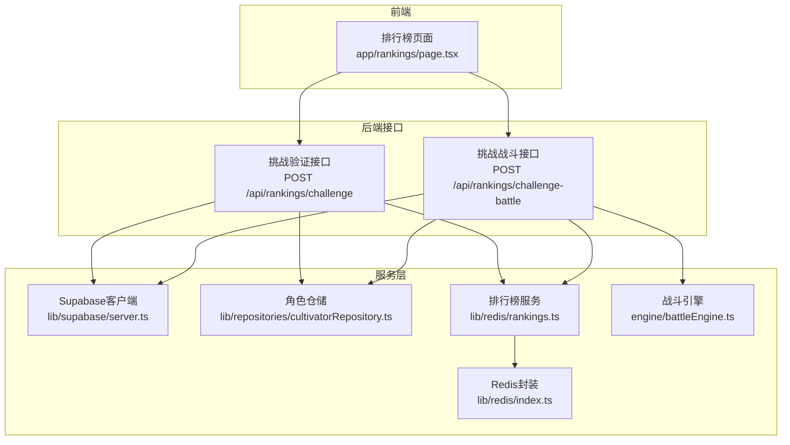
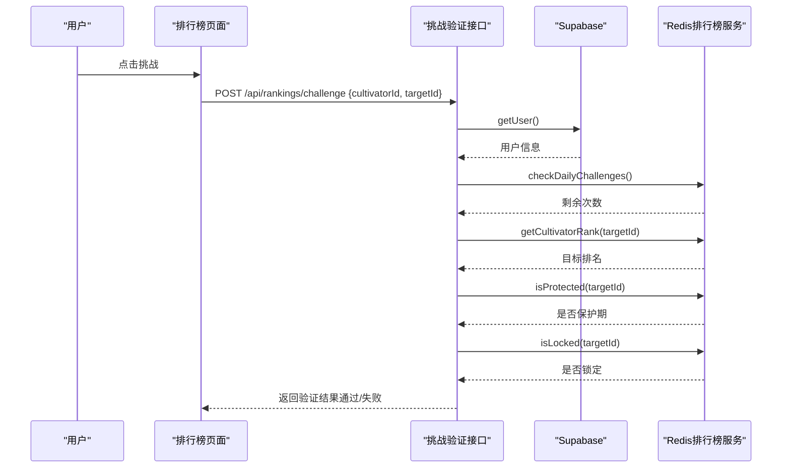
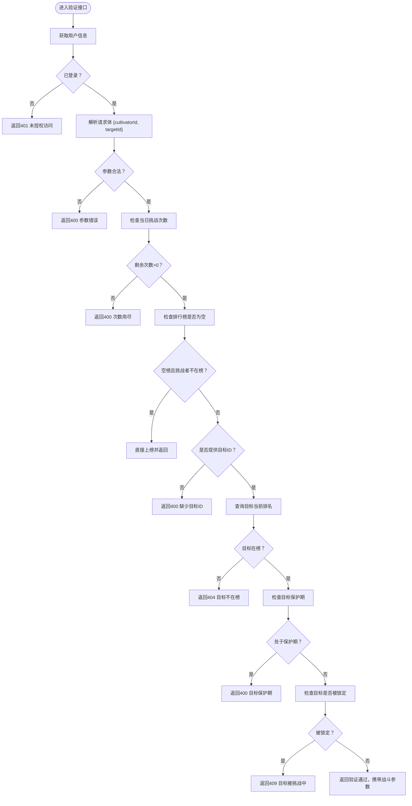
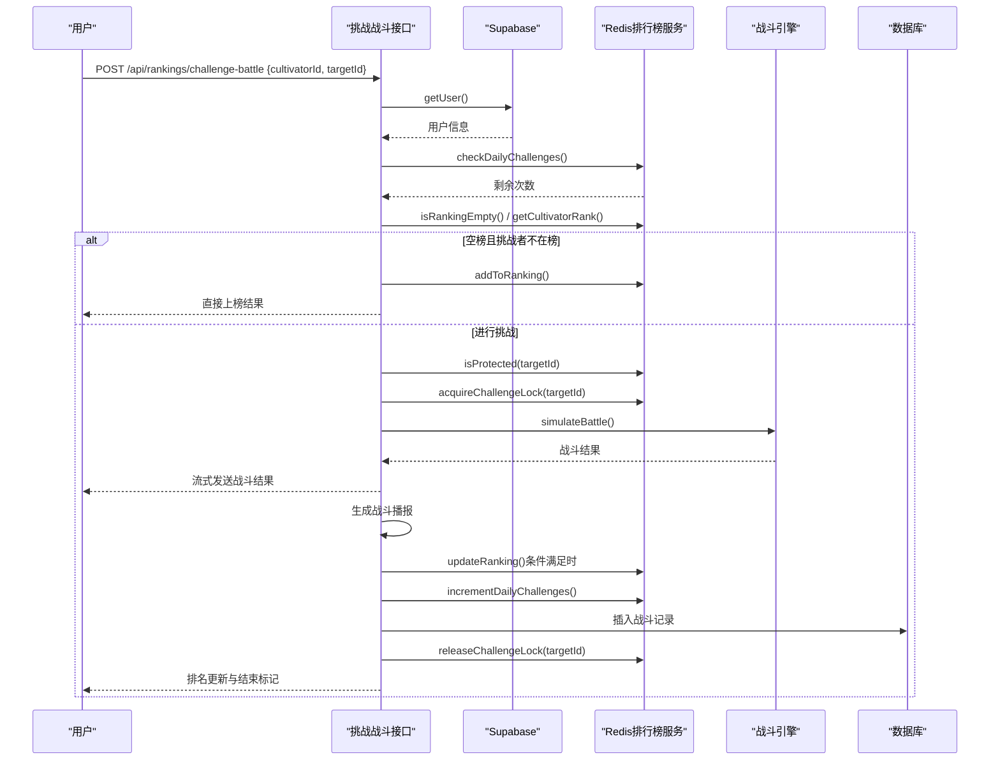
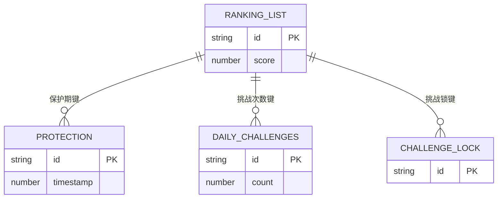
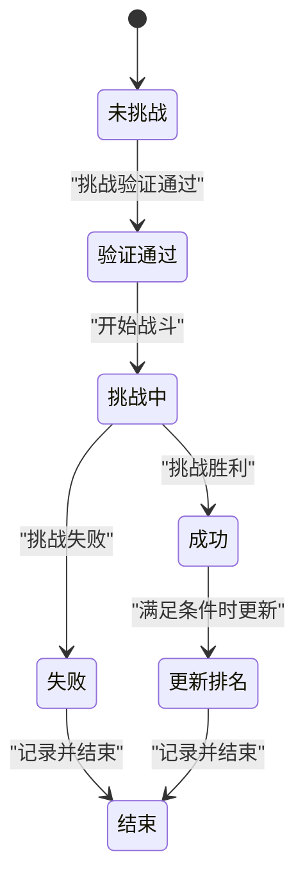
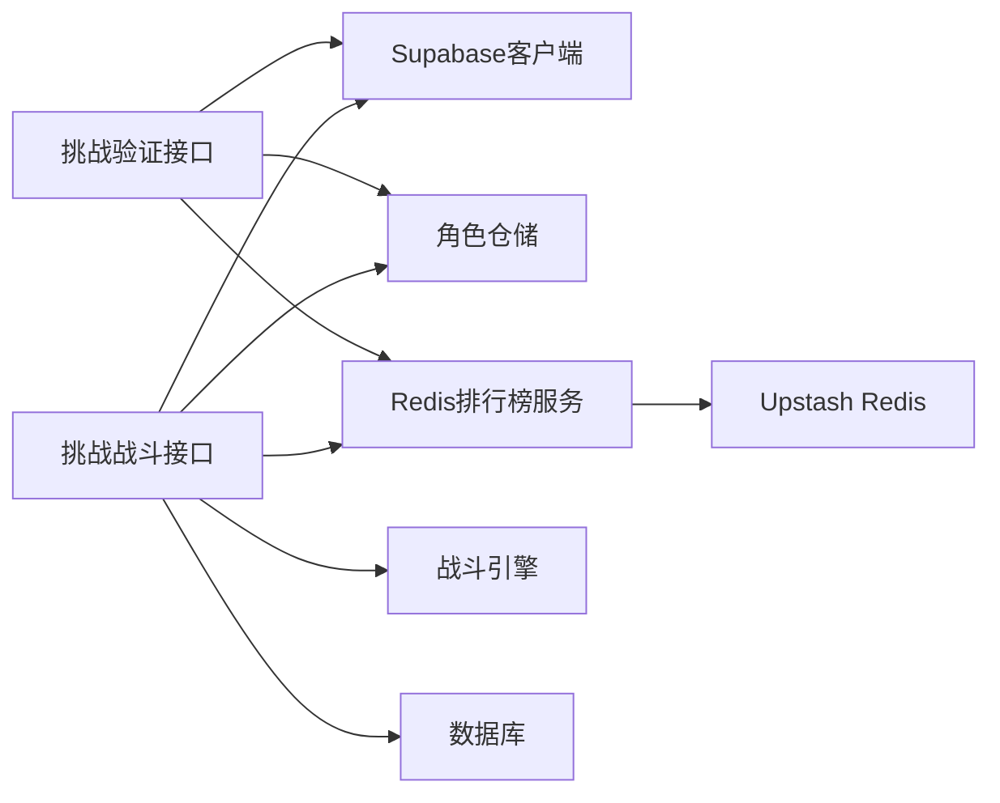

# 挑战流程

<cite>
**本文引用的文件**
- [app/api/rankings/challenge/route.ts](file://app/api/rankings/challenge/route.ts)
- [app/api/rankings/challenge-battle/route.ts](file://app/api/rankings/challenge-battle/route.ts)
- [lib/redis/rankings.ts](file://lib/redis/rankings.ts)
- [lib/repositories/cultivatorRepository.ts](file://lib/repositories/cultivatorRepository.ts)
- [lib/supabase/server.ts](file://lib/supabase/server.ts)
- [lib/redis/index.ts](file://lib/redis/index.ts)
- [engine/battleEngine.ts](file://engine/battleEngine.ts)
- [app/rankings/page.tsx](file://app/rankings/page.tsx)
</cite>

## 目录
1. [简介](#简介)
2. [项目结构](#项目结构)
3. [核心组件](#核心组件)
4. [架构总览](#架构总览)
5. [详细组件分析](#详细组件分析)
6. [依赖关系分析](#依赖关系分析)
7. [性能考量](#性能考量)
8. [故障排查指南](#故障排查指南)
9. [结论](#结论)
10. [附录](#附录)

## 简介
本文件深入解析“挑战流程”的完整实现，围绕后端接口与Redis服务层，系统阐述挑战请求的验证逻辑与状态转换。重点覆盖：
- 用户身份认证与输入参数校验
- 每日挑战次数限制（MAX_DAILY_CHALLENGES=10）的检查机制
- 挑战条件验证：挑战者必须排名低于目标（数值更大），被挑战者不可处于保护期（PROTECTION_DURATION=1800秒）或被锁定状态
- 结合Redis键值设计（DAILY_CHALLENGES_PREFIX、PROTECTION_PREFIX、CHALLENGE_LOCK_PREFIX）与分布式锁机制
- 挑战状态转换图、API请求/响应示例及并发挑战的防重处理方案

## 项目结构
挑战流程涉及前后端协作与Redis缓存服务：
- 前端页面负责发起挑战验证请求与展示结果
- 后端验证接口负责鉴权、参数校验与条件检查
- 挑战战斗接口负责执行战斗、生成播报、更新排名与挑战次数
- Redis服务层提供排行榜、保护期、挑战次数与分布式锁能力

图表来源
- [app/rankings/page.tsx](file://app/rankings/page.tsx#L149-L193)
- [app/api/rankings/challenge/route.ts](file://app/api/rankings/challenge/route.ts#L1-L148)
- [app/api/rankings/challenge-battle/route.ts](file://app/api/rankings/challenge-battle/route.ts#L1-L285)
- [lib/supabase/server.ts](file://lib/supabase/server.ts#L1-L28)
- [lib/repositories/cultivatorRepository.ts](file://lib/repositories/cultivatorRepository.ts#L322-L343)
- [lib/redis/index.ts](file://lib/redis/index.ts#L1-L6)
- [lib/redis/rankings.ts](file://lib/redis/rankings.ts#L1-L409)
- [engine/battleEngine.ts](file://engine/battleEngine.ts#L674-L830)

章节来源
- [app/rankings/page.tsx](file://app/rankings/page.tsx#L149-L193)
- [app/api/rankings/challenge/route.ts](file://app/api/rankings/challenge/route.ts#L1-L148)
- [app/api/rankings/challenge-battle/route.ts](file://app/api/rankings/challenge-battle/route.ts#L1-L285)
- [lib/redis/rankings.ts](file://lib/redis/rankings.ts#L1-L409)

## 核心组件
- 挑战验证接口：负责用户鉴权、参数校验、每日挑战次数检查、排行榜空榜直接上榜、挑战条件验证（保护期、锁定状态）与返回战斗参数
- 挑战战斗接口：负责获取挑战者与被挑战者、执行战斗、生成战斗播报、更新排名、增加挑战次数、记录战斗结果
- Redis排行榜服务：提供排行榜读取、排名查询、新增、更新、保护期判断、挑战次数统计、分布式锁获取与释放
- Supabase客户端：提供用户鉴权能力
- 角色仓储：提供角色信息查询与回表

章节来源
- [app/api/rankings/challenge/route.ts](file://app/api/rankings/challenge/route.ts#L1-L148)
- [app/api/rankings/challenge-battle/route.ts](file://app/api/rankings/challenge-battle/route.ts#L1-L285)
- [lib/redis/rankings.ts](file://lib/redis/rankings.ts#L1-L409)
- [lib/supabase/server.ts](file://lib/supabase/server.ts#L1-L28)
- [lib/repositories/cultivatorRepository.ts](file://lib/repositories/cultivatorRepository.ts#L322-L343)

## 架构总览
挑战流程分为两个阶段：
- 验证阶段：POST /api/rankings/challenge
- 战斗阶段：POST /api/rankings/challenge-battle

图表来源
- [app/rankings/page.tsx](file://app/rankings/page.tsx#L149-L193)
- [app/api/rankings/challenge/route.ts](file://app/api/rankings/challenge/route.ts#L1-L148)
- [lib/redis/rankings.ts](file://lib/redis/rankings.ts#L272-L380)
- [lib/supabase/server.ts](file://lib/supabase/server.ts#L1-L28)

## 详细组件分析

### 挑战验证接口（POST /api/rankings/challenge）
职责与流程要点：
- 用户身份认证：通过Supabase获取当前用户，未登录返回401
- 输入参数校验：要求提供有效的挑战者ID；若提供目标ID需为非空字符串
- 挑战次数限制：调用Redis服务检查当日挑战次数（MAX_DAILY_CHALLENGES=10）
- 排行榜空榜直接上榜：若排行榜为空且挑战者不在榜上，直接将其加入并占据第一名
- 挑战条件验证：
  - 目标必须在排行榜上
  - 目标不可处于保护期（PROTECTION_DURATION=1800秒）
  - 目标不可被锁定（分布式锁存在）
- 返回战斗参数：包含挑战者与目标的当前排名、剩余挑战次数等

图表来源
- [app/api/rankings/challenge/route.ts](file://app/api/rankings/challenge/route.ts#L1-L148)
- [lib/redis/rankings.ts](file://lib/redis/rankings.ts#L272-L380)

章节来源
- [app/api/rankings/challenge/route.ts](file://app/api/rankings/challenge/route.ts#L1-L148)

### 挑战战斗接口（POST /api/rankings/challenge-battle）
职责与流程要点：
- 用户身份认证：同上
- 输入参数校验：要求提供挑战者ID与目标ID
- 挑战次数检查：与验证接口一致
- 直接上榜分支：排行榜为空且挑战者不在榜时，直接上榜不消耗挑战次数
- 挑战条件验证：目标在榜、保护期检查、分布式锁获取
- 执行战斗：调用战斗引擎模拟战斗，流式输出战斗结果
- 生成战斗播报：基于AI生成战斗播报文本
- 更新排名：挑战成功且满足条件时，调用更新逻辑
- 增加挑战次数：无论胜负均消耗一次挑战次数
- 记录战斗结果：写入数据库
- 释放分布式锁：确保并发安全

图表来源
- [app/api/rankings/challenge-battle/route.ts](file://app/api/rankings/challenge-battle/route.ts#L1-L285)
- [lib/redis/rankings.ts](file://lib/redis/rankings.ts#L187-L270)
- [engine/battleEngine.ts](file://engine/battleEngine.ts#L674-L830)

章节来源
- [app/api/rankings/challenge-battle/route.ts](file://app/api/rankings/challenge-battle/route.ts#L1-L285)

### Redis键值设计与分布式锁
- 排行榜列表键：用于存储排行榜成员与排名（score为排名序号）
- 保护期键：以目标ID为后缀，记录进入保护期的时间戳
- 每日挑战次数键：以挑战者ID与日期为后缀，记录当日挑战次数
- 分布式锁键：以目标ID为后缀，NX EX方式实现短时互斥

图表来源
- [lib/redis/rankings.ts](file://lib/redis/rankings.ts#L1-L409)

章节来源
- [lib/redis/rankings.ts](file://lib/redis/rankings.ts#L1-L409)

### 挑战状态转换图
挑战成功与失败的排名变化取决于双方当前排名与挑战结果。

图表来源
- [app/api/rankings/challenge-battle/route.ts](file://app/api/rankings/challenge-battle/route.ts#L192-L209)
- [lib/redis/rankings.ts](file://lib/redis/rankings.ts#L187-L270)

章节来源
- [app/api/rankings/challenge-battle/route.ts](file://app/api/rankings/challenge-battle/route.ts#L192-L209)
- [lib/redis/rankings.ts](file://lib/redis/rankings.ts#L187-L270)

### API请求/响应示例
- 请求体
  - 挑战验证：POST /api/rankings/challenge
    - { "cultivatorId": "字符串", "targetId": "字符串（可选）" }
  - 挑战战斗：POST /api/rankings/challenge-battle
    - { "cultivatorId": "字符串", "targetId": "字符串" }

- 响应体
  - 挑战验证（通过）：
    - { "success": true, "message": "挑战验证通过...", "data": { "cultivatorId", "targetId", "challengerRank", "targetRank", "remainingChallenges" } }
  - 挑战验证（直接上榜）：
    - { "success": true, "message": "成功上榜...", "data": { "directEntry": true, "rank": 1, "remainingChallenges" } }
  - 挑战战斗（SSE）：
    - start: {"type":"start"}
    - battle_result: 包含winner、loser、log、turns、timeline等
    - chunk: 流式播报片段
    - ranking_update: { "type":"ranking_update", "isWin", "challengerRank", "targetRank", "remainingChallenges" }
    - done: {"type":"done"}

章节来源
- [app/api/rankings/challenge/route.ts](file://app/api/rankings/challenge/route.ts#L120-L136)
- [app/api/rankings/challenge-battle/route.ts](file://app/api/rankings/challenge-battle/route.ts#L148-L232)

### 并发挑战的防重处理方案
- 分布式锁：挑战开始前对目标ID获取分布式锁，若获取失败则提示“目标正在被其他玩家挑战”
- 锁释放：挑战结束或异常时释放锁，防止死锁
- 挑战次数：挑战完成后增加挑战次数，避免重复挑战导致的次数透支
- 保护期：新上榜角色进入保护期，期间不可被挑战，降低恶意挑战风险

章节来源
- [lib/redis/rankings.ts](file://lib/redis/rankings.ts#L342-L380)
- [app/api/rankings/challenge-battle/route.ts](file://app/api/rankings/challenge-battle/route.ts#L136-L141)
- [app/api/rankings/challenge-battle/route.ts](file://app/api/rankings/challenge-battle/route.ts#L253-L257)

## 依赖关系分析
- 挑战验证接口依赖Supabase鉴权、角色仓储与Redis排行榜服务
- 挑战战斗接口依赖Supabase鉴权、角色仓储、Redis排行榜服务、战斗引擎与数据库
- Redis排行榜服务依赖Upstash Redis客户端

图表来源
- [app/api/rankings/challenge/route.ts](file://app/api/rankings/challenge/route.ts#L1-L148)
- [app/api/rankings/challenge-battle/route.ts](file://app/api/rankings/challenge-battle/route.ts#L1-L285)
- [lib/redis/rankings.ts](file://lib/redis/rankings.ts#L1-L409)
- [lib/redis/index.ts](file://lib/redis/index.ts#L1-L6)

章节来源
- [app/api/rankings/challenge/route.ts](file://app/api/rankings/challenge/route.ts#L1-L148)
- [app/api/rankings/challenge-battle/route.ts](file://app/api/rankings/challenge-battle/route.ts#L1-L285)
- [lib/redis/rankings.ts](file://lib/redis/rankings.ts#L1-L409)
- [lib/redis/index.ts](file://lib/redis/index.ts#L1-L6)

## 性能考量
- Redis热点键：排行榜列表与保护期键访问频繁，建议关注ZADD/ZRANGE/ZRANK等命令的复杂度与网络延迟
- 分布式锁：NX EX方式简单可靠，注意锁超时时间与异常释放
- 挑战次数键：按天过期，避免长期占用内存
- 流式输出：SSE减少一次性传输压力，提升用户体验

## 故障排查指南
- 401 未授权访问：确认Cookie中包含有效会话，Supabase鉴权失败
- 400 参数错误：检查请求体字段类型与必填项
- 400 次数用尽：当日挑战次数已达上限（MAX_DAILY_CHALLENGES=10）
- 404 目标不在榜：目标未在排行榜上
- 400 目标保护期：目标处于新天骄保护期内（PROTECTION_DURATION=1800秒）
- 409 目标被挑战中：目标已被锁定，等待释放
- 500 服务器错误：查看后端日志定位具体异常

章节来源
- [app/api/rankings/challenge/route.ts](file://app/api/rankings/challenge/route.ts#L137-L147)
- [app/api/rankings/challenge-battle/route.ts](file://app/api/rankings/challenge-battle/route.ts#L238-L257)

## 结论
挑战流程通过严格的鉴权、参数校验与Redis服务保障，实现了公平、可扩展的排行榜挑战机制。每日挑战次数限制、保护期与分布式锁共同确保了系统的稳定性与安全性。战斗阶段采用SSE流式输出与AI播报，提升了交互体验。建议在生产环境中持续监控Redis性能与锁释放策略，确保高并发下的可靠性。

## 附录
- 关键常量与阈值
  - MAX_DAILY_CHALLENGES：每日挑战次数上限
  - PROTECTION_DURATION：保护期时长（秒）
  - LOCK_DURATION：分布式锁超时（秒）
- Redis键命名规范
  - 排行榜列表键：golden_rank:list
  - 保护期键：golden_rank:protection:{id}
  - 每日挑战次数键：golden_rank:daily_challenges:{id}:{YYYY-MM-DD}
  - 分布式锁键：golden_rank:challenge_lock:{id}

章节来源
- [lib/redis/rankings.ts](file://lib/redis/rankings.ts#L1-L409)