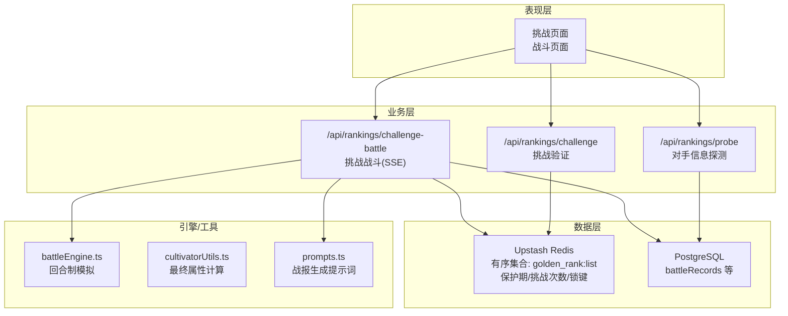
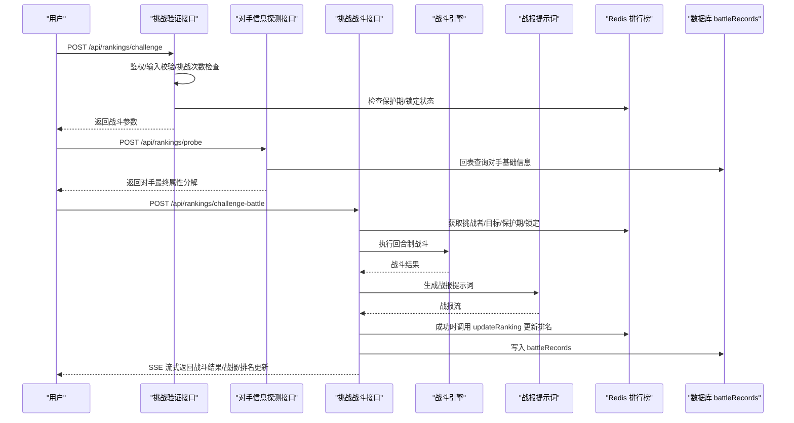
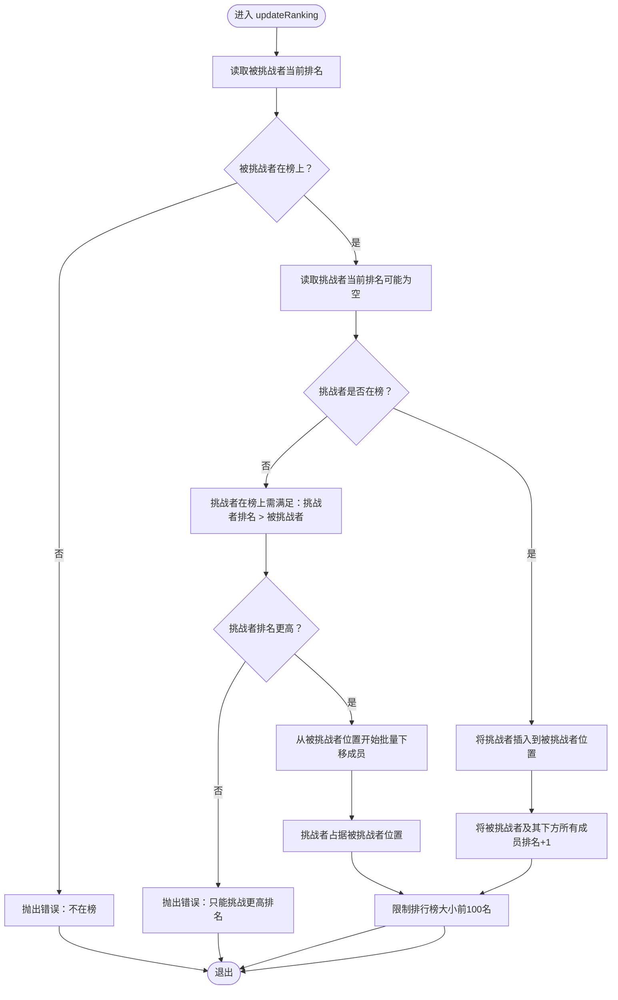
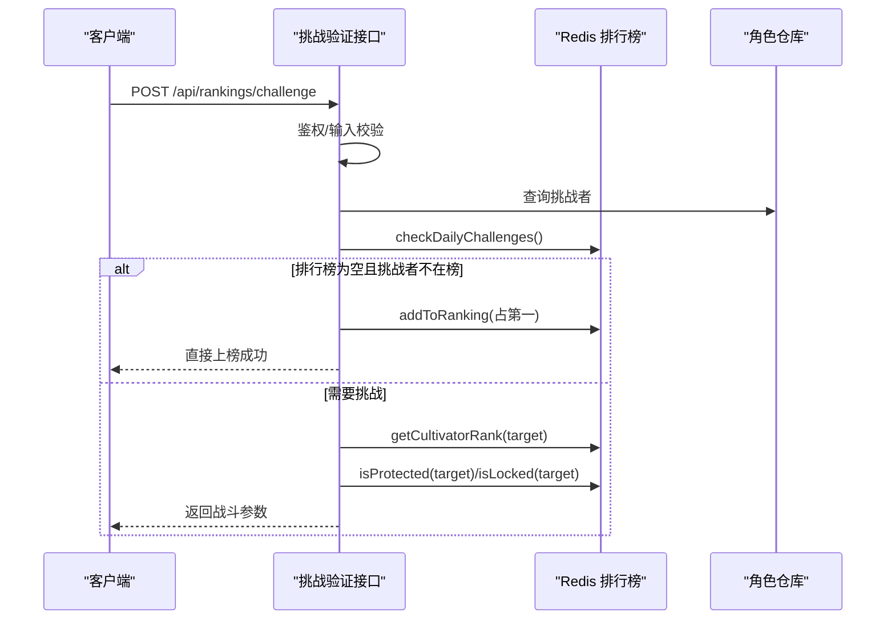
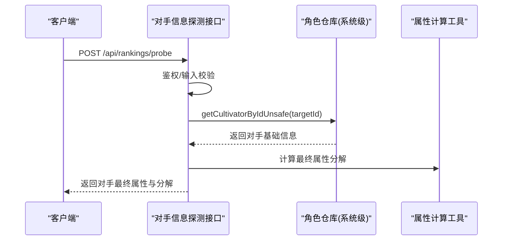
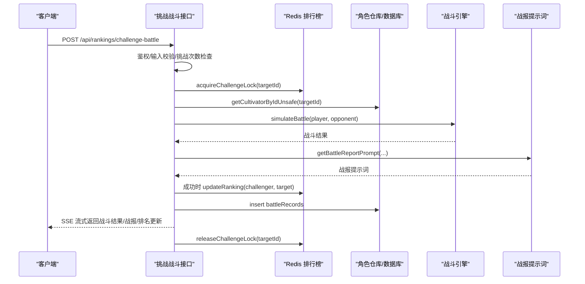
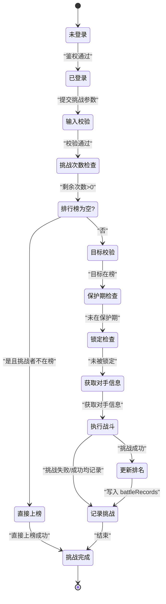
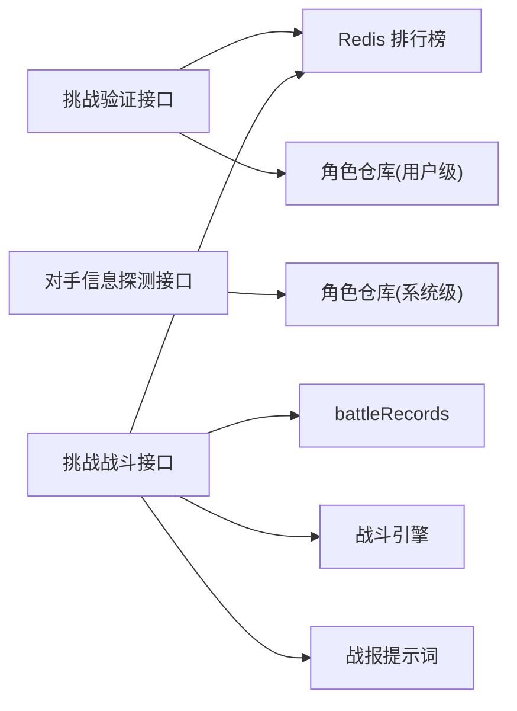

# 挑战系统

<cite>
**本文引用的文件**
- [lib/redis/rankings.ts](file://lib/redis/rankings.ts)
- [app/api/rankings/challenge/route.ts](file://app/api/rankings/challenge/route.ts)
- [app/api/rankings/probe/route.ts](file://app/api/rankings/probe/route.ts)
- [app/api/rankings/challenge-battle/route.ts](file://app/api/rankings/challenge-battle/route.ts)
- [lib/repositories/cultivatorRepository.ts](file://lib/repositories/cultivatorRepository.ts)
- [engine/battleEngine.ts](file://engine/battleEngine.ts)
- [utils/cultivatorUtils.ts](file://utils/cultivatorUtils.ts)
- [utils/prompts.ts](file://utils/prompts.ts)
- [lib/drizzle/schema.ts](file://lib/drizzle/schema.ts)
- [types/rankings.ts](file://types/rankings.ts)
</cite>

## 目录
1. [简介](#简介)
2. [项目结构](#项目结构)
3. [核心组件](#核心组件)
4. [架构总览](#架构总览)
5. [详细组件分析](#详细组件分析)
6. [依赖关系分析](#依赖关系分析)
7. [性能考量](#性能考量)
8. [故障排查指南](#故障排查指南)
9. [结论](#结论)
10. [附录](#附录)

## 简介
本文件围绕“排行榜挑战系统”的实现机制展开，重点基于 lib/redis/rankings.ts 中的 updateRanking 函数，系统性解析挑战流程中的排名变更逻辑，包括挑战者不在榜上的插入处理、在榜上的名次交换与批量下移算法。结合 /api/rankings/challenge 接口，阐述挑战请求的验证规则（如仅能挑战更高排名）与战斗生成流程；解释 probe 接口在挑战前获取对手信息以生成战斗场景的作用，并分析其反作弊设计（如信息脱敏）；通过 challenge-battle 接口说明战斗结果如何影响排名更新。最后提供挑战状态机图、典型 API 调用序列及处理并发挑战的 Redis 事务优化方案。

## 项目结构
挑战系统由三层组成：
- 数据层：基于 Upstash Redis 的有序集合维护排行榜，配合保护期、挑战次数、分布式锁等键空间。
- 业务层：HTTP API 路由负责鉴权、输入校验、挑战前置检查与战斗生成；战斗引擎负责回合制模拟与结果产出。
- 表现层：前端页面渲染挑战、战斗与战报，同时通过 SSE 流式接收实时反馈。

图表来源
- [app/api/rankings/challenge/route.ts](file://app/api/rankings/challenge/route.ts#L1-L148)
- [app/api/rankings/probe/route.ts](file://app/api/rankings/probe/route.ts#L1-L89)
- [app/api/rankings/challenge-battle/route.ts](file://app/api/rankings/challenge-battle/route.ts#L1-L285)
- [lib/redis/rankings.ts](file://lib/redis/rankings.ts#L1-L409)
- [engine/battleEngine.ts](file://engine/battleEngine.ts#L1-L830)
- [utils/prompts.ts](file://utils/prompts.ts#L63-L145)
- [lib/drizzle/schema.ts](file://lib/drizzle/schema.ts#L241-L264)

章节来源
- [lib/redis/rankings.ts](file://lib/redis/rankings.ts#L1-L409)
- [app/api/rankings/challenge/route.ts](file://app/api/rankings/challenge/route.ts#L1-L148)
- [app/api/rankings/probe/route.ts](file://app/api/rankings/probe/route.ts#L1-L89)
- [app/api/rankings/challenge-battle/route.ts](file://app/api/rankings/challenge-battle/route.ts#L1-L285)
- [engine/battleEngine.ts](file://engine/battleEngine.ts#L1-L830)
- [utils/prompts.ts](file://utils/prompts.ts#L63-L145)
- [lib/drizzle/schema.ts](file://lib/drizzle/schema.ts#L241-L264)

## 核心组件
- 排行榜服务（Redis）：提供排名读取、插入、更新、保护期、挑战次数、分布式锁等能力。
- 挑战验证接口：校验用户身份、挑战次数、目标是否在榜、保护期与锁定状态，返回战斗参数。
- 神识查探接口：在挑战前获取对手信息（最终属性分解等），用于生成战斗场景与反作弊。
- 挑战战斗接口：执行回合制战斗，流式输出战斗日志与战报，按结果更新排名并记录战斗记录。
- 战斗引擎：回合制模拟、状态效果、伤害计算、时间线快照。
- 属性计算工具：计算最终属性与上限，支撑战斗与排名展示。
- 数据模型：battleRecords 记录挑战结果与战报。

章节来源
- [lib/redis/rankings.ts](file://lib/redis/rankings.ts#L1-L409)
- [app/api/rankings/challenge/route.ts](file://app/api/rankings/challenge/route.ts#L1-L148)
- [app/api/rankings/probe/route.ts](file://app/api/rankings/probe/route.ts#L1-L89)
- [app/api/rankings/challenge-battle/route.ts](file://app/api/rankings/challenge-battle/route.ts#L1-L285)
- [engine/battleEngine.ts](file://engine/battleEngine.ts#L1-L830)
- [utils/cultivatorUtils.ts](file://utils/cultivatorUtils.ts#L1-L198)
- [lib/drizzle/schema.ts](file://lib/drizzle/schema.ts#L241-L264)

## 架构总览
挑战系统的关键交互链路如下：

图表来源
- [app/api/rankings/challenge/route.ts](file://app/api/rankings/challenge/route.ts#L1-L148)
- [app/api/rankings/probe/route.ts](file://app/api/rankings/probe/route.ts#L1-L89)
- [app/api/rankings/challenge-battle/route.ts](file://app/api/rankings/challenge-battle/route.ts#L1-L285)
- [engine/battleEngine.ts](file://engine/battleEngine.ts#L674-L830)
- [utils/prompts.ts](file://utils/prompts.ts#L63-L145)
- [lib/redis/rankings.ts](file://lib/redis/rankings.ts#L187-L270)
- [lib/drizzle/schema.ts](file://lib/drizzle/schema.ts#L241-L264)

## 详细组件分析

### 排行榜更新逻辑（updateRanking）
updateRanking 是挑战成功后更新排名的核心函数，支持两类场景：
- 挑战者不在榜上：直接插入到被挑战者位置，并将被挑战者及其下方所有角色排名+1。
- 挑战者在榜上：仅允许挑战排名更高的对手；将被挑战者位置开始的所有成员（除挑战者）下移一位，挑战者占据被挑战者位置。

图表来源
- [lib/redis/rankings.ts](file://lib/redis/rankings.ts#L187-L270)

章节来源
- [lib/redis/rankings.ts](file://lib/redis/rankings.ts#L187-L270)

### 挑战验证接口（/api/rankings/challenge）
职责与流程要点：
- 鉴权：通过 Supabase 获取当前用户。
- 输入校验：确保挑战者与被挑战者 ID 有效。
- 挑战次数检查：每日最多10次，返回剩余次数。
- 特殊入口：若排行榜为空且挑战者不在榜，可直接上榜（占第一）。
- 目标校验：被挑战者必须在榜；保护期（新天骄2小时）与锁定状态（同一目标并发挑战互斥）均不允许挑战。
- 通过后返回战斗参数（挑战者/被挑战者排名、剩余挑战次数等）。

图表来源
- [app/api/rankings/challenge/route.ts](file://app/api/rankings/challenge/route.ts#L1-L148)
- [lib/redis/rankings.ts](file://lib/redis/rankings.ts#L111-L157)

章节来源
- [app/api/rankings/challenge/route.ts](file://app/api/rankings/challenge/route.ts#L1-L148)
- [lib/redis/rankings.ts](file://lib/redis/rankings.ts#L111-L157)

### 神识查探接口（/api/rankings/probe）
作用：
- 在挑战前获取对手信息，用于生成战斗场景与战报。
- 采用系统级回表查询（跨用户），避免泄露敏感信息。
- 当前逻辑中，神识对比（最终属性中的意志/神识）注释掉，暂不作为挑战前置门槛。

图表来源
- [app/api/rankings/probe/route.ts](file://app/api/rankings/probe/route.ts#L1-L89)
- [lib/repositories/cultivatorRepository.ts](file://lib/repositories/cultivatorRepository.ts#L424-L455)
- [utils/cultivatorUtils.ts](file://utils/cultivatorUtils.ts#L51-L194)

章节来源
- [app/api/rankings/probe/route.ts](file://app/api/rankings/probe/route.ts#L1-L89)
- [lib/repositories/cultivatorRepository.ts](file://lib/repositories/cultivatorRepository.ts#L424-L455)
- [utils/cultivatorUtils.ts](file://utils/cultivatorUtils.ts#L51-L194)

### 挑战战斗接口（/api/rankings/challenge-battle）
职责与流程要点：
- 鉴权与输入校验。
- 挑战次数检查与直接上榜特例（排行榜空且挑战者不在榜时）。
- 获取挑战锁，避免并发挑战冲突。
- 回表获取对手完整信息，执行回合制战斗。
- 流式输出战斗日志与战报（SSE）。
- 挑战成功时调用 updateRanking 更新排名；无论胜负均增加挑战次数。
- 记录 battleRecords，包含挑战类型、对手、结果与战报全文。

图表来源
- [app/api/rankings/challenge-battle/route.ts](file://app/api/rankings/challenge-battle/route.ts#L1-L285)
- [engine/battleEngine.ts](file://engine/battleEngine.ts#L674-L830)
- [utils/prompts.ts](file://utils/prompts.ts#L63-L145)
- [lib/redis/rankings.ts](file://lib/redis/rankings.ts#L187-L270)
- [lib/drizzle/schema.ts](file://lib/drizzle/schema.ts#L241-L264)

章节来源
- [app/api/rankings/challenge-battle/route.ts](file://app/api/rankings/challenge-battle/route.ts#L1-L285)
- [engine/battleEngine.ts](file://engine/battleEngine.ts#L674-L830)
- [utils/prompts.ts](file://utils/prompts.ts#L63-L145)
- [lib/redis/rankings.ts](file://lib/redis/rankings.ts#L187-L270)
- [lib/drizzle/schema.ts](file://lib/drizzle/schema.ts#L241-L264)

### 挑战状态机
挑战流程的状态与转换如下：

图表来源
- [app/api/rankings/challenge/route.ts](file://app/api/rankings/challenge/route.ts#L1-L148)
- [app/api/rankings/challenge-battle/route.ts](file://app/api/rankings/challenge-battle/route.ts#L1-L285)
- [lib/redis/rankings.ts](file://lib/redis/rankings.ts#L187-L270)

## 依赖关系分析
- 排行榜服务依赖 Redis 的有序集合与键空间管理（保护期、挑战次数、分布式锁）。
- 挑战验证与挑战战斗依赖 Supabase 鉴权与角色仓库（系统级回表）。
- 挑战战斗依赖战斗引擎与提示词工具生成战报。
- 挑战战斗结果持久化到 battleRecords。

图表来源
- [app/api/rankings/challenge/route.ts](file://app/api/rankings/challenge/route.ts#L1-L148)
- [app/api/rankings/probe/route.ts](file://app/api/rankings/probe/route.ts#L1-L89)
- [app/api/rankings/challenge-battle/route.ts](file://app/api/rankings/challenge-battle/route.ts#L1-L285)
- [lib/redis/rankings.ts](file://lib/redis/rankings.ts#L1-L409)
- [lib/repositories/cultivatorRepository.ts](file://lib/repositories/cultivatorRepository.ts#L424-L455)
- [engine/battleEngine.ts](file://engine/battleEngine.ts#L1-L830)
- [utils/prompts.ts](file://utils/prompts.ts#L63-L145)
- [lib/drizzle/schema.ts](file://lib/drizzle/schema.ts#L241-L264)

章节来源
- [lib/redis/rankings.ts](file://lib/redis/rankings.ts#L1-L409)
- [lib/repositories/cultivatorRepository.ts](file://lib/repositories/cultivatorRepository.ts#L424-L455)
- [engine/battleEngine.ts](file://engine/battleEngine.ts#L1-L830)
- [utils/prompts.ts](file://utils/prompts.ts#L63-L145)
- [lib/drizzle/schema.ts](file://lib/drizzle/schema.ts#L241-L264)

## 性能考量
- Redis 有序集合操作复杂度：
  - 插入/更新：O(log n)
  - 批量下移使用 pipeline，减少网络往返，提升吞吐。
- 挑战次数与保护期键 TTL 设计合理，避免长期占用内存。
- 挑战战斗接口采用 SSE 流式输出，降低前端等待与内存压力。
- 回表查询采用系统级接口，避免跨用户权限泄露，同时保持查询可控。

[本节为通用指导，无需列出具体文件来源]

## 故障排查指南
- 未授权访问：检查 Supabase 鉴权是否成功。
- 输入非法：确认挑战者与被挑战者 ID 类型与格式。
- 目标不在榜：确保被挑战者确实在排行榜中。
- 保护期限制：新天骄保护期（2小时）内不可挑战。
- 并发冲突：目标被锁定（同一目标同时挑战），等待解锁后重试。
- 挑战次数耗尽：当日挑战次数已达上限（10次）。
- 排行榜为空且挑战者不在榜：可直接上榜，不消耗挑战次数。
- 战斗失败/异常：查看 SSE 错误事件与后端日志。

章节来源
- [app/api/rankings/challenge/route.ts](file://app/api/rankings/challenge/route.ts#L1-L148)
- [app/api/rankings/challenge-battle/route.ts](file://app/api/rankings/challenge-battle/route.ts#L1-L285)
- [lib/redis/rankings.ts](file://lib/redis/rankings.ts#L187-L270)

## 结论
挑战系统通过 Redis 有序集合实现高性能的排名维护，结合挑战次数、保护期与分布式锁保障公平性与一致性。挑战验证与战斗生成流程清晰，SSE 流式输出提升了用户体验。updateRanking 的两种排名变更路径（插入与批量下移）覆盖了挑战者在榜与不在榜的完整场景。probe 接口在挑战前提供对手信息，为战斗场景生成与反作弊设计奠定基础。建议在高并发场景下继续强化 Redis 事务与幂等性设计，确保排名更新的绝对正确性。

[本节为总结性内容，无需列出具体文件来源]

## 附录

### API 定义与行为摘要
- /api/rankings/challenge
  - 方法：POST
  - 参数：cultivatorId, targetId
  - 行为：鉴权、输入校验、挑战次数检查、保护期/锁定检查、返回战斗参数
- /api/rankings/probe
  - 方法：POST
  - 参数：cultivatorId, targetId
  - 行为：鉴权、输入校验、系统级回表查询对手、返回最终属性分解
- /api/rankings/challenge-battle
  - 方法：POST
  - 参数：cultivatorId, targetId
  - 行为：鉴权、输入校验、挑战次数检查、获取挑战锁、执行战斗、SSE 输出、更新排名、记录 battleRecords

章节来源
- [app/api/rankings/challenge/route.ts](file://app/api/rankings/challenge/route.ts#L1-L148)
- [app/api/rankings/probe/route.ts](file://app/api/rankings/probe/route.ts#L1-L89)
- [app/api/rankings/challenge-battle/route.ts](file://app/api/rankings/challenge-battle/route.ts#L1-L285)

### 并发挑战的 Redis 事务优化方案
- 使用 Redis Pipeline 执行 updateRanking 中的批量下移操作，保证原子性与低延迟。
- 在挑战战斗接口中，先获取挑战锁（NX EX），再执行战斗与排名更新，最后释放锁，避免竞态。
- 对于极端高并发场景，可考虑引入 Redis 事务（MULTI/EXEC）包裹关键步骤，或使用 Lua 脚本封装原子更新逻辑，进一步降低竞态风险。

章节来源
- [lib/redis/rankings.ts](file://lib/redis/rankings.ts#L187-L270)
- [app/api/rankings/challenge-battle/route.ts](file://app/api/rankings/challenge-battle/route.ts#L1-L285)