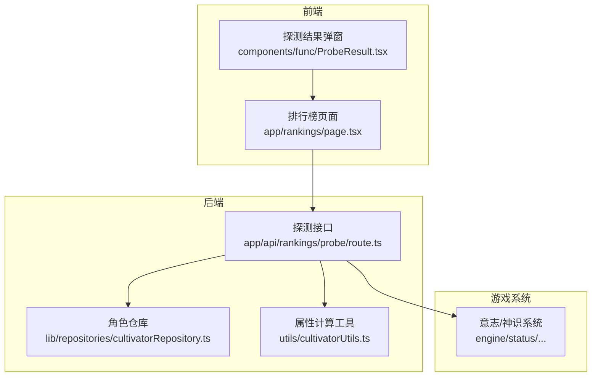
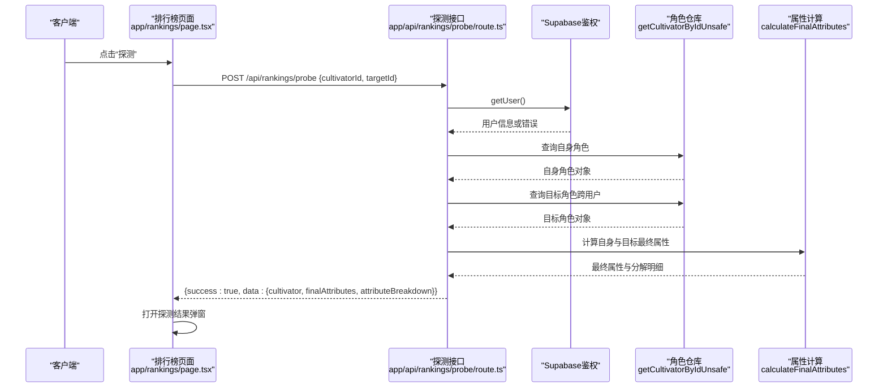
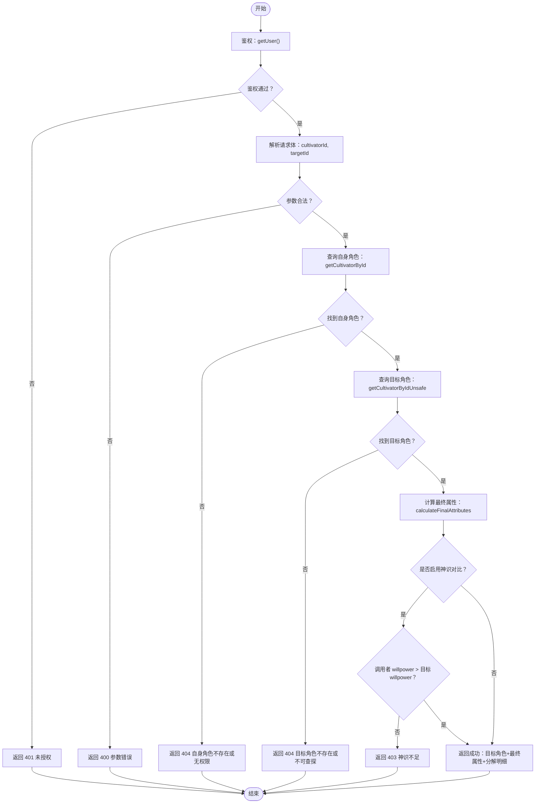
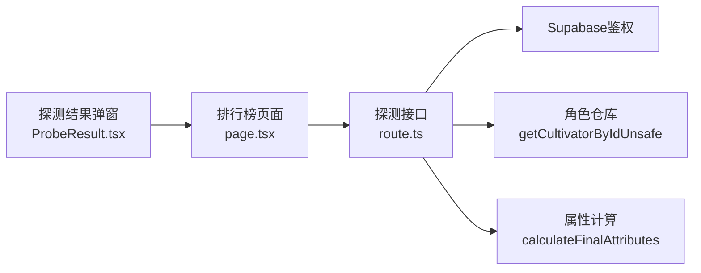

# 探测机制

<cite>
**本文引用的文件**
- [app/api/rankings/probe/route.ts](file://app/api/rankings/probe/route.ts)
- [lib/repositories/cultivatorRepository.ts](file://lib/repositories/cultivatorRepository.ts)
- [utils/cultivatorUtils.ts](file://utils/cultivatorUtils.ts)
- [app/rankings/page.tsx](file://app/rankings/page.tsx)
- [components/func/ProbeResult.tsx](file://components/func/ProbeResult.tsx)
- [types/cultivator.ts](file://types/cultivator.ts)
- [engine/status/calculators/ResistanceCalculator.ts](file://engine/status/calculators/ResistanceCalculator.ts)
- [engine/status/StatusContainer.ts](file://engine/status/StatusContainer.ts)
</cite>

## 目录
1. [引言](#引言)
2. [项目结构](#项目结构)
3. [核心组件](#核心组件)
4. [架构总览](#架构总览)
5. [详细组件分析](#详细组件分析)
6. [依赖关系分析](#依赖关系分析)
7. [性能与可扩展性](#性能与可扩展性)
8. [故障排查指南](#故障排查指南)
9. [结论](#结论)
10. [附录](#附录)

## 引言
本文件围绕“神识探测（probe）”机制展开，基于后端接口 app/api/rankings/probe/route.ts 的 POST 请求，系统性解析其如何通过 getCultivatorByIdUnsafe 实现跨用户获取目标角色的完整数据，用于战前情报收集；解释 calculateFinalAttributes 在探测中的作用，用于计算双方最终属性以判定探测成功率（当前版本已注释）；并总结接口的安全设计、反作弊考量、流程图、成功/失败响应示例，以及未来可扩展的探测等级机制建议。

## 项目结构
与“神识探测”直接相关的代码分布在以下模块：
- 后端接口层：app/api/rankings/probe/route.ts
- 数据访问层：lib/repositories/cultivatorRepository.ts（提供 getCultivatorByIdUnsafe 等方法）
- 属性计算工具：utils/cultivatorUtils.ts（提供 calculateFinalAttributes）
- 前端交互与展示：app/rankings/page.tsx、components/func/ProbeResult.tsx
- 类型定义：types/cultivator.ts
- 游戏内其他使用“神识/意志”的系统：engine/status/calculators/ResistanceCalculator.ts、engine/status/StatusContainer.ts

图表来源
- [app/api/rankings/probe/route.ts](file://app/api/rankings/probe/route.ts#L1-L89)
- [lib/repositories/cultivatorRepository.ts](file://lib/repositories/cultivatorRepository.ts#L424-L455)
- [utils/cultivatorUtils.ts](file://utils/cultivatorUtils.ts#L51-L194)
- [app/rankings/page.tsx](file://app/rankings/page.tsx#L119-L147)
- [components/func/ProbeResult.tsx](file://components/func/ProbeResult.tsx#L1-L116)
- [engine/status/calculators/ResistanceCalculator.ts](file://engine/status/calculators/ResistanceCalculator.ts#L1-L26)
- [engine/status/StatusContainer.ts](file://engine/status/StatusContainer.ts#L48-L78)

章节来源
- [app/api/rankings/probe/route.ts](file://app/api/rankings/probe/route.ts#L1-L89)
- [lib/repositories/cultivatorRepository.ts](file://lib/repositories/cultivatorRepository.ts#L424-L455)
- [utils/cultivatorUtils.ts](file://utils/cultivatorUtils.ts#L51-L194)
- [app/rankings/page.tsx](file://app/rankings/page.tsx#L119-L147)
- [components/func/ProbeResult.tsx](file://components/func/ProbeResult.tsx#L1-L116)

## 核心组件
- 探测接口（POST /api/rankings/probe）
  - 身份验证：使用 Supabase 用户会话校验请求合法性
  - 输入验证：校验请求体包含自身角色ID与目标角色ID
  - 数据获取：通过 getCultivatorById 获取调用者自身角色；通过 getCultivatorByIdUnsafe 跨用户获取目标角色完整数据
  - 成功判定：当前版本注释掉“神识对比”逻辑，直接返回目标角色的最终属性与分解明细
  - 错误处理：统一捕获异常并按环境返回友好提示
- 角色仓库（CultivatorRepository）
  - getCultivatorByIdUnsafe：系统级查询，不进行用户匹配校验，仅筛选有效角色
- 属性计算（calculateFinalAttributes）
  - 统计基础属性、命格加成、功法加成、装备加成，并返回最终属性与分解明细
- 前端交互
  - 排行榜页面触发探测请求，接收成功/失败响应并展示结果弹窗
  - 探测结果弹窗展示目标角色的基础属性与最终属性、分解明细等

章节来源
- [app/api/rankings/probe/route.ts](file://app/api/rankings/probe/route.ts#L9-L88)
- [lib/repositories/cultivatorRepository.ts](file://lib/repositories/cultivatorRepository.ts#L424-L455)
- [utils/cultivatorUtils.ts](file://utils/cultivatorUtils.ts#L51-L194)
- [app/rankings/page.tsx](file://app/rankings/page.tsx#L119-L147)
- [components/func/ProbeResult.tsx](file://components/func/ProbeResult.tsx#L1-L116)

## 架构总览
探测流程从浏览器发起，经由 Next.js API 路由，到 Supabase 鉴权与数据库查询，再到属性计算与结果返回。前端负责展示与交互。

图表来源
- [app/rankings/page.tsx](file://app/rankings/page.tsx#L119-L147)
- [app/api/rankings/probe/route.ts](file://app/api/rankings/probe/route.ts#L9-L88)
- [lib/repositories/cultivatorRepository.ts](file://lib/repositories/cultivatorRepository.ts#L424-L455)
- [utils/cultivatorUtils.ts](file://utils/cultivatorUtils.ts#L51-L194)

## 详细组件分析

### 探测接口（POST /api/rankings/probe）
- 身份验证
  - 使用 Supabase 服务端客户端获取当前用户，若无用户或鉴权失败，返回未授权错误
- 输入验证
  - 校验请求体必须包含字符串类型的 cultivatorId 与 targetId，否则返回参数错误
- 数据获取
  - 自身角色：通过 getCultivatorById(userId, cultivatorId) 获取，要求角色属于当前用户且处于激活状态
  - 目标角色：通过 getCultivatorByIdUnsafe(targetId) 获取，系统级查询，不校验当前用户，仅筛选有效角色
- 成功判定与返回
  - 当前版本注释掉了“神识对比”逻辑，直接返回目标角色的完整数据与最终属性分解
  - 返回字段包括：success、data.cultivator、data.finalAttributes、data.attributeBreakdown
- 错误处理
  - 捕获异常并按开发/生产环境返回不同错误消息，统一返回 500

章节来源
- [app/api/rankings/probe/route.ts](file://app/api/rankings/probe/route.ts#L9-L88)

### 角色仓库（CultivatorRepository）
- getCultivatorByIdUnsafe
  - 查询条件：角色ID匹配且状态为“active”，不进行用户匹配校验
  - 返回：组装后的角色对象与拥有者ID、更新时间等
- getCultivatorById
  - 查询条件：角色ID匹配且用户ID匹配且状态为“active”，用于确保调用者只能读取自己的角色

章节来源
- [lib/repositories/cultivatorRepository.ts](file://lib/repositories/cultivatorRepository.ts#L322-L343)
- [lib/repositories/cultivatorRepository.ts](file://lib/repositories/cultivatorRepository.ts#L424-L455)

### 属性计算（calculateFinalAttributes）
- 输入：角色对象
- 输出：最终属性 final 与分解明细 breakdown（基础、命格、功法、装备、上限）
- 计算步骤
  - 基础属性：直接取自角色 attributes
  - 命格加成：遍历 pre_heaven_fates 并累加对应属性加成
  - 功法加成：遍历 cultivations 并累加对应属性加成
  - 装备加成：根据 equipped 武器/护甲/饰品在 inventory 中查找并累加对应属性加成
  - 最终属性：基础 + 命格 + 功法 + 装备
  - 上限：根据当前境界阶段获取属性上限
  - 额外：计算最大血量与最大蓝量

章节来源
- [utils/cultivatorUtils.ts](file://utils/cultivatorUtils.ts#L51-L194)
- [types/cultivator.ts](file://types/cultivator.ts#L21-L27)

### 前端交互与展示
- 排行榜页面
  - 发起探测请求：POST /api/rankings/probe，携带自身角色ID与目标ID
  - 成功时设置探测结果，失败时弹出提示
- 探测结果弹窗
  - 展示目标角色名称、境界与阶段、基础属性与最终属性对比、分解明细
  - 可视化显示属性从基础到最终的变化

章节来源
- [app/rankings/page.tsx](file://app/rankings/page.tsx#L119-L147)
- [components/func/ProbeResult.tsx](file://components/func/ProbeResult.tsx#L1-L116)

### 反作弊与安全设计
- 身份验证
  - 通过 Supabase getUser() 确保调用者为已登录用户，防止匿名访问
- 输入验证
  - 对请求体进行严格校验，缺失或类型不符将直接返回错误
- 数据隔离
  - 自身角色查询使用 getCultivatorById，强制用户匹配，防止越权读取
  - 目标角色查询使用 getCultivatorByIdUnsafe，系统级回表，不进行用户匹配，但仅返回有效角色
- 错误处理
  - 统一捕获异常，开发环境输出具体错误，生产环境输出通用提示，避免信息泄露
- 反作弊考量
  - 当前版本注释掉了“神识对比”逻辑，即未基于双方最终属性中的 willpower 进行成功率判定
  - 未来可引入 willpower 对比，当调用者 willpower 小于等于目标 willpower 时拒绝返回完整数据，从而限制滥用

章节来源
- [app/api/rankings/probe/route.ts](file://app/api/rankings/probe/route.ts#L9-L88)
- [lib/repositories/cultivatorRepository.ts](file://lib/repositories/cultivatorRepository.ts#L322-L343)
- [lib/repositories/cultivatorRepository.ts](file://lib/repositories/cultivatorRepository.ts#L424-L455)

### 探测流程图

图表来源
- [app/api/rankings/probe/route.ts](file://app/api/rankings/probe/route.ts#L9-L88)
- [lib/repositories/cultivatorRepository.ts](file://lib/repositories/cultivatorRepository.ts#L322-L343)
- [lib/repositories/cultivatorRepository.ts](file://lib/repositories/cultivatorRepository.ts#L424-L455)
- [utils/cultivatorUtils.ts](file://utils/cultivatorUtils.ts#L51-L194)

### 成功/失败响应示例
- 成功响应
  - 结构：{ success: true, data: { cultivator, finalAttributes, attributeBreakdown } }
  - 说明：返回目标角色的完整数据与其最终属性与分解明细
- 失败响应
  - 未授权：{ error: "未授权访问" }（401）
  - 参数错误：{ error: "请提供有效的自身角色ID/目标角色ID" }（400）
  - 自身角色不存在或无权限：{ error: "自身角色不存在或无权限" }（404）
  - 目标角色不存在或不可查探：{ error: "目标角色不存在或不可查探" }（404）
  - 神识不足（未来启用）：{ error: "你的神识不足，未能窥破对方底细" }（403）
  - 服务器错误：{ error: "神识查探失败，请稍后重试" }（500）

章节来源
- [app/api/rankings/probe/route.ts](file://app/api/rankings/probe/route.ts#L9-L88)

### 未来可扩展的探测等级机制
- 基于 willpower 的成功率判定
  - 当前注释逻辑可恢复：比较调用者与目标的 willpower，设定阈值决定是否允许返回完整数据
  - 可引入多级探测等级：例如“窥探”“洞察”“看破”等，分别对应不同的 willpower 阈值与返回信息粒度
- 与战斗系统联动
  - 参考游戏内“意志/神识”系统（如状态抵抗计算），可在探测中复用类似公式，使 willpower 的影响更贴合整体数值体系
- 防刷与冷却
  - 可增加探测冷却时间或每日次数限制，结合 willpower 成功率，降低滥用风险

章节来源
- [app/api/rankings/probe/route.ts](file://app/api/rankings/probe/route.ts#L61-L67)
- [engine/status/calculators/ResistanceCalculator.ts](file://engine/status/calculators/ResistanceCalculator.ts#L1-L26)
- [engine/status/StatusContainer.ts](file://engine/status/StatusContainer.ts#L48-L78)

## 依赖关系分析
- 探测接口依赖 Supabase 鉴权、角色仓库与属性计算工具
- 角色仓库提供两类查询：用户级（getCultivatorById）与系统级（getCultivatorByIdUnsafe）
- 属性计算工具提供统一的最终属性与分解明细，供探测与战斗等场景复用
- 前端页面通过 fetch 调用探测接口，并在成功后渲染结果弹窗

图表来源
- [app/api/rankings/probe/route.ts](file://app/api/rankings/probe/route.ts#L1-L88)
- [lib/repositories/cultivatorRepository.ts](file://lib/repositories/cultivatorRepository.ts#L424-L455)
- [utils/cultivatorUtils.ts](file://utils/cultivatorUtils.ts#L51-L194)
- [app/rankings/page.tsx](file://app/rankings/page.tsx#L119-L147)
- [components/func/ProbeResult.tsx](file://components/func/ProbeResult.tsx#L1-L116)

## 性能与可扩展性
- 性能特性
  - 探测涉及两次数据库查询（自身角色与目标角色），均为单条记录检索，复杂度低
  - 属性计算为线性遍历命格、功法与装备，复杂度与数量线性相关
- 可扩展性
  - 将 willpower 对比逻辑纳入探测判定，可按等级细化返回信息
  - 可引入缓存策略（如 Redis）存储热门目标的基础信息，减少数据库压力
  - 可增加探测日志与风控指标，便于后续审计与反作弊优化

[本节为通用性能讨论，无需列出章节来源]

## 故障排查指南
- 401 未授权
  - 检查 Supabase 登录状态与会话有效性
- 400 参数错误
  - 确认请求体包含字符串类型的 cultivatorId 与 targetId
- 404 自身角色不存在或无权限
  - 确认调用者与角色绑定关系，角色状态为“active”
- 404 目标角色不存在或不可查探
  - 确认目标角色存在且状态为“active”
- 500 服务器错误
  - 查看服务端日志，确认数据库连接与异常捕获逻辑正常

章节来源
- [app/api/rankings/probe/route.ts](file://app/api/rankings/probe/route.ts#L9-L88)

## 结论
“神识探测”机制通过 Supabase 鉴权与严格的输入校验保障安全性，利用 getCultivatorByIdUnsafe 实现跨用户的目标角色数据获取，并通过 calculateFinalAttributes 提供最终属性与分解明细，为战前情报收集提供关键依据。当前版本已注释掉 willpower 对比逻辑，未来可通过引入 willpower 成功率判定与多级探测等级，进一步完善反作弊与信息粒度控制，提升系统平衡性与可玩性。

[本节为总结性内容，无需列出章节来源]

## 附录
- 关键路径参考
  - 探测接口：[app/api/rankings/probe/route.ts](file://app/api/rankings/probe/route.ts#L9-L88)
  - 角色仓库（系统级查询）：[lib/repositories/cultivatorRepository.ts](file://lib/repositories/cultivatorRepository.ts#L424-L455)
  - 属性计算工具：[utils/cultivatorUtils.ts](file://utils/cultivatorUtils.ts#L51-L194)
  - 前端触发与展示：[app/rankings/page.tsx](file://app/rankings/page.tsx#L119-L147)、[components/func/ProbeResult.tsx](file://components/func/ProbeResult.tsx#L1-L116)
  - willpower 相关系统参考：[engine/status/calculators/ResistanceCalculator.ts](file://engine/status/calculators/ResistanceCalculator.ts#L1-L26)、[engine/status/StatusContainer.ts](file://engine/status/StatusContainer.ts#L48-L78)