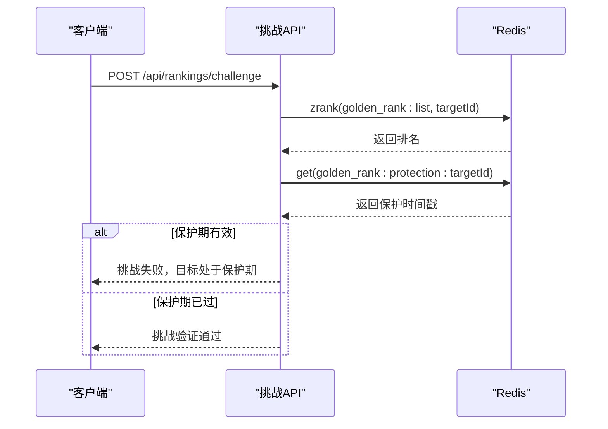
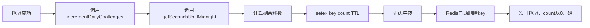

# 同步策略

<cite>
**本文档引用的文件**  
- [rankings.ts](file://lib/redis/rankings.ts)
- [rank-rewards/route.ts](file://app/api/cron/rank-rewards/route.ts)
- [challenge/route.ts](file://app/api/rankings/challenge/route.ts)
- [route.ts](file://app/api/rankings/route.ts)
- [my-rank/route.ts](file://app/api/rankings/my-rank/route.ts)
- [page.tsx](file://app/rankings/page.tsx)
- [constants.ts](file://types/constants.ts)
- [index.ts](file://lib/redis/index.ts)
</cite>

## 目录
1. [引言](#引言)
2. [排行榜数据生命周期管理](#排行榜数据生命周期管理)
3. [角色上榜与保护机制](#角色上榜与保护机制)
4. [每日定时任务与奖励结算](#每日定时任务与奖励结算)
5. [挑战次数重置与TTL计算](#挑战次数重置与ttl计算)
6. [角色下榜与数据清理](#角色下榜与数据清理)
7. [性能优化建议](#性能优化建议)
8. [异常处理与数据一致性](#异常处理与数据一致性)
9. [总结](#总结)

## 引言

本文档详细阐述了“万界金榜”系统的数据同步策略，重点围绕排行榜数据的生命周期管理。系统采用Redis作为核心缓存与排行榜存储，结合Vercel Cron定时任务实现每日结算，确保了高并发场景下的性能与数据一致性。文档将深入解析角色从上榜、挑战、保护到下榜的完整流程，并说明定时任务如何触发奖励发放与状态重置。

**Section sources**
- [rankings.ts](file://lib/redis/rankings.ts#L1-L409)
- [rank-rewards/route.ts](file://app/api/cron/rank-rewards/route.ts#L1-L68)

## 排行榜数据生命周期管理

排行榜数据的生命周期始于角色首次上榜，终于角色被移除或退出榜单。整个生命周期由Redis ZSET（有序集合）驱动，确保了排名的高效查询与更新。

1.  **数据存储**：排行榜使用Redis ZSET，键名为`golden_rank:list`。集合中的每个成员（member）是角色ID（`cultivatorId`），分数（score）代表其排名（1为最高）。
2.  **数据读取**：前端通过`/api/rankings`接口获取榜单。该接口调用`getRankingList()`函数，先从ZSET获取ID和排名顺序，再通过`getCultivatorBasicsByIdsUnsafe()`批量查询角色的最新基础信息，实现“回表查询”以保证数据新鲜度。
3.  **数据更新**：排名变动（如挑战成功）通过`updateRanking()`函数在Redis Pipeline中完成，确保了原子性。
4.  **数据清理**：每日定时任务和角色下榜操作会触发相关键的清理。

```mermaid
flowchart TD
A[角色首次上榜] --> B[调用addToRanking]
B --> C[写入Redis ZSET]
C --> D[设置PROTECTION保护键]
D --> E[角色挑战他人]
E --> F[调用updateRanking]
F --> G[Pipeline更新ZSET]
G --> H[每日00:00]
H --> I[Vercel Cron触发]
I --> J[/api/cron/rank-rewards]
J --> K[结算奖励]
K --> L[清理挑战计数]
L --> M[角色被移除]
M --> N[调用removeFromRanking]
N --> O[从ZSET删除]
O --> P[清理遗留数据]
```

**Diagram sources**
- [rankings.ts](file://lib/redis/rankings.ts#L125-L157)
- [rank-rewards/route.ts](file://app/api/cron/rank-rewards/route.ts#L7-L67)
- [rankings.ts](file://lib/redis/rankings.ts#L385-L390)

## 角色上榜与保护机制

当一个角色首次进入排行榜时，系统会执行一系列操作以确保其顺利上榜并获得初始保护。

1.  **上榜操作**：`addToRanking`函数负责将角色添加到排行榜。如果指定了目标排名（`targetRank`），系统会先调用`adjustRankingsAfterInsert`调整后续所有角色的排名，然后将新角色插入指定位置。若未指定，则直接追加到末尾。
2.  **保护机制**：角色一旦上榜，系统会立即为其创建一个保护键（`golden_rank:protection:<cultivatorId>`），并设置过期时间（`PROTECTION_DURATION`，默认1800秒，即30分钟）。在此期间，其他角色无法挑战该新上榜者。
3.  **挑战验证**：在发起挑战前，`/api/rankings/challenge`接口会调用`isProtected()`函数检查被挑战者是否处于保护期。如果返回`true`，则挑战请求会被拒绝。



**Diagram sources**
- [rankings.ts](file://lib/redis/rankings.ts#L125-L157)
- [rankings.ts](file://lib/redis/rankings.ts#L330-L340)
- [challenge/route.ts](file://app/api/rankings/challenge/route.ts#L107-L113)

## 每日定时任务与奖励结算

系统通过Vercel提供的Cron功能，每日在午夜自动触发一次排名结算与奖励发放流程。

1.  **定时任务配置**：在`vercel.json`文件中，配置了`/api/cron/rank-rewards`接口的触发时间为`0 0 * * *`，即每天的00:00 UTC。
2.  **奖励结算**：`/api/cron/rank-rewards/route.ts`中的`GET`函数被触发。该函数会：
    *   从数据库中获取当前排名前100的角色ID（此逻辑为简化版，实际应与排行榜API一致）。
    *   遍历这些角色，根据其排名（第1、2、3名，4-10名等）从`RANKING_REWARDS`常量中查询对应的灵石奖励。
    *   使用Drizzle ORM的`update`语句，原子性地增加每个角色的`spirit_stones`（灵石）数量。
3.  **日志记录**：结算过程会生成日志，记录每个排名的奖励数额，便于监控和审计。

**Section sources**
- [vercel.json](file://vercel.json#L1-L13)
- [rank-rewards/route.ts](file://app/api/cron/rank-rewards/route.ts#L7-L67)
- [constants.ts](file://types/constants.ts#L203-L211)

## 挑战次数重置与TTL计算

为了实现每日挑战次数的自动重置，系统巧妙地利用了Redis的Key过期机制（TTL）。

1.  **挑战计数存储**：每个角色的每日挑战次数存储在以`golden_rank:daily_challenges:<cultivatorId>:YYYY-MM-DD`为键的Redis字符串中。
2.  **TTL设置**：每次挑战成功后，`incrementDailyChallenges`函数会调用`getSecondsUntilMidnight()`函数，计算从当前时间到当日午夜的剩余秒数。
3.  **自动重置**：`setex`命令会使用计算出的TTL来设置挑战计数键。当到达午夜时，该键会自动过期并被Redis删除。下一次挑战时，由于键不存在，系统会从0开始计数，从而实现了每日挑战次数的自动重置。



**Diagram sources**
- [rankings.ts](file://lib/redis/rankings.ts#L295-L309)
- [rankings.ts](file://lib/redis/rankings.ts#L403-L408)

## 角色下榜与数据清理

当角色被删除或主动退出榜单时，需要清理其在排行榜中的所有相关数据。

1.  **下榜操作**：`removeFromRanking`函数是核心清理函数。它首先使用`zrem`命令从`golden_rank:list` ZSET中移除该角色，使其不再出现在榜单上。
2.  **兼容性清理**：为了兼容旧版本的数据结构，该函数还会删除一个遗留的哈希键（`golden_rank:cultivator:<cultivatorId>`）。这体现了系统在迭代升级过程中对数据兼容性的考虑。
3.  **挑战锁清理**：虽然`removeFromRanking`未直接处理，但`acquireChallengeLock`和`releaseChallengeLock`函数通过设置5分钟的过期时间（`LOCK_DURATION`），确保了即使角色下榜，其挑战锁也会在短时间内自动释放，避免了死锁。

**Section sources**
- [rankings.ts](file://lib/redis/rankings.ts#L385-L390)

## 性能优化建议

在大规模并发写入场景下（如大量用户同时挑战），为保证系统性能，建议采用以下优化策略：

1.  **使用Redis Pipeline**：当前的`updateRanking`和`adjustRankingsAfterInsert`函数已经使用了Pipeline，这是正确的做法。它将多个Redis命令打包发送，显著减少了网络往返延迟。
2.  **批量操作**：在定时任务结算奖励时，虽然数据库操作是逐个执行的，但由于是后台任务且频率低，影响较小。对于更频繁的批量操作，应考虑数据库的批量更新功能。
3.  **缓存预热**：在每日结算后，可以考虑将新的前100名角色信息预热到Redis中，减少后续API请求的数据库查询压力。

## 异常处理与数据一致性

系统在设计上充分考虑了异常情况，以保障数据的一致性：

1.  **原子性操作**：关键的排名更新操作（`updateRanking`）全部在Redis Pipeline中执行，保证了多个ZADD命令的原子性，避免了中间状态导致的数据不一致。
2.  **分布式锁**：`acquireChallengeLock`函数使用`SET NX EX`命令为每个挑战者创建一个带过期时间的锁，防止了同一角色在短时间内发起多次挑战，保证了挑战逻辑的串行化。
3.  **错误捕获**：所有API接口都包裹在`try-catch`块中，能够捕获运行时错误，并返回友好的错误信息，避免了服务崩溃。
4.  **数据校验**：在写入和读取数据前，都进行了严格的输入校验（如检查`cultivatorId`是否存在、用户是否有权限等），防止了无效或恶意数据的注入。

## 总结

本文档全面解析了“万界金榜”系统的数据同步策略。系统通过Redis ZSET实现了高效的排行榜存储与查询，利用保护键和挑战锁机制维护了游戏的公平性。通过Vercel Cron定时任务和Redis TTL的巧妙结合，实现了每日奖励结算与挑战次数的自动化管理。`addToRanking`和`removeFromRanking`函数构成了数据生命周期的起点与终点，而Pipeline和分布式锁则确保了高并发下的数据一致性。整体设计兼顾了性能、可靠性和可维护性。