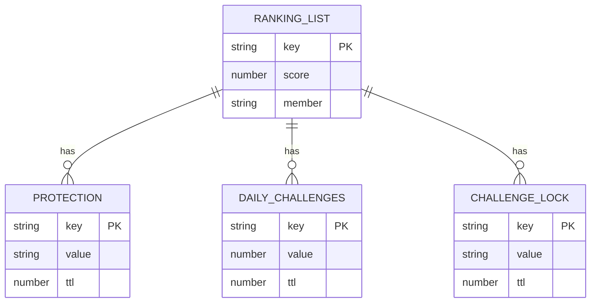
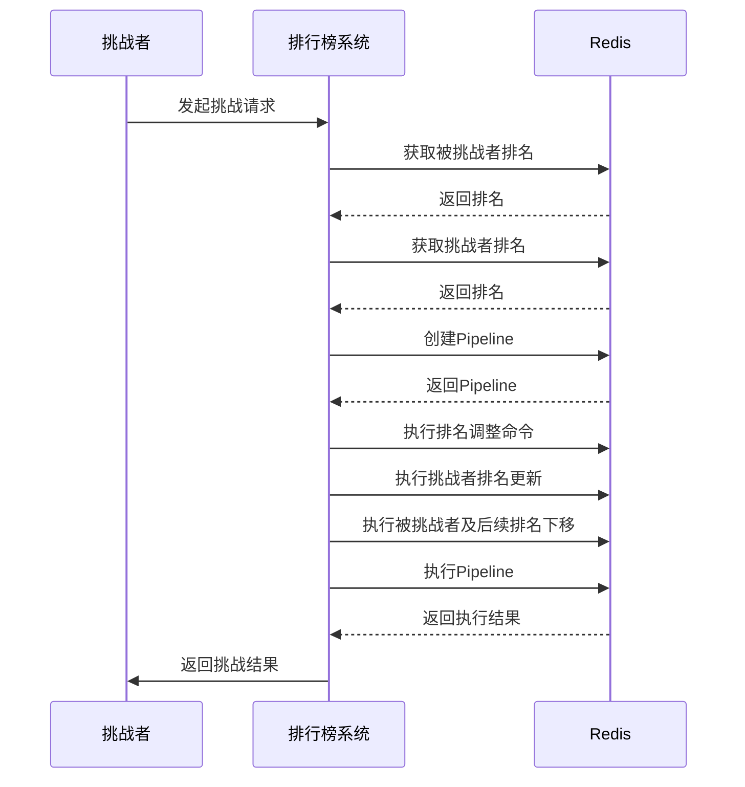
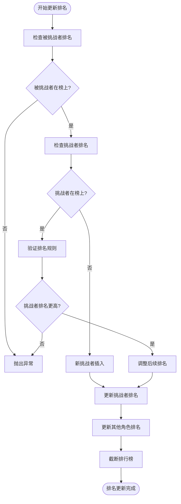
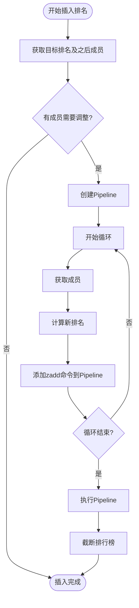
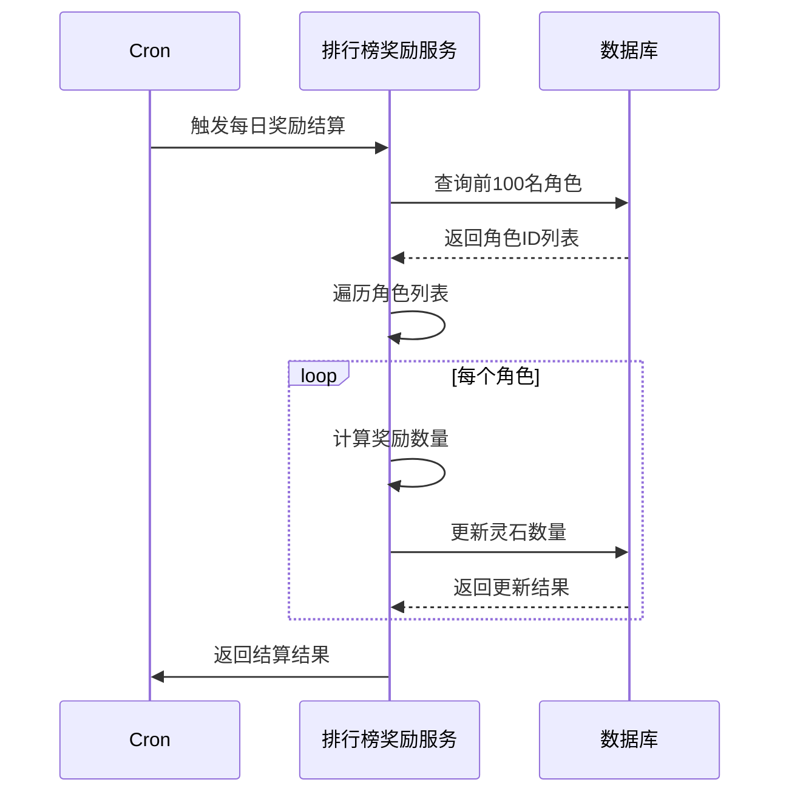
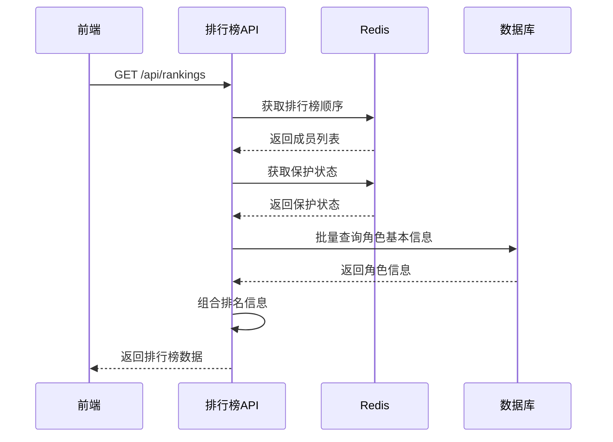
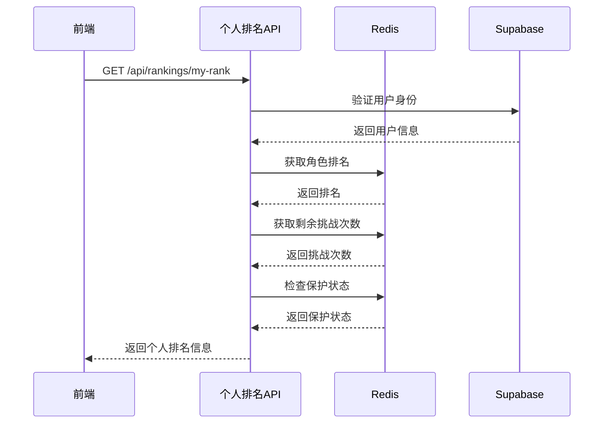
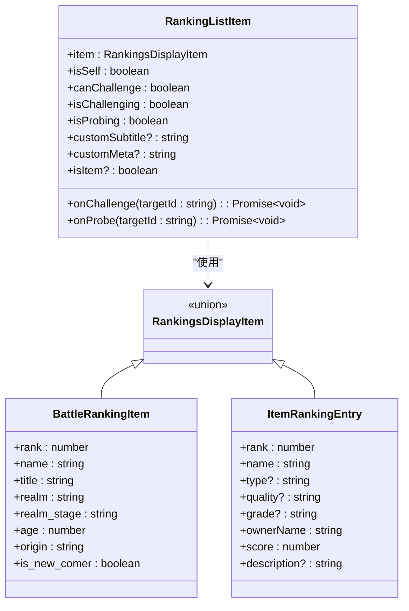
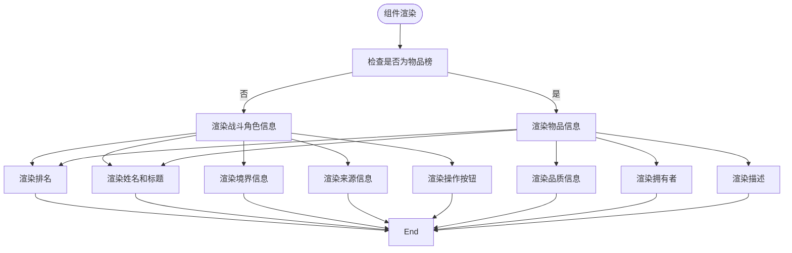

# 排名机制

<cite>
**本文档引用的文件**   
- [rankings.ts](file://lib/redis/rankings.ts)
- [route.ts](file://app/api/rankings/route.ts)
- [my-rank/route.ts](file://app/api/rankings/my-rank/route.ts)
- [RankingListItem.tsx](file://components/RankingListItem.tsx)
- [index.ts](file://lib/redis/index.ts)
- [rank-rewards/route.ts](file://app/api/cron/rank-rewards/route.ts)
- [rankingUtils.ts](file://utils/rankingUtils.ts)
- [constants.ts](file://types/constants.ts)
</cite>

## 目录
1. [简介](#简介)
2. [核心数据结构与算法](#核心数据结构与算法)
3. [Redis Sorted Set 排名实现](#redis-sorted-set-排名实现)
4. [核心操作与原子性保障](#核心操作与原子性保障)
5. [定时任务与数据同步](#定时任务与数据同步)
6. [API 接口设计](#api-接口设计)
7. [前端组件与用户交互](#前端组件与用户交互)
8. [性能优化与内存管理](#性能优化与内存管理)
9. [总结](#总结)

## 简介
本系统实现了基于 Redis Sorted Set 的高效、实时排行榜排名机制，支持万界金榜的实时更新、挑战、查询等功能。系统通过 Redis 的有序集合（Sorted Set）数据结构，以排名作为分值（score），角色 ID 作为成员（member），实现了 O(log N) 复杂度的插入、删除和范围查询操作。排行榜支持 TOP 100 自动截断、新上榜保护、每日挑战次数限制等特性，并通过 Vercel Cron 定时任务实现每日奖励结算。

## 核心数据结构与算法
系统定义了清晰的排名数据结构和算法，确保数据的一致性和可扩展性。

### 排名项数据结构
```typescript
export interface RankingItem extends CultivatorBasic {
  rank: number;
  faction?: string;
  is_new_comer: boolean; // 是否为新天骄（2小时内）
  updated_at: number;
}
```

### 排名信息查询结构
```typescript
export interface CultivatorRankInfo {
  rank: number | null; // null表示不在榜上
  isProtected: boolean;
  remainingChallenges: number;
}
```

### 排行榜常量配置
```typescript
const MAX_RANKING_SIZE = 100; // 排行榜最大容量
const PROTECTION_DURATION = 1800; // 保护期时长（秒）
const LOCK_DURATION = 300; // 挑战锁时长（秒）
const MAX_DAILY_CHALLENGES = 10; // 每日最大挑战次数
```

**Section sources**
- [rankings.ts](file://lib/redis/rankings.ts#L14-L17)

## Redis Sorted Set 排名实现
系统利用 Redis Sorted Set 的有序特性实现高效的排名计算与范围查询。

### 数据结构设计
系统采用 Redis Sorted Set 存储排行榜数据，其中：
- **Key**: `golden_rank:list` - 存储所有上榜角色的有序集合
- **Score**: 使用排名作为分值（1-based），确保排名越靠前分值越小
- **Member**: 角色 ID（cultivatorId），作为集合中的成员

### 辅助数据结构
系统使用多个 Redis Key 前缀管理辅助信息：
- `golden_rank:protection:` - 新上榜保护状态
- `golden_rank:daily_challenges:` - 每日挑战次数计数
- `golden_rank:challenge_lock:` - 挑战锁状态



**Diagram sources **
- [rankings.ts](file://lib/redis/rankings.ts#L8-L12)

## 核心操作与原子性保障
系统通过精心设计的算法和 Redis Pipeline 机制确保核心操作的原子性和一致性。

### 排名更新流程


**Diagram sources **
- [rankings.ts](file://lib/redis/rankings.ts#L190-L270)

### 排名更新原子性保障
`updateRanking` 函数通过 Redis Pipeline 确保所有操作的原子性：



**Diagram sources **
- [rankings.ts](file://lib/redis/rankings.ts#L190-L270)

### 排名插入与调整
当需要在特定位置插入排名时，系统先调整后续排名，再插入新成员：



**Diagram sources **
- [rankings.ts](file://lib/redis/rankings.ts#L162-L185)

**Section sources**
- [rankings.ts](file://lib/redis/rankings.ts#L162-L185)

## 定时任务与数据同步
系统通过定时任务实现排行榜数据的同步和奖励结算。

### 定时任务配置
Vercel Cron 配置文件定义了定时任务的执行计划：

```json
{
  "crons": [
    {
      "path": "/api/market",
      "schedule": "0 1 * * *"
    },
    {
      "path": "/api/cron/rank-rewards",
      "schedule": "0 0 * * *"
    }
  ]
}
```

### 每日奖励结算流程


**Diagram sources **
- [vercel.json](file://vercel.json#L3-L12)
- [rank-rewards/route.ts](file://app/api/cron/rank-rewards/route.ts#L7-L67)

### 奖励规则配置
```typescript
export const RANKING_REWARDS = {
  1: 30000,
  2: 20000,
  3: 15000,
  '4-10': 8000,
  '11-50': 5000,
  '51-100': 2000,
  default: 1000,
};
```

**Section sources**
- [rank-rewards/route.ts](file://app/api/cron/rank-rewards/route.ts#L3-L46)
- [constants.ts](file://types/constants.ts#L182-L189)

## API 接口设计
系统提供了清晰的 API 接口供前端调用。

### 主榜单查询接口


**Diagram sources **
- [route.ts](file://app/api/rankings/route.ts#L9-L30)
- [rankings.ts](file://lib/redis/rankings.ts#L76-L108)

### 个人排名查询接口


**Diagram sources **
- [my-rank/route.ts](file://app/api/rankings/my-rank/route.ts#L13-L62)

**Section sources**
- [route.ts](file://app/api/rankings/route.ts#L9-L30)
- [my-rank/route.ts](file://app/api/rankings/my-rank/route.ts#L13-L62)

## 前端组件与用户交互
前端组件实现了榜单数据的渲染和用户交互功能。

### 排行榜列表项组件


**Diagram sources **
- [RankingListItem.tsx](file://components/RankingListItem.tsx#L23-L34)
- [rankings.ts](file://types/rankings.ts#L1-L21)

### 组件渲染逻辑


**Section sources**
- [RankingListItem.tsx](file://components/RankingListItem.tsx#L47-L117)

## 性能优化与内存管理
系统通过多种策略优化性能和内存使用。

### 内存使用估算
假设每个角色基本信息约 200 字节，100 个角色约 20KB，加上 Redis 数据结构开销，总内存使用约 50KB。

### 缓存失效策略
系统采用以下缓存失效策略：
- **TTL 过期**: 每日挑战次数计数在午夜自动过期
- **主动清理**: 移除角色时清理相关缓存数据
- **大小限制**: 排行榜自动截断至 TOP 100

### 并发读写优化
- **读操作**: 使用 Redis 的高效范围查询，支持高并发读取
- **写操作**: 通过 Pipeline 减少网络往返，提高写入效率
- **锁机制**: 使用分布式锁防止并发挑战冲突

**Section sources**
- [rankings.ts](file://lib/redis/rankings.ts#L400-L408)

## 总结
本排名机制通过 Redis Sorted Set 实现了高效、实时的排名计算与查询，支持复杂的排名更新逻辑和丰富的业务功能。系统通过 Pipeline 保证操作原子性，通过定时任务实现数据同步，通过合理的数据结构设计确保性能和可扩展性。前端组件与 API 接口设计清晰，为用户提供流畅的交互体验。