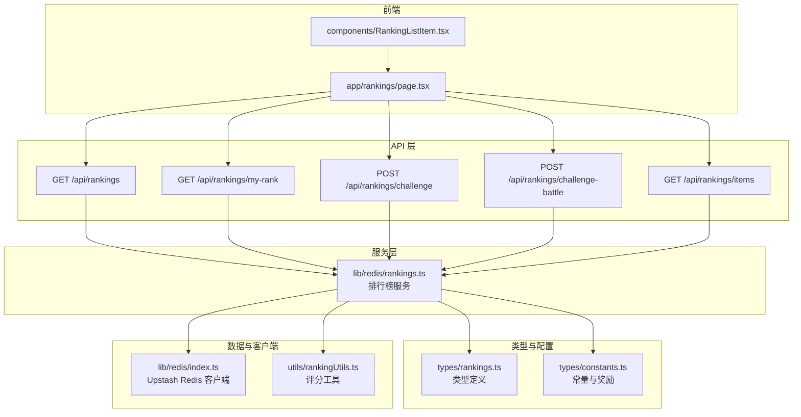
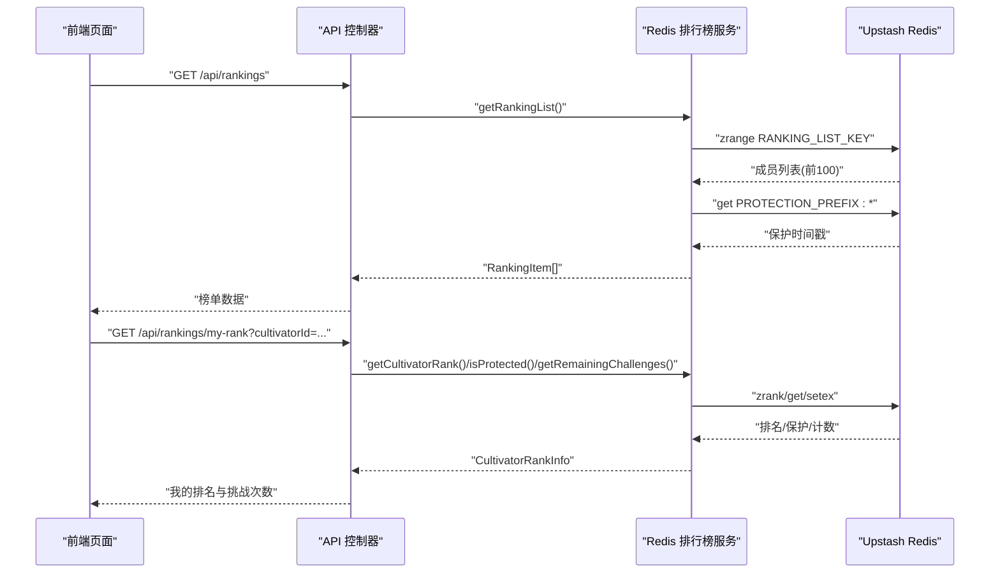
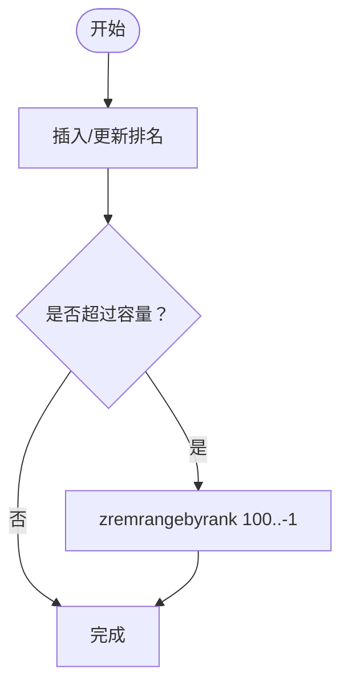
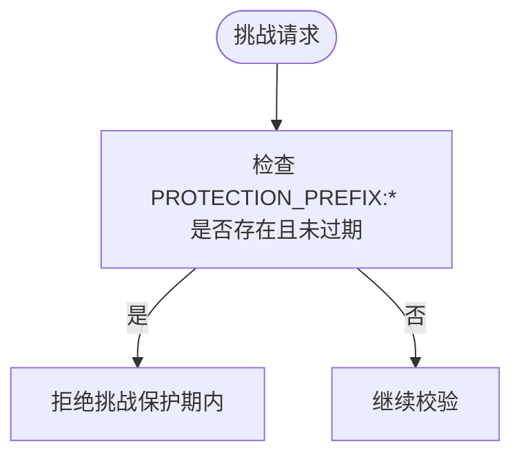
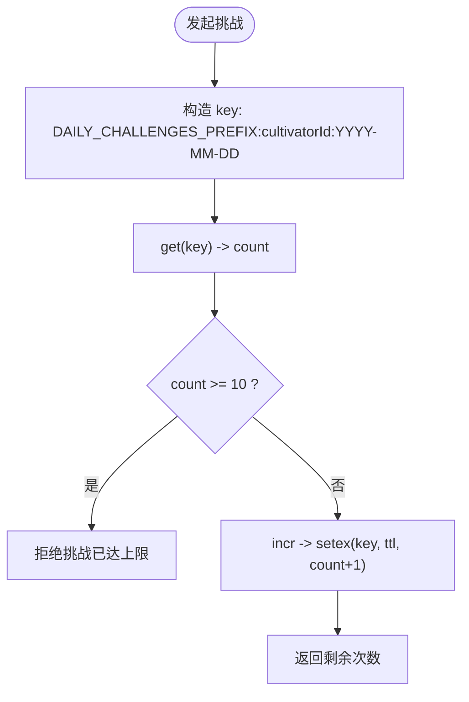
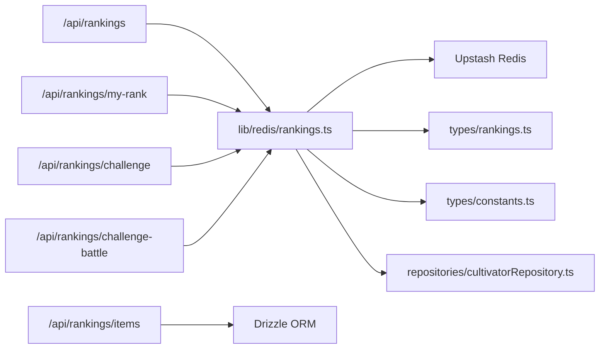

# 数据模型

<cite>
**本文引用的文件**
- [lib/redis/rankings.ts](file://lib/redis/rankings.ts)
- [types/rankings.ts](file://types/rankings.ts)
- [types/constants.ts](file://types/constants.ts)
- [lib/redis/index.ts](file://lib/redis/index.ts)
- [app/api/rankings/route.ts](file://app/api/rankings/route.ts)
- [app/api/rankings/my-rank/route.ts](file://app/api/rankings/my-rank/route.ts)
- [app/api/rankings/challenge/route.ts](file://app/api/rankings/challenge/route.ts)
- [app/api/rankings/challenge-battle/route.ts](file://app/api/rankings/challenge-battle/route.ts)
- [app/api/rankings/items/route.ts](file://app/api/rankings/items/route.ts)
- [components/RankingListItem.tsx](file://components/RankingListItem.tsx)
- [app/rankings/page.tsx](file://app/rankings/page.tsx)
- [utils/rankingUtils.ts](file://utils/rankingUtils.ts)
- [utils/rankingUtils.test.ts](file://utils/rankingUtils.test.ts)
</cite>

## 目录
1. [简介](#简介)
2. [项目结构](#项目结构)
3. [核心组件](#核心组件)
4. [架构总览](#架构总览)
5. [详细组件分析](#详细组件分析)
6. [依赖关系分析](#依赖关系分析)
7. [性能与内存估算](#性能与内存估算)
8. [故障排查指南](#故障排查指南)
9. [结论](#结论)
10. [附录](#附录)

## 简介
本文件聚焦“排行榜数据模型”，系统性阐述以下内容：
- RankingItem 与 CultivatorRankInfo 的字段定义与业务含义
- Redis Sorted Set（ZSET）的使用方式：以 RANKING_LIST_KEY 为主榜单，成员为 cultivatorId，分数为排名（score），实现 O(log N) 的高效插入与查询
- PROTECTION_PREFIX 标记新上榜角色保护期的机制
- DAILY_CHALLENGES_PREFIX 按日期记录挑战次数的计数器设计
- 结合 types/rankings.ts 中的常量配置，说明榜单容量限制（MAX_RANKING_SIZE=100）与每日挑战上限（MAX_DAILY_CHALLENGES=10）的设计考量
- 提供 Redis 内存占用估算方法与监控建议（过期与淘汰策略）

## 项目结构
围绕排行榜的核心文件组织如下：
- Redis 排行榜服务：lib/redis/rankings.ts
- 类型定义：types/rankings.ts
- 常量与配置：types/constants.ts
- Redis 客户端：lib/redis/index.ts
- API 层：app/api/rankings/*
- 前端展示：components/RankingListItem.tsx、app/rankings/page.tsx
- 评分工具：utils/rankingUtils.ts、utils/rankingUtils.test.ts

图表来源
- [lib/redis/rankings.ts](file://lib/redis/rankings.ts#L1-L409)
- [types/rankings.ts](file://types/rankings.ts#L1-L22)
- [types/constants.ts](file://types/constants.ts#L1-L191)
- [lib/redis/index.ts](file://lib/redis/index.ts#L1-L6)
- [app/api/rankings/route.ts](file://app/api/rankings/route.ts#L1-L31)
- [app/api/rankings/my-rank/route.ts](file://app/api/rankings/my-rank/route.ts#L1-L63)
- [app/api/rankings/challenge/route.ts](file://app/api/rankings/challenge/route.ts#L1-L148)
- [app/api/rankings/challenge-battle/route.ts](file://app/api/rankings/challenge-battle/route.ts#L1-L285)
- [app/api/rankings/items/route.ts](file://app/api/rankings/items/route.ts#L1-L111)
- [components/RankingListItem.tsx](file://components/RankingListItem.tsx#L1-L119)
- [app/rankings/page.tsx](file://app/rankings/page.tsx#L1-L404)
- [utils/rankingUtils.ts](file://utils/rankingUtils.ts#L1-L81)

章节来源
- [lib/redis/rankings.ts](file://lib/redis/rankings.ts#L1-L409)
- [types/rankings.ts](file://types/rankings.ts#L1-L22)
- [types/constants.ts](file://types/constants.ts#L1-L191)
- [lib/redis/index.ts](file://lib/redis/index.ts#L1-L6)
- [app/api/rankings/route.ts](file://app/api/rankings/route.ts#L1-L31)
- [app/api/rankings/my-rank/route.ts](file://app/api/rankings/my-rank/route.ts#L1-L63)
- [app/api/rankings/challenge/route.ts](file://app/api/rankings/challenge/route.ts#L1-L148)
- [app/api/rankings/challenge-battle/route.ts](file://app/api/rankings/challenge-battle/route.ts#L1-L285)
- [app/api/rankings/items/route.ts](file://app/api/rankings/items/route.ts#L1-L111)
- [components/RankingListItem.tsx](file://components/RankingListItem.tsx#L1-L119)
- [app/rankings/page.tsx](file://app/rankings/page.tsx#L1-L404)
- [utils/rankingUtils.ts](file://utils/rankingUtils.ts#L1-L81)

## 核心组件
- RankingItem：用于展示“天骄榜”等角色类排行榜的条目，包含基础角色信息与排名、新天骄标记、更新时间戳等字段。
- CultivatorRankInfo：用于查询某角色的排名、保护状态、剩余挑战次数等运行态信息。
- Redis ZSET 主键 RANKING_LIST_KEY：存储所有上榜角色，成员为 cultivatorId，分数为排名（score）。
- PROTECTION_PREFIX：标记新上榜角色的保护期（默认 30 分钟），期间不可被挑战。
- DAILY_CHALLENGES_PREFIX：按日期记录挑战次数的计数器，每日 00:00 自动过期。
- 常量配置：MAX_RANKING_SIZE=100、MAX_DAILY_CHALLENGES=10、PROTECTION_DURATION=1800 秒、LOCK_DURATION=300 秒。

章节来源
- [lib/redis/rankings.ts](file://lib/redis/rankings.ts#L8-L18)
- [lib/redis/rankings.ts](file://lib/redis/rankings.ts#L19-L31)
- [types/constants.ts](file://types/constants.ts#L181-L191)

## 架构总览
排行榜系统由“API 层—服务层—Redis 存储—前端展示”构成，关键交互如下：
- 前端通过 /api/rankings 获取榜单；/api/rankings/my-rank 查询我的排名与剩余挑战次数；/api/rankings/challenge 验证挑战条件；/api/rankings/challenge-battle 执行挑战并流式播报；/api/rankings/items 获取物品类榜单。
- 服务层封装 Redis 操作，包括 ZSET 排名维护、保护期与挑战次数控制、分布式锁等。
- 类型与常量确保前后端一致的数据契约与行为约束。

图表来源
- [app/api/rankings/route.ts](file://app/api/rankings/route.ts#L1-L31)
- [app/api/rankings/my-rank/route.ts](file://app/api/rankings/my-rank/route.ts#L1-L63)
- [lib/redis/rankings.ts](file://lib/redis/rankings.ts#L76-L109)
- [lib/redis/rankings.ts](file://lib/redis/rankings.ts#L114-L120)
- [lib/redis/rankings.ts](file://lib/redis/rankings.ts#L327-L340)
- [lib/redis/rankings.ts](file://lib/redis/rankings.ts#L312-L325)

## 详细组件分析

### 数据模型与字段定义
- RankingItem 字段要点
  - rank：当前排名（1 基）
  - is_new_comer：是否为新天骄（2 小时内）
  - updated_at：更新时间戳（毫秒）
  - 继承自 CultivatorBasic 的基础字段：id、name、title、age、realm、realm_stage、origin、gender、personality、background、updatedAt 等
  - 业务含义：用于渲染“天骄榜”条目，标注新天骄与更新时间，便于前端展示与交互
- CultivatorRankInfo 字段要点
  - rank：当前排名（null 表示未上榜）
  - isProtected：是否处于保护期
  - remainingChallenges：今日剩余挑战次数
  - 业务含义：用于“我的排名”页与挑战前置校验

章节来源
- [lib/redis/rankings.ts](file://lib/redis/rankings.ts#L19-L31)
- [types/rankings.ts](file://types/rankings.ts#L1-L22)
- [app/api/rankings/my-rank/route.ts](file://app/api/rankings/my-rank/route.ts#L1-L63)

### Redis ZSET 排行榜（RANKING_LIST_KEY）
- 存储结构
  - key：RANKING_LIST_KEY
  - 成员：cultivatorId（字符串）
  - 分数：rank（数值，1 基）
- 常见操作
  - 获取榜单：zrange RANKING_LIST_KEY 0..99
  - 查询排名：zrank RANKING_LIST_KEY cultivatorId
  - 插入/更新：zadd RANKING_LIST_KEY {score, member}
  - 调整排名：zrange + pipeline 批量 zadd
  - 截断：zremrangebyrank RANKING_LIST_KEY 100..-1
- 时间复杂度
  - 插入/删除/查询：O(log N)，满足高并发需求
- 设计要点
  - 分数即排名，天然有序；通过 zrange 限制返回数量，避免一次性拉取过多
  - 通过 zremrangebyrank 严格限制 MAX_RANKING_SIZE=100

图表来源
- [lib/redis/rankings.ts](file://lib/redis/rankings.ts#L122-L157)

章节来源
- [lib/redis/rankings.ts](file://lib/redis/rankings.ts#L8-L18)
- [lib/redis/rankings.ts](file://lib/redis/rankings.ts#L114-L157)

### 新天骄保护期（PROTECTION_PREFIX）
- 机制说明
  - 新上榜角色在 PROTECTION_PREFIX:cultivatorId 上记录加入时间戳
  - 保护时长为 PROTECTION_DURATION=1800 秒（30 分钟）
  - 期间 isProtected=true，不可被挑战
- 校验逻辑
  - 挑战前检查 isProtected(targetId)
  - 前端可据此禁用挑战按钮
- 过期策略
  - setex 设置 TTL，到期自动过期
  - 无需手动清理，降低维护成本

图表来源
- [lib/redis/rankings.ts](file://lib/redis/rankings.ts#L327-L340)
- [lib/redis/rankings.ts](file://lib/redis/rankings.ts#L149-L153)

章节来源
- [lib/redis/rankings.ts](file://lib/redis/rankings.ts#L8-L18)
- [lib/redis/rankings.ts](file://lib/redis/rankings.ts#L149-L153)
- [lib/redis/rankings.ts](file://lib/redis/rankings.ts#L327-L340)

### 每日挑战次数计数器（DAILY_CHALLENGES_PREFIX）
- 计数器设计
  - key：DAILY_CHALLENGES_PREFIX:cultivatorId:YYYY-MM-DD
  - 值：当日挑战次数（数值）
  - TTL：距次日 00:00 的秒数（getSecondsUntilMidnight）
- 限制与校验
  - 最大挑战次数：MAX_DAILY_CHALLENGES=10
  - checkDailyChallenges 返回剩余次数
  - incrementDailyChallenges 成功后返回剩余次数
- 过期策略
  - 每日自然过期，无需人工干预

图表来源
- [lib/redis/rankings.ts](file://lib/redis/rankings.ts#L276-L310)
- [lib/redis/rankings.ts](file://lib/redis/rankings.ts#L400-L409)

章节来源
- [lib/redis/rankings.ts](file://lib/redis/rankings.ts#L8-L18)
- [lib/redis/rankings.ts](file://lib/redis/rankings.ts#L276-L310)
- [lib/redis/rankings.ts](file://lib/redis/rankings.ts#L400-L409)

### 分布式挑战锁（CHALLENGE_LOCK_PREFIX）
- 目的：避免同一目标被多人同时挑战导致竞争条件
- 实现：SET NX EX 原子操作，NX 保证仅在不存在时设置，EX 设置过期时间
- 生命周期：LOCK_DURATION=300 秒，挑战完成后释放

章节来源
- [lib/redis/rankings.ts](file://lib/redis/rankings.ts#L342-L380)

### 物品类榜单（法器/神通/丹药）
- 数据来源：数据库按 score 降序取前 100
- 展示字段：id、rank、name、type、quality/grade、ownerName、score、description、title
- 用途：与角色榜并列，丰富排行榜维度

章节来源
- [app/api/rankings/items/route.ts](file://app/api/rankings/items/route.ts#L1-L111)
- [types/rankings.ts](file://types/rankings.ts#L1-L22)

### 前端展示与交互
- 页面：app/rankings/page.tsx
  - 切换标签（天骄榜/法器榜/神通榜/丹药榜）
  - 加载榜单与我的排名信息
  - 挑战与查探按钮的可用性控制（挑战次数、保护期、是否自己）
- 组件：components/RankingListItem.tsx
  - 渲染条目、徽章、操作按钮
  - 对“新天骄”标记与品质/品阶徽章进行差异化展示

章节来源
- [app/rankings/page.tsx](file://app/rankings/page.tsx#L1-L404)
- [components/RankingListItem.tsx](file://components/RankingListItem.tsx#L1-L119)

## 依赖关系分析
- 服务层依赖
  - Redis 客户端：lib/redis/index.ts
  - 类型定义：types/rankings.ts
  - 常量配置：types/constants.ts
  - 角色仓库：lib/repositories/cultivatorRepository.ts（用于回表获取最新角色信息）
- API 层依赖
  - 排行榜服务：lib/redis/rankings.ts
  - Supabase 认证：lib/supabase/server.ts
  - Drizzle ORM：lib/drizzle/db.ts、schema.ts（物品榜）

图表来源
- [app/api/rankings/route.ts](file://app/api/rankings/route.ts#L1-L31)
- [app/api/rankings/my-rank/route.ts](file://app/api/rankings/my-rank/route.ts#L1-L63)
- [app/api/rankings/challenge/route.ts](file://app/api/rankings/challenge/route.ts#L1-L148)
- [app/api/rankings/challenge-battle/route.ts](file://app/api/rankings/challenge-battle/route.ts#L1-L285)
- [app/api/rankings/items/route.ts](file://app/api/rankings/items/route.ts#L1-L111)
- [lib/redis/rankings.ts](file://lib/redis/rankings.ts#L1-L409)
- [types/rankings.ts](file://types/rankings.ts#L1-L22)
- [types/constants.ts](file://types/constants.ts#L1-L191)

## 性能与内存估算
- Redis ZSET 内存占用估算
  - 每个成员：约 16 字节（成员名长度 + 分数存储 + 结构开销）
  - 每个键：约 40 字节（键名 + 元数据）
  - 假设 100 人，RANKING_LIST_KEY 占用 ≈ 40 + 100×16 ≈ 1640 字节
  - 保护期键：约 40 + 16 ≈ 56 字节/人，100 人 ≈ 5600 字节
  - 挑战计数键：约 40 + 16 ≈ 56 字节/人，100 人 ≈ 5600 字节
  - 锁键：约 40 + 16 ≈ 56 字节/人，100 人 ≈ 5600 字节
  - 小计：约 1640 + 5600 + 5600 + 5600 = 18440 字节（估算值，实际受字符串长度影响）
- 性能特性
  - ZSET 的 O(log N) 插入/删除/查询适合高频挑战场景
  - pipeline 批量更新减少网络往返
- 监控建议
  - key 过期：挑战计数器与保护期键均设置 TTL，无需手动清理
  - 淘汰策略：建议使用 LRU/LFU，避免淘汰活跃榜单键
  - 命令监控：关注 zadd/zrange/zremrangebyrank 的 QPS 与延迟
  - 前端缓存：榜单数据可短期缓存，但需与后端校验剩余挑战次数

[本节为通用性能讨论，不直接分析具体文件]

## 故障排查指南
- 常见问题定位
  - 挑战被拒：检查 isProtected、checkDailyChallenges、挑战锁
  - 榜单为空：确认 isRankingEmpty 与直接上榜逻辑
  - 排名异常：核对 zrank 返回值与 1 基转换
- 关键函数与路径
  - 挑战验证：/api/rankings/challenge
  - 挑战战斗：/api/rankings/challenge-battle
  - 我的排名：/api/rankings/my-rank
  - 榜单列表：/api/rankings
- 建议的日志点
  - 挑战前：记录挑战者、被挑战者、剩余挑战次数、保护状态
  - 挑战后：记录排名更新、剩余挑战次数、战斗结果

章节来源
- [app/api/rankings/challenge/route.ts](file://app/api/rankings/challenge/route.ts#L1-L148)
- [app/api/rankings/challenge-battle/route.ts](file://app/api/rankings/challenge-battle/route.ts#L1-L285)
- [app/api/rankings/my-rank/route.ts](file://app/api/rankings/my-rank/route.ts#L1-L63)
- [app/api/rankings/route.ts](file://app/api/rankings/route.ts#L1-L31)

## 结论
本数据模型以 Redis ZSET 为核心，结合保护期、挑战次数与分布式锁，构建了高性能、可扩展的排行榜系统。通过严格的容量与每日上限控制，既保障公平竞争，又维持良好的用户体验。配合前端展示与流式播报，形成完整的挑战生态闭环。

[本节为总结性内容，不直接分析具体文件]

## 附录

### 常量与配置参考
- MAX_RANKING_SIZE=100：限制榜单容量，确保查询与更新效率
- MAX_DAILY_CHALLENGES=10：限制每日挑战次数，防止滥用
- PROTECTION_DURATION=1800 秒：新天骄保护期
- LOCK_DURATION=300 秒：挑战锁有效期

章节来源
- [lib/redis/rankings.ts](file://lib/redis/rankings.ts#L14-L18)
- [types/constants.ts](file://types/constants.ts#L181-L191)

### 评分工具与物品榜
- 评分计算：utils/rankingUtils.ts 提供法器、神通、丹药的评分计算方法
- 物品榜：/api/rankings/items 从数据库按 score 降序取前 100

章节来源
- [utils/rankingUtils.ts](file://utils/rankingUtils.ts#L1-L81)
- [app/api/rankings/items/route.ts](file://app/api/rankings/items/route.ts#L1-L111)
- [utils/rankingUtils.test.ts](file://utils/rankingUtils.test.ts#L1-L46)