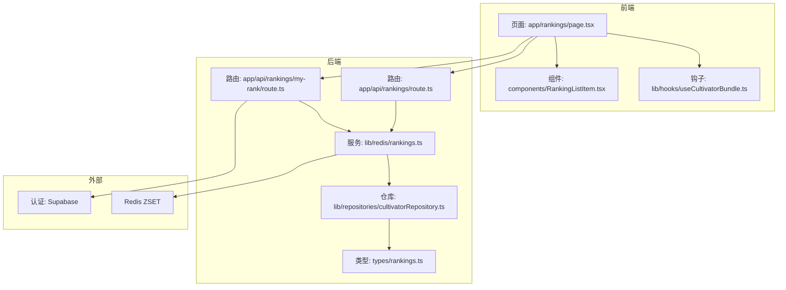
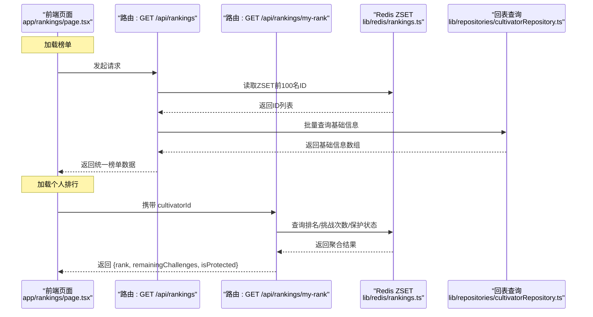
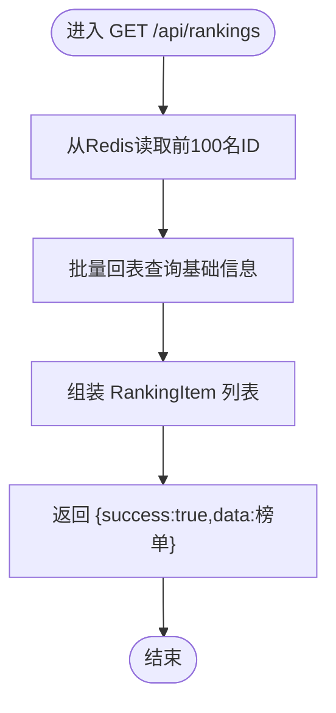
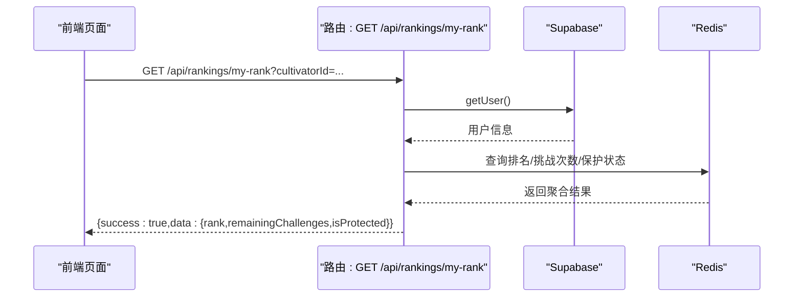
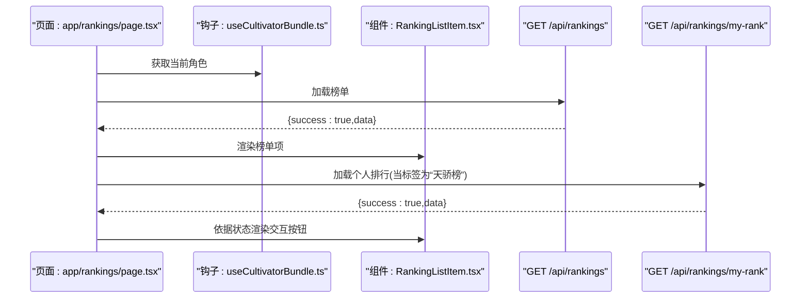
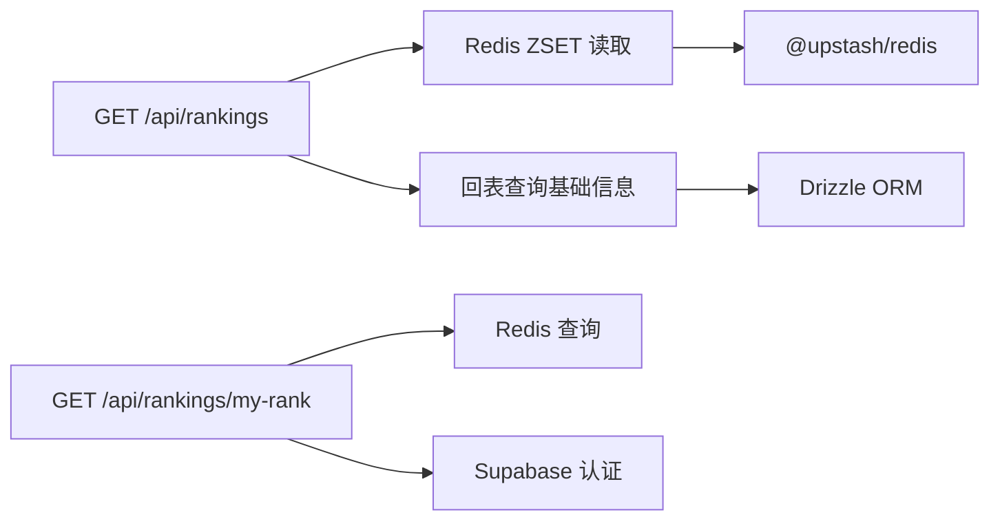

# 查询接口

<cite>
**本文引用的文件**
- [app/api/rankings/route.ts](file://app/api/rankings/route.ts)
- [app/api/rankings/my-rank/route.ts](file://app/api/rankings/my-rank/route.ts)
- [lib/redis/rankings.ts](file://lib/redis/rankings.ts)
- [lib/repositories/cultivatorRepository.ts](file://lib/repositories/cultivatorRepository.ts)
- [types/rankings.ts](file://types/rankings.ts)
- [app/rankings/page.tsx](file://app/rankings/page.tsx)
- [components/RankingListItem.tsx](file://components/RankingListItem.tsx)
- [lib/hooks/useCultivatorBundle.ts](file://lib/hooks/useCultivatorBundle.ts)
- [lib/redis/index.ts](file://lib/redis/index.ts)
</cite>

## 目录
1. [简介](#简介)
2. [项目结构](#项目结构)
3. [核心组件](#核心组件)
4. [架构总览](#架构总览)
5. [详细组件分析](#详细组件分析)
6. [依赖关系分析](#依赖关系分析)
7. [性能考量](#性能考量)
8. [故障排查指南](#故障排查指南)
9. [结论](#结论)
10. [附录](#附录)

## 简介
本文件面向“查询接口”场景，聚焦于两个排行榜相关REST API：
- GET /api/rankings：获取前100名角色的基础信息，采用“Redis缓存+回表查询”的高效模式。
- GET /api/rankings/my-rank：基于当前登录用户的角色ID，聚合返回其排名、当日剩余挑战次数与保护状态。

同时，文档说明前端页面如何调用这两个接口，并在组件层根据状态渲染交互按钮；并给出错误码说明、速率限制建议与前端防抖策略。

## 项目结构
围绕排行榜查询的关键文件分布如下：
- 后端路由：app/api/rankings/route.ts、app/api/rankings/my-rank/route.ts
- 排行榜服务：lib/redis/rankings.ts（Redis ZSET存储、保护期与挑战次数管理）
- 数据回表：lib/repositories/cultivatorRepository.ts（批量查询角色基础信息）
- 类型定义：types/rankings.ts（榜单项类型）
- 前端页面：app/rankings/page.tsx（调用API并驱动组件）
- 前端组件：components/RankingListItem.tsx（根据状态渲染交互）
- 前端钩子：lib/hooks/useCultivatorBundle.ts（获取当前角色）
- Redis客户端：lib/redis/index.ts

图表来源
- [app/api/rankings/route.ts](file://app/api/rankings/route.ts#L1-L31)
- [app/api/rankings/my-rank/route.ts](file://app/api/rankings/my-rank/route.ts#L1-L63)
- [lib/redis/rankings.ts](file://lib/redis/rankings.ts#L1-L120)
- [lib/repositories/cultivatorRepository.ts](file://lib/repositories/cultivatorRepository.ts#L492-L538)
- [types/rankings.ts](file://types/rankings.ts#L1-L22)
- [app/rankings/page.tsx](file://app/rankings/page.tsx#L50-L101)
- [components/RankingListItem.tsx](file://components/RankingListItem.tsx#L1-L119)
- [lib/hooks/useCultivatorBundle.ts](file://lib/hooks/useCultivatorBundle.ts#L1-L120)
- [lib/redis/index.ts](file://lib/redis/index.ts#L1-L6)

章节来源
- [app/api/rankings/route.ts](file://app/api/rankings/route.ts#L1-L31)
- [app/api/rankings/my-rank/route.ts](file://app/api/rankings/my-rank/route.ts#L1-L63)
- [lib/redis/rankings.ts](file://lib/redis/rankings.ts#L1-L120)
- [lib/repositories/cultivatorRepository.ts](file://lib/repositories/cultivatorRepository.ts#L492-L538)
- [types/rankings.ts](file://types/rankings.ts#L1-L22)
- [app/rankings/page.tsx](file://app/rankings/page.tsx#L50-L101)
- [components/RankingListItem.tsx](file://components/RankingListItem.tsx#L1-L119)
- [lib/hooks/useCultivatorBundle.ts](file://lib/hooks/useCultivatorBundle.ts#L1-L120)
- [lib/redis/index.ts](file://lib/redis/index.ts#L1-L6)

## 核心组件
- 排行榜路由 GET /api/rankings
  - 功能：从Redis ZSET读取前100名角色ID，再批量回表查询最新基础信息，返回统一的榜单数据结构。
  - 关键实现路径：[app/api/rankings/route.ts](file://app/api/rankings/route.ts#L1-L31)、[lib/redis/rankings.ts](file://lib/redis/rankings.ts#L73-L109)、[lib/repositories/cultivatorRepository.ts](file://lib/repositories/cultivatorRepository.ts#L492-L538)
- 个人排行路由 GET /api/rankings/my-rank
  - 功能：基于Supabase认证获取当前用户，校验参数后返回排名、剩余挑战次数与保护状态。
  - 关键实现路径：[app/api/rankings/my-rank/route.ts](file://app/api/rankings/my-rank/route.ts#L1-L63)、[lib/redis/rankings.ts](file://lib/redis/rankings.ts#L111-L121)、[lib/redis/rankings.ts](file://lib/redis/rankings.ts#L312-L340)

章节来源
- [app/api/rankings/route.ts](file://app/api/rankings/route.ts#L1-L31)
- [app/api/rankings/my-rank/route.ts](file://app/api/rankings/my-rank/route.ts#L1-L63)
- [lib/redis/rankings.ts](file://lib/redis/rankings.ts#L73-L109)
- [lib/repositories/cultivatorRepository.ts](file://lib/repositories/cultivatorRepository.ts#L492-L538)

## 架构总览
下面以序列图展示两个接口的调用流程与数据来源。

图表来源
- [app/api/rankings/route.ts](file://app/api/rankings/route.ts#L1-L31)
- [app/api/rankings/my-rank/route.ts](file://app/api/rankings/my-rank/route.ts#L1-L63)
- [lib/redis/rankings.ts](file://lib/redis/rankings.ts#L43-L109)
- [lib/repositories/cultivatorRepository.ts](file://lib/repositories/cultivatorRepository.ts#L492-L538)

## 详细组件分析

### 组件A：GET /api/rankings
- 请求方法与路径
  - 方法：GET
  - 路径：/api/rankings
- 请求参数
  - 无查询参数
- 成功响应
  - 结构：{ success: boolean, data: RankingItem[] }
  - RankingItem 字段要点：包含 rank、name、title、age、realm、realm_stage、origin、is_new_comer、updated_at 等基础字段
- 失败响应
  - 500：内部错误，返回 { error: string }
- 处理流程
  - 从Redis ZSET读取前100名角色ID
  - 批量回表查询最新基础信息
  - 组装 RankingItem 列表返回
- 性能特征
  - Redis ZSET读取O(log N) + 批量回表查询O(k)，k≤100，整体接近常数级延迟

图表来源
- [app/api/rankings/route.ts](file://app/api/rankings/route.ts#L1-L31)
- [lib/redis/rankings.ts](file://lib/redis/rankings.ts#L43-L109)
- [lib/repositories/cultivatorRepository.ts](file://lib/repositories/cultivatorRepository.ts#L492-L538)

章节来源
- [app/api/rankings/route.ts](file://app/api/rankings/route.ts#L1-L31)
- [lib/redis/rankings.ts](file://lib/redis/rankings.ts#L43-L109)
- [lib/repositories/cultivatorRepository.ts](file://lib/repositories/cultivatorRepository.ts#L492-L538)
- [types/rankings.ts](file://types/rankings.ts#L1-L22)

### 组件B：GET /api/rankings/my-rank
- 请求方法与路径
  - 方法：GET
  - 路径：/api/rankings/my-rank
- 请求参数
  - 查询参数：cultivatorId（必填）
- 成功响应
  - 结构：{ success: boolean, data: { rank: number|null, remainingChallenges: number, isProtected: boolean } }
- 失败响应
  - 401：未授权访问
  - 400：缺少角色ID
  - 500：内部错误，返回 { error: string }
- 处理流程
  - 使用 Supabase 认证校验用户身份
  - 读取排名、剩余挑战次数、保护状态并聚合返回

图表来源
- [app/api/rankings/my-rank/route.ts](file://app/api/rankings/my-rank/route.ts#L1-L63)
- [lib/redis/rankings.ts](file://lib/redis/rankings.ts#L111-L121)
- [lib/redis/rankings.ts](file://lib/redis/rankings.ts#L312-L340)

章节来源
- [app/api/rankings/my-rank/route.ts](file://app/api/rankings/my-rank/route.ts#L1-L63)
- [lib/redis/rankings.ts](file://lib/redis/rankings.ts#L111-L121)
- [lib/redis/rankings.ts](file://lib/redis/rankings.ts#L312-L340)

### 组件C：前端页面与组件协作
- 页面加载
  - 页面在挂载时调用 GET /api/rankings 获取榜单数据
  - 当标签为“天骄榜”时，调用 GET /api/rankings/my-rank 获取个人排行信息
- 前端钩子
  - useCultivatorBundle 提供当前角色信息，页面据此决定是否加载个人排行
- 组件渲染
  - RankingListItem 根据 isSelf、canChallenge 等状态渲染交互按钮
- 前端错误处理
  - 页面对响应体中的 success 字段进行校验，失败时弹出提示并清空数据

图表来源
- [app/rankings/page.tsx](file://app/rankings/page.tsx#L50-L101)
- [lib/hooks/useCultivatorBundle.ts](file://lib/hooks/useCultivatorBundle.ts#L1-L120)
- [components/RankingListItem.tsx](file://components/RankingListItem.tsx#L1-L119)

章节来源
- [app/rankings/page.tsx](file://app/rankings/page.tsx#L50-L101)
- [lib/hooks/useCultivatorBundle.ts](file://lib/hooks/useCultivatorBundle.ts#L1-L120)
- [components/RankingListItem.tsx](file://components/RankingListItem.tsx#L1-L119)

## 依赖关系分析
- 接口到服务层
  - GET /api/rankings 依赖 Redis 读取与回表查询
  - GET /api/rankings/my-rank 依赖 Redis 查询与 Supabase 认证
- 服务层到数据层
  - Redis 服务依赖 Redis ZSET 存储与 Upstash SDK
  - 回表查询依赖 Drizzle ORM 与数据库连接
- 前端到后端
  - 页面通过 fetch 调用两个接口，统一处理 success 字段与错误提示

图表来源
- [app/api/rankings/route.ts](file://app/api/rankings/route.ts#L1-L31)
- [app/api/rankings/my-rank/route.ts](file://app/api/rankings/my-rank/route.ts#L1-L63)
- [lib/redis/rankings.ts](file://lib/redis/rankings.ts#L1-L120)
- [lib/repositories/cultivatorRepository.ts](file://lib/repositories/cultivatorRepository.ts#L492-L538)
- [lib/redis/index.ts](file://lib/redis/index.ts#L1-L6)

章节来源
- [app/api/rankings/route.ts](file://app/api/rankings/route.ts#L1-L31)
- [app/api/rankings/my-rank/route.ts](file://app/api/rankings/my-rank/route.ts#L1-L63)
- [lib/redis/rankings.ts](file://lib/redis/rankings.ts#L1-L120)
- [lib/repositories/cultivatorRepository.ts](file://lib/repositories/cultivatorRepository.ts#L492-L538)
- [lib/redis/index.ts](file://lib/redis/index.ts#L1-L6)

## 性能考量
- 缓存命中与回表
  - Redis ZSET 存储前100名ID，读取复杂度低；批量回表查询最多100条，数据库压力可控
- 批量查询优化
  - 回表使用批量查询接口，减少多次往返
- TTL与数据时效
  - 挑战次数按日重置，保护期短，确保榜单新鲜度
- 建议
  - 前端可对频繁刷新做节流/防抖，避免短时间内大量请求
  - 后端可考虑对热门接口增加本地缓存层（如内存缓存）以进一步降低Redis压力

[本节为通用性能建议，不直接分析具体文件]

## 故障排查指南
- 常见错误码
  - 400：缺少 cultivatorId 参数
  - 401：未授权访问（Supabase 认证失败）
  - 500：内部错误（Redis或数据库异常）
- 前端错误处理
  - 页面对响应体中的 success 字段进行校验，失败时弹出提示并清空数据
  - 个人排行加载失败时，页面仍会继续渲染榜单，但不会显示挑战按钮
- 排查步骤
  - 检查 Supabase 认证状态与用户是否绑定角色
  - 检查 Redis ZSET 是否存在有效数据
  - 检查数据库连接与 Drizzle 查询是否正常
  - 查看后端日志定位具体异常

章节来源
- [app/api/rankings/my-rank/route.ts](file://app/api/rankings/my-rank/route.ts#L1-L63)
- [app/rankings/page.tsx](file://app/rankings/page.tsx#L50-L101)

## 结论
- GET /api/rankings 采用“Redis缓存+回表查询”模式，保证榜单读取的高性能与数据新鲜度
- GET /api/rankings/my-rank 提供个人排行聚合信息，结合前端状态渲染交互按钮
- 前端页面与组件协同完成数据加载与展示，具备完善的错误处理与用户体验反馈
- 建议在前端增加防抖/节流策略，并在后端评估引入本地缓存以提升吞吐

[本节为总结性内容，不直接分析具体文件]

## 附录

### 请求/响应示例

- GET /api/rankings
  - 请求：GET /api/rankings
  - 成功响应示例结构：
    - {
        "success": true,
        "data": [
          {
            "id": "角色ID",
            "rank": 1,
            "name": "角色名",
            "title": "称号",
            "age": 120,
            "realm": "真仙",
            "realm_stage": "大乘境",
            "origin": "散修",
            "is_new_comer": true,
            "updated_at": 1719907200000,
            "gender": "男",
            "personality": "沉稳",
            "background": "世家子弟",
            "updatedAt": "2024-07-01T00:00:00Z"
          }
        ]
      }
  - 失败响应示例结构：
    - { "error": "获取排行榜失败，请稍后重试" }

- GET /api/rankings/my-rank
  - 请求：GET /api/rankings/my-rank?cultivatorId=角色ID
  - 成功响应示例结构：
    - {
        "success": true,
        "data": {
          "rank": 5,
          "remainingChallenges": 8,
          "isProtected": false
        }
      }
  - 失败响应示例结构：
    - { "error": "未授权访问" }（401）
    - { "error": "请提供角色ID" }（400）
    - { "error": "获取排名信息失败，请稍后重试" }（500）

章节来源
- [app/api/rankings/route.ts](file://app/api/rankings/route.ts#L1-L31)
- [app/api/rankings/my-rank/route.ts](file://app/api/rankings/my-rank/route.ts#L1-L63)
- [lib/redis/rankings.ts](file://lib/redis/rankings.ts#L111-L121)
- [lib/redis/rankings.ts](file://lib/redis/rankings.ts#L312-L340)

### 速率限制建议
- 前端
  - 对“刷新榜单”与“加载个人排行”按钮增加防抖/节流，避免高频点击
  - 在 Tab 切换时合并请求，减少重复加载
- 后端
  - 可在路由层增加基于 IP 的限流策略（如每分钟不超过若干次）
  - 对热门接口可引入本地缓存，降低上游压力

[本节为通用建议，不直接分析具体文件]

### 前端防抖策略参考
- 页面在加载榜单与个人排行时，使用回调函数封装请求逻辑，并在外层包裹防抖/节流
- 当用户快速切换 Tab 或频繁点击“刷新”，应避免并发请求导致的资源浪费

章节来源
- [app/rankings/page.tsx](file://app/rankings/page.tsx#L50-L101)