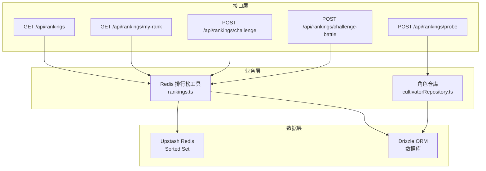
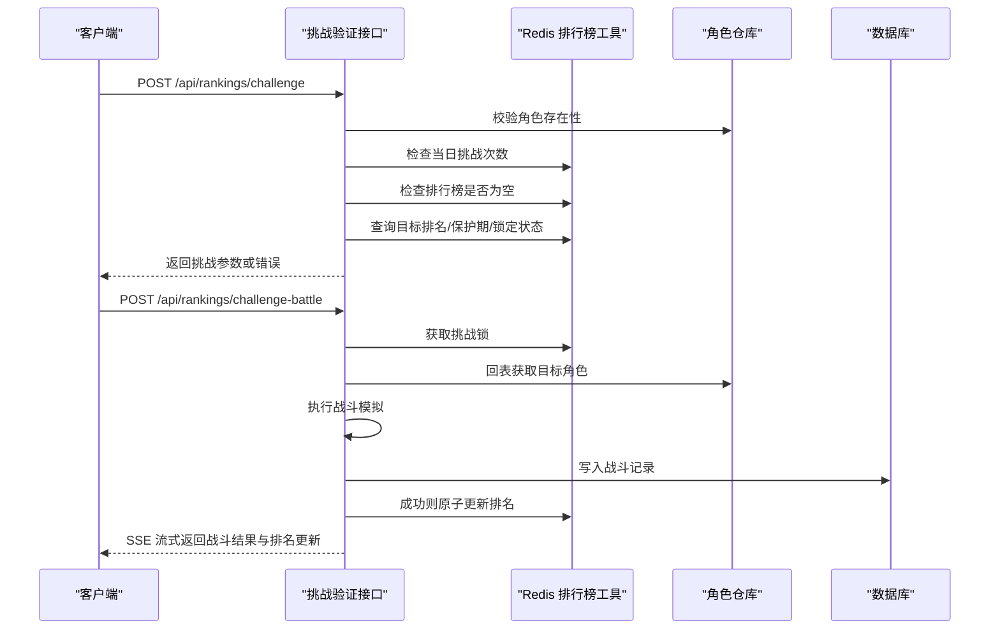
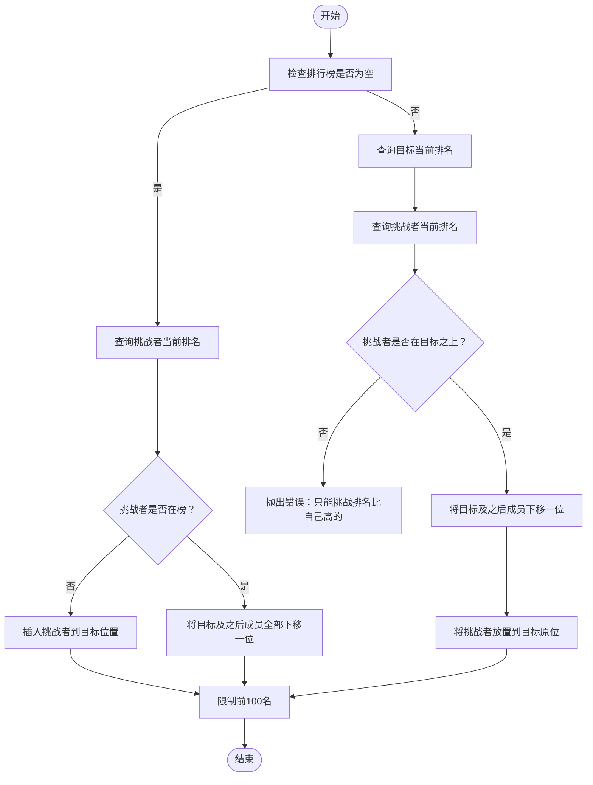
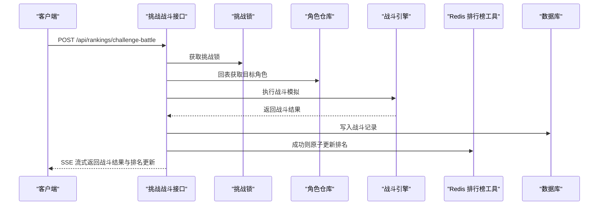
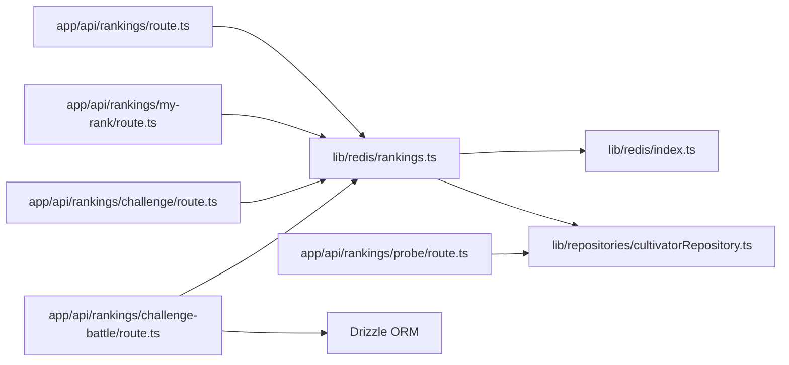
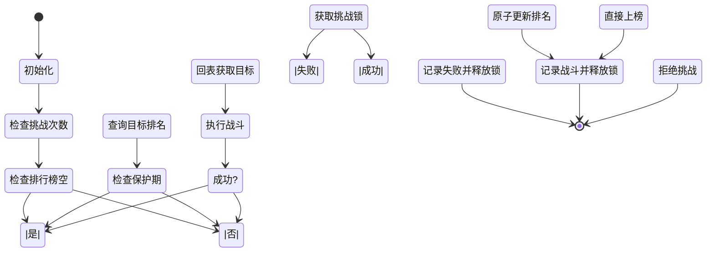

# 排行榜系统

<cite>
**本文引用的文件**
- [lib/redis/rankings.ts](file://lib/redis/rankings.ts)
- [lib/redis/index.ts](file://lib/redis/index.ts)
- [lib/repositories/cultivatorRepository.ts](file://lib/repositories/cultivatorRepository.ts)
- [app/api/rankings/route.ts](file://app/api/rankings/route.ts)
- [app/api/rankings/my-rank/route.ts](file://app/api/rankings/my-rank/route.ts)
- [app/api/rankings/probe/route.ts](file://app/api/rankings/probe/route.ts)
- [app/api/rankings/challenge/route.ts](file://app/api/rankings/challenge/route.ts)
- [app/api/rankings/challenge-battle/route.ts](file://app/api/rankings/challenge-battle/route.ts)
- [app/api/cron/rank-rewards/route.ts](file://app/api/cron/rank-rewards/route.ts)
- [types/rankings.ts](file://types/rankings.ts)
- [utils/rankingUtils.ts](file://utils/rankingUtils.ts)
</cite>

## 目录
1. [简介](#简介)
2. [项目结构](#项目结构)
3. [核心组件](#核心组件)
4. [架构总览](#架构总览)
5. [详细组件分析](#详细组件分析)
6. [依赖关系分析](#依赖关系分析)
7. [性能与刷新策略](#性能与刷新策略)
8. [故障排查指南](#故障排查指南)
9. [结论](#结论)
10. [附录](#附录)

## 简介
本文件面向“排行榜系统”的全面技术文档，围绕以下目标展开：
- 基于 Redis Sorted Set 实现高效排名计算与范围查询
- 结合 /api/rankings/* 系列路由，描述挑战请求处理、战斗生成与排名更新流程
- 解释 probe 接口在获取对手信息时的作用及反作弊设计
- 提供排行榜数据同步策略（数据库↔Redis）、刷新频率与性能基准
- 包含挑战流程的状态机图、典型 API 调用示例及常见问题如排名延迟的解决方案

## 项目结构
排行榜系统由三层组成：
- 数据层：Redis Sorted Set 存储排名；数据库 Drizzle ORM 存储角色完整数据
- 业务层：Redis 排行榜工具函数封装排序、保护期、挑战次数、分布式锁等逻辑
- 接口层：Next.js API 路由提供榜单展示、挑战验证、挑战战斗、个人排名查询、对手查探等能力

图表来源
- [lib/redis/rankings.ts](file://lib/redis/rankings.ts#L1-L408)
- [lib/repositories/cultivatorRepository.ts](file://lib/repositories/cultivatorRepository.ts#L322-L455)
- [app/api/rankings/route.ts](file://app/api/rankings/route.ts#L1-L31)
- [app/api/rankings/my-rank/route.ts](file://app/api/rankings/my-rank/route.ts#L1-L63)
- [app/api/rankings/challenge/route.ts](file://app/api/rankings/challenge/route.ts#L1-L148)
- [app/api/rankings/challenge-battle/route.ts](file://app/api/rankings/challenge-battle/route.ts#L1-L285)
- [app/api/rankings/probe/route.ts](file://app/api/rankings/probe/route.ts#L1-L89)

章节来源
- [lib/redis/rankings.ts](file://lib/redis/rankings.ts#L1-L408)
- [lib/repositories/cultivatorRepository.ts](file://lib/repositories/cultivatorRepository.ts#L322-L455)
- [app/api/rankings/route.ts](file://app/api/rankings/route.ts#L1-L31)
- [app/api/rankings/my-rank/route.ts](file://app/api/rankings/my-rank/route.ts#L1-L63)
- [app/api/rankings/challenge/route.ts](file://app/api/rankings/challenge/route.ts#L1-L148)
- [app/api/rankings/challenge-battle/route.ts](file://app/api/rankings/challenge-battle/route.ts#L1-L285)
- [app/api/rankings/probe/route.ts](file://app/api/rankings/probe/route.ts#L1-L89)

## 核心组件
- Redis 排行榜工具（rankings.ts）
  - 排行榜键与命名空间：Sorted Set 键、保护期键、每日挑战计数键、挑战锁键
  - 排行榜维护：新增、调整插入后排名、更新排名、移除、清空
  - 查询能力：获取前 N 名、按 ID 查询排名、保护期判断、挑战次数统计
  - 分布式锁：挑战过程中的互斥控制
- 角色仓库（cultivatorRepository.ts）
  - 提供系统级回表查询（不校验当前用户）与基础字段批量查询，支撑榜单回表渲染
- API 路由
  - 展示：GET /api/rankings
  - 个人：GET /api/rankings/my-rank
  - 挑战验证：POST /api/rankings/challenge
  - 挑战战斗：POST /api/rankings/challenge-battle（SSE 流式输出）
  - 对手查探：POST /api/rankings/probe（可选的反作弊判定）

章节来源
- [lib/redis/rankings.ts](file://lib/redis/rankings.ts#L1-L408)
- [lib/repositories/cultivatorRepository.ts](file://lib/repositories/cultivatorRepository.ts#L322-L455)
- [app/api/rankings/route.ts](file://app/api/rankings/route.ts#L1-L31)
- [app/api/rankings/my-rank/route.ts](file://app/api/rankings/my-rank/route.ts#L1-L63)
- [app/api/rankings/challenge/route.ts](file://app/api/rankings/challenge/route.ts#L1-L148)
- [app/api/rankings/challenge-battle/route.ts](file://app/api/rankings/challenge-battle/route.ts#L1-L285)
- [app/api/rankings/probe/route.ts](file://app/api/rankings/probe/route.ts#L1-L89)

## 架构总览
排行榜系统采用“缓存优先、数据库回表”的模式：
- Redis Sorted Set 作为主数据源，存储角色 ID 与排名分数（score），支持 O(log N) 的插入/更新与 O(k) 的范围查询
- 展示时从 Redis 读取顺序，再回表数据库获取最新角色基础信息，保证 UI 与数据一致
- 挑战流程在 Redis 中完成排名原子性更新，战斗结果写入数据库并记录战斗报告

图表来源
- [app/api/rankings/challenge/route.ts](file://app/api/rankings/challenge/route.ts#L1-L148)
- [app/api/rankings/challenge-battle/route.ts](file://app/api/rankings/challenge-battle/route.ts#L1-L285)
- [lib/redis/rankings.ts](file://lib/redis/rankings.ts#L1-L408)
- [lib/repositories/cultivatorRepository.ts](file://lib/repositories/cultivatorRepository.ts#L322-L455)

## 详细组件分析

### Redis 排行榜工具（rankings.ts）
- 数据结构与键空间
  - 排行榜键：Sorted Set，成员为角色 ID，score 为排名（1-based）
  - 保护期键：按角色 ID 前缀存储加入时间戳，用于标记“新天骄保护期”
  - 每日挑战计数键：按日期维度记录挑战次数，TTL 到午夜
  - 挑战锁键：按目标角色 ID 前缀存储当前时间戳，NX EX 实现分布式锁
- 排行榜维护
  - 新增：支持指定目标排名插入，内部通过 pipeline 原子化调整后续成员排名
  - 更新：挑战成功后，若满足互换条件，原子化移动目标与挑战者位置，并下移其他成员
  - 移除/清空：提供移除某角色与清空排行榜的能力
- 查询与状态
  - 获取前 N 名：从 Sorted Set 读取顺序，再回表基础信息
  - 按 ID 查询排名：zrank 返回 0 基索引，需 +1
  - 保护期：基于保护期键的时间差判断
  - 挑战次数：按日期键累加，TTL 到午夜
  - 锁：NX EX 分布式锁，避免并发挑战冲突

图表来源
- [lib/redis/rankings.ts](file://lib/redis/rankings.ts#L122-L270)

章节来源
- [lib/redis/rankings.ts](file://lib/redis/rankings.ts#L1-L408)

### API 路由与交互

#### 展示接口：GET /api/rankings
- 功能：返回前 100 名的完整角色信息（回表最新基础数据）
- 数据来源：Redis 排行榜顺序 + 数据库基础字段批量查询
- 输出：success + data（包含 rank、is_new_comer、updated_at 等）

章节来源
- [app/api/rankings/route.ts](file://app/api/rankings/route.ts#L1-L31)
- [lib/redis/rankings.ts](file://lib/redis/rankings.ts#L73-L109)
- [lib/repositories/cultivatorRepository.ts](file://lib/repositories/cultivatorRepository.ts#L495-L538)

#### 个人排名：GET /api/rankings/my-rank
- 功能：返回当前角色的排名、今日剩余挑战次数、是否处于保护期
- 数据来源：Redis 排行榜工具

章节来源
- [app/api/rankings/my-rank/route.ts](file://app/api/rankings/my-rank/route.ts#L1-L63)
- [lib/redis/rankings.ts](file://lib/redis/rankings.ts#L111-L121)
- [lib/redis/rankings.ts](file://lib/redis/rankings.ts#L272-L325)

#### 挑战验证：POST /api/rankings/challenge
- 功能：校验挑战条件（挑战次数、目标是否在榜、保护期、锁定状态），通过后返回战斗参数
- 特性：支持“空榜直接上榜”场景（不消耗挑战次数）

章节来源
- [app/api/rankings/challenge/route.ts](file://app/api/rankings/challenge/route.ts#L1-L148)
- [lib/redis/rankings.ts](file://lib/redis/rankings.ts#L272-L325)
- [lib/redis/rankings.ts](file://lib/redis/rankings.ts#L342-L380)

#### 挑战战斗：POST /api/rankings/challenge-battle（SSE）
- 功能：执行挑战战斗，流式输出战斗结果与播报片段，战斗结束后原子更新排名并记录战斗记录
- 流程要点：
  - 获取挑战锁，避免并发冲突
  - 回表获取目标角色完整数据
  - 生成战斗播报（AI 流式输出）
  - 成功则调用 updateRanking 原子更新
  - 写入数据库战斗记录

图表来源
- [app/api/rankings/challenge-battle/route.ts](file://app/api/rankings/challenge-battle/route.ts#L1-L285)
- [lib/redis/rankings.ts](file://lib/redis/rankings.ts#L187-L270)
- [lib/repositories/cultivatorRepository.ts](file://lib/repositories/cultivatorRepository.ts#L427-L455)

章节来源
- [app/api/rankings/challenge-battle/route.ts](file://app/api/rankings/challenge-battle/route.ts#L1-L285)
- [lib/redis/rankings.ts](file://lib/redis/rankings.ts#L187-L270)
- [lib/repositories/cultivatorRepository.ts](file://lib/repositories/cultivatorRepository.ts#L427-L455)

#### 对手查探：POST /api/rankings/probe
- 功能：基于最终属性进行“神识查探”，返回目标角色的最终属性与分解信息
- 反作弊设计：当前注释掉“神识不足”判定，预留扩展点

章节来源
- [app/api/rankings/probe/route.ts](file://app/api/rankings/probe/route.ts#L1-L89)
- [lib/repositories/cultivatorRepository.ts](file://lib/repositories/cultivatorRepository.ts#L427-L455)
- [utils/rankingUtils.ts](file://utils/rankingUtils.ts#L1-L81)

### 数据模型与类型
- 排行榜项（RankingItem）：继承角色基础字段，新增 rank、is_new_comer、updated_at
- 排行榜显示项（RankingsDisplayItem）：支持战斗榜与物品榜的统一展示

章节来源
- [types/rankings.ts](file://types/rankings.ts#L1-L22)
- [lib/redis/rankings.ts](file://lib/redis/rankings.ts#L19-L31)

## 依赖关系分析

图表来源
- [lib/redis/rankings.ts](file://lib/redis/rankings.ts#L1-L408)
- [lib/redis/index.ts](file://lib/redis/index.ts#L1-L6)
- [lib/repositories/cultivatorRepository.ts](file://lib/repositories/cultivatorRepository.ts#L322-L455)
- [app/api/rankings/route.ts](file://app/api/rankings/route.ts#L1-L31)
- [app/api/rankings/my-rank/route.ts](file://app/api/rankings/my-rank/route.ts#L1-L63)
- [app/api/rankings/challenge/route.ts](file://app/api/rankings/challenge/route.ts#L1-L148)
- [app/api/rankings/challenge-battle/route.ts](file://app/api/rankings/challenge-battle/route.ts#L1-L285)
- [app/api/rankings/probe/route.ts](file://app/api/rankings/probe/route.ts#L1-L89)

章节来源
- [lib/redis/rankings.ts](file://lib/redis/rankings.ts#L1-L408)
- [lib/repositories/cultivatorRepository.ts](file://lib/repositories/cultivatorRepository.ts#L322-L455)
- [app/api/rankings/route.ts](file://app/api/rankings/route.ts#L1-L31)
- [app/api/rankings/my-rank/route.ts](file://app/api/rankings/my-rank/route.ts#L1-L63)
- [app/api/rankings/challenge/route.ts](file://app/api/rankings/challenge/route.ts#L1-L148)
- [app/api/rankings/challenge-battle/route.ts](file://app/api/rankings/challenge-battle/route.ts#L1-L285)
- [app/api/rankings/probe/route.ts](file://app/api/rankings/probe/route.ts#L1-L89)

## 性能与刷新策略

- Redis Sorted Set 的复杂度
  - 插入/更新：O(log N)
  - 查询前 N 名：O(k)，k 为返回数量
  - zrank/zadd/zremrangebyrank 等操作均受集合规模影响
- 排行榜大小限制
  - 前 100 名上限，避免 Sorted Set 过大导致查询与更新变慢
- 挑战次数与 TTL
  - 每日挑战计数键 TTL 设为“距离午夜剩余秒数”，自然清零，避免长期占用内存
- 数据一致性与刷新
  - 展示接口从 Redis 读取顺序，再回表数据库获取最新基础字段，确保 UI 与数据一致
  - 挑战成功后即时更新 Redis 排行榜，避免前端轮询带来的延迟
- 推荐刷新频率
  - 前端可按需刷新（如进入榜单页、挑战后），无需高频轮询
  - 后台任务可按需发放奖励或做周期性维护，不影响实时性

章节来源
- [lib/redis/rankings.ts](file://lib/redis/rankings.ts#L122-L157)
- [lib/redis/rankings.ts](file://lib/redis/rankings.ts#L272-L325)
- [app/api/rankings/route.ts](file://app/api/rankings/route.ts#L1-L31)

## 故障排查指南
- 常见错误与定位
  - 未授权访问：鉴权失败返回 401
  - 参数缺失/格式错误：返回 400
  - 目标不在榜：挑战验证阶段返回 404
  - 保护期/锁定状态：挑战验证阶段返回 400/409
  - 挑战次数耗尽：返回 400
  - 挑战战斗异常：SSE 流中返回 error 类型事件
- 排名延迟
  - 若出现短暂延迟，确认挑战是否成功触发 updateRanking 原子更新
  - 检查 Redis 键空间是否存在异常（如保护期键未到期、挑战锁未释放）
- 排行榜为空
  - 首次挑战且排行榜为空时，挑战者可直接上榜（不消耗挑战次数）
- 反作弊建议
  - 当前对“神识不足”判定为注释状态，可在返回前开启判定以防止信息泄露

章节来源
- [app/api/rankings/challenge/route.ts](file://app/api/rankings/challenge/route.ts#L1-L148)
- [app/api/rankings/challenge-battle/route.ts](file://app/api/rankings/challenge-battle/route.ts#L1-L285)
- [app/api/rankings/probe/route.ts](file://app/api/rankings/probe/route.ts#L1-L89)
- [lib/redis/rankings.ts](file://lib/redis/rankings.ts#L342-L380)

## 结论
本系统以 Redis Sorted Set 为核心，结合数据库回表与分布式锁，实现了高性能、可扩展的排行榜与挑战体系。通过 SSE 流式输出与原子化更新，既保证了用户体验，也确保了数据一致性与公平性。建议在生产环境中配合合理的缓存与后台任务策略，持续优化性能与稳定性。

## 附录

### 挑战流程状态机

图表来源
- [app/api/rankings/challenge/route.ts](file://app/api/rankings/challenge/route.ts#L1-L148)
- [app/api/rankings/challenge-battle/route.ts](file://app/api/rankings/challenge-battle/route.ts#L1-L285)
- [lib/redis/rankings.ts](file://lib/redis/rankings.ts#L187-L270)

### 典型 API 调用示例（路径）
- 获取榜单：GET /api/rankings
- 查询个人排名：GET /api/rankings/my-rank?cultivatorId={id}
- 挑战验证：POST /api/rankings/challenge
  - 请求体：{ cultivatorId, targetId }
- 挑战战斗（SSE）：POST /api/rankings/challenge-battle
  - 请求体：{ cultivatorId, targetId }
- 对手查探：POST /api/rankings/probe
  - 请求体：{ cultivatorId, targetId }

章节来源
- [app/api/rankings/route.ts](file://app/api/rankings/route.ts#L1-L31)
- [app/api/rankings/my-rank/route.ts](file://app/api/rankings/my-rank/route.ts#L1-L63)
- [app/api/rankings/challenge/route.ts](file://app/api/rankings/challenge/route.ts#L1-L148)
- [app/api/rankings/challenge-battle/route.ts](file://app/api/rankings/challenge-battle/route.ts#L1-L285)
- [app/api/rankings/probe/route.ts](file://app/api/rankings/probe/route.ts#L1-L89)