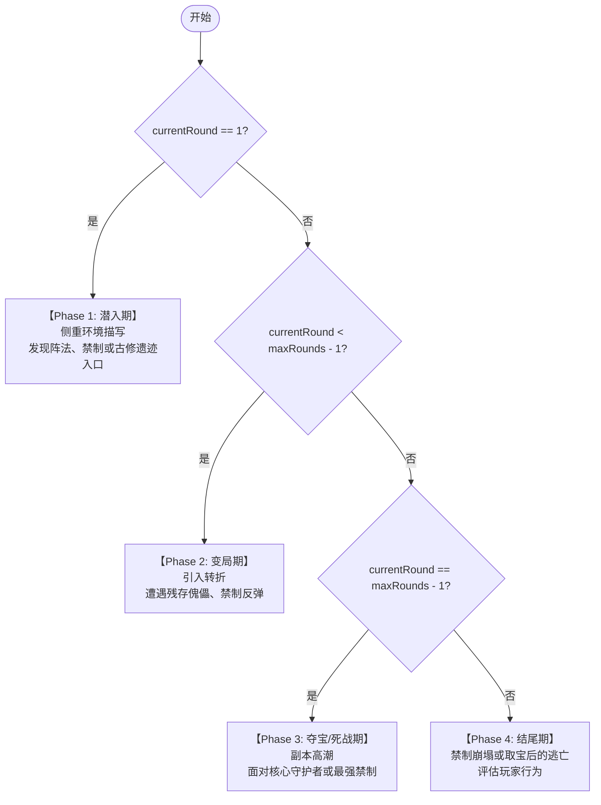
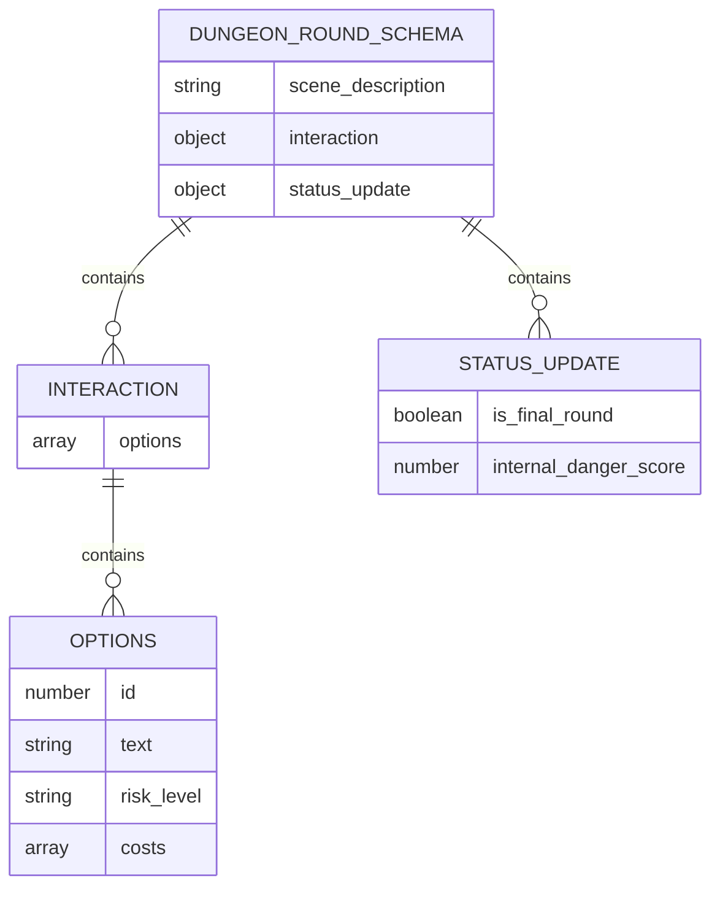

# AI叙事引擎

<cite>
**本文档引用文件**   
- [service_v2.ts](file://lib/dungeon/service_v2.ts)
- [types.ts](file://lib/dungeon/types.ts)
- [aiClient.ts](file://utils/aiClient.ts)
- [prompts.ts](file://utils/prompts.ts)
- [storyService.ts](file://utils/storyService.ts)
</cite>

## 目录
1. [引言](#引言)
2. [核心相位逻辑](#核心相位逻辑)
3. [AI输出约束](#ai输出约束)
4. [资源消耗与历史压缩](#资源消耗与历史压缩)
5. [结算机制与等价交换原则](#结算机制与等价交换原则)
6. [总结](#总结)

## 引言
本系统为一个基于人工智能的修仙副本叙事生成引擎，其核心目标是通过动态构建System Prompt，驱动符合“凡人流”风格的沉浸式副本体验。该系统严格遵循“等价交换”原则，确保玩家的每一次高风险选择都能获得相应的高回报。整个流程由`DungeonService`类统一管理，通过`getSystemPrompt`方法根据当前轮次（`currentRound`）动态切换四大叙事相位，并利用`DungeonRoundSchema`对AI输出进行结构化约束，保证叙事的连贯性与游戏机制的稳定性。

**Section sources**
- [service_v2.ts](file://lib/dungeon/service_v2.ts#L34-L545)

## 核心相位逻辑
副本的叙事逻辑被划分为四个明确的阶段，由`getPhase`函数根据`currentRound`和`maxRounds`进行判定。这种设计确保了副本故事拥有清晰的起承转合，符合经典修仙小说的叙事节奏。



**Diagram sources **
- [service_v2.ts](file://lib/dungeon/service_v2.ts#L36-L44)

### 相位判定函数
`getPhase`函数是整个叙事引擎的“时间轴控制器”。它接收当前轮次和总轮次作为输入，返回一个描述当前阶段的字符串。这四个阶段分别是：
- **潜入期 (Round 1)**：作为故事的开端，此阶段主要进行环境铺垫，引导玩家探索未知区域。
- **变局期 (Round 2-3)**：故事开始出现转折，玩家需要开始消耗资源来应对突发状况。
- **夺宝/死战期 (Round 4)**：故事达到高潮，玩家面临最高风险的挑战，选项通常包含巨大消耗。
- **结尾期 (Round 5)**：故事收尾，根据玩家之前的行为，决定其是圆满脱身还是狼狈逃窜。

**Section sources**
- [service_v2.ts](file://lib/dungeon/service_v2.ts#L36-L44)

### System Prompt 动态构建
`getSystemPrompt`方法是AI的“导演手册”。它首先调用`getPhase`获取当前相位描述，然后将其嵌入到一个结构化的System Prompt中。这个Prompt不仅定义了当前的叙事阶段，还包含了凡人流的文风要求、性格契合规则、强制选项模板以及输出约束。通过这种方式，AI在每一轮都能获得精确的指令，从而生成符合当前剧情发展的内容。

**Section sources**
- [service_v2.ts](file://lib/dungeon/service_v2.ts#L47-L96)

## AI输出约束
为了确保AI生成的内容既符合叙事要求，又能被系统正确解析和执行，系统定义了严格的JSON Schema约束。

### DungeonRoundSchema 结构
AI在每一轮必须返回一个符合`DungeonRoundSchema`的对象，该Schema定义了三个核心部分：
- **scene_description**：场景描述，用于向玩家展示当前的环境和情节。
- **interaction.options**：交互选项，包含三个强制选项（A、B、C）。
- **status_update**：状态更新，包含`internal_danger_score`，用于量化当前的危险程度。



**Diagram sources **
- [types.ts](file://lib/dungeon/types.ts#L87-L100)

### 三类强制选项设计
系统强制要求AI生成三种不同风格的选项，以满足不同玩家的决策偏好：
- **选项 A (求稳)**：低风险、低收益，体现“韩立式谨慎”，消耗气血、灵力、灵石等基础资源。
- **选项 B (弄险)**：高风险、高收益，体现“富贵险中求”，消耗法宝、寿元或修为等珍贵资源。
- **选项 C (奇招)**：基于玩家的功法、神通、命格或道具触发特殊效果，实现个性化叙事。

**Section sources**
- [service_v2.ts](file://lib/dungeon/service_v2.ts#L68-L71)

### COST_TYPES 消耗类型规范
所有资源消耗都必须使用预定义的`COST_TYPES`，禁止自定义类型。这保证了后端可以统一处理所有消耗和增益。主要消耗类型包括：
- `spirit_stones_loss`：灵石损耗
- `hp_loss`：气血损耗
- `mp_loss`：灵力损耗
- `artifact_damage`：法宝损坏
- `lifespan_loss`：寿元损耗
- `battle`：遭遇战斗

**Section sources**
- [types.ts](file://lib/dungeon/types.ts#L18-L28)

## 资源消耗与历史压缩
系统通过精巧的设计来优化性能并累积玩家的决策影响。

### 历史记录压缩策略
在调用AI之前，`callAI`方法会将完整的`history`数组压缩为`compressedHistory`。压缩方式是将每条历史记录的`scene`字段截取前100个字符并添加省略号。这一策略极大地减少了发送给AI的Token数量，降低了成本并提高了响应速度，同时保留了关键的情节节点，确保AI能理解故事脉络。

**Section sources**
- [service_v2.ts](file://lib/dungeon/service_v2.ts#L393-L396)

### 累积牺牲摘要
`summary_of_sacrifice`是一个数组，用于累积记录玩家在副本中做出的所有资源消耗。每当玩家选择一个带有`costs`的选项，这些消耗就会被`push`到`summary_of_sacrifice`中。这个数组是后续结算时评估玩家付出的核心依据。

**Section sources**
- [service_v2.ts](file://lib/dungeon/service_v2.ts#L152)

## 结算机制与等价交换原则
副本的最终奖励由`settleDungeon`方法决定，其核心是“等价交换”原则。

### 结算Prompt与评价等级
当副本结束时，系统会向AI发送一个专门的结算Prompt。该Prompt会将`summary_of_sacrifice`作为输入，要求AI根据玩家的付出和危险分来给出最终评价。评价等级严格定义为：
- **S级 (九死一生)**：经历多次死斗或损失高价值法宝。
- **A级 (险象环生)**：有明显资源损耗并顺利通关。
- **B级 (劳苦功高)**：有少量损耗。
- **C级 (稳扎稳打)**：以稳健为主。
- **D级 (空手而归)**：未遭遇任何危险。

**Section sources**
- [service_v2.ts](file://lib/dungeon/service_v2.ts#L330-L346)

### 等价交换原则的实现
结算Prompt的核心准则确保了“高风险带来高回报”的叙事一致性。例如，准则明确指出：“若玩家在历练中损失了法宝、消耗了大量寿元或多次陷入死斗，结算等级严禁低于B”。这从根本上杜绝了“付出巨大却毫无所获”的挫败感，保证了凡人流叙事的公平性和合理性。

```mermaid
flowchart LR
A[玩家选择高风险选项] --> B[资源消耗记录到<br/>summary_of_sacrifice]
B --> C[结算时AI评估牺牲]
C --> D{牺牲巨大?}
D --> |是| E[奖励等级提升<br/>(S/A/B)]
D --> |否| F[奖励等级较低<br/>(C/D)]
E --> G[发放高价值奖励]
F --> H[发放基础奖励]
```

**Diagram sources **
- [service_v2.ts](file://lib/dungeon/service_v2.ts#L336-L339)

## 总结
本AI叙事引擎通过`getPhase`和`getSystemPrompt`实现了动态的、分阶段的叙事控制，利用`DungeonRoundSchema`和`COST_TYPES`确保了AI输出的结构化和规范化。`compressedHistory`策略优化了性能，而`summary_of_sacrifice`则有效累积了玩家的决策影响。最终，`settleDungeon`中的结算Prompt通过“等价交换”原则，将玩家的牺牲与最终的奖励等级紧密绑定，创造了一个风险与回报高度对等、充满凡人流特色的沉浸式修仙体验。