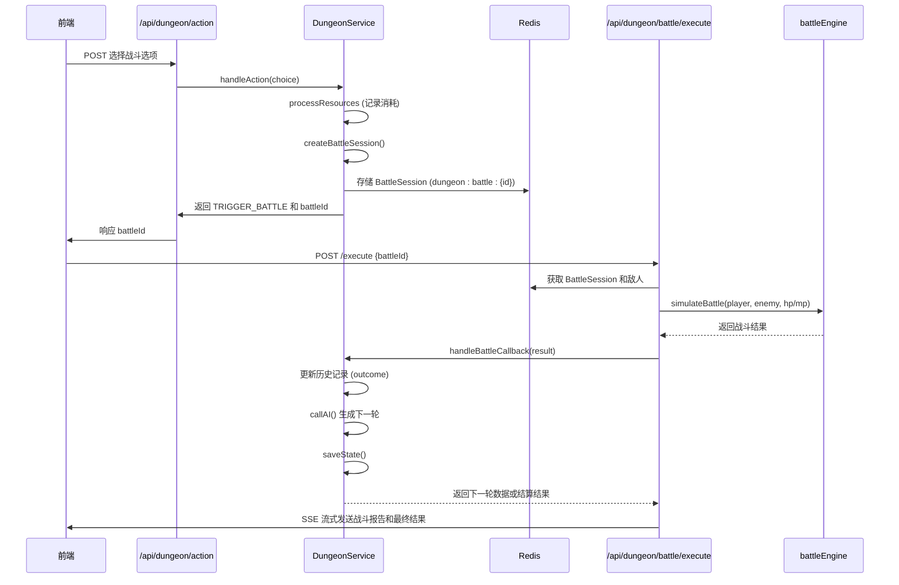

# 副本机制

<cite>
**本文档引用文件**   
- [service_v2.ts](file://lib/dungeon/service_v2.ts#L1-L545)
- [types.ts](file://lib/dungeon/types.ts#L1-L201)
- [start/route.ts](file://app/api/dungeon/start/route.ts#L1-L46)
- [action/route.ts](file://app/api/dungeon/action/route.ts#L1-L52)
- [battle/execute/route.ts](file://app/api/dungeon/battle/execute/route.ts#L1-L181)
- [page.tsx](file://app/game/dungeon/page.tsx#L1-L629)
- [mapSystem.ts](file://lib/game/mapSystem.ts#L1-L58)
- [battleEngine.ts](file://engine/battleEngine.ts#L1-L830)
- [prompts.ts](file://utils/prompts.ts#L1-L356)
</cite>

## 目录
1. [引言](#引言)
2. [核心状态机设计](#核心状态机设计)
3. [五轮制副本相位与AI叙事逻辑](#五轮制副本相位与ai叙事逻辑)
4. [危险分与资源消耗机制](#危险分与资源消耗机制)
5. [战斗拦截与集成机制](#战斗拦截与集成机制)
6. [状态流转与交互序列](#状态流转与交互序列)
7. [异常情况恢复策略](#异常情况恢复策略)
8. [结论](#结论)

## 引言

《万界道友》中的副本系统是一个由AI驱动的、高自由度的文字修仙体验核心。该系统以`DungeonService`类为核心，通过精心设计的状态机与AI交互机制，为玩家提供符合“凡人流”风格的动态叙事与抉择体验。本文档将深入解析其从初始化到结算的完整生命周期，重点阐述其状态流转、AI引导、战斗集成与资源管理等关键设计。

**Section sources**
- [service_v2.ts](file://lib/dungeon/service_v2.ts#L1-L545)
- [README.md](file://README.md#L1-L282)

## 核心状态机设计

副本系统的核心是一个基于Redis的持久化状态机，其生命周期由`DungeonService`类管理。整个流程始于`startDungeon`，经由`handleAction`处理玩家选择，最终通过`handleBattleCallback`或`settleDungeon`完成。

### 状态定义与初始化

`DungeonState`接口定义了副本的完整状态，包括玩家信息、当前轮次、历史记录、危险分、资源消耗摘要等。当玩家调用`startDungeon`时，系统会执行以下步骤：
1.  **会话检查**：通过`getDungeonKey`生成基于`cultivatorId`的Redis键，检查是否存在进行中的副本。
2.  **上下文准备**：调用`prepareDungeonContext`获取玩家数据和地图节点信息。
3.  **状态初始化**：创建初始`DungeonState`对象，设置`currentRound`为1，`maxRounds`为5，并初始化`dangerScore`为10。
4.  **AI首次调用**：通过`callAI`方法，将初始状态发送给AI，生成第一轮的场景描述和选项。
5.  **状态持久化**：将包含AI生成结果的完整状态通过`saveState`方法存入Redis，设置1小时的过期时间。

此设计确保了副本状态的可恢复性，即使玩家断开连接，也能通过`getState`方法从Redis中恢复进度。

### 状态流转与处理

`handleAction`是状态流转的核心。当玩家做出选择后，该方法会：
1.  **获取当前状态**：从Redis中读取`DungeonState`。
2.  **处理消耗**：校验并应用所选选项的`costs`，同时将这些消耗记录到`summary_of_sacrifice`中。
3.  **战斗拦截**：如果选项包含`battle`类型的消耗，则触发战斗流程，将状态`status`置为`IN_BATTLE`，并创建战斗会话。
4.  **推进轮次**：若未触发战斗且未达到最大轮次，则递增`currentRound`，再次调用`callAI`生成下一轮内容，并更新状态。

当所有轮次完成或战斗结束后，系统会调用`settleDungeon`进行结算。

**Section sources**
- [service_v2.ts](file://lib/dungeon/service_v2.ts#L34-L134)
- [types.ts](file://lib/dungeon/types.ts#L181-L200)

## 五轮制副本相位与AI叙事逻辑

副本系统采用五轮制设计，每一轮对应一个独特的叙事相位，由`getPhase`方法定义。`callAI`方法通过`getSystemPrompt`生成一个强大的System Prompt，引导AI严格按照这些相位逻辑生成内容。

### System Prompt的引导作用

`getSystemPrompt`是整个AI叙事的“天道法则”。它向AI明确传达了以下核心指令：

1.  **核心叙事相位逻辑**：Prompt强制AI根据`currentRound`切换叙事重点：
    *   **【Phase 1: 潜入期】(Round 1)**：侧重环境描写，如发现阵法、禁制或古修遗迹入口，选项偏向探测与尝试。
    *   **【Phase 2: 变局期】(Round 2-3)**：引入转折，如遭遇残存傀儡、禁制反弹或发现同道斗法留下的血迹，开始消耗资源。
    *   **【Phase 3: 夺宝/死战期】(Round 4)**：副本高潮，面对核心守护者或最强禁制，选项必须包含极高风险或巨量消耗。
    *   **【Phase 4: 结尾期】(Round 5)**：禁制崩塌或取宝后的逃亡，评估玩家之前的行为，决定最终的狼狈程度或圆满程度。

2.  **凡人流叙事准则**：要求AI采用简练、冰冷、充满古意的文风，并根据玩家性格（谨慎/狂傲）调整选项描述，同时遵循“因果律”，将玩家的历史行为（如法宝损坏）体现在后续叙事中。

3.  **强制选项模板**：规定AI必须生成三个选项，分别对应：
    *   **选项 A (求稳)**：低风险、低收益，体现“韩立式谨慎”。
    *   **选项 B (弄险)**：高风险、高收益，体现“富贵险中求”。
    *   **选项 C (奇招)**：触发玩家的特定属性、道具、功法或命格。

4.  **输出约束**：要求AI以JSON格式输出，并严格使用预定义的`COST_TYPES`（如灵石损耗、气血损耗、遭遇战斗等）来描述消耗。

此设计确保了AI生成的内容不仅具有丰富的叙事性，而且在结构和逻辑上完全符合游戏规则，为后端处理提供了可靠的数据基础。

**Section sources**
- [service_v2.ts](file://lib/dungeon/service_v2.ts#L36-L96)
- [types.ts](file://lib/dungeon/types.ts#L6-L28)

## 危险分与资源消耗机制

### 危险分 (dangerScore) 动态计算

`dangerScore`是一个0-100的数值，用于量化副本的危险程度。它的变化完全由AI在每轮生成的`internal_danger_score`决定。`getSystemPrompt`中明确规定：
*   选择危险路径时，分值应上升。
*   选择稳健路径时，分值应微降或不变。

其数值含义如下：
*   **0-30**：相对安全，收获一般。
*   **31-70**：很有挑战，收获尚可。
*   **71-100**：必死之局或绝境，但往往有丰厚的收获。

这个分数是最终结算等级的重要依据之一。

### 资源消耗与`summary_of_sacrifice`

`summary_of_sacrifice`是记录玩家在整个副本中所有资源消耗的数组。每当玩家选择一个带有`costs`的选项时，这些消耗（如灵石、气血、法宝损坏、遭遇战斗等）都会被推入此数组。

在最终结算时，`settleDungeon`方法会将`summary_of_sacrifice`作为核心输入传递给AI。结算的System Prompt中明确指出“等价交换”的核心准则：
*   **惨烈补偿**：若玩家损失了法宝、消耗了大量寿元或多次陷入死斗，结算等级严禁低于B。
*   **风险对冲**：危险分越高，最终获得的奖励品阶必须越高。
*   **凡人逻辑**：付出巨大却毫无所获的结局是被禁止的。

AI会根据这些消耗和危险分，生成一个“让玩家感到物有所值”的结局叙事和奖励等级（S/A/B/C/D）。后端再根据此等级从真实的奖励池中发放奖励，确保游戏经济的平衡。

**Section sources**
- [service_v2.ts](file://lib/dungeon/service_v2.ts#L117-L121)
- [service_v2.ts](file://lib/dungeon/service_v2.ts#L329-L346)

## 战斗拦截与集成机制

当玩家选择的选项包含`battle`类型的消耗时，系统会通过“战斗拦截”机制，无缝集成到主战斗系统。

### 战斗会话创建 (`createBattleSession`)

`createBattleSession`方法负责创建一个战斗会话：
1.  **计算战前状态**：根据`summary_of_sacrifice`中的`hp_loss`和`mp_loss`，计算玩家在进入战斗时的实际气血和灵力。
2.  **生成敌人**：调用`enemyGenerator`，根据`battleCost`中的难度系数和元数据（敌人名称、境界等）生成一个符合要求的敌人。
3.  **创建会话对象**：构建一个`BattleSession`对象，包含唯一的`battleId`、指向副本状态的`dungeonStateKey`、玩家快照（当前气血/灵力）和敌人数据。
4.  **持久化会话**：将`BattleSession`和生成的敌人对象一起存入Redis，键名为`dungeon:battle:${battleId}`。

### 战斗回调与状态恢复 (`handleBattleCallback`)

战斗结束后，前端会调用`/api/dungeon/battle/execute`路由。该路由在执行完战斗模拟后，会并发地：
1.  **流式返回战斗报告**：通过SSE向客户端发送战斗过程的文本描述。
2.  **调用`handleBattleCallback`**：通知`DungeonService`战斗结果。

`handleBattleCallback`方法会：
1.  **恢复副本状态**：从Redis中获取`DungeonState`。
2.  **更新叙事**：根据战斗结果（胜利/失败）生成一段叙事文本，并更新到上一轮的历史记录中。
3.  **推进状态**：将`status`重置为`EXPLORING`，递增`currentRound`。
4.  **继续副本流程**：如果未结束，则再次调用`callAI`生成下一轮内容；如果已结束，则进行最终结算。



**Diagram sources **
- [service_v2.ts](file://lib/dungeon/service_v2.ts#L210-L276)
- [service_v2.ts](file://lib/dungeon/service_v2.ts#L278-L324)
- [battle/execute/route.ts](file://app/api/dungeon/battle/execute/route.ts#L1-L181)

**Section sources**
- [service_v2.ts](file://lib/dungeon/service_v2.ts#L154-L177)
- [service_v2.ts](file://lib/dungeon/service_v2.ts#L278-L324)

## 状态流转与交互序列

```mermaid
stateDiagram-v2
[*] --> Idle
Idle --> EXPLORING : startDungeon()
EXPLORING --> IN_BATTLE : handleAction() with battle cost
IN_BATTLE --> EXPLORING : handleBattleCallback()
EXPLORING --> EXPLORING : handleAction() without battle
EXPLORING --> FINISHED : currentRound >= maxRounds
IN_BATTLE --> FINISHED : handleBattleCallback() on final round
FINISHED --> [*] : Settlement Displayed
state EXPLORING {
[*] --> WaitingForChoice
WaitingForChoice --> ProcessingChoice : Player selects option
ProcessingChoice --> EXPLORING : Update state & callAI()
ProcessingChoice --> IN_BATTLE : Trigger battle
}
state IN_BATTLE {
[*] --> ExecutingBattle
ExecutingBattle --> EXPLORING : Battle success
ExecutingBattle --> FINISHED : Battle on final round
}
```

**Diagram sources **
- [service_v2.ts](file://lib/dungeon/service_v2.ts#L180-L190)
- [service_v2.ts](file://lib/dungeon/service_v2.ts#L288-L290)

## 异常情况恢复策略

系统设计了多种策略来应对异常情况，确保玩家体验的连贯性。

### 灵石不足等硬性校验

在`handleAction`的`processResources`阶段，系统会对消耗进行硬性校验。例如，如果选项要求消耗1000灵石而玩家不足，则会直接抛出错误，阻止该操作。这保证了游戏经济的严谨性。

### 连接中断与状态恢复

由于副本状态完全存储在Redis中，因此连接中断不会导致进度丢失。玩家在重新连接后，前端会调用`/api/dungeon/state`路由。该路由通过`DungeonService.getState()`从Redis中读取当前状态，并恢复整个副本的UI，包括历史记录和当前选项，使玩家可以无缝继续游戏。

### 放弃副本

玩家可以随时通过`quitDungeon`方法放弃当前副本。该方法会将当前状态（标记为“放弃”）存档到数据库，并从Redis中清除，释放资源。

**Section sources**
- [service_v2.ts](file://lib/dungeon/service_v2.ts#L147-L151)
- [service_v2.ts](file://lib/dungeon/service_v2.ts#L517-L541)
- [state/route.ts](file://app/api/dungeon/state/route.ts#L1-L39)

## 结论

《万界道友》的副本系统通过一个精巧的状态机设计，成功地将AIGC的强大叙事能力与传统游戏的确定性规则相结合。其核心亮点在于：
1.  **结构化AI引导**：通过精心设计的System Prompt，将AI的“天马行空”约束在“凡人流”的叙事框架内。
2.  **动态状态管理**：利用Redis实现状态的持久化和恢复，支持复杂的多步骤流程。
3.  **模块化集成**：通过“战斗拦截”机制，将AI驱动的剧情与独立的战斗引擎无缝集成。
4.  **公平的奖励机制**：`summary_of_sacrifice`和“等价交换”原则确保了玩家的付出能得到符合预期的回报。

这一设计为构建深度、动态且可玩性高的AI驱动游戏提供了一个优秀的范例。