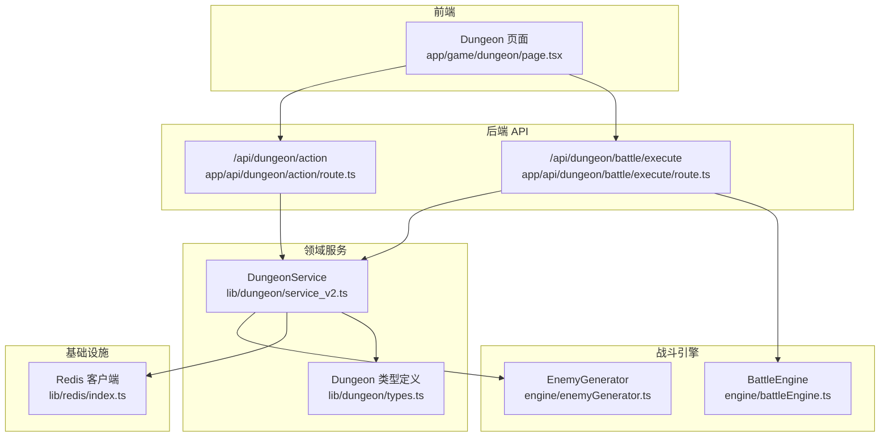
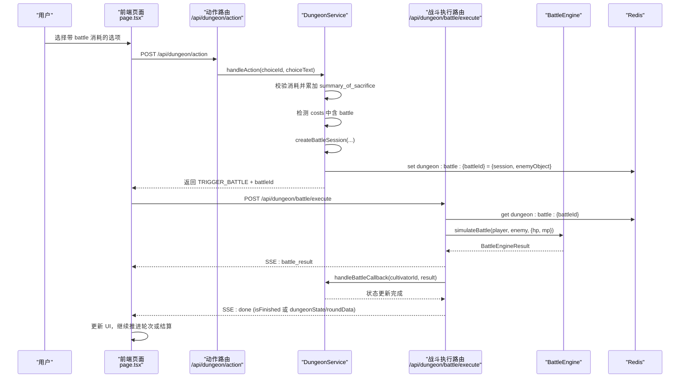
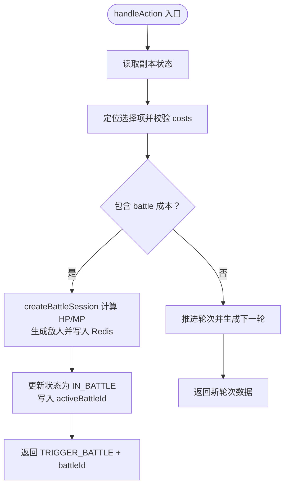
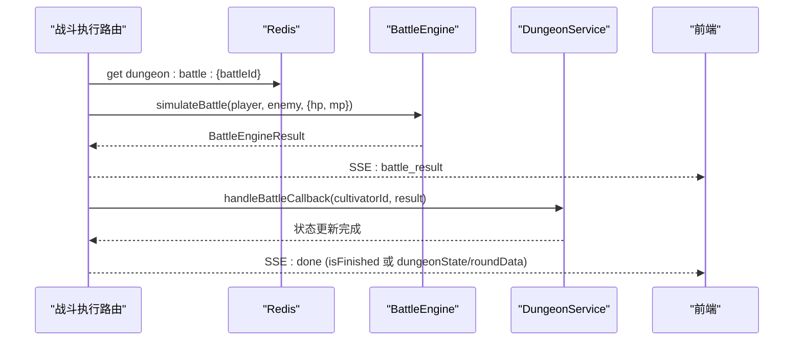
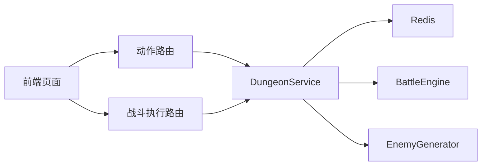

# 战斗集成

<cite>
**本文引用的文件列表**
- [app/api/dungeon/action/route.ts](file://app/api/dungeon/action/route.ts)
- [app/api/dungeon/battle/execute/route.ts](file://app/api/dungeon/battle/execute/route.ts)
- [engine/battleEngine.ts](file://engine/battleEngine.ts)
- [engine/enemyGenerator.ts](file://engine/enemyGenerator.ts)
- [lib/dungeon/service_v2.ts](file://lib/dungeon/service_v2.ts)
- [lib/dungeon/types.ts](file://lib/dungeon/types.ts)
- [lib/redis/index.ts](file://lib/redis/index.ts)
- [app/game/dungeon/page.tsx](file://app/game/dungeon/page.tsx)
</cite>

## 目录
1. [引言](#引言)
2. [项目结构](#项目结构)
3. [核心组件](#核心组件)
4. [架构总览](#架构总览)
5. [详细组件分析](#详细组件分析)
6. [依赖关系分析](#依赖关系分析)
7. [性能考量](#性能考量)
8. [故障排查指南](#故障排查指南)
9. [结论](#结论)

## 引言
本文件聚焦于副本系统与主战斗引擎的集成机制，围绕以下目标展开：
- 解析 handleAction 中的“战斗拦截”（Battle Interception）逻辑：当玩家选择带有 battle 消耗的选项时，如何触发战斗会话创建与状态切换。
- 说明 createBattleSession 如何基于 summary_of_sacrifice 计算玩家当前气血（HP）与灵力（MP），并利用 enemyGenerator 生成符合难度系数与敌人特征的对手。
- 描述战斗会话数据（BattleSession）在 Redis 中的存储结构（dungeon:battle:{battleId}）及其包含的玩家快照与敌人对象。
- 解释 handleBattleCallback 如何接收 BattleEngineResult，更新副本历史，并根据战斗结果推进副本轮次或直接进入结算。
- 总结该集成如何实现副本叙事与战斗系统的无缝衔接，确保剧情与实战的连贯性。

## 项目结构
本项目采用前后端分离的 API 设计，副本系统位于 lib/dungeon，战斗引擎位于 engine，前端页面位于 app/game/dungeon。二者通过 API 路由进行交互，战斗会话通过 Redis 进行临时存储。

图表来源
- [app/game/dungeon/page.tsx](file://app/game/dungeon/page.tsx#L1-L629)
- [app/api/dungeon/action/route.ts](file://app/api/dungeon/action/route.ts#L1-L52)
- [app/api/dungeon/battle/execute/route.ts](file://app/api/dungeon/battle/execute/route.ts#L1-L181)
- [lib/dungeon/service_v2.ts](file://lib/dungeon/service_v2.ts#L1-L545)
- [lib/dungeon/types.ts](file://lib/dungeon/types.ts#L1-L201)
- [engine/battleEngine.ts](file://engine/battleEngine.ts#L1-L830)
- [engine/enemyGenerator.ts](file://engine/enemyGenerator.ts#L1-L189)
- [lib/redis/index.ts](file://lib/redis/index.ts#L1-L6)

章节来源
- [app/game/dungeon/page.tsx](file://app/game/dungeon/page.tsx#L1-L629)
- [app/api/dungeon/action/route.ts](file://app/api/dungeon/action/route.ts#L1-L52)
- [app/api/dungeon/battle/execute/route.ts](file://app/api/dungeon/battle/execute/route.ts#L1-L181)
- [lib/dungeon/service_v2.ts](file://lib/dungeon/service_v2.ts#L1-L545)
- [lib/dungeon/types.ts](file://lib/dungeon/types.ts#L1-L201)
- [engine/battleEngine.ts](file://engine/battleEngine.ts#L1-L830)
- [engine/enemyGenerator.ts](file://engine/enemyGenerator.ts#L1-L189)
- [lib/redis/index.ts](file://lib/redis/index.ts#L1-L6)

## 核心组件
- 副本服务（DungeonService）：负责副本状态管理、AI 轮次生成、战斗拦截与回调处理、结算与归档。
- 战斗引擎（BattleEngine）：负责模拟战斗、回合制战斗流程、状态与技能逻辑、输出 BattleEngineResult。
- 敌人生成器（EnemyGenerator）：基于玩家信息与难度系数，生成符合修仙体系的敌人数据。
- 前端页面（Dungeon 页面）：负责用户交互、触发副本动作、发起战斗执行流、展示战斗报告与时间线。
- Redis：用于持久化副本状态与战斗会话，键空间包括 dungeon:active:{cultivatorId} 与 dungeon:battle:{battleId}。

章节来源
- [lib/dungeon/service_v2.ts](file://lib/dungeon/service_v2.ts#L1-L545)
- [engine/battleEngine.ts](file://engine/battleEngine.ts#L1-L830)
- [engine/enemyGenerator.ts](file://engine/enemyGenerator.ts#L1-L189)
- [app/game/dungeon/page.tsx](file://app/game/dungeon/page.tsx#L1-L629)
- [lib/redis/index.ts](file://lib/redis/index.ts#L1-L6)

## 架构总览
副本系统与战斗引擎的集成遵循“选项驱动 + 拦截触发 + 会话存储 + 流式回调”的闭环：
- 用户在副本页面选择选项，前端调用 /api/dungeon/action。
- 后端 DungeonService.handleAction 校验消耗，若存在 battle 成本，则进入“战斗拦截”，调用 createBattleSession 创建会话并保存到 Redis，同时将状态切换为 IN_BATTLE。
- 前端收到 TRIGGER_BATTLE 后弹出确认，点击后调用 /api/dungeon/battle/execute，后端从 Redis 读取会话，调用 BattleEngine.simulateBattle，返回 BattleEngineResult。
- 后端在流式响应中先发送 battle_result，再并发启动 dungeonService.handleBattleCallback，完成后发送 done（包含 isFinished 或 dungeonState/roundData）。
- 前端接收 done 后更新副本状态，继续推进轮次或进入结算。

图表来源
- [app/api/dungeon/action/route.ts](file://app/api/dungeon/action/route.ts#L1-L52)
- [app/api/dungeon/battle/execute/route.ts](file://app/api/dungeon/battle/execute/route.ts#L1-L181)
- [lib/dungeon/service_v2.ts](file://lib/dungeon/service_v2.ts#L139-L204)
- [lib/dungeon/service_v2.ts](file://lib/dungeon/service_v2.ts#L210-L276)
- [lib/dungeon/service_v2.ts](file://lib/dungeon/service_v2.ts#L278-L324)
- [engine/battleEngine.ts](file://engine/battleEngine.ts#L674-L830)
- [lib/redis/index.ts](file://lib/redis/index.ts#L1-L6)

## 详细组件分析

### 副本动作拦截与战斗会话创建（handleAction 与 createBattleSession）
- 拦截逻辑
  - handleAction 读取当前轮次选项，校验 costs 中是否存在 battle 类型。
  - 若存在，将状态切换为 IN_BATTLE，并调用 createBattleSession 生成 BattleSession。
  - 将 activeBattleId 写入副本状态，保存到 Redis。
  - 返回 TRIGGER_BATTLE 与 battleId，前端据此弹出确认并准备发起战斗执行。
- 会话创建
  - createBattleSession 基于 summary_of_sacrifice 与当前 battleCost 计算当前 HP/MP（通过 hp_loss、mp_loss 累加与基础公式换算）。
  - 使用 enemyGenerator.generate 生成敌人，难度系数来自 battleCost.value，metadata 来自 battleCost.metadata。
  - 将 BattleSession 与 enemyObject 以 JSON 形式写入 Redis，键为 dungeon:battle:{battleId}，设置 TTL。
- 数据模型
  - BattleSession 字段包含 battleId、dungeonStateKey、cultivatorId、enemyData（含难度）、playerSnapshot（currentHp/currentMp）。
  - 类型定义见 lib/dungeon/types.ts。

图表来源
- [lib/dungeon/service_v2.ts](file://lib/dungeon/service_v2.ts#L139-L204)
- [lib/dungeon/service_v2.ts](file://lib/dungeon/service_v2.ts#L210-L276)
- [lib/dungeon/types.ts](file://lib/dungeon/types.ts#L161-L179)

章节来源
- [lib/dungeon/service_v2.ts](file://lib/dungeon/service_v2.ts#L139-L204)
- [lib/dungeon/service_v2.ts](file://lib/dungeon/service_v2.ts#L210-L276)
- [lib/dungeon/types.ts](file://lib/dungeon/types.ts#L161-L179)

### 战斗会话数据在 Redis 的存储结构
- 键名：dungeon:battle:{battleId}
- 值：包含 session 与 enemyObject 的对象，其中 session 为 BattleSession，enemyObject 为生成的敌人对象。
- TTL：3600 秒（1 小时）。
- 作用：供战斗执行路由在发起战斗时读取，避免重复生成敌人与会话。

章节来源
- [lib/dungeon/service_v2.ts](file://lib/dungeon/service_v2.ts#L268-L276)
- [lib/redis/index.ts](file://lib/redis/index.ts#L1-L6)

### 战斗执行与回调（simulateBattle 与 handleBattleCallback）
- 发起战斗
  - 前端调用 /api/dungeon/battle/execute，后端从 Redis 读取 dungeon:battle:{battleId}，获取 session 与 enemyObject。
  - 从数据库加载玩家快照（当前回合的属性），调用 BattleEngine.simulateBattle(player, enemy, {hp, mp})。
  - 通过 SSE 流式返回 battle_result，随后并发调用 dungeonService.handleBattleCallback。
- 回调处理
  - handleBattleCallback 将状态从 IN_BATTLE 切回 EXPLORING，清理 activeBattleId。
  - 基于 BattleEngineResult 构造叙事文本（胜负、回合数、敌人名），写入 lastHistory.outcome。
  - 轮次自增，若超过最大轮次则进入 settleDungeon，否则继续 AI 生成下一轮并保存状态。

图表来源
- [app/api/dungeon/battle/execute/route.ts](file://app/api/dungeon/battle/execute/route.ts#L1-L181)
- [engine/battleEngine.ts](file://engine/battleEngine.ts#L674-L830)
- [lib/dungeon/service_v2.ts](file://lib/dungeon/service_v2.ts#L278-L324)

章节来源
- [app/api/dungeon/battle/execute/route.ts](file://app/api/dungeon/battle/execute/route.ts#L1-L181)
- [engine/battleEngine.ts](file://engine/battleEngine.ts#L674-L830)
- [lib/dungeon/service_v2.ts](file://lib/dungeon/service_v2.ts#L278-L324)

### 敌人生成与难度适配（enemyGenerator）
- 输入：metadata（enemy_name、enemy_realm、enemy_stage、is_boss）、difficulty（1-10）、playerInfo。
- 逻辑要点：
  - 根据难度系数调整敌人属性与技能数量/威力。
  - Boss（is_boss=true）强制配备强力法宝武器。
  - 输出符合修仙体系的 Cultivator 对象，包含属性、根骨、技能、装备等字段。
- 与副本集成：createBattleSession 调用 enemyGenerator.generate，将 metadata 与 difficulty 传递给生成器。

章节来源
- [engine/enemyGenerator.ts](file://engine/enemyGenerator.ts#L1-L189)
- [lib/dungeon/service_v2.ts](file://lib/dungeon/service_v2.ts#L240-L249)

### 前端交互与流式渲染
- 前端页面负责：
  - 读取当前副本状态，展示场景与选项。
  - 触发 /api/dungeon/action，接收 TRIGGER_BATTLE 后弹出确认。
  - 点击确认后发起 /api/dungeon/battle/execute，解析 SSE 流，先显示 battle_result，再渲染 AI 战斗报告，最后接收 done 更新 UI。
- 与后端协同：前端在 battle_end 为真时允许继续探险，否则保持“战斗中”。

章节来源
- [app/game/dungeon/page.tsx](file://app/game/dungeon/page.tsx#L1-L629)

## 依赖关系分析
- 组件耦合
  - 前端仅依赖后端 API，通过 SSE 与 JSON 事件进行解耦。
  - 后端 API 与服务层解耦：/api/dungeon/action 与 /api/dungeon/battle/execute 分别委托给 DungeonService 的不同方法。
  - 服务层依赖 Redis 与战斗引擎，enemyGenerator 作为外部生成器注入。
- 外部依赖
  - Redis 提供会话与状态的临时存储。
  - AI 客户端用于生成轮次与结算（在服务层中调用）。

图表来源
- [app/game/dungeon/page.tsx](file://app/game/dungeon/page.tsx#L1-L629)
- [app/api/dungeon/action/route.ts](file://app/api/dungeon/action/route.ts#L1-L52)
- [app/api/dungeon/battle/execute/route.ts](file://app/api/dungeon/battle/execute/route.ts#L1-L181)
- [lib/dungeon/service_v2.ts](file://lib/dungeon/service_v2.ts#L1-L545)
- [engine/battleEngine.ts](file://engine/battleEngine.ts#L1-L830)
- [engine/enemyGenerator.ts](file://engine/enemyGenerator.ts#L1-L189)
- [lib/redis/index.ts](file://lib/redis/index.ts#L1-L6)

## 性能考量
- 流式传输：战斗执行路由采用 SSE，先发送 battle_result，再并发处理状态更新，减少前端等待时间。
- 会话复用：战斗会话写入 Redis，避免重复生成敌人与会话，降低 CPU 与 IO 压力。
- 历史压缩：AI 生成轮次时对历史进行摘要，减少 Token 消耗与延迟。
- 限制回合：战斗引擎设置最大回合上限，防止长耗时战斗阻塞。

章节来源
- [app/api/dungeon/battle/execute/route.ts](file://app/api/dungeon/battle/execute/route.ts#L80-L151)
- [lib/dungeon/service_v2.ts](file://lib/dungeon/service_v2.ts#L391-L413)
- [engine/battleEngine.ts](file://engine/battleEngine.ts#L715-L800)

## 故障排查指南
- 未授权访问
  - API 路由均需通过 Supabase 认证，若返回 401，检查用户登录状态。
- 无活跃角色
  - 若未找到 active cultivator，返回 404，需先激活角色。
- 会话过期
  - dungeon:battle:{battleId} TTL 为 1 小时，若返回“会话过期或无效”，需重新触发战斗拦截。
- 模拟战斗失败
  - SSE 流中若收到 error 事件，前端应提示“战斗模拟失败”，并允许重试或放弃。
- 副本状态异常
  - 若状态为 IN_BATTLE 但无 activeBattleId，或反之，需检查 Redis 中 dungeon:active:{cultivatorId} 是否一致。

章节来源
- [app/api/dungeon/action/route.ts](file://app/api/dungeon/action/route.ts#L1-L52)
- [app/api/dungeon/battle/execute/route.ts](file://app/api/dungeon/battle/execute/route.ts#L43-L80)
- [lib/dungeon/service_v2.ts](file://lib/dungeon/service_v2.ts#L278-L324)

## 结论
副本系统与战斗引擎的集成通过“选项驱动 + 拦截触发 + 会话存储 + 流式回调”实现了无缝衔接：
- 选项中的 battle 成本成为战斗触发器，DungeonService 在拦截后创建 BattleSession 并写入 Redis。
- 前端通过 SSE 实时接收战斗结果与叙事报告，回调完成后继续推进副本轮次或进入结算。
- enemyGenerator 依据难度与玩家信息生成合理敌人，保证战斗挑战性与叙事一致性。
- 该机制既满足了剧情推进的节奏感，又提供了沉浸式的战斗反馈，实现了“剧情—实战”的自然过渡。